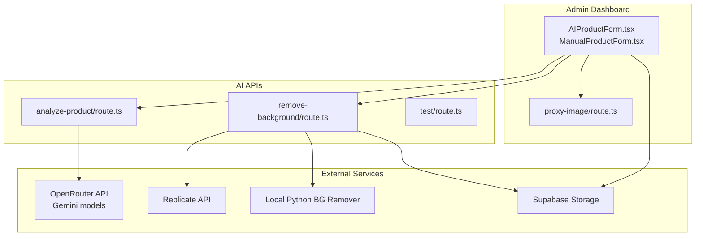
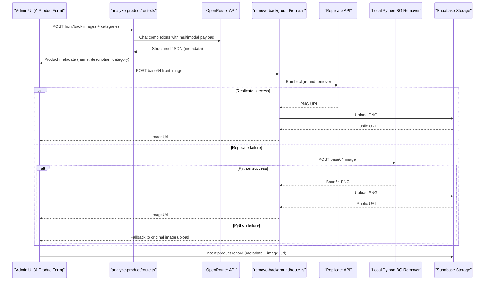
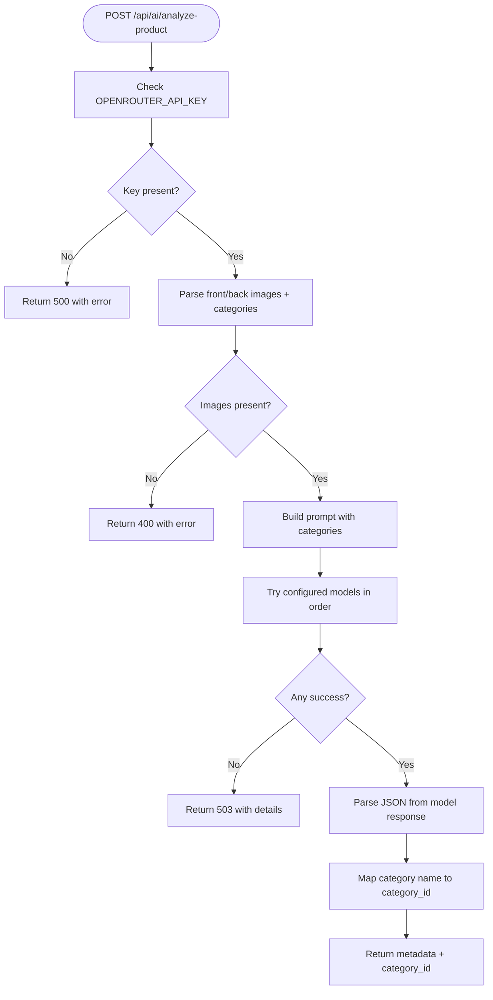
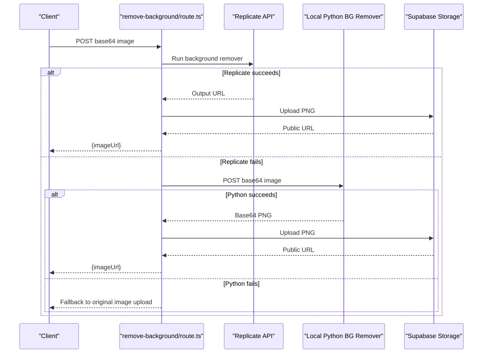
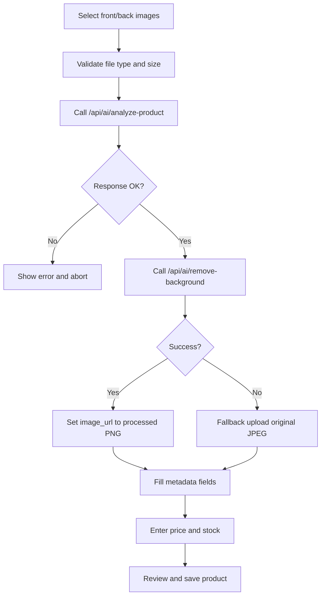
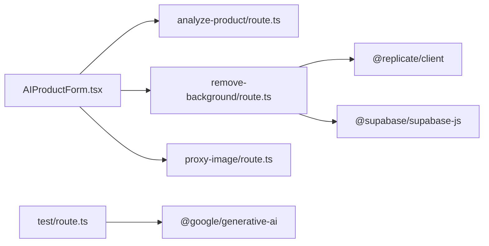

# AI and Machine Learning Features

<cite>
**Referenced Files in This Document**
- [admin/src/app/api/ai/analyze-product/route.ts](file://admin/src/app/api/ai/analyze-product/route.ts)
- [admin/src/app/api/ai/remove-background/route.ts](file://admin/src/app/api/ai/remove-background/route.ts)
- [admin/src/app/api/ai/test/route.ts](file://admin/src/app/api/ai/test/route.ts)
- [admin/src/app/api/proxy-image/route.ts](file://admin/src/app/api/proxy-image/route.ts)
- [admin/src/components/products/AIProductForm.tsx](file://admin/src/components/products/AIProductForm.tsx)
- [admin/src/components/products/ManualProductForm.tsx](file://admin/src/components/products/ManualProductForm.tsx)
- [admin/AI_PRODUCT_FEATURE.md](file://admin/AI_PRODUCT_FEATURE.md)
- [admin/SETUP_AI_PRODUCT.md](file://admin/SETUP_AI_PRODUCT.md)
- [admin/package.json](file://admin/package.json)
</cite>

## Table of Contents
1. [Introduction](#introduction)
2. [Project Structure](#project-structure)
3. [Core Components](#core-components)
4. [Architecture Overview](#architecture-overview)
5. [Detailed Component Analysis](#detailed-component-analysis)
6. [Dependency Analysis](#dependency-analysis)
7. [Performance Considerations](#performance-considerations)
8. [Troubleshooting Guide](#troubleshooting-guide)
9. [Conclusion](#conclusion)
10. [Appendices](#appendices)

## Introduction
This document explains the AI-powered features and machine learning integrations for product creation and image processing. It covers:
- Gemini API integration for product analysis and automatic metadata extraction from front and back product images
- Background removal using Replicate API with a local Python fallback
- The AI product creation workflow from image upload to saving in the database
- Custom API endpoints for AI services and their integration with the admin dashboard
- Fallback systems, error handling, and quality control measures
- Setup requirements, API key management, and cost optimization strategies
- Troubleshooting guidance, performance optimization tips, and extension guidelines

## Project Structure
The AI features are implemented in the admin panel under the Next.js app router. The key components are:
- API routes for AI analysis and background removal
- Frontend forms for AI-driven product creation and manual creation
- Proxy endpoint for external image fetching
- Documentation and setup guides

**Diagram sources**
- [admin/src/app/api/ai/analyze-product/route.ts:1-221](file://admin/src/app/api/ai/analyze-product/route.ts#L1-L221)
- [admin/src/app/api/ai/remove-background/route.ts:1-152](file://admin/src/app/api/ai/remove-background/route.ts#L1-L152)
- [admin/src/app/api/ai/test/route.ts:1-37](file://admin/src/app/api/ai/test/route.ts#L1-L37)
- [admin/src/app/api/proxy-image/route.ts:1-42](file://admin/src/app/api/proxy-image/route.ts#L1-L42)
- [admin/src/components/products/AIProductForm.tsx:1-670](file://admin/src/components/products/AIProductForm.tsx#L1-L670)
- [admin/src/components/products/ManualProductForm.tsx:1-255](file://admin/src/components/products/ManualProductForm.tsx#L1-L255)

**Section sources**
- [admin/AI_PRODUCT_FEATURE.md:1-201](file://admin/AI_PRODUCT_FEATURE.md#L1-L201)
- [admin/SETUP_AI_PRODUCT.md:1-243](file://admin/SETUP_AI_PRODUCT.md#L1-L243)

## Core Components
- AI Product Analysis API: Accepts front/back images and categories, queries OpenRouter/Gemini, parses structured JSON, selects the best-matching category, and returns product metadata.
- Background Removal API: Uses Replicate API to remove backgrounds from product images, with a local Python fallback and uploads the result to Supabase Storage.
- AI Product Form: Guides users through image selection, triggers AI analysis and background removal, allows editing extracted metadata, and saves the product to the database.
- Manual Product Form: Traditional product creation without AI.
- Proxy Image Endpoint: Fetches external images and returns them to the client for preview or processing.

**Section sources**
- [admin/src/app/api/ai/analyze-product/route.ts:1-221](file://admin/src/app/api/ai/analyze-product/route.ts#L1-L221)
- [admin/src/app/api/ai/remove-background/route.ts:1-152](file://admin/src/app/api/ai/remove-background/route.ts#L1-L152)
- [admin/src/components/products/AIProductForm.tsx:1-670](file://admin/src/components/products/AIProductForm.tsx#L1-L670)
- [admin/src/components/products/ManualProductForm.tsx:1-255](file://admin/src/components/products/ManualProductForm.tsx#L1-L255)
- [admin/src/app/api/proxy-image/route.ts:1-42](file://admin/src/app/api/proxy-image/route.ts#L1-L42)

## Architecture Overview
The AI product creation workflow integrates frontend UI, backend API routes, external AI services, and Supabase storage.

**Diagram sources**
- [admin/src/components/products/AIProductForm.tsx:76-199](file://admin/src/components/products/AIProductForm.tsx#L76-L199)
- [admin/src/app/api/ai/analyze-product/route.ts:71-220](file://admin/src/app/api/ai/analyze-product/route.ts#L71-L220)
- [admin/src/app/api/ai/remove-background/route.ts:12-151](file://admin/src/app/api/ai/remove-background/route.ts#L12-L151)

## Detailed Component Analysis

### AI Product Analysis API
- Purpose: Analyze front and back product images to extract Arabic/English name, detailed descriptions, and category using a multimodal model via OpenRouter.
- Input: Base64-encoded front/back images and a list of active categories.
- Processing:
  - Validates environment variables and request payload.
  - Builds a prompt with category mapping rules.
  - Iterates through configured models, attempting each until success.
  - Parses returned JSON, normalizes category name, and resolves category ID.
- Output: Clean product metadata and selected category ID.
- Error handling: Returns structured errors for invalid keys, missing images, parsing failures, and model exhaustion.

**Diagram sources**
- [admin/src/app/api/ai/analyze-product/route.ts:71-220](file://admin/src/app/api/ai/analyze-product/route.ts#L71-L220)

**Section sources**
- [admin/src/app/api/ai/analyze-product/route.ts:1-221](file://admin/src/app/api/ai/analyze-product/route.ts#L1-L221)

### Background Removal API
- Purpose: Remove product image backgrounds using Replicate API and upload the result to Supabase Storage.
- Input: Base64-encoded image.
- Processing:
  - Calls Replicate with a background remover model.
  - Handles output URL resolution and fetches resulting PNG.
  - Converts to base64 and uploads to Supabase Storage bucket “products”.
  - On failure, attempts a local Python API fallback on localhost:5000.
  - If both fail, returns the original image upload as a fallback.
- Output: Public URL of the processed image.

**Diagram sources**
- [admin/src/app/api/ai/remove-background/route.ts:12-151](file://admin/src/app/api/ai/remove-background/route.ts#L12-L151)

**Section sources**
- [admin/src/app/api/ai/remove-background/route.ts:1-152](file://admin/src/app/api/ai/remove-background/route.ts#L1-L152)

### AI Product Creation Workflow (Frontend)
- Purpose: End-to-end wizard for AI-assisted product creation.
- Steps:
  1) Upload front/back images with validation (type and size).
  2) Trigger AI analysis and background removal.
  3) Edit extracted metadata and enter price/stock.
  4) Review and save to Supabase.
- Key behaviors:
  - Converts images to compressed base64.
  - Calls analyze-product and remove-background endpoints.
  - Falls back to original image upload if background removal fails.
  - Inserts product record with computed USD price and active flag.

**Diagram sources**
- [admin/src/components/products/AIProductForm.tsx:76-278](file://admin/src/components/products/AIProductForm.tsx#L76-L278)

**Section sources**
- [admin/src/components/products/AIProductForm.tsx:1-670](file://admin/src/components/products/AIProductForm.tsx#L1-L670)

### Manual Product Creation (Frontend)
- Purpose: Traditional product creation without AI.
- Features:
  - Upload product image to Supabase Storage.
  - Fill metadata, pricing, category, and stock.
  - Save product record.

**Section sources**
- [admin/src/components/products/ManualProductForm.tsx:1-255](file://admin/src/components/products/ManualProductForm.tsx#L1-L255)

### Proxy Image Endpoint
- Purpose: Fetch external images and serve them to the client to avoid CORS issues during preview or processing.
- Behavior: Validates URL, fetches content, and returns binary response with appropriate headers.

**Section sources**
- [admin/src/app/api/proxy-image/route.ts:1-42](file://admin/src/app/api/proxy-image/route.ts#L1-L42)

### AI Service Health Check
- Purpose: Verify Gemini API connectivity using a lightweight test request.
- Behavior: Initializes client, generates content, and returns success or error details.

**Section sources**
- [admin/src/app/api/ai/test/route.ts:1-37](file://admin/src/app/api/ai/test/route.ts#L1-L37)

## Dependency Analysis
- External libraries:
  - @google/generative-ai: Used by the test endpoint for Gemini.
  - replicate: Used by the background removal API for Replicate integration.
  - @supabase/supabase-js: Used by background removal API for Supabase Storage operations.
- Internal dependencies:
  - AIProductForm orchestrates API calls and state transitions.
  - ManualProductForm handles traditional uploads and saves.

**Diagram sources**
- [admin/src/components/products/AIProductForm.tsx:1-670](file://admin/src/components/products/AIProductForm.tsx#L1-L670)
- [admin/src/app/api/ai/analyze-product/route.ts:1-221](file://admin/src/app/api/ai/analyze-product/route.ts#L1-L221)
- [admin/src/app/api/ai/remove-background/route.ts:1-152](file://admin/src/app/api/ai/remove-background/route.ts#L1-L152)
- [admin/src/app/api/ai/test/route.ts:1-37](file://admin/src/app/api/ai/test/route.ts#L1-L37)
- [admin/package.json:11-26](file://admin/package.json#L11-L26)

**Section sources**
- [admin/package.json:11-26](file://admin/package.json#L11-L26)

## Performance Considerations
- Image compression: Frontend compresses images to reduce payload sizes before sending to AI APIs.
- Streaming/fallback uploads: If background removal fails, the system uploads the original image to maintain responsiveness.
- Model rotation: The analysis endpoint tries multiple models in order, improving reliability and reducing single-point-of-failure risk.
- Caching: Consider caching frequently used prompts or model outputs at the application level to reduce latency.
- Parallelization: Background removal and product insertion can be parallelized after metadata extraction.

[No sources needed since this section provides general guidance]

## Troubleshooting Guide
Common issues and resolutions:
- AI analysis returns no JSON or parsing error:
  - Verify OpenRouter API key and model availability.
  - Confirm images are clear and properly oriented.
- Background removal fails:
  - Ensure Replicate API token is configured.
  - If Replicate fails, confirm the local Python API is running on port 5000 and healthy.
- Original image fallback upload fails:
  - Check Supabase credentials and bucket permissions.
- Non-JSON response from AI endpoints:
  - Indicates middleware or routing issues; refresh the page and retry.
- Gemini health check fails:
  - Validate the API key and network connectivity.

**Section sources**
- [admin/src/app/api/ai/analyze-product/route.ts:75-80](file://admin/src/app/api/ai/analyze-product/route.ts#L75-L80)
- [admin/src/app/api/ai/remove-background/route.ts:34-51](file://admin/src/app/api/ai/remove-background/route.ts#L34-L51)
- [admin/src/app/api/ai/test/route.ts:25-35](file://admin/src/app/api/ai/test/route.ts#L25-L35)
- [admin/AI_PRODUCT_FEATURE.md:147-164](file://admin/AI_PRODUCT_FEATURE.md#L147-L164)

## Conclusion
The AI and machine learning features streamline product onboarding by automating metadata extraction and background removal while maintaining robust fallbacks and error handling. The modular design enables easy extension to new models, providers, and quality control steps.

[No sources needed since this section summarizes without analyzing specific files]

## Appendices

### Setup Requirements and API Keys
- OpenRouter API key for Gemini-based analysis
- Replicate API token for background removal
- Supabase credentials for storage
- Local Python API for background removal fallback (optional but recommended)

**Section sources**
- [admin/SETUP_AI_PRODUCT.md:14-77](file://admin/SETUP_AI_PRODUCT.md#L14-L77)
- [admin/src/app/api/ai/analyze-product/route.ts:4-8](file://admin/src/app/api/ai/analyze-product/route.ts#L4-L8)
- [admin/src/app/api/ai/remove-background/route.ts:10-10](file://admin/src/app/api/ai/remove-background/route.ts#L10-L10)

### Cost Optimization Strategies
- Use compressed images to minimize bandwidth and processing time.
- Prefer local fallbacks (Python) for background removal to reduce external API costs.
- Batch operations where feasible to reduce overhead.
- Monitor quotas and rotate models to balance cost and accuracy.

[No sources needed since this section provides general guidance]

### Extending AI Capabilities
- Add new AI endpoints behind /api/ai with clear input/output contracts.
- Introduce quality gates (confidence thresholds) before saving product records.
- Support additional languages by adjusting prompts and models.
- Integrate alternative providers by adding model rotation and provider-specific parsing.

[No sources needed since this section provides general guidance]