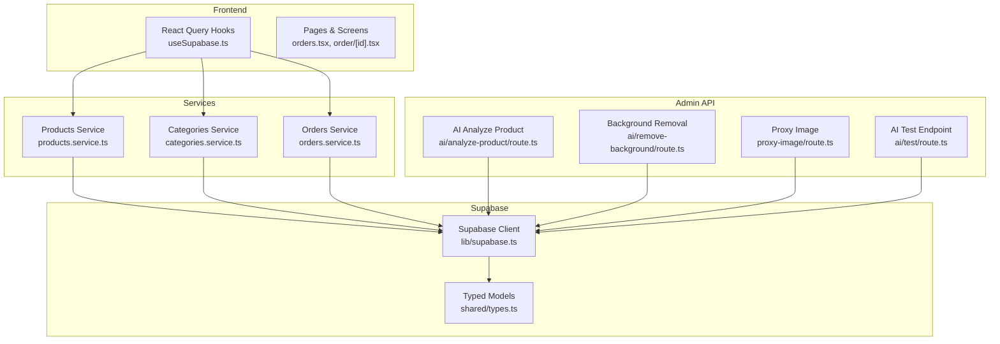
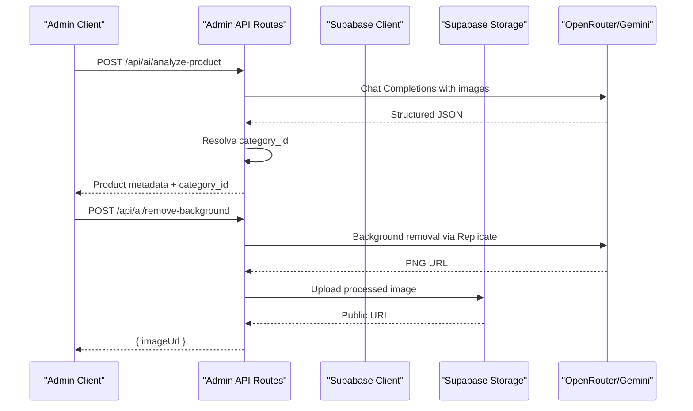
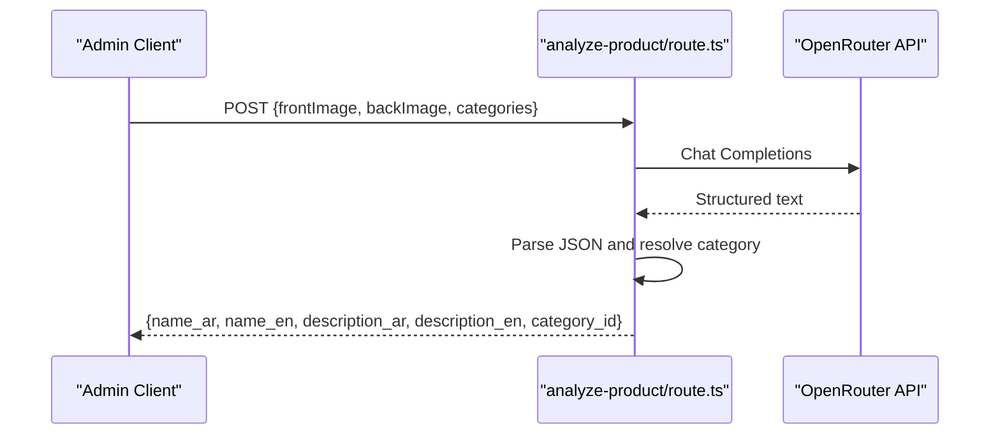
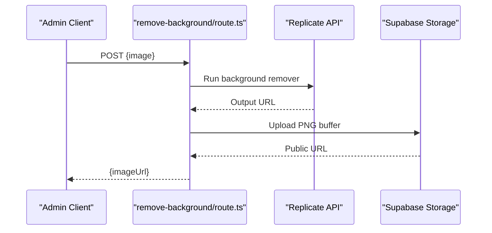
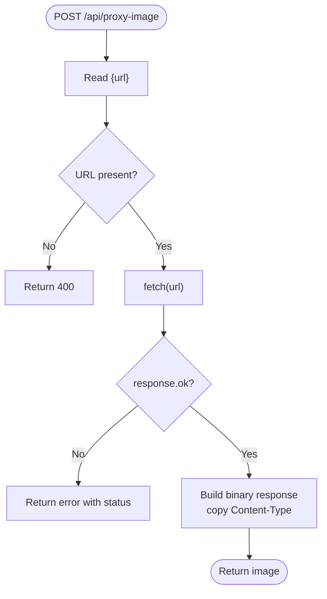
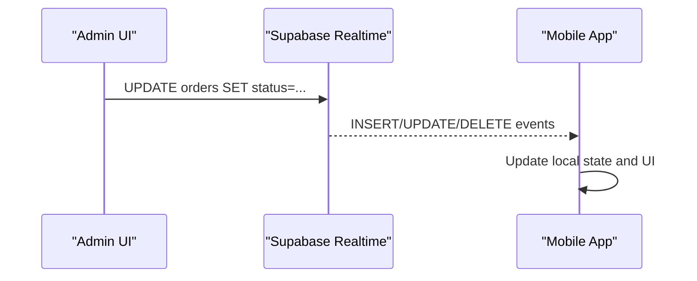
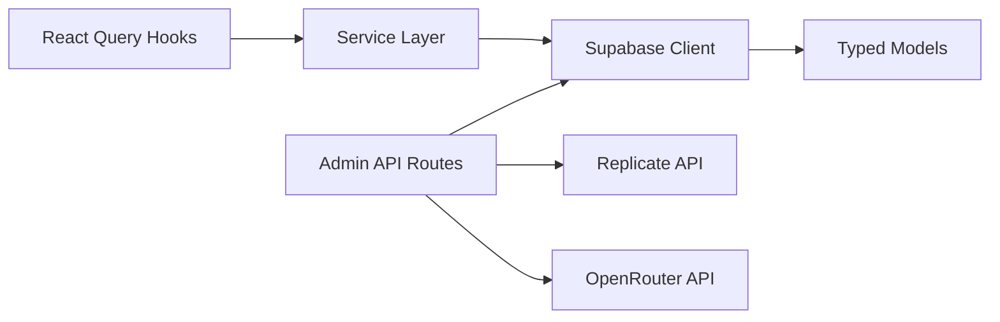

# API Reference

<cite>
**Referenced Files in This Document**
- [route.ts](file://admin/src/app/api/ai/analyze-product/route.ts)
- [route.ts](file://admin/src/app/api/ai/remove-background/route.ts)
- [route.ts](file://admin/src/app/api/proxy-image/route.ts)
- [route.ts](file://admin/src/app/api/ai/test/route.ts)
- [supabase.ts](file://lib/supabase.ts)
- [products.service.ts](file://services/products.service.ts)
- [categories.service.ts](file://services/categories.service.ts)
- [orders.service.ts](file://services/orders.service.ts)
- [types.ts](file://shared/types.ts)
- [useSupabase.ts](file://hooks/useSupabase.ts)
- [middleware.ts](file://admin/src/middleware.ts)
- [orders.tsx](file://app/orders.tsx)
- [order/[id].tsx](file://app/order/[id].tsx)
- [ORDERS_REALTIME_SETUP.md](file://.docs/ORDERS_REALTIME_SETUP.md)
- [proxy.ts](file://web/src/proxy.ts)
</cite>

## Table of Contents
1. [Introduction](#introduction)
2. [Project Structure](#project-structure)
3. [Core Components](#core-components)
4. [Architecture Overview](#architecture-overview)
5. [Detailed Component Analysis](#detailed-component-analysis)
6. [Dependency Analysis](#dependency-analysis)
7. [Performance Considerations](#performance-considerations)
8. [Troubleshooting Guide](#troubleshooting-guide)
9. [Conclusion](#conclusion)
10. [Appendices](#appendices)

## Introduction
This document provides comprehensive API documentation for the Supabase-backed commerce platform. It covers:
- Supabase REST and real-time integrations for database operations, authentication, and storage
- Custom admin API endpoints for AI product analysis, image processing, and proxy utilities
- Service-layer APIs for products, categories, and orders
- Real-time subscriptions and event-driven updates
- Pagination, rate limiting, and versioning strategies
- Practical examples, SDK usage patterns, and integration guidelines

## Project Structure
The API surface spans three primary areas:
- Supabase client configuration and typed models
- Service layer implementing CRUD and business queries
- Admin API routes for AI/image utilities and proxy helpers
- Frontend hooks integrating with Supabase and real-time channels

**Diagram sources**
- [useSupabase.ts:1-239](file://hooks/useSupabase.ts#L1-L239)
- [products.service.ts:1-449](file://services/products.service.ts#L1-L449)
- [categories.service.ts:1-137](file://services/categories.service.ts#L1-L137)
- [orders.service.ts:1-115](file://services/orders.service.ts#L1-L115)
- [route.ts](file://admin/src/app/api/ai/analyze-product/route.ts)
- [route.ts](file://admin/src/app/api/ai/remove-background/route.ts)
- [route.ts](file://admin/src/app/api/proxy-image/route.ts)
- [route.ts](file://admin/src/app/api/ai/test/route.ts)
- [supabase.ts:1-30](file://lib/supabase.ts#L1-L30)
- [types.ts:1-353](file://shared/types.ts#L1-L353)

**Section sources**
- [supabase.ts:1-30](file://lib/supabase.ts#L1-L30)
- [types.ts:1-353](file://shared/types.ts#L1-L353)
- [useSupabase.ts:1-239](file://hooks/useSupabase.ts#L1-L239)

## Core Components
- Supabase client configured with AsyncStorage-backed auth persistence and automatic token refresh
- Typed models generated from Supabase schema for products, categories, orders, and related entities
- Service layer encapsulating Supabase queries with pagination, filtering, sorting, and fallback logic
- Admin API routes for AI-assisted product analysis, background removal, and image proxying

**Section sources**
- [supabase.ts:1-30](file://lib/supabase.ts#L1-L30)
- [types.ts:1-353](file://shared/types.ts#L1-L353)
- [products.service.ts:1-449](file://services/products.service.ts#L1-L449)
- [categories.service.ts:1-137](file://services/categories.service.ts#L1-L137)
- [orders.service.ts:1-115](file://services/orders.service.ts#L1-L115)

## Architecture Overview
The system integrates:
- Supabase Auth for session management and role-based access control
- Supabase Realtime for live updates to orders and related entities
- Supabase Storage for product images with public URLs
- Third-party AI APIs (OpenRouter/Gemini) for product metadata extraction
- Local fallbacks for image processing and proxying

**Diagram sources**
- [route.ts](file://admin/src/app/api/ai/analyze-product/route.ts)
- [route.ts](file://admin/src/app/api/ai/remove-background/route.ts)
- [supabase.ts:1-30](file://lib/supabase.ts#L1-L30)

## Detailed Component Analysis

### Supabase REST API Integration
- Authentication
  - Session persistence via AsyncStorage
  - Auto-refresh tokens and detection disabled for URL-based sessions
- Database Operations
  - Products: list, filter, search, bestsellers, trending, similar, special offers
  - Categories: hierarchical retrieval, main categories with subcategories
  - Orders: creation, item insertion, retrieval by user, status/payment updates
- Storage
  - Upload images to the products bucket with cache control and public URL generation

**Section sources**
- [supabase.ts:1-30](file://lib/supabase.ts#L1-L30)
- [products.service.ts:1-449](file://services/products.service.ts#L1-L449)
- [categories.service.ts:1-137](file://services/categories.service.ts#L1-L137)
- [orders.service.ts:1-115](file://services/orders.service.ts#L1-L115)
- [types.ts:1-353](file://shared/types.ts#L1-L353)

### Admin API Endpoints

#### AI Product Analysis
- Method: POST
- URL: /api/ai/analyze-product
- Request JSON
  - frontImage: Base64 JPEG
  - backImage: Base64 JPEG
  - categories: Array of category objects with name_ar, name, id
- Response JSON
  - name_ar, name_en, description_ar, description_en, category_id
  - _debug: model used
- Validation
  - Requires both frontImage and backImage
  - Validates AI response parsing and category match
- Errors
  - 400: Missing images
  - 500: Missing API key or internal failure
  - 503: All models failed

**Diagram sources**
- [route.ts](file://admin/src/app/api/ai/analyze-product/route.ts)

**Section sources**
- [route.ts](file://admin/src/app/api/ai/analyze-product/route.ts)

#### Background Removal
- Method: POST
- URL: /api/ai/remove-background
- Request JSON
  - image: Base64 JPEG
- Response JSON
  - imageUrl: Public URL of processed PNG
- Processing
  - Uses Replicate API; falls back to local Python service if available
  - Uploads processed image to Supabase Storage bucket "products"
- Errors
  - 400: Missing image
  - 500: Processing or upload failure

**Diagram sources**
- [route.ts](file://admin/src/app/api/ai/remove-background/route.ts)

**Section sources**
- [route.ts](file://admin/src/app/api/ai/remove-background/route.ts)

#### Proxy Image
- Method: POST
- URL: /api/proxy-image
- Request JSON
  - url: External image URL
- Response
  - Binary image with Content-Type header preserved
- Errors
  - 400: Missing URL
  - 500: Fetch failure or internal error

**Diagram sources**
- [route.ts](file://admin/src/app/api/proxy-image/route.ts)

**Section sources**
- [route.ts](file://admin/src/app/api/proxy-image/route.ts)

#### AI Test Endpoint
- Method: GET
- URL: /api/ai/test
- Response JSON
  - success: boolean
  - message: string
  - response: string (from Gemini)
- Errors
  - 500: Test failure with error and stack

**Section sources**
- [route.ts](file://admin/src/app/api/ai/test/route.ts)

### Service Layer APIs

#### Products Service
- Pagination
  - range(offset, offset + limit - 1) applied to queries
  - PRODUCT_LIST_FIELDS excludes heavy fields in listings
- Filters
  - Category, price range, stock availability, search term
- Sorting
  - Newest, oldest, price low/high, name A-Z/Z-A
- Offers
  - Active offers with discount calculation; fallback to random products
- Trending/Bestsellers/New arrivals
  - Fallback logic to random products when no data exists

**Section sources**
- [products.service.ts:1-449](file://services/products.service.ts#L1-L449)
- [types.ts:332-341](file://shared/types.ts#L332-L341)

#### Categories Service
- Retrieves active categories with optional hierarchy
- Returns main categories with subcategories flattened

**Section sources**
- [categories.service.ts:1-137](file://services/categories.service.ts#L1-L137)

#### Orders Service
- Create order and order items
- Retrieve order by ID with nested items
- Get user orders and all orders (admin)
- Update order status and payment status

**Section sources**
- [orders.service.ts:1-115](file://services/orders.service.ts#L1-L115)

### Real-Time API Patterns and Subscription Management
- Realtime Setup
  - Enable Realtime on the orders table and set REPLICA IDENTITY FULL
  - Apply row-level security policies allowing updates
- Client Subscriptions
  - Orders list page subscribes to order changes and updates state accordingly
  - Order detail page subscribes to updates filtered by order ID
- Access Control
  - Middleware enforces session presence and redirects unauthorized users
  - Role-based access restricts products_manager to specific paths

**Diagram sources**
- [orders.tsx:64-85](file://app/orders.tsx#L64-L85)
- [order/[id].tsx:31-46](file://app/order/[id].tsx#L31-L46)
- [ORDERS_REALTIME_SETUP.md:18-37](file://.docs/ORDERS_REALTIME_SETUP.md#L18-L37)

**Section sources**
- [orders.tsx:64-85](file://app/orders.tsx#L64-L85)
- [order/[id].tsx:31-46](file://app/order/[id].tsx#L31-L46)
- [ORDERS_REALTIME_SETUP.md:18-37](file://.docs/ORDERS_REALTIME_SETUP.md#L18-L37)
- [middleware.ts:57-90](file://admin/src/middleware.ts#L57-L90)

### Authentication and Authorization
- Supabase Auth
  - Session persistence with AsyncStorage
  - Auto-refresh enabled; URL session detection disabled
- Middleware
  - Redirects unauthenticated users away from protected routes
  - Role-based restrictions for products_manager

**Section sources**
- [supabase.ts:18-29](file://lib/supabase.ts#L18-L29)
- [middleware.ts:57-90](file://admin/src/middleware.ts#L57-L90)

### Storage APIs
- Upload
  - Base64 image converted to ArrayBuffer
  - Upload to bucket "products" with content-type "image/png", upsert, cache-control
- Public URL
  - Generated after successful upload

**Section sources**
- [route.ts](file://admin/src/app/api/ai/remove-background/route.ts)

## Dependency Analysis

**Diagram sources**
- [route.ts](file://admin/src/app/api/ai/analyze-product/route.ts)
- [route.ts](file://admin/src/app/api/ai/remove-background/route.ts)
- [products.service.ts:1-449](file://services/products.service.ts#L1-L449)
- [categories.service.ts:1-137](file://services/categories.service.ts#L1-L137)
- [orders.service.ts:1-115](file://services/orders.service.ts#L1-L115)
- [supabase.ts:1-30](file://lib/supabase.ts#L1-L30)
- [types.ts:1-353](file://shared/types.ts#L1-L353)

**Section sources**
- [products.service.ts:1-449](file://services/products.service.ts#L1-L449)
- [categories.service.ts:1-137](file://services/categories.service.ts#L1-L137)
- [orders.service.ts:1-115](file://services/orders.service.ts#L1-L115)
- [supabase.ts:1-30](file://lib/supabase.ts#L1-L30)
- [types.ts:1-353](file://shared/types.ts#L1-L353)

## Performance Considerations
- Pagination
  - Use range(offset, offset + limit - 1) consistently to avoid large payloads
  - Prefer PRODUCT_LIST_FIELDS for listings to reduce bandwidth
- Filtering and Sorting
  - Apply filters early (gte/lte, ilike) to minimize rows scanned
  - Use enums for sort options to keep queries predictable
- Realtime
  - Subscribe only to necessary tables and filters
  - Use REPLICA IDENTITY FULL for full row updates when needed
- Image Processing
  - Prefer PNG output for transparency; cache-control set to one year
  - Validate image sizes before upload to reduce latency

[No sources needed since this section provides general guidance]

## Troubleshooting Guide
- AI Product Analysis
  - Missing API key: Ensure environment variable is set; endpoint returns 500
  - All models failed: Endpoint returns 503 with details
  - Parsing failures: Endpoint returns 500
- Background Removal
  - Replicate failures: Falls back to local Python service if available; otherwise uploads original
  - Upload errors: Endpoint returns 500
- Proxy Image
  - Missing URL: Returns 400
  - Fetch failures: Returns error with status code
- Realtime Orders
  - Updates not visible: Verify Realtime enabled on orders table and REPLICA IDENTITY FULL set
  - RLS prevents updates: Confirm policies allow updates
  - Network/auth issues: Check session presence and middleware redirection

**Section sources**
- [route.ts](file://admin/src/app/api/ai/analyze-product/route.ts)
- [route.ts](file://admin/src/app/api/ai/remove-background/route.ts)
- [route.ts](file://admin/src/app/api/proxy-image/route.ts)
- [ORDERS_REALTIME_SETUP.md:18-37](file://.docs/ORDERS_REALTIME_SETUP.md#L18-L37)

## Conclusion
This API reference consolidates Supabase REST and real-time capabilities with custom admin endpoints for AI and image processing. The service layer ensures robust pagination, filtering, and fallback strategies. Real-time subscriptions enable immediate UI updates for orders. Follow the troubleshooting steps and performance recommendations to maintain reliability and responsiveness.

[No sources needed since this section summarizes without analyzing specific files]

## Appendices

### API Definitions and Schemas

- Products Service Endpoints
  - GET /products?limit&offset
    - Response: Product[]
  - GET /products/{id}
    - Response: Product
  - GET /products/category/{categoryId}?limit&offset
    - Response: Product[]
  - GET /products/special-offers?limit
    - Response: { products: Product[], offerEndDate: string|null, offerName: string|null }
  - GET /products/bestsellers?limit
    - Response: Product[]
  - GET /products/new-arrivals?limit
    - Response: Product[]
  - GET /products/trending?limit
    - Response: Product[]
  - GET /products/similar/{categoryId}/{excludeProductId}?limit
    - Response: Product[]
  - GET /products/search?q&limit
    - Response: Product[]
  - GET /products/filter?limit&offset
    - Query params: category_id, subcategory_id, min_price, max_price, in_stock, search
    - Response: Product[]

- Categories Service Endpoints
  - GET /categories
    - Response: Category[]
  - GET /categories/{id}
    - Response: Category
  - GET /categories/main
    - Response: Category[]
  - GET /categories/{id}/subcategories
    - Response: Category[]
  - GET /categories/main-with-subcategories
    - Response: CategoryWithSubcategories[]

- Orders Service Endpoints
  - POST /orders
    - Request: OrderInsert
    - Response: Order
  - POST /orders/items
    - Request: OrderItemInsert[]
    - Response: OrderItem[]
  - GET /orders/{id}
    - Response: OrderWithItems
  - GET /orders/user/{userId}
    - Response: Order[]
  - GET /orders
    - Response: Order[] (admin)
  - PUT /orders/{orderId}/status
    - Request: { status: OrderStatus }
    - Response: Order
  - PUT /orders/{orderId}/payment-status
    - Request: { payment_status: PaymentStatus }
    - Response: Order

- Admin API Endpoints
  - POST /api/ai/analyze-product
    - Request: { frontImage: base64, backImage: base64, categories: Category[] }
    - Response: { name_ar, name_en, description_ar, description_en, category_id, _debug }
  - POST /api/ai/remove-background
    - Request: { image: base64 }
    - Response: { imageUrl }
  - POST /api/proxy-image
    - Request: { url }
    - Response: Binary image
  - GET /api/ai/test
    - Response: { success, message, response }

- Authentication
  - Supabase Auth session managed via AsyncStorage with auto-refresh
  - Middleware enforces session presence and role-based access

**Section sources**
- [products.service.ts:18-310](file://services/products.service.ts#L18-L310)
- [categories.service.ts:12-109](file://services/categories.service.ts#L12-L109)
- [orders.service.ts:12-114](file://services/orders.service.ts#L12-L114)
- [route.ts](file://admin/src/app/api/ai/analyze-product/route.ts)
- [route.ts](file://admin/src/app/api/ai/remove-background/route.ts)
- [route.ts](file://admin/src/app/api/proxy-image/route.ts)
- [route.ts](file://admin/src/app/api/ai/test/route.ts)
- [supabase.ts:18-29](file://lib/supabase.ts#L18-L29)
- [middleware.ts:57-90](file://admin/src/middleware.ts#L57-L90)

### Pagination Strategies
- Range-based pagination using offset and limit
- Consistent field selection for listings to reduce payload size
- Optional page-based wrappers can be added at the application layer if needed

**Section sources**
- [products.service.ts:18-310](file://services/products.service.ts#L18-L310)

### Rate Limiting and API Versioning
- Current implementation does not define explicit rate limits or versioned endpoints
- Recommendations:
  - Introduce X-RateLimit-* headers and route-specific quotas
  - Use path-versioning (e.g., /v1/products) or Accept-Version headers

[No sources needed since this section provides general guidance]

### SDK Usage Patterns and Integration Guidelines
- Frontend
  - Use React Query hooks to fetch and cache data
  - Subscribe to Supabase channels for real-time updates
- Backend
  - Wrap Supabase calls in services for testability and reuse
  - Validate requests and sanitize third-party API responses
- External Systems
  - Use proxy endpoints for cross-origin images
  - Implement retries and circuit breakers for AI providers

**Section sources**
- [useSupabase.ts:1-239](file://hooks/useSupabase.ts#L1-L239)
- [orders.tsx:64-85](file://app/orders.tsx#L64-L85)
- [order/[id].tsx:31-46](file://app/order/[id].tsx#L31-L46)
- [route.ts](file://admin/src/app/api/proxy-image/route.ts)