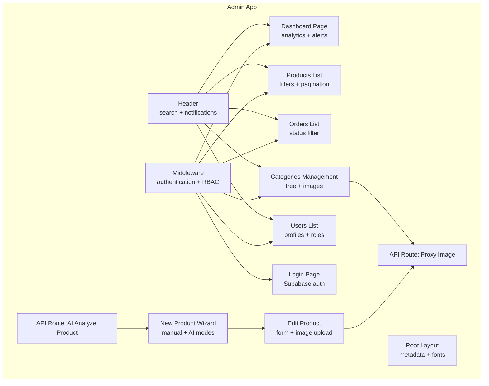
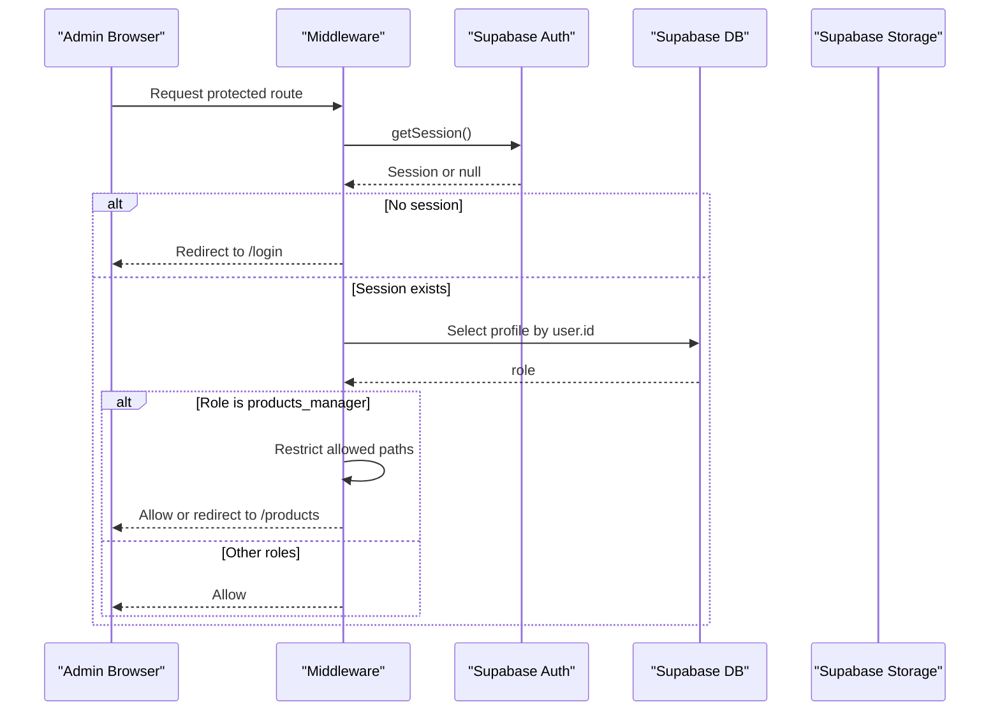
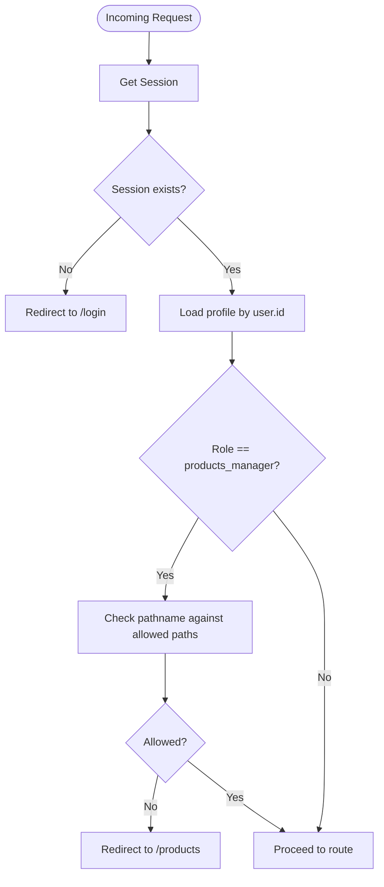
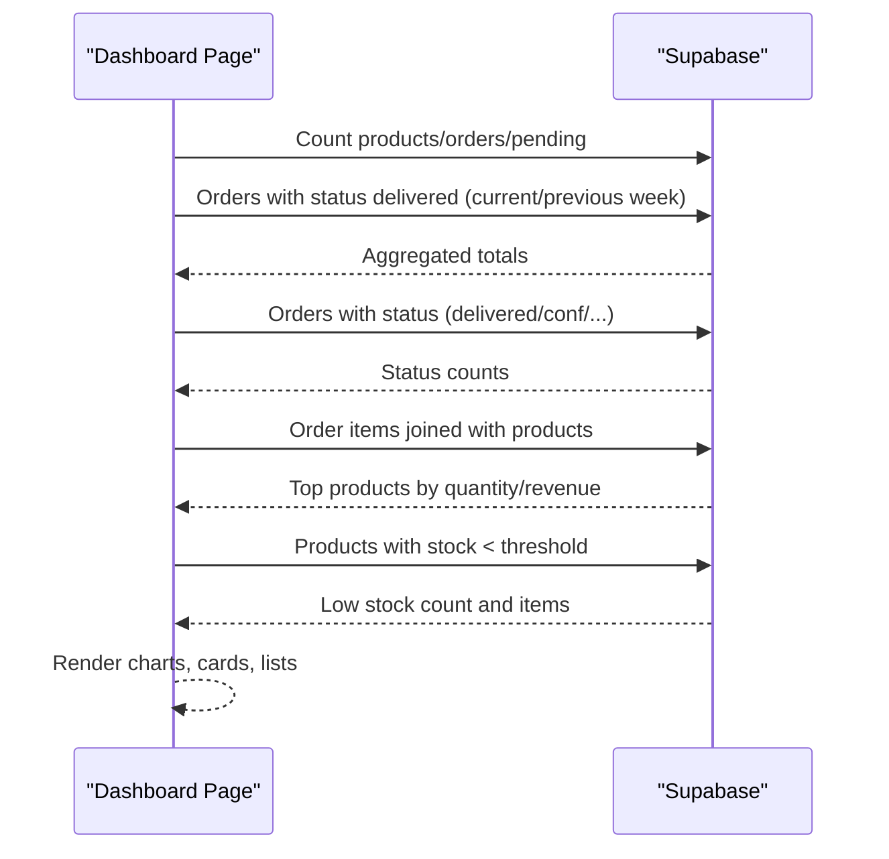
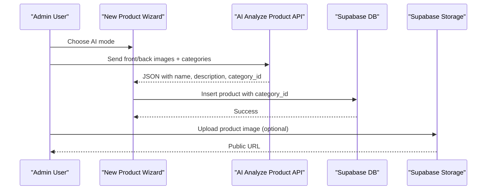
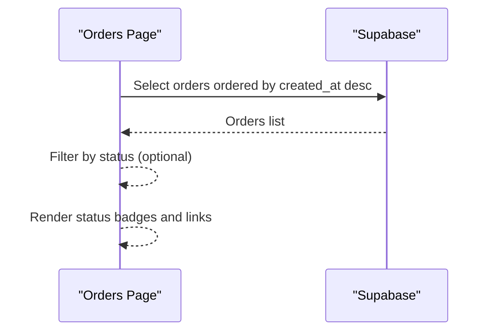
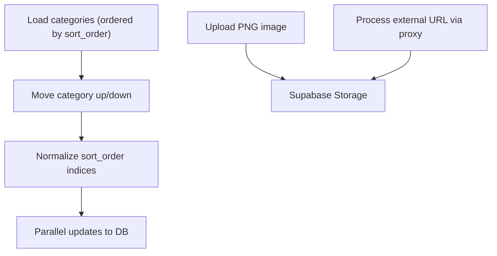
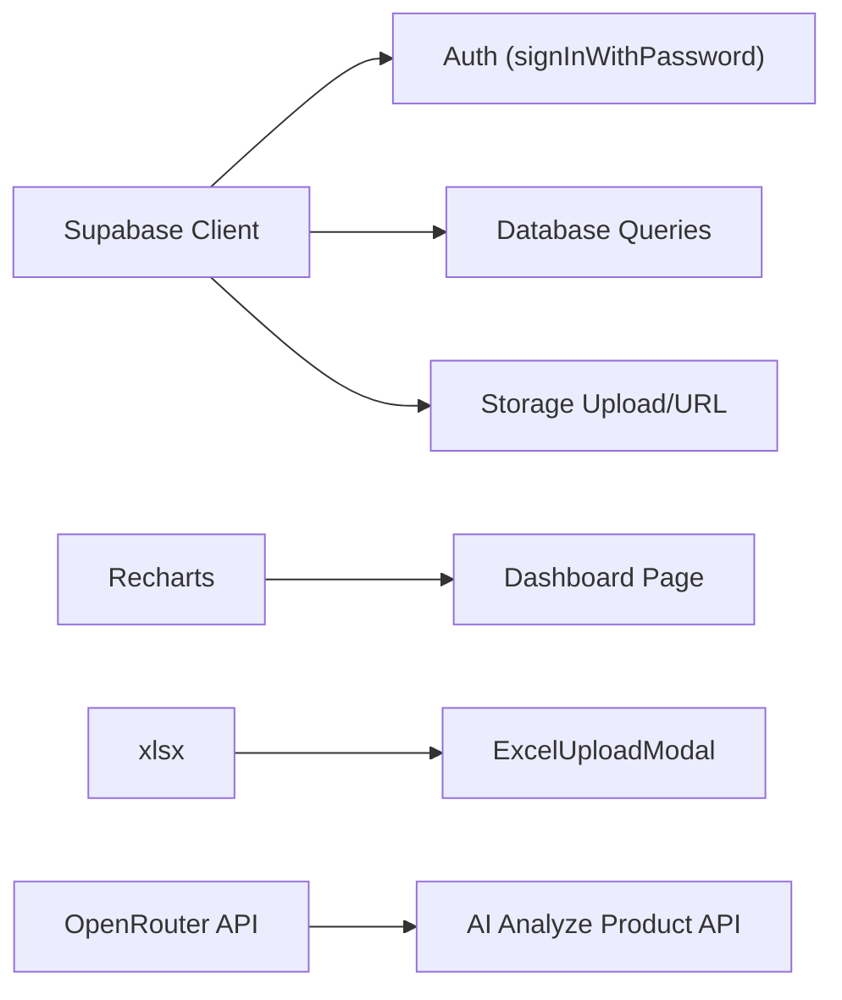

# Admin Dashboard (Next.js)

<cite>
**Referenced Files in This Document**
- [admin/src/middleware.ts](file://admin/src/middleware.ts)
- [admin/src/lib/supabase.ts](file://admin/src/lib/supabase.ts)
- [admin/src/app/layout.tsx](file://admin/src/app/layout.tsx)
- [admin/src/app/login/page.tsx](file://admin/src/app/login/page.tsx)
- [admin/src/types/index.ts](file://admin/src/types/index.ts)
- [admin/package.json](file://admin/package.json)
- [admin/src/app/(dashboard)/page.tsx](file://admin/src/app/(dashboard)/page.tsx)
- [admin/src/app/(dashboard)/products/page.tsx](file://admin/src/app/(dashboard)/products/page.tsx)
- [admin/src/app/(dashboard)/orders/page.tsx](file://admin/src/app/(dashboard)/orders/page.tsx)
- [admin/src/app/(dashboard)/users/page.tsx](file://admin/src/app/(dashboard)/users/page.tsx)
- [admin/src/app/(dashboard)/categories/page.tsx](file://admin/src/app/(dashboard)/categories/page.tsx)
- [admin/src/components/layout/Header.tsx](file://admin/src/components/layout/Header.tsx)
- [admin/src/components/products/ManualProductForm.tsx](file://admin/src/components/products/ManualProductForm.tsx)
- [admin/src/components/products/ExcelUploadModal.tsx](file://admin/src/components/products/ExcelUploadModal.tsx)
- [admin/src/app/(dashboard)/products/new/page.tsx](file://admin/src/app/(dashboard)/products/new/page.tsx)
- [admin/src/app/(dashboard)/products/[id]/page.tsx](file://admin/src/app/(dashboard)/products/[id]/page.tsx)
- [admin/src/app/api/proxy-image/route.ts](file://admin/src/app/api/proxy-image/route.ts)
- [admin/src/app/api/ai/analyze-product/route.ts](file://admin/src/app/api/ai/analyze-product/route.ts)
</cite>

## Table of Contents
1. [Introduction](#introduction)
2. [Project Structure](#project-structure)
3. [Core Components](#core-components)
4. [Architecture Overview](#architecture-overview)
5. [Detailed Component Analysis](#detailed-component-analysis)
6. [Dependency Analysis](#dependency-analysis)
7. [Performance Considerations](#performance-considerations)
8. [Troubleshooting Guide](#troubleshooting-guide)
9. [Conclusion](#conclusion)
10. [Appendices](#appendices)

## Introduction
This document describes the Admin Dashboard built with Next.js for the Al-Amal Center. It covers authentication and role-based access control, product management (creation, editing, bulk operations, image handling), order management (tracking, status updates, analytics), category management (hierarchical organization), user management (profiles and roles), content management (homepage, promotions, notifications), dashboard analytics, administrative workflow optimization, customization guidance, and security considerations including audit logging.

## Project Structure
The admin application is organized as a Next.js app under the admin directory. Key areas:
- Authentication and routing protection via middleware
- Supabase client initialization and shared types
- Dashboard pages for analytics, products, orders, categories, users
- UI components for layouts and product forms
- API routes for AI-powered product analysis and image proxy
- RTL Arabic UI with Tailwind and Recharts for analytics

**Diagram sources**
- [admin/src/middleware.ts:1-122](file://admin/src/middleware.ts#L1-L122)
- [admin/src/app/layout.tsx:1-30](file://admin/src/app/layout.tsx#L1-L30)
- [admin/src/app/login/page.tsx:1-88](file://admin/src/app/login/page.tsx#L1-L88)
- [admin/src/app/(dashboard)/page.tsx](file://admin/src/app/(dashboard)/page.tsx#L1-L689)
- [admin/src/app/(dashboard)/products/page.tsx](file://admin/src/app/(dashboard)/products/page.tsx#L1-L435)
- [admin/src/app/(dashboard)/orders/page.tsx](file://admin/src/app/(dashboard)/orders/page.tsx#L1-L173)
- [admin/src/app/(dashboard)/users/page.tsx](file://admin/src/app/(dashboard)/users/page.tsx#L1-L143)
- [admin/src/app/(dashboard)/categories/page.tsx](file://admin/src/app/(dashboard)/categories/page.tsx#L1-L764)
- [admin/src/components/layout/Header.tsx:1-329](file://admin/src/components/layout/Header.tsx#L1-L329)
- [admin/src/app/(dashboard)/products/new/page.tsx](file://admin/src/app/(dashboard)/products/new/page.tsx#L1-L164)
- [admin/src/app/(dashboard)/products/[id]/page.tsx](file://admin/src/app/(dashboard)/products/[id]/page.tsx#L1-L391)
- [admin/src/app/api/proxy-image/route.ts:1-42](file://admin/src/app/api/proxy-image/route.ts#L1-L42)
- [admin/src/app/api/ai/analyze-product/route.ts:1-221](file://admin/src/app/api/ai/analyze-product/route.ts#L1-L221)

**Section sources**
- [admin/src/middleware.ts:1-122](file://admin/src/middleware.ts#L1-L122)
- [admin/src/app/layout.tsx:1-30](file://admin/src/app/layout.tsx#L1-L30)
- [admin/src/app/login/page.tsx:1-88](file://admin/src/app/login/page.tsx#L1-L88)
- [admin/src/types/index.ts:1-26](file://admin/src/types/index.ts#L1-L26)
- [admin/package.json:1-40](file://admin/package.json#L1-L40)

## Core Components
- Authentication and Session Management: Supabase-based login and session retrieval in middleware and login page.
- Role-Based Access Control: Middleware enforces role-based restrictions for specific roles.
- Analytics Dashboard: Real-time stats, charts, and alerts for sales, orders, and inventory.
- Product Management: CRUD operations, filters, pagination, manual form, AI-assisted creation, Excel bulk import, image storage.
- Order Management: Listing, filtering by status, status badges, and links to order details.
- Category Management: Hierarchical categories with drag-like ordering, image upload, activation toggles.
- User Management: Customer listing and role display.
- Content Management: Notifications and homepage banners via Supabase storage and database.
- API Integrations: AI product analysis and image proxy for external URLs.

**Section sources**
- [admin/src/middleware.ts:57-105](file://admin/src/middleware.ts#L57-L105)
- [admin/src/app/login/page.tsx:15-35](file://admin/src/app/login/page.tsx#L15-L35)
- [admin/src/app/(dashboard)/page.tsx](file://admin/src/app/(dashboard)/page.tsx#L93-L324)
- [admin/src/app/(dashboard)/products/page.tsx](file://admin/src/app/(dashboard)/products/page.tsx#L52-L92)
- [admin/src/app/(dashboard)/orders/page.tsx](file://admin/src/app/(dashboard)/orders/page.tsx#L20-L30)
- [admin/src/app/(dashboard)/categories/page.tsx](file://admin/src/app/(dashboard)/categories/page.tsx#L44-L54)
- [admin/src/app/(dashboard)/users/page.tsx](file://admin/src/app/(dashboard)/users/page.tsx#L25-L39)
- [admin/src/app/api/ai/analyze-product/route.ts:71-220](file://admin/src/app/api/ai/analyze-product/route.ts#L71-L220)
- [admin/src/app/api/proxy-image/route.ts:4-41](file://admin/src/app/api/proxy-image/route.ts#L4-L41)

## Architecture Overview
The admin dashboard uses Next.js App Router with Supabase for authentication, database, and storage. The middleware enforces authentication and role checks. Pages render analytics and manage resources. API routes provide AI assistance and image proxying.

**Diagram sources**
- [admin/src/middleware.ts:57-105](file://admin/src/middleware.ts#L57-L105)

**Section sources**
- [admin/src/middleware.ts:1-122](file://admin/src/middleware.ts#L1-L122)
- [admin/src/lib/supabase.ts:1-24](file://admin/src/lib/supabase.ts#L1-L24)

## Detailed Component Analysis

### Authentication and Role-Based Access Control
- Login: Uses Supabase client to sign in with email/password and redirects on success.
- Middleware:
  - Blocks unauthenticated requests and redirects to login.
  - Redirects authenticated users away from login.
  - Role-based restriction for "products_manager" to limit access to products and categories.
  - Applies allowed paths and root redirection logic.

**Diagram sources**
- [admin/src/middleware.ts:57-105](file://admin/src/middleware.ts#L57-L105)

**Section sources**
- [admin/src/app/login/page.tsx:15-35](file://admin/src/app/login/page.tsx#L15-L35)
- [admin/src/middleware.ts:57-105](file://admin/src/middleware.ts#L57-L105)

### Dashboard Analytics and Reporting
- Fetches stats: total orders, products, revenue, pending orders, average order value, growth metrics.
- Weekly sales chart: grouped by Arabic day names.
- Order status distribution pie chart.
- Top-selling products and low-stock alerts.
- Recent orders list with status badges.
- Quick actions: add product, view pending orders, manage categories.

**Diagram sources**
- [admin/src/app/(dashboard)/page.tsx](file://admin/src/app/(dashboard)/page.tsx#L93-L324)

**Section sources**
- [admin/src/app/(dashboard)/page.tsx](file://admin/src/app/(dashboard)/page.tsx#L93-L324)

### Product Management
- Listing:
  - Filters: category, activity, stock status.
  - Search with debouncing.
  - Pagination.
  - Bulk operations: Excel upload modal.
- Creation:
  - Manual form: name (AR/EN), price, stock, category, description, image upload.
  - AI-assisted creation: wizard with AI analysis route.
- Editing:
  - Form with image replacement, save, delete.
- Image Management:
  - Upload to Supabase storage with size/type checks.
  - Proxy route for external image URLs to bypass CORS and upload to storage.

**Diagram sources**
- [admin/src/app/(dashboard)/products/new/page.tsx](file://admin/src/app/(dashboard)/products/new/page.tsx#L10-L29)
- [admin/src/app/api/ai/analyze-product/route.ts:71-220](file://admin/src/app/api/ai/analyze-product/route.ts#L71-L220)
- [admin/src/app/(dashboard)/products/[id]/page.tsx](file://admin/src/app/(dashboard)/products/[id]/page.tsx#L126-L158)
- [admin/src/app/api/proxy-image/route.ts:4-41](file://admin/src/app/api/proxy-image/route.ts#L4-L41)

**Section sources**
- [admin/src/app/(dashboard)/products/page.tsx](file://admin/src/app/(dashboard)/products/page.tsx#L52-L92)
- [admin/src/components/products/ManualProductForm.tsx:35-82](file://admin/src/components/products/ManualProductForm.tsx#L35-L82)
- [admin/src/components/products/ExcelUploadModal.tsx:177-255](file://admin/src/components/products/ExcelUploadModal.tsx#L177-L255)
- [admin/src/app/(dashboard)/products/[id]/page.tsx](file://admin/src/app/(dashboard)/products/[id]/page.tsx#L126-L174)
- [admin/src/app/api/proxy-image/route.ts:4-41](file://admin/src/app/api/proxy-image/route.ts#L4-L41)

### Order Management
- Lists orders with status badges and quick navigation.
- Filtering by status.
- Links to order detail pages for updates.

**Diagram sources**
- [admin/src/app/(dashboard)/orders/page.tsx](file://admin/src/app/(dashboard)/orders/page.tsx#L20-L30)

**Section sources**
- [admin/src/app/(dashboard)/orders/page.tsx](file://admin/src/app/(dashboard)/orders/page.tsx#L20-L30)

### Category Management
- Hierarchical categories with parent-child relationships.
- Sort order management with up/down actions.
- Image upload and URL processing via proxy route.
- Activation toggles and deletion.

**Diagram sources**
- [admin/src/app/(dashboard)/categories/page.tsx](file://admin/src/app/(dashboard)/categories/page.tsx#L252-L286)
- [admin/src/app/api/proxy-image/route.ts:4-41](file://admin/src/app/api/proxy-image/route.ts#L4-L41)

**Section sources**
- [admin/src/app/(dashboard)/categories/page.tsx](file://admin/src/app/(dashboard)/categories/page.tsx#L44-L54)
- [admin/src/app/(dashboard)/categories/page.tsx](file://admin/src/app/(dashboard)/categories/page.tsx#L252-L286)

### User Management
- Displays user profiles from the profiles table with role indicators.
- Shows registration date and phone.

**Section sources**
- [admin/src/app/(dashboard)/users/page.tsx](file://admin/src/app/(dashboard)/users/page.tsx#L25-L39)

### Content Management (Homepage, Promotions, Notifications)
- Notifications: Unread count fetched and shown in header.
- Homepage and promotions: Managed via Supabase storage and database entries (banner slots, promotional content).
- Image handling: Consistent use of Supabase Storage and proxy route for external images.

**Section sources**
- [admin/src/components/layout/Header.tsx:37-48](file://admin/src/components/layout/Header.tsx#L37-L48)
- [admin/src/app/(dashboard)/categories/page.tsx](file://admin/src/app/(dashboard)/categories/page.tsx#L56-L102)

### Administrative Workflow Optimization
- Quick actions on dashboard for frequent tasks.
- Debounced search and filters for efficient browsing.
- Bulk import via Excel/CSV with progress and error reporting.
- AI-assisted product creation to reduce manual effort.

**Section sources**
- [admin/src/app/(dashboard)/page.tsx](file://admin/src/app/(dashboard)/page.tsx#L667-L684)
- [admin/src/components/products/ExcelUploadModal.tsx:177-255](file://admin/src/components/products/ExcelUploadModal.tsx#L177-L255)
- [admin/src/app/(dashboard)/products/new/page.tsx](file://admin/src/app/(dashboard)/products/new/page.tsx#L48-L157)

### Extending Admin Functionality and Customizing Interfaces
- Add new pages under the dashboard app directory.
- Extend Supabase types via shared types re-export.
- Integrate new API routes for specialized tasks (e.g., image processing, analytics).
- Customize charts and dashboards by adding new queries and components.

**Section sources**
- [admin/src/types/index.ts:6-25](file://admin/src/types/index.ts#L6-L25)
- [admin/src/app/api/ai/analyze-product/route.ts:71-220](file://admin/src/app/api/ai/analyze-product/route.ts#L71-L220)

## Dependency Analysis
- Supabase client initialized for browser usage and shared types.
- UI libraries: Tailwind, Recharts, Lucide icons.
- Excel parsing via xlsx.
- AI analysis via OpenRouter API.

**Diagram sources**
- [admin/src/lib/supabase.ts:1-24](file://admin/src/lib/supabase.ts#L1-L24)
- [admin/src/app/(dashboard)/page.tsx](file://admin/src/app/(dashboard)/page.tsx#L29-L40)
- [admin/src/components/products/ExcelUploadModal.tsx:4-7](file://admin/src/components/products/ExcelUploadModal.tsx#L4-L7)
- [admin/src/app/api/ai/analyze-product/route.ts:1-221](file://admin/src/app/api/ai/analyze-product/route.ts#L1-L221)

**Section sources**
- [admin/src/lib/supabase.ts:1-24](file://admin/src/lib/supabase.ts#L1-L24)
- [admin/package.json:11-26](file://admin/package.json#L11-L26)

## Performance Considerations
- Debounced search reduces unnecessary queries.
- Pagination limits payload sizes.
- Parallel data fetching on dashboard improves responsiveness.
- Image uploads enforce size/type constraints to prevent large payloads.
- Excel import processes sequentially with progress and error aggregation.

## Troubleshooting Guide
- Authentication failures: Verify environment variables for Supabase and ensure session retrieval succeeds.
- Role restrictions: Confirm profile role is correctly stored and middleware path checks are applied.
- Excel import errors: Check column detection and category matching; review error logs in modal.
- AI analysis errors: Ensure OpenRouter API key is configured and model responses contain valid JSON.
- Image upload issues: Validate file type and size; confirm Supabase Storage permissions and proxy route accessibility.

**Section sources**
- [admin/src/middleware.ts:57-105](file://admin/src/middleware.ts#L57-L105)
- [admin/src/components/products/ExcelUploadModal.tsx:177-255](file://admin/src/components/products/ExcelUploadModal.tsx#L177-L255)
- [admin/src/app/api/ai/analyze-product/route.ts:75-80](file://admin/src/app/api/ai/analyze-product/route.ts#L75-L80)
- [admin/src/app/api/proxy-image/route.ts:4-41](file://admin/src/app/api/proxy-image/route.ts#L4-L41)

## Conclusion
The admin dashboard provides a robust, role-aware interface for managing products, orders, categories, and users, backed by Supabase. It leverages analytics for insights, supports bulk operations, and integrates AI for streamlined product creation. The modular architecture and clear separation of concerns enable easy extension and customization while maintaining strong security and performance characteristics.

## Appendices
- Security and Audit Logging: Implement server-side logging for admin actions (e.g., product create/update/delete, order status changes) and maintain audit trails in Supabase tables. Enforce strict RBAC and monitor unauthorized access attempts.
- Internationalization: The app is localized for Arabic with RTL layout; extend locale support as needed.
- Monitoring: Add error boundaries and Sentry for client-side error tracking; monitor API route latency and failure rates.