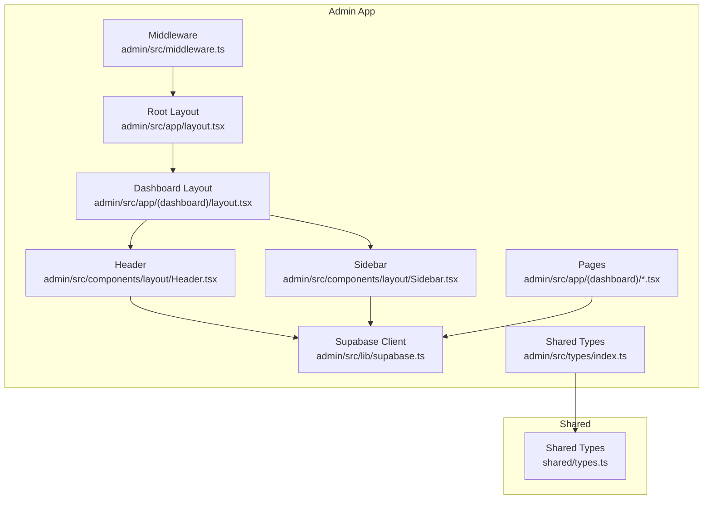
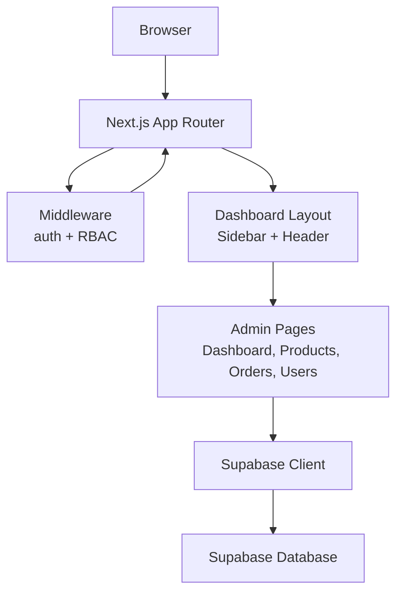
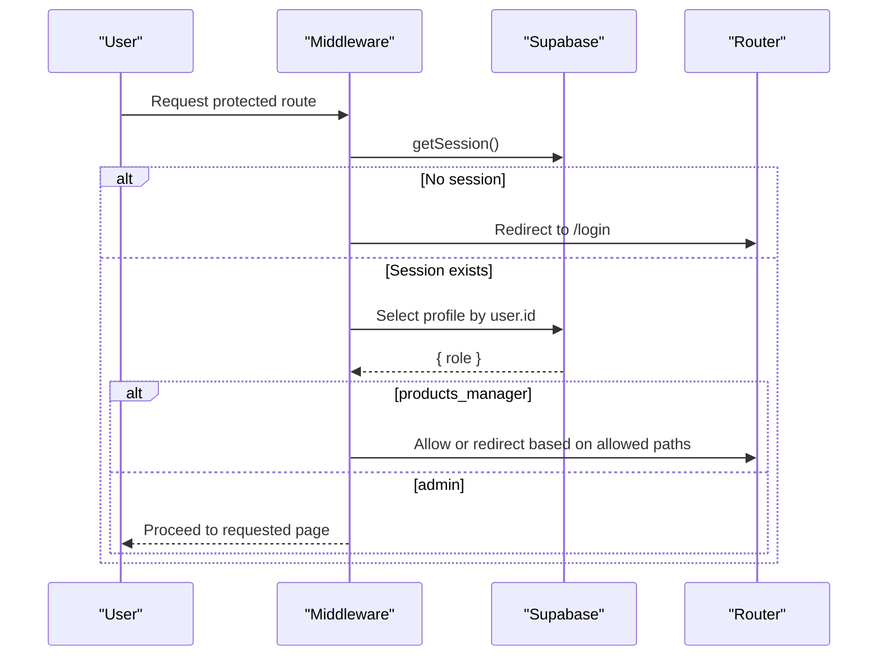
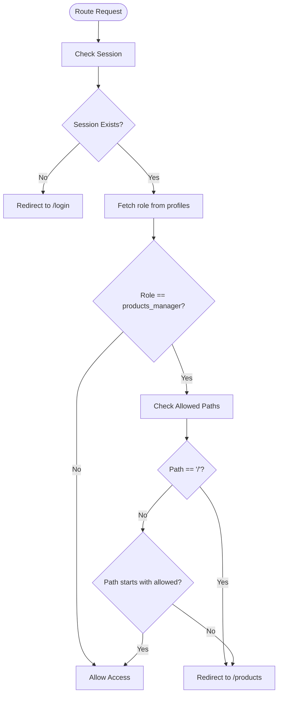
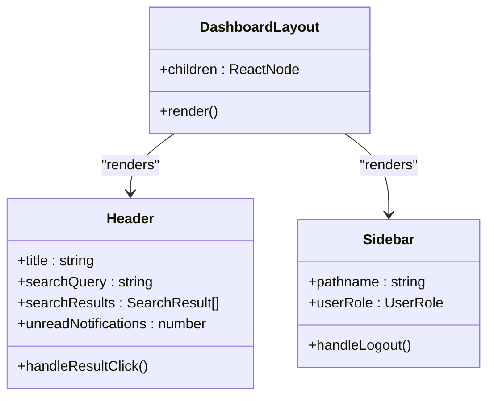
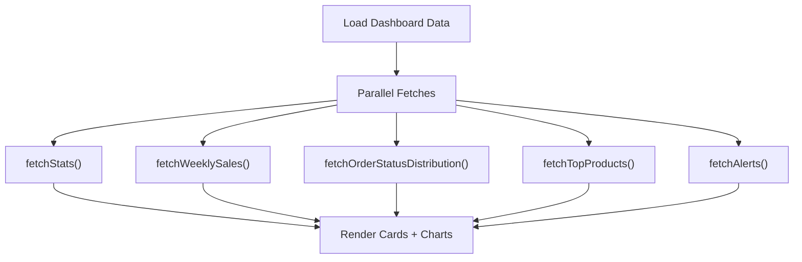
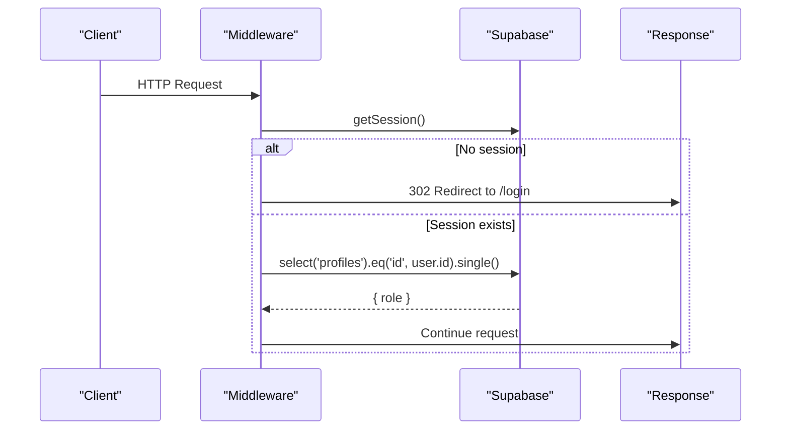
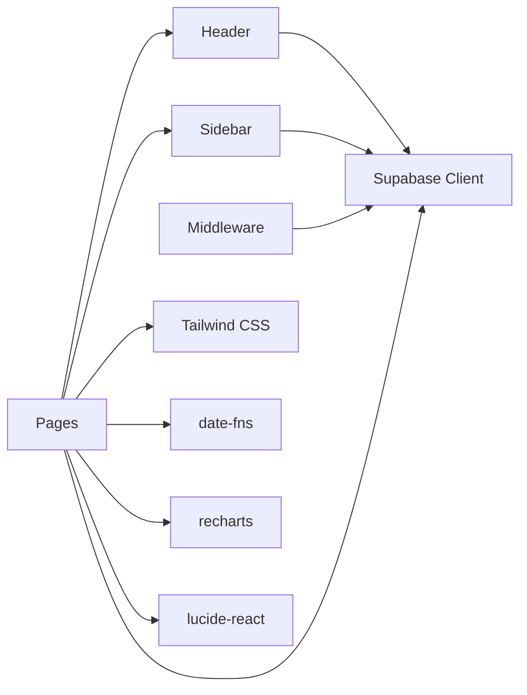

# Admin System Overview

<cite>
**Referenced Files in This Document**
- [admin/src/middleware.ts](file://admin/src/middleware.ts)
- [admin/src/app/layout.tsx](file://admin/src/app/layout.tsx)
- [admin/src/app/(dashboard)/layout.tsx](file://admin/src/app/(dashboard)/layout.tsx)
- [admin/src/components/layout/Header.tsx](file://admin/src/components/layout/Header.tsx)
- [admin/src/components/layout/Sidebar.tsx](file://admin/src/components/layout/Sidebar.tsx)
- [admin/src/app/login/page.tsx](file://admin/src/app/login/page.tsx)
- [admin/src/lib/supabase.ts](file://admin/src/lib/supabase.ts)
- [admin/src/contexts/SidebarContext.tsx](file://admin/src/contexts/SidebarContext.tsx)
- [admin/src/types/index.ts](file://admin/src/types/index.ts)
- [admin/src/app/(dashboard)/page.tsx](file://admin/src/app/(dashboard)/page.tsx)
- [admin/src/app/(dashboard)/products/page.tsx](file://admin/src/app/(dashboard)/products/page.tsx)
- [admin/src/app/(dashboard)/orders/page.tsx](file://admin/src/app/(dashboard)/orders/page.tsx)
- [admin/src/app/(dashboard)/users/page.tsx](file://admin/src/app/(dashboard)/users/page.tsx)
- [admin/src/app/api/proxy-image/route.ts](file://admin/src/app/api/proxy-image/route.ts)
- [admin/src/app/globals.css](file://admin/src/app/globals.css)
- [admin/tailwind.config.js](file://admin/tailwind.config.js)
- [admin/package.json](file://admin/package.json)
- [shared/types.ts](file://shared/types.ts)
</cite>

## Table of Contents
1. [Introduction](#introduction)
2. [Project Structure](#project-structure)
3. [Core Components](#core-components)
4. [Architecture Overview](#architecture-overview)
5. [Detailed Component Analysis](#detailed-component-analysis)
6. [Dependency Analysis](#dependency-analysis)
7. [Performance Considerations](#performance-considerations)
8. [Troubleshooting Guide](#troubleshooting-guide)
9. [Conclusion](#conclusion)
10. [Appendices](#appendices)

## Introduction
This document provides a comprehensive overview of the admin system, focusing on the dashboard architecture, role-based access control (RBAC), authentication mechanisms, middleware protection, layout and navigation patterns, UI design principles, session management, and integration with the main application. It also covers styling, theming, responsive design, extension guidelines, and UX/productivity enhancements.

## Project Structure
The admin subsystem is a standalone Next.js application under the admin directory. It shares a common Supabase backend and reuses shared types and utilities from the monorepo. Key areas:
- Middleware enforces authentication and RBAC across admin routes.
- Dashboard layout composes a persistent sidebar and header with page content.
- Pages implement CRUD and analytics dashboards for products, orders, users, and more.
- Supabase client is configured for SSR/SSG-safe browser usage.
- Tailwind CSS and nativeWind provide styling and theming.

**Diagram sources**
- [admin/src/middleware.ts:1-122](file://admin/src/middleware.ts#L1-L122)
- [admin/src/app/layout.tsx:1-30](file://admin/src/app/layout.tsx#L1-L30)
- [admin/src/app/(dashboard)/layout.tsx:1-20](file://admin/src/app/(dashboard)/layout.tsx#L1-L20)
- [admin/src/components/layout/Header.tsx:1-329](file://admin/src/components/layout/Header.tsx#L1-L329)
- [admin/src/components/layout/Sidebar.tsx:1-180](file://admin/src/components/layout/Sidebar.tsx#L1-L180)
- [admin/src/lib/supabase.ts:1-24](file://admin/src/lib/supabase.ts#L1-L24)
- [admin/src/types/index.ts:1-26](file://admin/src/types/index.ts#L1-L26)
- [shared/types.ts](file://shared/types.ts)

**Section sources**
- [admin/src/middleware.ts:1-122](file://admin/src/middleware.ts#L1-L122)
- [admin/src/app/layout.tsx:1-30](file://admin/src/app/layout.tsx#L1-L30)
- [admin/src/app/(dashboard)/layout.tsx:1-20](file://admin/src/app/(dashboard)/layout.tsx#L1-L20)
- [admin/src/components/layout/Header.tsx:1-329](file://admin/src/components/layout/Header.tsx#L1-L329)
- [admin/src/components/layout/Sidebar.tsx:1-180](file://admin/src/components/layout/Sidebar.tsx#L1-L180)
- [admin/src/lib/supabase.ts:1-24](file://admin/src/lib/supabase.ts#L1-L24)
- [admin/src/types/index.ts:1-26](file://admin/src/types/index.ts#L1-L26)

## Core Components
- Authentication and Session Management
  - Supabase client configured for browser usage with SSR-safe cookie handling.
  - Login page handles sign-in with email/password and redirects on success.
  - Middleware enforces session presence and redirects unauthenticated users to login.
- Role-Based Access Control (RBAC)
  - Middleware queries user role from the profiles table and restricts routes for products_manager.
  - Sidebar filters navigation items based on user role.
- Dashboard Layout and Navigation
  - Dashboard layout wraps page content with a sidebar provider and persistent sidebar/header.
  - Header provides search, notifications, and mobile-friendly controls.
  - Sidebar renders role-aware navigation and logout.
- Pages and Dashboards
  - Dashboard page aggregates stats, charts, alerts, and quick actions.
  - Products page supports filtering, pagination, search, and bulk actions.
  - Orders page lists orders with status badges and filtering.
  - Users page displays profile records and roles.
- Styling and Theming
  - Tailwind CSS with nativeWind preset.
  - Theme colors and fonts extended via tailwind.config.js.
  - Global CSS sets font family and RTL utilities.

**Section sources**
- [admin/src/lib/supabase.ts:1-24](file://admin/src/lib/supabase.ts#L1-L24)
- [admin/src/app/login/page.tsx:1-88](file://admin/src/app/login/page.tsx#L1-L88)
- [admin/src/middleware.ts:73-105](file://admin/src/middleware.ts#L73-L105)
- [admin/src/components/layout/Sidebar.tsx:46-87](file://admin/src/components/layout/Sidebar.tsx#L46-L87)
- [admin/src/app/(dashboard)/layout.tsx:1-20](file://admin/src/app/(dashboard)/layout.tsx#L1-L20)
- [admin/src/components/layout/Header.tsx:16-48](file://admin/src/components/layout/Header.tsx#L16-L48)
- [admin/src/app/(dashboard)/page.tsx:69-324](file://admin/src/app/(dashboard)/page.tsx#L69-L324)
- [admin/src/app/(dashboard)/products/page.tsx:13-92](file://admin/src/app/(dashboard)/products/page.tsx#L13-L92)
- [admin/src/app/(dashboard)/orders/page.tsx:11-31](file://admin/src/app/(dashboard)/orders/page.tsx#L11-L31)
- [admin/src/app/(dashboard)/users/page.tsx:10-39](file://admin/src/app/(dashboard)/users/page.tsx#L10-L39)
- [admin/tailwind.config.js:1-25](file://admin/tailwind.config.js#L1-L25)
- [admin/src/app/globals.css:1-14](file://admin/src/app/globals.css#L1-L14)

## Architecture Overview
The admin system follows a layered architecture:
- Presentation Layer: Next.js app with pages and shared components.
- Layout Layer: Dashboard layout, header, and sidebar.
- Business Logic Layer: Page components orchestrate data fetching and rendering.
- Data Access Layer: Supabase client for database operations.
- Security Layer: Middleware and RBAC enforcement.

**Diagram sources**
- [admin/src/middleware.ts:4-108](file://admin/src/middleware.ts#L4-L108)
- [admin/src/app/(dashboard)/layout.tsx:4-19](file://admin/src/app/(dashboard)/layout.tsx#L4-L19)
- [admin/src/components/layout/Header.tsx:16-48](file://admin/src/components/layout/Header.tsx#L16-L48)
- [admin/src/components/layout/Sidebar.tsx:46-87](file://admin/src/components/layout/Sidebar.tsx#L46-L87)
- [admin/src/lib/supabase.ts:20-24](file://admin/src/lib/supabase.ts#L20-L24)

## Detailed Component Analysis

### Authentication and Session Management
- Supabase Client Initialization
  - Browser client created with NEXT_PUBLIC_SUPABASE_URL and NEXT_PUBLIC_SUPABASE_ANON_KEY.
  - Shared types re-exported for type safety across admin pages.
- Login Flow
  - Login page captures email/password, calls Supabase sign-in, and redirects to dashboard on success.
- Middleware Protection
  - Ensures session exists; redirects unauthenticated users to /login.
  - Prevents authenticated users from accessing /login by redirecting to /.
  - Enforces role-based restrictions for products_manager.

**Diagram sources**
- [admin/src/middleware.ts:57-105](file://admin/src/middleware.ts#L57-L105)
- [admin/src/lib/supabase.ts:20-24](file://admin/src/lib/supabase.ts#L20-L24)

**Section sources**
- [admin/src/lib/supabase.ts:1-24](file://admin/src/lib/supabase.ts#L1-L24)
- [admin/src/app/login/page.tsx:8-35](file://admin/src/app/login/page.tsx#L8-L35)
- [admin/src/middleware.ts:57-105](file://admin/src/middleware.ts#L57-L105)

### Role-Based Access Control (RBAC)
- Middleware RBAC
  - Queries profiles table for role and restricts access for products_manager to /products and /categories.
  - Redirects unauthorized paths to /products and root to /products.
- Sidebar RBAC
  - Filters navigation items based on role-defined allowed paths.
  - Hides root item for restricted roles.

**Diagram sources**
- [admin/src/middleware.ts:73-105](file://admin/src/middleware.ts#L73-L105)
- [admin/src/components/layout/Sidebar.tsx:74-82](file://admin/src/components/layout/Sidebar.tsx#L74-L82)

**Section sources**
- [admin/src/middleware.ts:73-105](file://admin/src/middleware.ts#L73-L105)
- [admin/src/components/layout/Sidebar.tsx:42-82](file://admin/src/components/layout/Sidebar.tsx#L42-L82)
- [shared/types.ts](file://shared/types.ts)

### Admin Layout and Navigation
- Dashboard Layout
  - Provides SidebarProvider and renders Sidebar and main content area.
  - Applies responsive width constraints for main content.
- Header
  - Search across products, orders, and categories with debounced results.
  - Unread notifications count fetched from notifications table.
  - Mobile search overlay and responsive design.
- Sidebar
  - Role-aware navigation items and logout action.
  - Active state highlighting and responsive behavior.

**Diagram sources**
- [admin/src/app/(dashboard)/layout.tsx:4-19](file://admin/src/app/(dashboard)/layout.tsx#L4-L19)
- [admin/src/components/layout/Header.tsx:16-48](file://admin/src/components/layout/Header.tsx#L16-L48)
- [admin/src/components/layout/Sidebar.tsx:46-87](file://admin/src/components/layout/Sidebar.tsx#L46-L87)

**Section sources**
- [admin/src/app/(dashboard)/layout.tsx:1-20](file://admin/src/app/(dashboard)/layout.tsx#L1-L20)
- [admin/src/components/layout/Header.tsx:16-48](file://admin/src/components/layout/Header.tsx#L16-L48)
- [admin/src/components/layout/Sidebar.tsx:46-87](file://admin/src/components/layout/Sidebar.tsx#L46-L87)

### Dashboard Analytics and Alerts
- Dashboard Page
  - Aggregates stats (orders, products, revenue, pending, AOV).
  - Weekly sales bar chart and order status distribution pie chart.
  - Top products and low-stock alerts with quick actions.
- Products Page
  - Filtering by category, activity, and stock status.
  - Pagination and search with debounced query.
- Orders Page
  - Status filtering and badge rendering.
- Users Page
  - Lists profiles and roles from the profiles table.

**Diagram sources**
- [admin/src/app/(dashboard)/page.tsx:89-103](file://admin/src/app/(dashboard)/page.tsx#L89-L103)
- [admin/src/app/(dashboard)/page.tsx:105-182](file://admin/src/app/(dashboard)/page.tsx#L105-L182)
- [admin/src/app/(dashboard)/page.tsx:184-222](file://admin/src/app/(dashboard)/page.tsx#L184-L222)
- [admin/src/app/(dashboard)/page.tsx:224-254](file://admin/src/app/(dashboard)/page.tsx#L224-L254)
- [admin/src/app/(dashboard)/page.tsx:256-298](file://admin/src/app/(dashboard)/page.tsx#L256-L298)
- [admin/src/app/(dashboard)/page.tsx:300-324](file://admin/src/app/(dashboard)/page.tsx#L300-L324)

**Section sources**
- [admin/src/app/(dashboard)/page.tsx:69-324](file://admin/src/app/(dashboard)/page.tsx#L69-L324)
- [admin/src/app/(dashboard)/products/page.tsx:13-92](file://admin/src/app/(dashboard)/products/page.tsx#L13-L92)
- [admin/src/app/(dashboard)/orders/page.tsx:11-31](file://admin/src/app/(dashboard)/orders/page.tsx#L11-L31)
- [admin/src/app/(dashboard)/users/page.tsx:10-39](file://admin/src/app/(dashboard)/users/page.tsx#L10-L39)

### Admin Session Management and Security Measures
- Session Handling
  - Supabase client manages cookies via middleware for SSR-safe auth state.
  - Middleware reads/writes cookies to maintain session across requests.
- Security Measures
  - Redirects unauthenticated users away from protected routes.
  - Restricts products_manager to permitted paths.
  - Logout clears session and redirects to login.

**Diagram sources**
- [admin/src/middleware.ts:57-105](file://admin/src/middleware.ts#L57-L105)
- [admin/src/lib/supabase.ts:20-24](file://admin/src/lib/supabase.ts#L20-L24)

**Section sources**
- [admin/src/middleware.ts:11-55](file://admin/src/middleware.ts#L11-L55)
- [admin/src/middleware.ts:57-105](file://admin/src/middleware.ts#L57-L105)
- [admin/src/components/layout/Sidebar.tsx:84-87](file://admin/src/components/layout/Sidebar.tsx#L84-L87)

### Integration with Main Application
- Shared Types
  - Admin re-exports shared types for consistent data modeling across the monorepo.
- Supabase Integration
  - Both admin and main apps share the same Supabase project and tables.
- Routing
  - Admin uses Next.js app directory routing with groups for dashboard pages.
- Theming Consistency
  - Tailwind configuration and global CSS define consistent design tokens.

**Section sources**
- [admin/src/types/index.ts:1-26](file://admin/src/types/index.ts#L1-L26)
- [admin/src/lib/supabase.ts:20-24](file://admin/src/lib/supabase.ts#L20-L24)
- [admin/tailwind.config.js:1-25](file://admin/tailwind.config.js#L1-L25)
- [admin/src/app/globals.css:1-14](file://admin/src/app/globals.css#L1-L14)

### Admin-Specific Styling, Theming, and Responsive Design
- Tailwind and nativeWind
  - Preset configured for nativeWind compatibility.
  - Extended colors (primary, secondary, cta, danger, background) and font families.
- Global Styles
  - Sets font family and RTL utility class.
- Component-Level Responsiveness
  - Header adapts search and overlays for mobile.
  - Sidebar collapses on small screens with overlay.
  - Tables transform to card-based layouts on mobile.

**Section sources**
- [admin/tailwind.config.js:1-25](file://admin/tailwind.config.js#L1-L25)
- [admin/src/app/globals.css:1-14](file://admin/src/app/globals.css#L1-L14)
- [admin/src/components/layout/Header.tsx:270-326](file://admin/src/components/layout/Header.tsx#L270-L326)
- [admin/src/components/layout/Sidebar.tsx:91-177](file://admin/src/components/layout/Sidebar.tsx#L91-L177)
- [admin/src/app/(dashboard)/products/page.tsx:255-361](file://admin/src/app/(dashboard)/products/page.tsx#L255-L361)
- [admin/src/app/(dashboard)/orders/page.tsx:86-156](file://admin/src/app/(dashboard)/orders/page.tsx#L86-L156)

### Extending the Admin Interface and Adding Features
- Add a New Page
  - Create a new page under admin/src/app/(dashboard)/<feature>/page.tsx.
  - Wrap content with Header and apply layout classes.
  - Use supabase client for data fetching.
- Add a Navigation Item
  - Extend sidebarItems in Sidebar component.
  - If restricted, update roleRestrictedItems to include the new path.
- Integrate Shared Types
  - Import types from admin/src/types/index.ts or shared/types.ts as needed.
- Styling and Responsiveness
  - Follow existing Tailwind classes and responsive patterns.
  - Use mobile overlays and card grids for smaller screens.
- API Routes
  - Add new API handlers under admin/src/app/api/<route>/route.ts when needed (e.g., proxy-image).

**Section sources**
- [admin/src/components/layout/Sidebar.tsx:28-44](file://admin/src/components/layout/Sidebar.tsx#L28-L44)
- [admin/src/app/(dashboard)/layout.tsx:1-20](file://admin/src/app/(dashboard)/layout.tsx#L1-L20)
- [admin/src/types/index.ts:1-26](file://admin/src/types/index.ts#L1-L26)
- [admin/src/app/api/proxy-image/route.ts:1-42](file://admin/src/app/api/proxy-image/route.ts#L1-L42)

### Admin UX and Productivity Enhancements
- Search
  - Debounced search across products, orders, and categories in Header.
  - Clearable input and keyboard-friendly results.
- Filtering and Sorting
  - Products page supports category, activity, and stock status filters.
  - Orders page supports status filtering.
- Quick Actions
  - Dashboard quick actions for common tasks.
- Visual Feedback
  - Status badges, loading skeletons, and empty states improve clarity.
- Accessibility
  - Proper contrast, readable typography, and focus states.

**Section sources**
- [admin/src/components/layout/Header.tsx:50-116](file://admin/src/components/layout/Header.tsx#L50-L116)
- [admin/src/app/(dashboard)/products/page.tsx:195-247](file://admin/src/app/(dashboard)/products/page.tsx#L195-L247)
- [admin/src/app/(dashboard)/orders/page.tsx:68-82](file://admin/src/app/(dashboard)/orders/page.tsx#L68-L82)
- [admin/src/app/(dashboard)/page.tsx:421-494](file://admin/src/app/(dashboard)/page.tsx#L421-L494)

## Dependency Analysis
- Internal Dependencies
  - Pages depend on Header and Supabase client.
  - Sidebar depends on Supabase client and context for open state.
  - Middleware depends on Supabase client and cookie options.
- External Dependencies
  - Supabase JS and SSR packages for auth and DB.
  - Tailwind CSS and nativeWind for styling.
  - date-fns for formatting.
  - recharts for visualizations.
  - lucide-react for icons.

**Diagram sources**
- [admin/src/components/layout/Header.tsx:16-48](file://admin/src/components/layout/Header.tsx#L16-L48)
- [admin/src/components/layout/Sidebar.tsx:46-87](file://admin/src/components/layout/Sidebar.tsx#L46-L87)
- [admin/src/middleware.ts:11-55](file://admin/src/middleware.ts#L11-L55)
- [admin/package.json:11-26](file://admin/package.json#L11-L26)

**Section sources**
- [admin/package.json:11-26](file://admin/package.json#L11-L26)
- [admin/src/lib/supabase.ts:20-24](file://admin/src/lib/supabase.ts#L20-L24)

## Performance Considerations
- Data Fetching
  - Use efficient queries with limits and range for paginated lists.
  - Debounce search inputs to reduce network requests.
- Rendering
  - Skeleton loaders during initial loads.
  - Conditional rendering for empty states and overlays.
- Assets
  - Use image placeholders and lazy loading for product images.
- Middleware
  - Keep cookie handling minimal and avoid unnecessary writes.

## Troubleshooting Guide
- Authentication Issues
  - Verify NEXT_PUBLIC_SUPABASE_URL and NEXT_PUBLIC_SUPABASE_ANON_KEY are set.
  - Ensure cookies are readable/writable in development and production environments.
- RBAC Problems
  - Confirm profiles table contains role values and user ids match session.
  - Check allowed paths in middleware and roleRestrictedItems in Sidebar.
- Search Not Working
  - Validate column names and ILIKE patterns in Header search queries.
- Styling Issues
  - Ensure Tailwind content paths include admin components and pages.
  - Verify nativeWind preset is applied in tailwind.config.js.

**Section sources**
- [admin/src/middleware.ts:11-55](file://admin/src/middleware.ts#L11-L55)
- [admin/src/components/layout/Header.tsx:50-116](file://admin/src/components/layout/Header.tsx#L50-L116)
- [admin/tailwind.config.js:1-25](file://admin/tailwind.config.js#L1-L25)

## Conclusion
The admin system provides a secure, role-aware, and user-friendly interface for managing products, orders, and users. Its modular architecture, robust middleware protection, and consistent styling enable efficient administration and straightforward extensibility. Following the outlined patterns ensures new features integrate seamlessly while maintaining security and UX quality.

## Appendices
- Environment Variables
  - NEXT_PUBLIC_SUPABASE_URL
  - NEXT_PUBLIC_SUPABASE_ANON_KEY
- Shared Types Reference
  - Profiles role includes customer, admin, products_manager.

**Section sources**
- [admin/src/lib/supabase.ts:20-24](file://admin/src/lib/supabase.ts#L20-L24)
- [shared/types.ts](file://shared/types.ts)