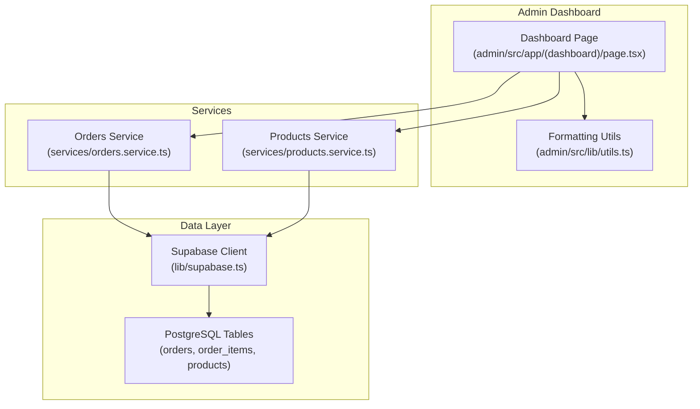
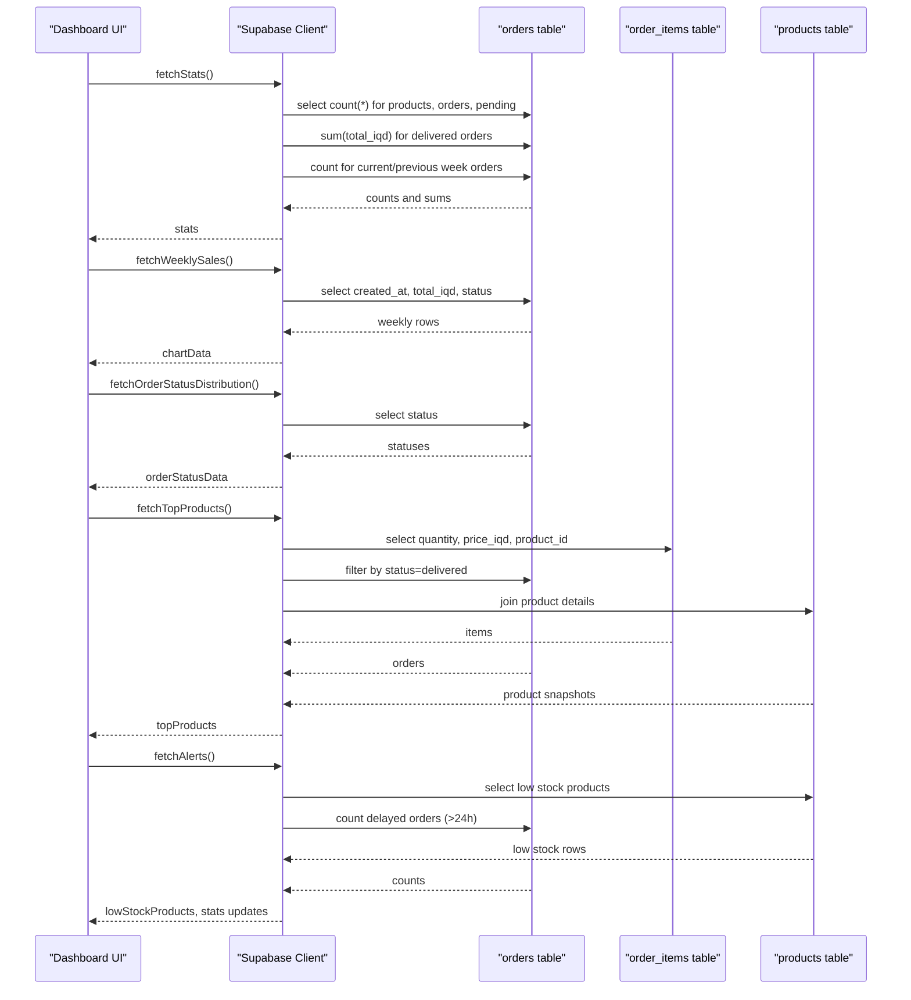
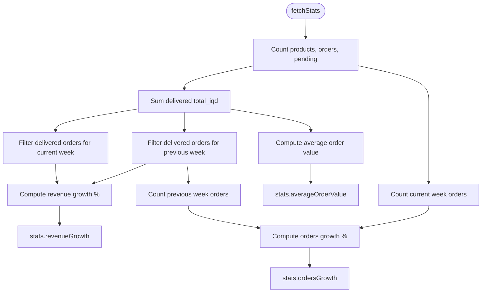
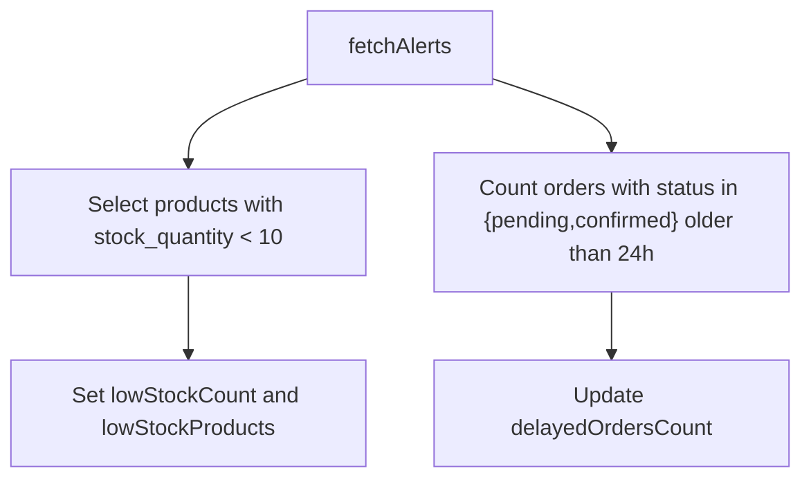
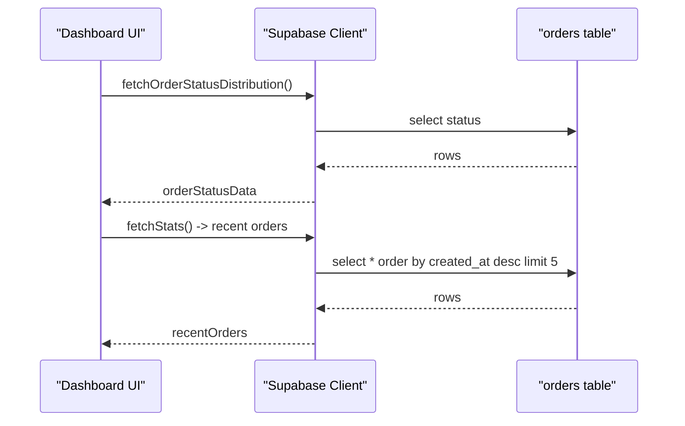
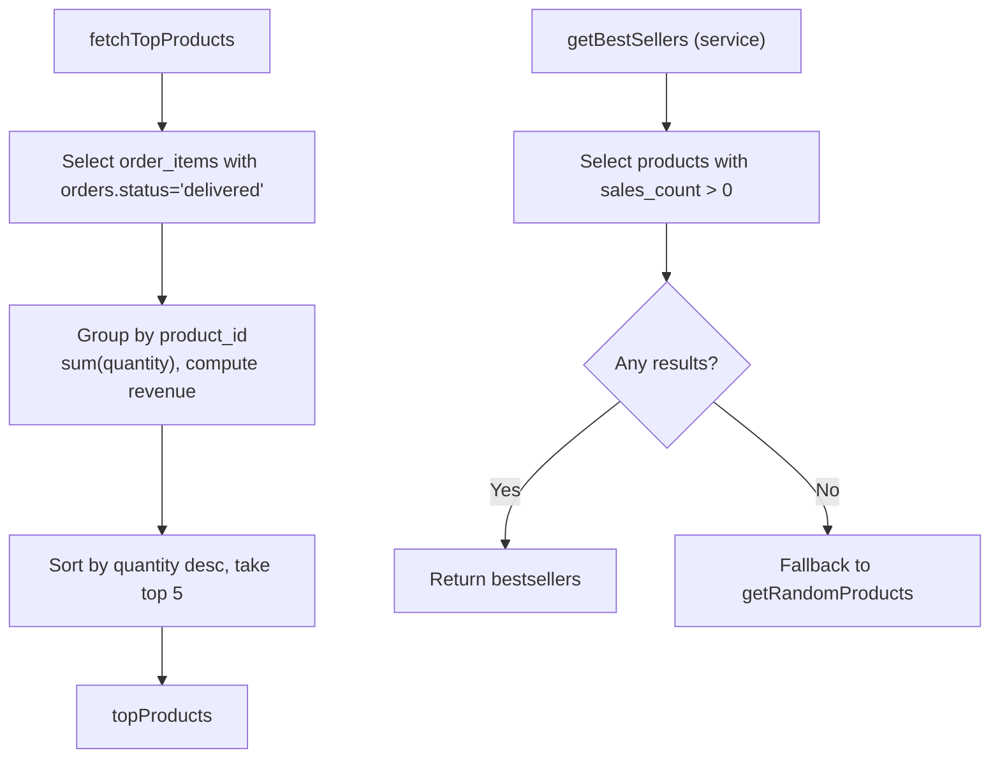
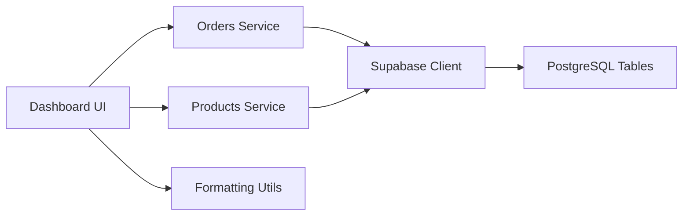

# Analytics and Reporting

<cite>
**Referenced Files in This Document**
- [admin/src/app/(dashboard)/page.tsx](file://admin/src/app/(dashboard)/page.tsx)
- [services/orders.service.ts](file://services/orders.service.ts)
- [services/products.service.ts](file://services/products.service.ts)
- [admin/src/lib/utils.ts](file://admin/src/lib/utils.ts)
- [lib/supabase.ts](file://lib/supabase.ts)
- [.docs/ORDERS_REALTIME_SETUP.md](file://.docs/ORDERS_REALTIME_SETUP.md)
</cite>

## Table of Contents
1. [Introduction](#introduction)
2. [Project Structure](#project-structure)
3. [Core Components](#core-components)
4. [Architecture Overview](#architecture-overview)
5. [Detailed Component Analysis](#detailed-component-analysis)
6. [Dependency Analysis](#dependency-analysis)
7. [Performance Considerations](#performance-considerations)
8. [Troubleshooting Guide](#troubleshooting-guide)
9. [Conclusion](#conclusion)
10. [Appendices](#appendices)

## Introduction
This document explains the analytics and reporting system built into the admin dashboard. It covers how the sales analytics dashboard presents revenue trends, conversion metrics, and performance indicators; how inventory analytics surface stock levels and low-stock alerts; how order analytics reflect fulfillment and delivery performance; and how product performance analytics highlight bestsellers and top-performing SKUs. It also outlines the current data visualization stack, real-time capabilities, and practical guidance for extending analytics, configuring KPIs, and making data-driven decisions.

## Project Structure
The analytics dashboard is implemented as a Next.js client component in the admin application. It orchestrates multiple data fetches against the Supabase backend, aggregates metrics, and renders charts and lists using Recharts and Tailwind. Supporting services encapsulate order and product data access, while shared utilities provide currency formatting.

**Diagram sources**
- [admin/src/app/(dashboard)/page.tsx:1-689](file://admin/src/app/(dashboard)/page.tsx#L1-L689)
- [admin/src/lib/utils.ts:1-15](file://admin/src/lib/utils.ts#L1-L15)
- [services/orders.service.ts:1-115](file://services/orders.service.ts#L1-L115)
- [services/products.service.ts:1-449](file://services/products.service.ts#L1-L449)
- [lib/supabase.ts:1-30](file://lib/supabase.ts#L1-L30)

**Section sources**
- [admin/src/app/(dashboard)/page.tsx:1-689](file://admin/src/app/(dashboard)/page.tsx#L1-L689)
- [admin/src/lib/utils.ts:1-15](file://admin/src/lib/utils.ts#L1-L15)
- [services/orders.service.ts:1-115](file://services/orders.service.ts#L1-L115)
- [services/products.service.ts:1-449](file://services/products.service.ts#L1-L449)
- [lib/supabase.ts:1-30](file://lib/supabase.ts#L1-L30)

## Core Components
- Sales Analytics Dashboard
  - Revenue totals, weekly growth, and average order value are computed from delivered orders and presented via summary cards.
  - Weekly sales trend is visualized as a bar chart grouped by Arabic weekday names.
  - Order status distribution is shown as a pie chart with localized labels and colors.
- Inventory Analytics
  - Low-stock alerts surface products with quantities below a threshold.
  - Links to filtered views enable quick remediation.
- Order Analytics
  - Recent orders list with status badges and formatted totals.
  - Order status distribution highlights fulfillment stages.
- Product Performance Analytics
  - Top-selling products aggregated from delivered order items, including quantity and revenue.
- Utilities
  - IQD currency formatting for Iraqi Dinars with zero decimals.

**Section sources**
- [admin/src/app/(dashboard)/page.tsx:69-324](file://admin/src/app/(dashboard)/page.tsx#L69-L324)
- [admin/src/app/(dashboard)/page.tsx:380-495](file://admin/src/app/(dashboard)/page.tsx#L380-L495)
- [admin/src/app/(dashboard)/page.tsx:497-639](file://admin/src/app/(dashboard)/page.tsx#L497-L639)
- [admin/src/lib/utils.ts:8-14](file://admin/src/lib/utils.ts#L8-L14)

## Architecture Overview
The dashboard composes analytics by:
- Fetching counts and aggregates from the orders and products tables.
- Computing derived metrics such as weekly revenue, growth percentages, and average order value.
- Aggregating order items to derive top products by quantity and revenue.
- Rendering charts and lists with Recharts and Tailwind.
- Providing quick actions and filtered links to drill down into underlying datasets.

**Diagram sources**
- [admin/src/app/(dashboard)/page.tsx:93-324](file://admin/src/app/(dashboard)/page.tsx#L93-L324)
- [services/orders.service.ts:39-78](file://services/orders.service.ts#L39-L78)
- [services/products.service.ts:158-177](file://services/products.service.ts#L158-L177)

## Detailed Component Analysis

### Sales Analytics Dashboard
- Metrics
  - Total revenue from delivered orders.
  - Total orders and pending orders.
  - Average order value based on delivered orders.
  - Revenue and order volume growth compared to the previous week.
- Visualization
  - Weekly sales bar chart grouped by Arabic weekday names.
  - Order status distribution pie chart with localized status labels.
- Recent Orders
  - Latest orders list with status badges and formatted totals.

**Diagram sources**
- [admin/src/app/(dashboard)/page.tsx:105-182](file://admin/src/app/(dashboard)/page.tsx#L105-L182)

**Section sources**
- [admin/src/app/(dashboard)/page.tsx:105-182](file://admin/src/app/(dashboard)/page.tsx#L105-L182)
- [admin/src/app/(dashboard)/page.tsx:497-562](file://admin/src/app/(dashboard)/page.tsx#L497-L562)

### Inventory Analytics
- Low Stock Alerts
  - Products with stock_quantity below a threshold are surfaced with a count and preview grid.
  - Provides quick navigation to filtered product listings.
- Threshold Tuning
  - The threshold is currently hardcoded; can be externalized via configuration for customization per site.

**Diagram sources**
- [admin/src/app/(dashboard)/page.tsx:300-324](file://admin/src/app/(dashboard)/page.tsx#L300-L324)

**Section sources**
- [admin/src/app/(dashboard)/page.tsx:300-324](file://admin/src/app/(dashboard)/page.tsx#L300-L324)

### Order Analytics
- Order Status Distribution
  - Counts per status across all orders, visualized as a pie chart with localized labels.
- Recent Orders
  - Displays latest orders with delivery initials, dates, statuses, and totals.

**Diagram sources**
- [admin/src/app/(dashboard)/page.tsx:224-254](file://admin/src/app/(dashboard)/page.tsx#L224-L254)
- [admin/src/app/(dashboard)/page.tsx:134-141](file://admin/src/app/(dashboard)/page.tsx#L134-L141)

**Section sources**
- [admin/src/app/(dashboard)/page.tsx:224-254](file://admin/src/app/(dashboard)/page.tsx#L224-L254)
- [admin/src/app/(dashboard)/page.tsx:604-639](file://admin/src/app/(dashboard)/page.tsx#L604-L639)

### Product Performance Analytics
- Top Products by Quantity
  - Aggregates delivered order items by product, summing quantity and computing revenue.
  - Returns top 5 products by quantity sold.
- Bestsellers Service
  - A service-level function retrieves bestsellers from the products table using sales_count, falling back to random products if none are found.

**Diagram sources**
- [admin/src/app/(dashboard)/page.tsx:256-298](file://admin/src/app/(dashboard)/page.tsx#L256-L298)
- [services/products.service.ts:158-177](file://services/products.service.ts#L158-L177)

**Section sources**
- [admin/src/app/(dashboard)/page.tsx:256-298](file://admin/src/app/(dashboard)/page.tsx#L256-L298)
- [services/products.service.ts:158-177](file://services/products.service.ts#L158-L177)

### Data Visualization Tools
- Charts
  - Bar chart for weekly sales with responsive container, tooltips, and localized Y-axis formatting.
  - Pie chart for order status distribution with legend and tooltip.
- Formatting
  - IQD currency formatting with Arabic locale and zero decimals.

**Section sources**
- [admin/src/app/(dashboard)/page.tsx:497-562](file://admin/src/app/(dashboard)/page.tsx#L497-L562)
- [admin/src/lib/utils.ts:8-14](file://admin/src/lib/utils.ts#L8-L14)

### Real-Time Dashboards and Automated Reports
- Real-Time Signals
  - The dashboard refreshes on initial load and performs parallel data fetching for all tiles.
  - There is no periodic polling or WebSocket integration in the current implementation.
- Automated Reports
  - No scheduled exports or report generation endpoints are present in the analyzed files.

**Section sources**
- [admin/src/app/(dashboard)/page.tsx:89-103](file://admin/src/app/(dashboard)/page.tsx#L89-L103)

### Custom Analytics Development and KPI Tracking
- Extensibility Points
  - New metrics can be added by extending the stats aggregation functions and adding new chart sections.
  - Additional KPIs can be introduced by adding new fetchers and summary cards.
- Configuration
  - Thresholds (e.g., low stock) and time windows (e.g., weekly comparisons) are currently embedded in the dashboard logic and can be externalized to configuration for flexibility.

**Section sources**
- [admin/src/app/(dashboard)/page.tsx:69-103](file://admin/src/app/(dashboard)/page.tsx#L69-L103)

## Dependency Analysis
The dashboard depends on:
- Supabase client for database queries.
- Services for higher-level operations (orders and products).
- Recharts for visualization.
- Utility functions for currency formatting.

**Diagram sources**
- [admin/src/app/(dashboard)/page.tsx:1-689](file://admin/src/app/(dashboard)/page.tsx#L1-L689)
- [services/orders.service.ts:1-115](file://services/orders.service.ts#L1-L115)
- [services/products.service.ts:1-449](file://services/products.service.ts#L1-L449)
- [admin/src/lib/utils.ts:1-15](file://admin/src/lib/utils.ts#L1-L15)
- [lib/supabase.ts:1-30](file://lib/supabase.ts#L1-L30)

**Section sources**
- [admin/src/app/(dashboard)/page.tsx:1-689](file://admin/src/app/(dashboard)/page.tsx#L1-L689)
- [services/orders.service.ts:1-115](file://services/orders.service.ts#L1-L115)
- [services/products.service.ts:1-449](file://services/products.service.ts#L1-L449)
- [admin/src/lib/utils.ts:1-15](file://admin/src/lib/utils.ts#L1-L15)
- [lib/supabase.ts:1-30](file://lib/supabase.ts#L1-L30)

## Performance Considerations
- Parallel Fetching
  - The dashboard uses concurrent data loading to minimize initial render latency.
- Data Volume
  - Weekly sales aggregation groups by day; consider limiting the date range or caching results for heavy periods.
- Rendering
  - Recharts containers are responsive; ensure minimal re-renders by passing stable props.
- Formatting
  - Currency formatting is lightweight but avoid excessive re-computation in loops.

[No sources needed since this section provides general guidance]

## Troubleshooting Guide
- Empty or Missing Data
  - Verify that delivered orders exist and that the status filters match the intended dataset.
  - Confirm that order items are populated for delivered orders.
- Currency Display
  - Ensure the IQD formatter is applied consistently across numeric values.
- Low Stock Threshold
  - Adjust the threshold constant if alerts fire too frequently or infrequently.
- Real-Time Updates
  - If real-time updates are required, integrate periodic polling or subscriptions and add a loading overlay during refresh.

**Section sources**
- [admin/src/app/(dashboard)/page.tsx:184-222](file://admin/src/app/(dashboard)/page.tsx#L184-L222)
- [admin/src/lib/utils.ts:8-14](file://admin/src/lib/utils.ts#L8-L14)

## Conclusion
The analytics dashboard provides a solid foundation for monitoring sales, inventory, orders, and product performance. It leverages Supabase for data access, Recharts for visualization, and Tailwind for responsive UI. To evolve the system, introduce configurable thresholds and KPIs, add real-time updates, and consider exporting capabilities for automated reporting.

[No sources needed since this section summarizes without analyzing specific files]

## Appendices

### Appendix A: Real-Time Setup Notes
- The repository includes a guide for real-time order updates. Consult the dedicated documentation for enabling live feeds and notifications.

**Section sources**
- [.docs/ORDERS_REALTIME_SETUP.md](file://.docs/ORDERS_REALTIME_SETUP.md)