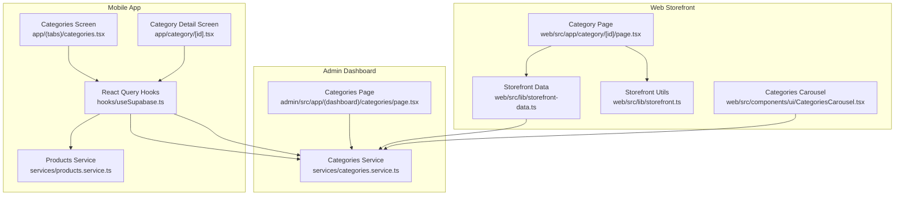
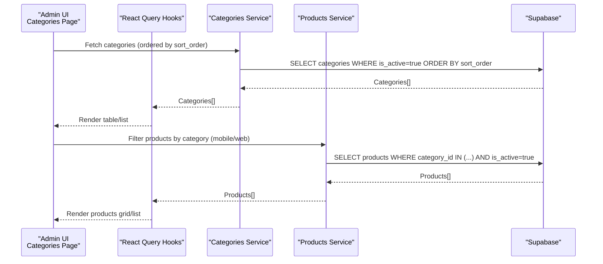
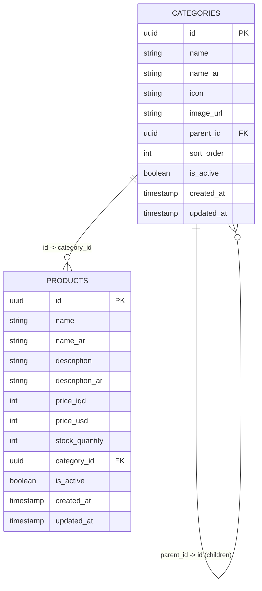
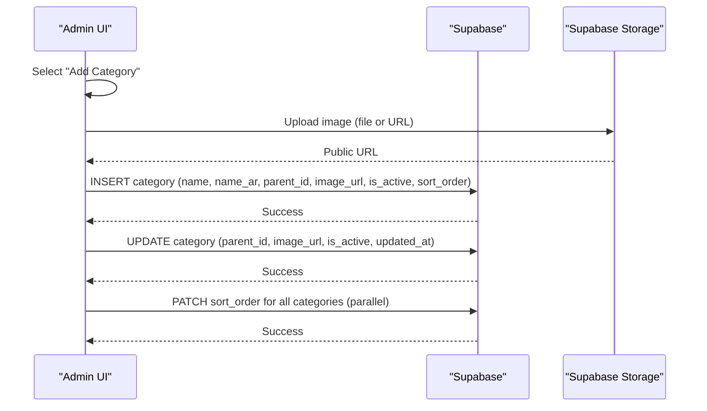
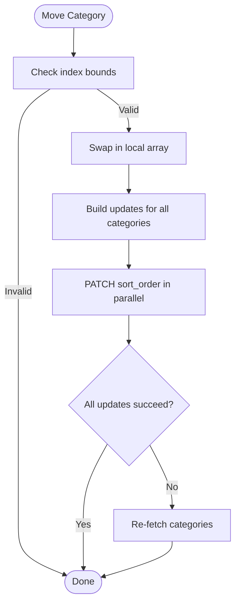
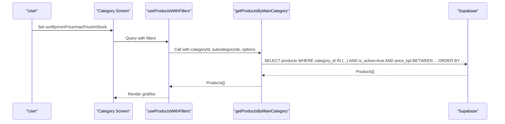
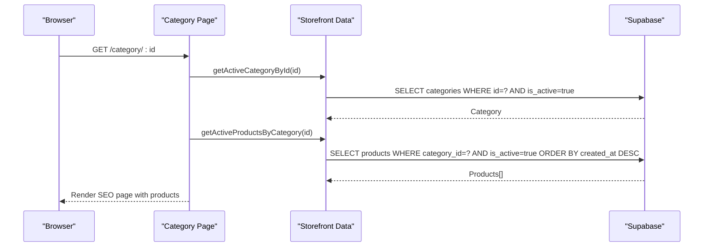
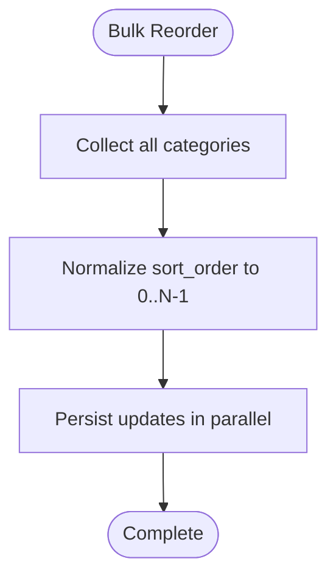
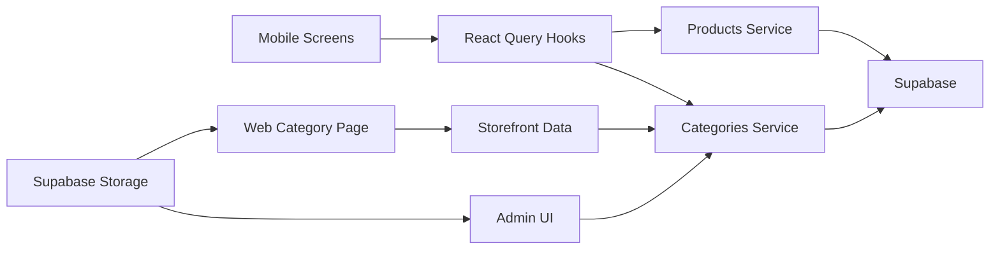

# Category Management

<cite>
**Referenced Files in This Document**
- [admin/src/app/(dashboard)/categories/page.tsx](file://admin/src/app/(dashboard)/categories/page.tsx)
- [services/categories.service.ts](file://services/categories.service.ts)
- [hooks/useSupabase.ts](file://hooks/useSupabase.ts)
- [services/products.service.ts](file://services/products.service.ts)
- [app/(tabs)/categories.tsx](file://app/(tabs)/categories.tsx)
- [app/category/[id].tsx](file://app/category/[id].tsx)
- [web/src/app/category/[id]/page.tsx](file://web/src/app/category/[id]/page.tsx)
- [web/src/lib/storefront-data.ts](file://web/src/lib/storefront-data.ts)
- [web/src/lib/storefront.ts](file://web/src/lib/storefront.ts)
- [web/src/components/ui/CategoriesCarousel.tsx](file://web/src/components/ui/CategoriesCarousel.tsx)
- [shared/types.ts](file://shared/types.ts)
</cite>

## Table of Contents
1. [Introduction](#introduction)
2. [Project Structure](#project-structure)
3. [Core Components](#core-components)
4. [Architecture Overview](#architecture-overview)
5. [Detailed Component Analysis](#detailed-component-analysis)
6. [Dependency Analysis](#dependency-analysis)
7. [Performance Considerations](#performance-considerations)
8. [Troubleshooting Guide](#troubleshooting-guide)
9. [Conclusion](#conclusion)
10. [Appendices](#appendices)

## Introduction
This document explains the category management system across the admin dashboard, mobile app, and web storefront. It covers the hierarchical category model, creation and editing workflows, parent-child relationships, ordering, filtering and sorting, visibility controls, SEO-friendly storefront rendering, and operational guidance for maintaining a clean and performant catalog.

## Project Structure
The category system spans three primary surfaces:
- Admin dashboard: category listing, creation, editing, image upload, and reordering.
- Mobile app: browsing main categories and category product listings with filters and sorting.
- Web storefront: SEO-friendly category pages with product listings.

**Diagram sources**
- [admin/src/app/(dashboard)/categories/page.tsx](file://admin/src/app/(dashboard)/categories/page.tsx#L10-L763)
- [services/categories.service.ts:12-136](file://services/categories.service.ts#L12-L136)
- [hooks/useSupabase.ts:41-88](file://hooks/useSupabase.ts#L41-L88)
- [services/products.service.ts:47-57](file://services/products.service.ts#L47-L57)
- [app/(tabs)/categories.tsx](file://app/(tabs)/categories.tsx#L10-L106)
- [app/category/[id].tsx](file://app/category/[id].tsx#L15-L433)
- [web/src/app/category/[id]/page.tsx](file://web/src/app/category/[id]/page.tsx#L19-L97)
- [web/src/lib/storefront-data.ts:50-85](file://web/src/lib/storefront-data.ts#L50-L85)
- [web/src/lib/storefront.ts:565-572](file://web/src/lib/storefront.ts#L565-L572)
- [web/src/components/ui/CategoriesCarousel.tsx:19-122](file://web/src/components/ui/CategoriesCarousel.tsx#L19-L122)

**Section sources**
- [admin/src/app/(dashboard)/categories/page.tsx](file://admin/src/app/(dashboard)/categories/page.tsx#L10-L763)
- [services/categories.service.ts:12-136](file://services/categories.service.ts#L12-L136)
- [hooks/useSupabase.ts:41-88](file://hooks/useSupabase.ts#L41-L88)
- [services/products.service.ts:47-57](file://services/products.service.ts#L47-L57)
- [app/(tabs)/categories.tsx](file://app/(tabs)/categories.tsx#L10-L106)
- [app/category/[id].tsx](file://app/category/[id].tsx#L15-L433)
- [web/src/app/category/[id]/page.tsx](file://web/src/app/category/[id]/page.tsx#L19-L97)
- [web/src/lib/storefront-data.ts:50-85](file://web/src/lib/storefront-data.ts#L50-L85)
- [web/src/lib/storefront.ts:565-572](file://web/src/lib/storefront.ts#L565-L572)
- [web/src/components/ui/CategoriesCarousel.tsx:19-122](file://web/src/components/ui/CategoriesCarousel.tsx#L19-L122)

## Core Components
- Category data model: hierarchical categories with optional parent references, sort order, and visibility flag.
- Admin UI: CRUD operations, image upload (file or URL), and drag-free reordering.
- Mobile UI: Main categories list and category product listing with filters and sorting.
- Web UI: SEO-friendly category pages with product grids and category navigation.

Key implementation highlights:
- Categories are ordered by a numeric sort_order field and filtered by is_active for public surfaces.
- Parent-child relationships are enforced via parent_id; main categories have null parent_id.
- Filtering and sorting on category product pages support price range, stock availability, and multiple sort criteria.

**Section sources**
- [shared/types.ts:33-48](file://shared/types.ts#L33-L48)
- [services/categories.service.ts:12-63](file://services/categories.service.ts#L12-L63)
- [admin/src/app/(dashboard)/categories/page.tsx](file://admin/src/app/(dashboard)/categories/page.tsx#L31-L54)
- [app/category/[id].tsx](file://app/category/[id].tsx#L21-L68)
- [services/products.service.ts:384-448](file://services/products.service.ts#L384-L448)

## Architecture Overview
The category architecture follows a layered pattern:
- Data access: Supabase-backed services for categories and products.
- Presentation: React Query hooks for caching and fetching.
- UI: Admin dashboard, mobile screens, and web pages.

**Diagram sources**
- [services/categories.service.ts:12-63](file://services/categories.service.ts#L12-L63)
- [hooks/useSupabase.ts:41-88](file://hooks/useSupabase.ts#L41-L88)
- [services/products.service.ts:384-448](file://services/products.service.ts#L384-L448)
- [admin/src/app/(dashboard)/categories/page.tsx](file://admin/src/app/(dashboard)/categories/page.tsx#L44-L54)

## Detailed Component Analysis

### Hierarchical Category Model
- Categories are stored with id, name (en/ar), optional icon, optional image_url, optional parent_id, numeric sort_order, is_active flag, and timestamps.
- Main categories are those where parent_id is null; subcategories reference a parent by parent_id.
- Sorting is maintained via sort_order and applied consistently across admin and public surfaces.

**Diagram sources**
- [shared/types.ts:33-48](file://shared/types.ts#L33-L48)
- [shared/types.ts:13-32](file://shared/types.ts#L13-L32)

**Section sources**
- [shared/types.ts:33-48](file://shared/types.ts#L33-L48)
- [services/categories.service.ts:53-63](file://services/categories.service.ts#L53-L63)

### Admin Category Management
- Listing: Fetches all categories ordered by sort_order; admin view includes inactive categories.
- Creation: Adds a new category with name (en/ar), optional parent_id, initial sort_order appended at the end, and optional image_url.
- Editing: Updates name, parent_id, image_url, and is_active flag; preserves sort_order during reordering.
- Image Upload: Supports file upload (PNG) and URL-based proxy upload; stores images in Supabase Storage under the categories bucket and sets cache-control.
- Reordering: Swaps adjacent rows locally for immediate feedback, then re-normalizes all sort_order values in parallel and persists to the database.

**Diagram sources**
- [admin/src/app/(dashboard)/categories/page.tsx](file://admin/src/app/(dashboard)/categories/page.tsx#L140-L165)
- [admin/src/app/(dashboard)/categories/page.tsx](file://admin/src/app/(dashboard)/categories/page.tsx#L226-L250)
- [admin/src/app/(dashboard)/categories/page.tsx](file://admin/src/app/(dashboard)/categories/page.tsx#L252-L286)

**Section sources**
- [admin/src/app/(dashboard)/categories/page.tsx](file://admin/src/app/(dashboard)/categories/page.tsx#L31-L54)
- [admin/src/app/(dashboard)/categories/page.tsx](file://admin/src/app/(dashboard)/categories/page.tsx#L140-L165)
- [admin/src/app/(dashboard)/categories/page.tsx](file://admin/src/app/(dashboard)/categories/page.tsx#L167-L174)
- [admin/src/app/(dashboard)/categories/page.tsx](file://admin/src/app/(dashboard)/categories/page.tsx#L176-L250)
- [admin/src/app/(dashboard)/categories/page.tsx](file://admin/src/app/(dashboard)/categories/page.tsx#L252-L286)

### Category Relationship Management (Parent-Child and Positioning)
- Parent selection dropdown excludes the current category to prevent self-parenting.
- Sorting is enforced by sort_order; moving up/down swaps positions locally and re-normalizes all entries to ensure contiguous 0-based indices.
- Subcategories are fetched by parent_id and filtered by is_active for public views.

**Diagram sources**
- [admin/src/app/(dashboard)/categories/page.tsx](file://admin/src/app/(dashboard)/categories/page.tsx#L252-L286)

**Section sources**
- [admin/src/app/(dashboard)/categories/page.tsx](file://admin/src/app/(dashboard)/categories/page.tsx#L636-L641)
- [services/categories.service.ts:68-78](file://services/categories.service.ts#L68-L78)
- [services/categories.service.ts:83-109](file://services/categories.service.ts#L83-L109)

### Category Filtering and Sorting (Mobile and Web)
- Mobile category detail screen supports:
  - Sorting by newest, oldest, price low/high, name A-Z/Z-A.
  - Price range slider and “in stock only” filter.
  - Active filter badge indicating applied filters.
- Web category page lists products with SEO-friendly metadata and breadcrumbs.

**Diagram sources**
- [app/category/[id].tsx](file://app/category/[id].tsx#L35-L45)
- [app/category/[id].tsx](file://app/category/[id].tsx#L56-L68)
- [services/products.service.ts:384-448](file://services/products.service.ts#L384-L448)
- [hooks/useSupabase.ts:104-119](file://hooks/useSupabase.ts#L104-L119)

**Section sources**
- [app/category/[id].tsx](file://app/category/[id].tsx#L21-L85)
- [app/category/[id].tsx](file://app/category/[id].tsx#L56-L68)
- [services/products.service.ts:384-448](file://services/products.service.ts#L384-L448)
- [hooks/useSupabase.ts:104-119](file://hooks/useSupabase.ts#L104-L119)

### Visibility Controls and SEO Configuration
- Visibility: is_active flag controls whether categories appear in public listings.
- SEO-friendly category pages:
  - Dynamic metadata and breadcrumbs.
  - Category image as hero background with gradient overlay.
  - Product listing grid with lazy loading.

**Diagram sources**
- [web/src/app/category/[id]/page.tsx](file://web/src/app/category/[id]/page.tsx#L19-L31)
- [web/src/lib/storefront-data.ts:171-192](file://web/src/lib/storefront-data.ts#L171-L192)
- [web/src/lib/storefront.ts:565-572](file://web/src/lib/storefront.ts#L565-L572)

**Section sources**
- [web/src/app/category/[id]/page.tsx](file://web/src/app/category/[id]/page.tsx#L32-L97)
- [web/src/lib/storefront-data.ts:171-192](file://web/src/lib/storefront-data.ts#L171-L192)
- [web/src/lib/storefront.ts:565-572](file://web/src/lib/storefront.ts#L565-L572)

### Bulk Operations and Mass Updates
- Reordering categories: The admin UI re-normalizes sort_order for all categories after a move operation to ensure consistent ordering.
- Image uploads: Both add and edit modals support file upload and URL-based proxy upload to Supabase Storage.

**Diagram sources**
- [admin/src/app/(dashboard)/categories/page.tsx](file://admin/src/app/(dashboard)/categories/page.tsx#L267-L286)

**Section sources**
- [admin/src/app/(dashboard)/categories/page.tsx](file://admin/src/app/(dashboard)/categories/page.tsx#L104-L138)
- [admin/src/app/(dashboard)/categories/page.tsx](file://admin/src/app/(dashboard)/categories/page.tsx#L190-L224)
- [admin/src/app/(dashboard)/categories/page.tsx](file://admin/src/app/(dashboard)/categories/page.tsx#L252-L286)

### Category Analytics and Reporting
- The codebase does not implement built-in category analytics for product distribution or sales performance.
- Recommendations:
  - Integrate sales metrics by joining orders/order_items with products and aggregating by category_id.
  - Track product counts per category and revenue contribution.
  - Expose analytics dashboards in the admin panel.

[No sources needed since this section provides general guidance]

### Deactivation, Reorganization, and Cleanup
- Deactivation: Toggle is_active to hide categories from public views while retaining historical data.
- Reorganization: Adjust parent_id to move subcategories; reorder via sort_order.
- Cleanup:
  - Remove unused categories with no associated products.
  - Archive or rename categories that become obsolete.
  - Ensure storage buckets do not accumulate orphaned images.

**Section sources**
- [services/categories.service.ts:12-21](file://services/categories.service.ts#L12-L21)
- [services/categories.service.ts:37-48](file://services/categories.service.ts#L37-L48)

### Best Practices for Category Structure Design
- Keep hierarchy shallow (1–3 levels) for usability.
- Use clear, localized names (en/ar) and representative images.
- Maintain consistent sort_order and avoid gaps.
- Prefer parent categories for broad product groups; use subcategories for fine-grained segmentation.
- Regularly audit and prune inactive or redundant categories.

[No sources needed since this section provides general guidance]

## Dependency Analysis
The category system relies on:
- Supabase for persistence and storage.
- React Query for caching and data fetching.
- Services for domain-specific queries.

**Diagram sources**
- [hooks/useSupabase.ts:23-31](file://hooks/useSupabase.ts#L23-L31)
- [services/categories.service.ts:12-63](file://services/categories.service.ts#L12-L63)
- [services/products.service.ts:47-57](file://services/products.service.ts#L47-L57)
- [web/src/lib/storefront-data.ts:50-85](file://web/src/lib/storefront-data.ts#L50-L85)

**Section sources**
- [hooks/useSupabase.ts:23-31](file://hooks/useSupabase.ts#L23-L31)
- [services/categories.service.ts:12-63](file://services/categories.service.ts#L12-L63)
- [services/products.service.ts:47-57](file://services/products.service.ts#L47-L57)
- [web/src/lib/storefront-data.ts:50-85](file://web/src/lib/storefront-data.ts#L50-L85)

## Performance Considerations
- Use sort_order to minimize expensive re-sorting operations.
- Fetch only necessary fields for category/product lists to reduce payload sizes.
- Cache frequently accessed category trees using React Query.
- Batch and parallelize reordering updates to reduce latency.

[No sources needed since this section provides general guidance]

## Troubleshooting Guide
- Category not appearing in mobile/web:
  - Verify is_active is true and sort_order is set.
  - Confirm category_id matches product.category_id.
- Image upload errors:
  - Ensure file type is PNG and storage bucket permissions allow uploads.
  - Check proxy image endpoint for external URLs.
- Reordering anomalies:
  - Trigger a refresh to re-fetch normalized sort_order values.

**Section sources**
- [admin/src/app/(dashboard)/categories/page.tsx](file://admin/src/app/(dashboard)/categories/page.tsx#L104-L138)
- [admin/src/app/(dashboard)/categories/page.tsx](file://admin/src/app/(dashboard)/categories/page.tsx#L190-L224)
- [admin/src/app/(dashboard)/categories/page.tsx](file://admin/src/app/(dashboard)/categories/page.tsx#L252-L286)

## Conclusion
The category management system provides a robust, multichannel solution for organizing product catalogs. It supports hierarchical categorization, flexible visibility controls, efficient filtering and sorting, and scalable reordering. By following the recommended best practices and leveraging the provided APIs, administrators can maintain a clean, performant, and user-friendly catalog across the admin, mobile, and web platforms.

## Appendices
- Data model and enums are defined centrally for consistency across services and UI layers.

**Section sources**
- [shared/types.ts:33-48](file://shared/types.ts#L33-L48)
- [shared/types.ts:341-345](file://shared/types.ts#L341-L345)