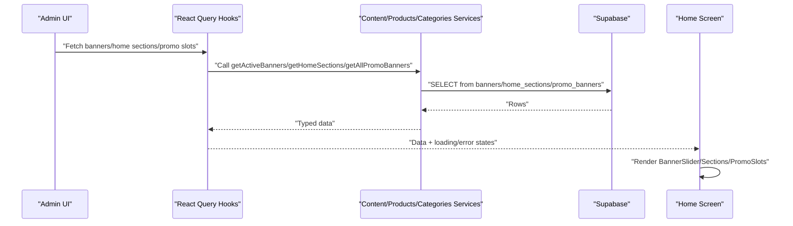
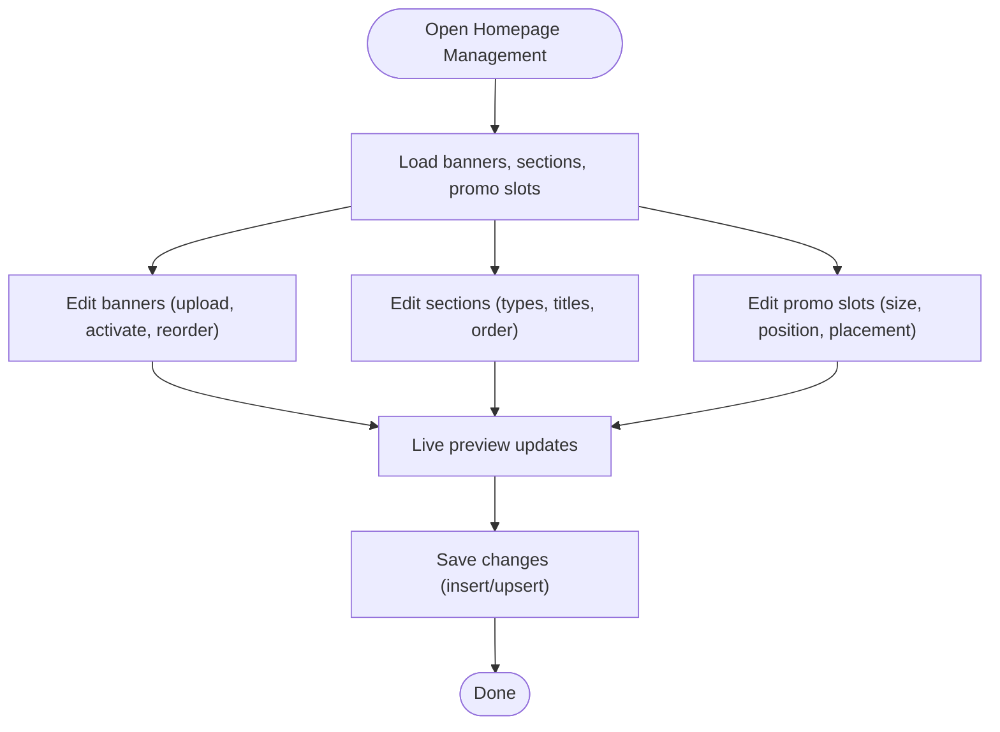
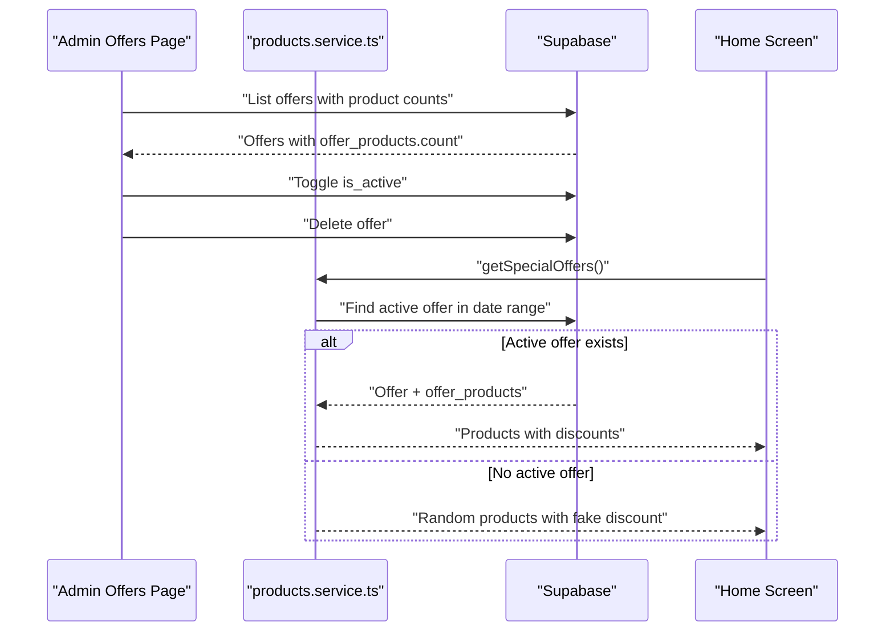
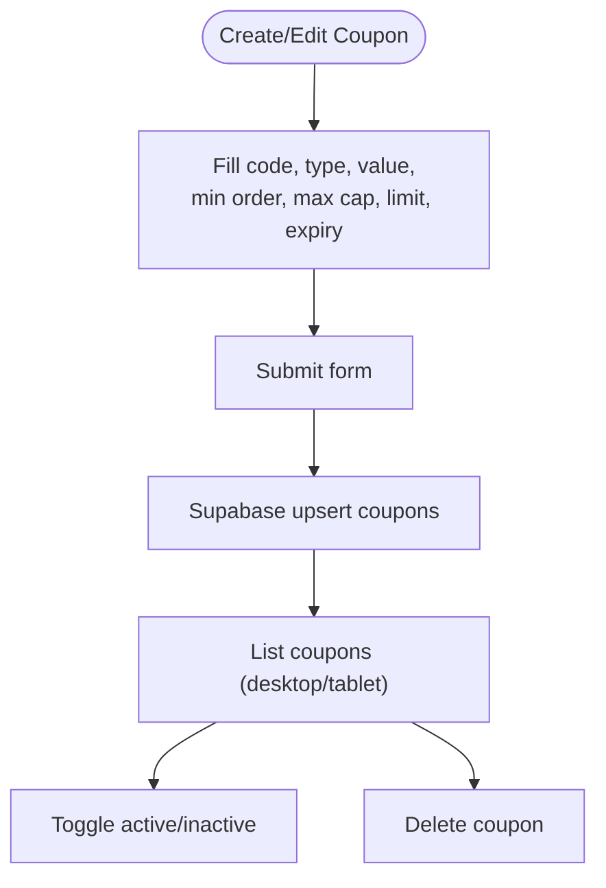
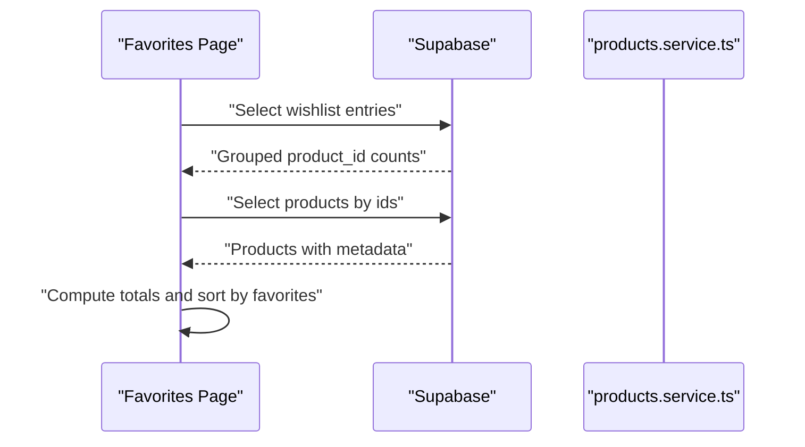
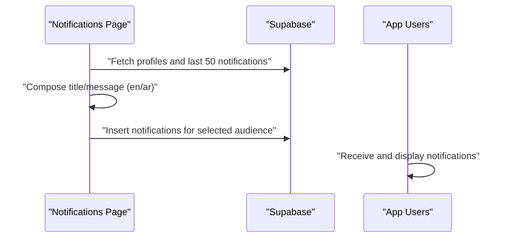
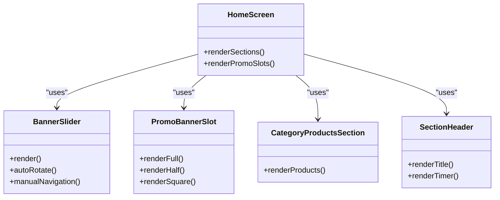
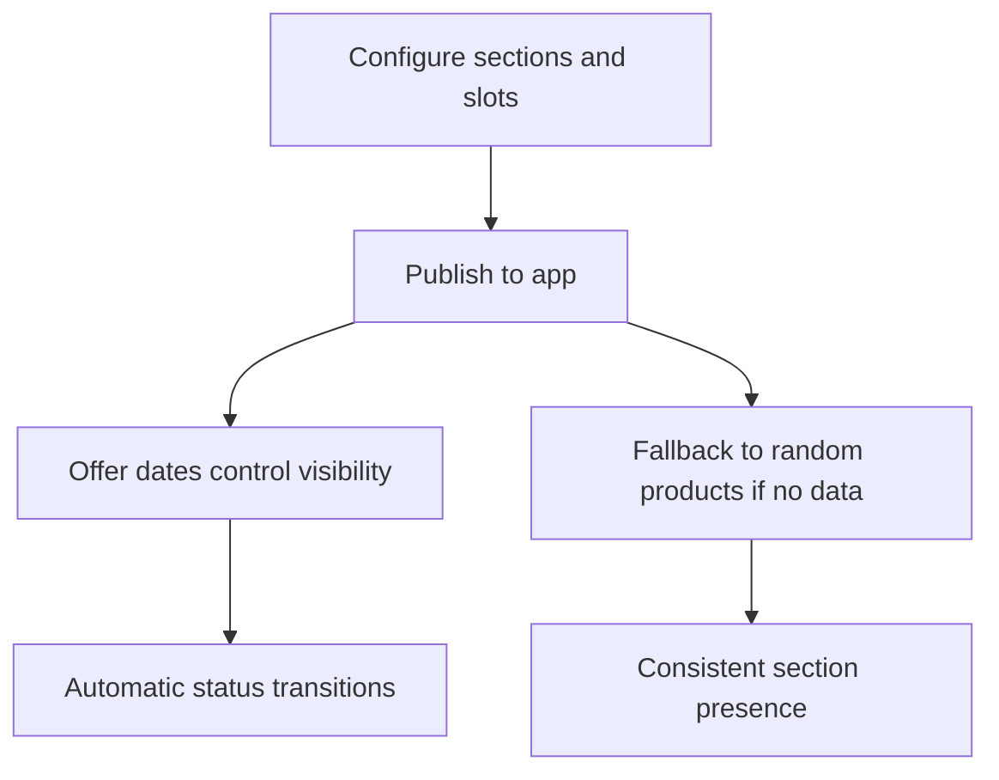
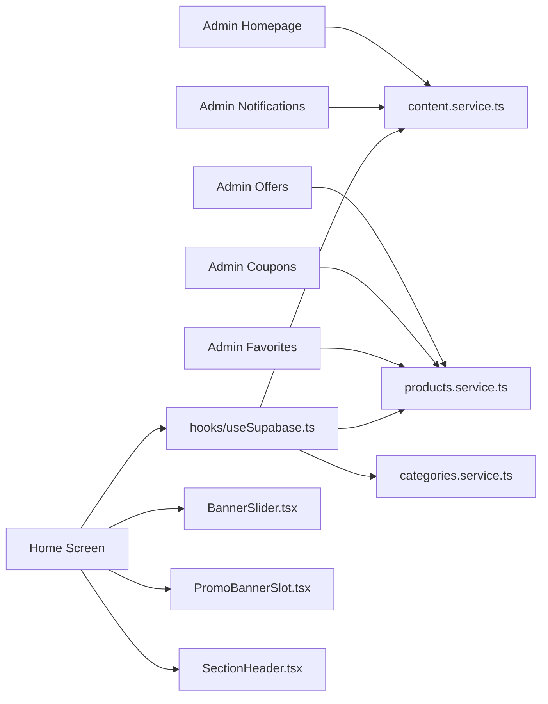

# Content Management

<cite>
**Referenced Files in This Document**
- [admin/src/app/(dashboard)/homepage/page.tsx](file://admin/src/app/(dashboard)/homepage/page.tsx)
- [admin/src/app/(dashboard)/offers/page.tsx](file://admin/src/app/(dashboard)/offers/page.tsx)
- [admin/src/app/(dashboard)/coupons/page.tsx](file://admin/src/app/(dashboard)/coupons/page.tsx)
- [admin/src/app/(dashboard)/favorites/page.tsx](file://admin/src/app/(dashboard)/favorites/page.tsx)
- [admin/src/app/(dashboard)/notifications/page.tsx](file://admin/src/app/(dashboard)/notifications/page.tsx)
- [app/(tabs)/index.tsx](file://app/(tabs)/index.tsx)
- [hooks/useSupabase.ts](file://hooks/useSupabase.ts)
- [services/content.service.ts](file://services/content.service.ts)
- [services/products.service.ts](file://services/products.service.ts)
- [services/categories.service.ts](file://services/categories.service.ts)
- [components/ui/BannerSlider.tsx](file://components/ui/BannerSlider.tsx)
- [components/ui/PromoBannerSlot.tsx](file://components/ui/PromoBannerSlot.tsx)
- [components/ui/CategoryProductsSection.tsx](file://components/ui/CategoryProductsSection.tsx)
- [components/ui/SectionHeader.tsx](file://components/ui/SectionHeader.tsx)
- [locales/en.json](file://locales/en.json)
- [locales/ar.json](file://locales/ar.json)
</cite>

## Table of Contents
1. [Introduction](#introduction)
2. [Project Structure](#project-structure)
3. [Core Components](#core-components)
4. [Architecture Overview](#architecture-overview)
5. [Detailed Component Analysis](#detailed-component-analysis)
6. [Dependency Analysis](#dependency-analysis)
7. [Performance Considerations](#performance-considerations)
8. [Troubleshooting Guide](#troubleshooting-guide)
9. [Conclusion](#conclusion)
10. [Appendices](#appendices)

## Introduction
This document explains the content management system for the marketplace application. It covers homepage content management (banners, sections, promotional slots), offers and promotions (discounts, coupons, scheduling), notifications (in-app, push-like storage), favorites and trending insights, content scheduling and automation, localization, analytics and conversion tracking, editorial workflows, and content strategy optimization including A/B testing.

## Project Structure
The system is split into:
- Admin dashboard pages for managing content, offers, coupons, favorites, and notifications
- Frontend screens and components rendering homepage content, sections, and promotional slots
- Services and hooks orchestrating data fetching and caching
- Localization resources for Arabic and English
- Supabase-backed data model for banners, home sections, promo slots, offers, coupons, and notifications

```mermaid
graph TB
subgraph "Admin Dashboard"
A_Home["Homepage Management<br/>(admin/src/app/(dashboard)/homepage/page.tsx)"]
A_Offers["Offers Management<br/>(admin/src/app/(dashboard)/offers/page.tsx)"]
A_Coupons["Coupons Management<br/>(admin/src/app/(dashboard)/coupons/page.tsx)"]
A_Favorites["Favorites Insights<br/>(admin/src/app/(dashboard)/favorites/page.tsx)"]
A_Notifications["Notifications Console<br/>(admin/src/app/(dashboard)/notifications/page.tsx)"]
end
subgraph "Frontend"
F_Home["Home Screen<br/>(app/(tabs)/index.tsx)"]
C_Banner["BannerSlider<br/>(components/ui/BannerSlider.tsx)"]
C_Promo["PromoBannerSlot<br/>(components/ui/PromoBannerSlot.tsx)"]
C_Section["CategoryProductsSection<br/>(components/ui/CategoryProductsSection.tsx)"]
C_Header["SectionHeader<br/>(components/ui/SectionHeader.tsx)"]
end
subgraph "Services & Hooks"
S_Content["content.service.ts"]
S_Products["products.service.ts"]
S_Categories["categories.service.ts"]
H_UseSupabase["hooks/useSupabase.ts"]
end
subgraph "Localization"
L_EN["en.json"]
L_AR["ar.json"]
end
A_Home --> S_Content
A_Offers --> S_Products
A_Coupons --> S_Products
A_Favorites --> S_Products
A_Notifications --> S_Content
F_Home --> H_UseSupabase
H_UseSupabase --> S_Content
H_UseSupabase --> S_Products
H_UseSupabase --> S_Categories
F_Home --> C_Banner
F_Home --> C_Promo
F_Home --> C_Section
F_Home --> C_Header
L_EN -.-> F_Home
L_AR -.-> F_Home
```

**Diagram sources**
- [admin/src/app/(dashboard)/homepage/page.tsx](file://admin/src/app/(dashboard)/homepage/page.tsx#L107-L418)
- [admin/src/app/(dashboard)/offers/page.tsx](file://admin/src/app/(dashboard)/offers/page.tsx#L27-L378)
- [admin/src/app/(dashboard)/coupons/page.tsx](file://admin/src/app/(dashboard)/coupons/page.tsx#L25-L464)
- [admin/src/app/(dashboard)/favorites/page.tsx](file://admin/src/app/(dashboard)/favorites/page.tsx#L25-L301)
- [admin/src/app/(dashboard)/notifications/page.tsx](file://admin/src/app/(dashboard)/notifications/page.tsx#L33-L345)
- [app/(tabs)/index.tsx](file://app/(tabs)/index.tsx#L16-L447)
- [hooks/useSupabase.ts:32-239](file://hooks/useSupabase.ts#L32-L239)
- [services/content.service.ts:1-147](file://services/content.service.ts#L1-L147)
- [services/products.service.ts:1-449](file://services/products.service.ts#L1-L449)
- [services/categories.service.ts:1-137](file://services/categories.service.ts#L1-L137)
- [components/ui/BannerSlider.tsx:23-152](file://components/ui/BannerSlider.tsx#L23-L152)
- [components/ui/PromoBannerSlot.tsx:18-200](file://components/ui/PromoBannerSlot.tsx#L18-L200)
- [components/ui/CategoryProductsSection.tsx:18-66](file://components/ui/CategoryProductsSection.tsx#L18-L66)
- [components/ui/SectionHeader.tsx:15-67](file://components/ui/SectionHeader.tsx#L15-L67)
- [locales/en.json:1-413](file://locales/en.json#L1-L413)
- [locales/ar.json:1-413](file://locales/ar.json#L1-L413)

**Section sources**
- [admin/src/app/(dashboard)/homepage/page.tsx](file://admin/src/app/(dashboard)/homepage/page.tsx#L107-L418)
- [admin/src/app/(dashboard)/offers/page.tsx](file://admin/src/app/(dashboard)/offers/page.tsx#L27-L378)
- [admin/src/app/(dashboard)/coupons/page.tsx](file://admin/src/app/(dashboard)/coupons/page.tsx#L25-L464)
- [admin/src/app/(dashboard)/favorites/page.tsx](file://admin/src/app/(dashboard)/favorites/page.tsx#L25-L301)
- [admin/src/app/(dashboard)/notifications/page.tsx](file://admin/src/app/(dashboard)/notifications/page.tsx#L33-L345)
- [app/(tabs)/index.tsx](file://app/(tabs)/index.tsx#L16-L447)
- [hooks/useSupabase.ts:32-239](file://hooks/useSupabase.ts#L32-L239)
- [services/content.service.ts:1-147](file://services/content.service.ts#L1-L147)
- [services/products.service.ts:1-449](file://services/products.service.ts#L1-L449)
- [services/categories.service.ts:1-137](file://services/categories.service.ts#L1-L137)
- [components/ui/BannerSlider.tsx:23-152](file://components/ui/BannerSlider.tsx#L23-L152)
- [components/ui/PromoBannerSlot.tsx:18-200](file://components/ui/PromoBannerSlot.tsx#L18-L200)
- [components/ui/CategoryProductsSection.tsx:18-66](file://components/ui/CategoryProductsSection.tsx#L18-L66)
- [components/ui/SectionHeader.tsx:15-67](file://components/ui/SectionHeader.tsx#L15-L67)
- [locales/en.json:1-413](file://locales/en.json#L1-L413)
- [locales/ar.json:1-413](file://locales/ar.json#L1-L413)

## Core Components
- Homepage management panel: manage banners, homepage sections, and promotional slots with live preview and drag-to-order.
- Offers management: create, schedule, activate/deactivate, and filter offers with status indicators and countdown timers.
- Coupons management: define discount types, caps, usage limits, expiration, and activation state.
- Favorites insights: aggregate wishlist counts, rank top favorites, and filter/search by product.
- Notifications console: broadcast in-app notifications to all or selected users with multilingual support.
- Frontend homepage renderer: dynamic sections, banner carousel, and promotional slots with localization.
- Services and hooks: centralized Supabase queries for banners, sections, offers, coupons, categories, and trending.
- Localization: bilingual keys for UI and content strings.

**Section sources**
- [admin/src/app/(dashboard)/homepage/page.tsx](file://admin/src/app/(dashboard)/homepage/page.tsx#L107-L418)
- [admin/src/app/(dashboard)/offers/page.tsx](file://admin/src/app/(dashboard)/offers/page.tsx#L27-L378)
- [admin/src/app/(dashboard)/coupons/page.tsx](file://admin/src/app/(dashboard)/coupons/page.tsx#L25-L464)
- [admin/src/app/(dashboard)/favorites/page.tsx](file://admin/src/app/(dashboard)/favorites/page.tsx#L25-L301)
- [admin/src/app/(dashboard)/notifications/page.tsx](file://admin/src/app/(dashboard)/notifications/page.tsx#L33-L345)
- [app/(tabs)/index.tsx](file://app/(tabs)/index.tsx#L16-L447)
- [hooks/useSupabase.ts:32-239](file://hooks/useSupabase.ts#L32-L239)
- [services/content.service.ts:1-147](file://services/content.service.ts#L1-L147)
- [services/products.service.ts:1-449](file://services/products.service.ts#L1-L449)
- [services/categories.service.ts:1-137](file://services/categories.service.ts#L1-L137)
- [locales/en.json:1-413](file://locales/en.json#L1-L413)
- [locales/ar.json:1-413](file://locales/ar.json#L1-L413)

## Architecture Overview
The system follows a layered architecture:
- Admin UI: CRUD and orchestration for content, offers, coupons, favorites, and notifications.
- Services: typed Supabase queries for content, products, categories, and offers.
- Hooks: React Query wrappers for caching, refetching, and optimistic updates.
- Frontend: declarative rendering of homepage sections, banners, and promotional slots.
- Localization: bilingual JSON resources consumed via context.

**Diagram sources**
- [hooks/useSupabase.ts:32-239](file://hooks/useSupabase.ts#L32-L239)
- [services/content.service.ts:1-147](file://services/content.service.ts#L1-L147)
- [app/(tabs)/index.tsx](file://app/(tabs)/index.tsx#L16-L447)

## Detailed Component Analysis

### Homepage Content Management
- Banners: create, reorder, activate/deactivate, upload images to Supabase storage, and preview in admin.
- Sections: configure section types (categories, special offers, best sellers, new arrivals, trending, category_products), set titles/icons/descriptions, reorder via drag-and-drop, and toggle visibility.
- Promotional slots: place promotional banners after specific sections or at the end of the page; choose sizes (full, half, square); manage positions and activation.
- Preview mode: real-time preview of the mobile homepage with sliders and promo slots.

**Diagram sources**
- [admin/src/app/(dashboard)/homepage/page.tsx](file://admin/src/app/(dashboard)/homepage/page.tsx#L107-L418)
- [services/content.service.ts:1-147](file://services/content.service.ts#L1-L147)

**Section sources**
- [admin/src/app/(dashboard)/homepage/page.tsx](file://admin/src/app/(dashboard)/homepage/page.tsx#L107-L418)
- [services/content.service.ts:1-147](file://services/content.service.ts#L1-L147)

### Offers and Promotion Management
- Create offers with discount type (percentage/fixed), value, start/end dates, and image.
- Toggle active state; filter by status (active, upcoming, expired).
- Automatic status detection and countdown timers for active offers.
- Fallback behavior: when no active offers exist, “daily deals” are shown using random products with simulated discounts.

**Diagram sources**
- [admin/src/app/(dashboard)/offers/page.tsx](file://admin/src/app/(dashboard)/offers/page.tsx#L27-L378)
- [services/products.service.ts:72-152](file://services/products.service.ts#L72-L152)
- [app/(tabs)/index.tsx](file://app/(tabs)/index.tsx#L216-L255)

**Section sources**
- [admin/src/app/(dashboard)/offers/page.tsx](file://admin/src/app/(dashboard)/offers/page.tsx#L27-L378)
- [services/products.service.ts:72-152](file://services/products.service.ts#L72-L152)
- [app/(tabs)/index.tsx](file://app/(tabs)/index.tsx#L216-L255)

### Coupons Management
- Define coupon codes with discount type/value, optional min order, max discount cap (for percentage), usage limit, expiration date, and activation.
- UI supports desktop/tablet views with sorting and filtering.
- Validation and persistence via Supabase insert/update.

**Diagram sources**
- [admin/src/app/(dashboard)/coupons/page.tsx](file://admin/src/app/(dashboard)/coupons/page.tsx#L25-L464)
- [services/products.service.ts:1-449](file://services/products.service.ts#L1-L449)

**Section sources**
- [admin/src/app/(dashboard)/coupons/page.tsx](file://admin/src/app/(dashboard)/coupons/page.tsx#L25-L464)
- [services/products.service.ts:1-449](file://services/products.service.ts#L1-L449)

### Favorites and Trending Insights
- Aggregates wishlist counts per product and sorts by popularity.
- Provides search and stats cards (total favorites, products in favorites, average per product).
- Useful for editorial decisions on featured content and promotional targeting.

**Diagram sources**
- [admin/src/app/(dashboard)/favorites/page.tsx](file://admin/src/app/(dashboard)/favorites/page.tsx#L25-L301)
- [services/products.service.ts:1-449](file://services/products.service.ts#L1-L449)

**Section sources**
- [admin/src/app/(dashboard)/favorites/page.tsx](file://admin/src/app/(dashboard)/favorites/page.tsx#L25-L301)
- [services/products.service.ts:1-449](file://services/products.service.ts#L1-L449)

### Notifications System
- Broadcast in-app notifications to all users or a single user with multilingual title/message.
- Stores notifications in the database with type (general/order/promo/system) and read status.
- Provides recent notification log and deletion capability.

**Diagram sources**
- [admin/src/app/(dashboard)/notifications/page.tsx](file://admin/src/app/(dashboard)/notifications/page.tsx#L33-L345)

**Section sources**
- [admin/src/app/(dashboard)/notifications/page.tsx](file://admin/src/app/(dashboard)/notifications/page.tsx#L33-L345)

### Content Rendering and Localization
- Frontend homepage dynamically renders sections based on configured home sections, with promotional slots positioned after specific sections.
- Banner slider auto-rotates and supports manual navigation.
- Promotional slots adapt to full/half/square layouts and handle external/internal links.
- Localization keys for UI strings and homepage copy are provided in English and Arabic.

**Diagram sources**
- [app/(tabs)/index.tsx](file://app/(tabs)/index.tsx#L16-L447)
- [components/ui/BannerSlider.tsx:23-152](file://components/ui/BannerSlider.tsx#L23-L152)
- [components/ui/PromoBannerSlot.tsx:18-200](file://components/ui/PromoBannerSlot.tsx#L18-L200)
- [components/ui/CategoryProductsSection.tsx:18-66](file://components/ui/CategoryProductsSection.tsx#L18-L66)
- [components/ui/SectionHeader.tsx:15-67](file://components/ui/SectionHeader.tsx#L15-L67)

**Section sources**
- [app/(tabs)/index.tsx](file://app/(tabs)/index.tsx#L16-L447)
- [components/ui/BannerSlider.tsx:23-152](file://components/ui/BannerSlider.tsx#L23-L152)
- [components/ui/PromoBannerSlot.tsx:18-200](file://components/ui/PromoBannerSlot.tsx#L18-L200)
- [components/ui/CategoryProductsSection.tsx:18-66](file://components/ui/CategoryProductsSection.tsx#L18-L66)
- [components/ui/SectionHeader.tsx:15-67](file://components/ui/SectionHeader.tsx#L15-L67)
- [locales/en.json:1-413](file://locales/en.json#L1-L413)
- [locales/ar.json:1-413](file://locales/ar.json#L1-L413)

### Content Scheduling and Automated Content Updates
- Offers scheduling: start/end dates control visibility and status; automatic transitions to upcoming/expired states.
- Promotional slots: placement is static per section; ordering is managed via position within a slot.
- Homepage sections: order_index controls rendering sequence; inactive sections are hidden.
- Fallbacks: when no trending/best-seller data exists, random products are used to keep sections populated.

**Diagram sources**
- [admin/src/app/(dashboard)/homepage/page.tsx](file://admin/src/app/(dashboard)/homepage/page.tsx#L107-L418)
- [services/products.service.ts:158-238](file://services/products.service.ts#L158-L238)
- [services/content.service.ts:64-83](file://services/content.service.ts#L64-L83)

**Section sources**
- [admin/src/app/(dashboard)/homepage/page.tsx](file://admin/src/app/(dashboard)/homepage/page.tsx#L107-L418)
- [services/products.service.ts:158-238](file://services/products.service.ts#L158-L238)
- [services/content.service.ts:64-83](file://services/content.service.ts#L64-L83)

### Content Localization
- Bilingual keys for UI and homepage content in English and Arabic.
- Language switching affects section titles, promotional copy, and localized strings.
- Notifications support dual-language titles/messages.

**Section sources**
- [locales/en.json:1-413](file://locales/en.json#L1-L413)
- [locales/ar.json:1-413](file://locales/ar.json#L1-L413)
- [admin/src/app/(dashboard)/notifications/page.tsx](file://admin/src/app/(dashboard)/notifications/page.tsx#L33-L345)

### Content Analytics and Conversion Tracking
- Wishlist aggregation provides engagement signals (total favorites, favorites per product).
- Offers and coupons expose usage metrics (used_count, usage_limit).
- Recommendations: use favorites and trending data to inform editorial content and promotional targeting.

**Section sources**
- [admin/src/app/(dashboard)/favorites/page.tsx](file://admin/src/app/(dashboard)/favorites/page.tsx#L25-L301)
- [admin/src/app/(dashboard)/coupons/page.tsx](file://admin/src/app/(dashboard)/coupons/page.tsx#L25-L464)
- [services/products.service.ts:1-449](file://services/products.service.ts#L1-L449)

### Editorial Workflows and Approval Processes
- Admin pages provide explicit enable/disable/toggle actions for offers, coupons, and content sections.
- Status indicators (active/upcoming/expired, read/unread) streamline editorial oversight.
- Drafting and preview: homepage management allows live preview before publishing.

**Section sources**
- [admin/src/app/(dashboard)/offers/page.tsx](file://admin/src/app/(dashboard)/offers/page.tsx#L27-L378)
- [admin/src/app/(dashboard)/coupons/page.tsx](file://admin/src/app/(dashboard)/coupons/page.tsx#L25-L464)
- [admin/src/app/(dashboard)/homepage/page.tsx](file://admin/src/app/(dashboard)/homepage/page.tsx#L107-L418)
- [admin/src/app/(dashboard)/notifications/page.tsx](file://admin/src/app/(dashboard)/notifications/page.tsx#L33-L345)

### Content Strategy Optimization and A/B Testing
- Current implementation does not include built-in A/B testing infrastructure.
- Recommendation: introduce feature flags or AB experiment groups in Supabase and gate content variants via hooks/services; measure engagement via analytics hooks and logs.

[No sources needed since this section provides general guidance]

## Dependency Analysis
- Admin pages depend on Supabase for reads/writes to banners, home_sections, promo_banners, offers, coupons, and notifications.
- Frontend depends on hooks/services for data fetching and caching.
- Localization keys are consumed by components and screens.

**Diagram sources**
- [admin/src/app/(dashboard)/homepage/page.tsx](file://admin/src/app/(dashboard)/homepage/page.tsx#L107-L418)
- [admin/src/app/(dashboard)/offers/page.tsx](file://admin/src/app/(dashboard)/offers/page.tsx#L27-L378)
- [admin/src/app/(dashboard)/coupons/page.tsx](file://admin/src/app/(dashboard)/coupons/page.tsx#L25-L464)
- [admin/src/app/(dashboard)/favorites/page.tsx](file://admin/src/app/(dashboard)/favorites/page.tsx#L25-L301)
- [admin/src/app/(dashboard)/notifications/page.tsx](file://admin/src/app/(dashboard)/notifications/page.tsx#L33-L345)
- [hooks/useSupabase.ts:32-239](file://hooks/useSupabase.ts#L32-L239)
- [services/content.service.ts:1-147](file://services/content.service.ts#L1-L147)
- [services/products.service.ts:1-449](file://services/products.service.ts#L1-L449)
- [services/categories.service.ts:1-137](file://services/categories.service.ts#L1-L137)
- [app/(tabs)/index.tsx](file://app/(tabs)/index.tsx#L16-L447)
- [components/ui/BannerSlider.tsx:23-152](file://components/ui/BannerSlider.tsx#L23-L152)
- [components/ui/PromoBannerSlot.tsx:18-200](file://components/ui/PromoBannerSlot.tsx#L18-L200)
- [components/ui/SectionHeader.tsx:15-67](file://components/ui/SectionHeader.tsx#L15-L67)

**Section sources**
- [hooks/useSupabase.ts:32-239](file://hooks/useSupabase.ts#L32-L239)
- [services/content.service.ts:1-147](file://services/content.service.ts#L1-L147)
- [services/products.service.ts:1-449](file://services/products.service.ts#L1-L449)
- [services/categories.service.ts:1-137](file://services/categories.service.ts#L1-L137)
- [app/(tabs)/index.tsx](file://app/(tabs)/index.tsx#L16-L447)

## Performance Considerations
- Use React Query caching and selective refetching to minimize network calls.
- Optimize banner and promotional image sizes; leverage Supabase storage CDN.
- Paginate lists and limit fetched rows to reduce payload sizes.
- Debounce search and filter operations in admin panels.

[No sources needed since this section provides general guidance]

## Troubleshooting Guide
- If homepage sections do not render, verify active flag and order_index; fallback sections are used when none are configured.
- If offers are missing, check active status and date range; fallback to random products is applied when no active offer exists.
- If promotional slots do not appear, ensure slot placement and activation; confirm grouping by slot in the hook/service.
- If notifications fail to send, verify audience selection and payload composition; check database insert errors.

**Section sources**
- [app/(tabs)/index.tsx](file://app/(tabs)/index.tsx#L74-L84)
- [services/products.service.ts:72-152](file://services/products.service.ts#L72-L152)
- [hooks/useSupabase.ts:212-217](file://hooks/useSupabase.ts#L212-L217)
- [admin/src/app/(dashboard)/notifications/page.tsx](file://admin/src/app/(dashboard)/notifications/page.tsx#L78-L132)

## Conclusion
The content management system provides a robust foundation for managing homepage content, offers, coupons, favorites, and notifications. With clear separation of concerns, typed services, and localization support, it enables efficient editorial workflows and scalable content updates. Future enhancements could include native A/B testing and deeper analytics integrations to optimize content strategy.

## Appendices
- Data model references:
  - Banners, home_sections, promo_banners, offers, coupons, notifications, products, categories
- UI/UX references:
  - Admin panels, homepage rendering, promotional slots, localization keys

[No sources needed since this section summarizes without analyzing specific files]