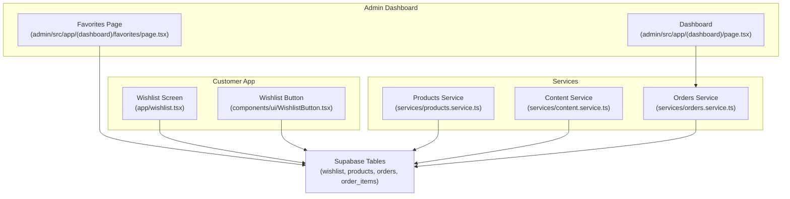
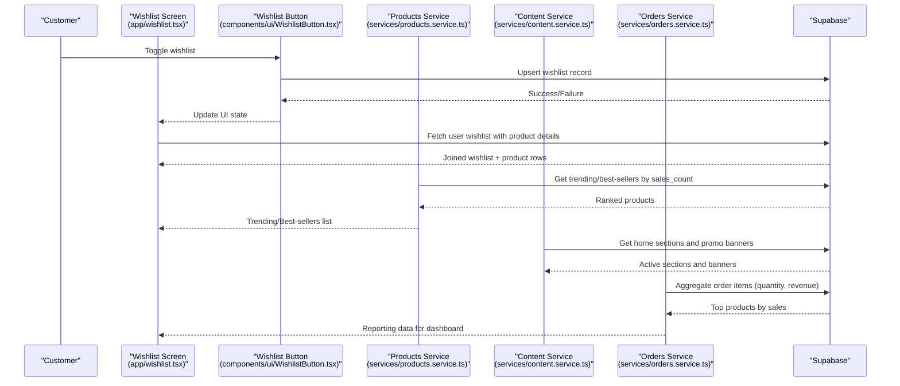
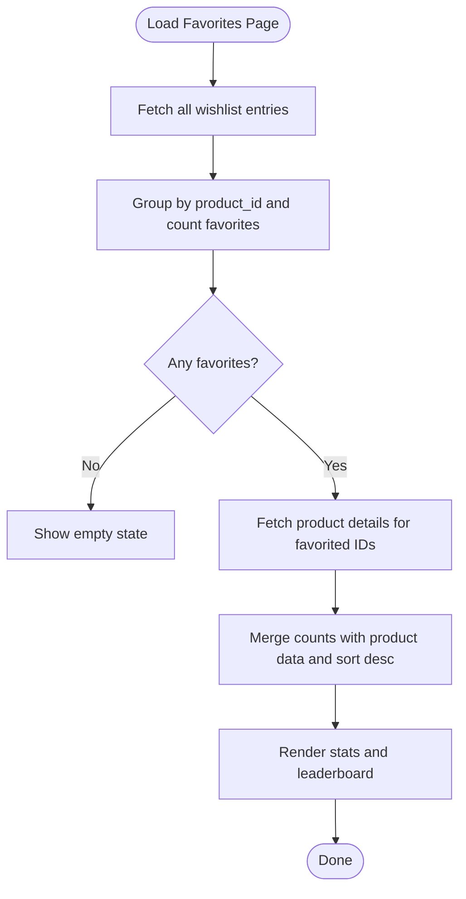
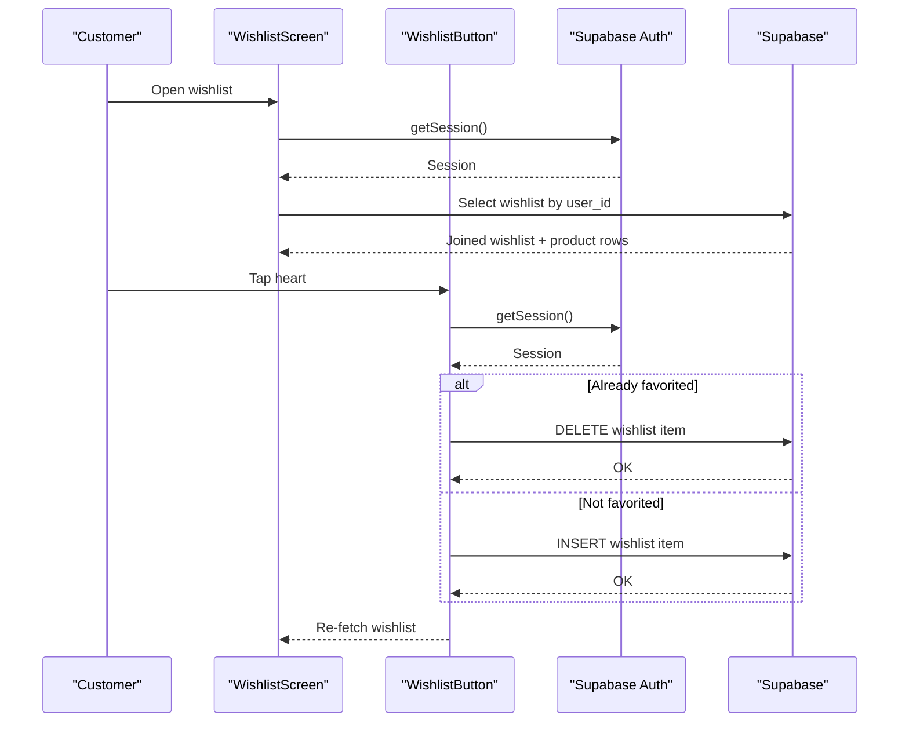
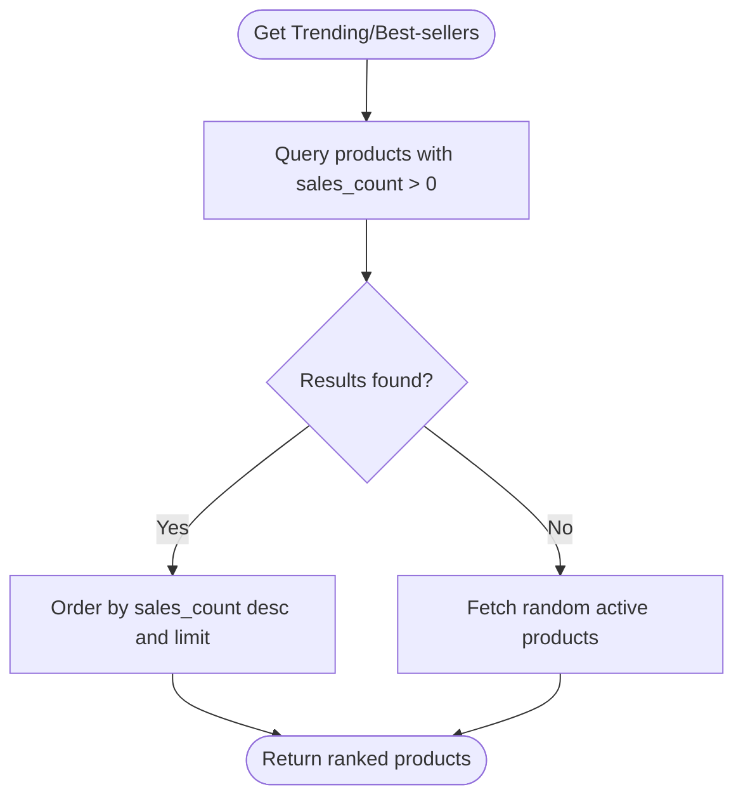
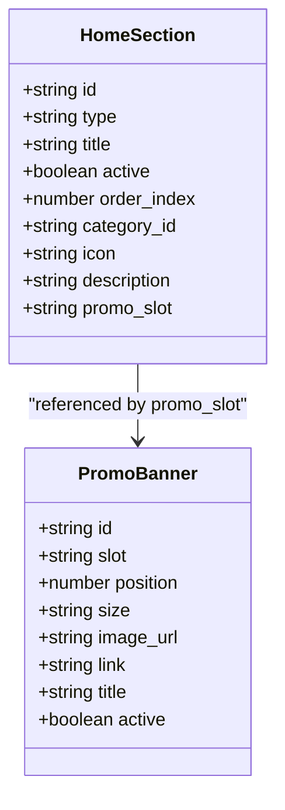
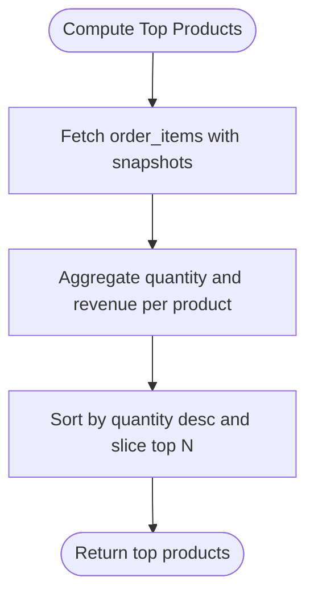
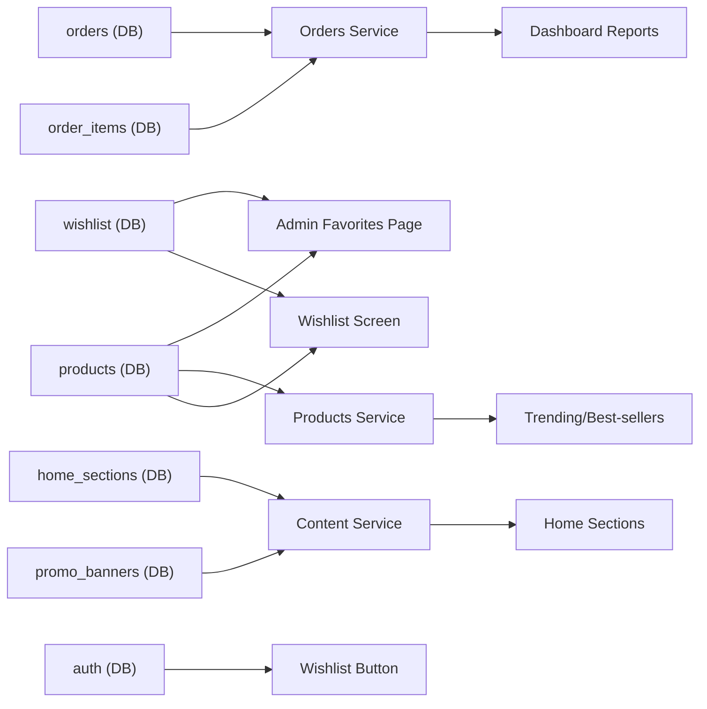

# Favorites and Trending Content

<cite>
**Referenced Files in This Document**
- [admin/src/app/(dashboard)/favorites/page.tsx](file://admin/src/app/(dashboard)/favorites/page.tsx)
- [app/wishlist.tsx](file://app/wishlist.tsx)
- [components/ui/WishlistButton.tsx](file://components/ui/WishlistButton.tsx)
- [services/products.service.ts](file://services/products.service.ts)
- [services/content.service.ts](file://services/content.service.ts)
- [services/orders.service.ts](file://services/orders.service.ts)
- [shared/types.ts](file://shared/types.ts)
- [admin/src/app/(dashboard)/page.tsx](file://admin/src/app/(dashboard)/page.tsx)
</cite>

## Table of Contents
1. [Introduction](#introduction)
2. [Project Structure](#project-structure)
3. [Core Components](#core-components)
4. [Architecture Overview](#architecture-overview)
5. [Detailed Component Analysis](#detailed-component-analysis)
6. [Dependency Analysis](#dependency-analysis)
7. [Performance Considerations](#performance-considerations)
8. [Troubleshooting Guide](#troubleshooting-guide)
9. [Conclusion](#conclusion)
10. [Appendices](#appendices)

## Introduction
This document explains the favorites and trending content management system, focusing on:
- Favorites management: user-driven preferences via a wishlist, popularity aggregation, and manual curation.
- Trending content: algorithmic discovery using product sales metrics with fallbacks.
- Analytics and reporting: dashboard insights derived from order data.
- Recommendations and personalization: integration points with product discovery services.
- Bulk operations and data migration: import/export pathways for favorites and related content.
- Balancing algorithmic signals and curated selections for optimal user experience.

## Project Structure
The system spans three primary areas:
- Admin dashboard: favorites analytics, manual curation, and reporting.
- Customer app: user wishlist management and product discovery.
- Services: product, content, and order APIs powering favorites and trending logic.

**Diagram sources**
- [admin/src/app/(dashboard)/favorites/page.tsx](file://admin/src/app/(dashboard)/favorites/page.tsx#L1-L302)
- [admin/src/app/(dashboard)/page.tsx](file://admin/src/app/(dashboard)/page.tsx#L284-L584)
- [app/wishlist.tsx:1-371](file://app/wishlist.tsx#L1-L371)
- [components/ui/WishlistButton.tsx:1-155](file://components/ui/WishlistButton.tsx#L1-L155)
- [services/products.service.ts:1-449](file://services/products.service.ts#L1-L449)
- [services/content.service.ts:1-147](file://services/content.service.ts#L1-L147)
- [services/orders.service.ts:1-115](file://services/orders.service.ts#L1-L115)

**Section sources**
- [admin/src/app/(dashboard)/favorites/page.tsx](file://admin/src/app/(dashboard)/favorites/page.tsx#L1-L302)
- [app/wishlist.tsx:1-371](file://app/wishlist.tsx#L1-L371)
- [components/ui/WishlistButton.tsx:1-155](file://components/ui/WishlistButton.tsx#L1-L155)
- [services/products.service.ts:1-449](file://services/products.service.ts#L1-L449)
- [services/content.service.ts:1-147](file://services/content.service.ts#L1-L147)
- [services/orders.service.ts:1-115](file://services/orders.service.ts#L1-L115)
- [shared/types.ts:155-167](file://shared/types.ts#L155-L167)

## Core Components
- Favorites aggregation and display (admin):
  - Aggregates wishlist entries, computes per-product favorite counts, and renders a sortable leaderboard with stats.
- User wishlist (customer app):
  - Allows logged-in users to add/remove items from their wishlist and purchase items directly from the list.
- Trending and best-seller discovery:
  - Uses product sales_count to rank trending and best-selling items, with fallback to random products when no sales data exists.
- Content sections and promotional slots:
  - Home sections configuration supports dynamic content blocks including trending, best sellers, and special offers.
- Orders analytics:
  - Computes top products by quantity and revenue for dashboard reporting.

**Section sources**
- [admin/src/app/(dashboard)/favorites/page.tsx](file://admin/src/app/(dashboard)/favorites/page.tsx#L35-L99)
- [app/wishlist.tsx:28-75](file://app/wishlist.tsx#L28-L75)
- [components/ui/WishlistButton.tsx:78-128](file://components/ui/WishlistButton.tsx#L78-L128)
- [services/products.service.ts:158-177](file://services/products.service.ts#L158-L177)
- [services/products.service.ts:220-238](file://services/products.service.ts#L220-L238)
- [services/content.service.ts:15-25](file://services/content.service.ts#L15-L25)
- [services/orders.service.ts:39-51](file://services/orders.service.ts#L39-L51)

## Architecture Overview
The favorites and trending pipeline integrates user actions, database queries, and service-layer logic to power both algorithmic and curated experiences.

**Diagram sources**
- [app/wishlist.tsx:28-75](file://app/wishlist.tsx#L28-L75)
- [components/ui/WishlistButton.tsx:78-128](file://components/ui/WishlistButton.tsx#L78-L128)
- [services/products.service.ts:158-177](file://services/products.service.ts#L158-L177)
- [services/products.service.ts:220-238](file://services/products.service.ts#L220-L238)
- [services/content.service.ts:64-82](file://services/content.service.ts#L64-L82)
- [services/orders.service.ts:39-51](file://services/orders.service.ts#L39-L51)

## Detailed Component Analysis

### Favorites Management (Admin)
- Data aggregation:
  - Queries wishlist entries and groups by product_id to compute favorite counts.
  - Merges product metadata and sorts by popularity.
- UI and UX:
  - Provides stats cards for total favorites, number of favorite products, and average favorites per product.
  - Supports search across product names and displays desktop/tablet and mobile card views.
- Manual curation:
  - The current favorites page aggregates popularity but does not expose explicit manual curation controls. Manual curation can be introduced via a dedicated curation module (see Recommendations).

**Diagram sources**
- [admin/src/app/(dashboard)/favorites/page.tsx](file://admin/src/app/(dashboard)/favorites/page.tsx#L35-L99)

**Section sources**
- [admin/src/app/(dashboard)/favorites/page.tsx](file://admin/src/app/(dashboard)/favorites/page.tsx#L25-L302)

### User Wishlist (Customer App)
- Authentication-aware:
  - Checks session to enable wishlist actions; prompts login when unauthenticated.
- CRUD operations:
  - Adds/removes wishlist items and reflects state immediately.
- Purchase integration:
  - Transforms product data and adds items to cart from the wishlist screen.

**Diagram sources**
- [app/wishlist.tsx:28-75](file://app/wishlist.tsx#L28-L75)
- [components/ui/WishlistButton.tsx:78-128](file://components/ui/WishlistButton.tsx#L78-L128)

**Section sources**
- [app/wishlist.tsx:1-371](file://app/wishlist.tsx#L1-L371)
- [components/ui/WishlistButton.tsx:1-155](file://components/ui/WishlistButton.tsx#L1-L155)

### Trending and Best-Seller Discovery
- Algorithmic ranking:
  - Trending and best-seller lists are computed using sales_count, descending order.
- Fallback behavior:
  - When no sales data exists, returns random products to maintain content freshness.
- Integration points:
  - Home sections can include trending and best-sellers blocks; special offers can be combined with trending content.

**Diagram sources**
- [services/products.service.ts:158-177](file://services/products.service.ts#L158-L177)
- [services/products.service.ts:220-238](file://services/products.service.ts#L220-L238)

**Section sources**
- [services/products.service.ts:158-177](file://services/products.service.ts#L158-L177)
- [services/products.service.ts:220-238](file://services/products.service.ts#L220-L238)

### Content Sections and Promotions
- Home sections:
  - Configurable blocks (categories, special offers, best sellers, trending, new arrivals, promo banners, custom) define the storefront layout.
- Promo banners:
  - Slots and positions support targeted promotions aligned with trending or curated content.

**Diagram sources**
- [services/content.service.ts:15-36](file://services/content.service.ts#L15-L36)

**Section sources**
- [services/content.service.ts:1-147](file://services/content.service.ts#L1-L147)

### Orders Analytics and Reporting
- Top products:
  - Aggregates order items by product to compute quantity and revenue, returning top N products for dashboard insights.
- Alerts and stats:
  - Low stock alerts and delayed orders are computed for operational visibility.

**Diagram sources**
- [admin/src/app/(dashboard)/page.tsx](file://admin/src/app/(dashboard)/page.tsx#L284-L298)

**Section sources**
- [admin/src/app/(dashboard)/page.tsx](file://admin/src/app/(dashboard)/page.tsx#L284-L584)
- [services/orders.service.ts:39-51](file://services/orders.service.ts#L39-L51)

## Dependency Analysis
- Data model:
  - Wishlist table stores user-product associations; product metadata and sales_count drive trending and best-seller logic.
- Service dependencies:
  - Products service depends on Supabase products table for rankings.
  - Content service depends on home_sections and promo_banners tables for layout and promotions.
  - Orders service depends on orders and order_items for analytics.
- UI dependencies:
  - Admin favorites page depends on Supabase wishlist and products tables.
  - Customer wishlist screen depends on Supabase auth and wishlist/product tables.

**Diagram sources**
- [shared/types.ts:155-167](file://shared/types.ts#L155-L167)
- [admin/src/app/(dashboard)/favorites/page.tsx](file://admin/src/app/(dashboard)/favorites/page.tsx#L35-L99)
- [app/wishlist.tsx:28-75](file://app/wishlist.tsx#L28-L75)
- [components/ui/WishlistButton.tsx:78-128](file://components/ui/WishlistButton.tsx#L78-L128)
- [services/products.service.ts:158-177](file://services/products.service.ts#L158-L177)
- [services/content.service.ts:64-82](file://services/content.service.ts#L64-L82)
- [services/orders.service.ts:39-51](file://services/orders.service.ts#L39-L51)

**Section sources**
- [shared/types.ts:155-167](file://shared/types.ts#L155-L167)
- [services/products.service.ts:1-449](file://services/products.service.ts#L1-L449)
- [services/content.service.ts:1-147](file://services/content.service.ts#L1-L147)
- [services/orders.service.ts:1-115](file://services/orders.service.ts#L1-L115)

## Performance Considerations
- Favoriting aggregation:
  - Grouping and sorting occur client-side after fetching wishlist rows; consider server-side aggregation for very large datasets.
- Wishlist joins:
  - The customer wishlist screen performs a join to fetch product details; ensure indexes on user_id and product_id for optimal performance.
- Trending and best-sellers:
  - Ranking by sales_count is efficient with proper indexing; fallback to random products avoids empty shelves but may increase variability.
- Dashboard analytics:
  - Aggregation over order_items benefits from indexed foreign keys and appropriate limits to avoid heavy scans.

[No sources needed since this section provides general guidance]

## Troubleshooting Guide
- Wishlist toggle errors:
  - Verify session availability and handle PGRST116 gracefully when no wishlist row exists.
- Empty favorites list:
  - Confirm that wishlist entries exist and that product IDs are valid.
- Missing product details:
  - Ensure product records exist and are active; check join conditions and field selection.
- Analytics gaps:
  - Confirm order items exist and snapshots include required fields; validate aggregation logic.

**Section sources**
- [components/ui/WishlistButton.tsx:55-68](file://components/ui/WishlistButton.tsx#L55-L68)
- [admin/src/app/(dashboard)/favorites/page.tsx](file://admin/src/app/(dashboard)/favorites/page.tsx#L47-L51)
- [app/wishlist.tsx:59-68](file://app/wishlist.tsx#L59-L68)
- [services/orders.service.ts:39-51](file://services/orders.service.ts#L39-L51)

## Conclusion
The system combines user-driven favorites with algorithmic trending to deliver relevant content. Admin dashboards surface actionable insights, while customer-facing components enable seamless wishlist management and discovery. Manual curation can complement algorithmic signals to enhance personalization and drive conversions.

[No sources needed since this section summarizes without analyzing specific files]

## Appendices

### Favorites Import/Export and Data Migration
- Import:
  - Bulk insert wishlist entries for initial curation or migration; ensure referential integrity against existing users and products.
- Export:
  - Export wishlist records for reporting and analytics; include user_id, product_id, and timestamps.
- Migration:
  - Align product IDs and user IDs with target environments; validate counts and re-index tables post-migration.

[No sources needed since this section provides general guidance]

### Recommendations for Manual Curation and Algorithmic Balance
- Curated collections:
  - Introduce curated “Popular Choice” or “Staff Picks” sections in home sections to highlight hand-selected items.
- Hybrid ranking:
  - Blend algorithmic scores (e.g., sales_count) with editorial weights to reduce cold-start effects and highlight quality.
- Seasonal and promotional alignment:
  - Feature trending items during promotional periods; rotate curated slots to reflect seasonal preferences.
- Personalization hooks:
  - Use user segments and past behavior to personalize both algorithmic and curated content.

[No sources needed since this section provides general guidance]