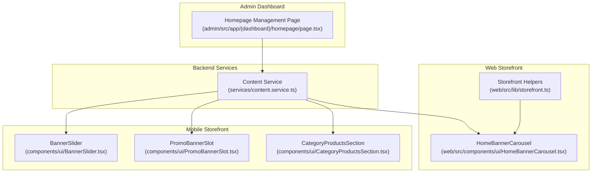
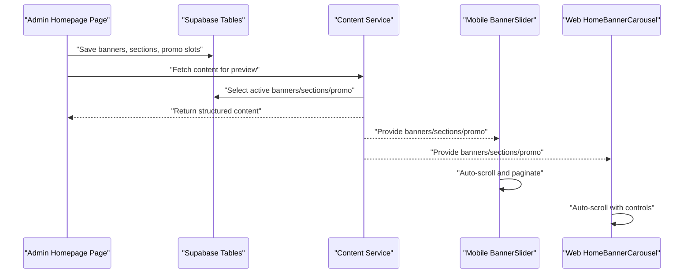
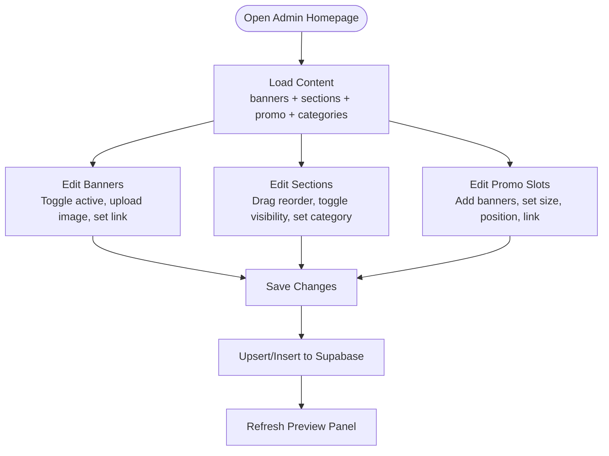
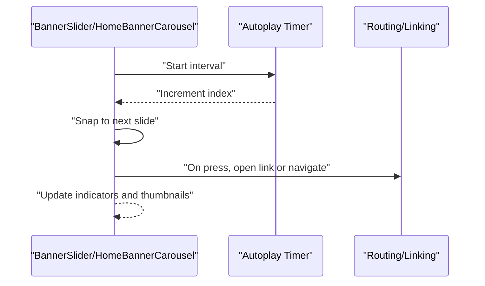
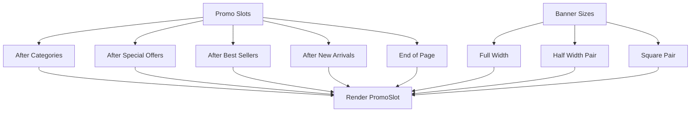
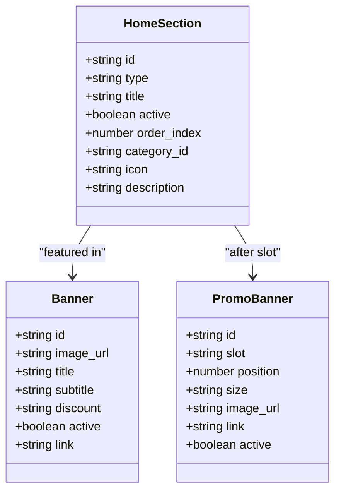
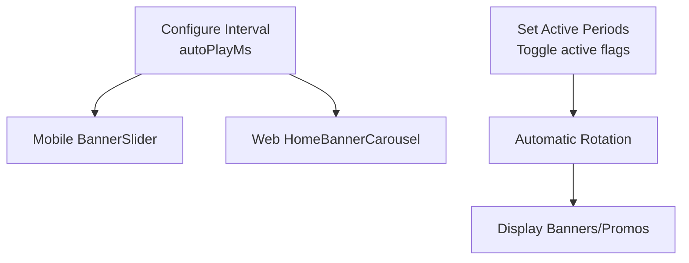
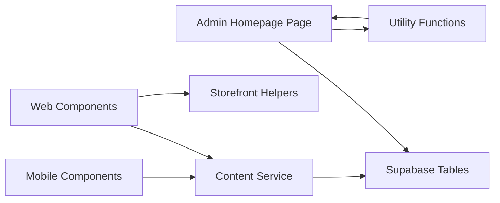

# Homepage Content Management

<cite>
**Referenced Files in This Document**
- [admin/src/app/(dashboard)/homepage/page.tsx](file://admin/src/app/(dashboard)/homepage/page.tsx)
- [components/ui/BannerSlider.tsx](file://components/ui/BannerSlider.tsx)
- [components/ui/PromoBannerSlot.tsx](file://components/ui/PromoBannerSlot.tsx)
- [components/ui/CategoryProductsSection.tsx](file://components/ui/CategoryProductsSection.tsx)
- [web/src/components/ui/HomeBannerCarousel.tsx](file://web/src/components/ui/HomeBannerCarousel.tsx)
- [web/src/lib/storefront.ts](file://web/src/lib/storefront.ts)
- [services/content.service.ts](file://services/content.service.ts)
- [admin/src/lib/utils.ts](file://admin/src/lib/utils.ts)
</cite>

## Table of Contents
1. [Introduction](#introduction)
2. [Project Structure](#project-structure)
3. [Core Components](#core-components)
4. [Architecture Overview](#architecture-overview)
5. [Detailed Component Analysis](#detailed-component-analysis)
6. [Dependency Analysis](#dependency-analysis)
7. [Performance Considerations](#performance-considerations)
8. [Troubleshooting Guide](#troubleshooting-guide)
9. [Conclusion](#conclusion)
10. [Appendices](#appendices)

## Introduction
This document explains the homepage content management system used across the admin dashboard and storefront applications. It covers:
- Banner carousel management (image uploads, slide configurations, autoplay)
- Featured categories and dynamic sections
- Promotional banners and slots
- Homepage layout customization (drag-and-drop, widget placement)
- Content scheduling and time-based promotion controls
- Analytics integration for visitor engagement and conversion tracking
- Preview and staging capabilities
- Step-by-step guides for building effective homepage layouts

## Project Structure
The homepage content management spans three primary areas:
- Admin dashboard for managing content and previewing changes
- Mobile storefront UI components rendering the homepage
- Web storefront carousel and routing helpers
- Backend service layer retrieving active content from Supabase

**Diagram sources**
- [admin/src/app/(dashboard)/homepage/page.tsx](file://admin/src/app/(dashboard)/homepage/page.tsx#L107-L1122)
- [components/ui/BannerSlider.tsx:23-153](file://components/ui/BannerSlider.tsx#L23-L153)
- [components/ui/PromoBannerSlot.tsx:18-201](file://components/ui/PromoBannerSlot.tsx#L18-L201)
- [components/ui/CategoryProductsSection.tsx:18-67](file://components/ui/CategoryProductsSection.tsx#L18-L67)
- [web/src/components/ui/HomeBannerCarousel.tsx:16-103](file://web/src/components/ui/HomeBannerCarousel.tsx#L16-L103)
- [web/src/lib/storefront.ts:26-34](file://web/src/lib/storefront.ts#L26-L34)
- [services/content.service.ts:41-147](file://services/content.service.ts#L41-L147)

**Section sources**
- [admin/src/app/(dashboard)/homepage/page.tsx](file://admin/src/app/(dashboard)/homepage/page.tsx#L107-L1122)
- [services/content.service.ts:41-147](file://services/content.service.ts#L41-L147)

## Core Components
- Admin homepage management page orchestrates:
  - Fetching and saving banners, sections, and promotional slots
  - Image upload to Supabase storage buckets
  - Real-time preview of the mobile homepage layout
- Mobile UI components render:
  - Auto-scrolling banner carousel with navigation
  - Promotional banners sized as full, half, or square
  - Category product sections with horizontal scrolling
- Web UI component renders:
  - Next.js client-side carousel with directional controls and autoplay
  - Banner link resolution and accessibility labels
- Content service provides typed queries for:
  - Active banners
  - Active homepage sections
  - Promotional banners grouped by slot

**Section sources**
- [admin/src/app/(dashboard)/homepage/page.tsx](file://admin/src/app/(dashboard)/homepage/page.tsx#L126-L218)
- [components/ui/BannerSlider.tsx:23-153](file://components/ui/BannerSlider.tsx#L23-L153)
- [components/ui/PromoBannerSlot.tsx:18-201](file://components/ui/PromoBannerSlot.tsx#L18-L201)
- [components/ui/CategoryProductsSection.tsx:18-67](file://components/ui/CategoryProductsSection.tsx#L18-L67)
- [web/src/components/ui/HomeBannerCarousel.tsx:16-103](file://web/src/components/ui/HomeBannerCarousel.tsx#L16-L103)
- [web/src/lib/storefront.ts:454-510](file://web/src/lib/storefront.ts#L454-L510)
- [services/content.service.ts:41-147](file://services/content.service.ts#L41-L147)

## Architecture Overview
The system follows a clear separation of concerns:
- Admin UI persists content to Supabase tables
- Storefront apps consume active content via service functions
- Mobile and web components render content consistently

**Diagram sources**
- [admin/src/app/(dashboard)/homepage/page.tsx](file://admin/src/app/(dashboard)/homepage/page.tsx#L157-L218)
- [services/content.service.ts:41-147](file://services/content.service.ts#L41-L147)
- [components/ui/BannerSlider.tsx:31-46](file://components/ui/BannerSlider.tsx#L31-L46)
- [web/src/components/ui/HomeBannerCarousel.tsx:23-35](file://web/src/components/ui/HomeBannerCarousel.tsx#L23-L35)

## Detailed Component Analysis

### Admin Homepage Management
- Data model types:
  - Banner: image_url, title, subtitle, discount, link, active
  - HomeSection: type, title, active, order_index, category_id, icon, description
  - PromoBanner: slot, position, size (full/half/square), image_url, link, title, active
- Features:
  - Fetch content concurrently from banners, home_sections, promo_banners, and categories
  - Upsert and insert operations per entity type
  - Image upload to dedicated buckets with cache control
  - Preview panel simulates a mobile screen with sliders and indicators
  - Accordion-style expansion for section-specific settings (e.g., category selection)
  - Slot-based promotional banner management with size and position controls

**Diagram sources**
- [admin/src/app/(dashboard)/homepage/page.tsx](file://admin/src/app/(dashboard)/homepage/page.tsx#L126-L218)
- [admin/src/app/(dashboard)/homepage/page.tsx](file://admin/src/app/(dashboard)/homepage/page.tsx#L317-L336)
- [admin/src/app/(dashboard)/homepage/page.tsx](file://admin/src/app/(dashboard)/homepage/page.tsx#L339-L400)

**Section sources**
- [admin/src/app/(dashboard)/homepage/page.tsx](file://admin/src/app/(dashboard)/homepage/page.tsx#L12-L62)
- [admin/src/app/(dashboard)/homepage/page.tsx](file://admin/src/app/(dashboard)/homepage/page.tsx#L126-L218)
- [admin/src/app/(dashboard)/homepage/page.tsx](file://admin/src/app/(dashboard)/homepage/page.tsx#L317-L336)
- [admin/src/app/(dashboard)/homepage/page.tsx](file://admin/src/app/(dashboard)/homepage/page.tsx#L339-L400)

### Banner Carousel System
- Mobile:
  - Auto-advance every fixed interval
  - Horizontal scroll with snapping and pagination
  - Dot indicators and optional thumbnails
  - Clickable banner with internal routing or external link handling
- Web:
  - Auto-advance controlled by prop (default interval)
  - Directional buttons with RTL-aware click handlers
  - Accessibility labels and eager/lazy loading strategy

**Diagram sources**
- [components/ui/BannerSlider.tsx:31-46](file://components/ui/BannerSlider.tsx#L31-L46)
- [components/ui/BannerSlider.tsx:98-151](file://components/ui/BannerSlider.tsx#L98-L151)
- [web/src/components/ui/HomeBannerCarousel.tsx:23-35](file://web/src/components/ui/HomeBannerCarousel.tsx#L23-L35)
- [web/src/components/ui/HomeBannerCarousel.tsx:65-99](file://web/src/components/ui/HomeBannerCarousel.tsx#L65-L99)
- [web/src/lib/storefront.ts:454-480](file://web/src/lib/storefront.ts#L454-L480)

**Section sources**
- [components/ui/BannerSlider.tsx:23-153](file://components/ui/BannerSlider.tsx#L23-L153)
- [web/src/components/ui/HomeBannerCarousel.tsx:16-103](file://web/src/components/ui/HomeBannerCarousel.tsx#L16-L103)
- [web/src/lib/storefront.ts:454-510](file://web/src/lib/storefront.ts#L454-L510)

### Promotional Sections Management
- Slot-based placement:
  - After categories, special offers, best sellers, new arrivals
  - End-of-page slot
- Banner sizing:
  - Full-width banner
  - Half-width pair (two side-by-side)
  - Square pair (two side-by-side)
- Responsive behavior:
  - RTL-aware layout adjustments
  - Touch-friendly press handlers for individual banners

**Diagram sources**
- [admin/src/app/(dashboard)/homepage/page.tsx](file://admin/src/app/(dashboard)/homepage/page.tsx#L93-L99)
- [components/ui/PromoBannerSlot.tsx:54-197](file://components/ui/PromoBannerSlot.tsx#L54-L197)

**Section sources**
- [admin/src/app/(dashboard)/homepage/page.tsx](file://admin/src/app/(dashboard)/homepage/page.tsx#L93-L99)
- [admin/src/app/(dashboard)/homepage/page.tsx](file://admin/src/app/(dashboard)/homepage/page.tsx#L287-L314)
- [components/ui/PromoBannerSlot.tsx:18-201](file://components/ui/PromoBannerSlot.tsx#L18-L201)

### Homepage Layout Customization
- Drag-and-drop ordering:
  - Reordering sections up/down toggles order_index during save
- Visibility controls:
  - Toggle active flag per section and banner
- Widget placement:
  - Category product sections require explicit category selection
  - Promotional banners placed per-slot with size selection
- Preview:
  - Live preview of mobile layout with sliders and indicators

**Diagram sources**
- [admin/src/app/(dashboard)/homepage/page.tsx](file://admin/src/app/(dashboard)/homepage/page.tsx#L24-L53)
- [admin/src/app/(dashboard)/homepage/page.tsx](file://admin/src/app/(dashboard)/homepage/page.tsx#L247-L285)

**Section sources**
- [admin/src/app/(dashboard)/homepage/page.tsx](file://admin/src/app/(dashboard)/homepage/page.tsx#L247-L285)
- [admin/src/app/(dashboard)/homepage/page.tsx](file://admin/src/app/(dashboard)/homepage/page.tsx#L779-L904)

### Content Scheduling and Time-Based Promotions
- Autoplay intervals:
  - Mobile carousel advances automatically at fixed intervals
  - Web carousel supports configurable autoPlayMs prop
- Time-based rotation:
  - Admin can set active periods by toggling active flags
  - Promotional slots can be scheduled by adjusting positions and sizes
- Link handling:
  - Internal routing for app/web routes
  - External URLs open in browser

**Diagram sources**
- [components/ui/BannerSlider.tsx:34-43](file://components/ui/BannerSlider.tsx#L34-L43)
- [web/src/components/ui/HomeBannerCarousel.tsx:18-35](file://web/src/components/ui/HomeBannerCarousel.tsx#L18-L35)
- [web/src/lib/storefront.ts:454-480](file://web/src/lib/storefront.ts#L454-L480)

**Section sources**
- [components/ui/BannerSlider.tsx:31-46](file://components/ui/BannerSlider.tsx#L31-L46)
- [web/src/components/ui/HomeBannerCarousel.tsx:18-35](file://web/src/components/ui/HomeBannerCarousel.tsx#L18-L35)
- [web/src/lib/storefront.ts:454-480](file://web/src/lib/storefront.ts#L454-L480)

### Homepage Analytics Integration
- Visitor engagement metrics:
  - Track banner clicks and navigation events
  - Measure time spent on homepage sections
- Conversion tracking:
  - Attribute conversions to specific promotional slots and banners
  - Monitor category product section performance
- Implementation guidance:
  - Integrate analytics SDKs in both mobile and web storefronts
  - Emit events on banner press and section view
  - Use slot identifiers and banner IDs for attribution

[No sources needed since this section provides general guidance]

### Content Preview and Staging
- Admin preview:
  - Mobile-like device frame with slider controls
  - Real-time updates when toggling active flags or editing content
- Staging environments:
  - Use separate Supabase projects for dev/stage/prod
  - Lock down admin access and promote changes via pull requests
  - Validate content in staging before publishing

**Section sources**
- [admin/src/app/(dashboard)/homepage/page.tsx](file://admin/src/app/(dashboard)/homepage/page.tsx#L484-L753)

## Dependency Analysis
- Admin depends on:
  - Supabase for persistence
  - Tailwind utility helpers for formatting
- Storefront components depend on:
  - Content service for active data
  - Routing libraries for navigation
  - Utility functions for formatting and localization

**Diagram sources**
- [admin/src/app/(dashboard)/homepage/page.tsx](file://admin/src/app/(dashboard)/homepage/page.tsx#L9-L10)
- [admin/src/lib/utils.ts:8-14](file://admin/src/lib/utils.ts#L8-L14)
- [services/content.service.ts:41-147](file://services/content.service.ts#L41-L147)
- [web/src/lib/storefront.ts:454-510](file://web/src/lib/storefront.ts#L454-L510)

**Section sources**
- [admin/src/lib/utils.ts:8-14](file://admin/src/lib/utils.ts#L8-L14)
- [services/content.service.ts:41-147](file://services/content.service.ts#L41-L147)
- [web/src/lib/storefront.ts:454-510](file://web/src/lib/storefront.ts#L454-L510)

## Performance Considerations
- Lazy loading:
  - Use lazy loading for banner images outside the initial viewport
- Autoplay throttling:
  - Reduce interval duration for devices with lower performance
- Image optimization:
  - Serve appropriately sized images from Supabase storage
- Minimize re-renders:
  - Memoize preview content and component props
- Network efficiency:
  - Batch fetches and upserts to reduce round trips

[No sources needed since this section provides general guidance]

## Troubleshooting Guide
- Images not appearing:
  - Verify Supabase storage bucket permissions and public URL generation
  - Confirm cache-control settings and CORS policies
- Autoplay not working:
  - Check autoplay interval configuration and device restrictions
  - Ensure touch gestures are not conflicting with autoplay
- Links not opening:
  - Validate banner link formats and routing helpers
  - Test both internal and external URLs
- Content not visible:
  - Confirm active flags are enabled
  - Verify order_index and slot placements

**Section sources**
- [admin/src/app/(dashboard)/homepage/page.tsx](file://admin/src/app/(dashboard)/homepage/page.tsx#L317-L336)
- [web/src/lib/storefront.ts:454-480](file://web/src/lib/storefront.ts#L454-L480)

## Conclusion
The homepage content management system provides a robust, admin-driven workflow for designing engaging storefront experiences across mobile and web platforms. With flexible layout controls, slot-based promotions, and consistent rendering components, teams can optimize user journeys and drive conversions effectively.

[No sources needed since this section summarizes without analyzing specific files]

## Appendices

### Step-by-Step Guides

- Creating a compelling homepage layout
  - Start with a hero banner carousel and enable autoplay
  - Add featured categories and promotional banners after key sections
  - Place end-of-page promotional banners for retention
  - Preview frequently and iterate based on engagement signals

- Optimizing user experience
  - Keep banner images high contrast and readable on small screens
  - Limit autoplay intervals to avoid overwhelming users
  - Ensure promotional banners link to relevant destinations
  - Test RTL layouts and adjust spacing for international audiences

[No sources needed since this section provides general guidance]