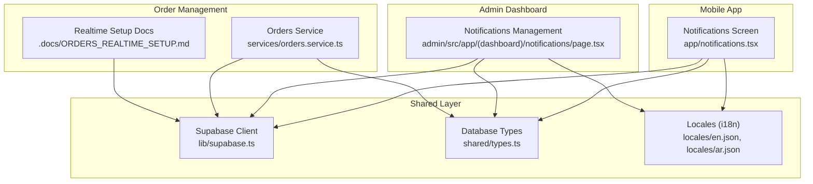
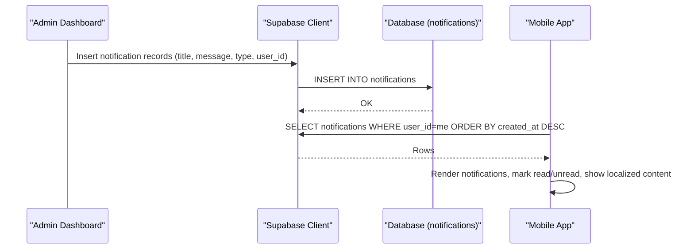
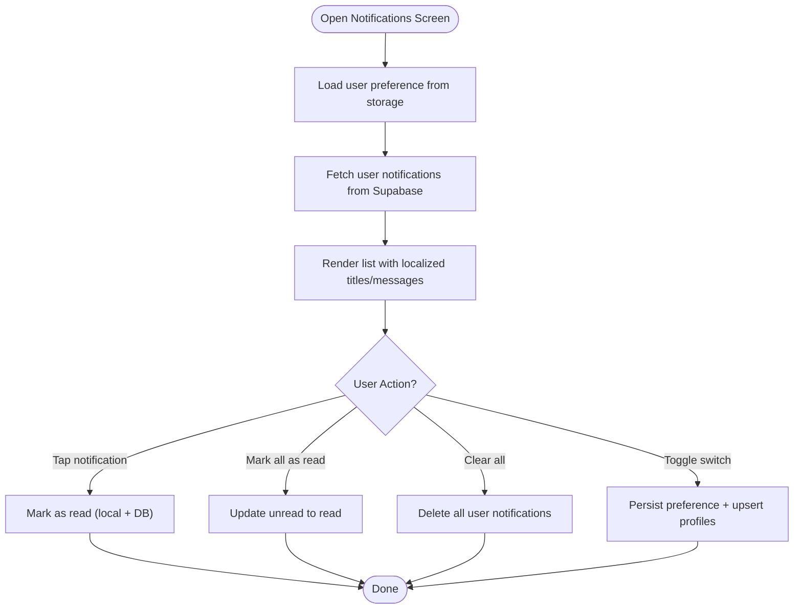
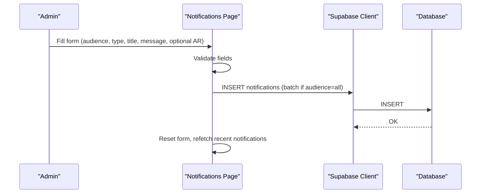
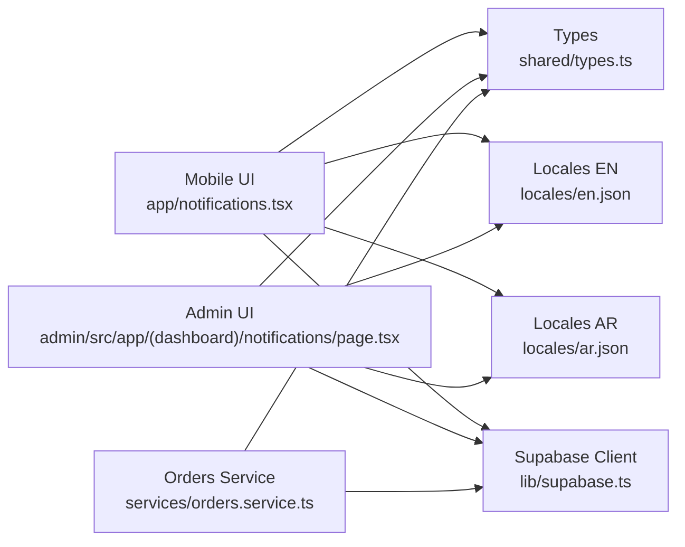
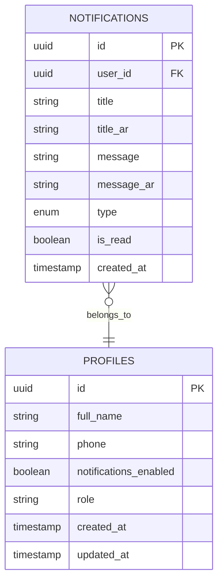

# Notification System

<cite>
**Referenced Files in This Document**
- [admin/src/app/(dashboard)/notifications/page.tsx](file://admin/src/app/(dashboard)/notifications/page.tsx)
- [app/notifications.tsx](file://app/notifications.tsx)
- [lib/supabase.ts](file://lib/supabase.ts)
- [shared/types.ts](file://shared/types.ts)
- [locales/en.json](file://locales/en.json)
- [locales/ar.json](file://locales/ar.json)
- [services/orders.service.ts](file://services/orders.service.ts)
- [.docs/ORDERS_REALTIME_SETUP.md](file://.docs/ORDERS_REALTIME_SETUP.md)
- [app.json](file://app.json)
- [eas.json](file://eas.json)
</cite>

## Table of Contents
1. [Introduction](#introduction)
2. [Project Structure](#project-structure)
3. [Core Components](#core-components)
4. [Architecture Overview](#architecture-overview)
5. [Detailed Component Analysis](#detailed-component-analysis)
6. [Dependency Analysis](#dependency-analysis)
7. [Performance Considerations](#performance-considerations)
8. [Troubleshooting Guide](#troubleshooting-guide)
9. [Conclusion](#conclusion)
10. [Appendices](#appendices)

## Introduction
This document describes the notification system across the mobile app, admin dashboard, and shared data model. It covers:
- Push notifications for mobile users
- In-app messaging via the Notifications screen
- Admin-driven broadcast notifications
- Multilingual support and user preferences
- Integration with order management for order status updates
- Compliance and opt-out mechanisms
- Recommendations for scheduling, targeting, analytics, and content optimization

## Project Structure
The notification system spans three primary areas:
- Mobile app: in-app notifications list and user preference toggle
- Admin dashboard: broadcast notifications to users
- Shared data model: database schema and TypeScript types for notifications and related entities

**Diagram sources**
- [app/notifications.tsx:1-403](file://app/notifications.tsx#L1-L403)
- [admin/src/app/(dashboard)/notifications/page.tsx](file://admin/src/app/(dashboard)/notifications/page.tsx#L1-L346)
- [lib/supabase.ts:1-30](file://lib/supabase.ts#L1-L30)
- [shared/types.ts:185-199](file://shared/types.ts#L185-L199)
- [locales/en.json:377-387](file://locales/en.json#L377-L387)
- [locales/ar.json:377-387](file://locales/ar.json#L377-L387)
- [services/orders.service.ts:1-55](file://services/orders.service.ts#L1-L55)
- [.docs/ORDERS_REALTIME_SETUP.md:1-37](file://.docs/ORDERS_REALTIME_SETUP.md#L1-L37)

**Section sources**
- [app/notifications.tsx:1-403](file://app/notifications.tsx#L1-L403)
- [admin/src/app/(dashboard)/notifications/page.tsx](file://admin/src/app/(dashboard)/notifications/page.tsx#L1-L346)
- [lib/supabase.ts:1-30](file://lib/supabase.ts#L1-L30)
- [shared/types.ts:185-199](file://shared/types.ts#L185-L199)
- [locales/en.json:377-387](file://locales/en.json#L377-L387)
- [locales/ar.json:377-387](file://locales/ar.json#L377-L387)
- [services/orders.service.ts:1-55](file://services/orders.service.ts#L1-L55)
- [.docs/ORDERS_REALTIME_SETUP.md:1-37](file://.docs/ORDERS_REALTIME_SETUP.md#L1-L37)

## Core Components
- In-app Notifications Screen (mobile): displays localized notifications, supports read/unread state, bulk actions, and user preference toggle for push notifications.
- Admin Notifications Management: allows administrators to compose and send notifications to all users or a single user, with multilingual title/message fields.
- Shared Types: defines the notifications table schema and related enums/status types used by both mobile and admin.
- Supabase Client: centralized client initialization with persistence for authentication and session handling.
- Internationalization: English and Arabic locale keys for notification-related UI strings.
- Order Integration: order service and realtime setup documentation for order lifecycle updates.

**Section sources**
- [app/notifications.tsx:34-151](file://app/notifications.tsx#L34-L151)
- [admin/src/app/(dashboard)/notifications/page.tsx](file://admin/src/app/(dashboard)/notifications/page.tsx#L33-L132)
- [shared/types.ts:185-199](file://shared/types.ts#L185-L199)
- [lib/supabase.ts:18-29](file://lib/supabase.ts#L18-L29)
- [locales/en.json:377-387](file://locales/en.json#L377-L387)
- [locales/ar.json:377-387](file://locales/ar.json#L377-L387)
- [services/orders.service.ts:1-55](file://services/orders.service.ts#L1-L55)
- [.docs/ORDERS_REALTIME_SETUP.md:1-37](file://.docs/ORDERS_REALTIME_SETUP.md#L1-L37)

## Architecture Overview
The notification architecture centers around a shared database-backed model with two primary user touchpoints:
- Mobile app reads/writes notifications and user preferences via Supabase
- Admin dashboard writes notifications to the same table for immediate in-app visibility

**Diagram sources**
- [admin/src/app/(dashboard)/notifications/page.tsx](file://admin/src/app/(dashboard)/notifications/page.tsx#L78-L132)
- [app/notifications.tsx:129-151](file://app/notifications.tsx#L129-L151)
- [shared/types.ts:185-199](file://shared/types.ts#L185-L199)
- [lib/supabase.ts:18-29](file://lib/supabase.ts#L18-L29)

## Detailed Component Analysis

### In-App Notifications Screen (Mobile)
Responsibilities:
- Fetch and display notifications for the signed-in user
- Localized rendering (English/Arabic) with relative timestamps
- Mark individual notifications as read
- Bulk mark all as read
- Clear all notifications
- Toggle user-level push notification preference (persists locally and in profiles)
- Provide empty-state messaging and RTL-aware UI

Key behaviors:
- Loads user preference from local storage and upserts to profiles
- Uses Supabase auth session to scope queries
- Supports multilingual content via locale keys

**Diagram sources**
- [app/notifications.tsx:44-151](file://app/notifications.tsx#L44-L151)
- [app/notifications.tsx:58-83](file://app/notifications.tsx#L58-L83)
- [app/notifications.tsx:85-111](file://app/notifications.tsx#L85-L111)
- [app/notifications.tsx:113-127](file://app/notifications.tsx#L113-L127)

**Section sources**
- [app/notifications.tsx:34-151](file://app/notifications.tsx#L34-L151)
- [app/notifications.tsx:153-398](file://app/notifications.tsx#L153-L398)
- [locales/en.json:377-387](file://locales/en.json#L377-L387)
- [locales/ar.json:377-387](file://locales/ar.json#L377-L387)

### Admin Notifications Management
Responsibilities:
- Compose and send notifications to all users or a selected user
- Multilingual fields for title and message
- Notification type selection (general, promo, order, system)
- Recent notifications log with read/unread indicators

Key behaviors:
- Validates presence of at least English title/message
- Builds batch insert payload for targeted users
- Displays recent notifications with user mapping

**Diagram sources**
- [admin/src/app/(dashboard)/notifications/page.tsx](file://admin/src/app/(dashboard)/notifications/page.tsx#L33-L132)
- [admin/src/app/(dashboard)/notifications/page.tsx](file://admin/src/app/(dashboard)/notifications/page.tsx#L78-L132)

**Section sources**
- [admin/src/app/(dashboard)/notifications/page.tsx](file://admin/src/app/(dashboard)/notifications/page.tsx#L33-L132)
- [admin/src/app/(dashboard)/notifications/page.tsx](file://admin/src/app/(dashboard)/notifications/page.tsx#L134-L146)

### Notification Template System and Multilingual Support
- Template fields: title, title_ar, message, message_ar
- Notification types: general, promo, order, system
- Localization: English and Arabic locale keys for UI and content
- Rendering: mobile chooses AR content if available, otherwise falls back to English

Recommendations:
- Use placeholders in messages for dynamic variables (e.g., order ID, estimated delivery time)
- Maintain separate AR/EN content pairs for accurate localization
- Keep type-specific styling consistent across clients

**Section sources**
- [shared/types.ts:185-199](file://shared/types.ts#L185-L199)
- [admin/src/app/(dashboard)/notifications/page.tsx](file://admin/src/app/(dashboard)/notifications/page.tsx#L38-L46)
- [app/notifications.tsx:25-32](file://app/notifications.tsx#L25-L32)
- [locales/en.json:377-387](file://locales/en.json#L377-L387)
- [locales/ar.json:377-387](file://locales/ar.json#L377-L387)

### Delivery Channels
- Mobile push notifications: supported via Expo Notifications and app configuration
- In-app messaging: notifications stored in the database and rendered in the mobile app
- Email campaigns: not implemented in the current codebase

Evidence:
- Expo Notifications plugin present in node_modules
- app.json includes enableNotifications flag
- eas.json configures Android build type

**Section sources**
- [app.json:59-68](file://app.json#L59-L68)
- [eas.json:24-29](file://eas.json#L24-L29)

### Targeting System
- User segmentation: audience selection (all users vs single user)
- Behavioral triggers: not implemented in the current codebase
- Geographic targeting: not implemented in the current codebase

Operational targeting:
- Admin selects audience and optionally a specific user
- Mobile filters notifications by user_id

**Section sources**
- [admin/src/app/(dashboard)/notifications/page.tsx](file://admin/src/app/(dashboard)/notifications/page.tsx#L39-L46)
- [admin/src/app/(dashboard)/notifications/page.tsx](file://admin/src/app/(dashboard)/notifications/page.tsx#L92-L94)
- [app/notifications.tsx:137-141](file://app/notifications.tsx#L137-L141)

### Scheduling and Recurring Notifications
- Batch sending: implemented via batch insert in admin
- Time-based delivery: not implemented in the current codebase
- Recurring notifications: not implemented in the current codebase

Recommendations:
- Use a job scheduler (e.g., cron or worker) to enqueue future notifications
- Add scheduled_at and repeat_interval fields to the notifications table
- Enforce rate limits and opt-out filtering

**Section sources**
- [admin/src/app/(dashboard)/notifications/page.tsx](file://admin/src/app/(dashboard)/notifications/page.tsx#L101-L109)

### Analytics
- Open rates: not implemented in the current codebase
- Click-through rates: not implemented in the current codebase
- Conversion tracking: not implemented in the current codebase

Recommendations:
- Add notification_opened and notification_clicked events
- Track deep links and UTM-like metadata in notification payloads
- Expose analytics dashboards in admin

**Section sources**
- [shared/types.ts:185-199](file://shared/types.ts#L185-L199)

### Preferences Management
- User preference: notifications_enabled persisted in profiles and local storage
- UI toggle: on/off switch with localized labels
- Persistence: AsyncStorage + Supabase upsert

**Section sources**
- [shared/types.ts:132-154](file://shared/types.ts#L132-L154)
- [app/notifications.tsx:49-83](file://app/notifications.tsx#L49-L83)

### Integration with Order Management
- Order status updates: orders service and realtime setup documentation
- Notification triggers: not implemented in the current codebase

Recommendations:
- On order status change, insert a notification record with type order
- Use order snapshots to populate dynamic content
- Ensure realtime subscriptions are enabled for orders

**Section sources**
- [services/orders.service.ts:1-55](file://services/orders.service.ts#L1-L55)
- [.docs/ORDERS_REALTIME_SETUP.md:1-37](file://.docs/ORDERS_REALTIME_SETUP.md#L1-L37)

### Compliance and Opt-Out Mechanisms
- Opt-out: users can disable notifications via the in-app toggle
- Privacy policy: mentions notifications can be disabled
- Data retention: deletion of notifications during account deletion

**Section sources**
- [app/notifications.tsx:58-83](file://app/notifications.tsx#L58-L83)
- [locales/en.json:100-113](file://locales/en.json#L100-L113)
- [locales/ar.json:100-113](file://locales/ar.json#L100-L113)

## Dependency Analysis

**Diagram sources**
- [app/notifications.tsx:1-8](file://app/notifications.tsx#L1-L8)
- [admin/src/app/(dashboard)/notifications/page.tsx](file://admin/src/app/(dashboard)/notifications/page.tsx#L1-L6)
- [shared/types.ts:185-199](file://shared/types.ts#L185-L199)
- [locales/en.json:377-387](file://locales/en.json#L377-L387)
- [locales/ar.json:377-387](file://locales/ar.json#L377-L387)
- [lib/supabase.ts:1-30](file://lib/supabase.ts#L1-L30)
- [services/orders.service.ts:1-7](file://services/orders.service.ts#L1-L7)

**Section sources**
- [app/notifications.tsx:1-8](file://app/notifications.tsx#L1-L8)
- [admin/src/app/(dashboard)/notifications/page.tsx](file://admin/src/app/(dashboard)/notifications/page.tsx#L1-L6)
- [shared/types.ts:185-199](file://shared/types.ts#L185-L199)
- [lib/supabase.ts:1-30](file://lib/supabase.ts#L1-L30)
- [services/orders.service.ts:1-7](file://services/orders.service.ts#L1-L7)

## Performance Considerations
- Minimize payload size: avoid large attachments; use short, scannable messages
- Batch inserts: use admin batch insert for mass notifications
- Pagination: fetch latest notifications with limits to reduce load
- Debounce user actions: avoid rapid toggles of notification preferences
- Network resilience: handle errors gracefully and retry on transient failures

## Troubleshooting Guide
Common issues and resolutions:
- Notifications not appearing in the mobile app
  - Verify user is logged in and notifications are scoped by user_id
  - Confirm Supabase connection and network availability
- Admin sends notification but users do not see it
  - Ensure audience selection is correct and target user exists
  - Check recent notifications log for insertion errors
- Preference toggle does not persist
  - Confirm AsyncStorage write succeeds and profiles upsert completes
  - Verify session exists before upsert

**Section sources**
- [app/notifications.tsx:129-151](file://app/notifications.tsx#L129-L151)
- [admin/src/app/(dashboard)/notifications/page.tsx](file://admin/src/app/(dashboard)/notifications/page.tsx#L78-L132)
- [app/notifications.tsx:58-83](file://app/notifications.tsx#L58-L83)

## Conclusion
The notification system currently provides:
- A robust in-app notifications experience with multilingual support and user preferences
- An admin interface for broadcasting notifications to all or specific users
- A shared data model enabling consistent behavior across platforms

Future enhancements should focus on:
- Implementing push notifications for mobile
- Adding scheduling, analytics, and behavioral targeting
- Integrating order lifecycle updates with notifications
- Strengthening compliance and opt-out mechanisms

## Appendices

### Notification Data Model

**Diagram sources**
- [shared/types.ts:185-199](file://shared/types.ts#L185-L199)
- [shared/types.ts:132-154](file://shared/types.ts#L132-L154)

### Recommended Implementation Paths
- Push notifications: integrate Expo Notifications and configure platform-specific settings
- Scheduling: add scheduled_at and repeat_interval fields; implement a background job
- Analytics: introduce event tables for opens/clicks; expose admin dashboards
- Targeting: add segments and filters; implement behavioral triggers
- Compliance: enforce opt-out; provide granular preference controls