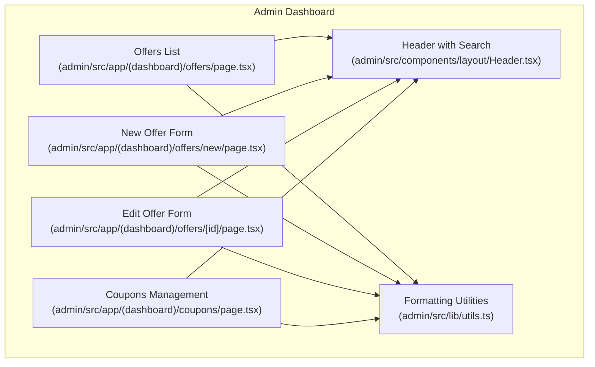
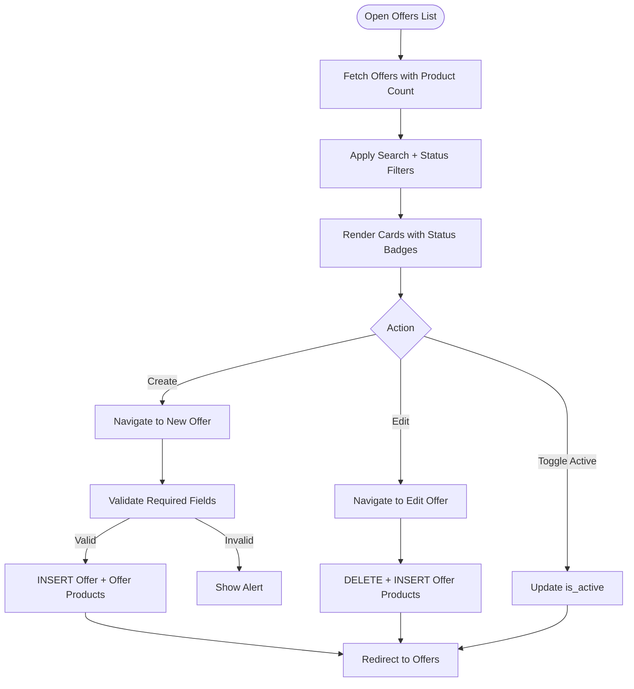
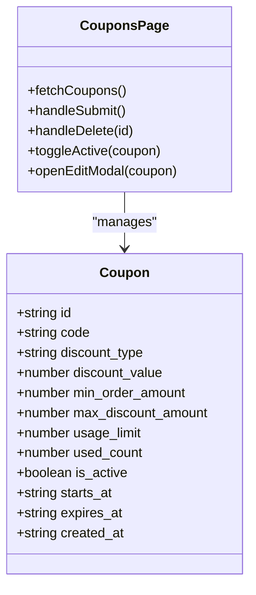
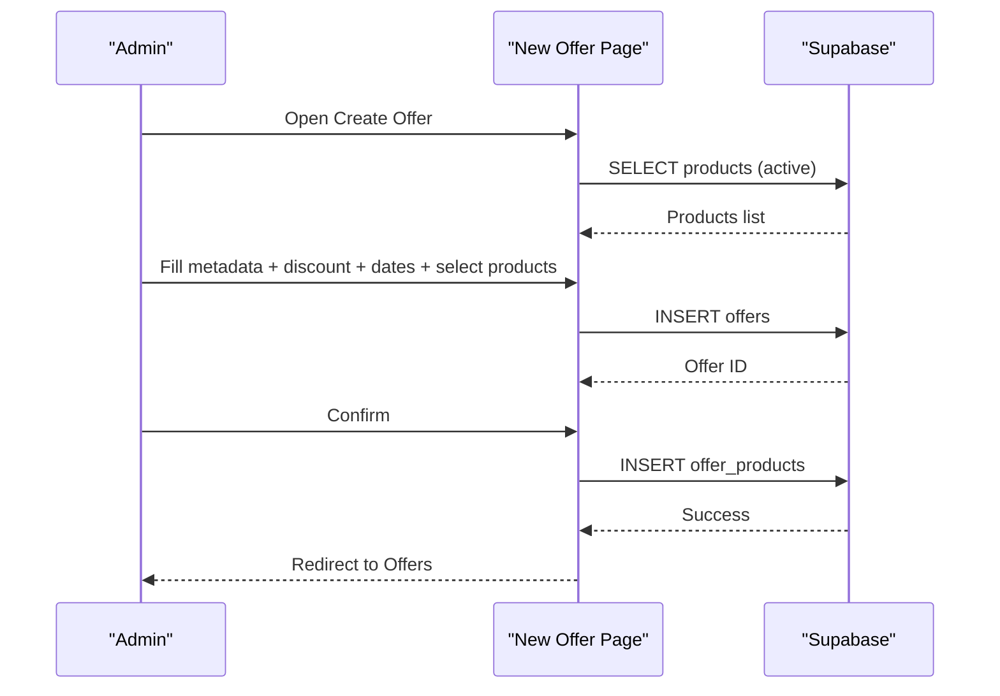
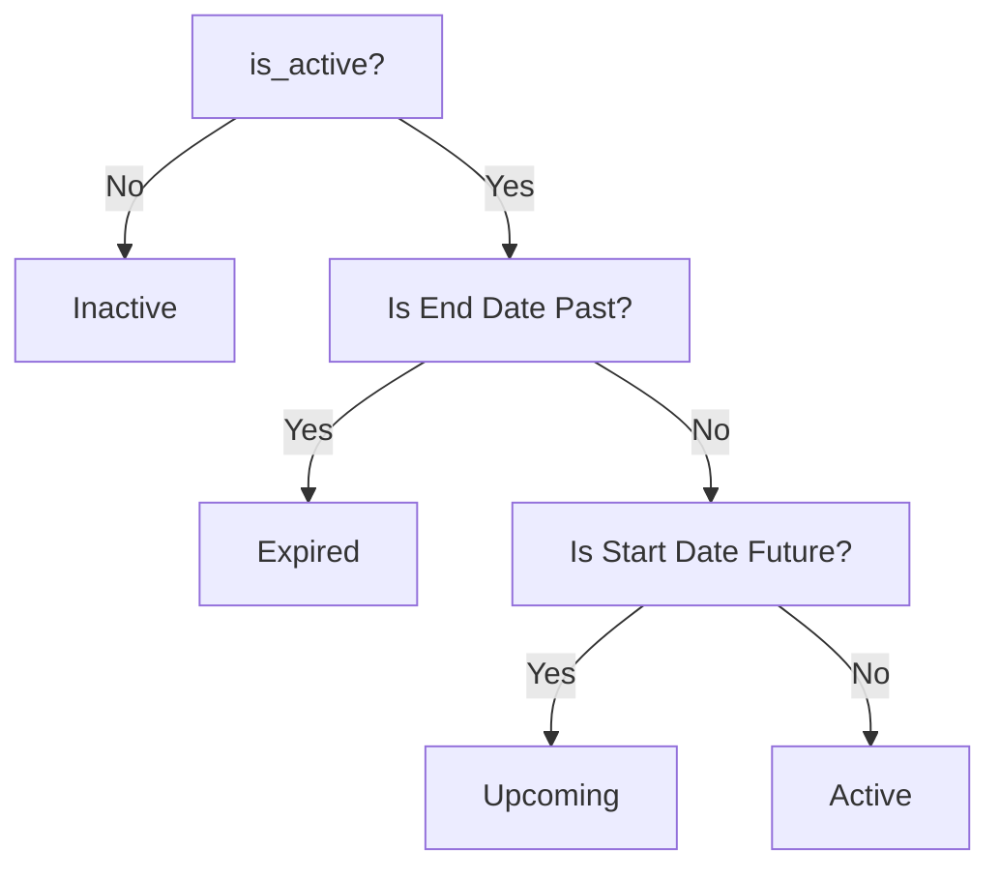
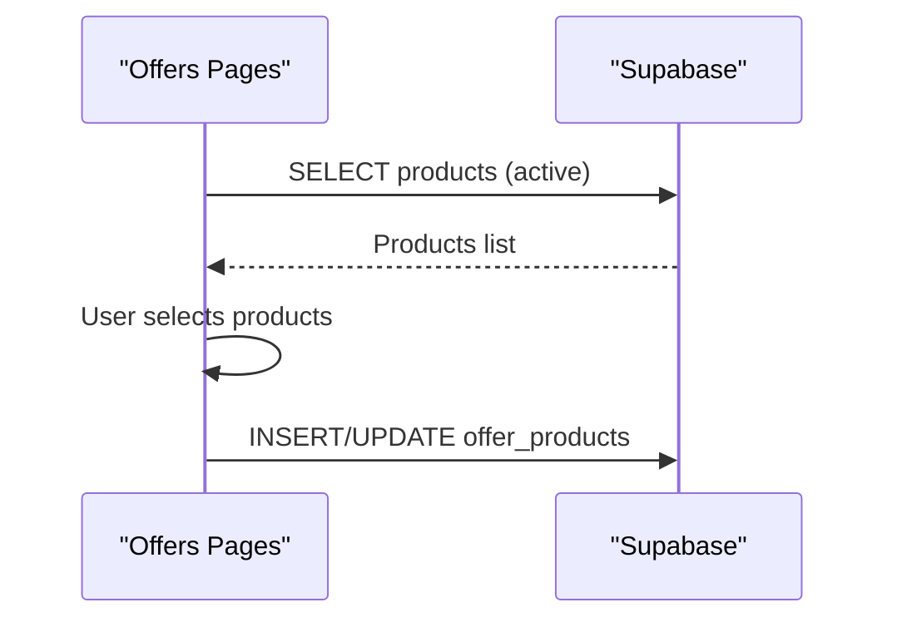
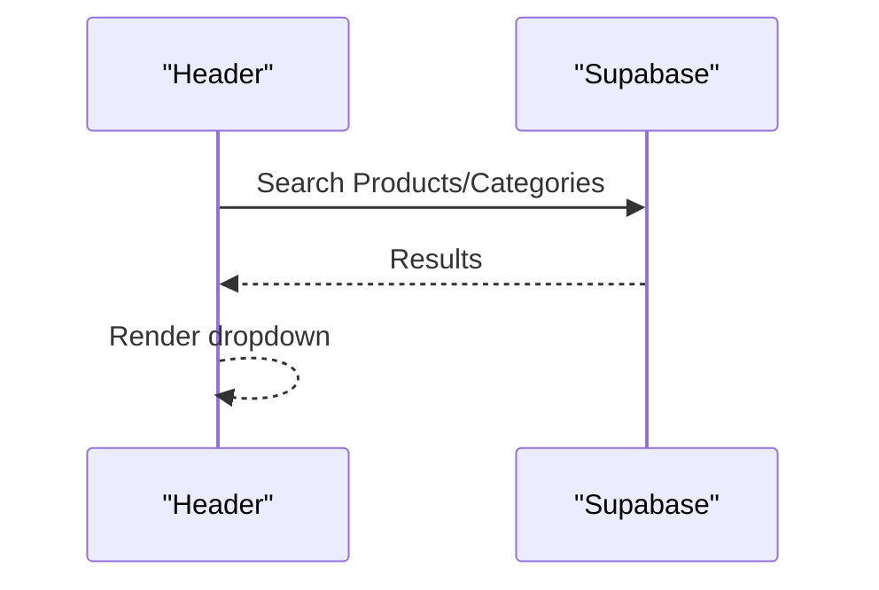
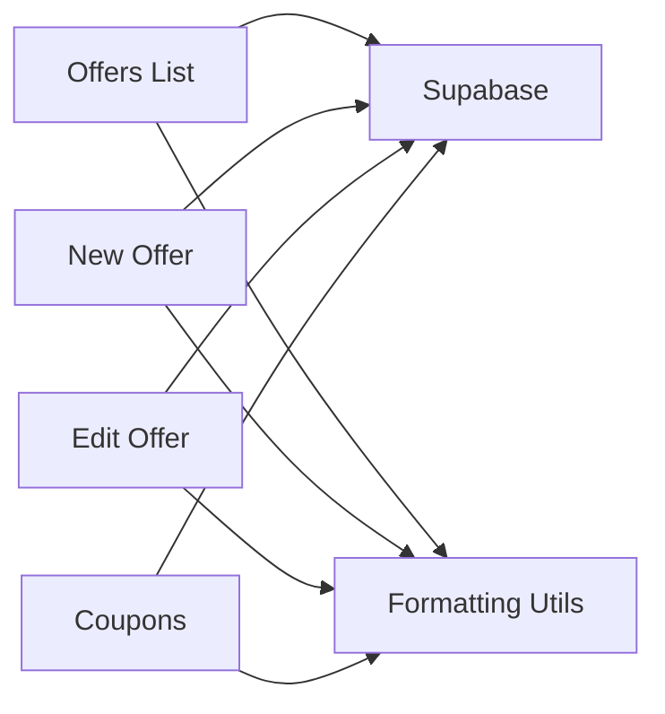

# Promotions and Offers

<cite>
**Referenced Files in This Document**
- [admin/src/app/(dashboard)/offers/page.tsx](file://admin/src/app/(dashboard)/offers/page.tsx)
- [admin/src/app/(dashboard)/offers/new/page.tsx](file://admin/src/app/(dashboard)/offers/new/page.tsx)
- [admin/src/app/(dashboard)/offers/[id]/page.tsx](file://admin/src/app/(dashboard)/offers/[id]/page.tsx)
- [admin/src/app/(dashboard)/coupons/page.tsx](file://admin/src/app/(dashboard)/coupons/page.tsx)
- [admin/src/components/layout/Header.tsx](file://admin/src/components/layout/Header.tsx)
- [admin/src/lib/utils.ts](file://admin/src/lib/utils.ts)
</cite>

## Table of Contents
1. [Introduction](#introduction)
2. [Project Structure](#project-structure)
3. [Core Components](#core-components)
4. [Architecture Overview](#architecture-overview)
5. [Detailed Component Analysis](#detailed-component-analysis)
6. [Dependency Analysis](#dependency-analysis)
7. [Performance Considerations](#performance-considerations)
8. [Troubleshooting Guide](#troubleshooting-guide)
9. [Conclusion](#conclusion)
10. [Appendices](#appendices)

## Introduction
This document explains the promotions and offers management system implemented in the admin dashboard. It covers offer creation and lifecycle, coupon management, scheduling, integration with product catalogs, and administrative UX. It also outlines best practices for content optimization and compliance considerations.

## Project Structure
The promotions and offers features are implemented in the admin Next.js application under the dashboard routes:
- Offers management: listing, creation, editing, filtering, and status toggling
- Coupons management: listing, creation, editing, activation toggle, and deletion
- Shared UI and utilities: header with search, and formatting helpers

**Diagram sources**
- [admin/src/app/(dashboard)/offers/page.tsx](file://admin/src/app/(dashboard)/offers/page.tsx#L1-L380)
- [admin/src/app/(dashboard)/offers/new/page.tsx](file://admin/src/app/(dashboard)/offers/new/page.tsx#L1-L465)
- [admin/src/app/(dashboard)/offers/[id]/page.tsx](file://admin/src/app/(dashboard)/offers/[id]/page.tsx#L1-L545)
- [admin/src/app/(dashboard)/coupons/page.tsx](file://admin/src/app/(dashboard)/coupons/page.tsx#L1-L465)
- [admin/src/components/layout/Header.tsx:1-329](file://admin/src/components/layout/Header.tsx#L1-L329)
- [admin/src/lib/utils.ts:1-15](file://admin/src/lib/utils.ts#L1-L15)

**Section sources**
- [admin/src/app/(dashboard)/offers/page.tsx](file://admin/src/app/(dashboard)/offers/page.tsx#L1-L380)
- [admin/src/app/(dashboard)/offers/new/page.tsx](file://admin/src/app/(dashboard)/offers/new/page.tsx#L1-L465)
- [admin/src/app/(dashboard)/offers/[id]/page.tsx](file://admin/src/app/(dashboard)/offers/[id]/page.tsx#L1-L545)
- [admin/src/app/(dashboard)/coupons/page.tsx](file://admin/src/app/(dashboard)/coupons/page.tsx#L1-L465)
- [admin/src/components/layout/Header.tsx:1-329](file://admin/src/components/layout/Header.tsx#L1-L329)
- [admin/src/lib/utils.ts:1-15](file://admin/src/lib/utils.ts#L1-L15)

## Core Components
- Offers listing and filtering: displays offers with status badges, counts, and actions; supports search and status filters
- Offer creation form: collects multilingual metadata, discount settings, validity period, product selection, and activation flag
- Offer editing form: mirrors creation with preloaded data and product reassignment
- Coupons management: CRUD operations for coupons with discount type, value, min order, caps, usage limits, expiry, and activation
- Shared utilities: IQD formatting and localized date formatting helpers

Key capabilities:
- Offer discount calculation: percentage or fixed amount applied to selected products
- Offer scheduling: start/end datetime controls with live status indicators
- Product eligibility: selection via search and inclusion in offer_products relation
- Coupon features: percentage or fixed discount, optional max cap, optional usage limit, optional expiry date, activation toggle

**Section sources**
- [admin/src/app/(dashboard)/offers/page.tsx](file://admin/src/app/(dashboard)/offers/page.tsx#L11-L150)
- [admin/src/app/(dashboard)/offers/new/page.tsx](file://admin/src/app/(dashboard)/offers/new/page.tsx#L27-L146)
- [admin/src/app/(dashboard)/offers/[id]/page.tsx](file://admin/src/app/(dashboard)/offers/[id]/page.tsx#L31-L216)
- [admin/src/app/(dashboard)/coupons/page.tsx](file://admin/src/app/(dashboard)/coupons/page.tsx#L10-L145)

## Architecture Overview
The admin dashboard integrates with a backend via Supabase to manage offers and coupons. The UI components orchestrate data fetching, form submission, and state updates.

```mermaid
sequenceDiagram
participant Admin as "Admin UI"
participant OffersList as "Offers List Page"
participant OffersNew as "New Offer Page"
participant OffersEdit as "Edit Offer Page"
participant Coupons as "Coupons Page"
participant Supabase as "Supabase"
Admin->>OffersList : Navigate to Offers
OffersList->>Supabase : SELECT offers + offer_products.count
Supabase-->>OffersList : Offers data
OffersList-->>Admin : Render list with status and actions
Admin->>OffersNew : Navigate to Create Offer
OffersNew->>Supabase : SELECT products (active)
Supabase-->>OffersNew : Products list
Admin->>OffersNew : Submit form (metadata, discount, dates, products)
OffersNew->>Supabase : INSERT offer + offer_products
Supabase-->>OffersNew : Success
OffersNew-->>Admin : Redirect to Offers
Admin->>OffersEdit : Navigate to Edit Offer
OffersEdit->>Supabase : SELECT offer + offer_products + products
Supabase-->>OffersEdit : Offer + products
Admin->>OffersEdit : Submit updates
OffersEdit->>Supabase : UPDATE offer + DELETE+INSERT offer_products
Supabase-->>OffersEdit : Success
OffersEdit-->>Admin : Redirect to Offers
Admin->>Coupons : Navigate to Coupons
Coupons->>Supabase : SELECT coupons
Supabase-->>Coupons : Coupons data
Admin->>Coupons : Create/Edit/Delete/Activate
Coupons->>Supabase : Mutations (INSERT/UPDATE/DELETE)
Supabase-->>Coupons : Success
```

**Diagram sources**
- [admin/src/app/(dashboard)/offers/page.tsx](file://admin/src/app/(dashboard)/offers/page.tsx#L37-L104)
- [admin/src/app/(dashboard)/offers/new/page.tsx](file://admin/src/app/(dashboard)/offers/new/page.tsx#L44-L111)
- [admin/src/app/(dashboard)/offers/[id]/page.tsx](file://admin/src/app/(dashboard)/offers/[id]/page.tsx#L49-L181)
- [admin/src/app/(dashboard)/coupons/page.tsx](file://admin/src/app/(dashboard)/coupons/page.tsx#L41-L115)

## Detailed Component Analysis

### Offers Management
- Listing and filtering: fetches offers with product counts, applies search and status filters, computes status badges and remaining time
- Creation workflow: validates required fields, ensures at least one product, persists offer and product relations
- Editing workflow: loads offer and current products, replaces product relations on save
- Discount calculation: computes discounted price for selected products during preview and selection
- Scheduling: start/end datetime controls; status computed from current time and schedule

**Diagram sources**
- [admin/src/app/(dashboard)/offers/page.tsx](file://admin/src/app/(dashboard)/offers/page.tsx#L37-L142)
- [admin/src/app/(dashboard)/offers/new/page.tsx](file://admin/src/app/(dashboard)/offers/new/page.tsx#L56-L111)
- [admin/src/app/(dashboard)/offers/[id]/page.tsx](file://admin/src/app/(dashboard)/offers/[id]/page.tsx#L120-L181)

**Section sources**
- [admin/src/app/(dashboard)/offers/page.tsx](file://admin/src/app/(dashboard)/offers/page.tsx#L11-L150)
- [admin/src/app/(dashboard)/offers/new/page.tsx](file://admin/src/app/(dashboard)/offers/new/page.tsx#L27-L146)
- [admin/src/app/(dashboard)/offers/[id]/page.tsx](file://admin/src/app/(dashboard)/offers/[id]/page.tsx#L31-L216)

### Coupons Management
- Coupon entity fields: code, discount type (percentage/fixed), discount value, min order amount, optional max discount, optional usage limit, activation flag, optional expiry date
- UI supports creation/editing with validation, activation toggle, and deletion
- Formatting utilities used for currency display

**Diagram sources**
- [admin/src/app/(dashboard)/coupons/page.tsx](file://admin/src/app/(dashboard)/coupons/page.tsx#L10-L145)

**Section sources**
- [admin/src/app/(dashboard)/coupons/page.tsx](file://admin/src/app/(dashboard)/coupons/page.tsx#L10-L145)
- [admin/src/lib/utils.ts:8-14](file://admin/src/lib/utils.ts#L8-L14)

### Offer Creation Workflow
- Required fields: Arabic name, discount type/value, start/end dates
- Product eligibility: search active products and select at least one
- Discount calculation: percentage or fixed amount applied to selected product prices
- Persistence: inserts offer record and associated offer_products entries

**Diagram sources**
- [admin/src/app/(dashboard)/offers/new/page.tsx](file://admin/src/app/(dashboard)/offers/new/page.tsx#L44-L111)

**Section sources**
- [admin/src/app/(dashboard)/offers/new/page.tsx](file://admin/src/app/(dashboard)/offers/new/page.tsx#L27-L146)

### Offer Scheduling and Status
- Status computation considers is_active flag, start date, and end date
- Remaining time display uses localized distance formatting
- Filtering supports active/upcoming/expired views

**Diagram sources**
- [admin/src/app/(dashboard)/offers/page.tsx](file://admin/src/app/(dashboard)/offers/page.tsx#L99-L120)

**Section sources**
- [admin/src/app/(dashboard)/offers/page.tsx](file://admin/src/app/(dashboard)/offers/page.tsx#L99-L142)

### Integration with Product Catalogs
- Product search and selection for offers
- Active product filter and price display
- Offer product relations persisted via offer_products

**Diagram sources**
- [admin/src/app/(dashboard)/offers/new/page.tsx](file://admin/src/app/(dashboard)/offers/new/page.tsx#L44-L54)
- [admin/src/app/(dashboard)/offers/[id]/page.tsx](file://admin/src/app/(dashboard)/offers/[id]/page.tsx#L108-L118)

**Section sources**
- [admin/src/app/(dashboard)/offers/new/page.tsx](file://admin/src/app/(dashboard)/offers/new/page.tsx#L125-L129)
- [admin/src/app/(dashboard)/offers/[id]/page.tsx](file://admin/src/app/(dashboard)/offers/[id]/page.tsx#L195-L199)

### Administrative UX and Search
- Header provides unified search across products, orders, and categories
- Offers and coupons pages integrate with this search infrastructure

**Diagram sources**
- [admin/src/components/layout/Header.tsx:50-116](file://admin/src/components/layout/Header.tsx#L50-L116)

**Section sources**
- [admin/src/components/layout/Header.tsx:16-162](file://admin/src/components/layout/Header.tsx#L16-L162)

## Dependency Analysis
- UI components depend on Supabase client for data operations
- Formatting utilities centralize currency and number formatting
- Offer pages share common product selection and discount calculation logic
- Coupons page encapsulates coupon-specific fields and validations

**Diagram sources**
- [admin/src/app/(dashboard)/offers/page.tsx](file://admin/src/app/(dashboard)/offers/page.tsx#L4-L9)
- [admin/src/app/(dashboard)/offers/new/page.tsx](file://admin/src/app/(dashboard)/offers/new/page.tsx#L4-L9)
- [admin/src/app/(dashboard)/offers/[id]/page.tsx](file://admin/src/app/(dashboard)/offers/[id]/page.tsx#L4-L9)
- [admin/src/app/(dashboard)/coupons/page.tsx](file://admin/src/app/(dashboard)/coupons/page.tsx#L4-L8)
- [admin/src/lib/utils.ts:8-14](file://admin/src/lib/utils.ts#L8-L14)

**Section sources**
- [admin/src/app/(dashboard)/offers/page.tsx](file://admin/src/app/(dashboard)/offers/page.tsx#L4-L9)
- [admin/src/app/(dashboard)/offers/new/page.tsx](file://admin/src/app/(dashboard)/offers/new/page.tsx#L4-L9)
- [admin/src/app/(dashboard)/offers/[id]/page.tsx](file://admin/src/app/(dashboard)/offers/[id]/page.tsx#L4-L9)
- [admin/src/app/(dashboard)/coupons/page.tsx](file://admin/src/app/(dashboard)/coupons/page.tsx#L4-L8)
- [admin/src/lib/utils.ts:8-14](file://admin/src/lib/utils.ts#L8-L14)

## Performance Considerations
- Use server-side filtering and pagination for large datasets (products, orders, coupons)
- Debounce search inputs to reduce network requests
- Optimize Supabase queries with selective field lists and indexes on frequently filtered columns
- Cache static assets and leverage CDN for images referenced in offers and coupons
- Minimize re-renders by structuring forms with controlled components and avoiding unnecessary state updates

## Troubleshooting Guide
Common issues and resolutions:
- Offer creation fails due to missing required fields: ensure Arabic name, discount type/value, and start/end dates are provided
- No products appear in selection: verify active product records exist and search term matches product names
- Editing removes all products: confirm the replace operation completes successfully before navigating away
- Coupon validation errors: check discount type constraints (percentage max 100%), numeric inputs, and optional fields
- Expiry date/time not applying: ensure datetime-local inputs are correctly formatted and timezone-aware timestamps are stored

Operational checks:
- Verify Supabase connection and permissions for offers and coupons tables
- Confirm offer_products relation integrity after edits
- Validate currency formatting and localization settings

**Section sources**
- [admin/src/app/(dashboard)/offers/new/page.tsx](file://admin/src/app/(dashboard)/offers/new/page.tsx#L56-L67)
- [admin/src/app/(dashboard)/offers/[id]/page.tsx](file://admin/src/app/(dashboard)/offers/[id]/page.tsx#L120-L131)
- [admin/src/app/(dashboard)/coupons/page.tsx](file://admin/src/app/(dashboard)/coupons/page.tsx#L57-L91)

## Conclusion
The promotions and offers system provides a robust admin interface for managing time-bound discounts, coupon campaigns, and product eligibility. Its modular pages, shared utilities, and Supabase integration enable efficient promotion lifecycle management with strong UX for search, filtering, and validation.

## Appendices

### Best Practices for Promotional Content Optimization
- Use clear, benefit-driven headlines and concise descriptions in both languages
- Highlight urgency with countdown timers and status badges
- Align discount values with product price tiers to maximize perceived value
- Segment offers by product categories or customer segments for relevance
- Test multiple creatives and CTAs to improve conversion

### A/B Testing Capabilities
- Implement randomized offer exposure per user cohort
- Track redemption rates, conversion funnels, and revenue lift
- Use statistical significance thresholds before scaling winning variants

### Compliance and Legal Considerations
- Clearly communicate terms: discount type, min purchase, caps, expiry, and exclusions
- Ensure accurate pricing and discount calculations
- Comply with local advertising standards and consumer protection regulations
- Maintain audit trails for promotional decisions and modifications