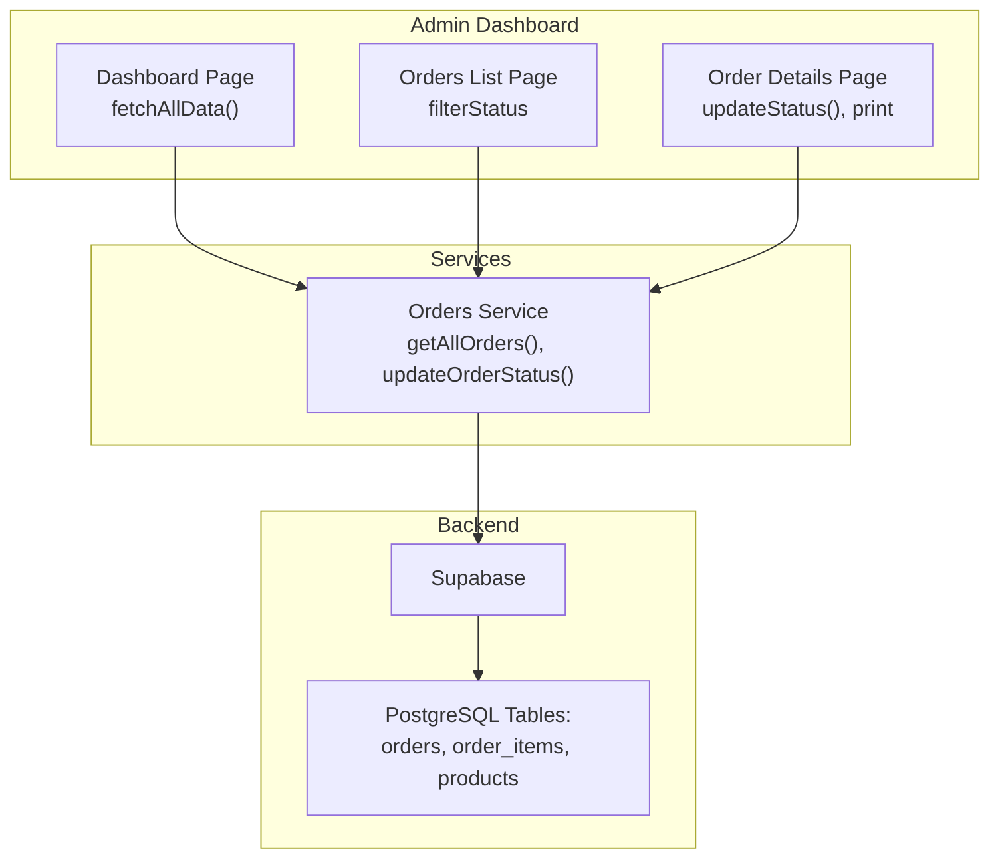
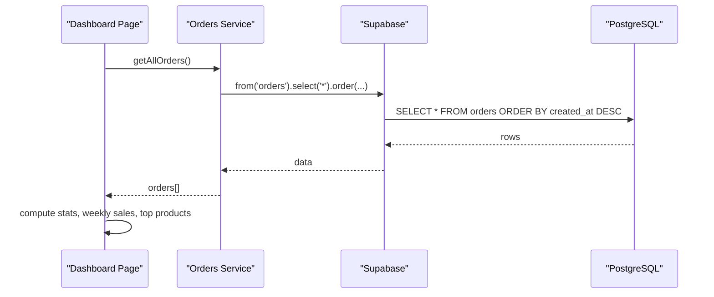
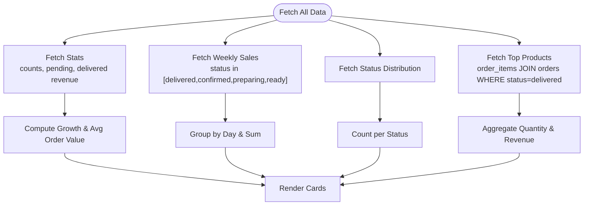
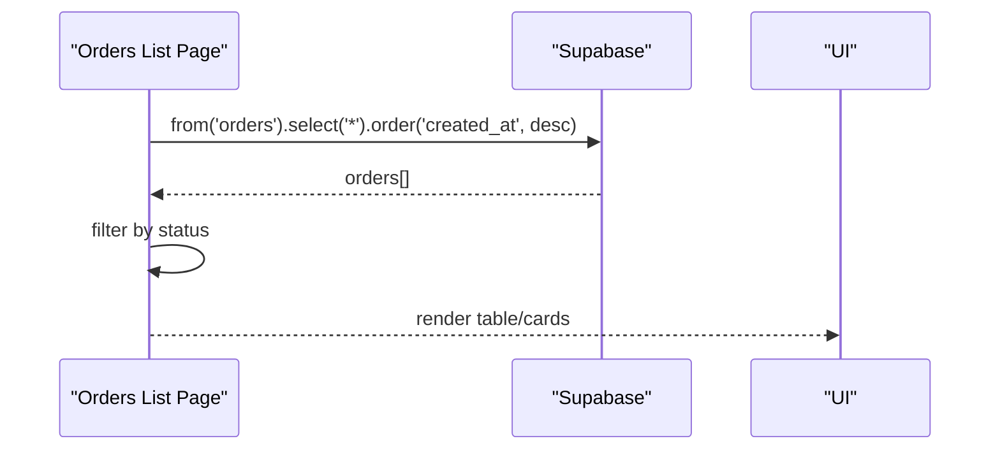
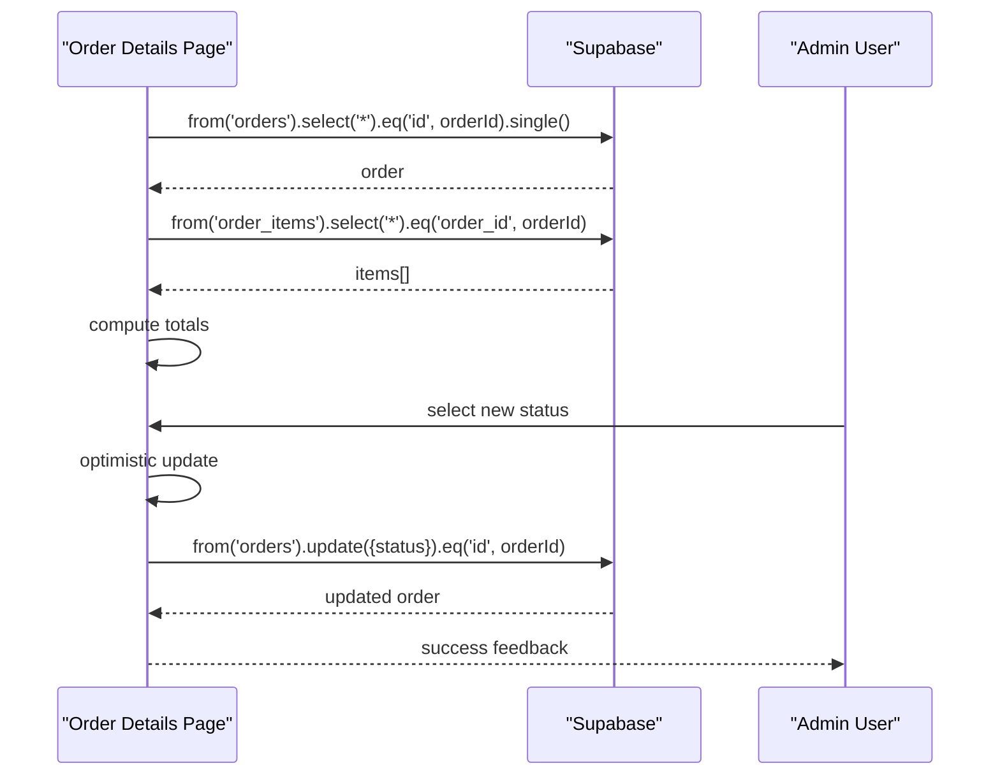
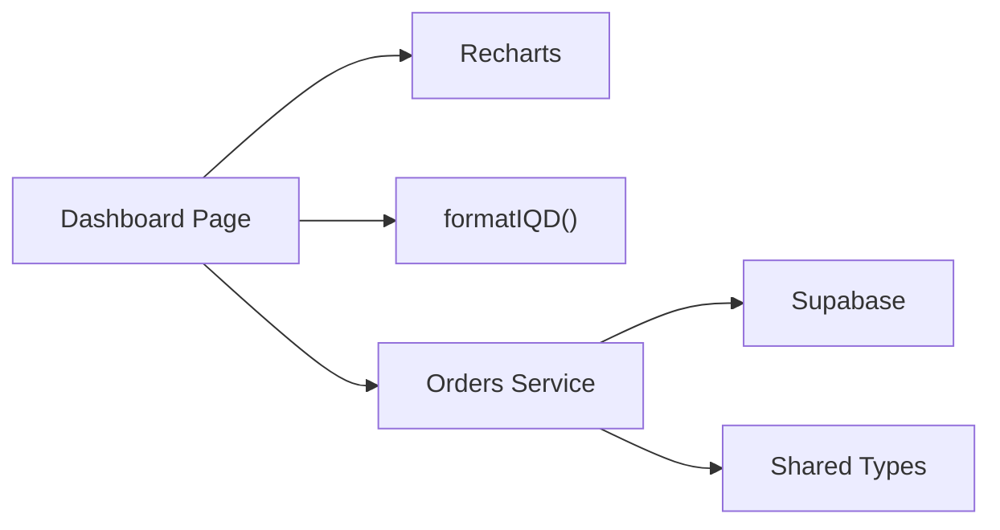

# Order Analytics and Reporting

<cite>
**Referenced Files in This Document**
- [admin/src/app/(dashboard)/page.tsx](file://admin/src/app/(dashboard)/page.tsx)
- [admin/src/app/(dashboard)/orders/page.tsx](file://admin/src/app/(dashboard)/orders/page.tsx)
- [admin/src/app/(dashboard)/orders/[id]/page.tsx](file://admin/src/app/(dashboard)/orders/[id]/page.tsx)
- [services/orders.service.ts](file://services/orders.service.ts)
- [shared/types.ts](file://shared/types.ts)
- [admin/src/lib/utils.ts](file://admin/src/lib/utils.ts)
</cite>

## Table of Contents
1. [Introduction](#introduction)
2. [Project Structure](#project-structure)
3. [Core Components](#core-components)
4. [Architecture Overview](#architecture-overview)
5. [Detailed Component Analysis](#detailed-component-analysis)
6. [Dependency Analysis](#dependency-analysis)
7. [Performance Considerations](#performance-considerations)
8. [Troubleshooting Guide](#troubleshooting-guide)
9. [Conclusion](#conclusion)

## Introduction
This document explains the order analytics and reporting capabilities implemented in the project. It covers:
- The order statistics dashboard with key metrics such as total orders, revenue, growth, and average order value
- Filtering and navigation to order lists and details
- Sales analytics including top-selling products and weekly sales trends
- Reporting interface with charts, data tables, and print/export options
- Data aggregation logic, calculation methods, and refresh behavior
- Integration points with the Supabase backend and supported data formats

## Project Structure
The analytics and reporting features are primarily implemented in the admin dashboard:
- Dashboard overview page aggregates metrics and visualizations
- Orders listing page provides filtering and navigation
- Order details page supports status updates and printing invoices
- Services encapsulate backend interactions
- Shared types define data contracts and filters

**Diagram sources**
- [admin/src/app/(dashboard)/page.tsx:89-103](file://admin/src/app/(dashboard)/page.tsx#L89-L103)
- [admin/src/app/(dashboard)/orders/page.tsx:16-30](file://admin/src/app/(dashboard)/orders/page.tsx#L16-L30)
- [admin/src/app/(dashboard)/orders/[id]/page.tsx:25-73](file://admin/src/app/(dashboard)/orders/[id]/page.tsx#L25-L73)
- [services/orders.service.ts:69-78](file://services/orders.service.ts#L69-L78)

**Section sources**
- [admin/src/app/(dashboard)/page.tsx:69-103](file://admin/src/app/(dashboard)/page.tsx#L69-L103)
- [admin/src/app/(dashboard)/orders/page.tsx:11-30](file://admin/src/app/(dashboard)/orders/page.tsx#L11-L30)
- [admin/src/app/(dashboard)/orders/[id]/page.tsx:14-73](file://admin/src/app/(dashboard)/orders/[id]/page.tsx#L14-L73)
- [services/orders.service.ts:12-21](file://services/orders.service.ts#L12-L21)

## Core Components
- Dashboard overview page:
  - Aggregates total orders, total revenue, pending orders, average order value, and growth metrics
  - Renders weekly sales bar chart and order status distribution pie chart
  - Lists top-selling products and recent orders
- Orders listing page:
  - Loads all orders and applies status-based filtering
  - Provides quick links to filtered views and order details
- Order details page:
  - Loads order and items, displays totals and timeline
  - Supports admin-only status updates and invoice printing
- Orders service:
  - Encapsulates backend queries for orders and order items
  - Exposes functions to fetch all orders and update statuses

**Section sources**
- [admin/src/app/(dashboard)/page.tsx:105-182](file://admin/src/app/(dashboard)/page.tsx#L105-L182)
- [admin/src/app/(dashboard)/page.tsx:184-222](file://admin/src/app/(dashboard)/page.tsx#L184-L222)
- [admin/src/app/(dashboard)/page.tsx:224-254](file://admin/src/app/(dashboard)/page.tsx#L224-L254)
- [admin/src/app/(dashboard)/page.tsx:256-298](file://admin/src/app/(dashboard)/page.tsx#L256-L298)
- [admin/src/app/(dashboard)/orders/page.tsx:20-30](file://admin/src/app/(dashboard)/orders/page.tsx#L20-L30)
- [admin/src/app/(dashboard)/orders/[id]/page.tsx:95-135](file://admin/src/app/(dashboard)/orders/[id]/page.tsx#L95-L135)
- [services/orders.service.ts:69-78](file://services/orders.service.ts#L69-L78)

## Architecture Overview
The analytics pipeline follows a client-driven data fetching pattern:
- Dashboard triggers multiple data fetches concurrently
- Metrics are computed client-side from returned datasets
- Charts consume normalized arrays for rendering
- Order pages rely on Supabase queries for listing and detail views
- Services abstract Supabase interactions for reusability

**Diagram sources**
- [admin/src/app/(dashboard)/page.tsx:93-103](file://admin/src/app/(dashboard)/page.tsx#L93-L103)
- [services/orders.service.ts:69-78](file://services/orders.service.ts#L69-L78)

## Detailed Component Analysis

### Dashboard Analytics
- Metrics computation:
  - Total orders and products via count queries
  - Pending orders via filtered count
  - Revenue from delivered orders using reduce
  - Growth comparisons using prior period counts/revenue
  - Average order value derived from delivered orders
- Weekly sales:
  - Filters orders by status and date range
  - Groups sales by day-of-week and sums totals
- Order status distribution:
  - Counts per status and maps to named segments
- Top products:
  - Joins order items with products and orders
  - Aggregates quantity and revenue per product for delivered orders
- Rendering:
  - Bar chart for weekly sales
  - Pie chart for order status distribution
  - Lists for top products and recent orders

**Diagram sources**
- [admin/src/app/(dashboard)/page.tsx:93-103](file://admin/src/app/(dashboard)/page.tsx#L93-L103)
- [admin/src/app/(dashboard)/page.tsx:105-182](file://admin/src/app/(dashboard)/page.tsx#L105-L182)
- [admin/src/app/(dashboard)/page.tsx:184-222](file://admin/src/app/(dashboard)/page.tsx#L184-L222)
- [admin/src/app/(dashboard)/page.tsx:224-254](file://admin/src/app/(dashboard)/page.tsx#L224-L254)
- [admin/src/app/(dashboard)/page.tsx:256-298](file://admin/src/app/(dashboard)/page.tsx#L256-L298)

**Section sources**
- [admin/src/app/(dashboard)/page.tsx:105-182](file://admin/src/app/(dashboard)/page.tsx#L105-L182)
- [admin/src/app/(dashboard)/page.tsx:184-222](file://admin/src/app/(dashboard)/page.tsx#L184-L222)
- [admin/src/app/(dashboard)/page.tsx:224-254](file://admin/src/app/(dashboard)/page.tsx#L224-L254)
- [admin/src/app/(dashboard)/page.tsx:256-298](file://admin/src/app/(dashboard)/page.tsx#L256-L298)

### Orders Listing and Filtering
- Loads orders from the backend and sorts by creation time
- Applies client-side filtering by status
- Provides quick navigation to filtered views and order details
- Displays order summary with status badges and totals

**Diagram sources**
- [admin/src/app/(dashboard)/orders/page.tsx:20-30](file://admin/src/app/(dashboard)/orders/page.tsx#L20-L30)
- [admin/src/app/(dashboard)/orders/page.tsx:44-46](file://admin/src/app/(dashboard)/orders/page.tsx#L44-L46)

**Section sources**
- [admin/src/app/(dashboard)/orders/page.tsx:20-30](file://admin/src/app/(dashboard)/orders/page.tsx#L20-L30)
- [admin/src/app/(dashboard)/orders/page.tsx:44-46](file://admin/src/app/(dashboard)/orders/page.tsx#L44-L46)

### Order Details, Status Updates, and Printing
- Loads order and items, computes subtotal and totals
- Supports admin-only status transitions with optimistic UI updates
- Prints a localized invoice with order and item details
- Displays timeline and payment/delivery info

**Diagram sources**
- [admin/src/app/(dashboard)/orders/[id]/page.tsx:29-73](file://admin/src/app/(dashboard)/orders/[id]/page.tsx#L29-L73)
- [admin/src/app/(dashboard)/orders/[id]/page.tsx:95-135](file://admin/src/app/(dashboard)/orders/[id]/page.tsx#L95-L135)

**Section sources**
- [admin/src/app/(dashboard)/orders/[id]/page.tsx:29-73](file://admin/src/app/(dashboard)/orders/[id]/page.tsx#L29-L73)
- [admin/src/app/(dashboard)/orders/[id]/page.tsx:95-135](file://admin/src/app/(dashboard)/orders/[id]/page.tsx#L95-L135)

### Data Aggregation Logic and Calculation Methods
- Metrics:
  - Total revenue: sum of total_iqd for delivered orders
  - Growth: percent change between current and previous week’s revenue/count
  - Average order value: total revenue / delivered order count
- Weekly sales:
  - Filters orders by status and date range
  - Groups by day-of-week and sums totals
- Top products:
  - Joins order_items with orders (status=delivered)
  - Aggregates quantity and revenue per product
- Formatting:
  - IQD currency formatting for KRD Dinars

**Section sources**
- [admin/src/app/(dashboard)/page.tsx:143-170](file://admin/src/app/(dashboard)/page.tsx#L143-L170)
- [admin/src/app/(dashboard)/page.tsx:184-222](file://admin/src/app/(dashboard)/page.tsx#L184-L222)
- [admin/src/app/(dashboard)/page.tsx:256-298](file://admin/src/app/(dashboard)/page.tsx#L256-L298)
- [admin/src/lib/utils.ts:8-14](file://admin/src/lib/utils.ts#L8-L14)

### Reporting Interface and Export Options
- Dashboard:
  - Weekly sales bar chart and order status pie chart
  - Top products and recent orders lists
- Order details:
  - Print invoice button generates a localized HTML invoice
  - No CSV/Excel export functionality is present in the analyzed files
- Filtering:
  - Orders list supports status-based filtering
  - Dashboard cards link to filtered order lists
- Refresh behavior:
  - Dashboard loads data on mount and performs concurrent fetches
  - No periodic refresh or polling is implemented in the analyzed files

**Section sources**
- [admin/src/app/(dashboard)/page.tsx:497-562](file://admin/src/app/(dashboard)/page.tsx#L497-L562)
- [admin/src/app/(dashboard)/orders/[id]/page.tsx:137-314](file://admin/src/app/(dashboard)/orders/[id]/page.tsx#L137-L314)
- [admin/src/app/(dashboard)/orders/page.tsx:44-46](file://admin/src/app/(dashboard)/orders/page.tsx#L44-L46)

### Integration with Backend and Data Contracts
- Supabase integration:
  - Orders listing and details use Supabase queries
  - Orders service abstracts CRUD-like operations
- Data contracts:
  - Strongly typed order, item, and filter interfaces
  - Order filters include status, payment status, and date range

**Section sources**
- [admin/src/app/(dashboard)/orders/page.tsx:20-30](file://admin/src/app/(dashboard)/orders/page.tsx#L20-L30)
- [admin/src/app/(dashboard)/orders/[id]/page.tsx:29-73](file://admin/src/app/(dashboard)/orders/[id]/page.tsx#L29-L73)
- [services/orders.service.ts:69-78](file://services/orders.service.ts#L69-L78)
- [shared/types.ts:347-352](file://shared/types.ts#L347-L352)

## Dependency Analysis
- Dashboard depends on:
  - Supabase for data retrieval
  - Recharts for visualization
  - Local formatting utilities for currency display
- Orders service centralizes:
  - Order retrieval and status updates
  - Reusable backend interactions
- Shared types define:
  - Order filters and enums for statuses and methods
  - Interfaces for order items and extended order records

**Diagram sources**
- [admin/src/app/(dashboard)/page.tsx:28-40](file://admin/src/app/(dashboard)/page.tsx#L28-L40)
- [admin/src/lib/utils.ts:8-14](file://admin/src/lib/utils.ts#L8-L14)
- [services/orders.service.ts:6-7](file://services/orders.service.ts#L6-L7)
- [shared/types.ts:347-352](file://shared/types.ts#L347-L352)

**Section sources**
- [admin/src/app/(dashboard)/page.tsx:28-40](file://admin/src/app/(dashboard)/page.tsx#L28-L40)
- [services/orders.service.ts:6-7](file://services/orders.service.ts#L6-L7)
- [shared/types.ts:347-352](file://shared/types.ts#L347-L352)

## Performance Considerations
- Concurrent data loading:
  - Dashboard uses concurrent fetches to minimize load time
- Client-side filtering:
  - Orders list applies filtering on the client; consider server-side filtering for large datasets
- Chart rendering:
  - Recharts renders responsive charts; ensure minimal re-renders by passing stable data references
- Currency formatting:
  - Using locale-aware formatting avoids heavy computations during rendering

## Troubleshooting Guide
- Order status updates fail:
  - Verify admin role checks and Supabase row-level security policies
  - Confirm optimistic update revert on error and user feedback
- Empty charts or missing data:
  - Ensure status filters match backend statuses and date ranges are correct
  - Validate that delivered orders exist for revenue calculations
- Print invoice issues:
  - Confirm DOM reference exists before printing and browser pop-up settings allow printing windows

**Section sources**
- [admin/src/app/(dashboard)/orders/[id]/page.tsx:95-135](file://admin/src/app/(dashboard)/orders/[id]/page.tsx#L95-L135)
- [admin/src/app/(dashboard)/page.tsx:184-222](file://admin/src/app/(dashboard)/page.tsx#L184-L222)

## Conclusion
The order analytics and reporting implementation provides a comprehensive overview of sales performance, order status distribution, and top-performing products. It leverages Supabase for data access, Recharts for visualizations, and client-side aggregation for metrics. While the current implementation focuses on dashboard insights and order management, future enhancements could include server-side filtering, CSV exports, and periodic refresh mechanisms to support deeper business intelligence workflows.