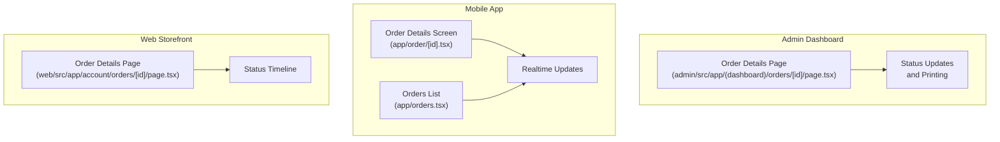
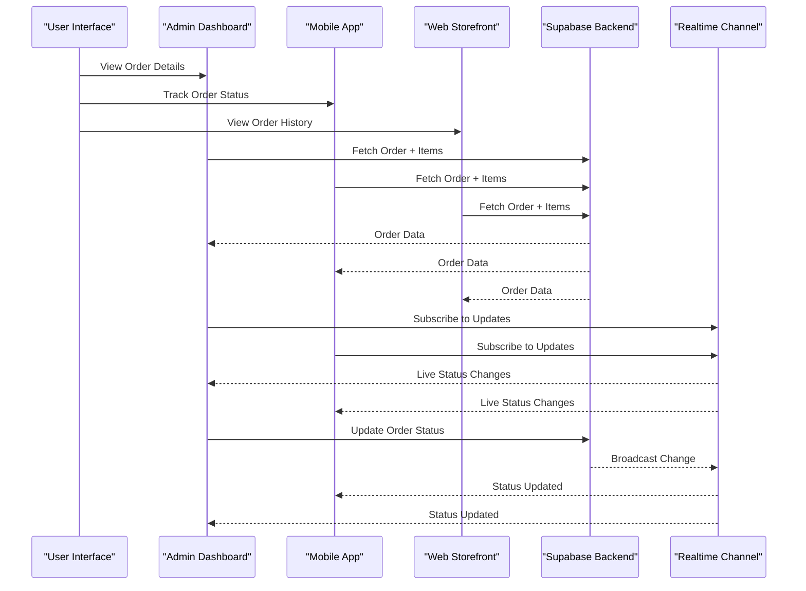
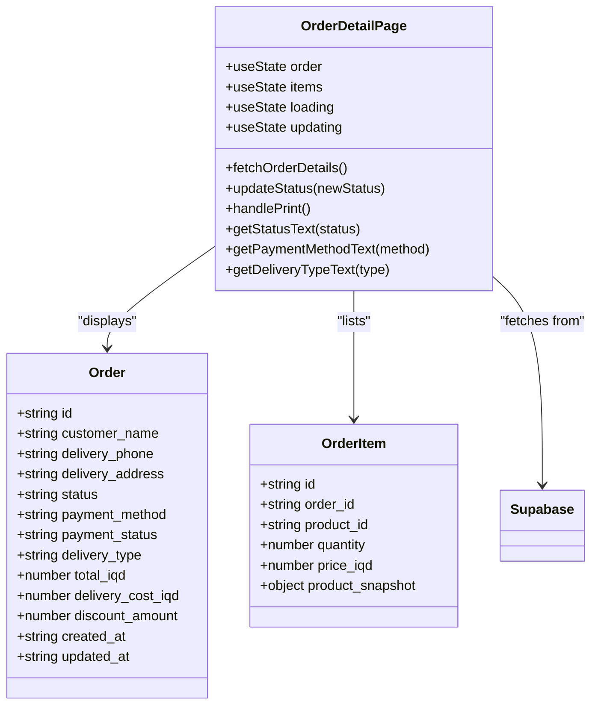
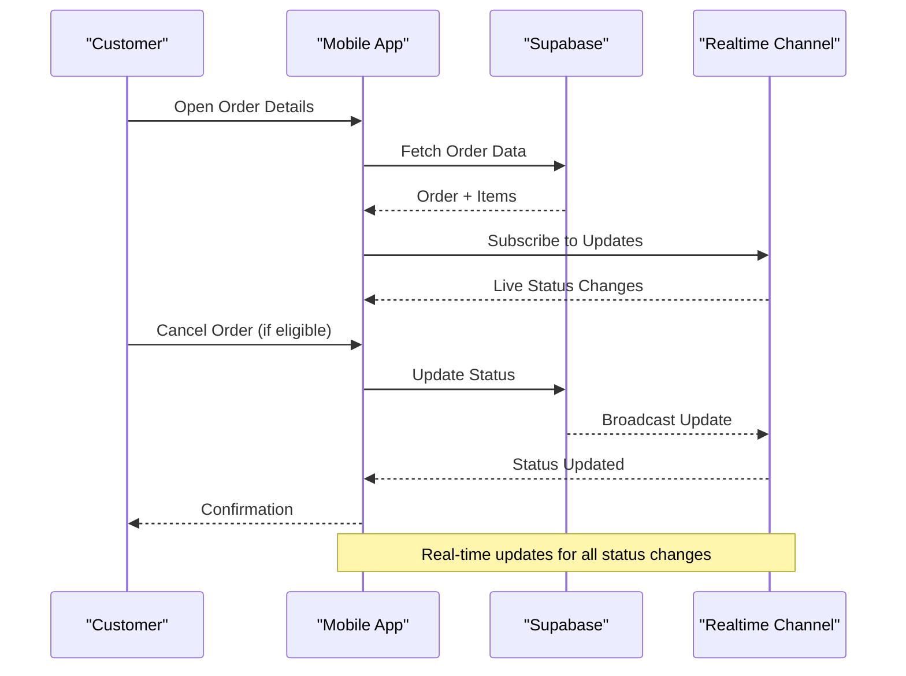
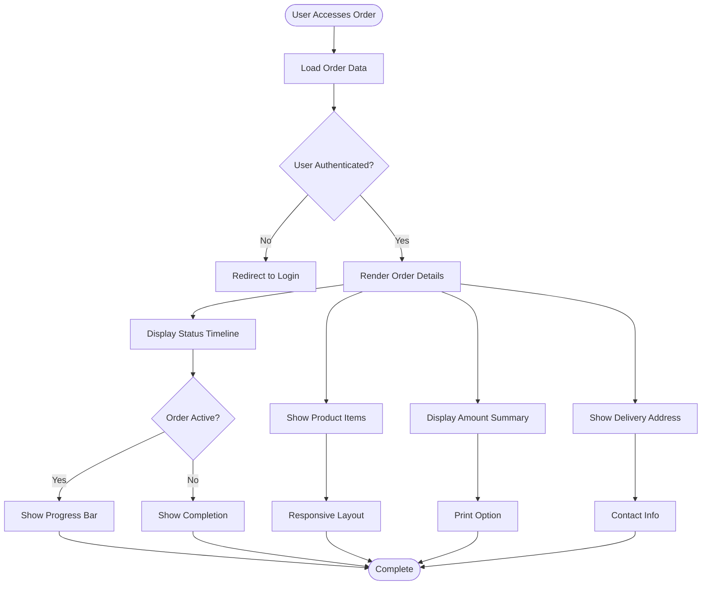
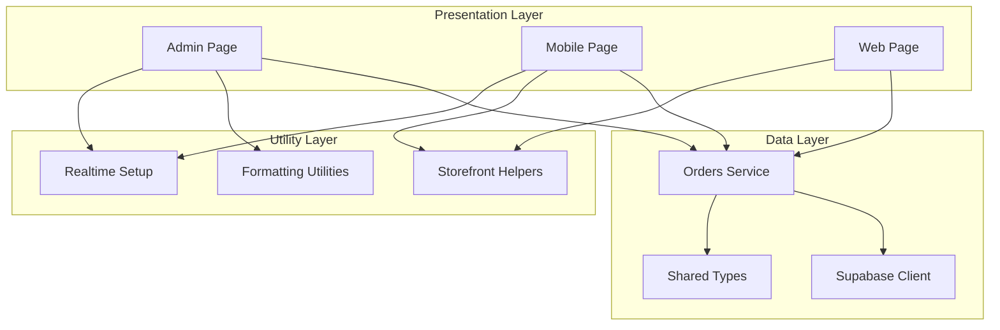

# Order Detail View

<cite>
**Referenced Files in This Document**
- [admin/src/app/(dashboard)/orders/[id]/page.tsx](file://admin/src/app/(dashboard)/orders/[id]/page.tsx)
- [app/order/[id].tsx](file://app/order/[id].tsx)
- [web/src/app/account/orders/[id]/page.tsx](file://web/src/app/account/orders/[id]/page.tsx)
- [services/orders.service.ts](file://services/orders.service.ts)
- [shared/types.ts](file://shared/types.ts)
- [.docs/ORDERS_REALTIME_SETUP.md](file://.docs/ORDERS_REALTIME_SETUP.md)
- [admin/src/lib/utils.ts](file://admin/src/lib/utils.ts)
- [web/src/lib/storefront.ts](file://web/src/lib/storefront.ts)
- [web/src/lib/storefront-data.ts](file://web/src/lib/storefront-data.ts)
- [app/orders.tsx](file://app/orders.tsx)
</cite>

## Table of Contents
1. [Introduction](#introduction)
2. [Project Structure](#project-structure)
3. [Core Components](#core-components)
4. [Architecture Overview](#architecture-overview)
5. [Detailed Component Analysis](#detailed-component-analysis)
6. [Dependency Analysis](#dependency-analysis)
7. [Performance Considerations](#performance-considerations)
8. [Troubleshooting Guide](#troubleshooting-guide)
9. [Conclusion](#conclusion)

## Introduction
This document provides comprehensive documentation for the order detail view interface across the Amal Center platform. It explains how order information is displayed, including customer details, shipping address, contact information, and order metadata. It documents the product items section with quantities, prices, and total calculations, the order timeline visualization, payment information display, and the order actions panel. It also covers real-time order updates integration and the overall order management workflow within the admin interface.

## Project Structure
The order detail view spans three primary environments:
- Admin dashboard (Next.js): Full-featured order management with status updates and printing
- Mobile app (React Native): Real-time order tracking with cancellation capability
- Web storefront (Next.js): Customer-facing order details with timeline visualization

**Diagram sources**
- [admin/src/app/(dashboard)/orders/[id]/page.tsx:14-654](file://admin/src/app/(dashboard)/orders/[id]/page.tsx#L14-L654)
- [app/order/[id].tsx:10-269](file://app/order/[id].tsx#L10-L269)
- [web/src/app/account/orders/[id]/page.tsx:24-189](file://web/src/app/account/orders/[id]/page.tsx#L24-L189)

**Section sources**
- [admin/src/app/(dashboard)/orders/[id]/page.tsx:14-654](file://admin/src/app/(dashboard)/orders/[id]/page.tsx#L14-L654)
- [app/order/[id].tsx:10-269](file://app/order/[id].tsx#L10-L269)
- [web/src/app/account/orders/[id]/page.tsx:24-189](file://web/src/app/account/orders/[id]/page.tsx#L24-L189)

## Core Components
The order detail view consists of several key components that work together to present comprehensive order information:

### Order Information Display
- **Customer Details**: Name, phone number, and delivery address
- **Order Metadata**: Order ID, creation date/time, and status badge
- **Customer Notes**: Special delivery instructions or requests
- **Delivery Type**: Scheduled, express, or electronic delivery options

### Product Items Section
- **Product Listings**: Images, names, quantities, and individual prices
- **Quantity Management**: Display of item quantities
- **Price Calculations**: Individual item totals and grand totals
- **Responsive Design**: Desktop table view and mobile card layout

### Order Timeline Visualization
- **Status Progression**: Visual representation of order stages
- **Timestamp Tracking**: Creation and update timestamps
- **Status Steps**: Pending, confirmed, preparing, ready, delivered

### Payment Information Display
- **Payment Methods**: Cash on delivery, cash, card, or wallet
- **Payment Status**: Pending, paid, failed, or awaiting payment
- **Delivery Type**: Standard, express, or electronics delivery
- **Amount Breakdown**: Subtotal, delivery cost, discounts, and total

### Order Actions Panel
- **Status Update Controls**: Dropdown for changing order status
- **Print Functionality**: Invoice generation with RTL support
- **Communication Options**: Customer notification capabilities
- **Real-time Updates**: Live status synchronization

**Section sources**
- [admin/src/app/(dashboard)/orders/[id]/page.tsx:385-654](file://admin/src/app/(dashboard)/orders/[id]/page.tsx#L385-L654)
- [app/order/[id].tsx:168-240](file://app/order/[id].tsx#L168-L240)
- [web/src/app/account/orders/[id]/page.tsx:61-98](file://web/src/app/account/orders/[id]/page.tsx#L61-L98)

## Architecture Overview
The order detail view architecture follows a multi-platform approach with centralized data management through Supabase:

**Diagram sources**
- [admin/src/app/(dashboard)/orders/[id]/page.tsx:25-46](file://admin/src/app/(dashboard)/orders/[id]/page.tsx#L25-L46)
- [app/order/[id].tsx:24-46](file://app/order/[id].tsx#L24-L46)
- [.docs/ORDERS_REALTIME_SETUP.md:18-37](file://.docs/ORDERS_REALTIME_SETUP.md#L18-L37)

## Detailed Component Analysis

### Admin Order Detail Component
The admin order detail page provides comprehensive order management capabilities with real-time updates and administrative controls.

**Diagram sources**
- [admin/src/app/(dashboard)/orders/[id]/page.tsx:14-654](file://admin/src/app/(dashboard)/orders/[id]/page.tsx#L14-L654)
- [shared/types.ts:49-86](file://shared/types.ts#L49-L86)

#### Order Information Display
The component displays comprehensive order information including:
- **Customer Information**: Name, phone number, and delivery address
- **Order Metadata**: Unique ID, creation timestamp, and status badge
- **Customer Notes**: Special delivery instructions
- **Delivery Details**: Type and contact information

#### Product Items Section
The product items section presents:
- **Desktop Table View**: Structured table with images, names, quantities, and prices
- **Mobile Card Layout**: Responsive cards for smaller screens
- **Price Calculations**: Automatic calculation of item totals
- **Visual Elements**: Product images and responsive design

#### Order Timeline Visualization
The timeline component shows:
- **Creation Timestamp**: Order creation date and time
- **Last Update**: Most recent status change timestamp
- **Status Progression**: Visual indication of order lifecycle

#### Payment Information Display
Payment information includes:
- **Payment Method**: Cash on delivery, cash, card, or wallet
- **Payment Status**: Pending, paid, failed, or awaiting payment
- **Delivery Type**: Standard, express, or electronics
- **Amount Breakdown**: Subtotal, delivery cost, discounts, and total

#### Order Actions Panel
The actions panel provides:
- **Status Update Dropdown**: Administrative control over order status
- **Print Invoice**: Professional invoice generation with RTL support
- **Real-time Feedback**: Success/error messaging for updates
- **Loading States**: Visual indicators during updates

**Section sources**
- [admin/src/app/(dashboard)/orders/[id]/page.tsx:385-654](file://admin/src/app/(dashboard)/orders/[id]/page.tsx#L385-L654)
- [admin/src/lib/utils.ts:8-14](file://admin/src/lib/utils.ts#L8-L14)

### Mobile Order Detail Component
The mobile order detail screen focuses on real-time tracking and user-friendly navigation.

**Diagram sources**
- [app/order/[id].tsx:21-46](file://app/order/[id].tsx#L21-L46)
- [app/order/[id].tsx:84-111](file://app/order/[id].tsx#L84-L111)

#### Real-time Order Updates
The mobile implementation includes sophisticated real-time updates:
- **Supabase Realtime Subscriptions**: Live synchronization of order status
- **Automatic Refresh**: Seamless updates without manual refresh
- **Event Filtering**: Specific filtering for user's orders
- **Error Handling**: Robust error management for network issues

#### Order Cancellation Workflow
The cancellation feature provides:
- **Eligibility Checks**: Validates if order can be cancelled
- **Confirmation Dialogs**: User confirmation for destructive actions
- **Immediate Updates**: Real-time status updates after cancellation
- **Error Recovery**: Graceful handling of cancellation failures

#### User Experience Features
Mobile-specific enhancements include:
- **Pull-to-Refresh**: Manual refresh capability
- **Thank You Modal**: Post-order confirmation experience
- **Responsive Design**: Optimized for mobile devices
- **Navigation**: Back button and route management

**Section sources**
- [app/order/[id].tsx:21-111](file://app/order/[id].tsx#L21-L111)
- [app/orders.tsx:38-85](file://app/orders.tsx#L38-L85)

### Web Storefront Order Detail
The web storefront provides customer-facing order details with timeline visualization.

**Diagram sources**
- [web/src/app/account/orders/[id]/page.tsx:24-35](file://web/src/app/account/orders/[id]/page.tsx#L24-L35)
- [web/src/lib/storefront.ts:18-24](file://web/src/lib/storefront.ts#L18-L24)

#### Status Timeline Visualization
The web implementation features a sophisticated timeline:
- **Status Steps**: Defined progression from pending to delivered
- **Active State Indication**: Visual highlighting of current status
- **Sequential Progression**: Step-by-step completion indicator
- **Localized Labels**: Arabic and English support

#### Customer-Facing Features
The web storefront emphasizes:
- **Order History Access**: Easy access to past orders
- **Status Transparency**: Clear visibility of order progression
- **Responsive Design**: Optimized for desktop and tablet
- **Professional Presentation**: Clean, business-appropriate design

**Section sources**
- [web/src/app/account/orders/[id]/page.tsx:61-98](file://web/src/app/account/orders/[id]/page.tsx#L61-L98)
- [web/src/lib/storefront.ts:18-24](file://web/src/lib/storefront.ts#L18-L24)

## Dependency Analysis
The order detail view system relies on several key dependencies and service layers:

**Diagram sources**
- [services/orders.service.ts:6-115](file://services/orders.service.ts#L6-L115)
- [shared/types.ts:49-86](file://shared/types.ts#L49-L86)

### Data Model Dependencies
The order detail views depend on the following database schema:
- **Orders Table**: Core order information and metadata
- **Order Items Table**: Product details and pricing
- **Profiles Table**: User and admin information
- **Products Table**: Product inventory and details

### Service Layer Integration
The orders service provides:
- **Order Retrieval**: Fetch orders with associated items
- **Status Updates**: Administrative order status changes
- **Payment Updates**: Payment status management
- **User Order History**: Customer order access

### Real-time Integration
Real-time updates are implemented through:
- **Supabase Realtime**: PostgreSQL publication and replication
- **Channel Subscriptions**: Targeted order updates
- **Event Filtering**: User-specific order filtering
- **Automatic Synchronization**: Seamless status updates

**Section sources**
- [services/orders.service.ts:6-115](file://services/orders.service.ts#L6-L115)
- [shared/types.ts:49-86](file://shared/types.ts#L49-L86)
- [.docs/ORDERS_REALTIME_SETUP.md:18-66](file://.docs/ORDERS_REALTIME_SETUP.md#L18-L66)

## Performance Considerations
Several performance optimizations are implemented across the order detail views:

### Data Loading Optimization
- **Efficient Queries**: Single request to fetch orders with items
- **Pagination Support**: Scalable handling of large order histories
- **Caching Strategies**: Local caching of frequently accessed orders
- **Lazy Loading**: Progressive loading of order details

### Real-time Performance
- **Connection Management**: Efficient channel subscriptions
- **Event Filtering**: Reduced bandwidth through targeted filtering
- **Update Batching**: Consolidated updates to minimize re-renders
- **Connection Pooling**: Optimized database connections

### Rendering Performance
- **Virtualization**: Large order lists use virtualized rendering
- **Memoization**: Expensive calculations cached with useMemo
- **Conditional Rendering**: Dynamic content loading based on availability
- **Responsive Design**: Adaptive layouts for different screen sizes

### Network Optimization
- **Connection Reuse**: Persistent connections for real-time updates
- **Error Retry Logic**: Intelligent retry mechanisms for failed requests
- **Offline Support**: Graceful degradation when network is unavailable
- **Compression**: Efficient data transfer through compression

## Troubleshooting Guide

### Real-time Updates Issues
Common problems and solutions:

**Problem**: Status changes not reflecting in real-time
- **Solution**: Verify Supabase Realtime is enabled for orders table
- **Check**: Publication and replica identity settings
- **Test**: Manual status update to confirm broadcast

**Problem**: Orders not appearing in mobile app
- **Solution**: Ensure user authentication is active
- **Check**: Realtime subscription setup
- **Verify**: User ID filtering in subscription

### Order Data Display Issues
**Problem**: Missing order information
- **Solution**: Verify database connection and permissions
- **Check**: Order existence and user association
- **Debug**: Console logs for data fetching errors

**Problem**: Incorrect pricing or totals
- **Solution**: Validate price calculations in order items
- **Check**: Currency formatting and exchange rates
- **Verify**: Discount and delivery cost application

### Admin Panel Issues
**Problem**: Status update failures
- **Solution**: Verify admin authentication and permissions
- **Check**: RLS policies for order updates
- **Debug**: Error messages in update process

**Problem**: Print functionality not working
- **Solution**: Verify print window creation and content
- **Check**: RTL language support for Arabic printing
- **Test**: Browser compatibility for print functionality

### Mobile App Navigation Issues
**Problem**: Order details not loading
- **Solution**: Verify navigation parameters and route setup
- **Check**: Order ID validation and user ownership
- **Debug**: Console errors during data fetching

**Problem**: Cancellation not working
- **Solution**: Verify eligibility checks and user permissions
- **Check**: Status validation for cancellation
- **Test**: Network connectivity for update requests

**Section sources**
- [.docs/ORDERS_REALTIME_SETUP.md:83-107](file://.docs/ORDERS_REALTIME_SETUP.md#L83-L107)
- [admin/src/app/(dashboard)/orders/[id]/page.tsx:95-135](file://admin/src/app/(dashboard)/orders/[id]/page.tsx#L95-L135)
- [app/order/[id].tsx:84-111](file://app/order/[id].tsx#L84-L111)

## Conclusion
The order detail view interface provides a comprehensive, multi-platform solution for order management and tracking. The system successfully integrates real-time updates, administrative controls, and customer-facing features across three distinct environments. Key strengths include robust real-time synchronization, responsive design patterns, and comprehensive error handling. The modular architecture allows for easy maintenance and future enhancements while maintaining consistent user experiences across all platforms.

The implementation demonstrates best practices in modern web and mobile development, including efficient data management, real-time communication, and user-centric design. The system is well-suited for production deployment and can accommodate future scaling requirements through its modular service architecture and efficient data access patterns.