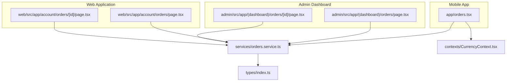
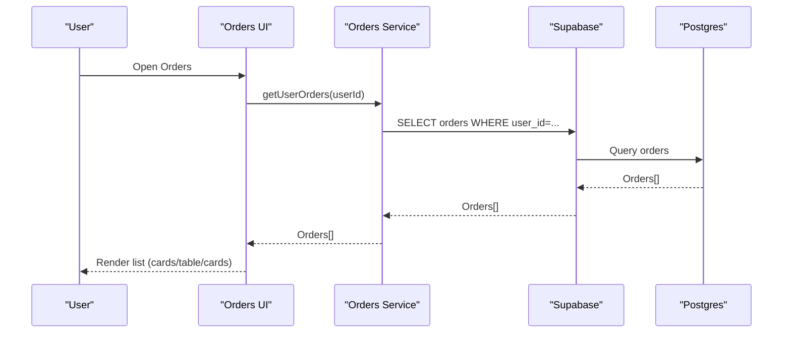
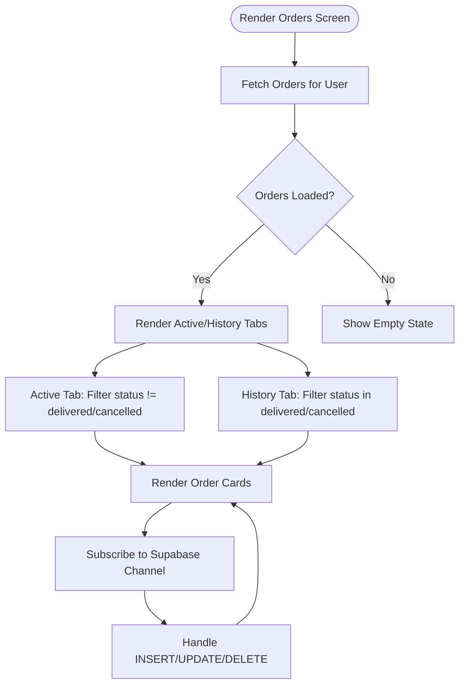
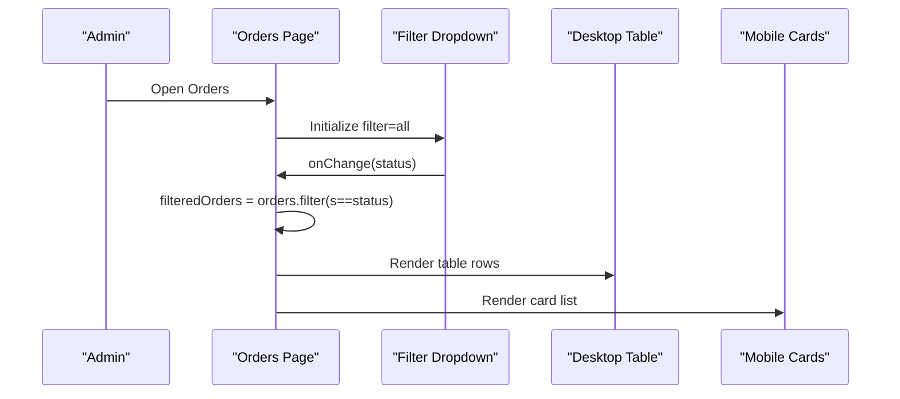
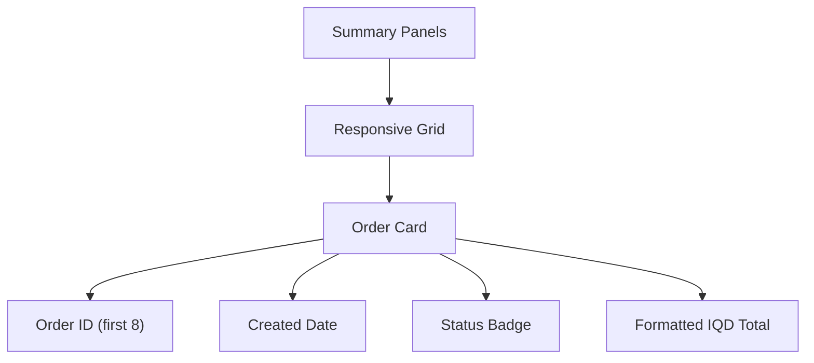
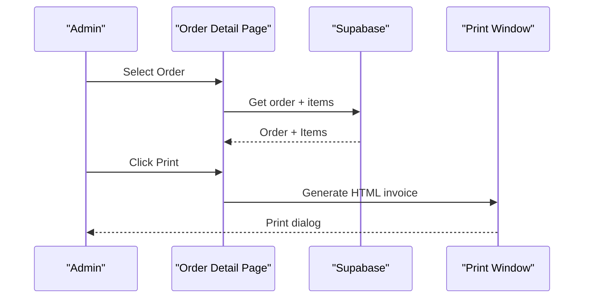
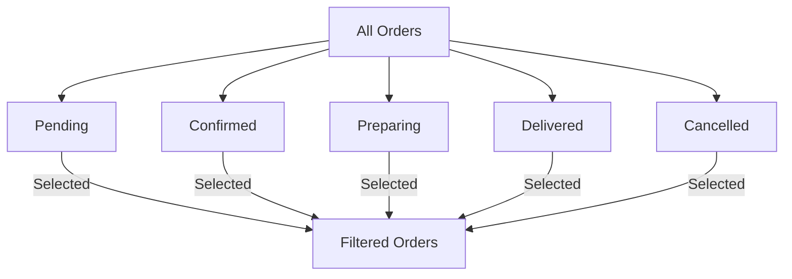
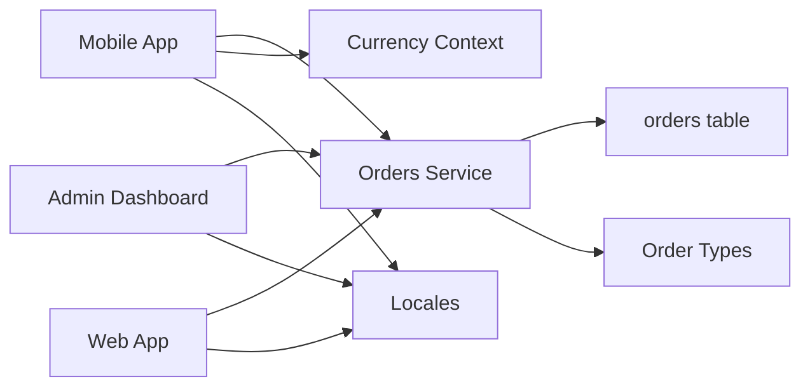

# Order Listing and Filtering

<cite>
**Referenced Files in This Document**
- [app/orders.tsx](file://app/orders.tsx)
- [admin/src/app/(dashboard)/orders/page.tsx](file://admin/src/app/(dashboard)/orders/page.tsx)
- [web/src/app/account/orders/page.tsx](file://web/src/app/account/orders/page.tsx)
- [admin/src/app/(dashboard)/orders/[id]/page.tsx](file://admin/src/app/(dashboard)/orders/[id]/page.tsx)
- [web/src/app/account/orders/[id]/page.tsx](file://web/src/app/account/orders/[id]/page.tsx)
- [services/orders.service.ts](file://services/orders.service.ts)
- [types/index.ts](file://types/index.ts)
- [contexts/CurrencyContext.tsx](file://contexts/CurrencyContext.tsx)
- [locales/en.json](file://locales/en.json)
- [locales/ar.json](file://locales/ar.json)
</cite>

## Table of Contents
1. [Introduction](#introduction)
2. [Project Structure](#project-structure)
3. [Core Components](#core-components)
4. [Architecture Overview](#architecture-overview)
5. [Detailed Component Analysis](#detailed-component-analysis)
6. [Dependency Analysis](#dependency-analysis)
7. [Performance Considerations](#performance-considerations)
8. [Troubleshooting Guide](#troubleshooting-guide)
9. [Conclusion](#conclusion)

## Introduction
This document describes the order listing and filtering functionality across the mobile app, admin dashboard, and web application. It covers the main orders page interface, filtering by order status, responsive design (desktop table vs. mobile cards), order ID formatting, customer phone number display, IQD currency formatting, loading and empty states, pagination considerations, Lucide icon integration for status indicators, and UX design principles.

## Project Structure
The order listing feature spans three environments:
- Mobile app (React Native): a tabbed screen with active/history tabs and card-based layout
- Admin dashboard (Next.js): a desktop-first table with Lucide icons and status badges
- Web application (Next.js): a responsive card grid with summary panels and status timeline

**Diagram sources**
- [app/orders.tsx:28-516](file://app/orders.tsx#L28-L516)
- [admin/src/app/(dashboard)/orders/page.tsx](file://admin/src/app/(dashboard)/orders/page.tsx#L11-L173)
- [admin/src/app/(dashboard)/orders/[id]/page.tsx](file://admin/src/app/(dashboard)/orders/[id]/page.tsx#L14-L655)
- [web/src/app/account/orders/page.tsx:14-103](file://web/src/app/account/orders/page.tsx#L14-L103)
- [web/src/app/account/orders/[id]/page.tsx](file://web/src/app/account/orders/[id]/page.tsx#L24-L189)
- [services/orders.service.ts:56-65](file://services/orders.service.ts#L56-L65)
- [types/index.ts:76-108](file://types/index.ts#L76-L108)
- [contexts/CurrencyContext.tsx:55-73](file://contexts/CurrencyContext.tsx#L55-L73)

**Section sources**
- [app/orders.tsx:28-516](file://app/orders.tsx#L28-L516)
- [admin/src/app/(dashboard)/orders/page.tsx](file://admin/src/app/(dashboard)/orders/page.tsx#L11-L173)
- [web/src/app/account/orders/page.tsx:14-103](file://web/src/app/account/orders/page.tsx#L14-L103)
- [services/orders.service.ts:56-65](file://services/orders.service.ts#L56-L65)

## Core Components
- Mobile Orders Screen
  - Active/History tabs with badge counts
  - Card layout with status icon, order ID, relative time, progress bar (active), price, and payment method
  - Real-time updates via Supabase channel subscription
  - Loading and empty states with localized messaging
- Admin Orders Page
  - Status filter dropdown with Lucide icons and Arabic labels
  - Desktop table view with customer info, date, amount, and status badges
  - Mobile card view for smaller screens
  - Empty state with Lucide Inbox icon
- Web Orders Page
  - Summary panels for totals and latest order
  - Responsive card grid with order ID, date, status badge, and formatted IQD amount
- Shared Services and Types
  - Orders service methods for fetching user orders and all orders
  - Strongly typed order status and filters
- Currency Formatting
  - IQD formatting with Arabic locale and RTL-aware display
  - Currency context for mobile app pricing

**Section sources**
- [app/orders.tsx:116-164](file://app/orders.tsx#L116-L164)
- [admin/src/app/(dashboard)/orders/page.tsx](file://admin/src/app/(dashboard)/orders/page.tsx#L32-L46)
- [web/src/app/account/orders/page.tsx:37-98](file://web/src/app/account/orders/page.tsx#L37-L98)
- [services/orders.service.ts:56-65](file://services/orders.service.ts#L56-L65)
- [types/index.ts:76-108](file://types/index.ts#L76-L108)
- [contexts/CurrencyContext.tsx:55-73](file://contexts/CurrencyContext.tsx#L55-L73)

## Architecture Overview
The order listing architecture follows a consistent pattern:
- Data retrieval via Supabase from the orders table
- Environment-specific rendering (mobile cards, admin desktop table, web cards)
- Status filtering and localization handled per environment
- Real-time updates for customer orders via Supabase channel

**Diagram sources**
- [services/orders.service.ts:56-65](file://services/orders.service.ts#L56-L65)
- [app/orders.tsx:87-109](file://app/orders.tsx#L87-L109)
- [admin/src/app/(dashboard)/orders/page.tsx](file://admin/src/app/(dashboard)/orders/page.tsx#L20-L30)
- [web/src/app/account/orders/page.tsx:17-18](file://web/src/app/account/orders/page.tsx#L17-L18)

## Detailed Component Analysis

### Mobile Orders Screen (Cards with Tabs)
- Tabs
  - Active tab: shows orders with status not in delivered/cancelled
  - History tab: shows delivered/cancelled orders
  - Badge counts reflect filtered subsets
- Card Layout
  - Top row: status icon and background, order ID (first 8 chars), relative time
  - Progress bar for active orders indicating step completion
  - Bottom row: formatted IQD total, payment method badge (COD/Card)
- Status Mapping and Icons
  - Status to color/icon mapping for visual cues
  - Relative time computed from created_at
- Real-time Updates
  - Supabase channel subscription scoped to current user
  - Handles INSERT/UPDATE/DELETE events to keep UI in sync
- Localization and RTL
  - Uses language context for status labels and relative time
  - Direction-aware layout adjustments
- Loading and Empty States
  - Large activity indicator during initial load
  - Empty state with Lucide icons and localized messages
  - Active tab empty state includes a CTA to shop

**Diagram sources**
- [app/orders.tsx:38-85](file://app/orders.tsx#L38-L85)
- [app/orders.tsx:116-117](file://app/orders.tsx#L116-L117)
- [app/orders.tsx:166-319](file://app/orders.tsx#L166-L319)

**Section sources**
- [app/orders.tsx:28-516](file://app/orders.tsx#L28-L516)

### Admin Orders Page (Desktop Table with Filters)
- Status Filter
  - Dropdown to filter by all/pending/confirmed/preparing/delivered/cancelled
  - Live filtering of orders array
- Desktop Table
  - Columns: Order ID (first 8 uppercase), Customer, Date, Amount (IQD), Status badge, Actions
  - Status badges use Lucide icons and localized Arabic labels
- Mobile Card View
  - Collapsed card layout with customer name, order ID, phone, amount, status, and date
- Empty State
  - Inbox icon and contextual message depending on filter
- Currency Formatting
  - IQD formatting via utility function

**Diagram sources**
- [admin/src/app/(dashboard)/orders/page.tsx](file://admin/src/app/(dashboard)/orders/page.tsx#L14-L46)
- [admin/src/app/(dashboard)/orders/page.tsx](file://admin/src/app/(dashboard)/orders/page.tsx#L85-L156)

**Section sources**
- [admin/src/app/(dashboard)/orders/page.tsx](file://admin/src/app/(dashboard)/orders/page.tsx#L11-L173)

### Web Orders Page (Responsive Cards with Summary Panels)
- Summary Panels
  - Total orders, delivered count, latest order date
- Order Grid
  - Responsive grid with soft panels
  - Each card shows order ID (first 8), created date, status badge, formatted IQD total
- Empty State
  - Centered message when no orders exist

**Diagram sources**
- [web/src/app/account/orders/page.tsx:37-98](file://web/src/app/account/orders/page.tsx#L37-L98)

**Section sources**
- [web/src/app/account/orders/page.tsx:14-103](file://web/src/app/account/orders/page.tsx#L14-L103)

### Order Detail Pages (Admin and Web)
- Admin Order Detail
  - Print invoice with order metadata, customer info, items, totals, payment/delivery info
  - Status update dropdown with optimistic UI feedback
  - Timeline and status steps visualization
- Web Order Detail
  - Status steps timeline with numbered steps
  - Items list with images and quantities
  - Pricing breakdown (subtotal, delivery, discount, total)
  - Delivery address and phone

**Diagram sources**
- [admin/src/app/(dashboard)/orders/[id]/page.tsx](file://admin/src/app/(dashboard)/orders/[id]/page.tsx#L29-L73)
- [admin/src/app/(dashboard)/orders/[id]/page.tsx](file://admin/src/app/(dashboard)/orders/[id]/page.tsx#L137-L314)

**Section sources**
- [admin/src/app/(dashboard)/orders/[id]/page.tsx](file://admin/src/app/(dashboard)/orders/[id]/page.tsx#L14-L655)
- [web/src/app/account/orders/[id]/page.tsx](file://web/src/app/account/orders/[id]/page.tsx#L24-L189)

### Filtering System by Order Status
- Mobile
  - Tabs act as implicit filters: Active vs. History
  - No explicit status filter controls
- Admin
  - Explicit dropdown filter with options: all, pending, confirmed, preparing, delivered, cancelled
  - Filter applied client-side on orders array
- Web
  - No explicit status filter on the list page; filtering is implicit by user ownership

**Diagram sources**
- [admin/src/app/(dashboard)/orders/page.tsx](file://admin/src/app/(dashboard)/orders/page.tsx#L44-L46)

**Section sources**
- [admin/src/app/(dashboard)/orders/page.tsx](file://admin/src/app/(dashboard)/orders/page.tsx#L14-L46)

### Responsive Design Implementation
- Mobile App
  - Card-based layout with stacked content
  - RTL-aware spacing and chevrons
  - Active tab shows progress bars; history hides progress
- Admin Dashboard
  - Desktop table hidden on small screens; mobile cards visible below
  - Sticky header with filter controls
- Web Application
  - Responsive grid with soft panels and sticky sidebar-like panel on larger screens

**Section sources**
- [app/orders.tsx:166-319](file://app/orders.tsx#L166-L319)
- [admin/src/app/(dashboard)/orders/page.tsx](file://admin/src/app/(dashboard)/orders/page.tsx#L85-L156)
- [web/src/app/account/orders/page.tsx:64-98](file://web/src/app/account/orders/page.tsx#L64-L98)

### Order ID Formatting, Customer Phone Number Display, and IQD Currency Formatting
- Order ID
  - First 8 characters shown uppercase for brevity
- Customer Phone Number
  - Displayed in monospace font for readability
- IQD Currency
  - Mobile: formatted via currency context with Arabic locale and IQD code
  - Admin/Web: formatted via utility functions with Arabic locale for Arabic UI
- Localization
  - Status labels and relative times localized via language context

**Section sources**
- [app/orders.tsx:219-273](file://app/orders.tsx#L219-L273)
- [admin/src/app/(dashboard)/orders/page.tsx](file://admin/src/app/(dashboard)/orders/page.tsx#L102-L110)
- [web/src/app/account/orders/page.tsx:74-89](file://web/src/app/account/orders/page.tsx#L74-L89)
- [contexts/CurrencyContext.tsx:55-73](file://contexts/CurrencyContext.tsx#L55-L73)

### Loading States, Empty State Handling, and Pagination Considerations
- Loading States
  - Mobile: large activity indicator centered
  - Admin/Web: skeleton placeholders or centered loading text
- Empty States
  - Mobile: Lucide cube/time icons, localized messages, optional CTA
  - Admin: Lucide inbox icon with contextual message
  - Web: centered message when no orders
- Pagination
  - Current implementations fetch all orders for the user
  - No pagination UI present; consider adding offset/limit for large datasets

**Section sources**
- [app/orders.tsx:448-509](file://app/orders.tsx#L448-L509)
- [admin/src/app/(dashboard)/orders/page.tsx](file://admin/src/app/(dashboard)/orders/page.tsx#L48-L53)
- [web/src/app/account/orders/page.tsx:94-98](file://web/src/app/account/orders/page.tsx#L94-L98)

### Lucide Icon Integration for Status Indicators
- Admin Orders List
  - Uses Lucide icons for each status: CircleDot, BadgeCheck, ChefHat, PackageCheck, Truck, Ban
  - Status badges combine icon + Arabic label
- Admin Order Detail
  - Uses Lucide icons for timeline steps and informational sections (User, Phone, MapPin, CreditCard, Truck, Calendar)
- Mobile Orders
  - Uses Ionicons for status icons within cards

**Section sources**
- [admin/src/app/(dashboard)/orders/page.tsx](file://admin/src/app/(dashboard)/orders/page.tsx#L32-L42)
- [admin/src/app/(dashboard)/orders/[id]/page.tsx](file://admin/src/app/(dashboard)/orders/[id]/page.tsx#L316-L355)
- [app/orders.tsx:201-211](file://app/orders.tsx#L201-L211)

### Overall User Experience Design Principles
- Consistent Status Semantics
  - Same statuses across environments: pending, confirmed, preparing, ready, delivered, cancelled
- Visual Feedback
  - Color-coded status badges and progress bars for active orders
  - Optimistic UI updates for admin status changes
- Accessibility
  - Clear typography hierarchy, readable amounts, and monospace phone numbers
- Localization
  - Full Arabic/English support for labels, dates, and currencies
- Responsiveness
  - Adaptive layouts: cards on mobile, tables on desktop, sticky sidebars on web

**Section sources**
- [types/index.ts:106-108](file://types/index.ts#L106-L108)
- [locales/en.json:332-339](file://locales/en.json#L332-L339)
- [locales/ar.json:332-339](file://locales/ar.json#L332-L339)

## Dependency Analysis
- Data Access
  - Orders service encapsulates Supabase queries for user orders and all orders
- Types
  - Strongly typed order status and filters enable safer client-side filtering
- Currency
  - Currency context ensures consistent IQD formatting across mobile app
- Localization
  - Language context and locale files drive status labels and relative time

**Diagram sources**
- [services/orders.service.ts:56-65](file://services/orders.service.ts#L56-L65)
- [types/index.ts:76-108](file://types/index.ts#L76-L108)
- [contexts/CurrencyContext.tsx:55-73](file://contexts/CurrencyContext.tsx#L55-L73)
- [locales/en.json:332-339](file://locales/en.json#L332-L339)
- [locales/ar.json:332-339](file://locales/ar.json#L332-L339)

**Section sources**
- [services/orders.service.ts:56-65](file://services/orders.service.ts#L56-L65)
- [types/index.ts:76-108](file://types/index.ts#L76-L108)
- [contexts/CurrencyContext.tsx:55-73](file://contexts/CurrencyContext.tsx#L55-L73)

## Performance Considerations
- Client-Side Filtering
  - Admin list filters on the client; for large datasets, consider server-side filtering with the OrderFilters type
- Real-Time Updates
  - Supabase channel subscription keeps UI fresh; ensure cleanup on unmount to prevent leaks
- Rendering
  - Mobile cards and admin cards are lightweight; consider virtualization for very long lists
- Currency Formatting
  - Currency context caches exchange rates; avoid unnecessary re-renders by memoizing formatted values

## Troubleshooting Guide
- Orders Not Loading
  - Verify user session exists before querying orders
  - Check Supabase network connectivity and table permissions
- Status Filter Not Working
  - Confirm filter state updates and filteredOrders computation
- Empty States
  - Ensure localized messages are present in locale files
- Real-Time Updates
  - Confirm channel subscription is established and cleaned up properly
- Currency Display Issues
  - Validate currency context provider wrapping and locale availability

**Section sources**
- [app/orders.tsx:87-109](file://app/orders.tsx#L87-L109)
- [admin/src/app/(dashboard)/orders/page.tsx](file://admin/src/app/(dashboard)/orders/page.tsx#L20-L30)
- [web/src/app/account/orders/page.tsx:17-18](file://web/src/app/account/orders/page.tsx#L17-L18)
- [contexts/CurrencyContext.tsx:55-73](file://contexts/CurrencyContext.tsx#L55-L73)

## Conclusion
The order listing and filtering system provides a cohesive, localized, and responsive experience across mobile, admin, and web platforms. It leverages real-time updates, consistent status semantics, and environment-appropriate UI patterns. Future enhancements could include server-side filtering and pagination for improved scalability and performance.