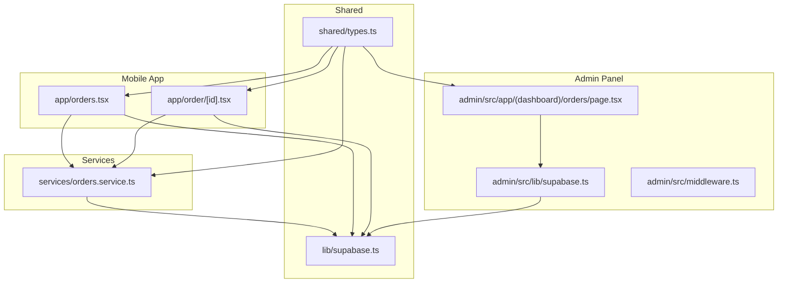
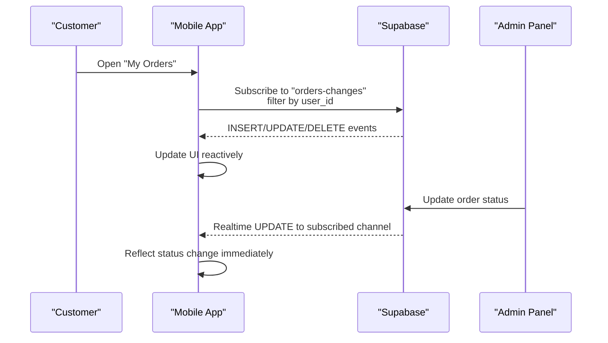
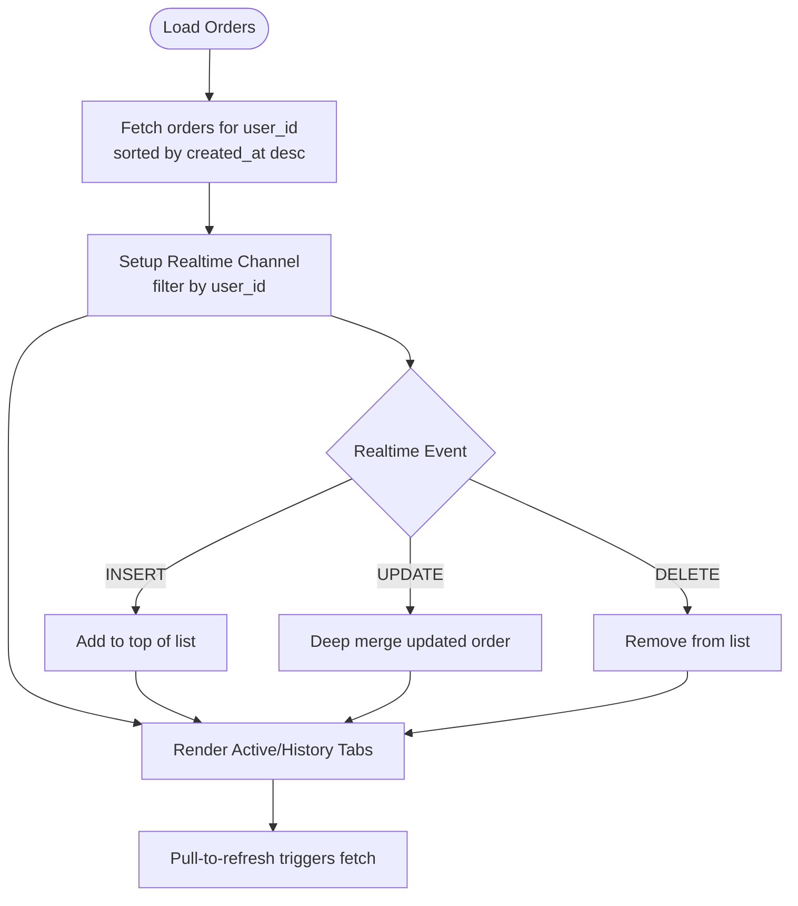
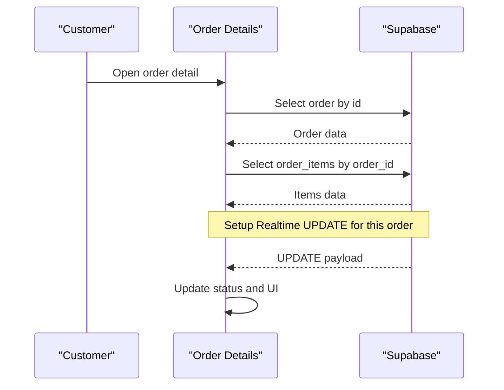
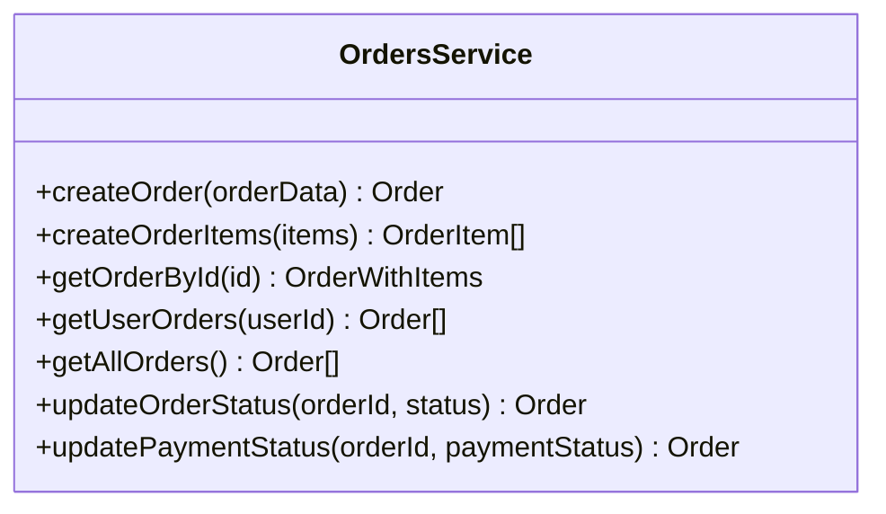
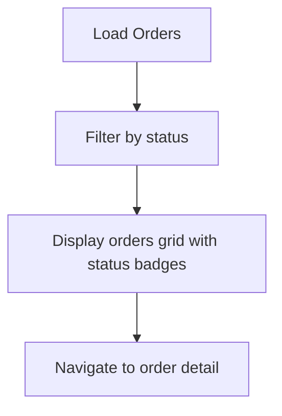
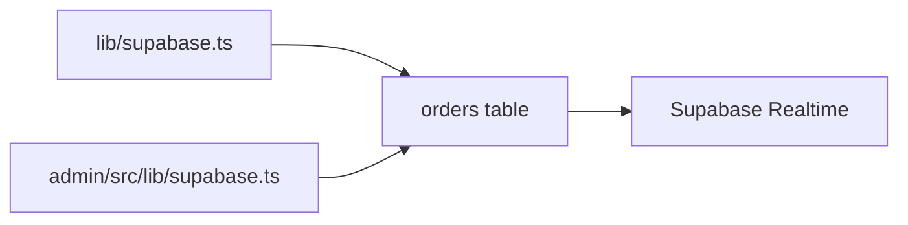
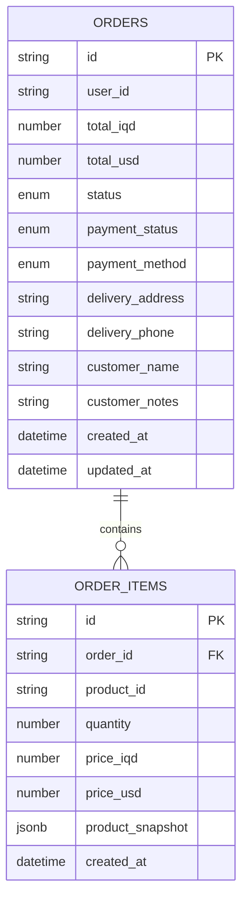
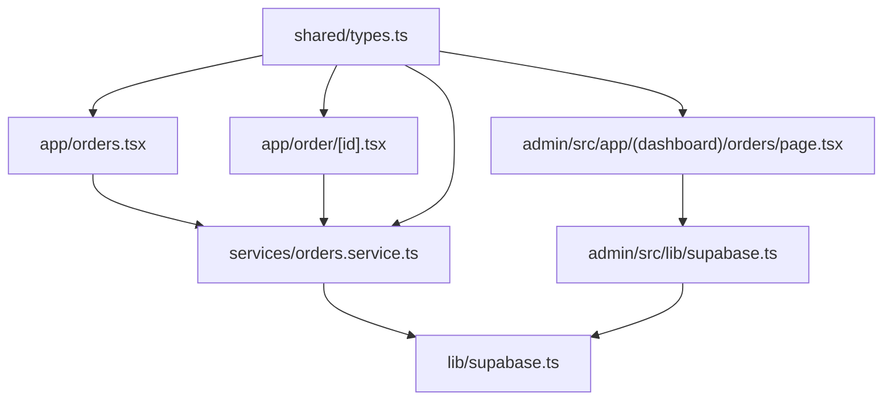

# Order Management

<cite>
**Referenced Files in This Document**
- [app/orders.tsx](file://app/orders.tsx)
- [app/order/[id].tsx](file://app/order/[id].tsx)
- [services/orders.service.ts](file://services/orders.service.ts)
- [lib/supabase.ts](file://lib/supabase.ts)
- [shared/types.ts](file://shared/types.ts)
- [.docs/ORDERS_REALTIME_SETUP.md](file://.docs/ORDERS_REALTIME_SETUP.md)
- [admin/src/lib/supabase.ts](file://admin/src/lib/supabase.ts)
- [admin/src/app/(dashboard)/orders/page.tsx](file://admin/src/app/(dashboard)/orders/page.tsx)
- [admin/src/middleware.ts](file://admin/src/middleware.ts)
- [types/index.ts](file://types/index.ts)
</cite>

## Table of Contents
1. [Introduction](#introduction)
2. [Project Structure](#project-structure)
3. [Core Components](#core-components)
4. [Architecture Overview](#architecture-overview)
5. [Detailed Component Analysis](#detailed-component-analysis)
6. [Dependency Analysis](#dependency-analysis)
7. [Performance Considerations](#performance-considerations)
8. [Troubleshooting Guide](#troubleshooting-guide)
9. [Conclusion](#conclusion)
10. [Appendices](#appendices)

## Introduction
This document explains the order management system across the mobile app, admin panel, and shared data model. It covers:
- Order listing with filtering and tabs
- Order detail view and cancellation
- Status management and real-time updates
- Admin order list and status filtering
- Shared types and Supabase integration
- Guidance for fulfillment, analytics, modifications, cancellations/refunds, archiving, compliance, and workflow optimization

## Project Structure
The order management spans three main areas:
- Mobile app screens for customer-facing order listing and details
- Services layer for database operations
- Admin dashboard for order management and status updates
- Shared types and Supabase clients for consistent typing and connectivity

**Diagram sources**
- [app/orders.tsx:1-516](file://app/orders.tsx#L1-L516)
- [app/order/[id].tsx:1-269](file://app/order/[id].tsx#L1-L269)
- [services/orders.service.ts:1-115](file://services/orders.service.ts#L1-L115)
- [lib/supabase.ts:1-30](file://lib/supabase.ts#L1-L30)
- [shared/types.ts:1-353](file://shared/types.ts#L1-L353)
- [admin/src/app/(dashboard)/orders/page.tsx:1-76](file://admin/src/app/(dashboard)/orders/page.tsx#L1-L76)
- [admin/src/lib/supabase.ts:1-24](file://admin/src/lib/supabase.ts#L1-L24)
- [admin/src/middleware.ts:1-122](file://admin/src/middleware.ts#L1-L122)

**Section sources**
- [app/orders.tsx:1-516](file://app/orders.tsx#L1-L516)
- [app/order/[id].tsx:1-269](file://app/order/[id].tsx#L1-L269)
- [services/orders.service.ts:1-115](file://services/orders.service.ts#L1-L115)
- [shared/types.ts:1-353](file://shared/types.ts#L1-L353)
- [admin/src/app/(dashboard)/orders/page.tsx:1-76](file://admin/src/app/(dashboard)/orders/page.tsx#L1-L76)
- [admin/src/lib/supabase.ts:1-24](file://admin/src/lib/supabase.ts#L1-L24)
- [admin/src/middleware.ts:1-122](file://admin/src/middleware.ts#L1-L122)

## Core Components
- Order listing screen with active/history tabs, pull-to-refresh, and real-time updates per user session
- Order detail screen with status, delivery info, items snapshot, totals, and cancellation flow
- Orders service providing typed CRUD and status update operations
- Shared types defining order schema, statuses, and filters
- Admin orders list with status filter and navigation to order detail
- Supabase clients for mobile and admin environments

**Section sources**
- [app/orders.tsx:28-118](file://app/orders.tsx#L28-L118)
- [app/order/[id].tsx:10-82](file://app/order/[id].tsx#L10-L82)
- [services/orders.service.ts:12-114](file://services/orders.service.ts#L12-L114)
- [shared/types.ts:49-86](file://shared/types.ts#L49-L86)
- [admin/src/app/(dashboard)/orders/page.tsx:11-31](file://admin/src/app/(dashboard)/orders/page.tsx#L11-L31)

## Architecture Overview
The system uses Supabase for data and real-time subscriptions:
- Mobile app subscribes to order changes scoped by user session
- Admin updates orders via Supabase client and policies
- Shared types ensure consistent typing across platforms
- Real-time requires Supabase publication and replica identity configured

**Diagram sources**
- [app/orders.tsx:43-85](file://app/orders.tsx#L43-L85)
- [app/order/[id].tsx:24-46](file://app/order/[id].tsx#L24-L46)
- [.docs/ORDERS_REALTIME_SETUP.md:18-37](file://.docs/ORDERS_REALTIME_SETUP.md#L18-L37)

## Detailed Component Analysis

### Order Listing Screen (Customer)
- Displays active vs history orders using a tabbed interface
- Pull-to-refresh to sync with backend
- Real-time subscription scoped to current user session
- Renders order summary cards with status, relative time, currency, and payment method
- Progress bar for active orders mapped to status steps

**Diagram sources**
- [app/orders.tsx:87-118](file://app/orders.tsx#L87-L118)
- [app/orders.tsx:43-85](file://app/orders.tsx#L43-L85)

**Section sources**
- [app/orders.tsx:28-118](file://app/orders.tsx#L28-L118)
- [app/orders.tsx:166-319](file://app/orders.tsx#L166-L319)

### Order Detail Screen (Customer)
- Loads order and associated items snapshots
- Real-time subscription for a specific order ID
- Cancellation allowed only when status is pending or confirmed
- Shows delivery info, items with product snapshot, and totals
- Includes a thank-you modal for newly placed orders

**Diagram sources**
- [app/order/[id].tsx:48-75](file://app/order/[id].tsx#L48-L75)
- [app/order/[id].tsx:24-46](file://app/order/[id].tsx#L24-L46)

**Section sources**
- [app/order/[id].tsx:10-124](file://app/order/[id].tsx#L10-L124)
- [app/order/[id].tsx:84-111](file://app/order/[id].tsx#L84-L111)

### Orders Service (Typed Operations)
- Provides typed functions for creating orders and items, fetching by ID, fetching user orders, fetching all orders, updating status, and updating payment status.

**Diagram sources**
- [services/orders.service.ts:12-114](file://services/orders.service.ts#L12-L114)

**Section sources**
- [services/orders.service.ts:12-114](file://services/orders.service.ts#L12-L114)

### Admin Orders List
- Fetches all orders and displays them with status badges
- Filters by status with a dropdown
- Links to order detail pages

**Diagram sources**
- [admin/src/app/(dashboard)/orders/page.tsx:20-31](file://admin/src/app/(dashboard)/orders/page.tsx#L20-L31)
- [admin/src/app/(dashboard)/orders/page.tsx:68-76](file://admin/src/app/(dashboard)/orders/page.tsx#L68-L76)

**Section sources**
- [admin/src/app/(dashboard)/orders/page.tsx:11-76](file://admin/src/app/(dashboard)/orders/page.tsx#L11-L76)

### Supabase Clients and Realtime Setup
- Mobile client configured with AsyncStorage for session persistence
- Admin client for SSR environment
- Realtime requires enabling publication and replica identity for the orders table
- Policies should restrict updates appropriately

**Diagram sources**
- [lib/supabase.ts:19-29](file://lib/supabase.ts#L19-L29)
- [admin/src/lib/supabase.ts:20-23](file://admin/src/lib/supabase.ts#L20-L23)
- [.docs/ORDERS_REALTIME_SETUP.md:18-37](file://.docs/ORDERS_REALTIME_SETUP.md#L18-L37)

**Section sources**
- [lib/supabase.ts:19-29](file://lib/supabase.ts#L19-L29)
- [admin/src/lib/supabase.ts:20-23](file://admin/src/lib/supabase.ts#L20-L23)
- [.docs/ORDERS_REALTIME_SETUP.md:18-37](file://.docs/ORDERS_REALTIME_SETUP.md#L18-L37)

### Shared Types and Filters
- Defines order schema, enums for status and payment method, and filters for querying
- Supports order-with-items composition and product snapshots

**Diagram sources**
- [shared/types.ts:49-86](file://shared/types.ts#L49-L86)
- [shared/types.ts:225-284](file://shared/types.ts#L225-L284)

**Section sources**
- [shared/types.ts:253-256](file://shared/types.ts#L253-L256)
- [shared/types.ts:347-352](file://shared/types.ts#L347-L352)

## Dependency Analysis
- Mobile screens depend on Supabase client and services
- Services encapsulate Supabase calls and expose typed functions
- Admin depends on its own Supabase client and middleware for auth and role-based routing
- Shared types unify contract across mobile, admin, and services

**Diagram sources**
- [app/orders.tsx:6](file://app/orders.tsx#L6)
- [app/order/[id].tsx:6](file://app/order/[id].tsx#L6)
- [services/orders.service.ts:6](file://services/orders.service.ts#L6)
- [lib/supabase.ts:1](file://lib/supabase.ts#L1)
- [admin/src/app/(dashboard)/orders/page.tsx:4](file://admin/src/app/(dashboard)/orders/page.tsx#L4)
- [admin/src/lib/supabase.ts:1](file://admin/src/lib/supabase.ts#L1)
- [shared/types.ts:6](file://shared/types.ts#L6)

**Section sources**
- [app/orders.tsx:6](file://app/orders.tsx#L6)
- [app/order/[id].tsx:6](file://app/order/[id].tsx#L6)
- [services/orders.service.ts:6](file://services/orders.service.ts#L6)
- [admin/src/app/(dashboard)/orders/page.tsx:4](file://admin/src/app/(dashboard)/orders/page.tsx#L4)
- [admin/src/lib/supabase.ts:1](file://admin/src/lib/supabase.ts#L1)
- [shared/types.ts:6](file://shared/types.ts#L6)

## Performance Considerations
- Use pull-to-refresh sparingly; rely on real-time updates to minimize redundant queries
- Keep order lists paginated in admin for large datasets
- Cache product snapshots locally where appropriate to reduce re-fetch overhead
- Monitor network requests and avoid unnecessary subscriptions when leaving screens

## Troubleshooting Guide
Common issues and resolutions:
- Realtime not updating:
  - Verify Supabase publication and replica identity are enabled for the orders table
  - Confirm RLS policy allows updates for authorized users
- Mobile not subscribing:
  - Ensure a valid session exists before subscribing
  - Check browser console for errors during subscription setup
- Admin updates failing:
  - Confirm admin is logged in with proper role
  - Validate Supabase environment variables and policies

**Section sources**
- [.docs/ORDERS_REALTIME_SETUP.md:18-66](file://.docs/ORDERS_REALTIME_SETUP.md#L18-L66)
- [app/orders.tsx:43-85](file://app/orders.tsx#L43-L85)
- [admin/src/middleware.ts:57-105](file://admin/src/middleware.ts#L57-L105)

## Conclusion
The order management system integrates a customer-facing mobile app with real-time updates, an admin dashboard for order oversight, and a typed services layer backed by Supabase. By adhering to the shared types, configuring Supabase real-time correctly, and leveraging the provided services, teams can maintain a robust, scalable order lifecycle.

## Appendices

### Order Status Lifecycle
- Pending → Confirmed → Preparing → Ready → Delivered
- Cancelled is terminal

**Section sources**
- [app/orders.tsx:11](file://app/orders.tsx#L11)
- [shared/types.ts:253](file://shared/types.ts#L253)

### Filtering and Search
- Customer filters: status, payment status, date range
- Admin filters: status
- Use the shared filter types to construct queries consistently

**Section sources**
- [shared/types.ts:347-352](file://shared/types.ts#L347-L352)
- [admin/src/app/(dashboard)/orders/page.tsx:14](file://admin/src/app/(dashboard)/orders/page.tsx#L14)

### Real-time Setup Checklist
- Enable Realtime on the orders table
- Set replica identity to FULL
- Configure RLS policy for updates (preferably admin-only)
- Verify environment variables in admin

**Section sources**
- [.docs/ORDERS_REALTIME_SETUP.md:18-66](file://.docs/ORDERS_REALTIME_SETUP.md#L18-L66)