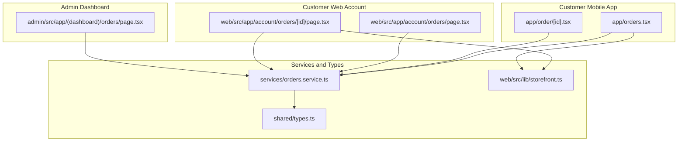
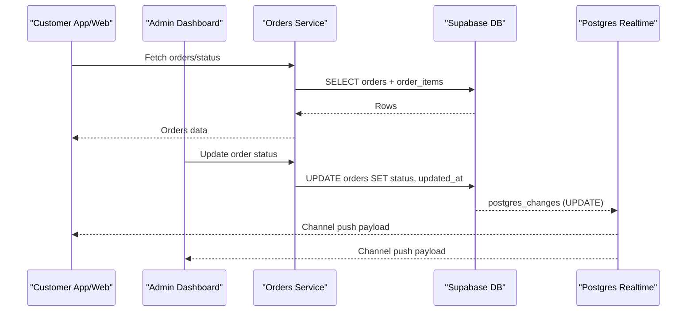
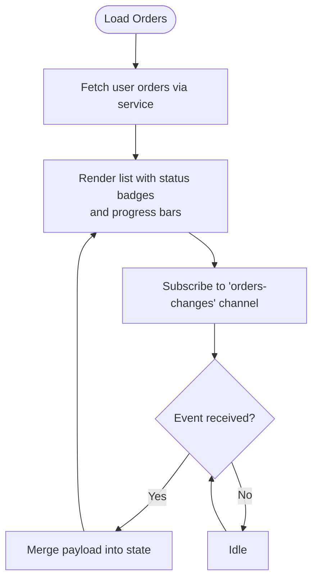
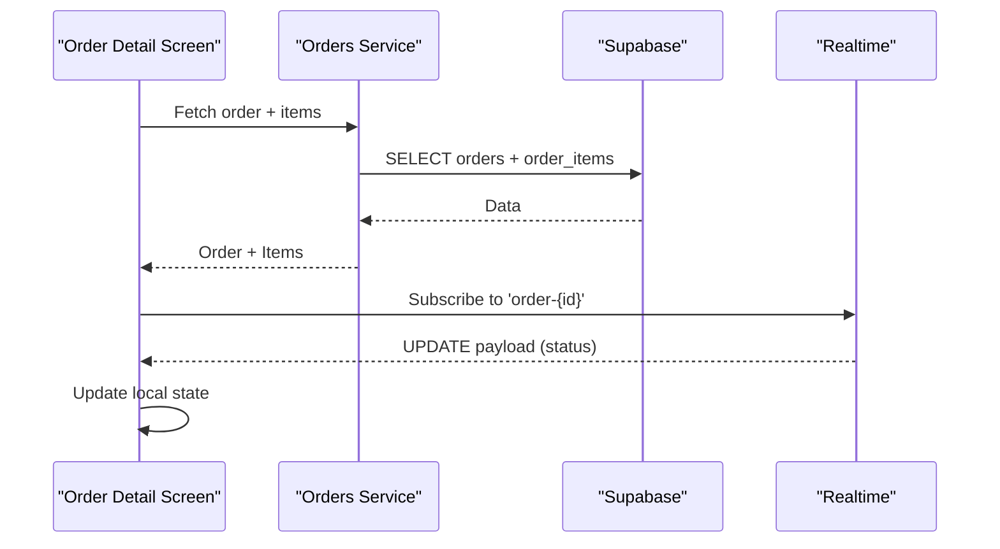
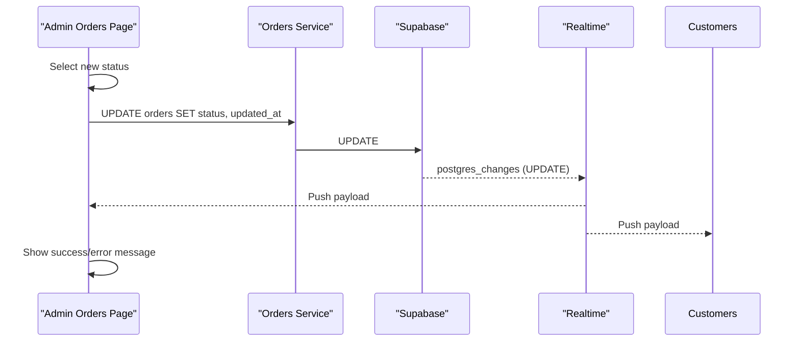
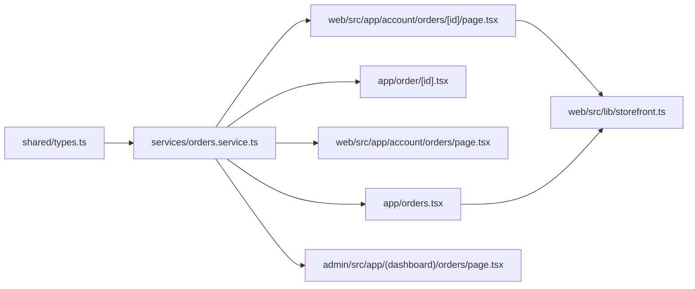

# Order Status Management

<cite>
**Referenced Files in This Document**
- [app/orders.tsx](file://app/orders.tsx)
- [app/order/[id].tsx](file://app/order/[id].tsx)
- [web/src/app/account/orders/page.tsx](file://web/src/app/account/orders/page.tsx)
- [web/src/app/account/orders/[id]/page.tsx](file://web/src/app/account/orders/[id]/page.tsx)
- [admin/src/app/(dashboard)/orders/page.tsx](file://admin/src/app/(dashboard)/orders/page.tsx)
- [services/orders.service.ts](file://services/orders.service.ts)
- [shared/types.ts](file://shared/types.ts)
- [web/src/lib/storefront.ts](file://web/src/lib/storefront.ts)
- [locales/en.json](file://locales/en.json)
- [locales/ar.json](file://locales/ar.json)
</cite>

## Table of Contents
1. [Introduction](#introduction)
2. [Project Structure](#project-structure)
3. [Core Components](#core-components)
4. [Architecture Overview](#architecture-overview)
5. [Detailed Component Analysis](#detailed-component-analysis)
6. [Dependency Analysis](#dependency-analysis)
7. [Performance Considerations](#performance-considerations)
8. [Troubleshooting Guide](#troubleshooting-guide)
9. [Conclusion](#conclusion)

## Introduction
This document explains the order status management workflow across the mobile app, web dashboard, and admin panel. It covers the complete order lifecycle from Pending through Delivered, cancellation and return policies, status transitions, real-time updates, status badges, and customer notifications. It also documents the status update interface, timestamp recording, and the integration points with Supabase for persistence and real-time synchronization.

## Project Structure
The order status system spans three primary surfaces:
- Customer mobile app: lists orders, shows progress, and supports cancellation.
- Customer web account: displays order history and detailed status steps.
- Admin dashboard: filters and updates order statuses.

**Diagram sources**
- [app/orders.tsx:1-516](file://app/orders.tsx#L1-516)
- [app/order/[id].tsx](file://app/order/[id].tsx#L1-269)
- [web/src/app/account/orders/page.tsx:1-103](file://web/src/app/account/orders/page.tsx#L1-103)
- [web/src/app/account/orders/[id]/page.tsx](file://web/src/app/account/orders/[id]/page.tsx#L1-189)
- [admin/src/app/(dashboard)/orders/page.tsx](file://admin/src/app/(dashboard)/orders/page.tsx#L1-173)
- [services/orders.service.ts:1-115](file://services/orders.service.ts#L1-115)
- [shared/types.ts:49-72](file://shared/types.ts#L49-72)
- [web/src/lib/storefront.ts:18-24](file://web/src/lib/storefront.ts#L18-24)

**Section sources**
- [app/orders.tsx:1-516](file://app/orders.tsx#L1-516)
- [app/order/[id].tsx](file://app/order/[id].tsx#L1-269)
- [web/src/app/account/orders/page.tsx:1-103](file://web/src/app/account/orders/page.tsx#L1-103)
- [web/src/app/account/orders/[id]/page.tsx](file://web/src/app/account/orders/[id]/page.tsx#L1-189)
- [admin/src/app/(dashboard)/orders/page.tsx](file://admin/src/app/(dashboard)/orders/page.tsx#L1-173)
- [services/orders.service.ts:1-115](file://services/orders.service.ts#L1-115)
- [shared/types.ts:49-72](file://shared/types.ts#L49-72)
- [web/src/lib/storefront.ts:18-24](file://web/src/lib/storefront.ts#L18-24)

## Core Components
- Order lifecycle and statuses: The system defines six statuses—pending, confirmed, preparing, ready, delivered, and cancelled. These are used consistently across screens and services.
- Real-time updates: Supabase real-time subscriptions keep order lists and details up to date without manual refresh.
- Status update interface: Admin dashboard exposes a selector to change order status with optimistic UI updates and rollback on errors.
- Status badges and icons: Color-coded badges and icons represent each status visually for both admin and customer views.
- Cancellation policy: The customer can cancel during Pending or Confirmed; the system sets status to Cancelled.
- Status history and steps: The web order detail page shows a step-by-step progression aligned with ORDER_STATUS_STEPS.

**Section sources**
- [shared/types.ts:253-256](file://shared/types.ts#L253-256)
- [app/orders.tsx:11-129](file://app/orders.tsx#L11-129)
- [admin/src/app/(dashboard)/orders/page.tsx](file://admin/src/app/(dashboard)/orders/page.tsx#L32-42)
- [app/order/[id].tsx](file://app/order/[id].tsx#L82-111)
- [web/src/lib/storefront.ts:18-24](file://web/src/lib/storefront.ts#L18-24)
- [web/src/app/account/orders/[id]/page.tsx](file://web/src/app/account/orders/[id]/page.tsx#L72-96)

## Architecture Overview
The order status management architecture centers on Supabase for data and real-time events, with services abstracting database operations and UI layers rendering status states and enabling updates.

**Diagram sources**
- [services/orders.service.ts:56-114](file://services/orders.service.ts#L56-114)
- [app/orders.tsx:43-84](file://app/orders.tsx#L43-84)
- [app/order/[id].tsx](file://app/order/[id].tsx#L24-46)
- [admin/src/app/(dashboard)/orders/page.tsx](file://admin/src/app/(dashboard)/orders/page.tsx#L95-130)

## Detailed Component Analysis

### Customer Mobile Orders List
- Displays active vs history tabs and filters orders accordingly.
- Shows status badges with color and icon mapping.
- Progress bar reflects current step in the lifecycle.
- Real-time subscription updates list entries on changes.

**Diagram sources**
- [app/orders.tsx:38-85](file://app/orders.tsx#L38-85)
- [services/orders.service.ts:56-65](file://services/orders.service.ts#L56-65)

**Section sources**
- [app/orders.tsx:11-169](file://app/orders.tsx#L11-169)
- [services/orders.service.ts:56-65](file://services/orders.service.ts#L56-65)

### Customer Mobile Order Detail
- Shows current status, order date, delivery info, items, totals.
- Supports cancellation when status is Pending or Confirmed.
- Real-time subscription for a specific order channel.

**Diagram sources**
- [app/order/[id].tsx](file://app/order/[id].tsx#L48-80)
- [app/order/[id].tsx](file://app/order/[id].tsx#L24-46)

**Section sources**
- [app/order/[id].tsx](file://app/order/[id].tsx#L82-111)
- [app/order/[id].tsx](file://app/order/[id].tsx#L168-240)

### Web Orders List
- Server-rendered page showing order summaries with status labels.
- Uses storefront helpers to localize and format status labels.

**Section sources**
- [web/src/app/account/orders/page.tsx:14-99](file://web/src/app/account/orders/page.tsx#L14-99)
- [web/src/lib/storefront.ts:598-612](file://web/src/lib/storefront.ts#L598-612)

### Web Order Detail
- Displays a step-by-step status visualization aligned with ORDER_STATUS_STEPS.
- Shows items, totals, delivery address, and localized labels.

**Section sources**
- [web/src/app/account/orders/[id]/page.tsx](file://web/src/app/account/orders/[id]/page.tsx#L72-96)
- [web/src/lib/storefront.ts:18-24](file://web/src/lib/storefront.ts#L18-24)

### Admin Orders Management
- Lists all orders with filtering by status.
- Provides a dropdown to update status with optimistic UI and error handling.
- Renders status badges with icons and colors.

**Diagram sources**
- [admin/src/app/(dashboard)/orders/page.tsx](file://admin/src/app/(dashboard)/orders/page.tsx#L95-130)
- [services/orders.service.ts:83-96](file://services/orders.service.ts#L83-96)

**Section sources**
- [admin/src/app/(dashboard)/orders/page.tsx](file://admin/src/app/(dashboard)/orders/page.tsx#L32-42)
- [admin/src/app/(dashboard)/orders/page.tsx](file://admin/src/app/(dashboard)/orders/page.tsx#L95-130)

### Status Update Interface and Validation Rules
- Allowed transitions: The system defines a fixed lifecycle. Transitions are driven by business rules:
  - Pending → Confirmed → Preparing → Ready → Delivered
  - Pending/Confirmed can transition to Cancelled
- Validation:
  - Cancellation is permitted only when status is Pending or Confirmed.
  - Status updates are persisted atomically with updated_at timestamp.
- Real-time propagation: Updates are broadcast via Supabase Postgres changes to all clients subscribed to the relevant channels.

**Section sources**
- [shared/types.ts:253-256](file://shared/types.ts#L253-256)
- [app/order/[id].tsx](file://app/order/[id].tsx#L82-111)
- [services/orders.service.ts:83-96](file://services/orders.service.ts#L83-96)
- [app/orders.tsx:43-84](file://app/orders.tsx#L43-84)
- [app/order/[id].tsx](file://app/order/[id].tsx#L24-46)

### Status Badge System and Icons
- Color coding and icons are mapped per status for both customer and admin experiences.
- Admin uses Lucide icons inside colored badges.
- Customer screens use inline styles and Ionicons for status indicators.

**Section sources**
- [app/orders.tsx:119-129](file://app/orders.tsx#L119-129)
- [admin/src/app/(dashboard)/orders/page.tsx](file://admin/src/app/(dashboard)/orders/page.tsx#L32-42)

### Tracking Number Assignment and Shipping Provider Integration
- The codebase does not define a tracking number field or shipping provider integration endpoint.
- No UI or service methods exist for assigning tracking numbers or integrating with carriers.
- Recommendation: Introduce a tracking_number column in the orders table and add a service method to update it alongside status transitions.

[No sources needed since this section summarizes absence of implementation]

### Customer Notification System (Email/SMS)
- The codebase does not implement email or SMS triggers for status changes.
- Notifications are represented in the database schema but no handlers or integrations are present in the frontend or backend code shown.
- Recommendation: Implement serverless functions or external services to trigger notifications on status updates.

**Section sources**
- [shared/types.ts:185-199](file://shared/types.ts#L185-199)

### Status History and Audit Trail
- The orders table includes created_at and updated_at timestamps.
- The admin page demonstrates optimistic updates and rollback on errors, indicating awareness of audit semantics.
- Recommendation: Persist a dedicated order_status_history table to capture all transitions with timestamps and actors for compliance.

**Section sources**
- [shared/types.ts:49-69](file://shared/types.ts#L49-69)
- [admin/src/app/(dashboard)/orders/page.tsx](file://admin/src/app/(dashboard)/orders/page.tsx#L95-130)

### Common Scenarios and Workflows
- Cancellations:
  - Customer: Cancel button appears when status is Pending or Confirmed; clicking triggers an update to Cancelled.
  - Admin: Can set status to Cancelled directly.
- Returns:
  - The repository does not include return workflows or return status in the order lifecycle.
  - Recommendation: Define a returns module and add a return_status enum to orders.
- Delays:
  - The system does not model delay reasons or SLA tracking.
  - Recommendation: Add delay_reason and estimated_delivery fields to orders.

**Section sources**
- [app/order/[id].tsx](file://app/order/[id].tsx#L82-111)
- [shared/types.ts:253-256](file://shared/types.ts#L253-256)

## Dependency Analysis

**Diagram sources**
- [shared/types.ts:253-256](file://shared/types.ts#L253-256)
- [services/orders.service.ts:1-115](file://services/orders.service.ts#L1-115)
- [app/orders.tsx:1-516](file://app/orders.tsx#L1-516)
- [app/order/[id].tsx](file://app/order/[id].tsx#L1-269)
- [web/src/app/account/orders/page.tsx:1-103](file://web/src/app/account/orders/page.tsx#L1-103)
- [web/src/app/account/orders/[id]/page.tsx](file://web/src/app/account/orders/[id]/page.tsx#L1-189)
- [admin/src/app/(dashboard)/orders/page.tsx](file://admin/src/app/(dashboard)/orders/page.tsx#L1-173)
- [web/src/lib/storefront.ts:18-24](file://web/src/lib/storefront.ts#L18-24)

**Section sources**
- [shared/types.ts:49-72](file://shared/types.ts#L49-72)
- [services/orders.service.ts:1-115](file://services/orders.service.ts#L1-115)

## Performance Considerations
- Real-time subscriptions reduce polling overhead; ensure proper cleanup to avoid leaks.
- Batch queries (orders + order_items) minimize round-trips in detail views.
- Client-side optimistic updates improve perceived responsiveness; revert on errors to maintain consistency.

[No sources needed since this section provides general guidance]

## Troubleshooting Guide
- Status not updating:
  - Verify Supabase channel subscriptions are active and not disposed prematurely.
  - Confirm service update calls succeed and updated_at is being set.
- Real-time not syncing:
  - Check channel filters and user permissions for order visibility.
  - Ensure postgres_changes rules match the intended filters.
- Cancellation errors:
  - Validate cancellation eligibility (Pending/Confirmed).
  - Inspect error messages returned by the update operation.

**Section sources**
- [app/orders.tsx:43-84](file://app/orders.tsx#L43-84)
- [app/order/[id].tsx](file://app/order/[id].tsx#L24-46)
- [admin/src/app/(dashboard)/orders/page.tsx](file://admin/src/app/(dashboard)/orders/page.tsx#L95-130)
- [services/orders.service.ts:83-96](file://services/orders.service.ts#L83-96)

## Conclusion
The order status management system provides a robust foundation with real-time updates, consistent status definitions, and clear UI representations. To enhance operational excellence, consider adding tracking number assignment, shipping provider integration, customer notifications, a dedicated status history audit trail, and explicit workflows for cancellations, returns, and delays.