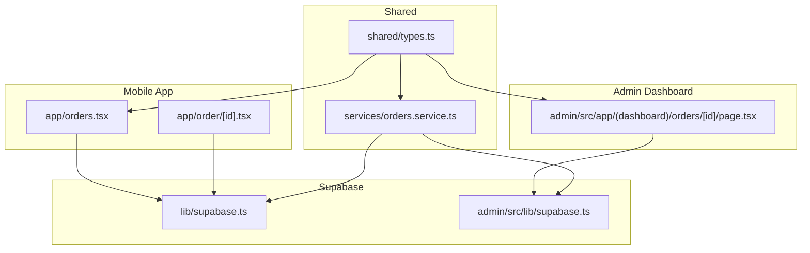
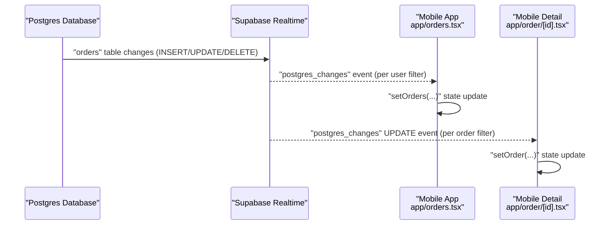
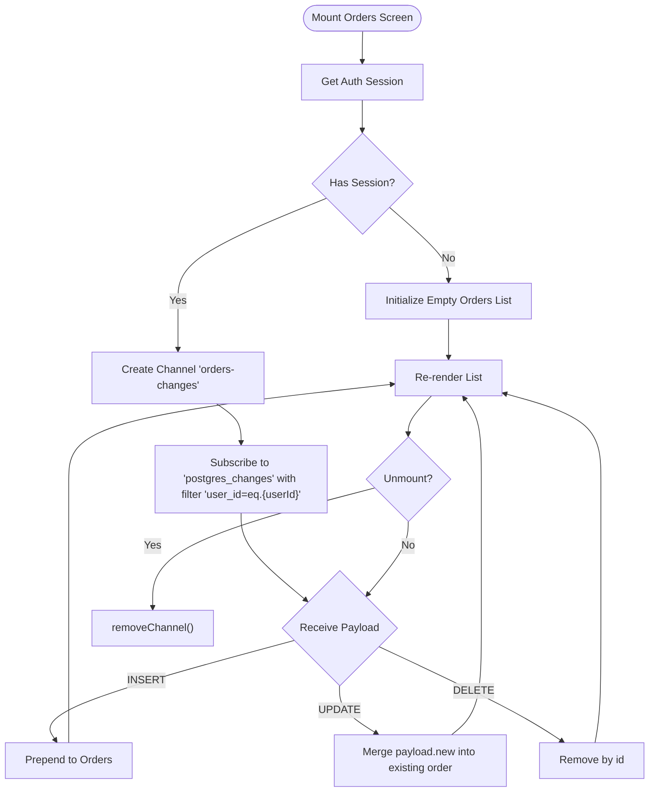
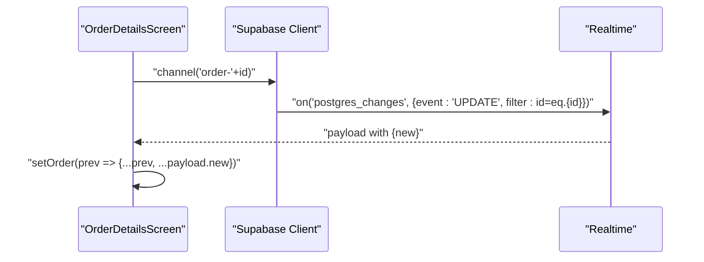
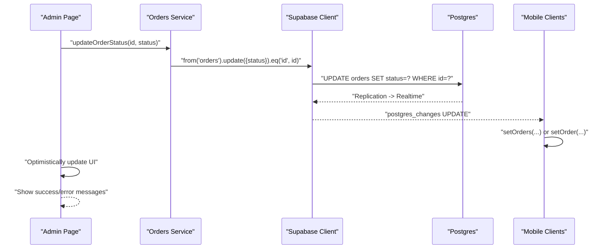
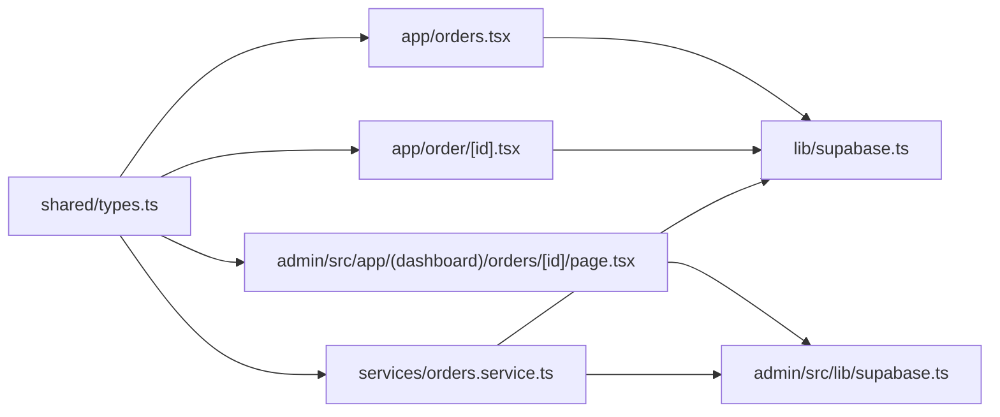

# Real-time Order Tracking

<cite>
**Referenced Files in This Document**
- [lib/supabase.ts](file://lib/supabase.ts)
- [admin/src/lib/supabase.ts](file://admin/src/lib/supabase.ts)
- [app/orders.tsx](file://app/orders.tsx)
- [app/order/[id].tsx](file://app/order/[id].tsx)
- [admin/src/app/(dashboard)/orders/[id]/page.tsx](file://admin/src/app/(dashboard)/orders/[id]/page.tsx)
- [services/orders.service.ts](file://services/orders.service.ts)
- [shared/types.ts](file://shared/types.ts)
- [.docs/ORDERS_REALTIME_SETUP.md](file://.docs/ORDERS_REALTIME_SETUP.md)
- [package.json](file://package.json)
</cite>

## Table of Contents
1. [Introduction](#introduction)
2. [Project Structure](#project-structure)
3. [Core Components](#core-components)
4. [Architecture Overview](#architecture-overview)
5. [Detailed Component Analysis](#detailed-component-analysis)
6. [Dependency Analysis](#dependency-analysis)
7. [Performance Considerations](#performance-considerations)
8. [Troubleshooting Guide](#troubleshooting-guide)
9. [Conclusion](#conclusion)
10. [Appendices](#appendices)

## Introduction
This document explains the real-time order tracking system built on Supabase’s Postgres Realtime. It covers how the mobile app subscribes to order changes, how the admin dashboard updates order statuses, and how the UI reflects live updates. It also documents configuration requirements, connection management, error handling, performance considerations, and best practices for scaling real-time subscriptions.

## Project Structure
The real-time order tracking spans three primary areas:
- Mobile client: subscribes to order changes per user and displays live updates.
- Admin dashboard: allows administrators to update order statuses and see immediate UI feedback.
- Shared types and services: define order-related data contracts and service functions used across the system.

**Diagram sources**
- [app/orders.tsx:28-85](file://app/orders.tsx#L28-L85)
- [app/order/[id].tsx](file://app/order/[id].tsx#L10-L46)
- [admin/src/app/(dashboard)/orders/[id]/page.tsx](file://admin/src/app/(dashboard)/orders/[id]/page.tsx#L14-L135)
- [lib/supabase.ts:1-30](file://lib/supabase.ts#L1-L30)
- [admin/src/lib/supabase.ts:1-24](file://admin/src/lib/supabase.ts#L1-L24)
- [services/orders.service.ts:1-115](file://services/orders.service.ts#L1-L115)
- [shared/types.ts:49-72](file://shared/types.ts#L49-L72)

**Section sources**
- [app/orders.tsx:28-85](file://app/orders.tsx#L28-L85)
- [app/order/[id].tsx](file://app/order/[id].tsx#L10-L46)
- [admin/src/app/(dashboard)/orders/[id]/page.tsx](file://admin/src/app/(dashboard)/orders/[id]/page.tsx#L14-L135)
- [lib/supabase.ts:1-30](file://lib/supabase.ts#L1-L30)
- [admin/src/lib/supabase.ts:1-24](file://admin/src/lib/supabase.ts#L1-L24)
- [services/orders.service.ts:1-115](file://services/orders.service.ts#L1-L115)
- [shared/types.ts:49-72](file://shared/types.ts#L49-L72)

## Core Components
- Supabase clients:
  - Mobile client configured with AsyncStorage for auth persistence.
  - Admin browser client configured for SSR.
- Real-time subscriptions:
  - Mobile orders list: listens to INSERT/UPDATE/DELETE events scoped to the logged-in user.
  - Mobile order detail: listens to UPDATE events for a specific order.
  - Admin order detail: updates order status via service calls and optimistically updates UI.
- Services:
  - Centralized order operations (create, update status, update payment status) used by both mobile and admin.
- Shared types:
  - Strongly typed order, order item, and related enums used across components and services.

**Section sources**
- [lib/supabase.ts:1-30](file://lib/supabase.ts#L1-L30)
- [admin/src/lib/supabase.ts:1-24](file://admin/src/lib/supabase.ts#L1-L24)
- [app/orders.tsx:43-85](file://app/orders.tsx#L43-L85)
- [app/order/[id].tsx](file://app/order/[id].tsx#L24-L46)
- [admin/src/app/(dashboard)/orders/[id]/page.tsx](file://admin/src/app/(dashboard)/orders/[id]/page.tsx#L95-L135)
- [services/orders.service.ts:1-115](file://services/orders.service.ts#L1-L115)
- [shared/types.ts:253-256](file://shared/types.ts#L253-L256)

## Architecture Overview
The system uses Supabase Postgres Realtime to push database changes to subscribed clients. The mobile app subscribes per user and per order to reflect immediate updates without polling. The admin panel updates order records and relies on optimistic UI updates and real-time subscriptions to keep the mobile app synchronized.

**Diagram sources**
- [app/orders.tsx:47-75](file://app/orders.tsx#L47-L75)
- [app/order/[id].tsx](file://app/order/[id].tsx#L25-L40)

## Detailed Component Analysis

### Mobile Orders List Real-time Subscription
- Channel: orders-changes
- Event: postgres_changes
- Filters: schema=public, table=orders, filter=user_id=eq.{current_user_id}
- Behavior:
  - INSERT: prepend new order to top of list
  - UPDATE: merge latest payload into existing order
  - DELETE: remove order from list
- Lifecycle:
  - Setup on mount after retrieving session
  - Cleanup removes channel on unmount

**Diagram sources**
- [app/orders.tsx:38-85](file://app/orders.tsx#L38-L85)

**Section sources**
- [app/orders.tsx:43-85](file://app/orders.tsx#L43-L85)

### Mobile Order Detail Real-time Subscription
- Channel: order-{id}
- Event: postgres_changes
- Filters: schema=public, table=orders, filter=id=eq.{orderId}
- Behavior:
  - UPDATE: shallow merge payload.new into current order state
- Lifecycle:
  - Setup on id change
  - Cleanup removes channel on unmount

**Diagram sources**
- [app/order/[id].tsx](file://app/order/[id].tsx#L24-L46)

**Section sources**
- [app/order/[id].tsx](file://app/order/[id].tsx#L24-L46)

### Admin Order Update Flow
- The admin updates order status via a service call and optimistically updates the UI.
- Real-time subscriptions ensure the mobile app receives updates immediately.
- The admin page also fetches order details and items on mount.

**Diagram sources**
- [admin/src/app/(dashboard)/orders/[id]/page.tsx](file://admin/src/app/(dashboard)/orders/[id]/page.tsx#L95-L135)
- [services/orders.service.ts:83-96](file://services/orders.service.ts#L83-L96)
- [app/orders.tsx:60-72](file://app/orders.tsx#L60-L72)
- [app/order/[id].tsx](file://app/order/[id].tsx#L35-L38)

**Section sources**
- [admin/src/app/(dashboard)/orders/[id]/page.tsx](file://admin/src/app/(dashboard)/orders/[id]/page.tsx#L95-L135)
- [services/orders.service.ts:83-96](file://services/orders.service.ts#L83-L96)

### Supabase Client Configuration
- Mobile client:
  - Uses AsyncStorage for auth persistence and enables auto-refresh and token persistence.
- Admin client:
  - Uses SSR client for browser environments.

**Section sources**
- [lib/supabase.ts:18-29](file://lib/supabase.ts#L18-L29)
- [admin/src/lib/supabase.ts:19-23](file://admin/src/lib/supabase.ts#L19-L23)

### Shared Types and Enums
- OrderStatus: pending, confirmed, preparing, ready, delivered, cancelled
- PaymentMethod: cash, card, cod
- PaymentStatus: pending, paid, failed, awaiting_payment
- DeliveryType: scheduled, express, electronics
- These types are used across components and services to maintain consistency.

**Section sources**
- [shared/types.ts:253-256](file://shared/types.ts#L253-L256)

## Dependency Analysis
- Mobile app depends on:
  - Supabase client for auth and real-time
  - Local service functions for order operations
  - Shared types for type safety
- Admin dashboard depends on:
  - Supabase SSR client
  - Orders service for updates
  - Shared types for UI rendering and typing
- Real-time depends on:
  - Supabase publication and replica identity configuration
  - Proper RLS policies to allow updates

**Diagram sources**
- [app/orders.tsx](file://app/orders.tsx#L6)
- [app/order/[id].tsx](file://app/order/[id].tsx#L6)
- [admin/src/app/(dashboard)/orders/[id]/page.tsx](file://admin/src/app/(dashboard)/orders/[id]/page.tsx#L5)
- [lib/supabase.ts:1-30](file://lib/supabase.ts#L1-L30)
- [admin/src/lib/supabase.ts:1-24](file://admin/src/lib/supabase.ts#L1-L24)
- [services/orders.service.ts:6-7](file://services/orders.service.ts#L6-L7)
- [shared/types.ts:253-256](file://shared/types.ts#L253-L256)

**Section sources**
- [app/orders.tsx](file://app/orders.tsx#L6)
- [app/order/[id].tsx](file://app/order/[id].tsx#L6)
- [admin/src/app/(dashboard)/orders/[id]/page.tsx](file://admin/src/app/(dashboard)/orders/[id]/page.tsx#L5)
- [lib/supabase.ts:1-30](file://lib/supabase.ts#L1-L30)
- [admin/src/lib/supabase.ts:1-24](file://admin/src/lib/supabase.ts#L1-L24)
- [services/orders.service.ts:6-7](file://services/orders.service.ts#L6-L7)
- [shared/types.ts:253-256](file://shared/types.ts#L253-L256)

## Performance Considerations
- Minimize payload size:
  - Use targeted SELECT queries and filters to reduce data transfer.
- Efficient state updates:
  - Prefer immutable updates and shallow merges to avoid unnecessary re-renders.
- Optimize subscriptions:
  - Scope filters tightly (user_id per user, id per order) to reduce event volume.
- Batch updates:
  - Avoid frequent updates by debouncing UI actions where appropriate.
- Connection lifecycle:
  - Ensure channels are removed on unmount to prevent leaks.
- Scaling:
  - Monitor Supabase Realtime limits and consider partitioning by tenant or region if needed.
  - Use pagination and virtualized lists for large datasets.

[No sources needed since this section provides general guidance]

## Troubleshooting Guide
Common issues and resolutions:
- Realtime not receiving updates:
  - Verify Supabase Realtime is enabled on the orders table and publication includes orders.
  - Ensure replica identity is set to FULL for complete row data replication.
- Authentication issues:
  - Confirm the user is logged in and session is present before subscribing.
  - For admin updates, ensure the user has the admin role.
- RLS policy conflicts:
  - Ensure an appropriate policy exists for updates (preferably role-based).
- Environment variables:
  - Confirm NEXT_PUBLIC_SUPABASE_URL and NEXT_PUBLIC_SUPABASE_ANON_KEY are set in the admin app.
- Testing:
  - After changing an order status in the admin, confirm the mobile app reflects the change without manual refresh.

**Section sources**
- [.docs/ORDERS_REALTIME_SETUP.md:18-99](file://.docs/ORDERS_REALTIME_SETUP.md#L18-L99)

## Conclusion
The real-time order tracking system leverages Supabase Postgres Realtime to deliver immediate updates to both the mobile app and admin dashboard. By scoping subscriptions per user and per order, the system ensures efficient, secure, and responsive updates. Proper configuration of Supabase, RLS policies, and client-side lifecycle management are essential for reliable operation.

[No sources needed since this section summarizes without analyzing specific files]

## Appendices

### Supabase Realtime Setup Checklist
- Enable Realtime on the orders table.
- Set replica identity to FULL.
- Configure RLS policies to allow updates (preferably admin-only).
- Verify environment variables for the admin app.
- Test end-to-end: admin updates → optimistic UI + real-time sync → mobile reflects changes.

**Section sources**
- [.docs/ORDERS_REALTIME_SETUP.md:18-76](file://.docs/ORDERS_REALTIME_SETUP.md#L18-L76)

### Dependencies and Versions
- Supabase JS SDK used in both mobile and admin apps.

**Section sources**
- [package.json](file://package.json#L18)