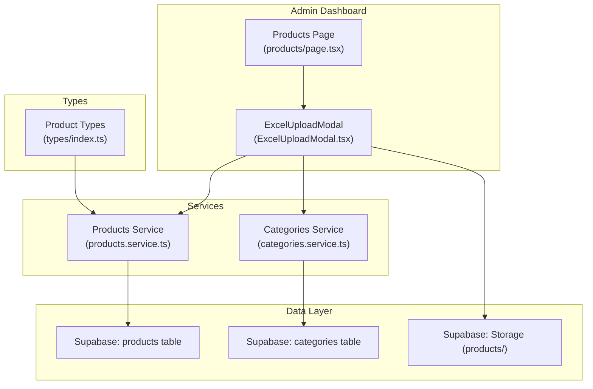
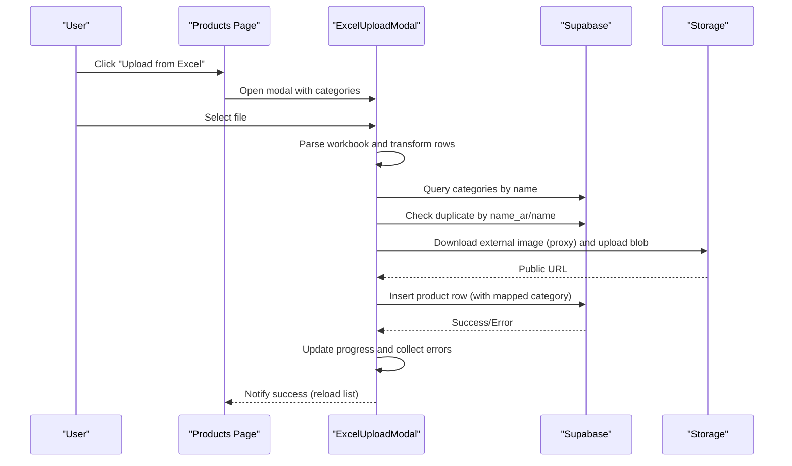
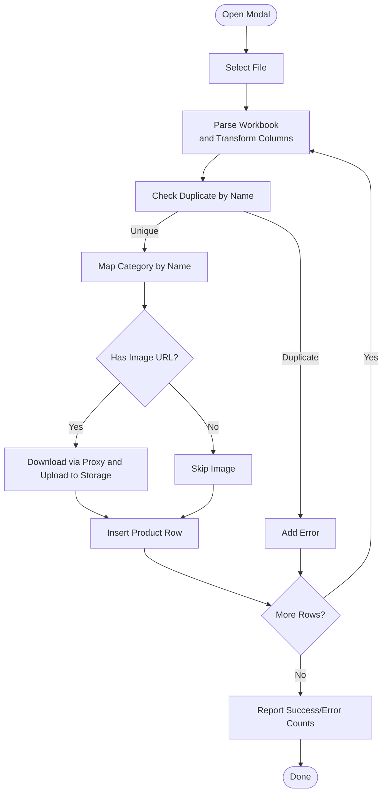
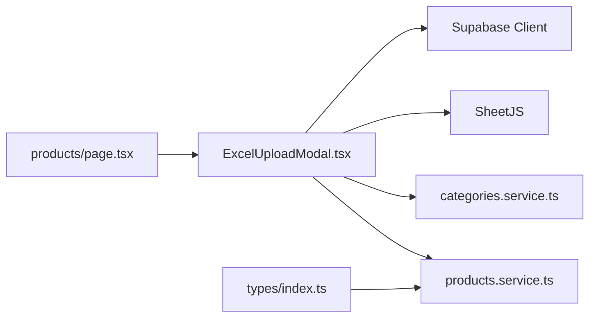

# Bulk Operations and Excel Upload

<cite>
**Referenced Files in This Document**
- [ExcelUploadModal.tsx](file://admin/src/components/products/ExcelUploadModal.tsx)
- [products/page.tsx](file://admin/src/app/(dashboard)/products/page.tsx)
- [products.service.ts](file://services/products.service.ts)
- [categories.service.ts](file://services/categories.service.ts)
- [types/index.ts](file://types/index.ts)
- [CheckoutFlow.tsx](file://web/src/components/checkout/CheckoutFlow.tsx)
- [utils.ts](file://admin/src/lib/utils.ts)
</cite>

## Table of Contents
1. [Introduction](#introduction)
2. [Project Structure](#project-structure)
3. [Core Components](#core-components)
4. [Architecture Overview](#architecture-overview)
5. [Detailed Component Analysis](#detailed-component-analysis)
6. [Dependency Analysis](#dependency-analysis)
7. [Performance Considerations](#performance-considerations)
8. [Troubleshooting Guide](#troubleshooting-guide)
9. [Conclusion](#conclusion)
10. [Appendices](#appendices)

## Introduction
This document explains the bulk product operations and Excel upload functionality implemented in the admin dashboard. It covers the Excel/CSV upload modal, file parsing and validation, data transformation, category mapping, duplicate detection, image processing, and the batch insertion workflow. It also documents the current error handling and progress reporting, and provides guidance for extending the system to support advanced batch operations such as mass activation/deactivation, price updates, and inventory adjustments.

## Project Structure
The bulk upload feature centers around a dedicated modal component integrated into the Products dashboard. The modal parses spreadsheets, validates and transforms data, maps categories, checks for duplicates, downloads and stores images via Supabase Storage, and inserts records into the database. Supporting services and types define the product schema and category retrieval.

**Diagram sources**
- [products/page.tsx:126-161](file://admin/src/app/(dashboard)/products/page.tsx#L126-L161)
- [ExcelUploadModal.tsx:177-255](file://admin/src/components/products/ExcelUploadModal.tsx#L177-L255)
- [products.service.ts:18-42](file://services/products.service.ts#L18-L42)
- [categories.service.ts:12-21](file://services/categories.service.ts#L12-L21)
- [types/index.ts:9-20](file://types/index.ts#L9-L20)

**Section sources**
- [products/page.tsx:126-161](file://admin/src/app/(dashboard)/products/page.tsx#L126-L161)
- [ExcelUploadModal.tsx:177-255](file://admin/src/components/products/ExcelUploadModal.tsx#L177-L255)
- [products.service.ts:18-42](file://services/products.service.ts#L18-L42)
- [categories.service.ts:12-21](file://services/categories.service.ts#L12-L21)
- [types/index.ts:9-20](file://types/index.ts#L9-L20)

## Core Components
- ExcelUploadModal: Parses Excel/CSV, previews transformed data, manages import progress, and performs batch insertions with validation and error collection.
- Products Page: Hosts the modal and triggers reload after successful imports.
- Products Service: Provides product-related queries and supports the broader product domain.
- Categories Service: Supplies category metadata for mapping during import.
- Types: Defines the Product interface used across the system.

**Section sources**
- [ExcelUploadModal.tsx:27-45](file://admin/src/components/products/ExcelUploadModal.tsx#L27-L45)
- [products/page.tsx:126-161](file://admin/src/app/(dashboard)/products/page.tsx#L126-L161)
- [products.service.ts:18-42](file://services/products.service.ts#L18-L42)
- [categories.service.ts:12-21](file://services/categories.service.ts#L12-L21)
- [types/index.ts:9-20](file://types/index.ts#L9-L20)

## Architecture Overview
The upload flow is client-driven and uses Supabase for data persistence and storage. The modal orchestrates:
- File selection and parsing (CSV/XLSX)
- Data transformation and normalization
- Category mapping and duplicate detection
- Optional image download and upload to Supabase Storage
- Batch insertion into the products table

**Diagram sources**
- [products/page.tsx:152-161](file://admin/src/app/(dashboard)/products/page.tsx#L152-L161)
- [ExcelUploadModal.tsx:47-78](file://admin/src/components/products/ExcelUploadModal.tsx#L47-L78)
- [ExcelUploadModal.tsx:80-133](file://admin/src/components/products/ExcelUploadModal.tsx#L80-L133)
- [ExcelUploadModal.tsx:194-249](file://admin/src/components/products/ExcelUploadModal.tsx#L194-L249)

## Detailed Component Analysis

### ExcelUploadModal: Upload, Validation, and Batch Insertion
- File handling: Accepts .xlsx, .xls, .csv; reads with appropriate encoding; strips BOM for CSV.
- Parsing: Uses SheetJS to convert the first worksheet to JSON and normalizes column names to a unified schema.
- Transformation:
  - Cleans and normalizes price and stock values.
  - Ensures presence of English name fallback if missing.
  - Trims category and description fields.
- Validation:
  - Duplicate detection by Arabic or English product name.
  - Category mapping by Arabic or English category name; falls back to a default category if not found.
- Image processing:
  - Downloads images via a proxy endpoint to avoid CORS issues.
  - Uploads blobs to Supabase Storage under a products/ path and retrieves a public URL.
- Batch insertion:
  - Iterates rows sequentially, updating progress counters and collecting errors.
  - Inserts each product with mapped category, sanitized price/stock, and optional image URL.
- Progress and error reporting:
  - Tracks total/current/success counts.
  - Displays a progress bar and a scrollable error list.

**Diagram sources**
- [ExcelUploadModal.tsx:47-78](file://admin/src/components/products/ExcelUploadModal.tsx#L47-L78)
- [ExcelUploadModal.tsx:80-133](file://admin/src/components/products/ExcelUploadModal.tsx#L80-L133)
- [ExcelUploadModal.tsx:194-249](file://admin/src/components/products/ExcelUploadModal.tsx#L194-L249)

**Section sources**
- [ExcelUploadModal.tsx:47-78](file://admin/src/components/products/ExcelUploadModal.tsx#L47-L78)
- [ExcelUploadModal.tsx:80-133](file://admin/src/components/products/ExcelUploadModal.tsx#L80-L133)
- [ExcelUploadModal.tsx:135-175](file://admin/src/components/products/ExcelUploadModal.tsx#L135-L175)
- [ExcelUploadModal.tsx:177-255](file://admin/src/components/products/ExcelUploadModal.tsx#L177-L255)

### Products Page: Modal Integration and Refresh
- Opens the ExcelUploadModal and passes categories fetched from the backend.
- On successful import, refreshes the product list to reflect new entries.

**Section sources**
- [products/page.tsx:126-161](file://admin/src/app/(dashboard)/products/page.tsx#L126-L161)

### Categories Service: Category Mapping
- Supplies active categories to the modal for mapping during import.
- Supports hierarchical categories and subcategories elsewhere in the system.

**Section sources**
- [categories.service.ts:12-21](file://services/categories.service.ts#L12-L21)

### Products Service: Product Queries
- Provides product listing and retrieval used across the application.
- Not directly involved in bulk upload but part of the product domain.

**Section sources**
- [products.service.ts:18-42](file://services/products.service.ts#L18-L42)

### Types: Product Schema
- Defines the Product interface used consistently across services and components.

**Section sources**
- [types/index.ts:9-20](file://types/index.ts#L9-L20)

### Inventory Consistency Pattern (Reference)
- The checkout flow demonstrates optimistic concurrency control for stock updates with rollback on failure, which is a useful pattern to consider when implementing batch inventory adjustments.

**Section sources**
- [CheckoutFlow.tsx:211-251](file://web/src/components/checkout/CheckoutFlow.tsx#L211-L251)

## Dependency Analysis
- ExcelUploadModal depends on:
  - Supabase client for queries and storage
  - SheetJS for parsing
  - Categories service data for category mapping
  - Products service for product queries (indirectly via UI refresh)
- Products Page composes the modal and coordinates category fetching.
- Types provide a contract for product data.

**Diagram sources**
- [ExcelUploadModal.tsx:4-6](file://admin/src/components/products/ExcelUploadModal.tsx#L4-L6)
- [ExcelUploadModal.tsx:194-249](file://admin/src/components/products/ExcelUploadModal.tsx#L194-L249)
- [products/page.tsx:126-161](file://admin/src/app/(dashboard)/products/page.tsx#L126-L161)
- [categories.service.ts:12-21](file://services/categories.service.ts#L12-L21)
- [products.service.ts:18-42](file://services/products.service.ts#L18-L42)
- [types/index.ts:9-20](file://types/index.ts#L9-L20)

**Section sources**
- [ExcelUploadModal.tsx:4-6](file://admin/src/components/products/ExcelUploadModal.tsx#L4-L6)
- [ExcelUploadModal.tsx:194-249](file://admin/src/components/products/ExcelUploadModal.tsx#L194-L249)
- [products/page.tsx:126-161](file://admin/src/app/(dashboard)/products/page.tsx#L126-L161)
- [categories.service.ts:12-21](file://services/categories.service.ts#L12-L21)
- [products.service.ts:18-42](file://services/products.service.ts#L18-L42)
- [types/index.ts:9-20](file://types/index.ts#L9-L20)

## Performance Considerations
- Current behavior: Sequential loop for batch insertions with per-row progress and error accumulation.
- Scalability concerns:
  - Large datasets will incur significant latency due to sequential network requests.
  - Consider batching multiple inserts per request or using Supabase’s upsert with arrays.
  - Introduce worker threads or background jobs for very large imports.
- Memory management:
  - Avoid holding entire parsed datasets in memory; process in chunks and clear previews after validation.
- Concurrency:
  - The current flow does not parallelize operations; adding concurrency requires careful duplicate detection and transactional guarantees.
- UI responsiveness:
  - The modal already reports progress; consider disabling actions during import and showing a persistent notification.

[No sources needed since this section provides general guidance]

## Troubleshooting Guide
- File parsing issues:
  - Ensure CSV files are saved with UTF-8 encoding and remove BOM if present.
  - Verify that the first sheet contains product data.
- Column mapping mismatches:
  - The parser matches columns by flexible keys (Arabic/English names). Confirm headers match expected labels.
- Duplicate product errors:
  - The system prevents inserting products with identical Arabic or English names. Rename or consolidate duplicates before importing.
- Category mapping warnings:
  - If a category name does not match any active category, the system logs a warning and falls back to a default category. Verify category names align with existing entries.
- Image upload failures:
  - External image URLs must be accessible via the proxy endpoint. Check network connectivity and image URL validity.
- Partial success:
  - The modal collects errors per row and still reports successes. Review the error list and re-run the import after fixing issues.

**Section sources**
- [ExcelUploadModal.tsx:62-65](file://admin/src/components/products/ExcelUploadModal.tsx#L62-L65)
- [ExcelUploadModal.tsx:194-218](file://admin/src/components/products/ExcelUploadModal.tsx#L194-L218)
- [ExcelUploadModal.tsx:202-204](file://admin/src/components/products/ExcelUploadModal.tsx#L202-L204)
- [ExcelUploadModal.tsx:135-175](file://admin/src/components/products/ExcelUploadModal.tsx#L135-L175)

## Conclusion
The Excel upload modal provides a robust foundation for bulk product ingestion with built-in validation, category mapping, and image handling. While the current implementation is sequential and suitable for moderate volumes, it can be extended to support advanced batch operations and improved performance with asynchronous processing and chunked writes.

[No sources needed since this section summarizes without analyzing specific files]

## Appendices

### Data Format Requirements and Template Guidance
- Supported formats: .xlsx, .xls, .csv
- Required columns (examples):
  - Product name (Arabic) and optionally English name
  - Category name (Arabic or English)
  - Price and stock fields
  - Optional image URL
- Notes:
  - Price and stock values are cleaned and normalized; non-numeric values default to safe values.
  - English name is optional; if missing, Arabic name is used.
  - Category names are matched case-insensitively; defaults to a generic category if unmatched.

**Section sources**
- [ExcelUploadModal.tsx:51-54](file://admin/src/components/products/ExcelUploadModal.tsx#L51-L54)
- [ExcelUploadModal.tsx:89-129](file://admin/src/components/products/ExcelUploadModal.tsx#L89-L129)
- [ExcelUploadModal.tsx:194-206](file://admin/src/components/products/ExcelUploadModal.tsx#L194-L206)

### Integration with Existing Product Validation
- The modal leverages the existing product domain types and follows the established product schema.
- Product listing and retrieval services remain unchanged and unaffected by bulk uploads.

**Section sources**
- [types/index.ts:9-20](file://types/index.ts#L9-L20)
- [products.service.ts:18-42](file://services/products.service.ts#L18-L42)

### Batch Operation Extension Roadmap
- Mass activation/deactivation:
  - Extend the modal to accept a toggle action and perform batch updates using Supabase’s update API.
- Price updates:
  - Allow specifying a multiplier or fixed adjustment per row and apply via batch updates.
- Inventory adjustments:
  - Support increment/decrement operations with concurrency checks similar to the checkout flow’s rollback pattern.
- Rollback mechanisms:
  - For destructive batch updates, implement staged changes with a rollback option or transactional batches.

[No sources needed since this section provides general guidance]