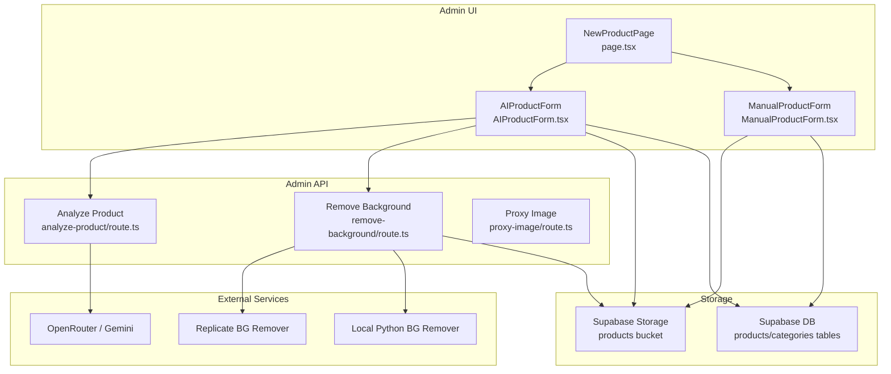
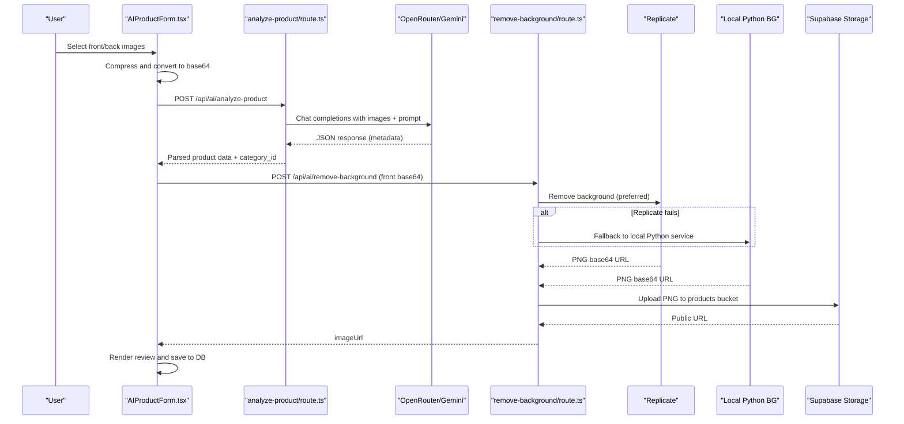
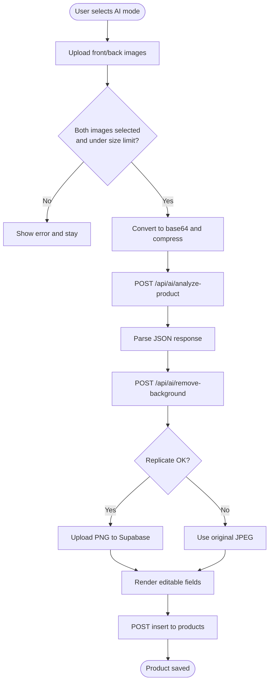
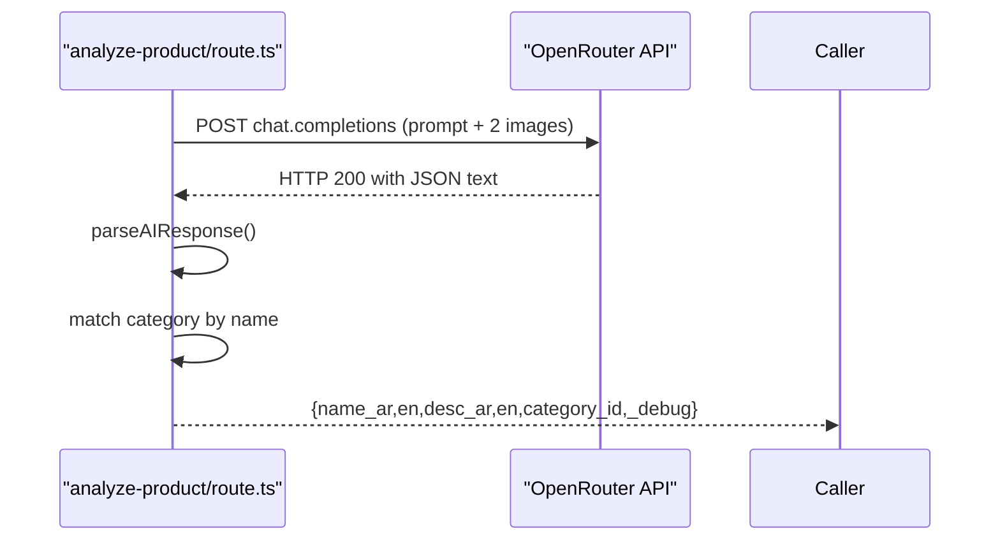
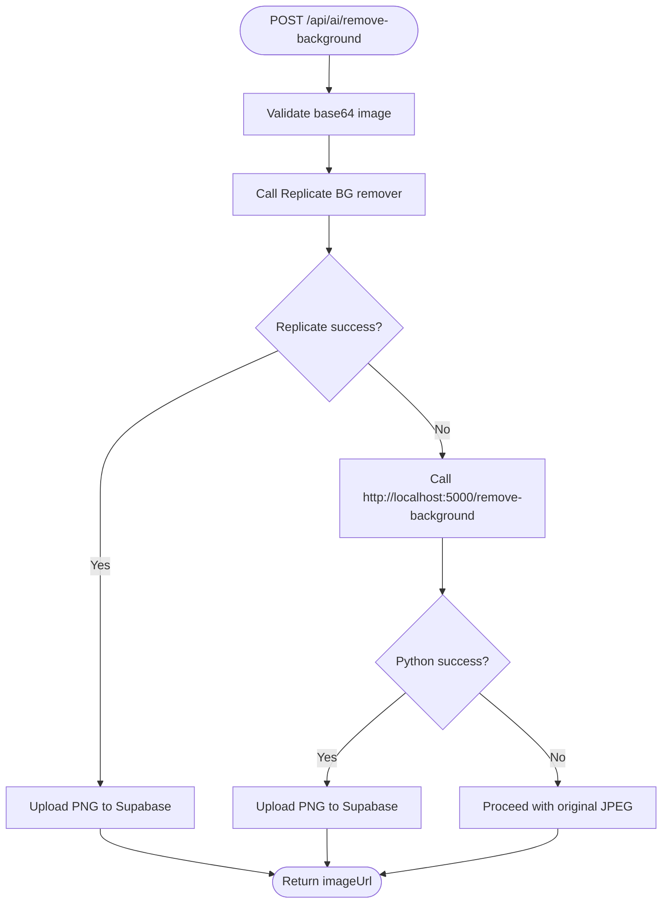
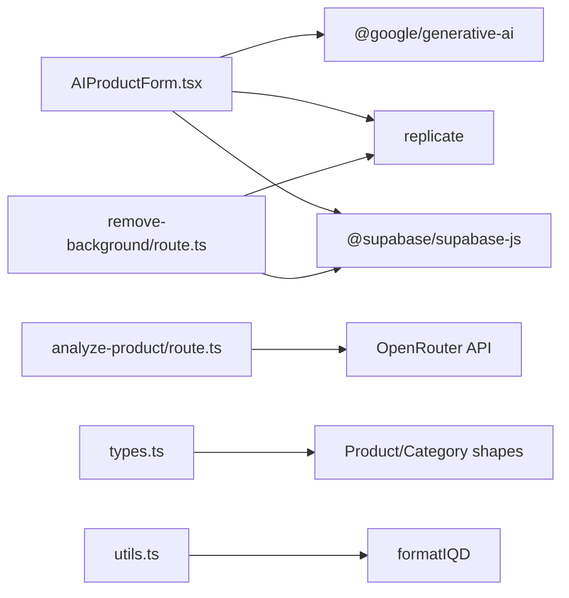

# AI Product Analysis

<cite>
**Referenced Files in This Document**
- [route.ts](file://admin/src/app/api/ai/analyze-product/route.ts)
- [route.ts](file://admin/src/app/api/ai/remove-background/route.ts)
- [route.ts](file://admin/src/app/api/proxy-image/route.ts)
- [AIProductForm.tsx](file://admin/src/components/products/AIProductForm.tsx)
- [ManualProductForm.tsx](file://admin/src/components/products/ManualProductForm.tsx)
- [page.tsx](file://admin/src/app/(dashboard)/products/new/page.tsx)
- [SETUP_AI_PRODUCT.md](file://admin/SETUP_AI_PRODUCT.md)
- [types.ts](file://shared/types.ts)
- [package.json](file://admin/package.json)
- [next.config.ts](file://admin/next.config.ts)
- [utils.ts](file://admin/src/lib/utils.ts)
</cite>

## Table of Contents
1. [Introduction](#introduction)
2. [Project Structure](#project-structure)
3. [Core Components](#core-components)
4. [Architecture Overview](#architecture-overview)
5. [Detailed Component Analysis](#detailed-component-analysis)
6. [Dependency Analysis](#dependency-analysis)
7. [Performance Considerations](#performance-considerations)
8. [Troubleshooting Guide](#troubleshooting-guide)
9. [Conclusion](#conclusion)
10. [Appendices](#appendices)

## Introduction
This document describes the AI-powered product analysis system designed to accelerate product onboarding. It integrates a Gemini-based vision-language model via OpenRouter to automatically extract product metadata (names, descriptions, category) from front and back product images. The system includes:
- Image preprocessing and compression on the client
- API request formatting to OpenRouter’s Gemini model
- Robust response parsing and fallback handling
- Background removal using Replicate and a local Python service
- A two-step AI-assisted form followed by manual refinement and validation
- Supabase storage integration for images and database persistence
- Guidance on model selection, prompt engineering, and result interpretation
- Performance optimization, caching, and cost management strategies

## Project Structure
The AI product analysis feature spans the Admin panel (Next.js) and shared types:
- Admin API routes for AI analysis and background removal
- UI forms for AI-assisted and manual product creation
- Shared types for database entities and API responses
- Configuration for image optimization and environment variables

**Diagram sources**
- [page.tsx](file://admin/src/app/(dashboard)/products/new/page.tsx#L10-L162)
- [AIProductForm.tsx:12-670](file://admin/src/components/products/AIProductForm.tsx#L12-L670)
- [ManualProductForm.tsx:13-255](file://admin/src/components/products/ManualProductForm.tsx#L13-L255)
- [route.ts:71-221](file://admin/src/app/api/ai/analyze-product/route.ts#L71-L221)
- [route.ts:12-152](file://admin/src/app/api/ai/remove-background/route.ts#L12-L152)
- [route.ts:4-42](file://admin/src/app/api/proxy-image/route.ts#L4-L42)

**Section sources**
- [page.tsx](file://admin/src/app/(dashboard)/products/new/page.tsx#L10-L162)
- [AIProductForm.tsx:12-670](file://admin/src/components/products/AIProductForm.tsx#L12-L670)
- [ManualProductForm.tsx:13-255](file://admin/src/components/products/ManualProductForm.tsx#L13-L255)
- [route.ts:71-221](file://admin/src/app/api/ai/analyze-product/route.ts#L71-L221)
- [route.ts:12-152](file://admin/src/app/api/ai/remove-background/route.ts#L12-L152)
- [route.ts:4-42](file://admin/src/app/api/proxy-image/route.ts#L4-L42)

## Core Components
- AI Product Form (client-side):
  - Handles image selection, client-side compression, and conversion to base64
  - Calls the AI analysis endpoint and background removal endpoint
  - Presents a two-step refinement UI: editable AI-extracted fields and manual price/stock
  - Saves validated product data to Supabase
- OpenRouter/Gemini API route:
  - Validates environment and payload
  - Builds a multimodal prompt with front/back images and category list
  - Iterates through configured models with fallback
  - Parses JSON from LLM response with robust cleanup
  - Matches extracted category to internal categories
- Background removal route:
  - Attempts Replicate API first, falls back to local Python service
  - Uploads processed image to Supabase Storage and returns public URL
- Proxy image route:
  - Fetches external images and returns binary with appropriate headers
- Manual Product Form:
  - Provides a traditional form for manual data entry and image upload
- Shared Types:
  - Defines Product and Category shapes used across the system

**Section sources**
- [AIProductForm.tsx:48-234](file://admin/src/components/products/AIProductForm.tsx#L48-L234)
- [route.ts:71-221](file://admin/src/app/api/ai/analyze-product/route.ts#L71-L221)
- [route.ts:12-152](file://admin/src/app/api/ai/remove-background/route.ts#L12-L152)
- [route.ts:4-42](file://admin/src/app/api/proxy-image/route.ts#L4-L42)
- [ManualProductForm.tsx:13-255](file://admin/src/components/products/ManualProductForm.tsx#L13-L255)
- [types.ts:10-211](file://shared/types.ts#L10-L211)

## Architecture Overview
The AI product workflow consists of three primary steps orchestrated by the AI Product Form:
1. Image capture and preprocessing
2. AI analysis and background removal
3. Manual refinement and persistence

**Diagram sources**
- [AIProductForm.tsx:76-199](file://admin/src/components/products/AIProductForm.tsx#L76-L199)
- [route.ts:71-221](file://admin/src/app/api/ai/analyze-product/route.ts#L71-L221)
- [route.ts:12-152](file://admin/src/app/api/ai/remove-background/route.ts#L12-L152)

## Detailed Component Analysis

### AI Product Form Workflow
The AI Product Form implements a guided, multi-step workflow:
- Step 1: Upload images (front/back) with validation and preview
- Step 2: Edit AI-extracted metadata and select category; enter price and stock
- Step 3: Review and save to Supabase

**Diagram sources**
- [AIProductForm.tsx:76-278](file://admin/src/components/products/AIProductForm.tsx#L76-L278)
- [route.ts:71-221](file://admin/src/app/api/ai/analyze-product/route.ts#L71-L221)
- [route.ts:12-152](file://admin/src/app/api/ai/remove-background/route.ts#L12-L152)

**Section sources**
- [AIProductForm.tsx:48-278](file://admin/src/components/products/AIProductForm.tsx#L48-L278)

### OpenRouter/Gemini Integration
- Authentication and model selection:
  - Uses an OpenRouter API key from environment variables
  - Maintains a prioritized model list; iterates with early exit on success
- Request construction:
  - Sends a multimodal message containing prompt text and two image_url entries
  - Sets referer and title headers per provider requirements
- Response handling:
  - Validates HTTP response and extracts choices[0].message.content
  - Robust JSON parsing with fallbacks for fenced code blocks and partial matches
- Category resolution:
  - Normalizes extracted category name and matches against internal categories
  - Falls back to the first category if no match

**Diagram sources**
- [route.ts:12-50](file://admin/src/app/api/ai/analyze-product/route.ts#L12-L50)
- [route.ts:71-221](file://admin/src/app/api/ai/analyze-product/route.ts#L71-L221)

**Section sources**
- [route.ts:4-50](file://admin/src/app/api/ai/analyze-product/route.ts#L4-L50)
- [route.ts:53-69](file://admin/src/app/api/ai/analyze-product/route.ts#L53-L69)
- [route.ts:148-201](file://admin/src/app/api/ai/analyze-product/route.ts#L148-L201)

### Background Removal Pipeline
- Preferred path:
  - Calls Replicate with a background remover model
  - Downloads returned image URL and uploads PNG to Supabase Storage
- Fallback path:
  - If Replicate fails, attempts a local Python service on localhost
  - On success, uploads PNG; otherwise, proceeds with original JPEG
- Output:
  - Returns a public URL for the processed image

**Diagram sources**
- [route.ts:12-152](file://admin/src/app/api/ai/remove-background/route.ts#L12-L152)

**Section sources**
- [route.ts:12-152](file://admin/src/app/api/ai/remove-background/route.ts#L12-L152)

### Manual Product Form
- Allows direct entry of product details and image upload to Supabase
- Useful when AI extraction is unavailable or unsuitable
- Integrates with the same database schema and UI patterns

**Section sources**
- [ManualProductForm.tsx:13-255](file://admin/src/components/products/ManualProductForm.tsx#L13-L255)

### Proxy Image Endpoint
- Fetches an external image URL and returns the binary stream with appropriate headers
- Enables clients to bypass CORS restrictions when displaying remote images

**Section sources**
- [route.ts:4-42](file://admin/src/app/api/proxy-image/route.ts#L4-L42)

### Data Validation and Manual Correction
- Client-side validation ensures required fields are present before saving
- Two-step editing allows administrators to correct AI-extracted data
- Category dropdown ensures consistent categorization aligned with internal taxonomy

**Section sources**
- [AIProductForm.tsx:236-278](file://admin/src/components/products/AIProductForm.tsx#L236-L278)
- [AIProductForm.tsx:463-510](file://admin/src/components/products/AIProductForm.tsx#L463-L510)

### Integration with Supabase
- Products and categories are stored in Supabase tables
- Images are uploaded to the Supabase Storage “products” bucket
- Public URLs are generated and persisted with cache control

**Section sources**
- [AIProductForm.tsx:160-175](file://admin/src/components/products/AIProductForm.tsx#L160-L175)
- [route.ts:126-141](file://admin/src/app/api/ai/remove-background/route.ts#L126-L141)
- [types.ts:10-48](file://shared/types.ts#L10-L48)

## Dependency Analysis
- External libraries:
  - @google/generative-ai: Used in tests; production relies on OpenRouter
  - replicate: Calls Replicate background removal service
  - @supabase/supabase-js: Interacts with Supabase Storage and DB
- Internal dependencies:
  - Shared types define Product and Category shapes
  - Utilities provide currency formatting helpers

**Diagram sources**
- [package.json:11-26](file://admin/package.json#L11-L26)
- [AIProductForm.tsx:1-10](file://admin/src/components/products/AIProductForm.tsx#L1-L10)
- [route.ts:1-5](file://admin/src/app/api/ai/analyze-product/route.ts#L1-L5)
- [route.ts:1-8](file://admin/src/app/api/ai/remove-background/route.ts#L1-L8)
- [types.ts:10-48](file://shared/types.ts#L10-L48)
- [utils.ts:8-14](file://admin/src/lib/utils.ts#L8-L14)

**Section sources**
- [package.json:11-26](file://admin/package.json#L11-L26)
- [types.ts:10-48](file://shared/types.ts#L10-L48)

## Performance Considerations
- Client-side image compression:
  - Canvas-based resizing reduces payload sizes before base64 encoding
- Image optimization:
  - Next.js image optimization enabled for Supabase CDN host
  - Minimum cache TTL configured for long-term caching
- API retries:
  - Multi-model fallback minimizes single-point-of-failure risk
- Background removal:
  - Prefer Replicate for speed and reliability; local fallback avoids downtime
- Cost management:
  - Gemini via OpenRouter is free tier friendly
  - Replicate cost is minimal for small-scale usage
  - Supabase Storage is free up to limits

**Section sources**
- [AIProductForm.tsx:201-234](file://admin/src/components/products/AIProductForm.tsx#L201-L234)
- [next.config.ts:10-21](file://admin/next.config.ts#L10-L21)
- [route.ts:148-161](file://admin/src/app/api/ai/analyze-product/route.ts#L148-L161)
- [route.ts:29-116](file://admin/src/app/api/ai/remove-background/route.ts#L29-L116)

## Troubleshooting Guide
- Missing OpenRouter API key:
  - The analyze route returns a 500 error instructing to set the environment variable
- Invalid or empty images:
  - Client-side validation prevents submission; ensure images are under size limits
- Non-JSON response from AI route:
  - Client detects non-JSON responses and prompts refresh/retry
- Background removal failures:
  - Replicate errors trigger fallback to local Python service
  - If both fail, the original JPEG is uploaded and flagged in UI
- Supabase upload issues:
  - Verify bucket name, RLS policies, and API keys
- Local Python service:
  - Ensure the Python API is running on localhost:5000 and healthy

**Section sources**
- [route.ts:75-80](file://admin/src/app/api/ai/analyze-product/route.ts#L75-L80)
- [AIProductForm.tsx:106-118](file://admin/src/components/products/AIProductForm.tsx#L106-L118)
- [route.ts:86-116](file://admin/src/app/api/ai/remove-background/route.ts#L86-L116)
- [SETUP_AI_PRODUCT.md:148-190](file://admin/SETUP_AI_PRODUCT.md#L148-L190)

## Conclusion
The AI product analysis system streamlines product onboarding by combining vision-language AI with practical fallbacks and a robust manual override. It emphasizes reliability (multi-model AI, dual BG removal paths), usability (guided UI, editable fields), and cost-consciousness (free tiers, efficient compression). With clear separation of concerns and strong typing via shared schemas, the system is maintainable and extensible.

## Appendices

### Prompt Engineering and Model Selection
- Prompt structure:
  - Provide explicit categories and strict instructions for extracting names, descriptions, and category
  - Enforce JSON-only output and precise Arabic category names
- Model selection:
  - Start with a fast, cost-effective model; keep a secondary model ready for fallback
  - Monitor response quality and adjust prompt granularity accordingly

**Section sources**
- [route.ts:96-141](file://admin/src/app/api/ai/analyze-product/route.ts#L96-L141)
- [route.ts:7-9](file://admin/src/app/api/ai/analyze-product/route.ts#L7-L9)

### Result Interpretation
- Validate extracted category matches internal taxonomy
- Cross-check product names and descriptions for clarity and completeness
- Use the manual correction step to refine ambiguous or incorrect extractions

**Section sources**
- [route.ts:187-201](file://admin/src/app/api/ai/analyze-product/route.ts#L187-L201)
- [AIProductForm.tsx:463-510](file://admin/src/components/products/AIProductForm.tsx#L463-L510)

### Setup and Deployment Notes
- Ensure environment variables are configured for OpenRouter and Replicate
- Run the local Python background removal service for offline fallback
- Configure Supabase Storage bucket and RLS policies

**Section sources**
- [SETUP_AI_PRODUCT.md:1-243](file://admin/SETUP_AI_PRODUCT.md#L1-L243)