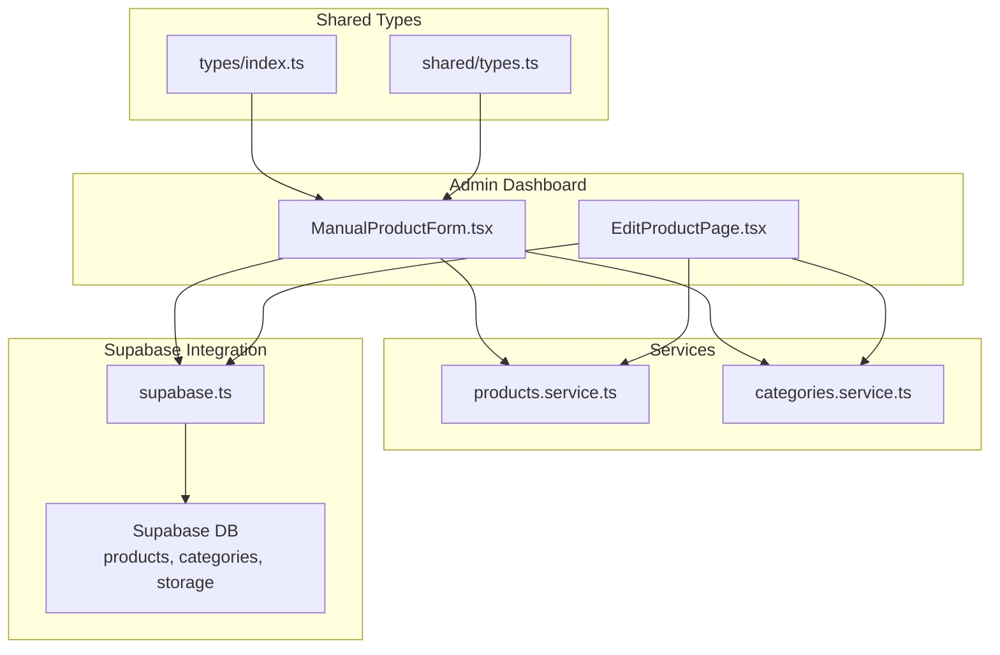
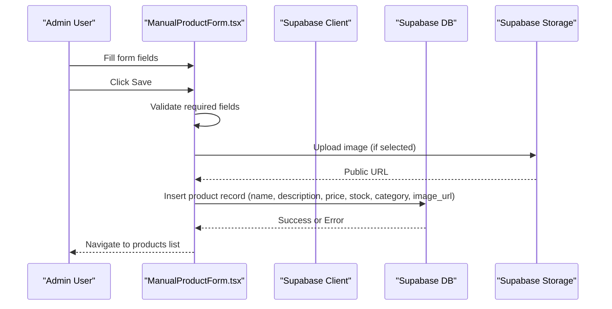
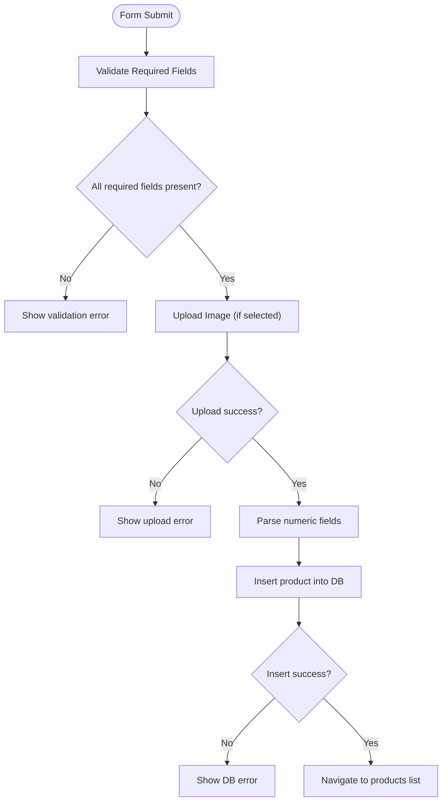
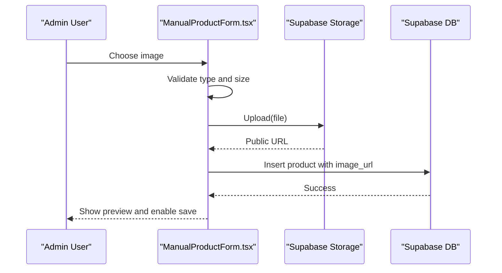
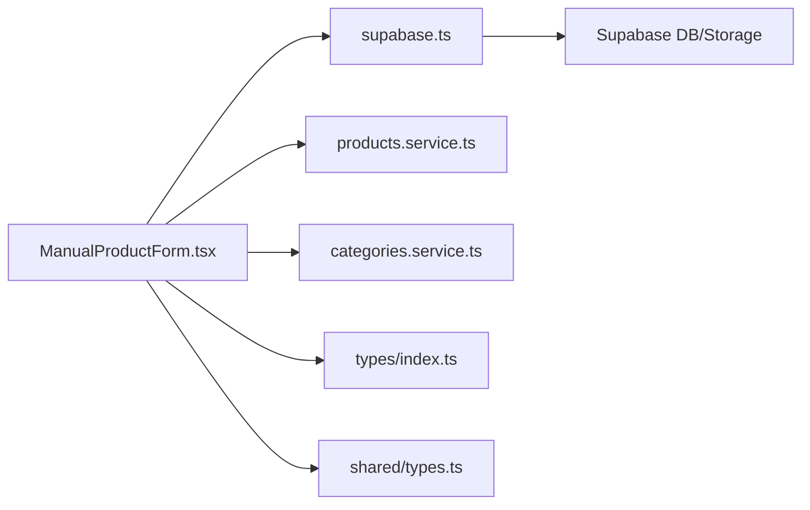

# Manual Product Form

<cite>
**Referenced Files in This Document**
- [ManualProductForm.tsx](file://admin/src/components/products/ManualProductForm.tsx)
- [EditProductPage.tsx](file://admin/src/app/(dashboard)/products/[id]/page.tsx)
- [products.service.ts](file://services/products.service.ts)
- [categories.service.ts](file://services/categories.service.ts)
- [types/index.ts](file://types/index.ts)
- [shared/types.ts](file://shared/types.ts)
- [supabase.ts](file://admin/src/lib/supabase.ts)
- [CurrencyContext.tsx](file://contexts/CurrencyContext.tsx)
- [ar.json](file://locales/ar.json)
- [en.json](file://locales/en.json)
</cite>

## Table of Contents
1. [Introduction](#introduction)
2. [Project Structure](#project-structure)
3. [Core Components](#core-components)
4. [Architecture Overview](#architecture-overview)
5. [Detailed Component Analysis](#detailed-component-analysis)
6. [Dependency Analysis](#dependency-analysis)
7. [Performance Considerations](#performance-considerations)
8. [Troubleshooting Guide](#troubleshooting-guide)
9. [Conclusion](#conclusion)

## Introduction
This document explains the manual product creation form used by administrators to add new products to the store. It covers all form fields (product name in Arabic and English, descriptions, category selection, pricing setup, inventory management, and image upload), validation rules, error handling, and submission behavior. It also documents the category hierarchy retrieval, pricing calculations, and integration with Supabase storage and database. Guidance is included for accessibility, validation patterns, and user experience across desktop and mobile.

## Project Structure
The manual product creation form is implemented as a client-side component that integrates with Supabase for data persistence and storage. The form is rendered inside the admin dashboard and submits data to the backend via Supabase queries.

**Diagram sources**
- [ManualProductForm.tsx:1-255](file://admin/src/components/products/ManualProductForm.tsx#L1-L255)
- [EditProductPage.tsx](file://admin/src/app/(dashboard)/products/[id]/page.tsx#L1-L391)
- [products.service.ts:1-449](file://services/products.service.ts#L1-L449)
- [categories.service.ts:1-137](file://services/categories.service.ts#L1-L137)
- [types/index.ts:1-276](file://types/index.ts#L1-L276)
- [shared/types.ts:1-353](file://shared/types.ts#L1-L353)
- [supabase.ts:1-24](file://admin/src/lib/supabase.ts#L1-L24)

**Section sources**
- [ManualProductForm.tsx:1-255](file://admin/src/components/products/ManualProductForm.tsx#L1-L255)
- [EditProductPage.tsx](file://admin/src/app/(dashboard)/products/[id]/page.tsx#L1-L391)
- [supabase.ts:1-24](file://admin/src/lib/supabase.ts#L1-L24)

## Core Components
- ManualProductForm: A client component that renders the form, manages local state, validates inputs, uploads images to Supabase Storage, and inserts records into the products table.
- EditProductPage: A client component for editing existing products with similar fields and validation, including optional USD price calculation and active status toggle.
- Services: products.service.ts and categories.service.ts encapsulate Supabase queries for product and category data.
- Types: Strongly typed interfaces define the shape of products, categories, and related entities.
- Supabase: Configuration and client initialization for database and storage operations.

**Section sources**
- [ManualProductForm.tsx:1-255](file://admin/src/components/products/ManualProductForm.tsx#L1-L255)
- [EditProductPage.tsx](file://admin/src/app/(dashboard)/products/[id]/page.tsx#L1-L391)
- [products.service.ts:1-449](file://services/products.service.ts#L1-L449)
- [categories.service.ts:1-137](file://services/categories.service.ts#L1-L137)
- [types/index.ts:1-276](file://types/index.ts#L1-L276)
- [shared/types.ts:1-353](file://shared/types.ts#L1-L353)
- [supabase.ts:1-24](file://admin/src/lib/supabase.ts#L1-L24)

## Architecture Overview
The form follows a straightforward client-side flow:
- Fetch categories on mount.
- On submit, convert numeric fields to numbers and insert into the products table.
- For image uploads, validate file type and size, upload to Supabase Storage, and store the public URL.
- Redirect to the products list on success.

**Diagram sources**
- [ManualProductForm.tsx:40-115](file://admin/src/components/products/ManualProductForm.tsx#L40-L115)
- [supabase.ts:1-24](file://admin/src/lib/supabase.ts#L1-L24)

## Detailed Component Analysis

### Manual Product Creation Form
The form collects:
- Product name (Arabic and English)
- Descriptions (Arabic and English)
- Category selection
- Pricing in IQD with automatic USD conversion
- Inventory (stock quantity)
- Image upload with preview and removal

Validation and behavior:
- Required fields are enforced via HTML attributes and runtime checks.
- Numeric fields are parsed to numbers before insertion.
- Image validation ensures image/* MIME type and a maximum size of 5 MB.
- On successful submission, the user is redirected to the products list.

**Diagram sources**
- [ManualProductForm.tsx:40-115](file://admin/src/components/products/ManualProductForm.tsx#L40-L115)

**Section sources**
- [ManualProductForm.tsx:13-115](file://admin/src/components/products/ManualProductForm.tsx#L13-L115)

### Edit Product Page (Related Behavior)
The edit page mirrors the creation form with additional optional USD field and active status toggle. It demonstrates:
- Fetching product and category data on load.
- Image upload and removal with previews.
- Updating product records with numeric parsing and optional USD recalculation.

**Section sources**
- [EditProductPage.tsx](file://admin/src/app/(dashboard)/products/[id]/page.tsx#L10-L158)

### Category Selection and Hierarchy
- Categories are fetched from the categories table with an active filter.
- The form presents a dropdown of categories for selection.
- The services module includes functions to fetch categories, main categories, and subcategories, enabling hierarchical navigation in other parts of the admin.

**Section sources**
- [ManualProductForm.tsx:31-38](file://admin/src/components/products/ManualProductForm.tsx#L31-L38)
- [categories.service.ts:12-21](file://services/categories.service.ts#L12-L21)
- [categories.service.ts:53-78](file://services/categories.service.ts#L53-L78)

### Pricing Setup and Calculations
- IQD price is required and parsed to a number.
- USD price is optional; if not provided, the form computes it from IQD using a fixed exchange rate during submission.
- The edit page allows manual USD input or recalculates from IQD.

Exchange rate and formatting:
- A fixed exchange rate is used for USD calculation in the form submission.
- Currency formatting and toggling are handled by a dedicated context elsewhere in the application.

**Section sources**
- [ManualProductForm.tsx:94-105](file://admin/src/components/products/ManualProductForm.tsx#L94-L105)
- [EditProductPage.tsx](file://admin/src/app/(dashboard)/products/[id]/page.tsx#L130-L146)
- [CurrencyContext.tsx:21-73](file://contexts/CurrencyContext.tsx#L21-L73)

### Inventory Management
- Stock quantity is a required numeric field.
- Values are parsed to integers before insertion/update.

**Section sources**
- [ManualProductForm.tsx:163-173](file://admin/src/components/products/ManualProductForm.tsx#L163-L173)
- [EditProductPage.tsx](file://admin/src/app/(dashboard)/products/[id]/page.tsx#L264-L275)

### Image Upload Workflow
- Accepts image/* files with a maximum size of 5 MB.
- Generates a unique filename and uploads to the products bucket.
- Retrieves a public URL and stores it in the product record.
- Provides a preview and remove option.

**Diagram sources**
- [ManualProductForm.tsx:40-82](file://admin/src/components/products/ManualProductForm.tsx#L40-L82)

**Section sources**
- [ManualProductForm.tsx:40-87](file://admin/src/components/products/ManualProductForm.tsx#L40-L87)

### Form Submission and Error Handling
- Prevents submission if required fields are missing.
- Displays alerts for upload and database errors.
- Redirects to the products list on success.

**Section sources**
- [ManualProductForm.tsx:89-115](file://admin/src/components/products/ManualProductForm.tsx#L89-L115)

### Accessibility and UX Patterns
- Required fields are marked clearly in labels.
- Responsive grid layout adapts to mobile and desktop.
- Clear visual feedback during uploads and submissions.
- RTL language support is integrated via locale files.

**Section sources**
- [ManualProductForm.tsx:126-251](file://admin/src/components/products/ManualProductForm.tsx#L126-L251)
- [ar.json:1-413](file://locales/ar.json#L1-L413)
- [en.json:1-413](file://locales/en.json#L1-L413)

## Dependency Analysis
The form depends on:
- Supabase client for database and storage operations.
- Services for category and product data access.
- Shared types for strong typing of entities.
- Currency context for formatting and exchange rate handling.

**Diagram sources**
- [ManualProductForm.tsx:1-255](file://admin/src/components/products/ManualProductForm.tsx#L1-L255)
- [supabase.ts:1-24](file://admin/src/lib/supabase.ts#L1-L24)
- [products.service.ts:1-449](file://services/products.service.ts#L1-L449)
- [categories.service.ts:1-137](file://services/categories.service.ts#L1-L137)
- [types/index.ts:1-276](file://types/index.ts#L1-L276)
- [shared/types.ts:1-353](file://shared/types.ts#L1-L353)

**Section sources**
- [ManualProductForm.tsx:1-255](file://admin/src/components/products/ManualProductForm.tsx#L1-L255)
- [supabase.ts:1-24](file://admin/src/lib/supabase.ts#L1-L24)
- [products.service.ts:1-449](file://services/products.service.ts#L1-L449)
- [categories.service.ts:1-137](file://services/categories.service.ts#L1-L137)
- [types/index.ts:1-276](file://types/index.ts#L1-L276)
- [shared/types.ts:1-353](file://shared/types.ts#L1-L353)

## Performance Considerations
- Keep image sizes under 5 MB to avoid long upload times and storage overhead.
- Use numeric inputs with min="0" to prevent negative values.
- Avoid unnecessary re-renders by managing state efficiently in the form component.
- Consider debouncing category fetches if the category list grows very large.

## Troubleshooting Guide
Common issues and resolutions:
- Image upload fails: Verify file type is image/* and size is under 5 MB. Check network connectivity and Supabase storage permissions.
- Validation errors: Ensure all required fields are filled. Numeric fields must contain valid numbers.
- Database insertion errors: Confirm that category_id exists and matches an active category. Check for unique constraints or column mismatches.
- Exchange rate discrepancies: The form uses a fixed rate for USD calculation; adjust the rate in the form logic if needed.

**Section sources**
- [ManualProductForm.tsx:47-55](file://admin/src/components/products/ManualProductForm.tsx#L47-L55)
- [ManualProductForm.tsx:110-115](file://admin/src/components/products/ManualProductForm.tsx#L110-L115)

## Conclusion
The manual product creation form provides a streamlined way to add products with robust validation, image handling, and integration with Supabase. Its structure supports easy maintenance and extension, while the services and shared types ensure type safety and consistency across the application.