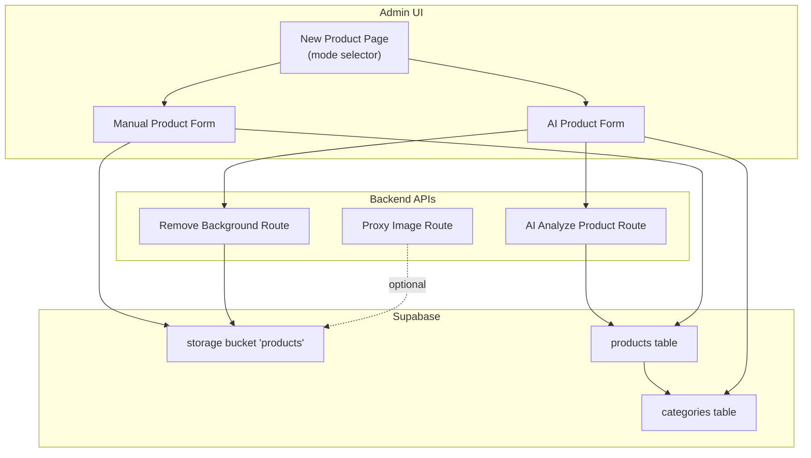
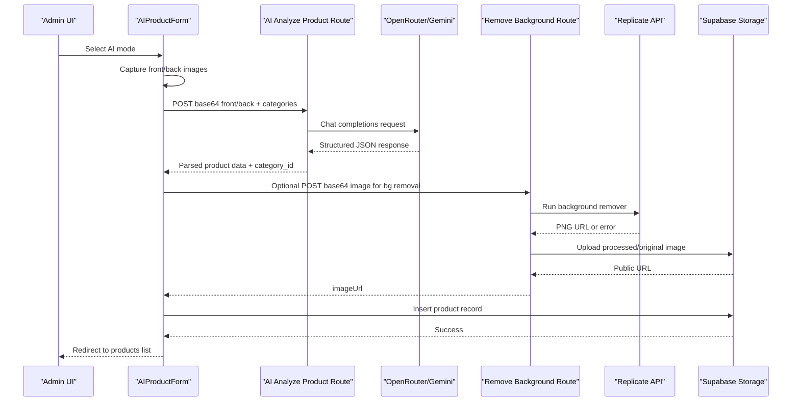
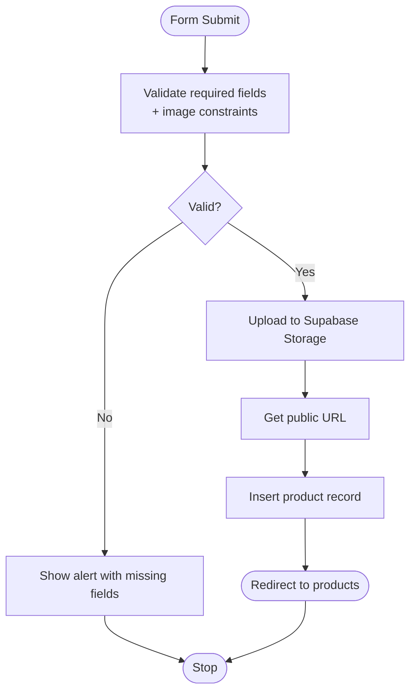
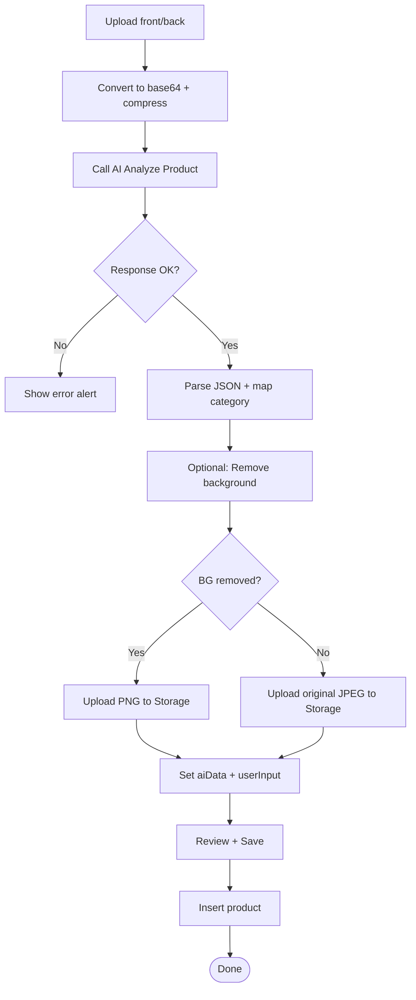
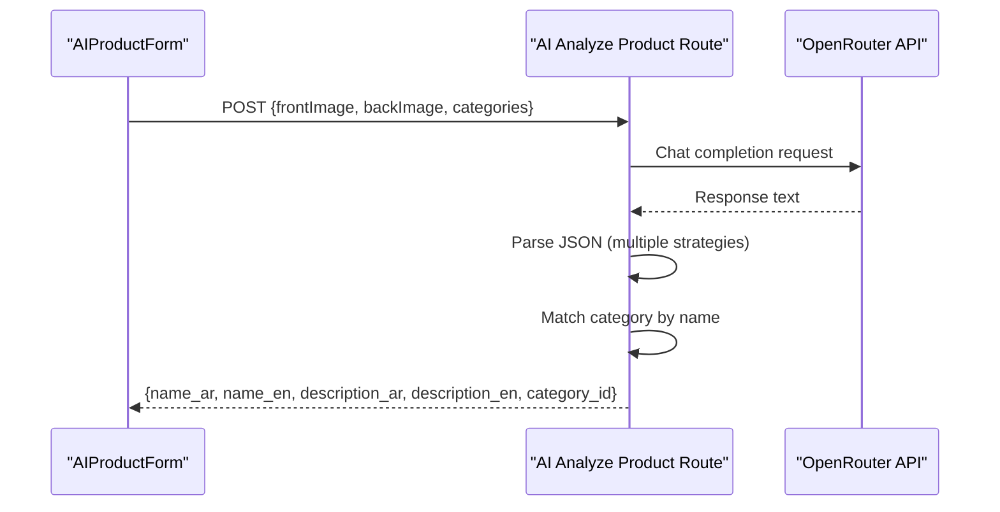
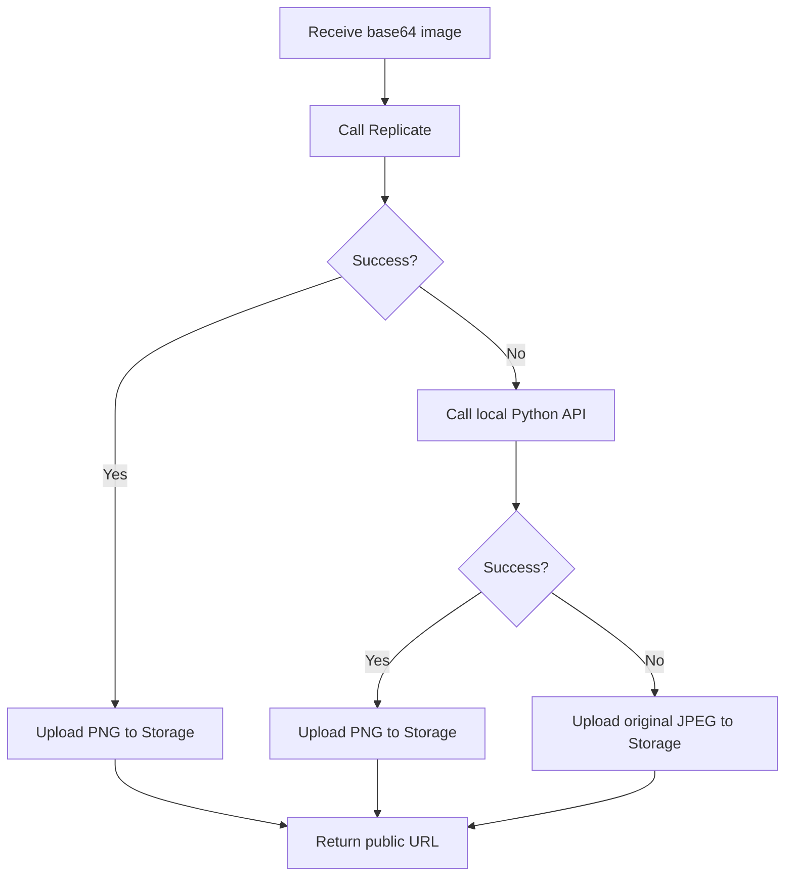
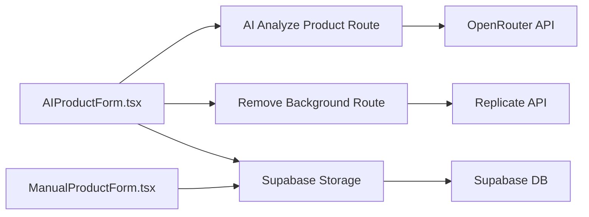
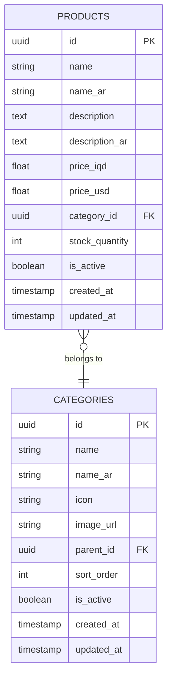

# Product Creation Forms

<cite>
**Referenced Files in This Document**
- [AIProductForm.tsx](file://admin/src/components/products/AIProductForm.tsx)
- [ManualProductForm.tsx](file://admin/src/components/products/ManualProductForm.tsx)
- [route.ts (AI Analyze Product)](file://admin/src/app/api/ai/analyze-product/route.ts)
- [route.ts (Remove Background)](file://admin/src/app/api/ai/remove-background/route.ts)
- [route.ts (Proxy Image)](file://admin/src/app/api/proxy-image/route.ts)
- [types.ts](file://shared/types.ts)
- [supabase.ts (Admin Browser)](file://admin/src/lib/supabase.ts)
- [supabase.ts (Mobile Client)](file://lib/supabase.ts)
- [page.tsx (New Product Page)](file://admin/src/app/(dashboard)/products/new/page.tsx)
- [page.tsx (Edit Product Page)](file://admin/src/app/(dashboard)/products/[id]/page.tsx)
- [products.service.ts](file://services/products.service.ts)
- [ar.json](file://locales/ar.json)
</cite>

## Table of Contents
1. [Introduction](#introduction)
2. [Project Structure](#project-structure)
3. [Core Components](#core-components)
4. [Architecture Overview](#architecture-overview)
5. [Detailed Component Analysis](#detailed-component-analysis)
6. [Dependency Analysis](#dependency-analysis)
7. [Performance Considerations](#performance-considerations)
8. [Troubleshooting Guide](#troubleshooting-guide)
9. [Conclusion](#conclusion)
10. [Appendices](#appendices)

## Introduction
This document explains the product creation forms for administrators, covering both manual and AI-powered workflows. It details form validation, category selection, pricing and inventory inputs, image upload and processing, dual-language support, Supabase integration, and the AI pipeline using Gemini via OpenRouter and background removal via Replicate. It also covers UX progression, error handling, and accessibility/mobile responsiveness considerations.

## Project Structure
The product creation experience is organized around:
- A selection page that lets admins choose between manual and AI modes
- Two specialized forms:
  - Manual form for entering product details and uploading images
  - AI form that captures front/back images, runs AI analysis, optionally removes background, and saves to Supabase
- Backend API routes for AI analysis, background removal, and image proxying
- Supabase integration for categories, storage, and product persistence
- Shared types and localization resources

**Diagram sources**
- [page.tsx (New Product Page)](file://admin/src/app/(dashboard)/products/new/page.tsx#L10-L164)
- [ManualProductForm.tsx:1-255](file://admin/src/components/products/ManualProductForm.tsx#L1-L255)
- [AIProductForm.tsx:1-670](file://admin/src/components/products/AIProductForm.tsx#L1-L670)
- [route.ts (AI Analyze Product):1-221](file://admin/src/app/api/ai/analyze-product/route.ts#L1-L221)
- [route.ts (Remove Background):1-152](file://admin/src/app/api/ai/remove-background/route.ts#L1-L152)
- [route.ts (Proxy Image):1-42](file://admin/src/app/api/proxy-image/route.ts#L1-L42)

**Section sources**
- [page.tsx (New Product Page)](file://admin/src/app/(dashboard)/products/new/page.tsx#L10-L164)
- [ManualProductForm.tsx:1-255](file://admin/src/components/products/ManualProductForm.tsx#L1-L255)
- [AIProductForm.tsx:1-670](file://admin/src/components/products/AIProductForm.tsx#L1-L670)

## Core Components
- Manual Product Form
  - Captures Arabic and English product names, descriptions, prices, stock, category, and image upload
  - Validates required fields and image constraints
  - Stores images to Supabase Storage and persists product metadata to the products table
- AI Product Form
  - Multi-step workflow: image upload, AI extraction, user edits, review and save
  - Integrates with OpenRouter/Gemini for product extraction and Replicate for background removal
  - Handles fallbacks when background removal fails
  - Persists product data and image URLs to Supabase
- Backend AI Routes
  - AI Analyze Product: sends front/back images to OpenRouter/Gemini and parses structured JSON
  - Remove Background: attempts Replicate API, falls back to local Python API, uploads processed image to Supabase
  - Proxy Image: fetches external images for preview or downstream processing
- Supabase Integration
  - Browser client for admin UI
  - Mobile client for native app
  - Shared database types for products and categories
- Localization
  - Arabic locale keys for form labels and messages

**Section sources**
- [ManualProductForm.tsx:1-255](file://admin/src/components/products/ManualProductForm.tsx#L1-L255)
- [AIProductForm.tsx:1-670](file://admin/src/components/products/AIProductForm.tsx#L1-L670)
- [route.ts (AI Analyze Product):1-221](file://admin/src/app/api/ai/analyze-product/route.ts#L1-L221)
- [route.ts (Remove Background):1-152](file://admin/src/app/api/ai/remove-background/route.ts#L1-L152)
- [route.ts (Proxy Image):1-42](file://admin/src/app/api/proxy-image/route.ts#L1-L42)
- [supabase.ts (Admin Browser):1-24](file://admin/src/lib/supabase.ts#L1-L24)
- [supabase.ts (Mobile Client):1-30](file://lib/supabase.ts#L1-L30)
- [types.ts:10-211](file://shared/types.ts#L10-L211)
- [ar.json:1-413](file://locales/ar.json#L1-L413)

## Architecture Overview
The AI-powered flow orchestrates frontend image capture, backend AI analysis, optional background removal, and persistent storage.

**Diagram sources**
- [AIProductForm.tsx:76-199](file://admin/src/components/products/AIProductForm.tsx#L76-L199)
- [route.ts (AI Analyze Product):71-221](file://admin/src/app/api/ai/analyze-product/route.ts#L71-L221)
- [route.ts (Remove Background):12-152](file://admin/src/app/api/ai/remove-background/route.ts#L12-L152)

## Detailed Component Analysis

### Manual Product Form
- Fields and validation
  - Required: Arabic and English names, price_iqd, stock_quantity, category_id, description_ar/description
  - Image validation: type image/*, size ≤ 5MB
- Pricing and currency
  - price_iqd stored; price_usd computed from price_iqd at 1 USD = 1500 IQD
- Inventory and availability
  - stock_quantity validated as non-negative integer
- Image upload pipeline
  - Generates unique filename with extension preserved
  - Uploads to Supabase Storage bucket "products"
  - Retrieves public URL for image_url
- Persistence
  - Inserts product row with is_active=true

**Diagram sources**
- [ManualProductForm.tsx:89-115](file://admin/src/components/products/ManualProductForm.tsx#L89-L115)
- [ManualProductForm.tsx:40-82](file://admin/src/components/products/ManualProductForm.tsx#L40-L82)

**Section sources**
- [ManualProductForm.tsx:1-255](file://admin/src/components/products/ManualProductForm.tsx#L1-L255)

### AI Product Form
- Workflow stages
  - Step 1: Upload front/back images; validates presence and types; limits size
  - Step 2: AI extraction; background removal; editable fields for name, description, category; price and stock inputs
  - Step 3: Review and save
- AI extraction
  - Sends base64 front/back images plus category list to OpenRouter/Gemini
  - Parses JSON response robustly, including fallback parsing
  - Matches extracted category to existing categories by exact or partial name match
- Background removal
  - Attempts Replicate API; falls back to local Python API if available
  - Uploads processed PNG or original JPEG to Supabase Storage
- Dual-language support
  - AI extracts both Arabic and English fields; UI displays RTL/LTR inputs accordingly
- Persistence
  - Inserts product with computed price_usd and is_active=true

**Diagram sources**
- [AIProductForm.tsx:76-199](file://admin/src/components/products/AIProductForm.tsx#L76-L199)
- [route.ts (AI Analyze Product):71-221](file://admin/src/app/api/ai/analyze-product/route.ts#L71-L221)
- [route.ts (Remove Background):12-152](file://admin/src/app/api/ai/remove-background/route.ts#L12-L152)

**Section sources**
- [AIProductForm.tsx:1-670](file://admin/src/components/products/AIProductForm.tsx#L1-L670)

### AI Analyze Product Route (OpenRouter/Gemini)
- Accepts frontImage, backImage, categories
- Builds structured prompt with category list and guidelines
- Calls OpenRouter API with Gemini model
- Parses JSON with multiple strategies (direct, fenced, embedded)
- Matches category by exact or partial name
- Returns name_ar, name_en, description_ar, description_en, category_id

**Diagram sources**
- [route.ts (AI Analyze Product):71-221](file://admin/src/app/api/ai/analyze-product/route.ts#L71-L221)

**Section sources**
- [route.ts (AI Analyze Product):1-221](file://admin/src/app/api/ai/analyze-product/route.ts#L1-L221)

### Remove Background Route (Replicate + Fallback)
- Accepts base64 image
- Calls Replicate background remover; converts returned URL to base64
- Uploads processed PNG to Supabase Storage
- On failure, attempts local Python API endpoint
- Returns public URL for processed or original image

**Diagram sources**
- [route.ts (Remove Background):12-152](file://admin/src/app/api/ai/remove-background/route.ts#L12-L152)

**Section sources**
- [route.ts (Remove Background):1-152](file://admin/src/app/api/ai/remove-background/route.ts#L1-L152)

### Proxy Image Route
- Fetches external image by URL
- Returns binary response with appropriate content-type
- Useful for previews or downstream processing when images are hosted externally

**Section sources**
- [route.ts (Proxy Image):1-42](file://admin/src/app/api/proxy-image/route.ts#L1-L42)

### Supabase Integration
- Clients
  - Admin browser client configured with NEXT_PUBLIC env vars
  - Mobile client configured with AsyncStorage for session persistence
- Types
  - Shared Database interface defines products and categories tables
  - Product types include name_ar, description_ar, price_iqd, price_usd, category_id, stock_quantity, is_active
- Services
  - Products service provides CRUD and filtering helpers used across the app

**Section sources**
- [supabase.ts (Admin Browser):1-24](file://admin/src/lib/supabase.ts#L1-L24)
- [supabase.ts (Mobile Client):1-30](file://lib/supabase.ts#L1-L30)
- [types.ts:10-211](file://shared/types.ts#L10-L211)
- [products.service.ts:1-449](file://services/products.service.ts#L1-L449)

### Localization and Accessibility
- Arabic localization keys are used for form labels and alerts
- UI supports RTL languages for Arabic inputs
- Accessible form controls with labels, placeholders, and proper focus states
- Loading states and disabled buttons during async operations

**Section sources**
- [ar.json:1-413](file://locales/ar.json#L1-L413)
- [AIProductForm.tsx:440-460](file://admin/src/components/products/AIProductForm.tsx#L440-L460)
- [ManualProductForm.tsx:130-148](file://admin/src/components/products/ManualProductForm.tsx#L130-L148)

## Dependency Analysis
- UI depends on Supabase client for categories and storage
- AIProductForm depends on:
  - AI Analyze Product route for structured extraction
  - Remove Background route for optimized images
  - Supabase Storage for image hosting
- ManualProductForm depends on:
  - Supabase Storage for image upload
  - Supabase client for product insertion
- Backend routes depend on:
  - OpenRouter API for Gemini inference
  - Replicate API for background removal
  - Supabase client for storage operations

**Diagram sources**
- [AIProductForm.tsx:1-670](file://admin/src/components/products/AIProductForm.tsx#L1-L670)
- [route.ts (AI Analyze Product):1-221](file://admin/src/app/api/ai/analyze-product/route.ts#L1-L221)
- [route.ts (Remove Background):1-152](file://admin/src/app/api/ai/remove-background/route.ts#L1-L152)

**Section sources**
- [AIProductForm.tsx:1-670](file://admin/src/components/products/AIProductForm.tsx#L1-L670)
- [ManualProductForm.tsx:1-255](file://admin/src/components/products/ManualProductForm.tsx#L1-L255)
- [route.ts (AI Analyze Product):1-221](file://admin/src/app/api/ai/analyze-product/route.ts#L1-L221)
- [route.ts (Remove Background):1-152](file://admin/src/app/api/ai/remove-background/route.ts#L1-L152)

## Performance Considerations
- Image compression: Front/back images are compressed to a fixed width before conversion to base64 to reduce payload sizes for AI and storage
- Caching: Supabase Storage cache-control set to one year for static assets
- CDN: Supabase provides CDN-backed public URLs for images
- API retries: AI route attempts multiple models and surfaces errors with details
- Background removal fallback: Reduces latency by avoiding repeated failures

[No sources needed since this section provides general guidance]

## Troubleshooting Guide
- AI Analysis Failures
  - Verify OPENROUTER_API_KEY is set
  - Check response content-type; non-JSON responses indicate middleware redirects or errors
  - Inspect parsed JSON structure; ensure category mapping matches available categories
- Background Removal Failures
  - Replicate API may fail; fallback to local Python API is attempted
  - On repeated failures, original image is uploaded as fallback
- Image Upload Issues
  - Ensure file type is image/* and size under 10MB for AI flow, 5MB for manual
  - Confirm Supabase Storage bucket permissions and public URL retrieval
- Validation Errors
  - Missing required fields trigger alerts in both forms
  - Numeric fields enforce min values and integer conversions

**Section sources**
- [route.ts (AI Analyze Product):75-80](file://admin/src/app/api/ai/analyze-product/route.ts#L75-L80)
- [AIProductForm.tsx:106-118](file://admin/src/components/products/AIProductForm.tsx#L106-L118)
- [route.ts (Remove Background):86-116](file://admin/src/app/api/ai/remove-background/route.ts#L86-L116)
- [ManualProductForm.tsx:47-55](file://admin/src/components/products/ManualProductForm.tsx#L47-L55)

## Conclusion
The product creation forms provide two complementary pathways: a streamlined AI-driven workflow with automated extraction and background removal, and a traditional manual form with full control over product details. Both integrate tightly with Supabase for categories, storage, and persistence, while offering robust validation, error handling, and internationalization support.

## Appendices

### Data Model Overview

**Diagram sources**
- [types.ts:10-48](file://shared/types.ts#L10-L48)

### Form State Management and Conditional Rendering
- AI Product Form
  - Steps: 'upload' | 'input' | 'review'
  - State: categories, front/back images, aiData, userInput, loading, bgRemoved
  - Conditional rendering for image previews, category selection, and step transitions
- Manual Product Form
  - State: formData, imagePreview, loading, uploading
  - Conditional rendering for upload button vs preview

**Section sources**
- [AIProductForm.tsx:12-46](file://admin/src/components/products/AIProductForm.tsx#L12-L46)
- [AIProductForm.tsx:322-416](file://admin/src/components/products/AIProductForm.tsx#L322-L416)
- [AIProductForm.tsx:418-578](file://admin/src/components/products/AIProductForm.tsx#L418-L578)
- [AIProductForm.tsx:580-665](file://admin/src/components/products/AIProductForm.tsx#L580-L665)
- [ManualProductForm.tsx:13-38](file://admin/src/components/products/ManualProductForm.tsx#L13-L38)
- [ManualProductForm.tsx:126-251](file://admin/src/components/products/ManualProductForm.tsx#L126-L251)

### Integration Notes
- Admin UI entry points:
  - New product selection page renders either Manual or AI form
  - Edit product page mirrors manual form fields for updates
- Backend routes:
  - AI Analyze Product: structured JSON extraction
  - Remove Background: optimized image hosting
  - Proxy Image: external image fetching

**Section sources**
- [page.tsx (New Product Page)](file://admin/src/app/(dashboard)/products/new/page.tsx#L10-L164)
- [page.tsx (Edit Product Page)](file://admin/src/app/(dashboard)/products/[id]/page.tsx#L10-L391)
- [route.ts (AI Analyze Product):71-221](file://admin/src/app/api/ai/analyze-product/route.ts#L71-L221)
- [route.ts (Remove Background):12-152](file://admin/src/app/api/ai/remove-background/route.ts#L12-L152)
- [route.ts (Proxy Image):1-42](file://admin/src/app/api/proxy-image/route.ts#L1-L42)