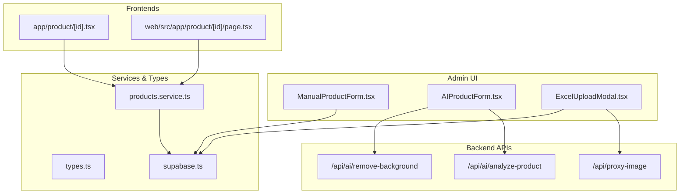
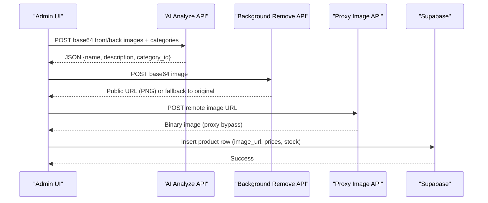
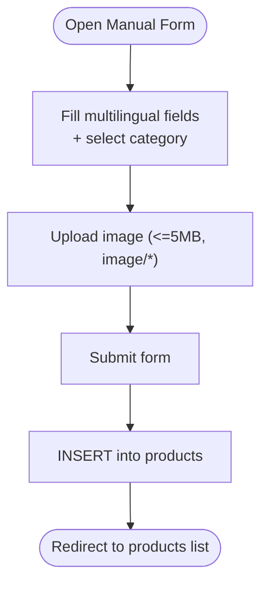
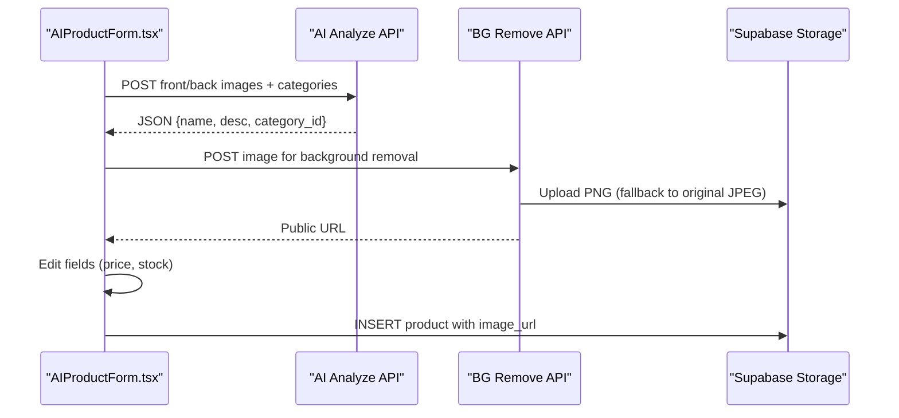
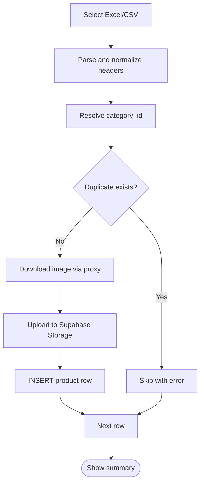
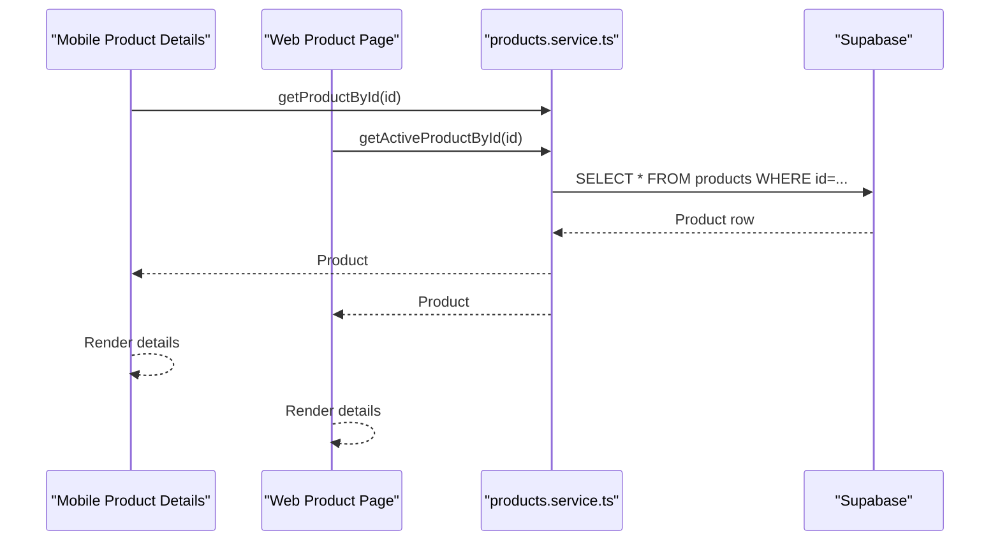
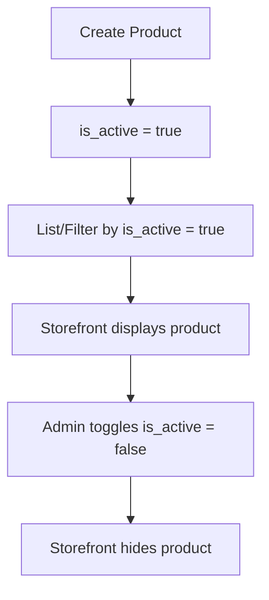
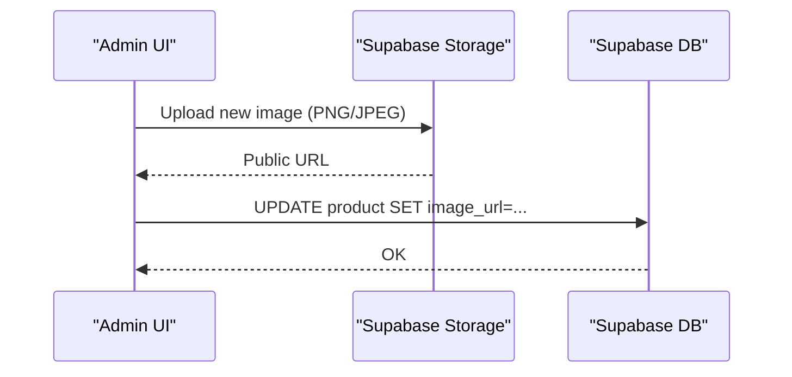
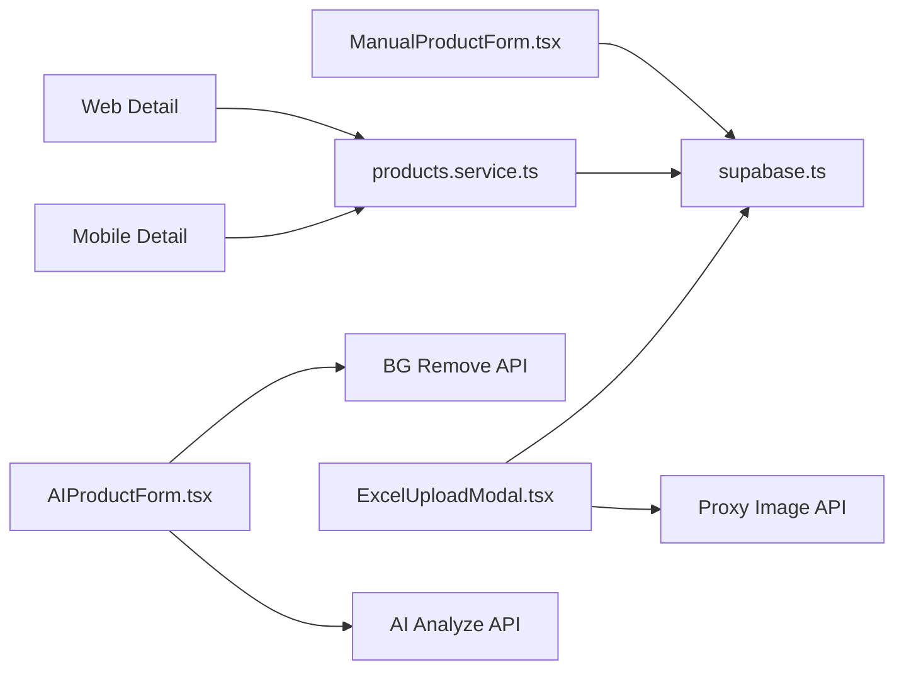

# Product Editing and Management

<cite>
**Referenced Files in This Document**
- [ManualProductForm.tsx](file://admin/src/components/products/ManualProductForm.tsx)
- [AIProductForm.tsx](file://admin/src/components/products/AIProductForm.tsx)
- [ExcelUploadModal.tsx](file://admin/src/components/products/ExcelUploadModal.tsx)
- [products.service.ts](file://services/products.service.ts)
- [types.ts](file://shared/types.ts)
- [route.ts (AI Analyze)](file://admin/src/app/api/ai/analyze-product/route.ts)
- [route.ts (Remove Background)](file://admin/src/app/api/ai/remove-background/route.ts)
- [route.ts (Proxy Image)](file://admin/src/app/api/proxy-image/route.ts)
- [supabase.ts](file://admin/src/lib/supabase.ts)
- [product/[id].tsx (Mobile)](file://app/product/[id].tsx)
- [page.tsx (Web Product)](file://web/src/app/product/[id]/page.tsx)
</cite>

## Table of Contents
1. [Introduction](#introduction)
2. [Project Structure](#project-structure)
3. [Core Components](#core-components)
4. [Architecture Overview](#architecture-overview)
5. [Detailed Component Analysis](#detailed-component-analysis)
6. [Dependency Analysis](#dependency-analysis)
7. [Performance Considerations](#performance-considerations)
8. [Troubleshooting Guide](#troubleshooting-guide)
9. [Conclusion](#conclusion)

## Introduction
This document explains the product editing and management functionality across the admin, mobile, and web storefront. It covers:
- Product detail views and real-time presentation
- Creation via manual form, AI-assisted form, and bulk Excel upload
- Edit mode activation and validation
- Product status management (activation/deactivation)
- Image replacement workflow, storage, and CDN considerations
- Audit and change tracking, versioning, and concurrency controls
- Performance and real-time synchronization guidance

## Project Structure
The product editing and management system spans three primary layers:
- Admin UI (Next.js app) with forms for manual, AI-assisted, and bulk uploads
- Backend APIs for AI analysis and background removal
- Services and types for product data access and typing
- Frontend storefronts (mobile and web) for product detail presentation

**Diagram sources**
- [ManualProductForm.tsx:13-115](file://admin/src/components/products/ManualProductForm.tsx#L13-L115)
- [AIProductForm.tsx:12-278](file://admin/src/components/products/AIProductForm.tsx#L12-L278)
- [ExcelUploadModal.tsx:27-255](file://admin/src/components/products/ExcelUploadModal.tsx#L27-L255)
- [route.ts (AI Analyze):71-220](file://admin/src/app/api/ai/analyze-product/route.ts#L71-L220)
- [route.ts (Remove Background):12-151](file://admin/src/app/api/ai/remove-background/route.ts#L12-L151)
- [route.ts (Proxy Image):4-41](file://admin/src/app/api/proxy-image/route.ts#L4-L41)
- [products.service.ts:18-448](file://services/products.service.ts#L18-L448)
- [types.ts:10-211](file://shared/types.ts#L10-L211)
- [supabase.ts:1-24](file://admin/src/lib/supabase.ts#L1-L24)
- [product/[id].tsx (Mobile)](file://app/product/[id].tsx#L18-L63)
- [page.tsx (Web Product):21-34](file://web/src/app/product/[id]/page.tsx#L21-L34)

**Section sources**
- [ManualProductForm.tsx:13-115](file://admin/src/components/products/ManualProductForm.tsx#L13-L115)
- [AIProductForm.tsx:12-278](file://admin/src/components/products/AIProductForm.tsx#L12-L278)
- [ExcelUploadModal.tsx:27-255](file://admin/src/components/products/ExcelUploadModal.tsx#L27-L255)
- [products.service.ts:18-448](file://services/products.service.ts#L18-L448)
- [types.ts:10-211](file://shared/types.ts#L10-L211)
- [supabase.ts:1-24](file://admin/src/lib/supabase.ts#L1-L24)
- [product/[id].tsx (Mobile)](file://app/product/[id].tsx#L18-L63)
- [page.tsx (Web Product):21-34](file://web/src/app/product/[id]/page.tsx#L21-L34)

## Core Components
- Manual product creation form: handles multilingual names, descriptions, pricing, stock, category selection, and image upload to Supabase Storage.
- AI-assisted product creation form: two-image upload, AI extraction, optional background removal, editable review step, and insert into database.
- Bulk Excel/CSV upload modal: parses structured data, resolves categories, downloads remote images via proxy, and inserts products.
- Product service: optimized queries for lists, detail retrieval, filtering, sorting, and offers.
- Types: strongly typed product, category, order, and related entities.
- Backend APIs: OpenRouter-based AI analysis and Replicate-based background removal with fallbacks.

**Section sources**
- [ManualProductForm.tsx:13-115](file://admin/src/components/products/ManualProductForm.tsx#L13-L115)
- [AIProductForm.tsx:12-278](file://admin/src/components/products/AIProductForm.tsx#L12-L278)
- [ExcelUploadModal.tsx:27-255](file://admin/src/components/products/ExcelUploadModal.tsx#L27-L255)
- [products.service.ts:18-448](file://services/products.service.ts#L18-L448)
- [types.ts:10-211](file://shared/types.ts#L10-L211)
- [route.ts (AI Analyze):71-220](file://admin/src/app/api/ai/analyze-product/route.ts#L71-L220)
- [route.ts (Remove Background):12-151](file://admin/src/app/api/ai/remove-background/route.ts#L12-L151)
- [route.ts (Proxy Image):4-41](file://admin/src/app/api/proxy-image/route.ts#L4-L41)

## Architecture Overview
The system integrates client-side forms with backend APIs and Supabase for persistence and media storage. The product detail view is rendered in both mobile and web storefronts using product data retrieved via services.

**Diagram sources**
- [AIProductForm.tsx:76-199](file://admin/src/components/products/AIProductForm.tsx#L76-L199)
- [route.ts (AI Analyze):71-220](file://admin/src/app/api/ai/analyze-product/route.ts#L71-L220)
- [route.ts (Remove Background):12-151](file://admin/src/app/api/ai/remove-background/route.ts#L12-L151)
- [route.ts (Proxy Image):4-41](file://admin/src/app/api/proxy-image/route.ts#L4-L41)
- [ExcelUploadModal.tsx:135-175](file://admin/src/components/products/ExcelUploadModal.tsx#L135-L175)

## Detailed Component Analysis

### Manual Product Form
- Purpose: Create a product with multilingual fields, category selection, and image upload.
- Validation: Required fields enforced in UI; numeric fields validated by input types.
- Persistence: Inserts into the products table with USD conversion and activation flag.
- Image handling: Uploads to Supabase Storage with cache control and generates a public URL.

**Diagram sources**
- [ManualProductForm.tsx:35-115](file://admin/src/components/products/ManualProductForm.tsx#L35-L115)

**Section sources**
- [ManualProductForm.tsx:13-115](file://admin/src/components/products/ManualProductForm.tsx#L13-L115)

### AI-Assisted Product Form
- Workflow:
  - Step 1: Upload front/back images; optional background removal; fallback to original image upload.
  - Step 2: Edit extracted metadata and user inputs (price, stock).
  - Step 3: Review and save to database.
- AI extraction: Uses OpenRouter chat completions to extract product metadata and category.
- Background removal: Uses Replicate with fallback to local Python API or original image.
- Image storage: Uploaded to Supabase Storage with cache control; public URL returned.

**Diagram sources**
- [AIProductForm.tsx:76-199](file://admin/src/components/products/AIProductForm.tsx#L76-L199)
- [route.ts (AI Analyze):71-220](file://admin/src/app/api/ai/analyze-product/route.ts#L71-L220)
- [route.ts (Remove Background):12-151](file://admin/src/app/api/ai/remove-background/route.ts#L12-L151)

**Section sources**
- [AIProductForm.tsx:12-278](file://admin/src/components/products/AIProductForm.tsx#L12-L278)
- [route.ts (AI Analyze):71-220](file://admin/src/app/api/ai/analyze-product/route.ts#L71-L220)
- [route.ts (Remove Background):12-151](file://admin/src/app/api/ai/remove-background/route.ts#L12-L151)

### Bulk Excel Upload Modal
- Parsing: Supports XLSX/XLS/CSV; normalizes headers (multilingual) and cleans numeric values.
- Category resolution: Matches against active categories; falls back to a default category if not found.
- Duplicate detection: Checks existing products by multilingual names.
- Remote image handling: Downloads via proxy to bypass CORS; uploads to Supabase Storage; sets public URL.
- Batch insertion: Iterates rows, updates status counters, aggregates errors.

**Diagram sources**
- [ExcelUploadModal.tsx:47-255](file://admin/src/components/products/ExcelUploadModal.tsx#L47-L255)

**Section sources**
- [ExcelUploadModal.tsx:27-255](file://admin/src/components/products/ExcelUploadModal.tsx#L27-L255)
- [route.ts (Proxy Image):4-41](file://admin/src/app/api/proxy-image/route.ts#L4-L41)

### Product Detail Views
- Mobile detail screen: Fetches product by ID, displays image, name, price, stock, description, and similar products.
- Web detail page: Fetches product and related items, renders purchase panel and related products.

**Diagram sources**
- [product/[id].tsx (Mobile)](file://app/product/[id].tsx#L22-L63)
- [page.tsx (Web Product):25-34](file://web/src/app/product/[id]/page.tsx#L25-L34)
- [products.service.ts:33-42](file://services/products.service.ts#L33-L42)

**Section sources**
- [product/[id].tsx (Mobile)](file://app/product/[id].tsx#L18-L63)
- [page.tsx (Web Product):21-34](file://web/src/app/product/[id]/page.tsx#L21-L34)
- [products.service.ts:33-42](file://services/products.service.ts#L33-L42)

### Product Status Management
- Activation flag: Products are inserted with is_active=true; the service retrieves only active products for storefronts.
- Deactivation workflow: Not implemented in the provided code; to deactivate, extend the service to toggle is_active and invalidate caches.

**Diagram sources**
- [ManualProductForm.tsx:94-105](file://admin/src/components/products/ManualProductForm.tsx#L94-L105)
- [products.service.ts:18-28](file://services/products.service.ts#L18-L28)

**Section sources**
- [ManualProductForm.tsx:94-105](file://admin/src/components/products/ManualProductForm.tsx#L94-L105)
- [products.service.ts:18-28](file://services/products.service.ts#L18-L28)

### Image Replacement Workflow, Storage Cleanup, and CDN Cache Invalidation
- Replacement: The AI form allows replacing the product image; background removal uploads a new asset; the product record is updated with the new image_url.
- Storage: Images are stored in Supabase Storage under the products bucket; cache-control is set to one year.
- Cleanup: No explicit cleanup logic is present; implement a scheduled job to remove unused blobs if needed.
- CDN cache invalidation: Supabase Storage URLs are immutable; updating the product’s image_url triggers clients to fetch the new URL. For CDN-proxied URLs, configure cache-busting or purge policies at the CDN level.

**Diagram sources**
- [AIProductForm.tsx:128-179](file://admin/src/components/products/AIProductForm.tsx#L128-L179)
- [route.ts (Remove Background):122-141](file://admin/src/app/api/ai/remove-background/route.ts#L122-L141)

**Section sources**
- [AIProductForm.tsx:128-179](file://admin/src/components/products/AIProductForm.tsx#L128-L179)
- [route.ts (Remove Background):122-141](file://admin/src/app/api/ai/remove-background/route.ts#L122-L141)

### Product Variation Management, Attribute Editing, and Bulk Updates
- Variations: Not implemented in the provided code; introduce a variants table linked to products and manage attributes accordingly.
- Attribute editing: Extend the product schema to include attributes and expose editing in forms.
- Bulk updates: Use the existing bulk upload modal as a pattern; add a dedicated bulk editor UI to modify existing records (e.g., price, stock, category).

[No sources needed since this section provides general guidance]

### Audit Trail, Change History Tracking, and Version Management
- Current state: No audit trail or versioning is implemented in the provided code.
- Recommendations:
  - Add a product_versions table with snapshot diffs.
  - Track who made changes and timestamps.
  - Maintain a changelog for admins.

[No sources needed since this section provides general guidance]

### Data Consistency, Concurrent Editing Prevention, and Rollback Mechanisms
- Consistency: Use Supabase RLS and row-level constraints to enforce access and data rules.
- Concurrency: Implement optimistic locking with a version column or etag-like mechanism; on conflict, prompt user to re-fetch and retry.
- Rollback: Maintain a product_changes log; provide admin actions to revert to previous snapshots.

[No sources needed since this section provides general guidance]

## Dependency Analysis
- Forms depend on Supabase client for mutations and storage uploads.
- AI and background removal rely on external APIs with fallbacks.
- Product service abstracts Supabase queries and exposes typed results.
- Frontends depend on product service for data fetching.

**Diagram sources**
- [ManualProductForm.tsx:3-5](file://admin/src/components/products/ManualProductForm.tsx#L3-L5)
- [AIProductForm.tsx:4-6](file://admin/src/components/products/AIProductForm.tsx#L4-L6)
- [ExcelUploadModal.tsx:5-6](file://admin/src/components/products/ExcelUploadModal.tsx#L5-L6)
- [route.ts (AI Analyze):1-1](file://admin/src/app/api/ai/analyze-product/route.ts#L1-L1)
- [route.ts (Remove Background):2-7](file://admin/src/app/api/ai/remove-background/route.ts#L2-L7)
- [route.ts (Proxy Image):1-2](file://admin/src/app/api/proxy-image/route.ts#L1-L2)
- [supabase.ts:1-24](file://admin/src/lib/supabase.ts#L1-L24)
- [products.service.ts:6-7](file://services/products.service.ts#L6-L7)

**Section sources**
- [supabase.ts:1-24](file://admin/src/lib/supabase.ts#L1-L24)
- [products.service.ts:6-7](file://services/products.service.ts#L6-L7)

## Performance Considerations
- Field selection: The product service excludes heavy fields (e.g., descriptions) in list queries to reduce payload size.
- Pagination and range queries: Use offset/limit to avoid large result sets.
- Image optimization: Prefer compressed images and CDN delivery; cache-control is set appropriately.
- Real-time sync: For real-time updates across clients, integrate Supabase Realtime channels or a pub/sub mechanism.

**Section sources**
- [products.service.ts:13-28](file://services/products.service.ts#L13-L28)

## Troubleshooting Guide
- AI analysis failures: Verify environment variables and model availability; check logs for model errors and fallback attempts.
- Background removal failures: Confirm Replicate token and fallback to original image upload.
- Image upload errors: Validate file types, sizes, and Supabase Storage permissions.
- CORS issues with remote images: Use the proxy endpoint to fetch images before upload.
- Duplicate product entries: The bulk upload checks duplicates by name; adjust logic if needed.

**Section sources**
- [route.ts (AI Analyze):75-80](file://admin/src/app/api/ai/analyze-product/route.ts#L75-L80)
- [route.ts (Remove Background):32-116](file://admin/src/app/api/ai/remove-background/route.ts#L32-L116)
- [route.ts (Proxy Image):15-22](file://admin/src/app/api/proxy-image/route.ts#L15-L22)
- [ExcelUploadModal.tsx:208-218](file://admin/src/components/products/ExcelUploadModal.tsx#L208-L218)

## Conclusion
The system provides robust mechanisms for creating, managing, and displaying products across admin and storefronts. Manual and AI-assisted creation, plus bulk uploads, cover diverse authoring needs. To enhance production readiness, implement product variations, audit trails, concurrency controls, and CDN cache invalidation strategies.