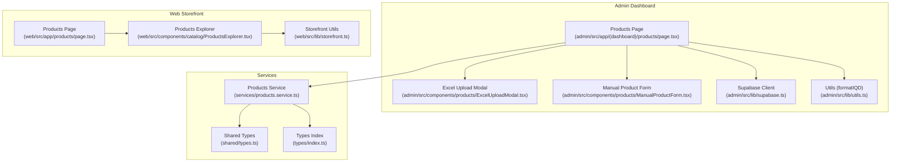
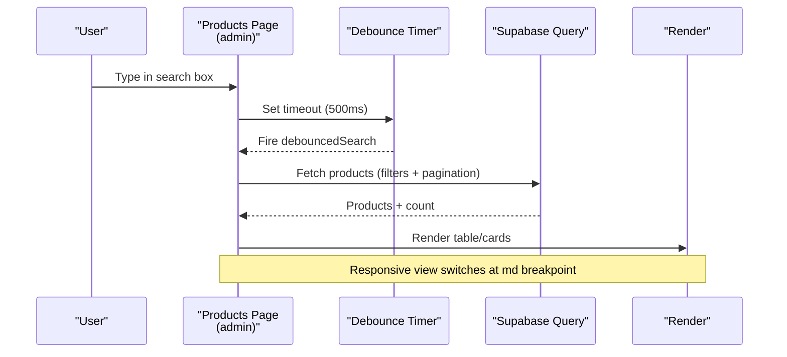
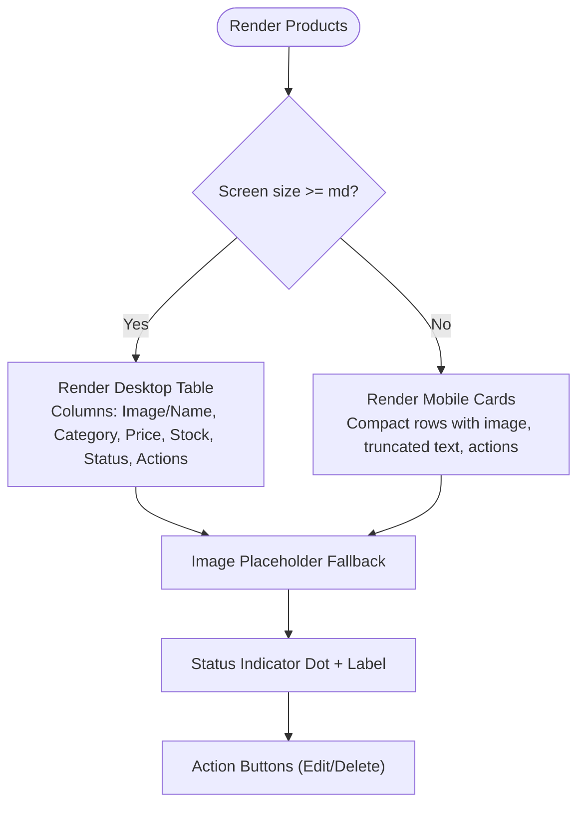
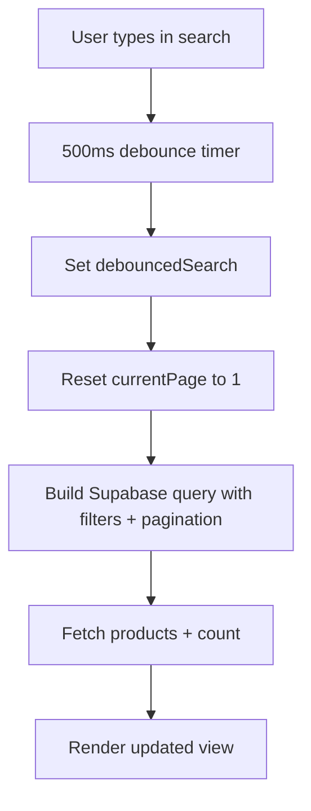
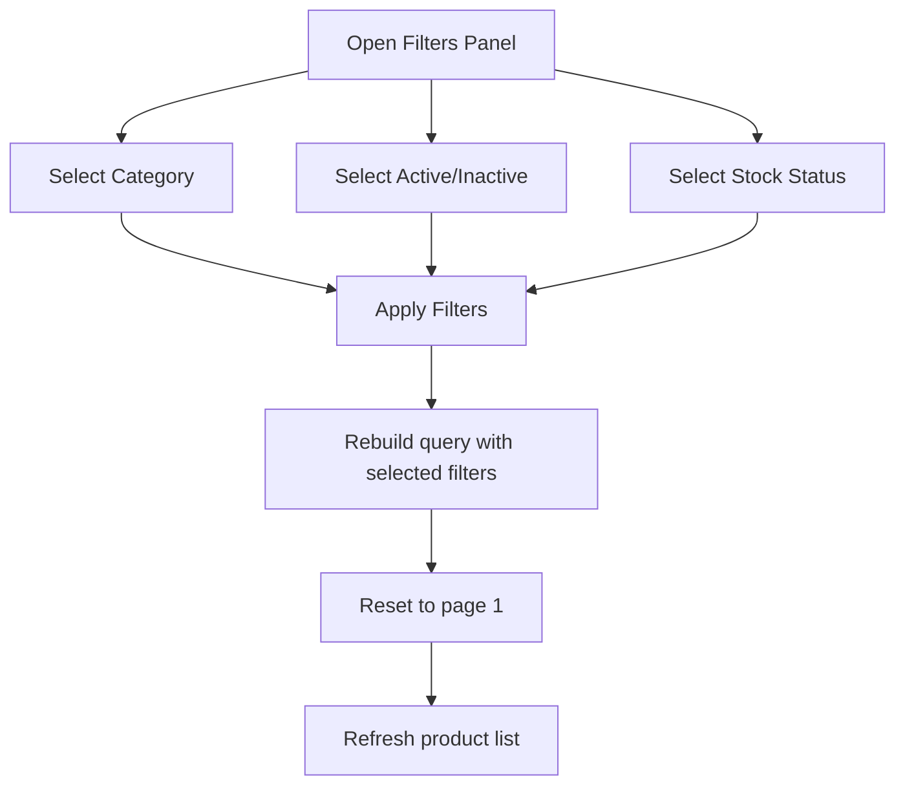
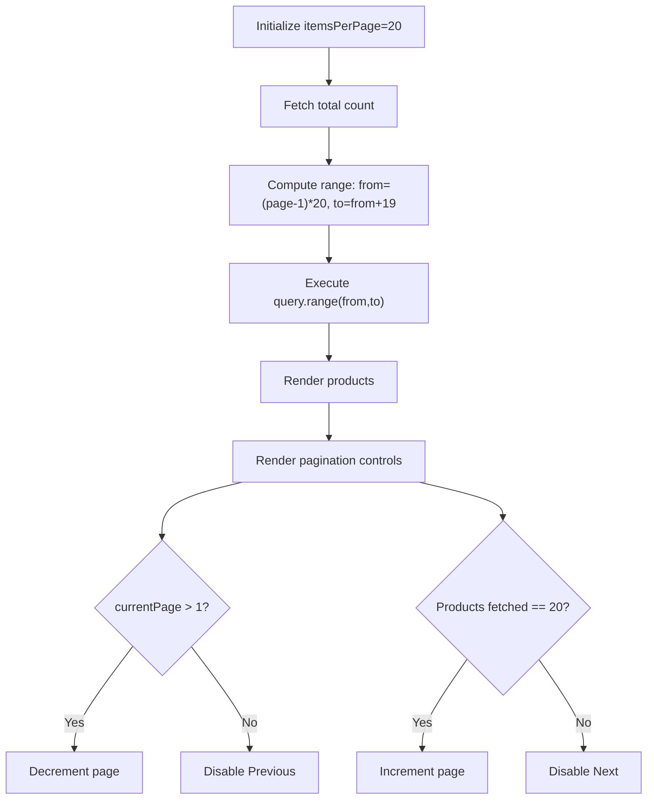
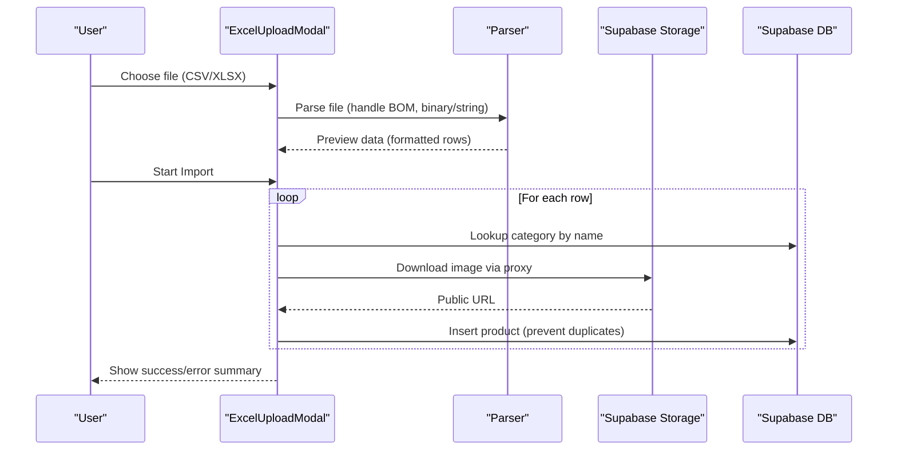
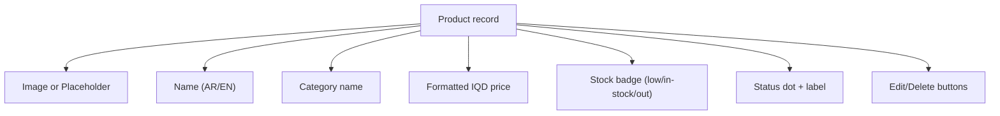
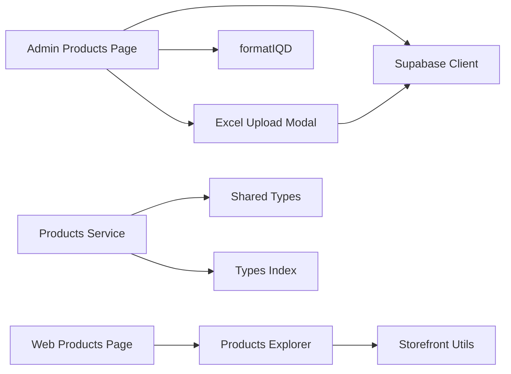

# Product Listing Interface

<cite>
**Referenced Files in This Document**
- [admin/src/app/(dashboard)/products/page.tsx](file://admin/src/app/(dashboard)/products/page.tsx)
- [admin/src/components/products/ExcelUploadModal.tsx](file://admin/src/components/products/ExcelUploadModal.tsx)
- [admin/src/components/products/ManualProductForm.tsx](file://admin/src/components/products/ManualProductForm.tsx)
- [admin/src/lib/utils.ts](file://admin/src/lib/utils.ts)
- [admin/src/lib/supabase.ts](file://admin/src/lib/supabase.ts)
- [services/products.service.ts](file://services/products.service.ts)
- [shared/types.ts](file://shared/types.ts)
- [types/index.ts](file://types/index.ts)
- [web/src/app/products/page.tsx](file://web/src/app/products/page.tsx)
- [web/src/components/catalog/ProductsExplorer.tsx](file://web/src/components/catalog/ProductsExplorer.tsx)
- [web/src/lib/storefront.ts](file://web/src/lib/storefront.ts)
</cite>

## Table of Contents
1. [Introduction](#introduction)
2. [Project Structure](#project-structure)
3. [Core Components](#core-components)
4. [Architecture Overview](#architecture-overview)
5. [Detailed Component Analysis](#detailed-component-analysis)
6. [Dependency Analysis](#dependency-analysis)
7. [Performance Considerations](#performance-considerations)
8. [Troubleshooting Guide](#troubleshooting-guide)
9. [Conclusion](#conclusion)

## Introduction
This document describes the product listing interface for the administration dashboard, focusing on the responsive table and card-based views, search with debounced input, advanced filtering (category, status, stock), pagination, bulk operations (Excel upload), and real-time display. It also covers performance optimization strategies for large catalogs and accessibility considerations for screen readers.

## Project Structure
The product listing interface spans two primary areas:
- Admin dashboard: server/client hybrid page with search, filters, pagination, and bulk operations
- Web storefront: client-side product explorer with search, filters, and responsive cards

**Diagram sources**
- [admin/src/app/(dashboard)/products/page.tsx](file://admin/src/app/(dashboard)/products/page.tsx#L13-L434)
- [admin/src/components/products/ExcelUploadModal.tsx:27-397](file://admin/src/components/products/ExcelUploadModal.tsx#L27-L397)
- [admin/src/components/products/ManualProductForm.tsx:13-254](file://admin/src/components/products/ManualProductForm.tsx#L13-L254)
- [admin/src/lib/supabase.ts:19-23](file://admin/src/lib/supabase.ts#L19-L23)
- [admin/src/lib/utils.ts:8-14](file://admin/src/lib/utils.ts#L8-L14)
- [services/products.service.ts:1-449](file://services/products.service.ts#L1-L449)
- [shared/types.ts:10-353](file://shared/types.ts#L10-L353)
- [types/index.ts:1-276](file://types/index.ts#L1-L276)
- [web/src/app/products/page.tsx:1-90](file://web/src/app/products/page.tsx#L1-L90)
- [web/src/components/catalog/ProductsExplorer.tsx:1-427](file://web/src/components/catalog/ProductsExplorer.tsx#L1-L427)
- [web/src/lib/storefront.ts:1-613](file://web/src/lib/storefront.ts#L1-L613)

**Section sources**
- [admin/src/app/(dashboard)/products/page.tsx](file://admin/src/app/(dashboard)/products/page.tsx#L13-L434)
- [web/src/app/products/page.tsx:1-90](file://web/src/app/products/page.tsx#L1-L90)

## Core Components
- Products listing page with responsive table and card view
- Debounced search across Arabic and English product names
- Advanced filters: category, active/inactive status, stock status
- Pagination with configurable items per page and intelligent navigation
- Bulk operations: Excel upload modal with progress and error reporting
- Real-time display: status indicators, image placeholders, responsive design
- Utilities: IQD formatting, Supabase client integration

**Section sources**
- [admin/src/app/(dashboard)/products/page.tsx](file://admin/src/app/(dashboard)/products/page.tsx#L13-L434)
- [admin/src/lib/utils.ts:8-14](file://admin/src/lib/utils.ts#L8-L14)
- [admin/src/lib/supabase.ts:19-23](file://admin/src/lib/supabase.ts#L19-L23)
- [admin/src/components/products/ExcelUploadModal.tsx:27-397](file://admin/src/components/products/ExcelUploadModal.tsx#L27-L397)

## Architecture Overview
The admin product listing integrates client-side state, debounced search, and Supabase queries. Filtering and pagination are handled client-side with server-backed data fetching. The web storefront mirrors search and filtering patterns with a card-based layout.

**Diagram sources**
- [admin/src/app/(dashboard)/products/page.tsx](file://admin/src/app/(dashboard)/products/page.tsx#L39-L92)

## Detailed Component Analysis

### Responsive Table and Card Views
- Desktop: Scrollable table with columns for product image/name, category, price, stock, status, and actions
- Mobile: Card-based layout with compact rows, truncated text, and action buttons
- Image placeholders: Fallback icons when no image URL is present
- Status indicators: Dot indicators and labels for active/inactive state
- Responsive breakpoints: Hidden table below medium screens, cards above

**Diagram sources**
- [admin/src/app/(dashboard)/products/page.tsx](file://admin/src/app/(dashboard)/products/page.tsx#L255-L361)

**Section sources**
- [admin/src/app/(dashboard)/products/page.tsx](file://admin/src/app/(dashboard)/products/page.tsx#L255-L361)

### Search Functionality with Debounced Input
- Debounce delay: 500 ms to reduce network requests during typing
- Multi-field search: Matches Arabic and English product names using OR conditions
- Reset page on search: Returns to first page when search term changes
- Clear filters: Resets search and clears active filters

**Diagram sources**
- [admin/src/app/(dashboard)/products/page.tsx](file://admin/src/app/(dashboard)/products/page.tsx#L39-L92)

**Section sources**
- [admin/src/app/(dashboard)/products/page.tsx](file://admin/src/app/(dashboard)/products/page.tsx#L39-L92)

### Advanced Filtering System
- Category-based filtering: Select category dropdown with active categories
- Active/inactive status: Option to filter by all, active, or inactive
- Stock status: Options for all, in-stock (>0), low stock (<10), out-of-stock (=0)
- Intelligent filter reset: Clears all filters and search, resets to first page
- Active filter indicator: Shows when any filter or search term is applied

**Diagram sources**
- [admin/src/app/(dashboard)/products/page.tsx](file://admin/src/app/(dashboard)/products/page.tsx#L195-L247)
- [admin/src/app/(dashboard)/products/page.tsx](file://admin/src/app/(dashboard)/products/page.tsx#L67-L81)

**Section sources**
- [admin/src/app/(dashboard)/products/page.tsx](file://admin/src/app/(dashboard)/products/page.tsx#L195-L247)
- [admin/src/app/(dashboard)/products/page.tsx](file://admin/src/app/(dashboard)/products/page.tsx#L67-L81)

### Pagination Implementation
- Items per page: Fixed at 20 per page
- Page range calculation: from=(page-1)*limit to from+limit-1
- Total count: Exact count from Supabase for accurate pagination
- Navigation: Previous/Next arrows with intelligent ellipsis for middle pages
- Page indices: Show first, last, and surrounding pages around current

**Diagram sources**
- [admin/src/app/(dashboard)/products/page.tsx](file://admin/src/app/(dashboard)/products/page.tsx#L23-L124)
- [admin/src/app/(dashboard)/products/page.tsx](file://admin/src/app/(dashboard)/products/page.tsx#L55-L83)
- [admin/src/app/(dashboard)/products/page.tsx](file://admin/src/app/(dashboard)/products/page.tsx#L376-L429)

**Section sources**
- [admin/src/app/(dashboard)/products/page.tsx](file://admin/src/app/(dashboard)/products/page.tsx#L23-L124)
- [admin/src/app/(dashboard)/products/page.tsx](file://admin/src/app/(dashboard)/products/page.tsx#L55-L83)
- [admin/src/app/(dashboard)/products/page.tsx](file://admin/src/app/(dashboard)/products/page.tsx#L376-L429)

### Bulk Operations: Excel Upload
- Modal workflow: Drag-and-drop or select Excel/CSV file
- Parsing: Handles CSV with UTF-8 BOM and XLS/XLSX via SheetJS
- Field mapping: Supports localized column names for Arabic/English
- Image processing: Downloads remote images via proxy and uploads to Supabase Storage
- Import pipeline: Iterates rows, finds category IDs, checks duplicates, inserts records
- Progress and errors: Tracks total/current/success and aggregates errors
- Success callback: Refreshes product list after successful import

**Diagram sources**
- [admin/src/components/products/ExcelUploadModal.tsx:47-255](file://admin/src/components/products/ExcelUploadModal.tsx#L47-L255)
- [admin/src/lib/supabase.ts:19-23](file://admin/src/lib/supabase.ts#L19-L23)

**Section sources**
- [admin/src/components/products/ExcelUploadModal.tsx:27-397](file://admin/src/components/products/ExcelUploadModal.tsx#L27-L397)

### Real-Time Product Display
- Status indicators: Green dot for active, gray for inactive
- Stock badges: Red for low stock (<10), green for in-stock (>0)
- Pricing: IQD formatted with Arabic locale
- Images: Lazy-loaded with Next.js Image; fallback icons when missing
- Loading states: Spinner and skeleton-like empty states
- Empty states: Distinct messages depending on active filters

**Diagram sources**
- [admin/src/app/(dashboard)/products/page.tsx](file://admin/src/app/(dashboard)/products/page.tsx#L269-L311)
- [admin/src/lib/utils.ts:8-14](file://admin/src/lib/utils.ts#L8-L14)

**Section sources**
- [admin/src/app/(dashboard)/products/page.tsx](file://admin/src/app/(dashboard)/products/page.tsx#L269-L311)
- [admin/src/lib/utils.ts:8-14](file://admin/src/lib/utils.ts#L8-L14)

### Web Storefront Similarities
- Client-side search and filters with URL param synchronization
- Responsive card grid with lazy-loading images
- Pagination controls and results messaging
- Price formatting and category labeling utilities

**Section sources**
- [web/src/app/products/page.tsx:1-90](file://web/src/app/products/page.tsx#L1-L90)
- [web/src/components/catalog/ProductsExplorer.tsx:1-427](file://web/src/components/catalog/ProductsExplorer.tsx#L1-L427)
- [web/src/lib/storefront.ts:527-572](file://web/src/lib/storefront.ts#L527-L572)

## Dependency Analysis
- Admin page depends on Supabase client and local utilities
- Services module centralizes database operations and types
- Web storefront reuses storefront utilities for formatting and translations
- Both layers share similar search/filter/pagination patterns

**Diagram sources**
- [admin/src/app/(dashboard)/products/page.tsx](file://admin/src/app/(dashboard)/products/page.tsx#L1-L12)
- [admin/src/lib/utils.ts:8-14](file://admin/src/lib/utils.ts#L8-L14)
- [admin/src/lib/supabase.ts:19-23](file://admin/src/lib/supabase.ts#L19-L23)
- [admin/src/components/products/ExcelUploadModal.tsx:1-7](file://admin/src/components/products/ExcelUploadModal.tsx#L1-L7)
- [services/products.service.ts:1-17](file://services/products.service.ts#L1-L17)
- [shared/types.ts:10-353](file://shared/types.ts#L10-L353)
- [types/index.ts:1-276](file://types/index.ts#L1-L276)
- [web/src/app/products/page.tsx:1-9](file://web/src/app/products/page.tsx#L1-L9)
- [web/src/components/catalog/ProductsExplorer.tsx:1-22](file://web/src/components/catalog/ProductsExplorer.tsx#L1-L22)
- [web/src/lib/storefront.ts:1-16](file://web/src/lib/storefront.ts#L1-L16)

**Section sources**
- [services/products.service.ts:1-449](file://services/products.service.ts#L1-L449)
- [shared/types.ts:10-353](file://shared/types.ts#L10-L353)
- [types/index.ts:1-276](file://types/index.ts#L1-L276)

## Performance Considerations
- Debounced search: Limits frequent queries; tune delay based on dataset size
- Field selection: Prefer minimal fields for listings; load full details on demand
- Pagination: Always use range queries and exact counts for predictable rendering
- Image optimization: Use Next.js Image with appropriate sizes and lazy loading
- Batch operations: Excel import processes sequentially; consider worker threads for very large files
- Caching: Reuse filtered results when filters change minimally
- Virtualization: For very large lists, consider virtualized lists to reduce DOM nodes

## Troubleshooting Guide
- Search not updating: Verify debounce timer and that debouncedSearch triggers fetch
- Filters not applying: Confirm filter state updates and query builder conditions
- Pagination issues: Ensure count matches items returned; check range boundaries
- Excel upload failures: Inspect error logs for storage upload or duplicate detection
- Image placeholders: Verify image URLs and proxy availability
- Formatting inconsistencies: Confirm IQD formatting locale and fallbacks

**Section sources**
- [admin/src/app/(dashboard)/products/page.tsx](file://admin/src/app/(dashboard)/products/page.tsx#L39-L92)
- [admin/src/components/products/ExcelUploadModal.tsx:177-255](file://admin/src/components/products/ExcelUploadModal.tsx#L177-L255)

## Conclusion
The product listing interface combines responsive design, efficient search and filtering, robust pagination, and powerful bulk operations. By leveraging debounced inputs, precise Supabase queries, and structured utilities, it delivers a scalable and accessible experience for managing large product catalogs.