# Product Management

<cite>
**Referenced Files in This Document**
- [AIProductForm.tsx](file://admin/src/components/products/AIProductForm.tsx)
- [ManualProductForm.tsx](file://admin/src/components/products/ManualProductForm.tsx)
- [route.ts (AI Analyze Product)](file://admin/src/app/api/ai/analyze-product/route.ts)
- [route.ts (Remove Background)](file://admin/src/app/api/ai/remove-background/route.ts)
- [route.ts (Proxy Image)](file://admin/src/app/api/proxy-image/route.ts)
- [products.service.ts](file://services/products.service.ts)
- [categories.service.ts](file://services/categories.service.ts)
- [types.ts](file://shared/types.ts)
- [products page.tsx](file://admin/src/app/(dashboard)/products/page.tsx)
- [search.tsx](file://app/search.tsx)
- [useCatalogSearch.ts](file://web/src/components/search/useCatalogSearch.ts)
- [middleware.ts](file://admin/src/middleware.ts)
- [utils.ts](file://admin/src/lib/utils.ts)
</cite>

## Table of Contents
1. [Introduction](#introduction)
2. [Project Structure](#project-structure)
3. [Core Components](#core-components)
4. [Architecture Overview](#architecture-overview)
5. [Detailed Component Analysis](#detailed-component-analysis)
6. [Dependency Analysis](#dependency-analysis)
7. [Performance Considerations](#performance-considerations)
8. [Troubleshooting Guide](#troubleshooting-guide)
9. [Conclusion](#conclusion)
10. [Appendices](#appendices)

## Introduction
This document describes the product management system covering product listing, filtering, sorting, bulk operations, creation via manual entry and AI-powered analysis, editing with validation and preview, AI product analysis using Gemini via OpenRouter, background removal using Replicate, image upload/storage/CDN integration, categorization, pricing/inventory, search and advanced filtering, publishing/approval workflows, and guidance for optimizing product data quality and managing variations.

## Project Structure
The product management system spans:
- Admin dashboard pages and forms for product creation and listing
- Backend API routes for AI analysis and background removal
- Services for product and category queries
- Shared types for database entities and filters
- Client-side search implementations for mobile and web
- Middleware enforcing authentication and role-based access

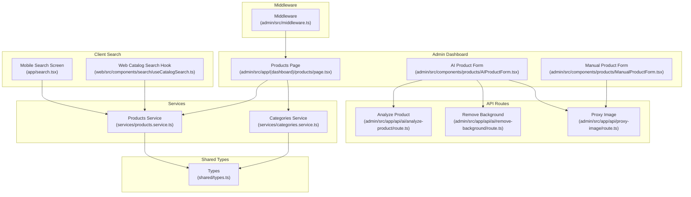

**Diagram sources**
- [products page.tsx](file://admin/src/app/(dashboard)/products/page.tsx#L1-L435)
- [AIProductForm.tsx:1-670](file://admin/src/components/products/AIProductForm.tsx#L1-L670)
- [ManualProductForm.tsx:1-255](file://admin/src/components/products/ManualProductForm.tsx#L1-L255)
- [route.ts (AI Analyze Product):1-221](file://admin/src/app/api/ai/analyze-product/route.ts#L1-L221)
- [route.ts (Remove Background):1-152](file://admin/src/app/api/ai/remove-background/route.ts#L1-L152)
- [route.ts (Proxy Image):1-42](file://admin/src/app/api/proxy-image/route.ts#L1-L42)
- [products.service.ts:1-449](file://services/products.service.ts#L1-L449)
- [categories.service.ts:1-137](file://services/categories.service.ts#L1-L137)
- [types.ts:1-353](file://shared/types.ts#L1-L353)
- [search.tsx:1-192](file://app/search.tsx#L1-L192)
- [useCatalogSearch.ts:1-114](file://web/src/components/search/useCatalogSearch.ts#L1-L114)
- [middleware.ts:1-122](file://admin/src/middleware.ts#L1-L122)

**Section sources**
- [products page.tsx](file://admin/src/app/(dashboard)/products/page.tsx#L1-L435)
- [AIProductForm.tsx:1-670](file://admin/src/components/products/AIProductForm.tsx#L1-L670)
- [ManualProductForm.tsx:1-255](file://admin/src/components/products/ManualProductForm.tsx#L1-L255)
- [route.ts (AI Analyze Product):1-221](file://admin/src/app/api/ai/analyze-product/route.ts#L1-L221)
- [route.ts (Remove Background):1-152](file://admin/src/app/api/ai/remove-background/route.ts#L1-L152)
- [route.ts (Proxy Image):1-42](file://admin/src/app/api/proxy-image/route.ts#L1-L42)
- [products.service.ts:1-449](file://services/products.service.ts#L1-L449)
- [categories.service.ts:1-137](file://services/categories.service.ts#L1-L137)
- [types.ts:1-353](file://shared/types.ts#L1-L353)
- [search.tsx:1-192](file://app/search.tsx#L1-L192)
- [useCatalogSearch.ts:1-114](file://web/src/components/search/useCatalogSearch.ts#L1-L114)
- [middleware.ts:1-122](file://admin/src/middleware.ts#L1-L122)

## Core Components
- Product listing with search, filters, pagination, and actions
- Manual product creation with image upload and validation
- AI-powered product creation with image analysis and background removal
- Client-side search implementations for mobile and web
- Services for product/category queries and filtering/sorting
- Middleware for authentication and role-based access control

**Section sources**
- [products page.tsx](file://admin/src/app/(dashboard)/products/page.tsx#L13-L435)
- [ManualProductForm.tsx:13-255](file://admin/src/components/products/ManualProductForm.tsx#L13-L255)
- [AIProductForm.tsx:12-670](file://admin/src/components/products/AIProductForm.tsx#L12-L670)
- [products.service.ts:18-449](file://services/products.service.ts#L18-L449)
- [categories.service.ts:12-137](file://services/categories.service.ts#L12-L137)
- [middleware.ts:57-105](file://admin/src/middleware.ts#L57-L105)

## Architecture Overview
The system integrates client dashboards with backend API routes and Supabase for data and storage. AI analysis uses OpenRouter with Gemini; background removal uses Replicate. Image uploads leverage Supabase Storage with CDN-backed public URLs. Filtering and sorting are handled by service functions and Supabase queries.

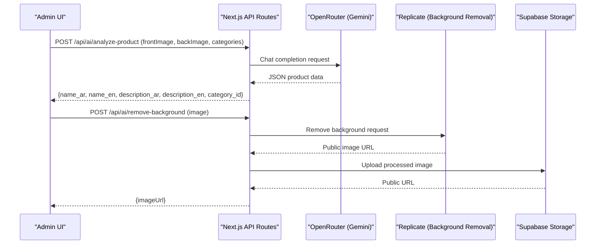

**Diagram sources**
- [route.ts (AI Analyze Product):71-221](file://admin/src/app/api/ai/analyze-product/route.ts#L71-L221)
- [route.ts (Remove Background):12-152](file://admin/src/app/api/ai/remove-background/route.ts#L12-L152)
- [AIProductForm.tsx:94-199](file://admin/src/components/products/AIProductForm.tsx#L94-L199)

## Detailed Component Analysis

### Product Listing Interface (Filtering, Sorting, Pagination)
- Provides search across Arabic and English names
- Filters by category, activity status, and stock status
- Pagination with range queries
- Sorting is implemented in services for category-specific listings
- Actions include edit and delete

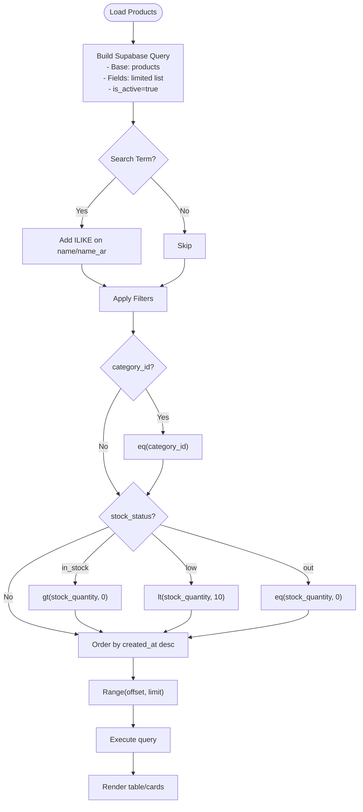

**Diagram sources**
- [products page.tsx](file://admin/src/app/(dashboard)/products/page.tsx#L52-L92)
- [products.service.ts:279-309](file://services/products.service.ts#L279-L309)

**Section sources**
- [products page.tsx](file://admin/src/app/(dashboard)/products/page.tsx#L13-L435)
- [products.service.ts:18-449](file://services/products.service.ts#L18-L449)

### Product Creation: Manual Entry Form
- Collects product details in Arabic and English
- Validates presence of required fields
- Uploads images to Supabase Storage and obtains public URL
- Inserts product record with IQD/USD conversion and default active status

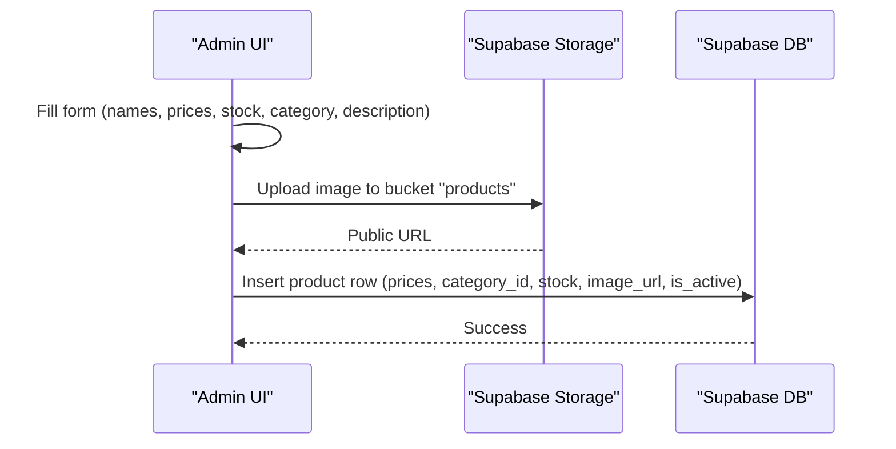

**Diagram sources**
- [ManualProductForm.tsx:40-115](file://admin/src/components/products/ManualProductForm.tsx#L40-L115)
- [utils.ts:8-14](file://admin/src/lib/utils.ts#L8-L14)

**Section sources**
- [ManualProductForm.tsx:13-255](file://admin/src/components/products/ManualProductForm.tsx#L13-L255)
- [utils.ts:8-14](file://admin/src/lib/utils.ts#L8-L14)

### Product Creation: AI-Powered Analysis and Background Removal
- Requires front/back images
- Calls OpenRouter/Gemini to extract product metadata
- Optionally removes background via Replicate and uploads processed image
- Falls back to original image if background removal fails
- Submits validated product data to database

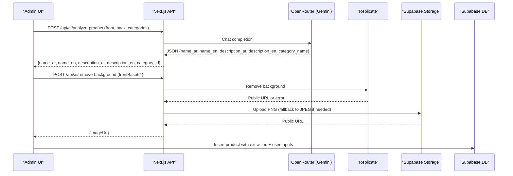

**Diagram sources**
- [AIProductForm.tsx:76-199](file://admin/src/components/products/AIProductForm.tsx#L76-L199)
- [route.ts (AI Analyze Product):71-221](file://admin/src/app/api/ai/analyze-product/route.ts#L71-L221)
- [route.ts (Remove Background):12-152](file://admin/src/app/api/ai/remove-background/route.ts#L12-L152)

**Section sources**
- [AIProductForm.tsx:12-670](file://admin/src/components/products/AIProductForm.tsx#L12-L670)
- [route.ts (AI Analyze Product):71-221](file://admin/src/app/api/ai/analyze-product/route.ts#L71-L221)
- [route.ts (Remove Background):12-152](file://admin/src/app/api/ai/remove-background/route.ts#L12-L152)

### Editing Functionality and Validation
- Manual form validates required fields and numeric constraints
- AI form validates completeness before submission
- Uses Supabase insert/update operations
- Real-time preview of images and extracted metadata

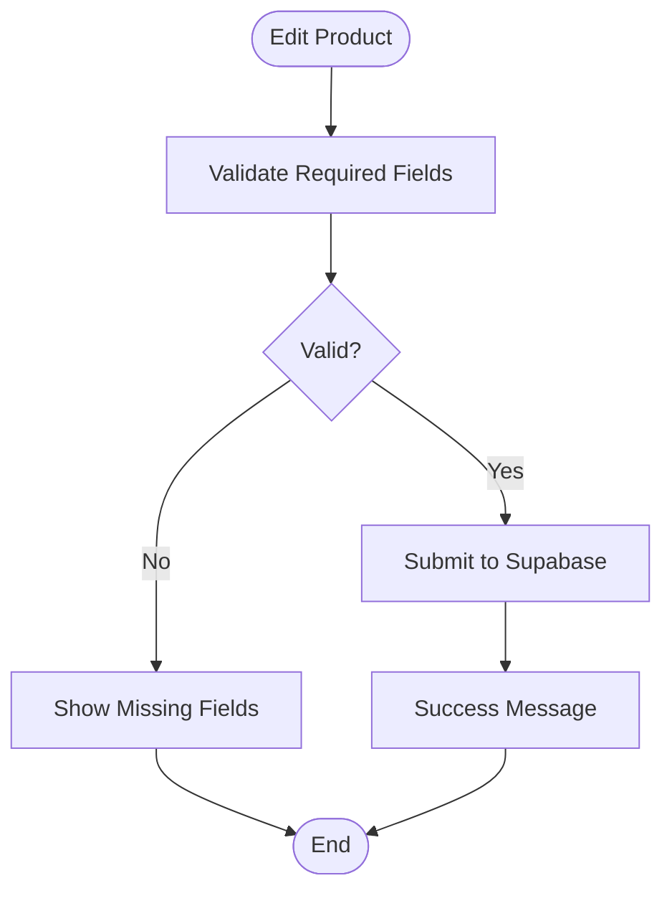

**Diagram sources**
- [ManualProductForm.tsx:89-115](file://admin/src/components/products/ManualProductForm.tsx#L89-L115)
- [AIProductForm.tsx:236-278](file://admin/src/components/products/AIProductForm.tsx#L236-L278)

**Section sources**
- [ManualProductForm.tsx:89-115](file://admin/src/components/products/ManualProductForm.tsx#L89-L115)
- [AIProductForm.tsx:236-278](file://admin/src/components/products/AIProductForm.tsx#L236-L278)

### AI Product Analysis Workflow (OpenRouter + Gemini)
- Uses OpenRouter chat completions with a structured prompt
- Parses JSON from model response with robust fallback
- Selects category by best match against configured categories
- Returns extracted product metadata for UI to review and save

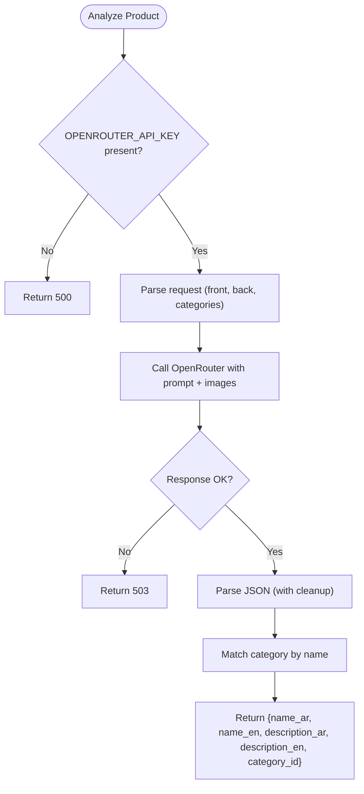

**Diagram sources**
- [route.ts (AI Analyze Product):71-221](file://admin/src/app/api/ai/analyze-product/route.ts#L71-L221)

**Section sources**
- [route.ts (AI Analyze Product):71-221](file://admin/src/app/api/ai/analyze-product/route.ts#L71-L221)

### Background Removal (Replicate + Fallback)
- Attempts Replicate background removal with PNG output
- Fetches remote processed image and re-uploads to Supabase Storage
- Falls back to original image if processing fails
- Returns public URL for immediate preview and saving

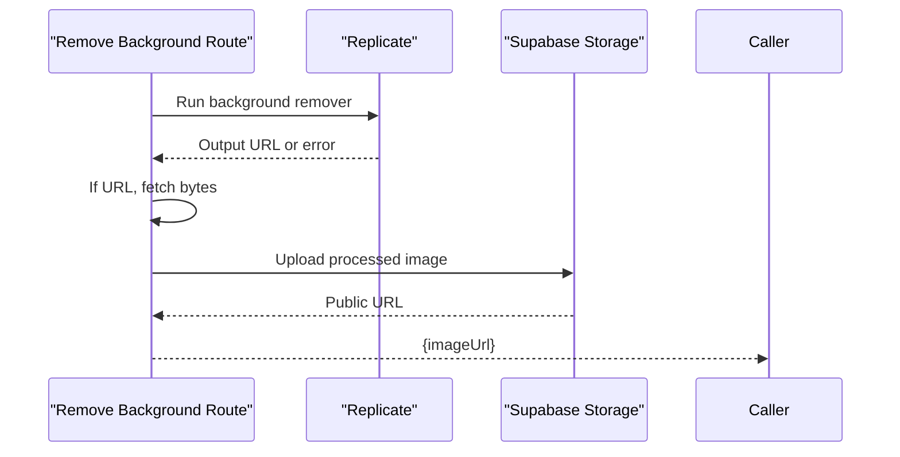

**Diagram sources**
- [route.ts (Remove Background):12-152](file://admin/src/app/api/ai/remove-background/route.ts#L12-L152)

**Section sources**
- [route.ts (Remove Background):12-152](file://admin/src/app/api/ai/remove-background/route.ts#L12-L152)

### Image Upload, Storage, and CDN Integration
- Mobile and web forms upload images to Supabase Storage bucket "products"
- Public URLs are generated and used for previews and product records
- Proxy route supports fetching external images when needed

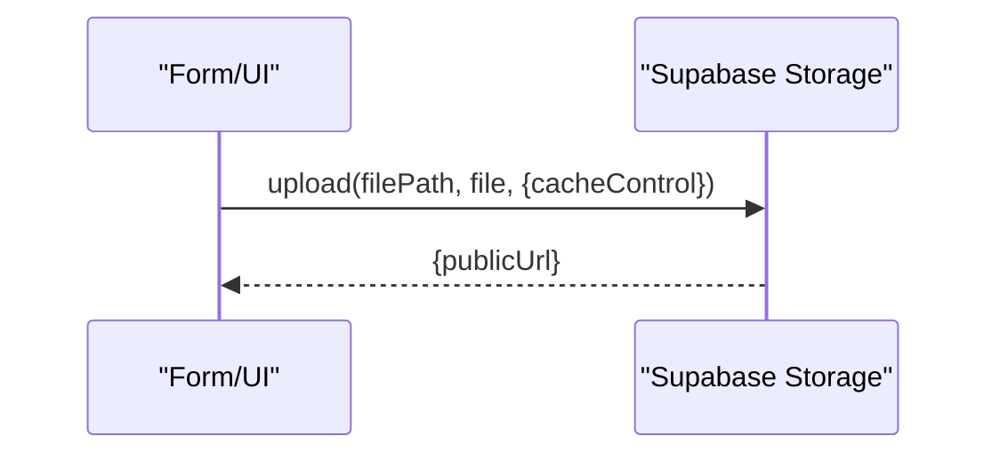

**Diagram sources**
- [ManualProductForm.tsx:64-72](file://admin/src/components/products/ManualProductForm.tsx#L64-L72)
- [route.ts (Proxy Image):4-42](file://admin/src/app/api/proxy-image/route.ts#L4-L42)

**Section sources**
- [ManualProductForm.tsx:64-82](file://admin/src/components/products/ManualProductForm.tsx#L64-L82)
- [route.ts (Proxy Image):4-42](file://admin/src/app/api/proxy-image/route.ts#L4-L42)

### Categorization, Pricing, and Inventory
- Categories are fetched from Supabase and used for selection and display
- Pricing is stored in IQD with USD conversion
- Inventory tracked via stock_quantity; low/out-of-stock indicators
- Sorting and filtering supported in services for category views

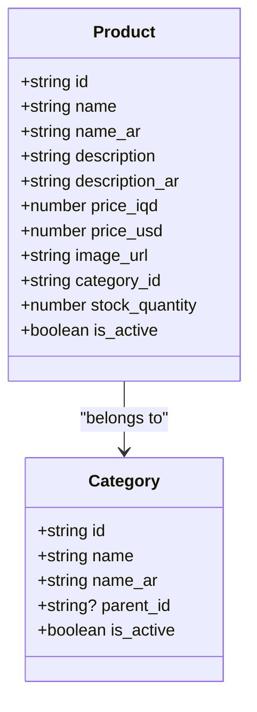

**Diagram sources**
- [types.ts:13-48](file://shared/types.ts#L13-L48)
- [categories.service.ts:12-48](file://services/categories.service.ts#L12-L48)
- [products.service.ts:18-42](file://services/products.service.ts#L18-L42)

**Section sources**
- [categories.service.ts:12-137](file://services/categories.service.ts#L12-L137)
- [products.service.ts:18-449](file://services/products.service.ts#L18-L449)
- [types.ts:13-48](file://shared/types.ts#L13-L48)

### Product Search and Advanced Filtering
- Mobile search debounces input and queries Supabase ILIKE on both names
- Web search hook syncs query param and navigates to filtered product catalog
- Services implement advanced filters (price range, stock, category) and sorting

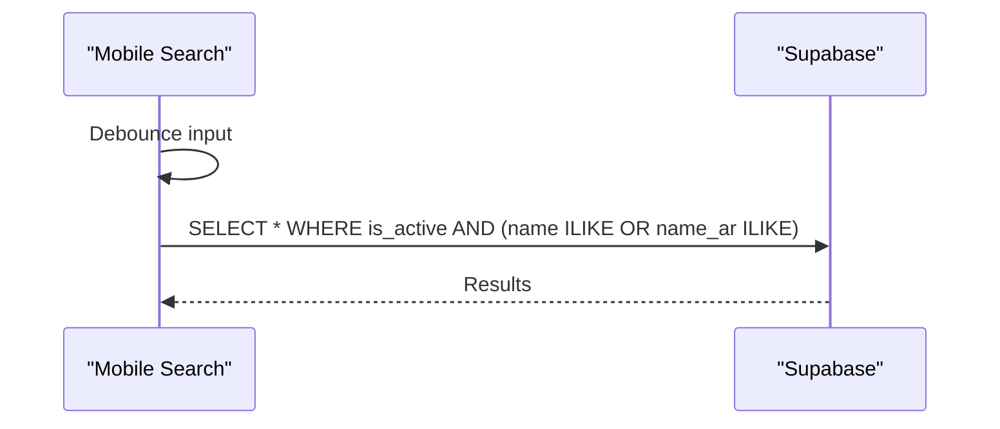

**Diagram sources**
- [search.tsx:22-51](file://app/search.tsx#L22-L51)
- [useCatalogSearch.ts:44-85](file://web/src/components/search/useCatalogSearch.ts#L44-L85)
- [products.service.ts:264-309](file://services/products.service.ts#L264-L309)

**Section sources**
- [search.tsx:12-192](file://app/search.tsx#L12-L192)
- [useCatalogSearch.ts:29-113](file://web/src/components/search/useCatalogSearch.ts#L29-L113)
- [products.service.ts:264-379](file://services/products.service.ts#L264-L379)

### Publishing Workflows, Approval Processes, and Status Management
- Product activation controlled by is_active flag
- Admin dashboard lists active/inactive products and allows deletion
- Middleware enforces authentication and role-based access for product managers
- No explicit approval workflow is implemented in the reviewed code

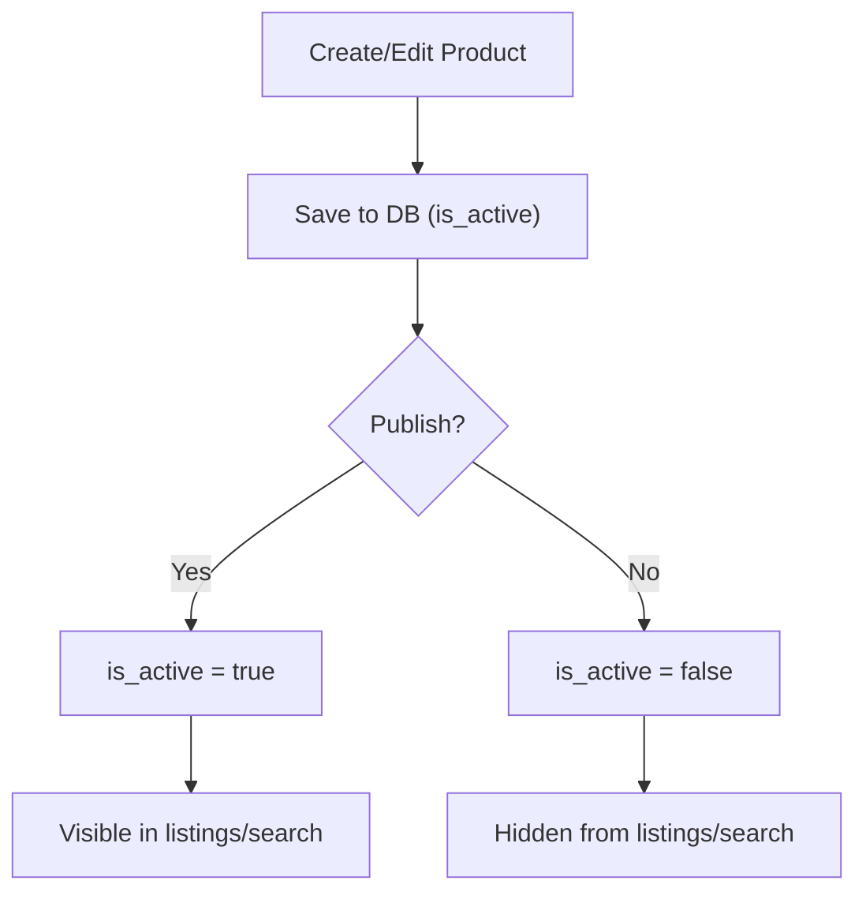

**Diagram sources**
- [products page.tsx](file://admin/src/app/(dashboard)/products/page.tsx#L94-L108)
- [middleware.ts:73-105](file://admin/src/middleware.ts#L73-L105)

**Section sources**
- [products page.tsx](file://admin/src/app/(dashboard)/products/page.tsx#L94-L108)
- [middleware.ts:73-105](file://admin/src/middleware.ts#L73-L105)

### Managing Variations and Bulk Operations
- No explicit product variation model or bulk edit/delete UI is present in the reviewed code
- The listing page supports single-item delete; bulk operations would require additional UI and backend endpoints

**Section sources**
- [products page.tsx](file://admin/src/app/(dashboard)/products/page.tsx#L94-L108)

## Dependency Analysis
- UI components depend on Supabase client for reads/writes
- API routes depend on third-party services (OpenRouter, Replicate)
- Services encapsulate Supabase queries and expose typed functions
- Middleware ensures protected routes and role restrictions

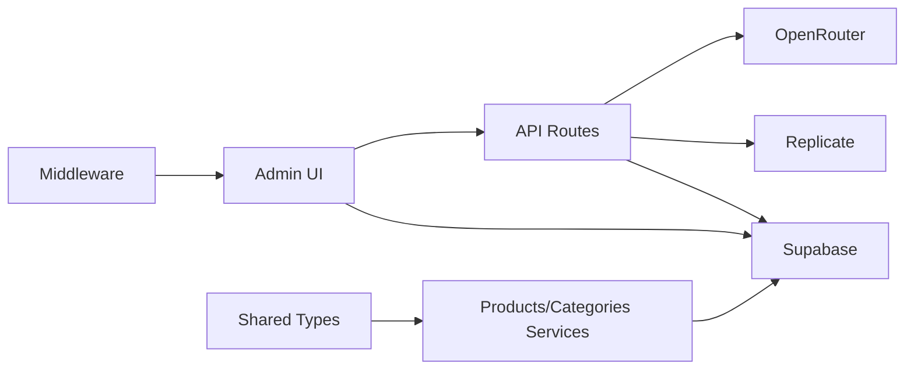

**Diagram sources**
- [route.ts (AI Analyze Product):18-50](file://admin/src/app/api/ai/analyze-product/route.ts#L18-L50)
- [route.ts (Remove Background):34-51](file://admin/src/app/api/ai/remove-background/route.ts#L34-L51)
- [products.service.ts:18-42](file://services/products.service.ts#L18-L42)
- [categories.service.ts:12-48](file://services/categories.service.ts#L12-L48)
- [middleware.ts:57-105](file://admin/src/middleware.ts#L57-L105)

**Section sources**
- [route.ts (AI Analyze Product):1-221](file://admin/src/app/api/ai/analyze-product/route.ts#L1-L221)
- [route.ts (Remove Background):1-152](file://admin/src/app/api/ai/remove-background/route.ts#L1-L152)
- [products.service.ts:1-449](file://services/products.service.ts#L1-L449)
- [categories.service.ts:1-137](file://services/categories.service.ts#L1-L137)
- [middleware.ts:1-122](file://admin/src/middleware.ts#L1-L122)

## Performance Considerations
- Use limited field selection for product lists to reduce payload size
- Apply server-side filters and pagination to avoid large result sets
- Debounce search inputs to minimize network requests
- Compress images before upload to reduce bandwidth and storage costs
- Cache frequently accessed category lists on the client

## Troubleshooting Guide
- AI Analysis Failures
  - Verify OPENROUTER_API_KEY is set
  - Check model availability and rate limits
  - Inspect response parsing and fallback logic
- Background Removal Failures
  - Confirm REPLICATE_API_TOKEN is set
  - Validate image format and size
  - Review fallback to original image behavior
- Authentication and Access Control
  - Ensure session exists and user role is correct
  - Products manager role is restricted to allowed paths

**Section sources**
- [route.ts (AI Analyze Product):75-80](file://admin/src/app/api/ai/analyze-product/route.ts#L75-L80)
- [route.ts (Remove Background):10-11](file://admin/src/app/api/ai/remove-background/route.ts#L10-L11)
- [middleware.ts:57-105](file://admin/src/middleware.ts#L57-L105)

## Conclusion
The product management system provides a robust foundation for listing, creating, and maintaining product data with AI-assisted extraction and background removal. It leverages Supabase for data and storage, implements strong filtering and search capabilities, and enforces authentication and role-based access. Extending the system with explicit approval workflows, bulk operations, and product variations would further enhance administrative efficiency.

## Appendices
- Data Model Overview

```mermaid
erDiagram
PRODUCTS {
string id PK
string name
string name_ar
string description
string description_ar
number price_iqd
number price_usd
string image_url
string category_id FK
number stock_quantity
boolean is_active
timestamp created_at
timestamp updated_at
}
CATEGORIES {
string id PK
string name
string name_ar
string? parent_id FK
boolean is_active
number sort_order
timestamp created_at
timestamp updated_at
}
PRODUCTS }o--|| CATEGORIES : "belongs to"
```

**Diagram sources**
- [types.ts:13-48](file://shared/types.ts#L13-L48)