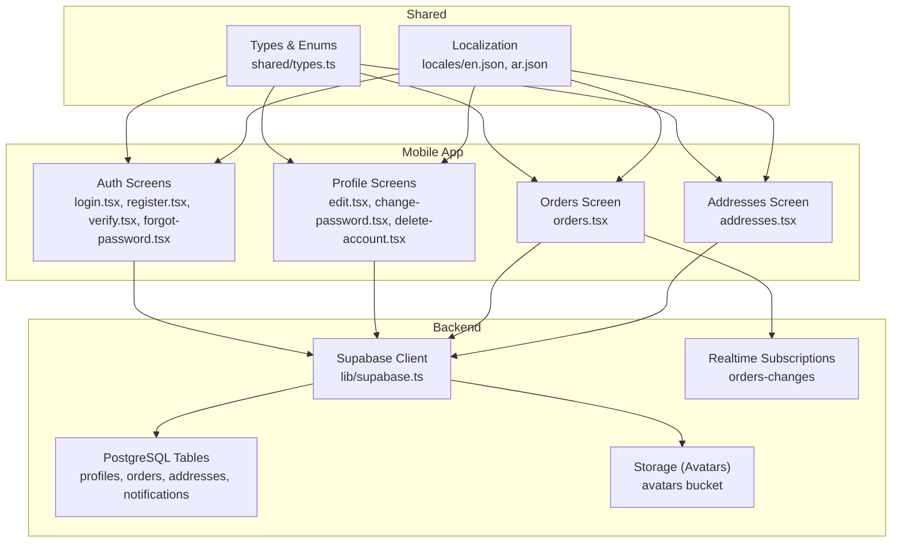
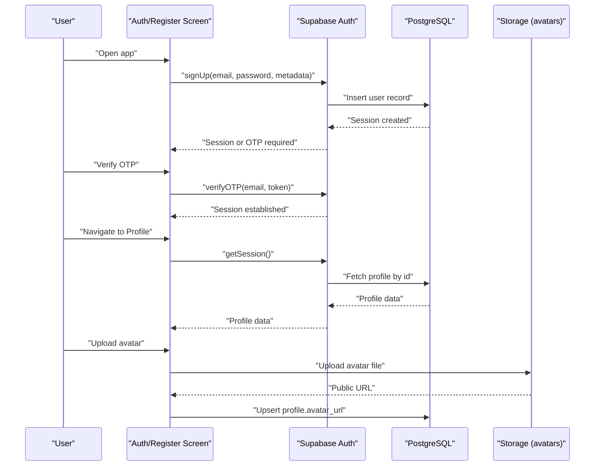
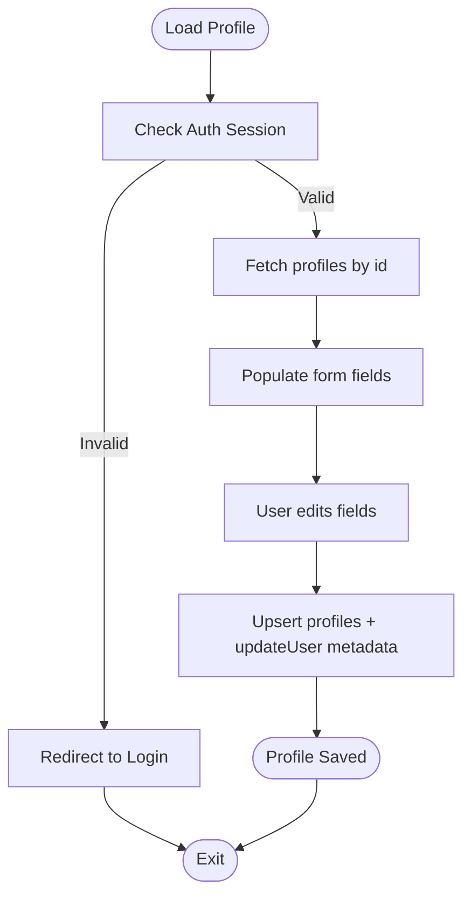
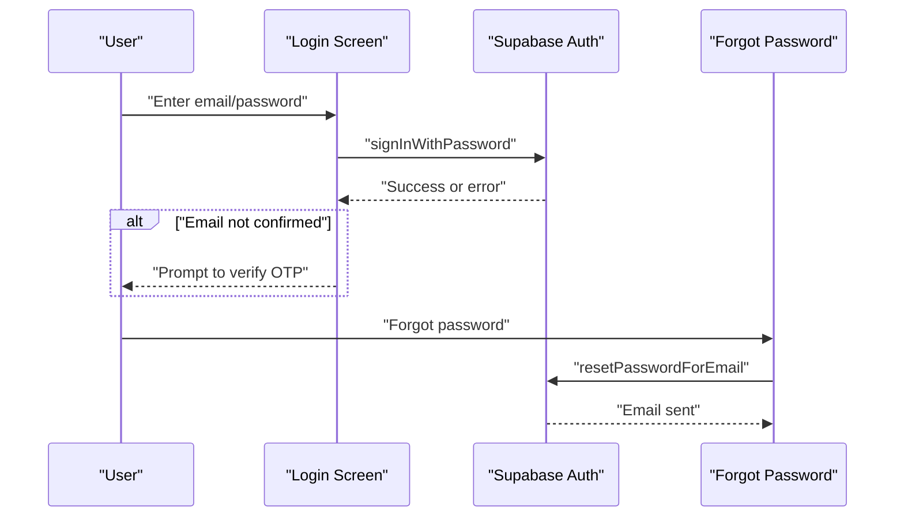
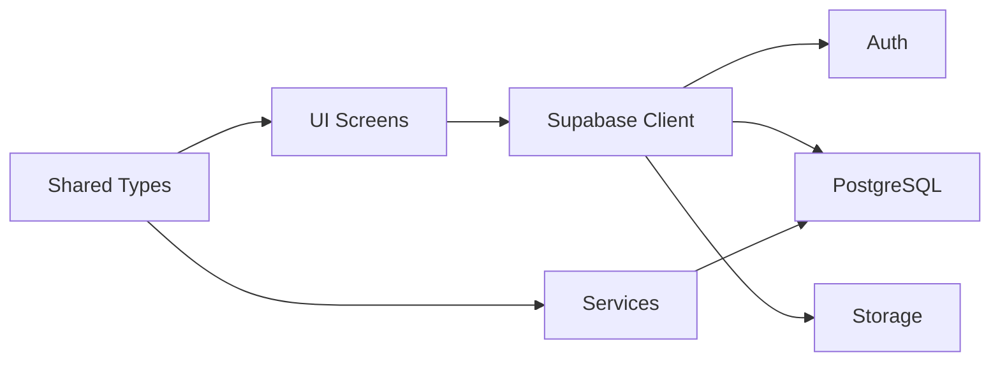

# User Management

<cite>
**Referenced Files in This Document**
- [app/profile/edit.tsx](file://app/profile/edit.tsx)
- [app/profile/change-password.tsx](file://app/profile/change-password.tsx)
- [app/profile/delete-account.tsx](file://app/profile/delete-account.tsx)
- [app/orders.tsx](file://app/orders.tsx)
- [services/orders.service.ts](file://services/orders.service.ts)
- [app/addresses.tsx](file://app/addresses.tsx)
- [app/auth/login.tsx](file://app/auth/login.tsx)
- [app/auth/register.tsx](file://app/auth/register.tsx)
- [app/auth/forgot-password.tsx](file://app/auth/forgot-password.tsx)
- [app/auth/verify.tsx](file://app/auth/verify.tsx)
- [lib/supabase.ts](file://lib/supabase.ts)
- [hooks/useSupabase.ts](file://hooks/useSupabase.ts)
- [shared/types.ts](file://shared/types.ts)
- [locales/en.json](file://locales/en.json)
- [locales/ar.json](file://locales/ar.json)
</cite>

## Table of Contents
1. [Introduction](#introduction)
2. [Project Structure](#project-structure)
3. [Core Components](#core-components)
4. [Architecture Overview](#architecture-overview)
5. [Detailed Component Analysis](#detailed-component-analysis)
6. [Dependency Analysis](#dependency-analysis)
7. [Performance Considerations](#performance-considerations)
8. [Troubleshooting Guide](#troubleshooting-guide)
9. [Conclusion](#conclusion)
10. [Appendices](#appendices)

## Introduction
This document explains the user management system for the Amal Center platform. It covers how customers are listed and filtered, how user profiles are managed (personal information, address book, order history), role and permission handling, activity monitoring, login history, security features, segmentation and targeting for marketing, communication tools, analytics, deactivation and privacy compliance, and guidance for onboarding and retention.

## Project Structure
The user management system spans three primary areas:
- Frontend mobile app screens for authentication, profile editing, orders, and addresses
- Backend integration via Supabase (authentication, real-time, storage)
- Shared types and localization for consistent UX and data modeling

**Diagram sources**
- [lib/supabase.ts:1-30](file://lib/supabase.ts#L1-L30)
- [shared/types.ts:10-211](file://shared/types.ts#L10-L211)
- [app/auth/login.tsx:1-171](file://app/auth/login.tsx#L1-L171)
- [app/auth/register.tsx:1-324](file://app/auth/register.tsx#L1-L324)
- [app/auth/verify.tsx:1-145](file://app/auth/verify.tsx#L1-L145)
- [app/auth/forgot-password.tsx:1-134](file://app/auth/forgot-password.tsx#L1-L134)
- [app/profile/edit.tsx:1-634](file://app/profile/edit.tsx#L1-L634)
- [app/profile/change-password.tsx:1-372](file://app/profile/change-password.tsx#L1-L372)
- [app/profile/delete-account.tsx:1-193](file://app/profile/delete-account.tsx#L1-L193)
- [app/orders.tsx:1-516](file://app/orders.tsx#L1-L516)
- [app/addresses.tsx:1-355](file://app/addresses.tsx#L1-L355)

**Section sources**
- [lib/supabase.ts:1-30](file://lib/supabase.ts#L1-L30)
- [shared/types.ts:10-211](file://shared/types.ts#L10-L211)

## Core Components
- Authentication and session management via Supabase Auth
- Real-time order updates for active order tracking
- Profile management (personal info, avatar, password change, account deletion)
- Address book with default selection and CRUD operations
- Order history retrieval and display
- Localization for Arabic and English

**Section sources**
- [app/auth/login.tsx:1-171](file://app/auth/login.tsx#L1-L171)
- [app/auth/register.tsx:1-324](file://app/auth/register.tsx#L1-L324)
- [app/auth/verify.tsx:1-145](file://app/auth/verify.tsx#L1-L145)
- [app/auth/forgot-password.tsx:1-134](file://app/auth/forgot-password.tsx#L1-L134)
- [app/profile/edit.tsx:1-634](file://app/profile/edit.tsx#L1-L634)
- [app/profile/change-password.tsx:1-372](file://app/profile/change-password.tsx#L1-L372)
- [app/profile/delete-account.tsx:1-193](file://app/profile/delete-account.tsx#L1-L193)
- [app/orders.tsx:1-516](file://app/orders.tsx#L1-L516)
- [app/addresses.tsx:1-355](file://app/addresses.tsx#L1-L355)
- [lib/supabase.ts:1-30](file://lib/supabase.ts#L1-L30)
- [shared/types.ts:132-154](file://shared/types.ts#L132-L154)

## Architecture Overview
The system integrates frontend screens with Supabase for authentication, data persistence, storage, and real-time subscriptions. Shared types define database entities and enums used across screens and services.

**Diagram sources**
- [app/auth/register.tsx:92-149](file://app/auth/register.tsx#L92-L149)
- [app/auth/verify.tsx:43-71](file://app/auth/verify.tsx#L43-L71)
- [app/profile/edit.tsx:158-222](file://app/profile/edit.tsx#L158-L222)
- [lib/supabase.ts:1-30](file://lib/supabase.ts#L1-L30)
- [shared/types.ts:132-154](file://shared/types.ts#L132-L154)

## Detailed Component Analysis

### Customer Listing and Filtering
- Current capability: The mobile app exposes a user profile screen and order listing. There is no dedicated customer listing page in the provided files.
- Filtering supported by existing screens:
  - Orders: Active vs History tabs; status-based grouping; currency formatting; relative timestamps.
  - No explicit filters for registration date, activity status, or purchase history are present in the order listing.
- Recommendation: To implement customer listing with filters, introduce a dedicated admin/customer listing page that queries the profiles table and supports:
  - Registration date range
  - Role-based filtering (customer, admin, products_manager)
  - Purchase history filters (total spent, order count, last order date)
  - Activity status indicators (last seen, login frequency)

**Section sources**
- [app/orders.tsx:28-118](file://app/orders.tsx#L28-L118)
- [shared/types.ts:132-154](file://shared/types.ts#L132-L154)

### User Profile Management
- Personal Information
  - Editable fields: full name, phone, avatar.
  - Validation ensures minimum length for name and Iraqi phone format.
  - Updates both the profiles table and user metadata for consistency.
- Address Book
  - Lists saved addresses with default selection toggle.
  - Supports setting default address and deleting entries.
- Order History
  - Displays orders grouped by active/history tabs.
  - Real-time updates via Postgres realtime for order changes.
  - Status progression visualization and currency formatting.

**Diagram sources**
- [app/profile/edit.tsx:57-104](file://app/profile/edit.tsx#L57-L104)
- [app/profile/edit.tsx:224-281](file://app/profile/edit.tsx#L224-L281)

**Section sources**
- [app/profile/edit.tsx:13-104](file://app/profile/edit.tsx#L13-L104)
- [app/profile/edit.tsx:224-281](file://app/profile/edit.tsx#L224-L281)
- [app/addresses.tsx:23-104](file://app/addresses.tsx#L23-L104)
- [app/orders.tsx:38-85](file://app/orders.tsx#L38-L85)

### User Role Management and Permissions
- Database roles: customer, admin, products_manager are defined in the profiles table.
- Current screens do not expose role assignment UI.
- Recommendation: Introduce an admin-only role management screen to:
  - View users with role column
  - Assign roles (customer/admin/products_manager)
  - Enforce role-based access controls on backend routes and UI sections

**Section sources**
- [shared/types.ts:139-139](file://shared/types.ts#L139-L139)

### User Activity Monitoring, Login History, and Security
- Login/Registration
  - Email/password login with validation and OTP verification for new accounts.
  - Password reset flow via email with a redirect deep-link.
- Security
  - Strong password validation during registration.
  - Session persistence and auto-refresh configured in Supabase client.
  - Password change requires current password re-authentication.
- Activity Monitoring
  - Real-time order updates enable live status tracking.
  - No built-in login history tracking in the provided files.

**Diagram sources**
- [app/auth/login.tsx:50-84](file://app/auth/login.tsx#L50-L84)
- [app/auth/forgot-password.tsx:17-37](file://app/auth/forgot-password.tsx#L17-L37)

**Section sources**
- [app/auth/login.tsx:16-84](file://app/auth/login.tsx#L16-L84)
- [app/auth/register.tsx:92-149](file://app/auth/register.tsx#L92-L149)
- [app/auth/forgot-password.tsx:1-134](file://app/auth/forgot-password.tsx#L1-L134)
- [app/auth/verify.tsx:43-71](file://app/auth/verify.tsx#L43-L71)
- [app/profile/change-password.tsx:97-149](file://app/profile/change-password.tsx#L97-L149)
- [lib/supabase.ts:22-29](file://lib/supabase.ts#L22-L29)

### User Segmentation and Targeting
- Current capability: No segmentation UI or targeting features are present in the provided files.
- Recommendation: Build segmentation by:
  - Cohorts: new users (registration date), inactive users (no orders in X days)
  - Behavior: high spenders (> threshold IQD), frequent buyers (> N orders), cart abandoners
  - Preferences: favorite categories, payment method usage
- Use these segments to target personalized promotions and communications.

[No sources needed since this section provides recommendations without analyzing specific files]

### User Communication Tools
- Notifications
  - Notifications table exists with types (general, order, promo, system) and read status.
  - UI for enabling/disabling notifications is present in the profile screen.
- Email
  - Password reset and OTP verification flows use Supabase Auth emails.
- Messaging
  - No in-app messaging system is present in the provided files.

**Section sources**
- [shared/types.ts:185-199](file://shared/types.ts#L185-L199)
- [locales/en.json:377-387](file://locales/en.json#L377-L387)
- [locales/ar.json:377-387](file://locales/ar.json#L377-L387)

### User Analytics
- Current capability: The orders screen displays order counts per status and relative timestamps.
- Analytics to implement:
  - Engagement: orders per period, average order frequency, time to first purchase
  - Purchase behavior: average order value, top categories, repeat purchase rate
  - Lifetime value: cumulative revenue per user
- Use the orders service to aggregate data and present charts/dashboards.

**Section sources**
- [app/orders.tsx:116-141](file://app/orders.tsx#L116-L141)
- [services/orders.service.ts:56-65](file://services/orders.service.ts#L56-L65)

### Deactivation, Suspension, and Privacy Compliance
- Account deletion
  - Users can delete their account after confirming typed text.
  - Deletes related data from addresses, notifications, wishlist, coupon_usages, and profile.
  - Attempts to delete the Supabase auth user via an Edge Function invocation.
- Privacy
  - Privacy policy strings are localized and available in the app.
  - Data deletion preserves historical orders for legal/accounting purposes.

**Section sources**
- [app/profile/delete-account.tsx:21-100](file://app/profile/delete-account.tsx#L21-L100)
- [locales/en.json:100-113](file://locales/en.json#L100-L113)
- [locales/ar.json:100-113](file://locales/ar.json#L100-L113)

### Onboarding Optimization and Retention Strategies
- Onboarding
  - Streamlined registration with OTP verification.
  - Welcome messaging and guided navigation to profile, orders, addresses.
- Retention
  - Personalized recommendations (wishlist, similar products).
  - Order tracking and status updates.
  - Notifications preferences management.

**Section sources**
- [app/auth/register.tsx:126-144](file://app/auth/register.tsx#L126-L144)
- [app/auth/verify.tsx:66-71](file://app/auth/verify.tsx#L66-L71)
- [locales/en.json:159-163](file://locales/en.json#L159-L163)
- [locales/ar.json:159-163](file://locales/ar.json#L159-L163)

## Dependency Analysis
- Supabase client encapsulates auth, storage, and session persistence.
- Shared types unify database entities and enums across screens and services.
- Real-time subscriptions keep order lists fresh without polling.

**Diagram sources**
- [lib/supabase.ts:1-30](file://lib/supabase.ts#L1-L30)
- [shared/types.ts:10-211](file://shared/types.ts#L10-L211)

**Section sources**
- [lib/supabase.ts:1-30](file://lib/supabase.ts#L1-L30)
- [hooks/useSupabase.ts:1-239](file://hooks/useSupabase.ts#L1-L239)
- [shared/types.ts:10-211](file://shared/types.ts#L10-L211)

## Performance Considerations
- Real-time subscriptions reduce latency for order updates.
- Client-side caching via React Query hooks improves perceived performance.
- Image uploads use compression and upsert to minimize redundant writes.

[No sources needed since this section provides general guidance]

## Troubleshooting Guide
- Authentication errors
  - Invalid credentials, unconfirmed email, rate limits.
  - Use localized messages and guide users to verify OTP or resend email.
- Profile updates
  - Session expiration triggers login redirection.
  - Avatar upload failures handled with alerts and retry prompts.
- Orders not updating
  - Verify channel subscription setup and network connectivity.

**Section sources**
- [app/auth/login.tsx:23-31](file://app/auth/login.tsx#L23-L31)
- [app/profile/edit.tsx:158-222](file://app/profile/edit.tsx#L158-L222)
- [app/orders.tsx:43-85](file://app/orders.tsx#L43-L85)

## Conclusion
The Amal Center user management system provides robust authentication, profile management, order tracking, and address handling. To meet advanced needs—customer listing with filters, role management, segmentation, analytics, and comprehensive activity monitoring—extend the UI with admin screens and integrate backend analytics and real-time dashboards.

## Appendices
- Localization keys for user management are available in English and Arabic JSON files.
- Shared types define database entities and enums used across the system.

**Section sources**
- [locales/en.json:159-215](file://locales/en.json#L159-L215)
- [locales/ar.json:159-215](file://locales/ar.json#L159-L215)
- [shared/types.ts:132-154](file://shared/types.ts#L132-L154)