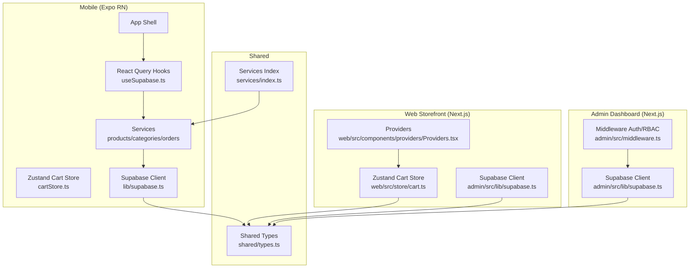
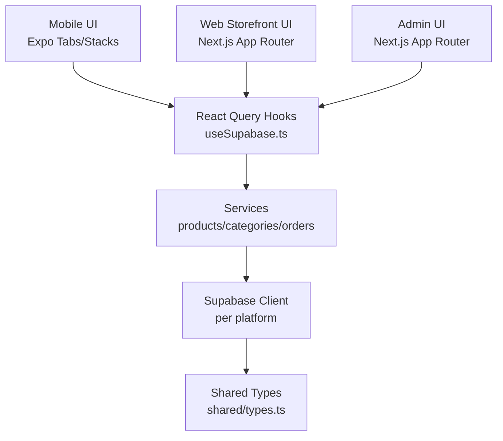
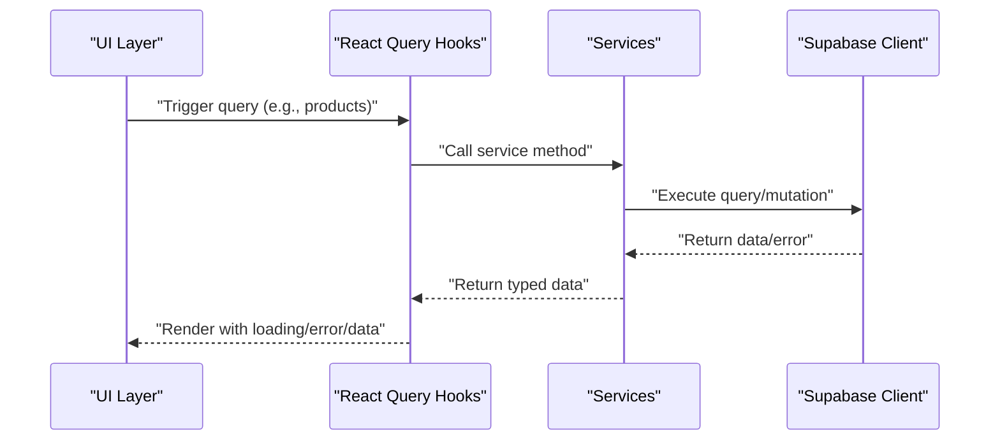
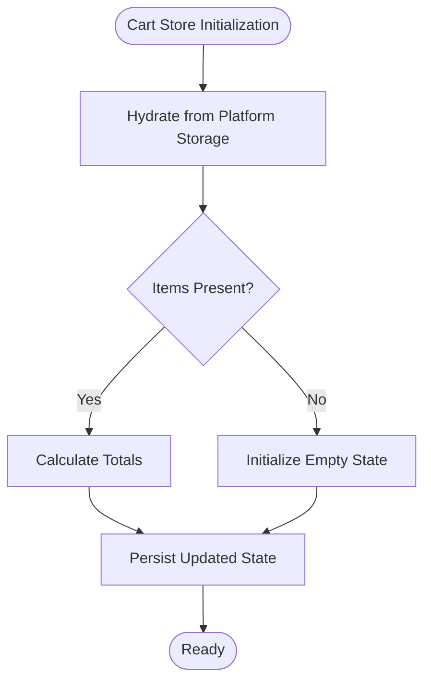
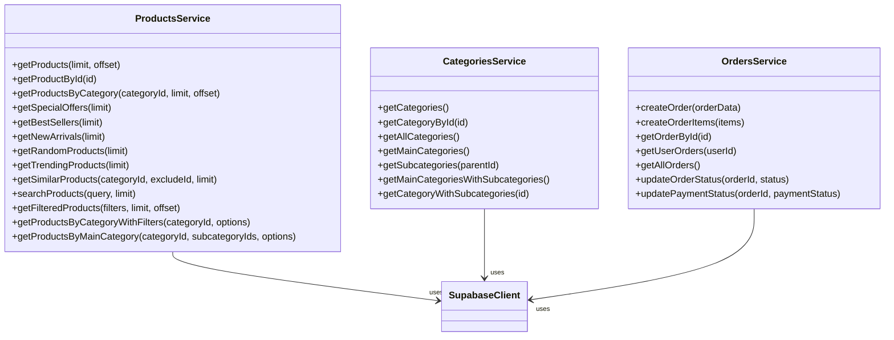
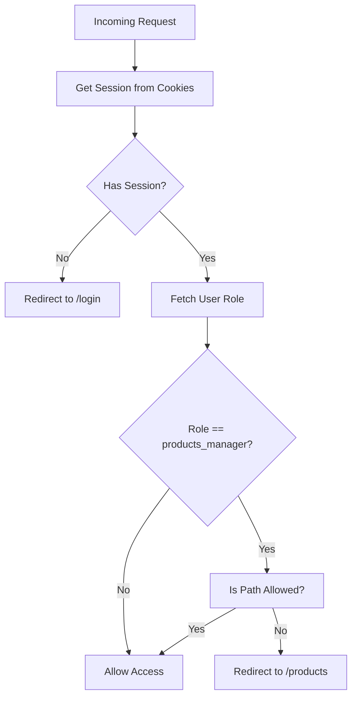
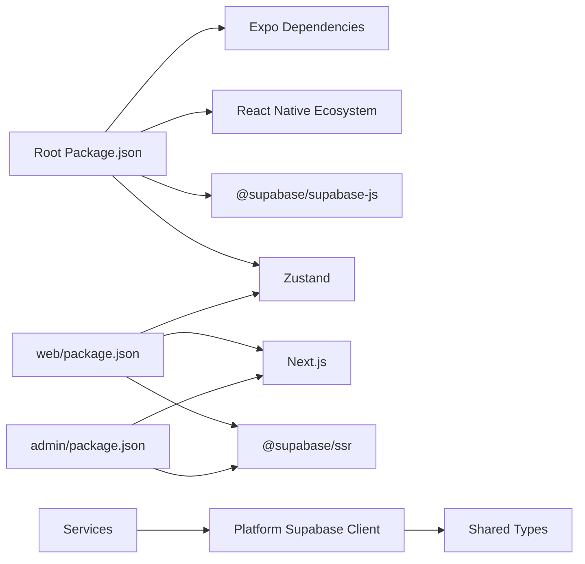

# Application Architecture

<cite>
**Referenced Files in This Document**
- [package.json](file://package.json)
- [app.config.ts](file://app.config.ts)
- [lib/supabase.ts](file://lib/supabase.ts)
- [hooks/useSupabase.ts](file://hooks/useSupabase.ts)
- [services/index.ts](file://services/index.ts)
- [services/products.service.ts](file://services/products.service.ts)
- [services/categories.service.ts](file://services/categories.service.ts)
- [services/orders.service.ts](file://services/orders.service.ts)
- [store/cartStore.ts](file://store/cartStore.ts)
- [shared/types.ts](file://shared/types.ts)
- [contexts/index.ts](file://contexts/index.ts)
- [admin/package.json](file://admin/package.json)
- [admin/src/lib/supabase.ts](file://admin/src/lib/supabase.ts)
- [admin/src/middleware.ts](file://admin/src/middleware.ts)
- [web/package.json](file://web/package.json)
- [web/src/store/cart.ts](file://web/src/store/cart.ts)
- [web/src/components/providers/Providers.tsx](file://web/src/components/providers/Providers.tsx)
- [.docs/ORDERS_REALTIME_SETUP.md](file://.docs/ORDERS_REALTIME_SETUP.md)
</cite>

## Table of Contents
1. [Introduction](#introduction)
2. [Project Structure](#project-structure)
3. [Core Components](#core-components)
4. [Architecture Overview](#architecture-overview)
5. [Detailed Component Analysis](#detailed-component-analysis)
6. [Dependency Analysis](#dependency-analysis)
7. [Performance Considerations](#performance-considerations)
8. [Troubleshooting Guide](#troubleshooting-guide)
9. [Conclusion](#conclusion)
10. [Appendices](#appendices)

## Introduction
This document describes the multi-platform architecture of Al-Amal Center, covering the monorepo structure, shared codebase across mobile, web storefront, and admin dashboard, and platform-specific optimizations. It documents the layered architecture (presentation, business logic, data access, shared utilities), cross-platform design patterns, Supabase integration (authentication, real-time, storage), state management (React Context and Zustand), system boundaries, component interactions, scalability, performance, and deployment architecture. Architectural Decision Records (ADRs) are included to explain key technical choices.

## Project Structure
The repository is organized as a monorepo with three primary applications sharing a common codebase:
- Mobile application built with Expo and React Native
- Web storefront built with Next.js
- Admin dashboard built with Next.js

Shared layers include:
- Business logic services for products, categories, orders, and content
- Shared types and Supabase client configuration
- Cross-platform state management stores (Zustand) and React Query hooks
- Presentation components and providers

**Diagram sources**
- [hooks/useSupabase.ts:1-239](file://hooks/useSupabase.ts#L1-L239)
- [services/products.service.ts:1-449](file://services/products.service.ts#L1-L449)
- [services/categories.service.ts:1-137](file://services/categories.service.ts#L1-L137)
- [services/orders.service.ts:1-115](file://services/orders.service.ts#L1-L115)
- [store/cartStore.ts:1-174](file://store/cartStore.ts#L1-L174)
- [web/src/store/cart.ts:1-107](file://web/src/store/cart.ts#L1-L107)
- [lib/supabase.ts:1-30](file://lib/supabase.ts#L1-L30)
- [admin/src/lib/supabase.ts:1-24](file://admin/src/lib/supabase.ts#L1-L24)
- [shared/types.ts:1-353](file://shared/types.ts#L1-L353)
- [services/index.ts:1-9](file://services/index.ts#L1-L9)
- [web/src/components/providers/Providers.tsx:1-32](file://web/src/components/providers/Providers.tsx#L1-L32)
- [admin/src/middleware.ts:1-122](file://admin/src/middleware.ts#L1-L122)

**Section sources**
- [package.json:1-65](file://package.json#L1-L65)
- [app.config.ts:1-75](file://app.config.ts#L1-L75)
- [admin/package.json:1-40](file://admin/package.json#L1-L40)
- [web/package.json:1-39](file://web/package.json#L1-L39)

## Core Components
- Shared Types: Centralized database and derived types define contracts across platforms.
- Services Layer: Encapsulates Supabase queries and mutations for products, categories, orders, and content.
- React Query Hooks: Provides caching, invalidation, and optimistic updates for data fetching.
- State Management:
  - Mobile: Zustand store persisted to AsyncStorage for cart state.
  - Web/Admin: Zustand store persisted to localStorage for cart state.
- Supabase Clients:
  - Mobile: Uses @supabase/supabase-js with AsyncStorage persistence.
  - Web/Admin: Uses @supabase/ssr with browser cookie management.
- Providers and Middleware:
  - Web: Providers compose theme, session, and storefront context.
  - Admin: Middleware enforces auth/session and role-based access control.

**Section sources**
- [shared/types.ts:1-353](file://shared/types.ts#L1-L353)
- [services/index.ts:1-9](file://services/index.ts#L1-L9)
- [hooks/useSupabase.ts:1-239](file://hooks/useSupabase.ts#L1-L239)
- [store/cartStore.ts:1-174](file://store/cartStore.ts#L1-L174)
- [web/src/store/cart.ts:1-107](file://web/src/store/cart.ts#L1-L107)
- [lib/supabase.ts:1-30](file://lib/supabase.ts#L1-L30)
- [admin/src/lib/supabase.ts:1-24](file://admin/src/lib/supabase.ts#L1-L24)
- [web/src/components/providers/Providers.tsx:1-32](file://web/src/components/providers/Providers.tsx#L1-L32)
- [admin/src/middleware.ts:1-122](file://admin/src/middleware.ts#L1-L122)

## Architecture Overview
The system follows a layered architecture:
- Presentation Layer: Mobile screens, web storefront pages, and admin dashboards.
- Business Logic Layer: React Query hooks and service functions encapsulate domain logic.
- Data Access Layer: Supabase client instances per platform with shared types.
- Shared Utilities: Types, contexts, and cross-platform helpers.

**Diagram sources**
- [hooks/useSupabase.ts:1-239](file://hooks/useSupabase.ts#L1-L239)
- [services/products.service.ts:1-449](file://services/products.service.ts#L1-L449)
- [services/categories.service.ts:1-137](file://services/categories.service.ts#L1-L137)
- [services/orders.service.ts:1-115](file://services/orders.service.ts#L1-L115)
- [lib/supabase.ts:1-30](file://lib/supabase.ts#L1-L30)
- [admin/src/lib/supabase.ts:1-24](file://admin/src/lib/supabase.ts#L1-L24)
- [shared/types.ts:1-353](file://shared/types.ts#L1-L353)

## Detailed Component Analysis

### Supabase Integration Architecture
- Authentication:
  - Mobile: Uses @supabase/supabase-js with AsyncStorage for session persistence.
  - Web/Admin: Uses @supabase/ssr with cookie-based session management.
- Real-time:
  - Supabase Realtime is configured via Supabase client initialization and can be extended for live updates.
- Storage:
  - Images referenced by URL from Supabase Storage are consumed uniformly across platforms.

**Diagram sources**
- [hooks/useSupabase.ts:1-239](file://hooks/useSupabase.ts#L1-L239)
- [services/products.service.ts:1-449](file://services/products.service.ts#L1-L449)
- [lib/supabase.ts:1-30](file://lib/supabase.ts#L1-L30)
- [admin/src/lib/supabase.ts:1-24](file://admin/src/lib/supabase.ts#L1-L24)

**Section sources**
- [lib/supabase.ts:1-30](file://lib/supabase.ts#L1-L30)
- [admin/src/lib/supabase.ts:1-24](file://admin/src/lib/supabase.ts#L1-L24)
- [.docs/ORDERS_REALTIME_SETUP.md](file://.docs/ORDERS_REALTIME_SETUP.md)

### State Management Architecture
- Mobile:
  - Zustand store persists to AsyncStorage; recalculates totals on hydration.
- Web/Admin:
  - Zustand store persists to localStorage; recalculates totals on hydration.
- Contexts:
  - Language and currency contexts are exported for use across components.

**Diagram sources**
- [store/cartStore.ts:1-174](file://store/cartStore.ts#L1-L174)
- [web/src/store/cart.ts:1-107](file://web/src/store/cart.ts#L1-L107)

**Section sources**
- [store/cartStore.ts:1-174](file://store/cartStore.ts#L1-L174)
- [web/src/store/cart.ts:1-107](file://web/src/store/cart.ts#L1-L107)
- [contexts/index.ts:1-3](file://contexts/index.ts#L1-L3)

### Services Layer
- Products Service: Implements product queries, filtering, sorting, and fallbacks.
- Categories Service: Fetches hierarchical categories and merges subcategories.
- Orders Service: Handles order creation, retrieval, and status updates.

**Diagram sources**
- [services/products.service.ts:1-449](file://services/products.service.ts#L1-L449)
- [services/categories.service.ts:1-137](file://services/categories.service.ts#L1-L137)
- [services/orders.service.ts:1-115](file://services/orders.service.ts#L1-L115)
- [lib/supabase.ts:1-30](file://lib/supabase.ts#L1-L30)

**Section sources**
- [services/products.service.ts:1-449](file://services/products.service.ts#L1-L449)
- [services/categories.service.ts:1-137](file://services/categories.service.ts#L1-L137)
- [services/orders.service.ts:1-115](file://services/orders.service.ts#L1-L115)

### Admin Middleware and RBAC
- Enforces session validation and redirects unauthorized users.
- Role-based access control restricts products_manager to specific paths.

**Diagram sources**
- [admin/src/middleware.ts:1-122](file://admin/src/middleware.ts#L1-L122)

**Section sources**
- [admin/src/middleware.ts:1-122](file://admin/src/middleware.ts#L1-L122)

## Dependency Analysis
- Mobile depends on Expo Router, React Native ecosystem, and @supabase/supabase-js with AsyncStorage.
- Web/Admin depend on Next.js, @supabase/ssr, and shared types.
- Services depend on the platform-specific Supabase client and shared types.
- State stores depend on platform storage (AsyncStorage vs localStorage).

**Diagram sources**
- [package.json:1-65](file://package.json#L1-L65)
- [web/package.json:1-39](file://web/package.json#L1-L39)
- [admin/package.json:1-40](file://admin/package.json#L1-L40)
- [lib/supabase.ts:1-30](file://lib/supabase.ts#L1-L30)
- [admin/src/lib/supabase.ts:1-24](file://admin/src/lib/supabase.ts#L1-L24)
- [shared/types.ts:1-353](file://shared/types.ts#L1-L353)

**Section sources**
- [package.json:1-65](file://package.json#L1-L65)
- [web/package.json:1-39](file://web/package.json#L1-L39)
- [admin/package.json:1-40](file://admin/package.json#L1-L40)

## Performance Considerations
- Data Fetching:
  - Use React Query’s caching and selective refetching to minimize network calls.
  - Prefer field selection to reduce payload sizes (e.g., product lists exclude long descriptions).
- State Persistence:
  - Persist cart state to platform storage to avoid recomputation and improve UX.
- Lazy Loading:
  - Load heavy assets conditionally and leverage platform-specific image pickers and webviews.
- Caching Strategies:
  - Configure cache keys and lifetimes appropriately for product catalogs and categories.
- Offline Considerations:
  - AsyncStorage/localStorage persistence ensures continuity; consider optimistic updates for cart actions.

[No sources needed since this section provides general guidance]

## Troubleshooting Guide
- Authentication Issues:
  - Verify Supabase URL and anon keys are set per environment for each platform.
  - Ensure AsyncStorage is initialized for mobile and cookies are readable for web/admin.
- Real-time Updates:
  - Confirm Supabase Realtime channel subscriptions and client initialization.
- Service Errors:
  - Inspect thrown errors from services and surface user-friendly messages.
- Middleware Redirect Loops:
  - Validate cookie handling and session retrieval logic in middleware.

**Section sources**
- [lib/supabase.ts:1-30](file://lib/supabase.ts#L1-L30)
- [admin/src/lib/supabase.ts:1-24](file://admin/src/lib/supabase.ts#L1-L24)
- [admin/src/middleware.ts:1-122](file://admin/src/middleware.ts#L1-L122)
- [.docs/ORDERS_REALTIME_SETUP.md](file://.docs/ORDERS_REALTIME_SETUP.md)

## Conclusion
The Al-Amal Center employs a clean, layered architecture that maximizes code reuse across mobile, web, and admin platforms while accommodating platform-specific needs. Supabase provides a unified backend for authentication, real-time, and storage. React Query and Zustand deliver robust data and state management. The monorepo structure, shared types, and modular services enable scalable development and deployment.

[No sources needed since this section summarizes without analyzing specific files]

## Appendices

### ADR: Cross-Platform Supabase Client Selection
- Decision: Use @supabase/supabase-js with AsyncStorage for mobile; use @supabase/ssr with cookie management for web/admin.
- Rationale: Mobile requires native storage; SSR environments require cookie-based session handling.

**Section sources**
- [lib/supabase.ts:1-30](file://lib/supabase.ts#L1-L30)
- [admin/src/lib/supabase.ts:1-24](file://admin/src/lib/supabase.ts#L1-L24)

### ADR: State Persistence Strategy
- Decision: Persist cart state to AsyncStorage on mobile and localStorage on web/admin.
- Rationale: Aligns with platform storage APIs and ensures consistent hydration.

**Section sources**
- [store/cartStore.ts:1-174](file://store/cartStore.ts#L1-L174)
- [web/src/store/cart.ts:1-107](file://web/src/store/cart.ts#L1-L107)

### ADR: Field Selection for Product Lists
- Decision: Exclude long descriptions in product list queries to reduce payload size.
- Rationale: Improves performance and reduces bandwidth usage.

**Section sources**
- [services/products.service.ts:10-13](file://services/products.service.ts#L10-L13)

### ADR: Admin Role-Based Access Control
- Decision: Restrict products_manager to product and category management views.
- Rationale: Enforces least privilege and improves security posture.

**Section sources**
- [admin/src/middleware.ts:73-104](file://admin/src/middleware.ts#L73-L104)