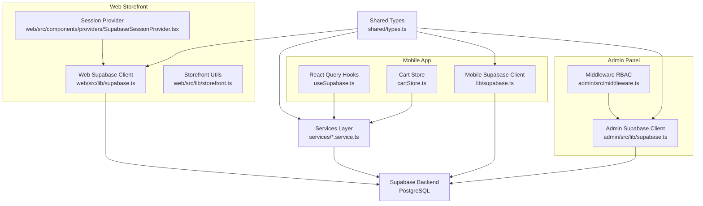
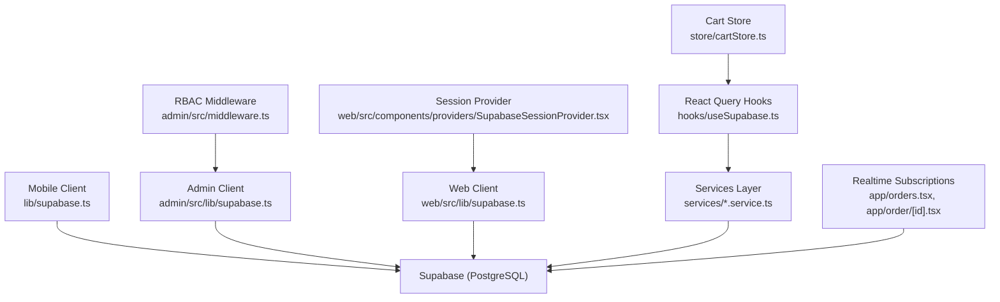
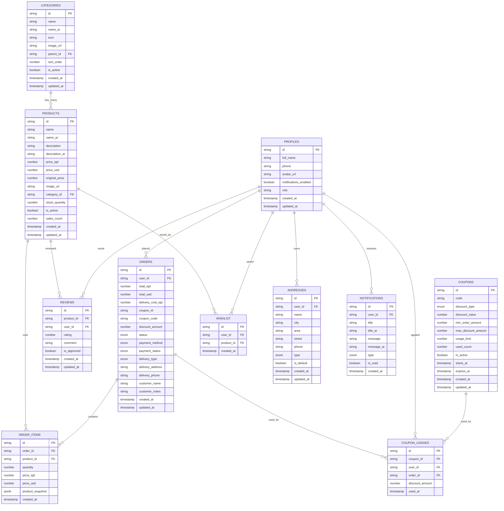
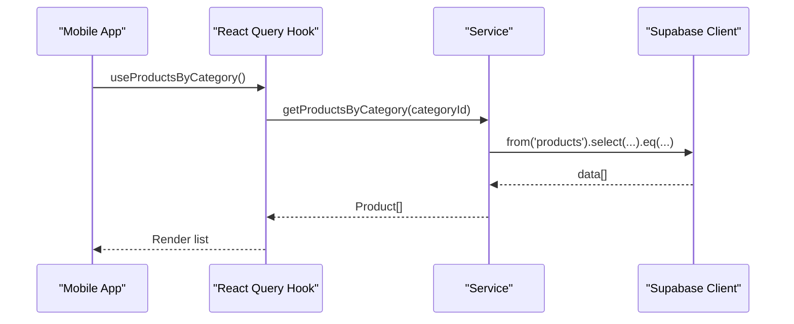
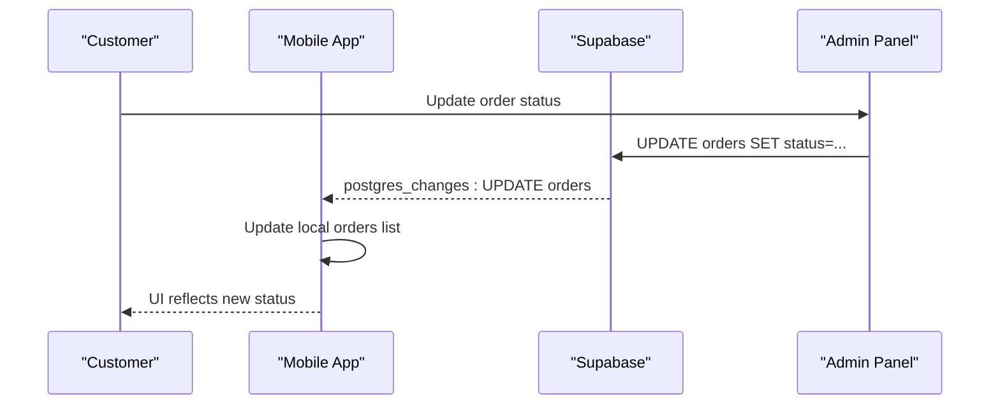
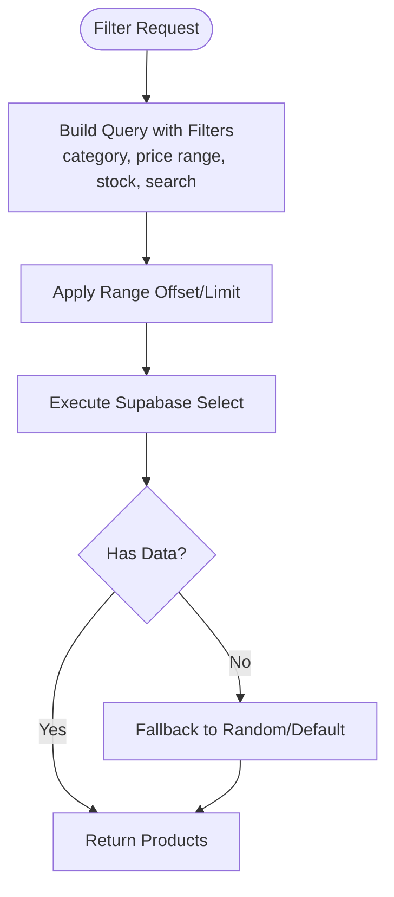
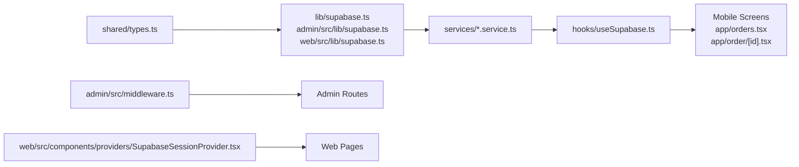

# Data Layer and Supabase Integration

<cite>
**Referenced Files in This Document**
- [lib/supabase.ts](file://lib/supabase.ts)
- [hooks/useSupabase.ts](file://hooks/useSupabase.ts)
- [admin/src/lib/supabase.ts](file://admin/src/lib/supabase.ts)
- [web/src/lib/supabase.ts](file://web/src/lib/supabase.ts)
- [shared/types.ts](file://shared/types.ts)
- [services/index.ts](file://services/index.ts)
- [services/products.service.ts](file://services/products.service.ts)
- [services/categories.service.ts](file://services/categories.service.ts)
- [services/orders.service.ts](file://services/orders.service.ts)
- [services/content.service.ts](file://services/content.service.ts)
- [admin/src/middleware.ts](file://admin/src/middleware.ts)
- [.docs/ORDERS_REALTIME_SETUP.md](file://.docs/ORDERS_REALTIME_SETUP.md)
- [store/cartStore.ts](file://store/cartStore.ts)
- [web/src/components/providers/SupabaseSessionProvider.tsx](file://web/src/components/providers/SupabaseSessionProvider.tsx)
- [web/src/lib/storefront.ts](file://web/src/lib/storefront.ts)
- [app/orders.tsx](file://app/orders.tsx)
- [app/order/[id].tsx](file://app/order/[id].tsx)
</cite>

## Table of Contents
1. [Introduction](#introduction)
2. [Project Structure](#project-structure)
3. [Core Components](#core-components)
4. [Architecture Overview](#architecture-overview)
5. [Detailed Component Analysis](#detailed-component-analysis)
6. [Dependency Analysis](#dependency-analysis)
7. [Performance Considerations](#performance-considerations)
8. [Troubleshooting Guide](#troubleshooting-guide)
9. [Conclusion](#conclusion)
10. [Appendices](#appendices)

## Introduction
This document describes the centralized data layer and Supabase integration for Al-Amal Center. It explains the PostgreSQL-backed architecture, shared data models, service-layer encapsulation, client configurations across mobile, web, and admin environments, role-based access control, real-time subscriptions, indexing and query strategies, and operational practices for scalability, monitoring, migrations, and offline synchronization.

## Project Structure
The data layer is organized around:
- A shared TypeScript model definition for the database schema
- Environment-specific Supabase clients for mobile, admin, and web
- Service modules that encapsulate CRUD and business logic
- React Query hooks for caching and optimistic updates
- Middleware and providers for session and role-based access control
- Real-time subscriptions for live updates

**Diagram sources**
- [lib/supabase.ts:1-30](file://lib/supabase.ts#L1-L30)
- [hooks/useSupabase.ts:1-239](file://hooks/useSupabase.ts#L1-L239)
- [admin/src/lib/supabase.ts:1-24](file://admin/src/lib/supabase.ts#L1-L24)
- [web/src/lib/supabase.ts:1-36](file://web/src/lib/supabase.ts#L1-L36)
- [shared/types.ts:1-353](file://shared/types.ts#L1-L353)
- [services/products.service.ts:1-449](file://services/products.service.ts#L1-L449)
- [services/categories.service.ts:1-137](file://services/categories.service.ts#L1-L137)
- [services/orders.service.ts:1-115](file://services/orders.service.ts#L1-L115)
- [services/content.service.ts:1-147](file://services/content.service.ts#L1-L147)
- [admin/src/middleware.ts:1-122](file://admin/src/middleware.ts#L1-L122)
- [web/src/components/providers/SupabaseSessionProvider.tsx:1-74](file://web/src/components/providers/SupabaseSessionProvider.tsx#L1-L74)
- [web/src/lib/storefront.ts:1-613](file://web/src/lib/storefront.ts#L1-L613)

**Section sources**
- [lib/supabase.ts:1-30](file://lib/supabase.ts#L1-L30)
- [hooks/useSupabase.ts:1-239](file://hooks/useSupabase.ts#L1-L239)
- [admin/src/lib/supabase.ts:1-24](file://admin/src/lib/supabase.ts#L1-L24)
- [web/src/lib/supabase.ts:1-36](file://web/src/lib/supabase.ts#L1-L36)
- [shared/types.ts:1-353](file://shared/types.ts#L1-L353)
- [services/index.ts:1-9](file://services/index.ts#L1-L9)

## Core Components
- Shared types define the canonical database schema and derived types used across platforms.
- Service modules encapsulate all Supabase queries and business logic for products, categories, orders, and content.
- React Query hooks provide caching, pagination, and optimistic updates for mobile UI.
- Environment-specific Supabase clients configure auth persistence and browser vs. server sessions.
- Middleware enforces role-based access control for admin routes.
- Real-time subscriptions keep mobile and admin views synchronized.

**Section sources**
- [shared/types.ts:10-211](file://shared/types.ts#L10-L211)
- [services/products.service.ts:1-449](file://services/products.service.ts#L1-L449)
- [services/categories.service.ts:1-137](file://services/categories.service.ts#L1-L137)
- [services/orders.service.ts:1-115](file://services/orders.service.ts#L1-L115)
- [services/content.service.ts:1-147](file://services/content.service.ts#L1-L147)
- [hooks/useSupabase.ts:1-239](file://hooks/useSupabase.ts#L1-L239)
- [lib/supabase.ts:1-30](file://lib/supabase.ts#L1-L30)
- [admin/src/lib/supabase.ts:1-24](file://admin/src/lib/supabase.ts#L1-L24)
- [web/src/lib/supabase.ts:1-36](file://web/src/lib/supabase.ts#L1-L36)
- [admin/src/middleware.ts:1-122](file://admin/src/middleware.ts#L1-L122)

## Architecture Overview
The system follows a centralized Supabase backend with three frontends:
- Mobile app: React Native with AsyncStorage-based auth persistence and local cart persistence.
- Admin panel: Next.js with Supabase SSR client and middleware-based RBAC.
- Web storefront: Next.js with Supabase SSR client and session provider.

**Diagram sources**
- [lib/supabase.ts:1-30](file://lib/supabase.ts#L1-L30)
- [admin/src/lib/supabase.ts:1-24](file://admin/src/lib/supabase.ts#L1-L24)
- [web/src/lib/supabase.ts:1-36](file://web/src/lib/supabase.ts#L1-L36)
- [services/products.service.ts:1-449](file://services/products.service.ts#L1-L449)
- [hooks/useSupabase.ts:1-239](file://hooks/useSupabase.ts#L1-L239)
- [store/cartStore.ts:1-174](file://store/cartStore.ts#L1-L174)
- [admin/src/middleware.ts:1-122](file://admin/src/middleware.ts#L1-L122)
- [web/src/components/providers/SupabaseSessionProvider.tsx:1-74](file://web/src/components/providers/SupabaseSessionProvider.tsx#L1-L74)
- [app/orders.tsx:28-116](file://app/orders.tsx#L28-L116)
- [app/order/[id].tsx](file://app/order/[id].tsx#L10-L35)

## Detailed Component Analysis

### Data Models and Relationships
The shared types define the canonical schema with tables for products, categories, orders, order items, reviews, coupons, coupon usages, profiles, wishlist, addresses, and notifications. Relationships:
- categories ← parent_id → self (hierarchical)
- orders ← user_id → profiles
- order_items ← order_id → orders, ← product_id → products
- reviews ← product_id → products, ← user_id → profiles
- coupon_usages ← coupon_id → coupons, ← user_id → profiles, ← order_id → orders
- addresses ← user_id → profiles
- wishlist ← user_id → profiles, ← product_id → products

**Diagram sources**
- [shared/types.ts:10-211](file://shared/types.ts#L10-L211)

**Section sources**
- [shared/types.ts:10-211](file://shared/types.ts#L10-L211)

### Supabase Client Configurations
- Mobile client: Creates a client with AsyncStorage-based auth storage, persists sessions, auto-refreshes tokens, and disables URL detection for embedded contexts.
- Admin client: Browser client configured for Next.js SSR with environment variables.
- Web client: Factory functions for browser and server clients, with cookie handling for SSR.

**Diagram sources**
- [lib/supabase.ts:1-30](file://lib/supabase.ts#L1-L30)
- [hooks/useSupabase.ts:1-239](file://hooks/useSupabase.ts#L1-L239)
- [services/products.service.ts:47-57](file://services/products.service.ts#L47-L57)

**Section sources**
- [lib/supabase.ts:1-30](file://lib/supabase.ts#L1-L30)
- [admin/src/lib/supabase.ts:1-24](file://admin/src/lib/supabase.ts#L1-L24)
- [web/src/lib/supabase.ts:1-36](file://web/src/lib/supabase.ts#L1-L36)

### Authentication and Real-Time Subscriptions
- Mobile: Real-time subscriptions on orders per user and per order detail channel to reflect status changes instantly.
- Admin: Middleware enforces authentication and role-based access control; products manager role is restricted to products and categories.
- Web: Session provider listens to auth state changes and exposes session/user context.

**Diagram sources**
- [app/orders.tsx:43-85](file://app/orders.tsx#L43-L85)
- [app/order/[id].tsx](file://app/order/[id].tsx#L24-L35)
- [.docs/ORDERS_REALTIME_SETUP.md:18-76](file://.docs/ORDERS_REALTIME_SETUP.md#L18-L76)

**Section sources**
- [app/orders.tsx:28-116](file://app/orders.tsx#L28-L116)
- [app/order/[id].tsx](file://app/order/[id].tsx#L10-L35)
- [admin/src/middleware.ts:73-105](file://admin/src/middleware.ts#L73-L105)
- [web/src/components/providers/SupabaseSessionProvider.tsx:36-52](file://web/src/components/providers/SupabaseSessionProvider.tsx#L36-L52)
- [.docs/ORDERS_REALTIME_SETUP.md:1-107](file://.docs/ORDERS_REALTIME_SETUP.md#L1-L107)

### Business Logic Encapsulation
- Products: Pagination, filtering, sorting, best-sellers fallback, trending fallback, random fallback, special offers with dynamic discount calculation.
- Categories: Hierarchical retrieval with subcategories, main categories, and nested structures.
- Orders: Creation, item insertion, retrieval by user, admin listing, and status/payment updates.
- Content: Active banners, home sections, and grouped promotional banners.

**Diagram sources**
- [services/products.service.ts:279-309](file://services/products.service.ts#L279-L309)
- [services/products.service.ts:198-213](file://services/products.service.ts#L198-L213)

**Section sources**
- [services/products.service.ts:1-449](file://services/products.service.ts#L1-L449)
- [services/categories.service.ts:1-137](file://services/categories.service.ts#L1-L137)
- [services/orders.service.ts:1-115](file://services/orders.service.ts#L1-L115)
- [services/content.service.ts:1-147](file://services/content.service.ts#L1-L147)

### Separation of Concerns Across Access Patterns
- Mobile: Uses React Query hooks and a local cart persisted via AsyncStorage. Real-time subscriptions keep order lists and details live.
- Admin: Server-side middleware validates session and role; products manager role is constrained to specific paths.
- Web: SSR with cookie-based auth session provider; stores language and storefront preferences.

**Section sources**
- [hooks/useSupabase.ts:1-239](file://hooks/useSupabase.ts#L1-L239)
- [store/cartStore.ts:1-174](file://store/cartStore.ts#L1-L174)
- [admin/src/middleware.ts:73-105](file://admin/src/middleware.ts#L73-L105)
- [web/src/components/providers/SupabaseSessionProvider.tsx:1-74](file://web/src/components/providers/SupabaseSessionProvider.tsx#L1-L74)
- [web/src/lib/storefront.ts:1-613](file://web/src/lib/storefront.ts#L1-L613)

## Dependency Analysis
- Shared types are imported by services and clients to maintain type safety across platforms.
- Services depend on the platform-specific Supabase client.
- Hooks depend on services for data fetching and caching.
- Admin middleware depends on Supabase auth and profiles table for role checks.
- Real-time subscriptions depend on Supabase channels and RLS policies.

**Diagram sources**
- [shared/types.ts:1-353](file://shared/types.ts#L1-L353)
- [lib/supabase.ts:1-30](file://lib/supabase.ts#L1-L30)
- [admin/src/lib/supabase.ts:1-24](file://admin/src/lib/supabase.ts#L1-L24)
- [web/src/lib/supabase.ts:1-36](file://web/src/lib/supabase.ts#L1-L36)
- [services/products.service.ts:1-449](file://services/products.service.ts#L1-L449)
- [hooks/useSupabase.ts:1-239](file://hooks/useSupabase.ts#L1-L239)
- [admin/src/middleware.ts:1-122](file://admin/src/middleware.ts#L1-L122)
- [web/src/components/providers/SupabaseSessionProvider.tsx:1-74](file://web/src/components/providers/SupabaseSessionProvider.tsx#L1-L74)
- [app/orders.tsx:28-116](file://app/orders.tsx#L28-L116)
- [app/order/[id].tsx](file://app/order/[id].tsx#L10-L35)

**Section sources**
- [services/index.ts:1-9](file://services/index.ts#L1-L9)
- [shared/types.ts:1-353](file://shared/types.ts#L1-L353)

## Performance Considerations
- Field selection: Prefer selective field lists for list views to reduce payload sizes.
- Pagination: Use range-based pagination to limit rows per request.
- Sorting and filtering: Apply filters early in the query chain to minimize result sets.
- Fallback strategies: Use fallbacks (random, default) to avoid empty states while maintaining responsiveness.
- Real-time updates: Subscribe only to relevant filters (e.g., user_id) to reduce bandwidth.
- SSR and caching: Use server clients for SSR and React Query for client caching to balance freshness and performance.

[No sources needed since this section provides general guidance]

## Troubleshooting Guide
Common issues and resolutions:
- Real-time not updating: Ensure Realtime is enabled on the orders table and publication includes the orders table; set replica identity to full; verify RLS policies allow updates.
- Authentication redirects: Confirm middleware checks session and redirects appropriately; ensure environment variables are set for admin.
- Error handling: Services throw errors; wrap calls with try/catch and surface user-friendly messages.
- Offline cart: Cart store persists locally; totals are recalculated on hydration.

**Section sources**
- [.docs/ORDERS_REALTIME_SETUP.md:18-76](file://.docs/ORDERS_REALTIME_SETUP.md#L18-L76)
- [admin/src/middleware.ts:57-71](file://admin/src/middleware.ts#L57-L71)
- [services/products.service.ts:18-28](file://services/products.service.ts#L18-L28)
- [store/cartStore.ts:150-163](file://store/cartStore.ts#L150-L163)

## Conclusion
The data layer leverages a centralized Supabase backend with strong typing via shared models, robust service encapsulation, and environment-specific clients. Real-time subscriptions, role-based access control, and careful query strategies deliver a responsive, secure, and scalable experience across mobile, admin, and web interfaces.

[No sources needed since this section summarizes without analyzing specific files]

## Appendices

### Example Data Operations
- Fetch active products with pagination and filters
  - [services/products.service.ts:279-309](file://services/products.service.ts#L279-L309)
- Retrieve a single product by ID
  - [services/products.service.ts:33-42](file://services/products.service.ts#L33-L42)
- Get user orders with items
  - [services/orders.service.ts:39-51](file://services/orders.service.ts#L39-L51)
- Get active banners and grouped promo banners
  - [services/content.service.ts:41-59](file://services/content.service.ts#L41-L59)
  - [services/content.service.ts:117-145](file://services/content.service.ts#L117-L145)

### Error Handling Patterns
- Throw on service errors; catch at UI boundaries and display messages
  - [services/products.service.ts:26-27](file://services/products.service.ts#L26-L27)
  - [services/orders.service.ts:19-20](file://services/orders.service.ts#L19-L20)

### Offline Data Synchronization Approaches
- Local cart persistence with AsyncStorage and recalculation on hydration
  - [store/cartStore.ts:150-163](file://store/cartStore.ts#L150-L163)
- Real-time subscriptions for live updates with pull-to-refresh fallback
  - [app/orders.tsx:43-85](file://app/orders.tsx#L43-L85)
  - [app/order/[id].tsx](file://app/order/[id].tsx#L24-L35)