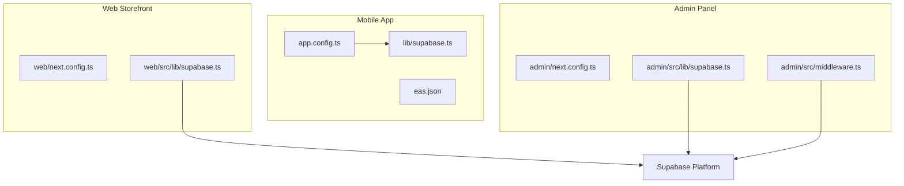
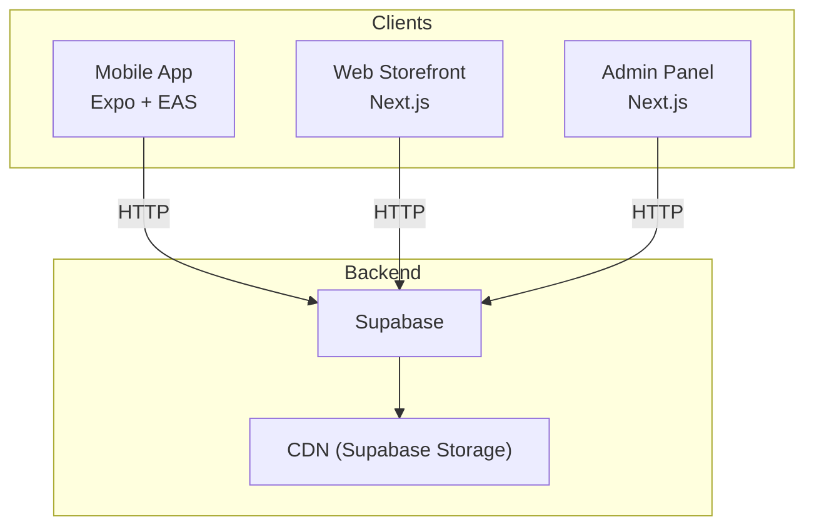
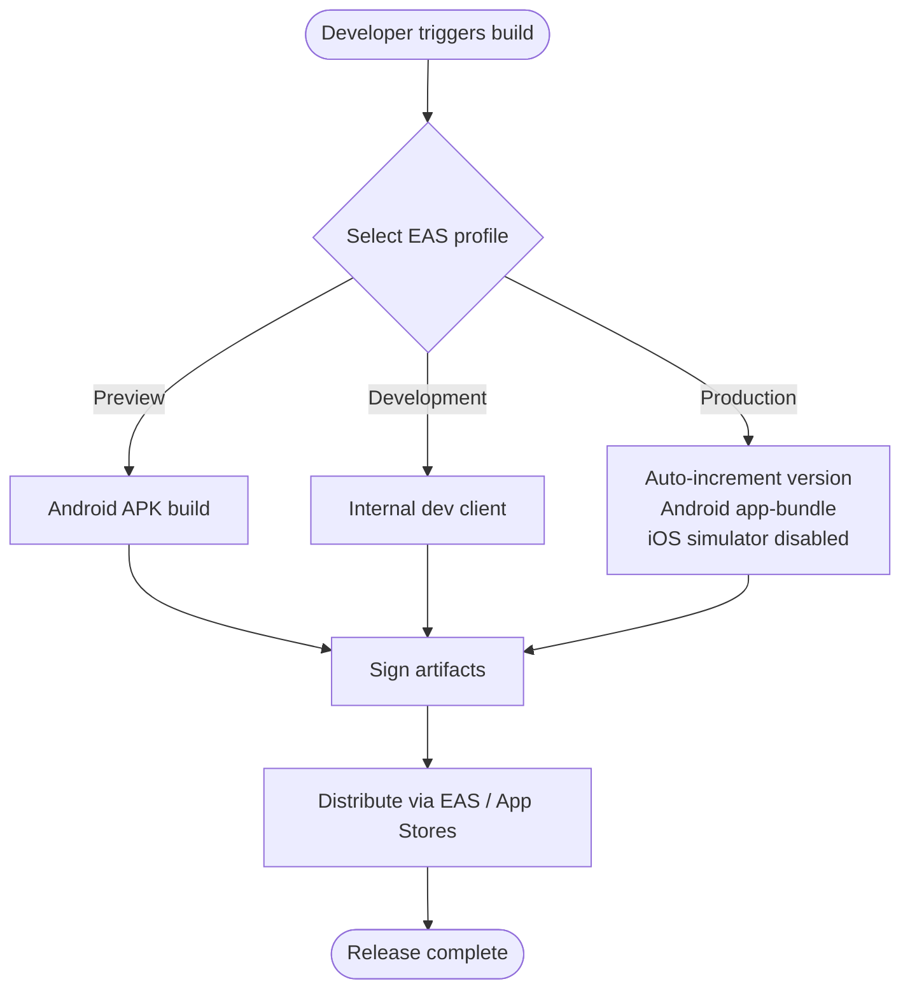
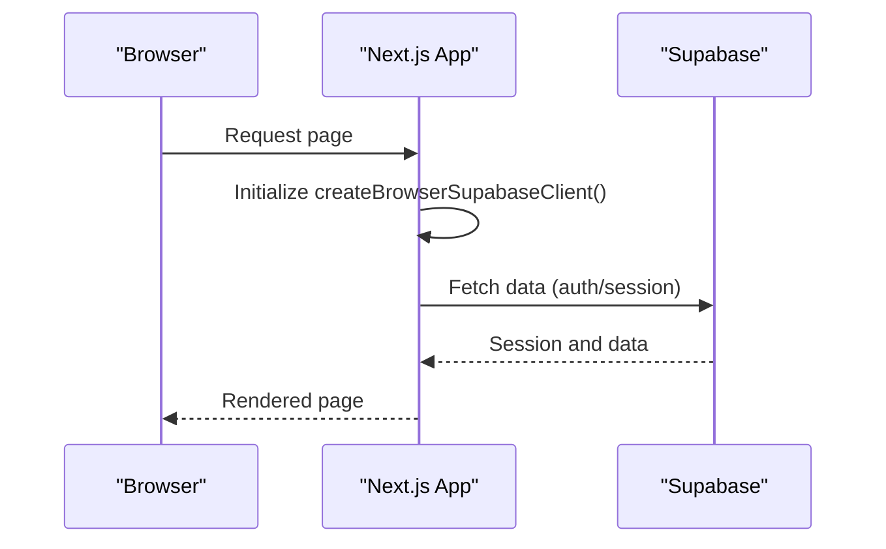
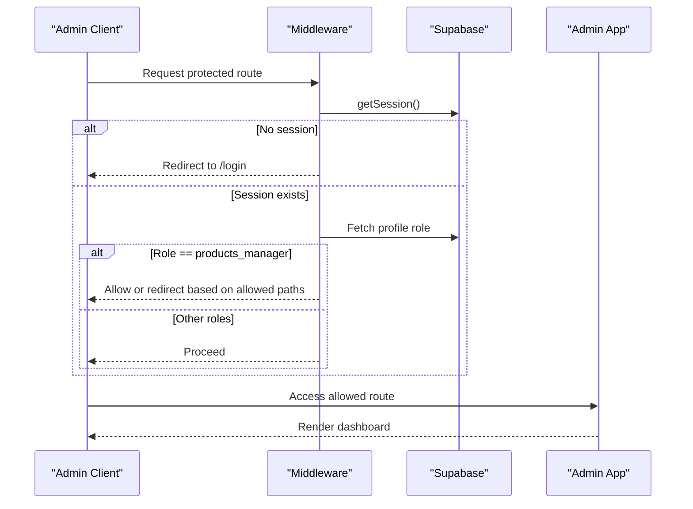
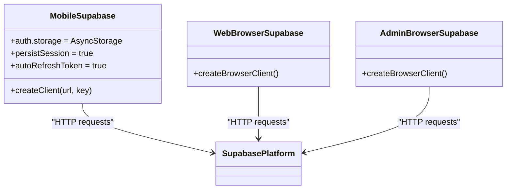
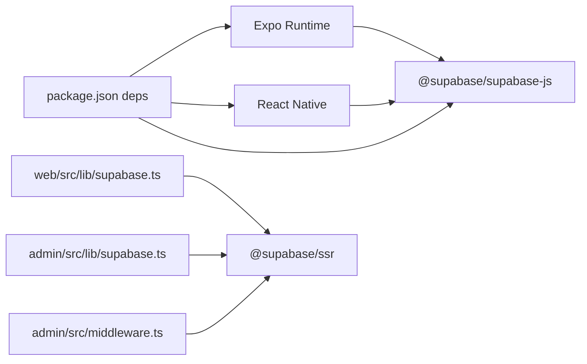

# Deployment and Infrastructure Architecture

<cite>
**Referenced Files in This Document**
- [eas.json](file://eas.json)
- [app.config.ts](file://app.config.ts)
- [package.json](file://package.json)
- [lib/supabase.ts](file://lib/supabase.ts)
- [web/src/lib/supabase.ts](file://web/src/lib/supabase.ts)
- [admin/src/lib/supabase.ts](file://admin/src/lib/supabase.ts)
- [admin/src/middleware.ts](file://admin/src/middleware.ts)
- [admin/next.config.ts](file://admin/next.config.ts)
- [web/next.config.ts](file://web/next.config.ts)
- [admin/README.md](file://admin/README.md)
</cite>

## Table of Contents
1. [Introduction](#introduction)
2. [Project Structure](#project-structure)
3. [Core Components](#core-components)
4. [Architecture Overview](#architecture-overview)
5. [Detailed Component Analysis](#detailed-component-analysis)
6. [Dependency Analysis](#dependency-analysis)
7. [Performance Considerations](#performance-considerations)
8. [Troubleshooting Guide](#troubleshooting-guide)
9. [Conclusion](#conclusion)
10. [Appendices](#appendices)

## Introduction
This document describes the deployment and infrastructure architecture for Al-Amal Center’s multi-environment applications: a cross-platform mobile app (React Native with Expo), a Next.js-powered web storefront, and an admin panel built with Next.js. It covers build processes, environment configuration, Supabase integration, CI/CD and release management, monitoring and observability, security controls, and operational procedures such as rollbacks, A/B testing, and disaster recovery.

## Project Structure
The repository organizes the solution into three primary targets:
- Mobile app: React Native with Expo, configured via app.config.ts and EAS build profiles.
- Web storefront: Next.js application under the web/ directory.
- Admin panel: Next.js application under the admin/ directory.

Build and runtime configuration is centralized through environment variables exposed via Next public variables and Expo public variables. Supabase client initialization is shared across environments with environment-specific keys and URLs.

**Diagram sources**
- [app.config.ts:1-84](file://app.config.ts#L1-L84)
- [eas.json:1-40](file://eas.json#L1-L40)
- [lib/supabase.ts:1-30](file://lib/supabase.ts#L1-L30)
- [web/next.config.ts:1-12](file://web/next.config.ts#L1-L12)
- [web/src/lib/supabase.ts:1-36](file://web/src/lib/supabase.ts#L1-L36)
- [admin/next.config.ts:1-25](file://admin/next.config.ts#L1-L25)
- [admin/src/middleware.ts:1-122](file://admin/src/middleware.ts#L1-L122)
- [admin/src/lib/supabase.ts:1-24](file://admin/src/lib/supabase.ts#L1-L24)

**Section sources**
- [app.config.ts:1-84](file://app.config.ts#L1-L84)
- [eas.json:1-40](file://eas.json#L1-L40)
- [web/next.config.ts:1-12](file://web/next.config.ts#L1-L12)
- [admin/next.config.ts:1-25](file://admin/next.config.ts#L1-L25)

## Core Components
- Mobile app configuration and builds:
  - app.config.ts defines app metadata, permissions, and environment exposure for the mobile app.
  - eas.json defines build profiles for preview, development, and production, including platform-specific settings and auto-incrementing versioning.
- Supabase clients:
  - Mobile: lib/supabase.ts initializes Supabase with AsyncStorage-backed persistence.
  - Web: web/src/lib/supabase.ts creates browser/server clients for SSR.
  - Admin: admin/src/lib/supabase.ts creates a browser client; admin/src/middleware.ts enforces session and role-based access control.
- Next.js configurations:
  - web/next.config.ts enables React compiler and Turbopack root linking.
  - admin/next.config.ts configures image remote patterns and caching for Supabase storage.

**Section sources**
- [app.config.ts:1-84](file://app.config.ts#L1-L84)
- [eas.json:1-40](file://eas.json#L1-L40)
- [lib/supabase.ts:1-30](file://lib/supabase.ts#L1-L30)
- [web/src/lib/supabase.ts:1-36](file://web/src/lib/supabase.ts#L1-L36)
- [admin/src/lib/supabase.ts:1-24](file://admin/src/lib/supabase.ts#L1-L24)
- [admin/src/middleware.ts:1-122](file://admin/src/middleware.ts#L1-L122)
- [web/next.config.ts:1-12](file://web/next.config.ts#L1-L12)
- [admin/next.config.ts:1-25](file://admin/next.config.ts#L1-L25)

## Architecture Overview
The system comprises three distinct applications sharing a common backend via Supabase. The mobile app uses EAS for builds and distribution, while the web and admin panels are deployed as Next.js applications. Environment variables are used to configure URLs, keys, and feature flags per environment.

**Diagram sources**
- [app.config.ts:67-81](file://app.config.ts#L67-L81)
- [lib/supabase.ts:19-29](file://lib/supabase.ts#L19-L29)
- [web/src/lib/supabase.ts:5-12](file://web/src/lib/supabase.ts#L5-L12)
- [admin/src/lib/supabase.ts:20-23](file://admin/src/lib/supabase.ts#L20-L23)

## Detailed Component Analysis

### Mobile Application Build and Distribution (EAS)
- Build profiles:
  - Preview: Android APK build type.
  - Development: Internal distribution with development client enabled; iOS simulator allowed.
  - Production: Auto-incremented version; Android app-bundle with explicit version code; iOS simulator disabled.
- Versioning:
  - Android version code sourced from ANDROID_VERSION_CODE environment variable.
  - iOS build number sourced from IOS_BUILD_NUMBER environment variable.
  - App version sourced from EXPO_PUBLIC_APP_VERSION; defaults to config.version if unset.
- Environment exposure:
  - Supabase URL and anonymous key exposed via EXPO_PUBLIC_SUPABASE_URL and EXPO_PUBLIC_SUPABASE_ANON_KEY.
  - Feature flags and debug mode exposed via EXPO_PUBLIC_* variables.

**Diagram sources**
- [eas.json:6-31](file://eas.json#L6-L31)
- [app.config.ts:33-40](file://app.config.ts#L33-L40)
- [app.config.ts:67-81](file://app.config.ts#L67-L81)

**Section sources**
- [eas.json:1-40](file://eas.json#L1-L40)
- [app.config.ts:1-84](file://app.config.ts#L1-L84)

### Web Storefront (Next.js)
- Configuration:
  - React compiler enabled.
  - Turbopack root linked to parent directory for monorepo-like development.
- Supabase client:
  - Browser/server client creation with NEXT_PUBLIC_SUPABASE_URL and NEXT_PUBLIC_SUPABASE_ANON_KEY.
- Image optimization:
  - Remote patterns configured for Supabase storage host.
  - Minimum cache TTL and modern formats enabled.

**Diagram sources**
- [web/next.config.ts:1-12](file://web/next.config.ts#L1-L12)
- [web/src/lib/supabase.ts:11-13](file://web/src/lib/supabase.ts#L11-L13)

**Section sources**
- [web/next.config.ts:1-12](file://web/next.config.ts#L1-L12)
- [web/src/lib/supabase.ts:1-36](file://web/src/lib/supabase.ts#L1-L36)

### Admin Panel (Next.js)
- Authentication and access control:
  - Middleware enforces session retrieval and redirects unauthenticated users to login.
  - Role-based access control restricts “products_manager” to specific paths.
- Supabase client:
  - Browser client initialized with NEXT_PUBLIC_SUPABASE_URL and NEXT_PUBLIC_SUPABASE_ANON_KEY.
- Environment variables:
  - NEXT_PUBLIC_SUPABASE_URL and NEXT_PUBLIC_SUPABASE_ANON_KEY for client initialization.
  - OPENROUTER_API_KEY and REPLICATE_API_TOKEN for AI endpoints.

**Diagram sources**
- [admin/src/middleware.ts:4-107](file://admin/src/middleware.ts#L4-L107)
- [admin/src/lib/supabase.ts:20-23](file://admin/src/lib/supabase.ts#L20-L23)

**Section sources**
- [admin/src/middleware.ts:1-122](file://admin/src/middleware.ts#L1-L122)
- [admin/src/lib/supabase.ts:1-24](file://admin/src/lib/supabase.ts#L1-L24)
- [admin/README.md:202-225](file://admin/README.md#L202-L225)

### Supabase Integration
- Mobile:
  - Supabase client created with AsyncStorage-backed persistence and automatic token refresh.
- Web/Admin:
  - Browser/server clients created using Supabase SSR helpers with cookie handling.
- Configuration:
  - Supabase URL and anonymous key loaded from environment variables.
  - Remote image patterns configured for Supabase storage in admin and web configs.

**Diagram sources**
- [lib/supabase.ts:19-29](file://lib/supabase.ts#L19-L29)
- [web/src/lib/supabase.ts:11-13](file://web/src/lib/supabase.ts#L11-L13)
- [admin/src/lib/supabase.ts:20-23](file://admin/src/lib/supabase.ts#L20-L23)

**Section sources**
- [lib/supabase.ts:1-30](file://lib/supabase.ts#L1-L30)
- [web/src/lib/supabase.ts:1-36](file://web/src/lib/supabase.ts#L1-L36)
- [admin/src/lib/supabase.ts:1-24](file://admin/src/lib/supabase.ts#L1-L24)
- [admin/next.config.ts:10-21](file://admin/next.config.ts#L10-L21)
- [web/next.config.ts:1-12](file://web/next.config.ts#L1-L12)

## Dependency Analysis
- Mobile app depends on:
  - Expo runtime and plugins for routing, fonts, secure storage, image picker, and location.
  - Supabase client for authentication and database operations.
- Web and Admin depend on:
  - Next.js runtime and SSR helpers.
  - Supabase SSR client for session-aware requests.
- Shared configuration:
  - Environment variables for Supabase URL and anonymous key.
  - Feature flags exposed via public variables.

**Diagram sources**
- [package.json:12-55](file://package.json#L12-L55)
- [web/src/lib/supabase.ts:1-1](file://web/src/lib/supabase.ts#L1-L1)
- [admin/src/lib/supabase.ts:1-1](file://admin/src/lib/supabase.ts#L1-L1)
- [admin/src/middleware.ts:1-1](file://admin/src/middleware.ts#L1-L1)

**Section sources**
- [package.json:1-65](file://package.json#L1-L65)

## Performance Considerations
- Image optimization:
  - Admin and web apps configure remote patterns and cache TTL for Supabase storage.
  - Modern formats (WebP, AVIF) enabled to reduce payload sizes.
- Build performance:
  - React compiler enabled in Next.js apps.
  - Turbopack root linking in web app for faster rebuilds during development.
- Client-side caching:
  - Supabase client auto-refresh tokens to minimize re-auth overhead.

**Section sources**
- [admin/next.config.ts:10-21](file://admin/next.config.ts#L10-L21)
- [web/next.config.ts:4-9](file://web/next.config.ts#L4-L9)
- [lib/supabase.ts:23-28](file://lib/supabase.ts#L23-L28)

## Troubleshooting Guide
- Authentication loops in admin panel:
  - Verify NEXT_PUBLIC_SUPABASE_URL and NEXT_PUBLIC_SUPABASE_ANON_KEY are set.
  - Ensure middleware cookie handling is intact and sessions are retrievable.
- Supabase client initialization failures:
  - Confirm environment variables are present at build/runtime.
  - Check that mobile app exposes required EXPO_PUBLIC_* variables.
- Image loading errors:
  - Validate remote patterns for Supabase storage host.
  - Confirm cache TTL and formats align with CDN behavior.

**Section sources**
- [admin/src/middleware.ts:11-55](file://admin/src/middleware.ts#L11-L55)
- [lib/supabase.ts:19-20](file://lib/supabase.ts#L19-L20)
- [web/src/lib/supabase.ts:5-9](file://web/src/lib/supabase.ts#L5-L9)
- [admin/next.config.ts:10-21](file://admin/next.config.ts#L10-L21)

## Conclusion
The Al-Amal Center architecture leverages a unified Supabase backend across three frontends: a React Native mobile app built with EAS, a Next.js web storefront, and a Next.js admin panel with role-based access control. Environment variables manage configuration and feature flags, while Next.js and EAS handle build and distribution. The design supports scalable deployments, robust authentication, and efficient asset delivery.

## Appendices

### CI/CD Pipeline and Release Management
- Build and distribution:
  - Use EAS build profiles to produce development and production artifacts.
  - Configure internal distribution for development and App Store submission for production.
- Automated testing:
  - Integrate unit and component tests into pre-release checks.
  - Use EAS build previews for QA prior to production releases.
- Release cadence:
  - Auto-increment versioning in production builds.
  - Tag releases and maintain changelogs for traceability.

**Section sources**
- [eas.json:6-31](file://eas.json#L6-L31)

### Monitoring and Observability
- Error tracking:
  - Integrate client-side error reporting in mobile and web apps.
  - Centralize logs in a backend service or third-party provider.
- Performance metrics:
  - Track Core Web Vitals for the web storefront.
  - Monitor API latency and error rates for Supabase endpoints.
- Health checks:
  - Implement liveness/readiness probes for Next.js applications.
  - Add periodic checks for Supabase connectivity.

[No sources needed since this section provides general guidance]

### Rollback Strategies
- Mobile:
  - Maintain previous EAS build artifacts and use EAS submit to restore distribution channels.
- Web/Admin:
  - Keep immutable builds and container images tagged per release.
  - Use blue/green deployments to facilitate quick rollbacks.

[No sources needed since this section provides general guidance]

### A/B Testing and Feature Flags
- Feature flags:
  - Expose flags via EXPO_PUBLIC_* (mobile) and NEXT_PUBLIC_* (web/admin).
  - Gate feature visibility in code based on environment variables.
- A/B testing:
  - Use randomized assignment and persistent storage for variant allocation.
  - Track conversion metrics and adjust rollout progressively.

**Section sources**
- [app.config.ts:67-77](file://app.config.ts#L67-L77)
- [admin/README.md:202-225](file://admin/README.md#L202-L225)

### Security Considerations
- SSL/TLS:
  - Ensure HTTPS termination at CDN and origin servers.
- API keys:
  - Use NEXT_PUBLIC_* for client-side keys only; keep server-side secrets out of client bundles.
- Access controls:
  - Enforce session-based authentication and role-based access control in admin middleware.
- Secrets management:
  - Store Supabase credentials and AI API tokens in secure secret stores and inject via environment variables.

**Section sources**
- [admin/src/middleware.ts:57-104](file://admin/src/middleware.ts#L57-L104)
- [admin/README.md:202-225](file://admin/README.md#L202-L225)

### Environment Variable Management
- Mobile (EXPO_PUBLIC_*):
  - EXPO_PUBLIC_APP_NAME, EXPO_PUBLIC_APP_VERSION, EXPO_PUBLIC_SUPABASE_URL, EXPO_PUBLIC_SUPABASE_ANON_KEY, EXPO_PUBLIC_DEFAULT_CURRENCY, EXPO_PUBLIC_ENABLE_REVIEWS, EXPO_PUBLIC_ENABLE_WISHLIST, EXPO_PUBLIC_ENABLE_NOTIFICATIONS, EXPO_PUBLIC_DEBUG_MODE.
- Admin/Web (NEXT_PUBLIC_*):
  - NEXT_PUBLIC_SUPABASE_URL, NEXT_PUBLIC_SUPABASE_ANON_KEY, OPENROUTER_API_KEY, REPLICATE_API_TOKEN.

**Section sources**
- [app.config.ts:67-81](file://app.config.ts#L67-L81)
- [admin/README.md:202-225](file://admin/README.md#L202-L225)

### Infrastructure Scaling Strategies
- CDN:
  - Offload static assets to Supabase Storage CDN; leverage remote image optimization.
- Stateless frontends:
  - Scale Next.js applications horizontally behind a load balancer.
- Backend:
  - Scale Supabase based on concurrent connections and storage throughput.

[No sources needed since this section provides general guidance]

### Maintenance Procedures and Disaster Recovery
- Maintenance:
  - Perform routine updates to Expo SDK and Next.js runtime.
  - Rotate API keys and update environment variables via CI/CD secrets.
- Disaster recovery:
  - Back up Supabase data and configuration.
  - Maintain immutable deployment artifacts and rollback plans.

[No sources needed since this section provides general guidance]