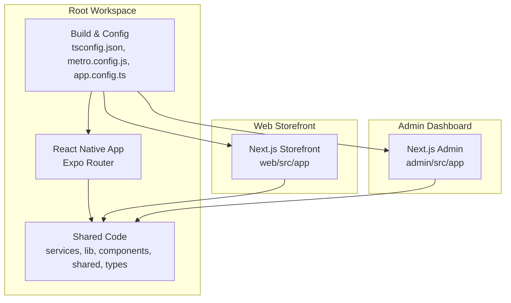
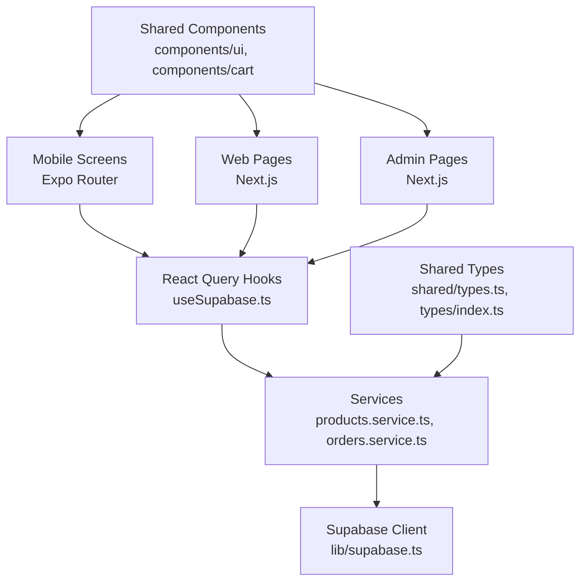
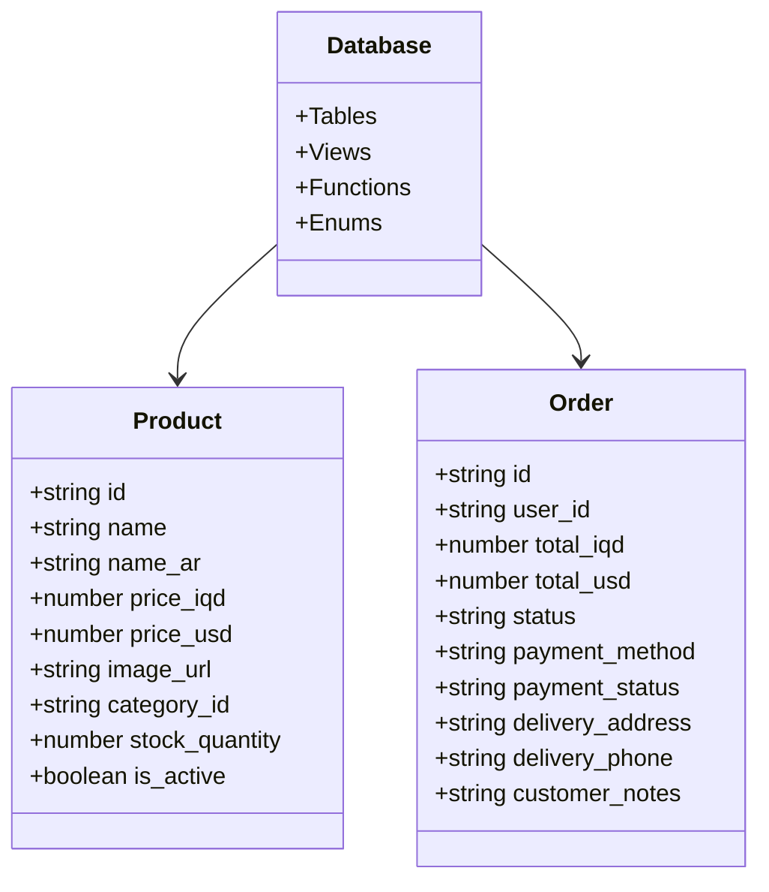
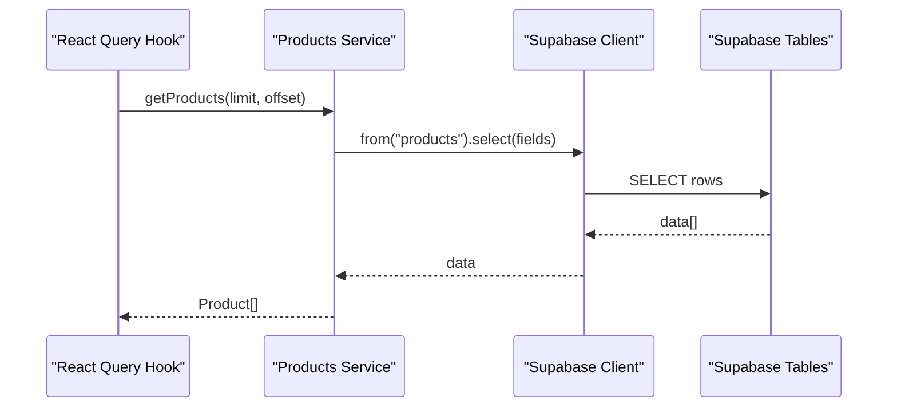
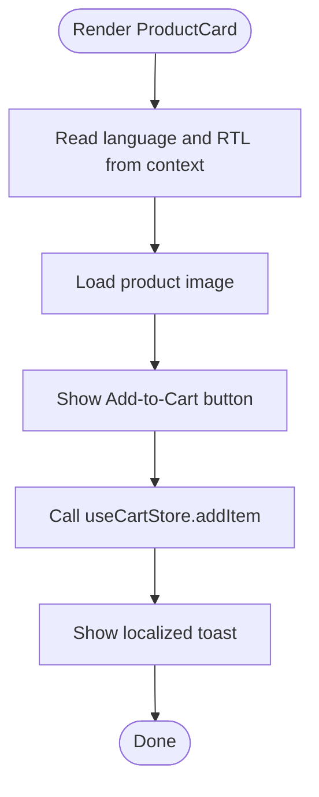
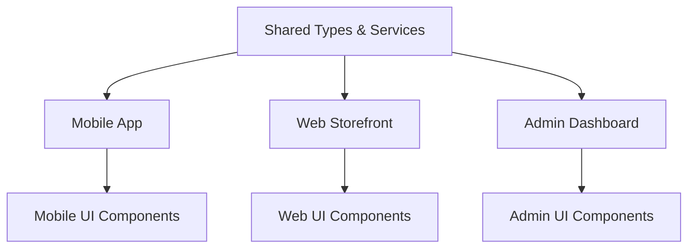
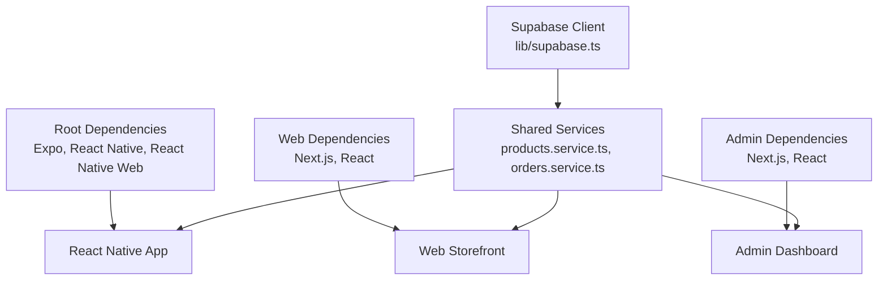

# Monorepo Structure and Cross-Platform Design

<cite>
**Referenced Files in This Document**
- [package.json](file://package.json)
- [tsconfig.json](file://tsconfig.json)
- [metro.config.js](file://metro.config.js)
- [app.config.ts](file://app.config.ts)
- [admin/package.json](file://admin/package.json)
- [admin/next.config.ts](file://admin/next.config.ts)
- [admin/tsconfig.json](file://admin/tsconfig.json)
- [web/package.json](file://web/package.json)
- [web/next.config.ts](file://web/next.config.ts)
- [web/tsconfig.json](file://web/tsconfig.json)
- [shared/types.ts](file://shared/types.ts)
- [types/index.ts](file://types/index.ts)
- [services/products.service.ts](file://services/products.service.ts)
- [services/orders.service.ts](file://services/orders.service.ts)
- [lib/supabase.ts](file://lib/supabase.ts)
- [hooks/useSupabase.ts](file://hooks/useSupabase.ts)
- [components/ui/ProductCard.tsx](file://components/ui/ProductCard.tsx)
- [components/cart/CartItem.tsx](file://components/cart/CartItem.tsx)
</cite>

## Table of Contents
1. [Introduction](#introduction)
2. [Project Structure](#project-structure)
3. [Core Components](#core-components)
4. [Architecture Overview](#architecture-overview)
5. [Detailed Component Analysis](#detailed-component-analysis)
6. [Dependency Analysis](#dependency-analysis)
7. [Performance Considerations](#performance-considerations)
8. [Troubleshooting Guide](#troubleshooting-guide)
9. [Conclusion](#conclusion)
10. [Appendices](#appendices)

## Introduction
This document explains the Al-Amal Center monorepo architecture and its cross-platform design. The repository maintains a single codebase that powers three distinct platforms:
- React Native mobile application (Expo Router-based)
- Next.js web storefront
- Next.js admin dashboard

It documents how shared code is organized, how platform-specific adaptations are handled, and how the build system and TypeScript configuration maximize code reuse while meeting platform requirements. It also covers the rationale for the monorepo approach, benefits realized, challenges addressed, development workflow, testing strategies, and deployment processes.

## Project Structure
The repository is organized as a monorepo with three primary workspaces:
- Root workspace: React Native mobile app with Expo and shared libraries
- Web storefront: Next.js application under the web directory
- Admin dashboard: Next.js application under the admin directory

Key characteristics:
- Shared business logic and data access live in the root-level services and lib directories
- Shared UI components and utilities are placed under components and shared
- Platform-specific pages and routes are isolated under each workspace’s src/app directory
- TypeScript configuration is centralized and extended per platform
- Metro bundler integrates with NativeWind for styling consistency across platforms

**Diagram sources**
- [package.json:1-65](file://package.json#L1-L65)
- [tsconfig.json:1-13](file://tsconfig.json#L1-L13)
- [metro.config.js:1-8](file://metro.config.js#L1-L8)
- [app.config.ts:1-75](file://app.config.ts#L1-L75)
- [web/next.config.ts:1-12](file://web/next.config.ts#L1-L12)
- [admin/next.config.ts:1-25](file://admin/next.config.ts#L1-L25)

**Section sources**
- [package.json:1-65](file://package.json#L1-L65)
- [tsconfig.json:1-13](file://tsconfig.json#L1-L13)
- [metro.config.js:1-8](file://metro.config.js#L1-L8)
- [app.config.ts:1-75](file://app.config.ts#L1-L75)
- [web/package.json:1-39](file://web/package.json#L1-L39)
- [admin/package.json:1-40](file://admin/package.json#L1-L40)

## Core Components
The core of the cross-platform design lies in shared services, data access, and UI components that adapt to platform constraints.

- Shared data access layer:
  - Supabase client initialization and typed database exports
  - Product and order services encapsulate Supabase queries and business logic
- Shared UI components:
  - Product card and cart item components that render consistently across platforms
- Shared types:
  - Strongly typed domain models for products, categories, orders, and related entities
- Hooks:
  - React Query hooks that wrap services for caching, invalidation, and optimistic updates

Practical examples:
- Shared types define database entities and API response shapes used by all platforms
- Services abstract Supabase calls and return normalized data
- Hooks provide a consistent data-fetching pattern across the app and admin dashboards

**Section sources**
- [lib/supabase.ts:1-30](file://lib/supabase.ts#L1-L30)
- [services/products.service.ts:1-449](file://services/products.service.ts#L1-L449)
- [services/orders.service.ts:1-115](file://services/orders.service.ts#L1-L115)
- [hooks/useSupabase.ts:1-239](file://hooks/useSupabase.ts#L1-L239)
- [shared/types.ts:1-353](file://shared/types.ts#L1-L353)
- [types/index.ts:1-276](file://types/index.ts#L1-L276)
- [components/ui/ProductCard.tsx:1-89](file://components/ui/ProductCard.tsx#L1-L89)
- [components/cart/CartItem.tsx:1-169](file://components/cart/CartItem.tsx#L1-L169)

## Architecture Overview
The system follows a layered architecture:
- Presentation layer: React Native screens and Next.js pages
- Domain layer: React Query hooks and service functions
- Data access layer: Supabase client and typed database schema
- Shared layer: Types, components, and utilities

**Diagram sources**
- [hooks/useSupabase.ts:1-239](file://hooks/useSupabase.ts#L1-L239)
- [services/products.service.ts:1-449](file://services/products.service.ts#L1-L449)
- [services/orders.service.ts:1-115](file://services/orders.service.ts#L1-L115)
- [lib/supabase.ts:1-30](file://lib/supabase.ts#L1-L30)
- [shared/types.ts:1-353](file://shared/types.ts#L1-L353)
- [types/index.ts:1-276](file://types/index.ts#L1-L276)
- [components/ui/ProductCard.tsx:1-89](file://components/ui/ProductCard.tsx#L1-L89)
- [components/cart/CartItem.tsx:1-169](file://components/cart/CartItem.tsx#L1-L169)

## Detailed Component Analysis

### Shared Types and Contracts
The shared types define the canonical domain model used across platforms. They include:
- Database-generated types for Supabase tables
- Derived types for entities, enums, and relations
- API response wrappers and pagination types
- Filters and sorting options

These types ensure consistent contracts between services, UI components, and admin dashboards.

**Diagram sources**
- [shared/types.ts:10-211](file://shared/types.ts#L10-L211)
- [types/index.ts:8-118](file://types/index.ts#L8-L118)

**Section sources**
- [shared/types.ts:1-353](file://shared/types.ts#L1-L353)
- [types/index.ts:1-276](file://types/index.ts#L1-L276)

### Data Access Layer
Supabase client initialization centralizes authentication and persistence. Services encapsulate CRUD and business logic, returning normalized data to the UI layer.

**Diagram sources**
- [hooks/useSupabase.ts:104-119](file://hooks/useSupabase.ts#L104-L119)
- [services/products.service.ts:18-28](file://services/products.service.ts#L18-L28)
- [lib/supabase.ts:1-30](file://lib/supabase.ts#L1-L30)

**Section sources**
- [lib/supabase.ts:1-30](file://lib/supabase.ts#L1-L30)
- [services/products.service.ts:1-449](file://services/products.service.ts#L1-L449)
- [services/orders.service.ts:1-115](file://services/orders.service.ts#L1-L115)
- [hooks/useSupabase.ts:1-239](file://hooks/useSupabase.ts#L1-L239)

### Shared UI Components
Shared components adapt to platform constraints while preserving behavior and appearance.

**Diagram sources**
- [components/ui/ProductCard.tsx:17-87](file://components/ui/ProductCard.tsx#L17-L87)

**Section sources**
- [components/ui/ProductCard.tsx:1-89](file://components/ui/ProductCard.tsx#L1-L89)
- [components/cart/CartItem.tsx:1-169](file://components/cart/CartItem.tsx#L1-L169)

### Conceptual Overview
The following conceptual diagram illustrates how the three platforms consume shared resources:

[No sources needed since this diagram shows conceptual workflow, not actual code structure]

## Dependency Analysis
The monorepo balances shared dependencies with platform-specific needs:
- Root workspace depends on Expo, React Native, and React Native Web for cross-platform rendering
- Web and Admin depend on Next.js and React for SSR/SSG
- Both web and admin share the same Supabase client and services
- Root workspace uses Metro with NativeWind for styling consistency

**Diagram sources**
- [package.json:12-56](file://package.json#L12-L56)
- [web/package.json:11-25](file://web/package.json#L11-L25)
- [admin/package.json:11-26](file://admin/package.json#L11-L26)
- [lib/supabase.ts:1-30](file://lib/supabase.ts#L1-L30)
- [services/products.service.ts:1-449](file://services/products.service.ts#L1-L449)
- [services/orders.service.ts:1-115](file://services/orders.service.ts#L1-L115)

**Section sources**
- [package.json:1-65](file://package.json#L1-L65)
- [web/package.json:1-39](file://web/package.json#L1-L39)
- [admin/package.json:1-40](file://admin/package.json#L1-L40)
- [lib/supabase.ts:1-30](file://lib/supabase.ts#L1-L30)

## Performance Considerations
- Data fetching: React Query caching reduces redundant network calls and improves perceived performance
- Image optimization: Next.js image optimization and caching policies minimize payload sizes
- Bundle size: Metro with NativeWind and selective imports reduce runtime overhead on mobile
- Pagination and filtering: Services implement range-based pagination and efficient filters to limit data transfer
- Local storage: Supabase auth persistence with AsyncStorage minimizes re-authentication overhead on mobile

[No sources needed since this section provides general guidance]

## Troubleshooting Guide
Common areas to check:
- Environment variables: Ensure EXPO_PUBLIC_SUPABASE_URL and EXPO_PUBLIC_SUPABASE_ANON_KEY are set for the root workspace
- Platform-specific builds: Verify Next.js configs for each platform and Metro config for the mobile app
- Type errors: Confirm shared types are included in each platform’s tsconfig include array
- Network requests: Validate Supabase client initialization and CORS/image remote patterns

**Section sources**
- [lib/supabase.ts:19-20](file://lib/supabase.ts#L19-L20)
- [web/next.config.ts:4-9](file://web/next.config.ts#L4-L9)
- [admin/next.config.ts:10-21](file://admin/next.config.ts#L10-L21)
- [tsconfig.json:6-12](file://tsconfig.json#L6-L12)
- [web/tsconfig.json:32-39](file://web/tsconfig.json#L32-L39)
- [admin/tsconfig.json:31-43](file://admin/tsconfig.json#L31-L43)

## Conclusion
The Al-Amal Center monorepo enables a unified codebase across three platforms by centralizing shared types, services, and UI components while allowing platform-specific routing and build configurations. The approach yields improved maintainability, faster iteration, and consistent user experiences across mobile, web, and admin environments. Challenges such as platform differences are mitigated through careful abstraction and configuration, ensuring scalability and developer productivity.

[No sources needed since this section summarizes without analyzing specific files]

## Appendices

### Build System and Configuration
- Root workspace:
  - Expo Router entrypoint and scripts
  - Metro with NativeWind for styling
  - Centralized TypeScript configuration extending Expo base
- Web storefront:
  - Next.js with React Compiler and Turbopack root pointing to parent
  - Strict TypeScript configuration with path aliases
- Admin dashboard:
  - Next.js with React Compiler and configured image remote patterns
  - Strict TypeScript configuration aligned with Expo base

**Section sources**
- [package.json:6-11](file://package.json#L6-L11)
- [metro.config.js:1-8](file://metro.config.js#L1-L8)
- [tsconfig.json:1-13](file://tsconfig.json#L1-L13)
- [web/next.config.ts:1-12](file://web/next.config.ts#L1-L12)
- [web/tsconfig.json:1-44](file://web/tsconfig.json#L1-L44)
- [admin/next.config.ts:1-25](file://admin/next.config.ts#L1-L25)
- [admin/tsconfig.json:1-45](file://admin/tsconfig.json#L1-L45)

### Development Workflow
- Shared changes: Modify shared types, services, or components in the root workspace
- Platform-specific pages: Add or adjust routes under web/src/app and admin/src/app
- Mobile navigation: Use Expo Router conventions for navigation and deep linking
- Testing: Use React Query Devtools and platform-specific emulators/simulators
- Deployment: Build and deploy Next.js apps independently; build and publish Expo app via EAS

[No sources needed since this section provides general guidance]

### Deployment Processes
- Expo app: Configure EAS build profiles and submit to stores
- Web storefront: Build static assets and deploy to hosting provider
- Admin dashboard: Build and deploy Next.js app to hosting provider

**Section sources**
- [app.config.ts:68-72](file://app.config.ts#L68-L72)
- [web/package.json:5-10](file://web/package.json#L5-L10)
- [admin/package.json:5-10](file://admin/package.json#L5-L10)