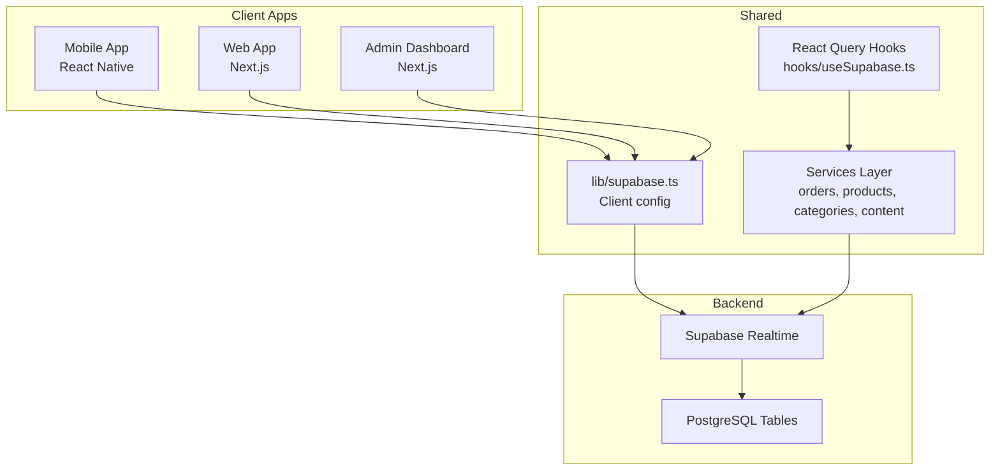
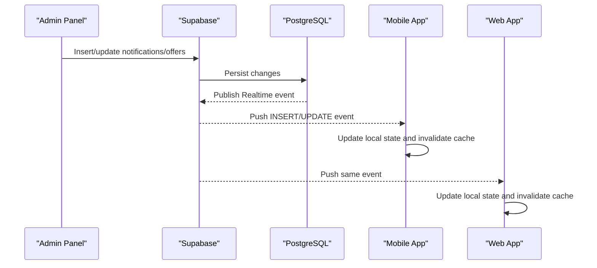
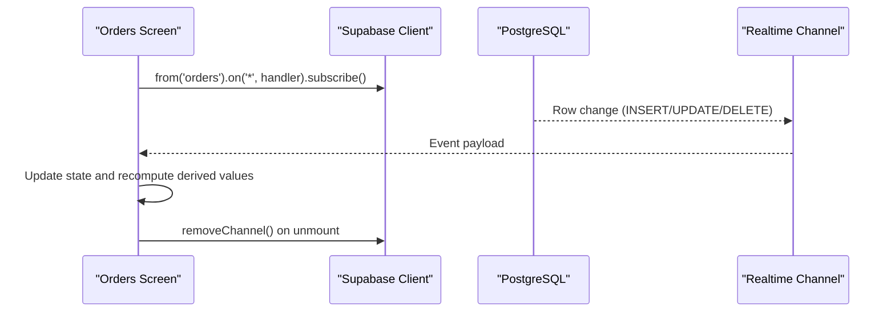
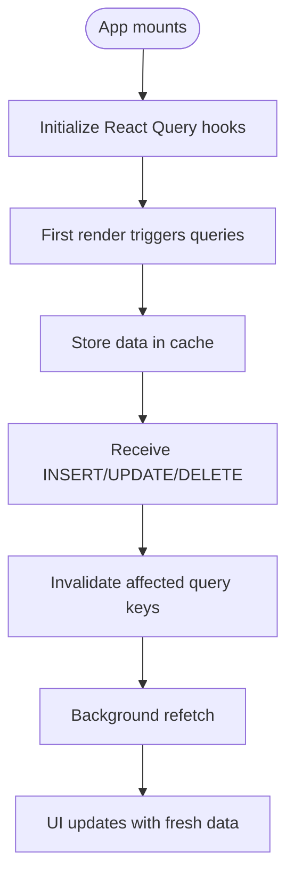
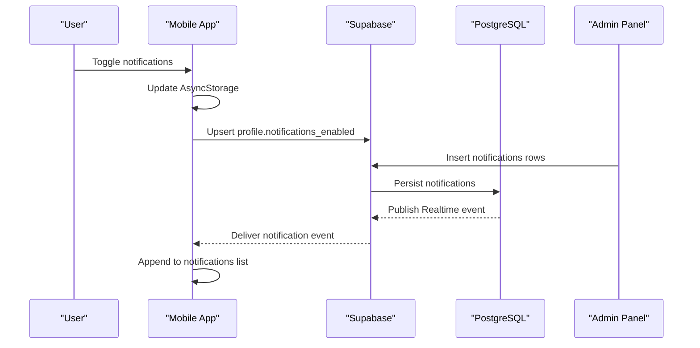
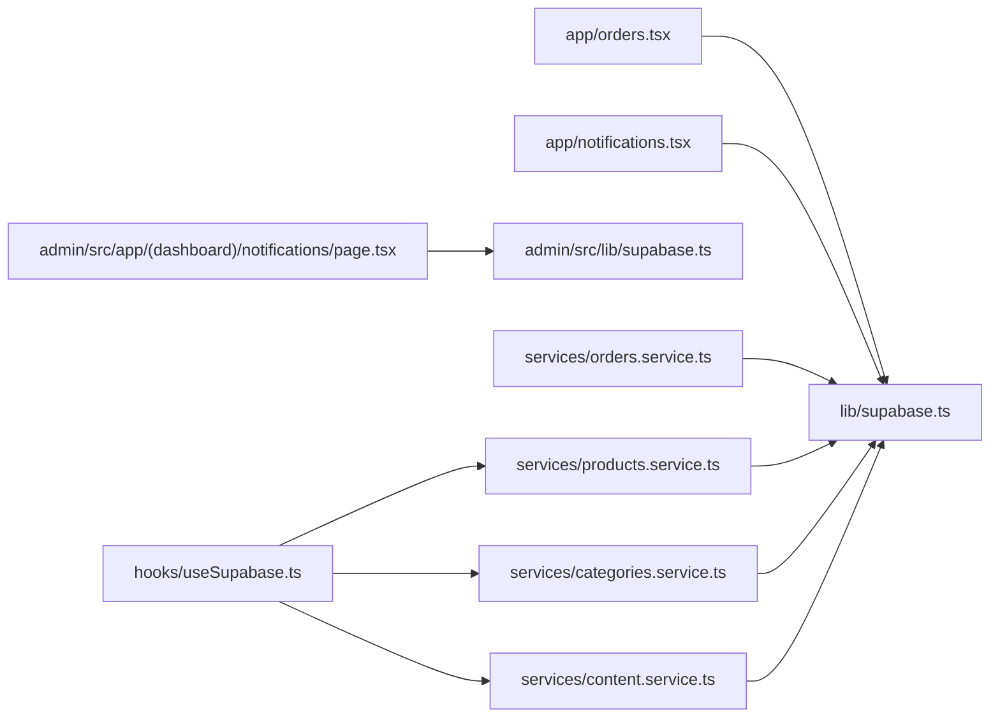

# Real-time Features and Supabase Realtime

<cite>
**Referenced Files in This Document**
- [lib/supabase.ts](file://lib/supabase.ts)
- [hooks/useSupabase.ts](file://hooks/useSupabase.ts)
- [services/orders.service.ts](file://services/orders.service.ts)
- [services/products.service.ts](file://services/products.service.ts)
- [services/categories.service.ts](file://services/categories.service.ts)
- [services/content.service.ts](file://services/content.service.ts)
- [app/orders.tsx](file://app/orders.tsx)
- [.docs/ORDERS_REALTIME_SETUP.md](file://.docs/ORDERS_REALTIME_SETUP.md)
- [app/notifications.tsx](file://app/notifications.tsx)
- [admin/src/app/(dashboard)/notifications/page.tsx](file://admin/src/app/(dashboard)/notifications/page.tsx)
- [admin/src/lib/supabase.ts](file://admin/src/lib/supabase.ts)
</cite>

## Table of Contents
1. [Introduction](#introduction)
2. [Project Structure](#project-structure)
3. [Core Components](#core-components)
4. [Architecture Overview](#architecture-overview)
5. [Detailed Component Analysis](#detailed-component-analysis)
6. [Dependency Analysis](#dependency-analysis)
7. [Performance Considerations](#performance-considerations)
8. [Troubleshooting Guide](#troubleshooting-guide)
9. [Conclusion](#conclusion)
10. [Appendices](#appendices)

## Introduction
This document describes the real-time architecture for Al-Amal Center’s commerce platform, powered by Supabase Realtime. It explains how live updates are delivered for orders, inventory/product listings, and promotional content, and how the system integrates with React Query for cache invalidation and UI updates. It also documents the notification system, including user preference management, and outlines strategies for real-time data synchronization, conflict resolution, offline-first behavior, performance, and error handling.

## Project Structure
The real-time capabilities span several layers:
- Supabase client initialization and configuration
- Service modules encapsulating database operations
- React Query hooks for caching and background synchronization
- UI screens subscribing to Supabase channels for live updates
- Admin panel for managing notifications and content
- Documentation guiding Supabase Realtime enablement

**Diagram sources**
- [lib/supabase.ts:1-30](file://lib/supabase.ts#L1-L30)
- [hooks/useSupabase.ts:1-239](file://hooks/useSupabase.ts#L1-L239)
- [services/orders.service.ts:1-115](file://services/orders.service.ts#L1-L115)
- [services/products.service.ts:1-449](file://services/products.service.ts#L1-L449)
- [services/categories.service.ts:1-137](file://services/categories.service.ts#L1-L137)
- [services/content.service.ts:1-147](file://services/content.service.ts#L1-L147)
- [admin/src/lib/supabase.ts:1-24](file://admin/src/lib/supabase.ts#L1-L24)

**Section sources**
- [lib/supabase.ts:1-30](file://lib/supabase.ts#L1-L30)
- [hooks/useSupabase.ts:1-239](file://hooks/useSupabase.ts#L1-L239)

## Core Components
- Supabase client configured with AsyncStorage-backed auth persistence for mobile.
- Service modules for orders, products, categories, and content encapsulate database queries.
- React Query hooks manage caching and background refetching for product and content lists.
- UI screens subscribe to Supabase channels for live updates and fall back to manual refresh.
- Notification system stores preferences locally and persists user opt-in/out to the database.

**Section sources**
- [lib/supabase.ts:1-30](file://lib/supabase.ts#L1-L30)
- [services/orders.service.ts:1-115](file://services/orders.service.ts#L1-L115)
- [services/products.service.ts:1-449](file://services/products.service.ts#L1-L449)
- [services/categories.service.ts:1-137](file://services/categories.service.ts#L1-L137)
- [services/content.service.ts:1-147](file://services/content.service.ts#L1-L147)
- [hooks/useSupabase.ts:1-239](file://hooks/useSupabase.ts#L1-L239)
- [app/orders.tsx:64-116](file://app/orders.tsx#L64-L116)
- [app/notifications.tsx:49-83](file://app/notifications.tsx#L49-L83)

## Architecture Overview
The system follows an event-driven pattern:
- Supabase Realtime publishes row-level events (INSERT, UPDATE, DELETE) on subscribed tables.
- Client screens subscribe to channels and update local state reactively.
- React Query manages long-lived queries and cache invalidation for product and content lists.
- Admin dashboard writes notifications and promotions into Supabase, which propagate to clients via Realtime.

**Diagram sources**
- [admin/src/app/(dashboard)/notifications/page.tsx:78-132](file://admin/src/app/(dashboard)/notifications/page.tsx#L78-L132)
- [services/content.service.ts:117-145](file://services/content.service.ts#L117-L145)
- [services/orders.service.ts:83-96](file://services/orders.service.ts#L83-L96)
- [app/orders.tsx:64-75](file://app/orders.tsx#L64-L75)
- [hooks/useSupabase.ts:124-134](file://hooks/useSupabase.ts#L124-L134)

## Detailed Component Analysis

### Supabase Client Initialization
- Creates a client with AsyncStorage-backed auth persistence for sessions and tokens.
- Exposes shared types for TypeScript safety across modules.

**Section sources**
- [lib/supabase.ts:1-30](file://lib/supabase.ts#L1-L30)

### Orders Real-time Subscription (Mobile)
- Subscribes to the orders table filtered by user_id.
- Handles INSERT, UPDATE, DELETE events to keep the UI synchronized.
- Includes pull-to-refresh fallback and cleanup on unmount.

**Diagram sources**
- [app/orders.tsx:64-85](file://app/orders.tsx#L64-L85)
- [.docs/ORDERS_REALTIME_SETUP.md:18-37](file://.docs/ORDERS_REALTIME_SETUP.md#L18-L37)

**Section sources**
- [app/orders.tsx:64-116](file://app/orders.tsx#L64-L116)
- [.docs/ORDERS_REALTIME_SETUP.md:1-37](file://.docs/ORDERS_REALTIME_SETUP.md#L1-L37)

### Inventory/Product Listings with React Query
- Services define typed queries for products, categories, and content.
- React Query hooks provide caching, background refetching, and selective invalidation.
- UI components rely on cached data and receive updates via Realtime.

**Diagram sources**
- [hooks/useSupabase.ts:104-119](file://hooks/useSupabase.ts#L104-L119)
- [services/products.service.ts:18-28](file://services/products.service.ts#L18-L28)
- [services/categories.service.ts:12-21](file://services/categories.service.ts#L12-L21)
- [services/content.service.ts:41-59](file://services/content.service.ts#L41-L59)

**Section sources**
- [hooks/useSupabase.ts:1-239](file://hooks/useSupabase.ts#L1-L239)
- [services/products.service.ts:1-449](file://services/products.service.ts#L1-L449)
- [services/categories.service.ts:1-137](file://services/categories.service.ts#L1-L137)
- [services/content.service.ts:1-147](file://services/content.service.ts#L1-L147)

### Notification System and User Preferences
- Users can toggle push notification preferences stored in AsyncStorage and persisted to the profiles table.
- Admin dashboard creates notifications targeting specific users or all users.
- Clients fetch notifications per user and mark as read.

**Diagram sources**
- [app/notifications.tsx:58-83](file://app/notifications.tsx#L58-L83)
- [app/notifications.tsx:129-151](file://app/notifications.tsx#L129-L151)
- [admin/src/app/(dashboard)/notifications/page.tsx:78-132](file://admin/src/app/(dashboard)/notifications/page.tsx#L78-L132)

**Section sources**
- [app/notifications.tsx:49-160](file://app/notifications.tsx#L49-L160)
- [admin/src/app/(dashboard)/notifications/page.tsx:33-132](file://admin/src/app/(dashboard)/notifications/page.tsx#L33-L132)

### Content Promotions Delivery
- Active banners, home sections, and promo banners are fetched via services and cached by React Query.
- Admin publishes content changes; clients receive updates through Realtime and refetch caches.

**Section sources**
- [services/content.service.ts:41-145](file://services/content.service.ts#L41-L145)
- [hooks/useSupabase.ts:192-217](file://hooks/useSupabase.ts#L192-L217)

### Admin Supabase Client
- Browser-based client used by the admin panel to write notifications and manage content.

**Section sources**
- [admin/src/lib/supabase.ts:1-24](file://admin/src/lib/supabase.ts#L1-L24)

## Dependency Analysis
- UI screens depend on the Supabase client for Realtime subscriptions.
- Services encapsulate database operations and are consumed by React Query hooks.
- Admin panel depends on a separate Supabase client for SSR and browser environments.
- Shared types unify data contracts across modules.

**Diagram sources**
- [app/orders.tsx:64-85](file://app/orders.tsx#L64-L85)
- [app/notifications.tsx:129-151](file://app/notifications.tsx#L129-L151)
- [admin/src/app/(dashboard)/notifications/page.tsx:78-132](file://admin/src/app/(dashboard)/notifications/page.tsx#L78-L132)
- [lib/supabase.ts:1-30](file://lib/supabase.ts#L1-L30)
- [admin/src/lib/supabase.ts:1-24](file://admin/src/lib/supabase.ts#L1-L24)
- [services/orders.service.ts:1-115](file://services/orders.service.ts#L1-L115)
- [services/products.service.ts:1-449](file://services/products.service.ts#L1-L449)
- [services/categories.service.ts:1-137](file://services/categories.service.ts#L1-L137)
- [services/content.service.ts:1-147](file://services/content.service.ts#L1-L147)
- [hooks/useSupabase.ts:1-239](file://hooks/useSupabase.ts#L1-L239)

**Section sources**
- [hooks/useSupabase.ts:1-239](file://hooks/useSupabase.ts#L1-L239)
- [services/orders.service.ts:1-115](file://services/orders.service.ts#L1-L115)
- [services/products.service.ts:1-449](file://services/products.service.ts#L1-L449)
- [services/categories.service.ts:1-137](file://services/categories.service.ts#L1-L137)
- [services/content.service.ts:1-147](file://services/content.service.ts#L1-L147)
- [app/orders.tsx:64-116](file://app/orders.tsx#L64-L116)
- [app/notifications.tsx:49-160](file://app/notifications.tsx#L49-L160)
- [admin/src/app/(dashboard)/notifications/page.tsx:33-132](file://admin/src/app/(dashboard)/notifications/page.tsx#L33-L132)
- [admin/src/lib/supabase.ts:1-24](file://admin/src/lib/supabase.ts#L1-L24)

## Performance Considerations
- Minimizing payload sizes: Services restrict selected columns for list views to reduce bandwidth.
- Efficient caching: React Query manages cache lifecycles and invalidation to avoid redundant network requests.
- Selective subscriptions: Channels filter by user_id or other attributes to reduce event volume.
- Background refetching: Queries refetch automatically when invalidated, balancing freshness and performance.
- Connection management: Keep-alive and reconnection are handled by the Supabase client; ensure proper cleanup on screen unmount.

[No sources needed since this section provides general guidance]

## Troubleshooting Guide
- Orders Realtime not updating:
  - Verify Realtime is enabled on the orders table and publication includes the table.
  - Ensure replica identity is set to FULL to deliver full row images.
- Network interruptions:
  - The Supabase client handles reconnection; ensure subscriptions are re-established after reconnect.
  - Implement retry logic and user feedback for transient failures.
- Graceful degradation:
  - Provide pull-to-refresh fallbacks and offline indicators.
  - Use optimistic updates with rollback on failure.
- Notification preferences:
  - Confirm AsyncStorage sync and upsert to profiles are executed together.
  - Validate that the notifications table is published to clients.

**Section sources**
- [.docs/ORDERS_REALTIME_SETUP.md:18-37](file://.docs/ORDERS_REALTIME_SETUP.md#L18-L37)
- [app/orders.tsx:80-85](file://app/orders.tsx#L80-L85)
- [app/notifications.tsx:58-83](file://app/notifications.tsx#L58-L83)

## Conclusion
Al-Amal Center’s real-time architecture leverages Supabase Realtime to synchronize orders, inventory/product listings, and promotional content across mobile, web, and admin interfaces. React Query ensures efficient caching and automatic UI updates, while user preferences and admin workflows integrate seamlessly with the event stream. Proper Supabase configuration, selective subscriptions, and robust error handling deliver a responsive, scalable, and resilient real-time experience.

[No sources needed since this section summarizes without analyzing specific files]

## Appendices

### Implementing Real-time Features Across Domains

- Order Tracking
  - Subscribe to the orders table filtered by user_id.
  - Handle INSERT for new orders, UPDATE for status changes, DELETE for soft-deleted rows.
  - Provide pull-to-refresh fallback and clean up subscriptions on unmount.

  **Section sources**
  - [app/orders.tsx:64-85](file://app/orders.tsx#L64-L85)
  - [.docs/ORDERS_REALTIME_SETUP.md:18-37](file://.docs/ORDERS_REALTIME_SETUP.md#L18-L37)

- Inventory Updates
  - Subscribe to the products table for stock_quantity and pricing changes.
  - Invalidate product list and detail caches on UPDATE to reflect stock changes.
  - Use column selection to minimize payload size.

  **Section sources**
  - [services/products.service.ts:13-13](file://services/products.service.ts#L13-L13)
  - [hooks/useSupabase.ts:104-119](file://hooks/useSupabase.ts#L104-L119)

- Promotional Content Delivery
  - Subscribe to banners, home_sections, and promo_banners tables.
  - Invalidate and refetch content-related queries on INSERT/UPDATE/DELETE.
  - Admin publishes content; clients receive updates and refresh UI.

  **Section sources**
  - [services/content.service.ts:41-145](file://services/content.service.ts#L41-L145)
  - [hooks/useSupabase.ts:192-217](file://hooks/useSupabase.ts#L192-L217)
  - [admin/src/app/(dashboard)/notifications/page.tsx:78-132](file://admin/src/app/(dashboard)/notifications/page.tsx#L78-L132)