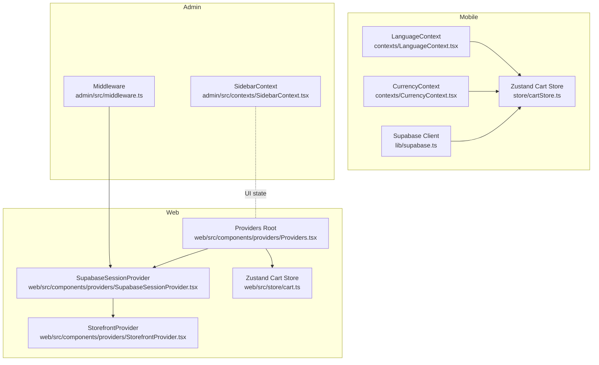
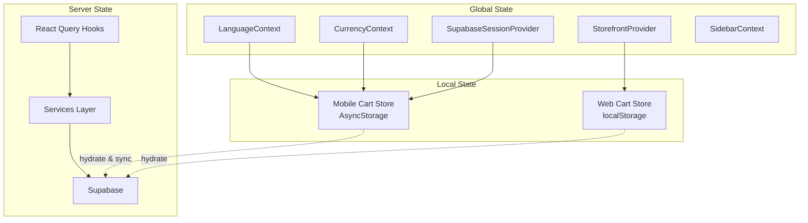
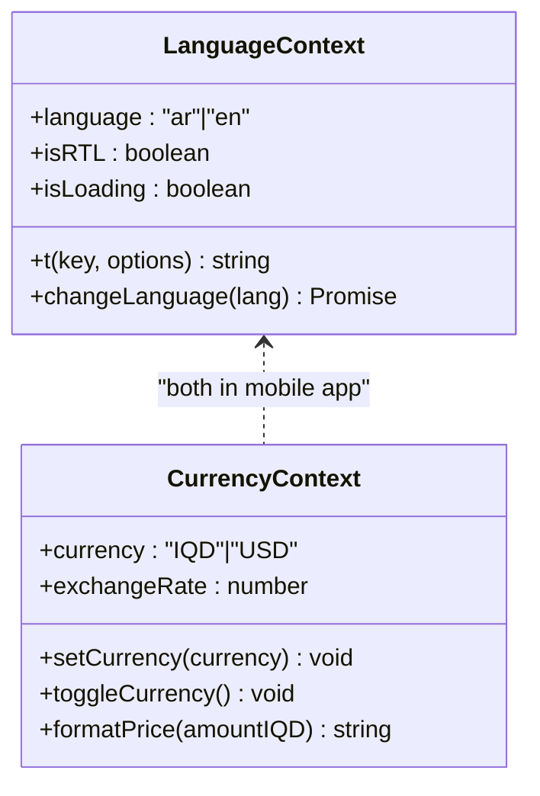
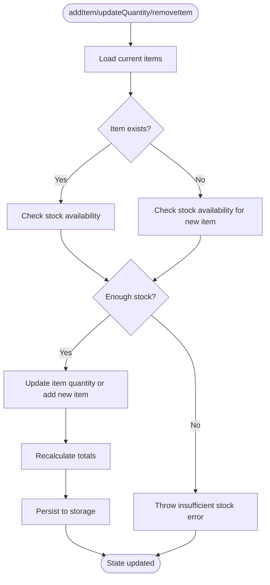
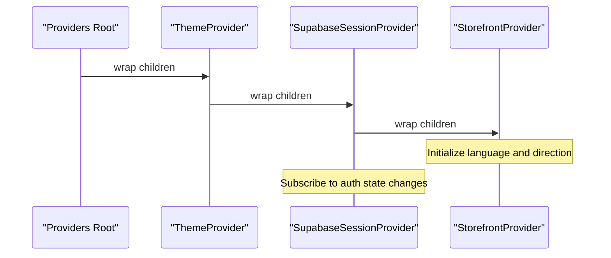
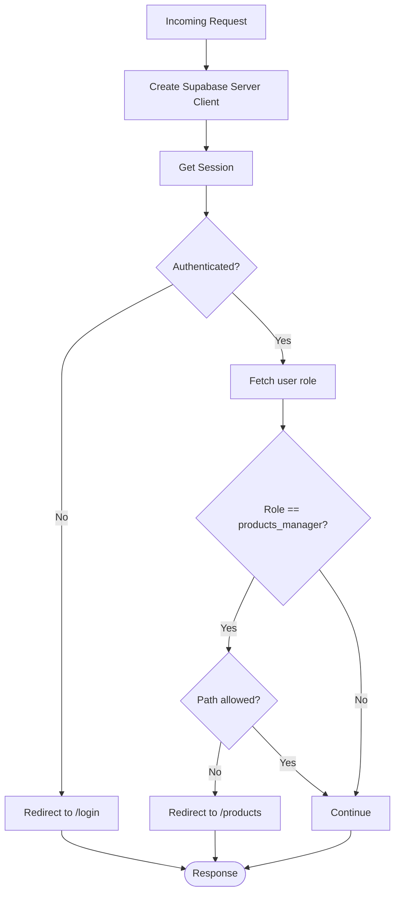
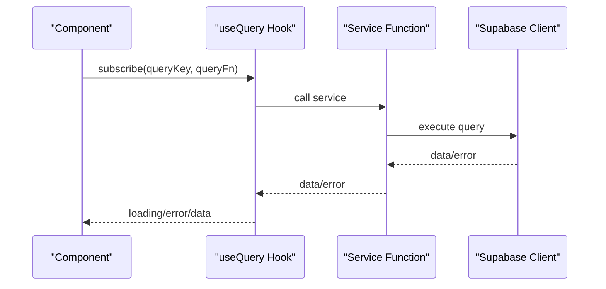
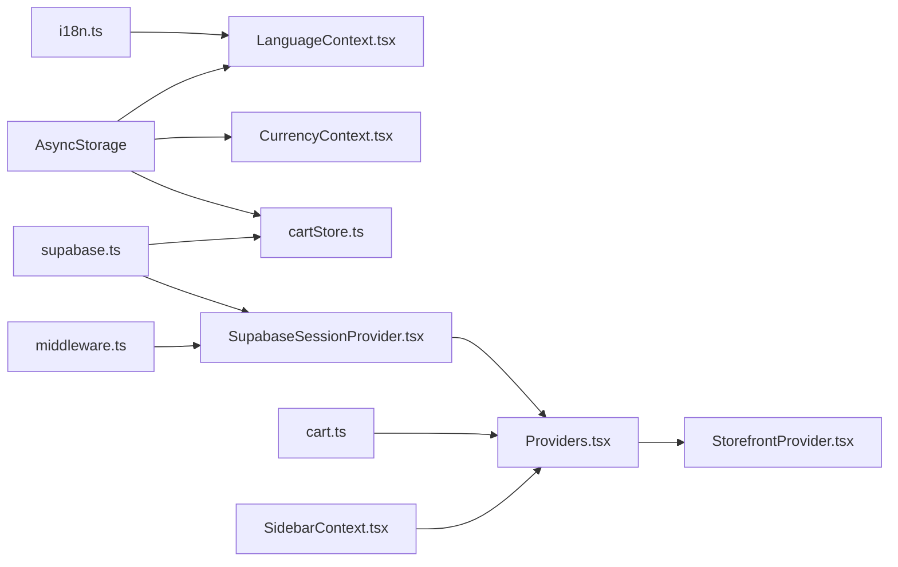

# State Management Architecture

<cite>
**Referenced Files in This Document**
- [LanguageContext.tsx](file://contexts/LanguageContext.tsx)
- [CurrencyContext.tsx](file://contexts/CurrencyContext.tsx)
- [cartStore.ts](file://store/cartStore.ts)
- [cart.ts](file://web/src/store/cart.ts)
- [Providers.tsx](file://web/src/components/providers/Providers.tsx)
- [StorefrontProvider.tsx](file://web/src/components/providers/StorefrontProvider.tsx)
- [SupabaseSessionProvider.tsx](file://web/src/components/providers/SupabaseSessionProvider.tsx)
- [SidebarContext.tsx](file://admin/src/contexts/SidebarContext.tsx)
- [middleware.ts](file://admin/src/middleware.ts)
- [useSupabase.ts](file://hooks/useSupabase.ts)
- [supabase.ts](file://lib/supabase.ts)
- [i18n.ts](file://lib/i18n.ts)
- [types.ts](file://shared/types.ts)
- [ErrorBoundary.tsx](file://components/ErrorBoundary.tsx)
</cite>

## Table of Contents
1. [Introduction](#introduction)
2. [Project Structure](#project-structure)
3. [Core Components](#core-components)
4. [Architecture Overview](#architecture-overview)
5. [Detailed Component Analysis](#detailed-component-analysis)
6. [Dependency Analysis](#dependency-analysis)
7. [Performance Considerations](#performance-considerations)
8. [Troubleshooting Guide](#troubleshooting-guide)
9. [Conclusion](#conclusion)
10. [Appendices](#appendices)

## Introduction
This document describes the hybrid state management architecture used by Al-Amal Center across mobile, web, and admin platforms. The system combines:
- React Context providers for global application state (language, currency, session, sidebar)
- Zustand stores for local component state (shopping cart) with persistence and cross-session synchronization
- React Query for server state management and caching
- Supabase for authentication and real-time session synchronization

The goal is to provide a clear understanding of provider hierarchy, state composition patterns, synchronization mechanisms, and best practices for extending the architecture.

## Project Structure
The state management spans three environments:
- Mobile (React Native): Contexts for language and currency, Zustand cart store, Supabase client configured with AsyncStorage
- Web: Provider stack for theme, session, and storefront language; Zustand cart store persisted to localStorage
- Admin: Middleware for session protection and role-based access control; Sidebar context for UI state

**Diagram sources**
- [LanguageContext.tsx:1-84](file://contexts/LanguageContext.tsx#L1-L84)
- [CurrencyContext.tsx:1-96](file://contexts/CurrencyContext.tsx#L1-L96)
- [cartStore.ts:1-174](file://store/cartStore.ts#L1-L174)
- [supabase.ts:1-30](file://lib/supabase.ts#L1-L30)
- [Providers.tsx:1-32](file://web/src/components/providers/Providers.tsx#L1-L32)
- [SupabaseSessionProvider.tsx:1-74](file://web/src/components/providers/SupabaseSessionProvider.tsx#L1-L74)
- [StorefrontProvider.tsx:1-89](file://web/src/components/providers/StorefrontProvider.tsx#L1-L89)
- [cart.ts:1-107](file://web/src/store/cart.ts#L1-L107)
- [middleware.ts:1-122](file://admin/src/middleware.ts#L1-L122)
- [SidebarContext.tsx:1-33](file://admin/src/contexts/SidebarContext.tsx#L1-L33)

**Section sources**
- [LanguageContext.tsx:1-84](file://contexts/LanguageContext.tsx#L1-L84)
- [CurrencyContext.tsx:1-96](file://contexts/CurrencyContext.tsx#L1-L96)
- [cartStore.ts:1-174](file://store/cartStore.ts#L1-L174)
- [cart.ts:1-107](file://web/src/store/cart.ts#L1-L107)
- [Providers.tsx:1-32](file://web/src/components/providers/Providers.tsx#L1-L32)
- [SupabaseSessionProvider.tsx:1-74](file://web/src/components/providers/SupabaseSessionProvider.tsx#L1-L74)
- [StorefrontProvider.tsx:1-89](file://web/src/components/providers/StorefrontProvider.tsx#L1-L89)
- [middleware.ts:1-122](file://admin/src/middleware.ts#L1-L122)
- [SidebarContext.tsx:1-33](file://admin/src/contexts/SidebarContext.tsx#L1-L33)

## Core Components
- Global contexts
  - LanguageContext: manages app language, RTL direction, translations, and hydration from AsyncStorage
  - CurrencyContext: manages currency selection, toggling, formatting, and persistence via AsyncStorage
  - StorefrontProvider (web): manages storefront language, direction, and cookie/localStorage sync
  - SupabaseSessionProvider (web): manages Supabase session lifecycle and auth state subscription
  - SidebarContext (admin): manages sidebar open/closed state
- Local state stores
  - Zustand cart stores (mobile and web): manage cart items, totals, persistence, and cross-session hydration
- Server state
  - React Query hooks for fetching categories, products, and content
  - Supabase client configured for mobile with AsyncStorage-backed auth
- Error handling
  - ErrorBoundary for graceful error recovery in mobile

**Section sources**
- [LanguageContext.tsx:12-84](file://contexts/LanguageContext.tsx#L12-L84)
- [CurrencyContext.tsx:7-96](file://contexts/CurrencyContext.tsx#L7-L96)
- [StorefrontProvider.tsx:20-89](file://web/src/components/providers/StorefrontProvider.tsx#L20-L89)
- [SupabaseSessionProvider.tsx:15-74](file://web/src/components/providers/SupabaseSessionProvider.tsx#L15-L74)
- [SidebarContext.tsx:5-33](file://admin/src/contexts/SidebarContext.tsx#L5-L33)
- [cartStore.ts:19-174](file://store/cartStore.ts#L19-L174)
- [cart.ts:13-107](file://web/src/store/cart.ts#L13-L107)
- [useSupabase.ts:7-147](file://hooks/useSupabase.ts#L7-L147)
- [supabase.ts:18-30](file://lib/supabase.ts#L18-L30)
- [ErrorBoundary.tsx:15-68](file://components/ErrorBoundary.tsx#L15-L68)

## Architecture Overview
The hybrid architecture separates concerns:
- Global state: React Contexts for language, currency, session, and UI state
- Local state: Zustand stores for shopping cart with persistence
- Server state: React Query with Supabase services
- Cross-platform synchronization: AsyncStorage (mobile) and localStorage (web) for cart persistence; Supabase auth subscriptions for session sync

**Diagram sources**
- [LanguageContext.tsx:26-62](file://contexts/LanguageContext.tsx#L26-L62)
- [CurrencyContext.tsx:23-80](file://contexts/CurrencyContext.tsx#L23-L80)
- [SupabaseSessionProvider.tsx:29-61](file://web/src/components/providers/SupabaseSessionProvider.tsx#L29-L61)
- [StorefrontProvider.tsx:43-78](file://web/src/components/providers/StorefrontProvider.tsx#L43-L78)
- [SidebarContext.tsx:13-24](file://admin/src/contexts/SidebarContext.tsx#L13-L24)
- [cartStore.ts:51-164](file://store/cartStore.ts#L51-L164)
- [cart.ts:33-107](file://web/src/store/cart.ts#L33-L107)
- [useSupabase.ts:41-147](file://hooks/useSupabase.ts#L41-L147)
- [supabase.ts:18-30](file://lib/supabase.ts#L18-L30)

## Detailed Component Analysis

### Language and Currency Contexts (Mobile)
- LanguageContext
  - Responsibilities: initialize language from AsyncStorage, expose translation function, toggle language, compute RTL flag
  - Hydration: loads saved language on mount, sets RTL accordingly
  - Fallback: safe hook returns defaults if provider is missing
- CurrencyContext
  - Responsibilities: persist currency choice, toggle between IQD and USD, format prices per locale and currency
  - Persistence: AsyncStorage-backed
  - Fallback: safe hook returns defaults if provider is missing

**Diagram sources**
- [LanguageContext.tsx:12-84](file://contexts/LanguageContext.tsx#L12-L84)
- [CurrencyContext.tsx:7-96](file://contexts/CurrencyContext.tsx#L7-L96)

**Section sources**
- [LanguageContext.tsx:26-84](file://contexts/LanguageContext.tsx#L26-L84)
- [CurrencyContext.tsx:23-96](file://contexts/CurrencyContext.tsx#L23-L96)
- [i18n.ts:24-81](file://lib/i18n.ts#L24-L81)

### Zustand Cart Stores (Mobile and Web)
- Mobile cart store
  - Persistence: AsyncStorage via zustand/persist
  - Totals calculation: computed on updates and hydration
  - Stock validation: prevents adding more than available
  - Cross-session sync: rehydrates on app start
- Web cart store
  - Persistence: localStorage via zustand/persist
  - Totals calculation: computed on updates and hydration
  - Stock validation: clamps quantity to available stock

**Diagram sources**
- [cartStore.ts:59-149](file://store/cartStore.ts#L59-L149)
- [cart.ts:39-92](file://web/src/store/cart.ts#L39-L92)

**Section sources**
- [cartStore.ts:51-174](file://store/cartStore.ts#L51-L174)
- [cart.ts:33-107](file://web/src/store/cart.ts#L33-L107)

### Provider Hierarchy (Web)
- Providers composes:
  - ThemeProvider for theme switching
  - SupabaseSessionProvider for auth state subscription and session hydration
  - StorefrontProvider for storefront language and direction propagation
- StorefrontProvider writes language to HTML lang/dir attributes and persists to cookie/localStorage
- SupabaseSessionProvider initializes Supabase client and subscribes to auth state changes

**Diagram sources**
- [Providers.tsx:17-31](file://web/src/components/providers/Providers.tsx#L17-L31)
- [SupabaseSessionProvider.tsx:29-61](file://web/src/components/providers/SupabaseSessionProvider.tsx#L29-L61)
- [StorefrontProvider.tsx:43-78](file://web/src/components/providers/StorefrontProvider.tsx#L43-L78)

**Section sources**
- [Providers.tsx:17-32](file://web/src/components/providers/Providers.tsx#L17-L32)
- [SupabaseSessionProvider.tsx:29-74](file://web/src/components/providers/SupabaseSessionProvider.tsx#L29-L74)
- [StorefrontProvider.tsx:43-89](file://web/src/components/providers/StorefrontProvider.tsx#L43-L89)

### Admin Middleware and Sidebar Context
- Middleware
  - Protects routes using Supabase SSR client
  - Enforces role-based access control for products manager
  - Manages redirects for login and dashboard
- SidebarContext
  - Provides UI state for admin sidebar visibility

**Diagram sources**
- [middleware.ts:4-108](file://admin/src/middleware.ts#L4-L108)
- [SidebarContext.tsx:13-33](file://admin/src/contexts/SidebarContext.tsx#L13-L33)

**Section sources**
- [middleware.ts:4-122](file://admin/src/middleware.ts#L4-L122)
- [SidebarContext.tsx:13-33](file://admin/src/contexts/SidebarContext.tsx#L13-L33)

### Server State Management with React Query
- React Query hooks encapsulate service calls for categories, products, and content
- Supabase client configured for mobile with AsyncStorage-backed auth
- Hooks provide caching, invalidation, and optimistic updates patterns

**Diagram sources**
- [useSupabase.ts:41-147](file://hooks/useSupabase.ts#L41-L147)
- [supabase.ts:18-30](file://lib/supabase.ts#L18-L30)

**Section sources**
- [useSupabase.ts:7-147](file://hooks/useSupabase.ts#L7-L147)
- [supabase.ts:18-30](file://lib/supabase.ts#L18-L30)

## Dependency Analysis
- Mobile
  - LanguageContext depends on i18n and AsyncStorage
  - CurrencyContext depends on AsyncStorage
  - Cart store depends on AsyncStorage and Supabase types
  - Supabase client configured with AsyncStorage for auth persistence
- Web
  - Providers depend on SupabaseSessionProvider and StorefrontProvider
  - Cart store depends on localStorage
- Admin
  - Middleware depends on Supabase SSR client and database roles
  - SidebarContext is UI-only

**Diagram sources**
- [i18n.ts:1-81](file://lib/i18n.ts#L1-L81)
- [LanguageContext.tsx:1-84](file://contexts/LanguageContext.tsx#L1-L84)
- [CurrencyContext.tsx:1-96](file://contexts/CurrencyContext.tsx#L1-L96)
- [cartStore.ts:1-174](file://store/cartStore.ts#L1-L174)
- [supabase.ts:1-30](file://lib/supabase.ts#L1-L30)
- [SupabaseSessionProvider.tsx:1-74](file://web/src/components/providers/SupabaseSessionProvider.tsx#L1-L74)
- [Providers.tsx:1-32](file://web/src/components/providers/Providers.tsx#L1-L32)
- [StorefrontProvider.tsx:1-89](file://web/src/components/providers/StorefrontProvider.tsx#L1-L89)
- [cart.ts:1-107](file://web/src/store/cart.ts#L1-L107)
- [middleware.ts:1-122](file://admin/src/middleware.ts#L1-L122)
- [SidebarContext.tsx:1-33](file://admin/src/contexts/SidebarContext.tsx#L1-L33)

**Section sources**
- [i18n.ts:1-81](file://lib/i18n.ts#L1-L81)
- [LanguageContext.tsx:1-84](file://contexts/LanguageContext.tsx#L1-L84)
- [CurrencyContext.tsx:1-96](file://contexts/CurrencyContext.tsx#L1-L96)
- [cartStore.ts:1-174](file://store/cartStore.ts#L1-L174)
- [supabase.ts:1-30](file://lib/supabase.ts#L1-L30)
- [SupabaseSessionProvider.tsx:1-74](file://web/src/components/providers/SupabaseSessionProvider.tsx#L1-L74)
- [Providers.tsx:1-32](file://web/src/components/providers/Providers.tsx#L1-L32)
- [StorefrontProvider.tsx:1-89](file://web/src/components/providers/StorefrontProvider.tsx#L1-L89)
- [cart.ts:1-107](file://web/src/store/cart.ts#L1-L107)
- [middleware.ts:1-122](file://admin/src/middleware.ts#L1-L122)
- [SidebarContext.tsx:1-33](file://admin/src/contexts/SidebarContext.tsx#L1-L33)

## Performance Considerations
- Minimize re-renders
  - Use shallow equality for cart updates; avoid unnecessary object churn
  - Split contexts to reduce provider re-renders (language vs currency)
- Persistence efficiency
  - Batch updates before persisting (already handled by Zustand persist)
  - Debounce heavy operations (e.g., frequent stock checks)
- Network efficiency
  - Use React Query’s caching and background refetch strategies
  - Enable selective queries with enabled flags
- Memory hygiene
  - Unsubscribe from Supabase auth state changes on unmount
  - Clear hydrated state when appropriate

## Troubleshooting Guide
- Language and currency not persisting
  - Verify AsyncStorage keys and permissions on mobile
  - Confirm cookie/localStorage availability on web
- Cart not syncing across sessions
  - Ensure persist middleware is configured and storage is accessible
  - Check onRehydrateStorage handlers for recalculation
- Auth state not updating
  - Confirm Supabase auth subscription is active and session retrieval completes
  - Validate middleware redirects and role checks
- Error boundaries
  - Use ErrorBoundary to gracefully handle rendering errors and provide retry actions

**Section sources**
- [cartStore.ts:150-164](file://store/cartStore.ts#L150-L164)
- [cart.ts:94-106](file://web/src/store/cart.ts#L94-L106)
- [SupabaseSessionProvider.tsx:36-52](file://web/src/components/providers/SupabaseSessionProvider.tsx#L36-L52)
- [middleware.ts:57-107](file://admin/src/middleware.ts#L57-L107)
- [ErrorBoundary.tsx:15-68](file://components/ErrorBoundary.tsx#L15-L68)

## Conclusion
Al-Amal Center’s state management leverages a clean hybrid model:
- Global contexts for language, currency, session, and UI state
- Local Zustand stores for cart with robust persistence and hydration
- React Query for efficient server state management
- Platform-specific storage (AsyncStorage vs localStorage) and Supabase auth subscriptions for synchronization

This separation enables scalable, maintainable state management across mobile, web, and admin experiences.

## Appendices
- Extending the architecture
  - Add new contexts for platform-specific features while keeping shared contexts minimal
  - Introduce domain-specific Zustand slices for feature areas (e.g., filters, notifications)
  - Centralize server state in services and keep hooks focused on caching and UX
  - Use typed Supabase clients and shared types for consistency
- Best practices
  - Keep context providers granular and lazy-load where possible
  - Prefer immutable updates and computed selectors for performance
  - Use React Query’s queryClient for cache invalidation after cart mutations
  - Implement structured error logging and user-friendly fallbacks