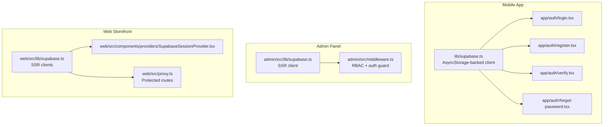
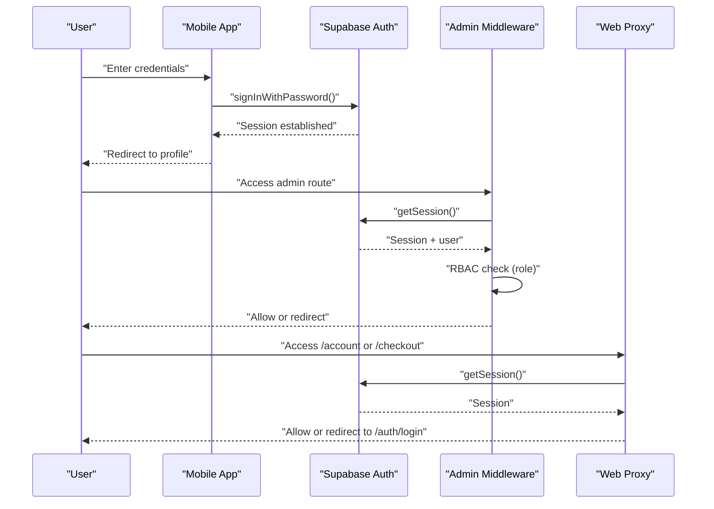
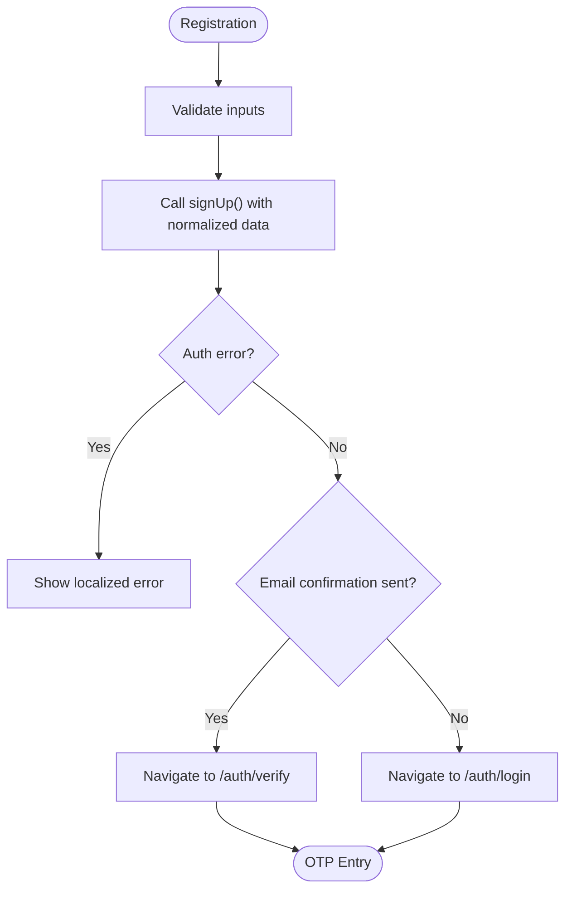
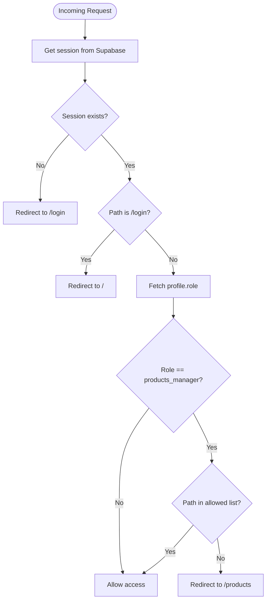
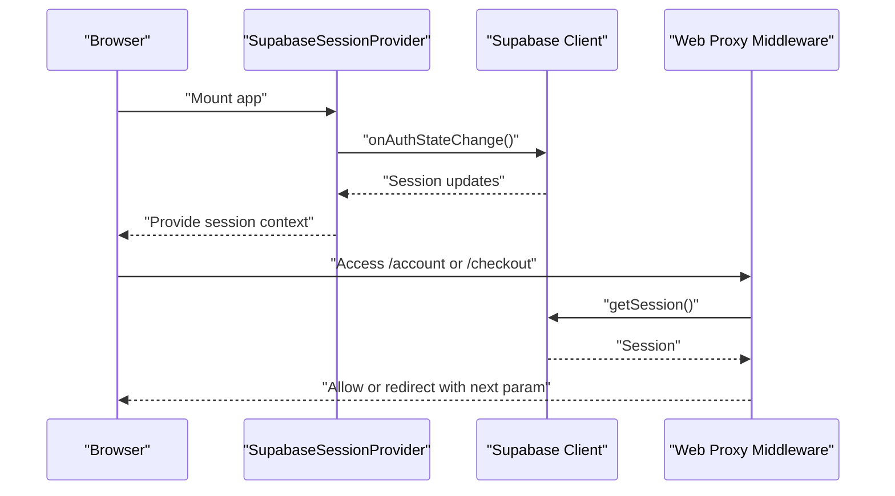
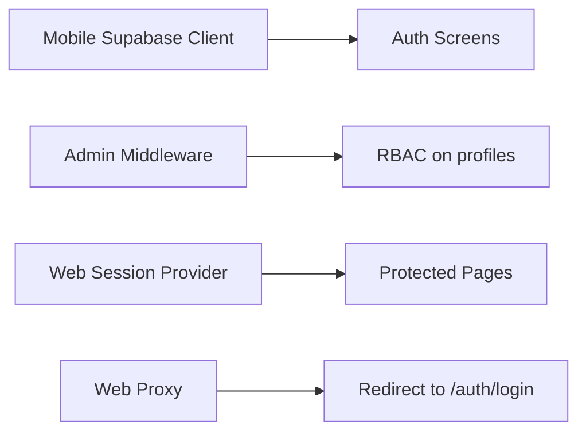

# Authentication and Security

<cite>
**Referenced Files in This Document**
- [lib/supabase.ts](file://lib/supabase.ts)
- [hooks/useSupabase.ts](file://hooks/useSupabase.ts)
- [admin/src/lib/supabase.ts](file://admin/src/lib/supabase.ts)
- [web/src/lib/supabase.ts](file://web/src/lib/supabase.ts)
- [app/auth/login.tsx](file://app/auth/login.tsx)
- [app/auth/register.tsx](file://app/auth/register.tsx)
- [app/auth/forgot-password.tsx](file://app/auth/forgot-password.tsx)
- [app/auth/verify.tsx](file://app/auth/verify.tsx)
- [admin/src/middleware.ts](file://admin/src/middleware.ts)
- [web/src/components/providers/SupabaseSessionProvider.tsx](file://web/src/components/providers/SupabaseSessionProvider.tsx)
- [web/src/proxy.ts](file://web/src/proxy.ts)
- [web/src/app/auth/login/page.tsx](file://web/src/app/auth/login/page.tsx)
- [shared/types.ts](file://shared/types.ts)
- [app/profile/change-password.tsx](file://app/profile/change-password.tsx)
- [web/src/components/checkout/CheckoutFlow.tsx](file://web/src/components/checkout/CheckoutFlow.tsx)
</cite>

## Table of Contents
1. [Introduction](#introduction)
2. [Project Structure](#project-structure)
3. [Core Components](#core-components)
4. [Architecture Overview](#architecture-overview)
5. [Detailed Component Analysis](#detailed-component-analysis)
6. [Dependency Analysis](#dependency-analysis)
7. [Performance Considerations](#performance-considerations)
8. [Security Measures](#security-measures)
9. [Protected Routes and Middleware](#protected-routes-and-middleware)
10. [Real-time Synchronization and Session Persistence](#real-time-synchronization-and-session-persistence)
11. [Troubleshooting Guide](#troubleshooting-guide)
12. [Compliance and Audit](#compliance-and-audit)
13. [Extensibility Guidelines](#extensibility-guidelines)
14. [Conclusion](#conclusion)

## Introduction
This document explains the authentication and security system across the mobile app, admin panel, and web storefront. It covers Supabase Auth integration, user registration and login flows, email verification, password reset, session management, token handling, role-based access control (RBAC), protected routes, middleware, and security best practices. It also addresses real-time synchronization, session persistence across devices, troubleshooting, audits, and extension guidelines.

## Project Structure
Authentication spans three platforms:
- Mobile app (Expo): local Supabase client with AsyncStorage-backed sessions.
- Admin (Next.js): server-side middleware with Supabase SSR client and RBAC.
- Web storefront (Next.js): browser session provider and server middleware for protected routes.

**Diagram sources**
- [lib/supabase.ts:1-30](file://lib/supabase.ts#L1-L30)
- [admin/src/lib/supabase.ts:1-24](file://admin/src/lib/supabase.ts#L1-L24)
- [web/src/lib/supabase.ts:1-36](file://web/src/lib/supabase.ts#L1-L36)
- [app/auth/login.tsx:1-171](file://app/auth/login.tsx#L1-L171)
- [app/auth/register.tsx:1-324](file://app/auth/register.tsx#L1-L324)
- [app/auth/verify.tsx:1-145](file://app/auth/verify.tsx#L1-L145)
- [app/auth/forgot-password.tsx:1-134](file://app/auth/forgot-password.tsx#L1-L134)
- [admin/src/middleware.ts:1-122](file://admin/src/middleware.ts#L1-L122)
- [web/src/components/providers/SupabaseSessionProvider.tsx:1-74](file://web/src/components/providers/SupabaseSessionProvider.tsx#L1-L74)
- [web/src/proxy.ts:1-82](file://web/src/proxy.ts#L1-L82)

**Section sources**
- [lib/supabase.ts:1-30](file://lib/supabase.ts#L1-L30)
- [admin/src/lib/supabase.ts:1-24](file://admin/src/lib/supabase.ts#L1-L24)
- [web/src/lib/supabase.ts:1-36](file://web/src/lib/supabase.ts#L1-L36)

## Core Components
- Supabase clients per platform:
  - Mobile: AsyncStorage-backed client with automatic token refresh and persisted sessions.
  - Admin: SSR client for server-side auth state and RBAC.
  - Web: Separate browser and server clients; session provider listens to auth state changes.
- Authentication screens:
  - Login, register, email verification, and password reset flows.
- Protected routes and middleware:
  - Admin middleware enforces session presence and role-based restrictions.
  - Web proxy middleware protects account/checkout routes and redirects unauthenticated users.

**Section sources**
- [lib/supabase.ts:19-30](file://lib/supabase.ts#L19-L30)
- [admin/src/middleware.ts:57-105](file://admin/src/middleware.ts#L57-L105)
- [web/src/proxy.ts:63-77](file://web/src/proxy.ts#L63-L77)
- [web/src/components/providers/SupabaseSessionProvider.tsx:36-52](file://web/src/components/providers/SupabaseSessionProvider.tsx#L36-L52)

## Architecture Overview
The system uses Supabase Auth for identity and session management. On the client, Supabase emits auth state events that update UI and routing. On the server, middleware validates sessions and applies RBAC policies.

**Diagram sources**
- [app/auth/login.tsx:50-85](file://app/auth/login.tsx#L50-L85)
- [admin/src/middleware.ts:57-105](file://admin/src/middleware.ts#L57-L105)
- [web/src/proxy.ts:63-77](file://web/src/proxy.ts#L63-L77)

## Detailed Component Analysis

### Mobile Authentication Flows
- Registration:
  - Validates inputs with Zod, normalizes email/phone/full name, and calls Supabase sign-up with user metadata.
  - Handles confirmation email errors and navigates to OTP verification or login depending on outcome.
- Login:
  - Normalizes email to lowercase and trims whitespace, then signs in with password.
  - Special-case handling for unconfirmed emails: prompts to verify OTP.
- Email Verification:
  - Accepts a 6-digit OTP, resends OTP via Supabase resend, and activates session upon successful verification.
- Password Reset:
  - Sends password reset email with a deep-link redirect configured for the app.

**Diagram sources**
- [app/auth/register.tsx:92-149](file://app/auth/register.tsx#L92-L149)
- [app/auth/verify.tsx:43-71](file://app/auth/verify.tsx#L43-L71)

**Section sources**
- [app/auth/register.tsx:1-324](file://app/auth/register.tsx#L1-L324)
- [app/auth/login.tsx:1-171](file://app/auth/login.tsx#L1-L171)
- [app/auth/verify.tsx:1-145](file://app/auth/verify.tsx#L1-L145)
- [app/auth/forgot-password.tsx:1-134](file://app/auth/forgot-password.tsx#L1-L134)

### Admin Middleware and RBAC
- Enforces session presence; redirects unauthenticated users to login.
- Prevents logged-in users from accessing the login page.
- Performs role-based access control:
  - Reads user role from the profiles table.
  - Restricts products_manager to viewing/editing products and categories.
  - Redirects unauthorized paths to the products dashboard.

**Diagram sources**
- [admin/src/middleware.ts:57-105](file://admin/src/middleware.ts#L57-L105)

**Section sources**
- [admin/src/middleware.ts:1-122](file://admin/src/middleware.ts#L1-L122)
- [shared/types.ts:132-154](file://shared/types.ts#L132-L154)

### Web Session Provider and Protected Routes
- Browser session provider:
  - Subscribes to auth state changes and persists session in React context.
  - Initializes session from Supabase on mount.
- Proxy middleware:
  - Protects account and checkout routes by checking session and redirecting unauthenticated users with a next parameter.
- Login page:
  - Uses Supabase client to sign in and redirects to the intended destination after successful authentication.

**Diagram sources**
- [web/src/components/providers/SupabaseSessionProvider.tsx:36-52](file://web/src/components/providers/SupabaseSessionProvider.tsx#L36-L52)
- [web/src/proxy.ts:63-77](file://web/src/proxy.ts#L63-L77)
- [web/src/app/auth/login/page.tsx:48-66](file://web/src/app/auth/login/page.tsx#L48-L66)

**Section sources**
- [web/src/components/providers/SupabaseSessionProvider.tsx:1-74](file://web/src/components/providers/SupabaseSessionProvider.tsx#L1-L74)
- [web/src/proxy.ts:1-82](file://web/src/proxy.ts#L1-L82)
- [web/src/app/auth/login/page.tsx:1-83](file://web/src/app/auth/login/page.tsx#L1-L83)

### Password Change Flow (Mobile)
- Requires current session and re-authenticates with current password before allowing updates.
- Ensures the user is logged in before proceeding.

**Section sources**
- [app/profile/change-password.tsx:97-117](file://app/profile/change-password.tsx#L97-L117)

## Dependency Analysis
- Mobile depends on AsyncStorage-backed Supabase client for offline resilience and persisted sessions.
- Admin relies on server middleware to enforce auth and roles.
- Web uses separate browser and server clients; session provider centralizes auth state in the UI.

**Diagram sources**
- [lib/supabase.ts:19-30](file://lib/supabase.ts#L19-L30)
- [admin/src/middleware.ts:74-105](file://admin/src/middleware.ts#L74-L105)
- [web/src/components/providers/SupabaseSessionProvider.tsx:36-52](file://web/src/components/providers/SupabaseSessionProvider.tsx#L36-L52)
- [web/src/proxy.ts:63-77](file://web/src/proxy.ts#L63-L77)

**Section sources**
- [lib/supabase.ts:1-30](file://lib/supabase.ts#L1-L30)
- [admin/src/middleware.ts:1-122](file://admin/src/middleware.ts#L1-L122)
- [web/src/components/providers/SupabaseSessionProvider.tsx:1-74](file://web/src/components/providers/SupabaseSessionProvider.tsx#L1-L74)
- [web/src/proxy.ts:1-82](file://web/src/proxy.ts#L1-L82)

## Performance Considerations
- Token refresh and persisted sessions reduce network overhead and improve UX.
- Auth state subscriptions update UI efficiently without polling.
- Middleware checks are lightweight; keep selectors minimal (e.g., single column reads for roles).
- Avoid heavy computations in auth state handlers; defer to background tasks.

## Security Measures
- Input validation:
  - Zod schemas validate registration and login forms; normalization trims and lowercases inputs to prevent trivial bypasses.
- Email verification:
  - OTP-based verification ensures primary email ownership before granting access.
- Password reset:
  - Secure reset links with deep-link redirection to the app.
- XSS and injection prevention:
  - Normalize and sanitize inputs; avoid inline HTML rendering with dynamic content.
  - Use platform-specific safe input components and controlled fields.
- Token handling:
  - Auto-refresh tokens and persisted sessions managed by Supabase client.
- CORS and redirect safety:
  - Configure Supabase redirect URLs carefully; ensure they match app deep links.

**Section sources**
- [app/auth/register.tsx:17-31](file://app/auth/register.tsx#L17-L31)
- [app/auth/login.tsx:16-19](file://app/auth/login.tsx#L16-L19)
- [app/auth/forgot-password.tsx:22-24](file://app/auth/forgot-password.tsx#L22-L24)
- [app/auth/verify.tsx:43-71](file://app/auth/verify.tsx#L43-L71)

## Protected Routes and Middleware
- Admin:
  - Session enforcement and RBAC applied server-side; restricts products_manager to specific paths.
- Web:
  - Proxy middleware protects account and checkout pages; redirects unauthenticated users and preserves intended destination.
- Mobile:
  - Navigation guards and auth state listeners ensure UI reflects current session state.

**Section sources**
- [admin/src/middleware.ts:57-105](file://admin/src/middleware.ts#L57-L105)
- [web/src/proxy.ts:63-77](file://web/src/proxy.ts#L63-L77)
- [web/src/components/providers/SupabaseSessionProvider.tsx:36-52](file://web/src/components/providers/SupabaseSessionProvider.tsx#L36-L52)

## Real-time Synchronization and Session Persistence
- Mobile:
  - AsyncStorage-backed client maintains sessions across app restarts; auto-refresh keeps tokens valid.
- Web:
  - Auth state subscription updates UI reactively; server middleware ensures server-side session integrity.
- Cross-device behavior:
  - Supabase manages session cookies/tokens; ensure consistent domain and secure cookie settings in production.

**Section sources**
- [lib/supabase.ts:22-29](file://lib/supabase.ts#L22-L29)
- [web/src/components/providers/SupabaseSessionProvider.tsx:36-52](file://web/src/components/providers/SupabaseSessionProvider.tsx#L36-L52)

## Troubleshooting Guide
- Login fails with “Email not confirmed”:
  - Navigate to OTP verification screen and resend code if needed.
- Password reset email not received:
  - Confirm email format and check spam; ensure redirect URL matches app deep link.
- Admin access denied:
  - Verify user role in profiles; products_manager is restricted to products and categories.
- Web protected route redirect loop:
  - Ensure session is present; check cookies and middleware matcher configuration.
- Mobile session lost after restart:
  - Confirm AsyncStorage availability and client initialization.

**Section sources**
- [app/auth/login.tsx:60-84](file://app/auth/login.tsx#L60-L84)
- [app/auth/verify.tsx:21-41](file://app/auth/verify.tsx#L21-L41)
- [admin/src/middleware.ts:73-105](file://admin/src/middleware.ts#L73-L105)
- [web/src/proxy.ts:63-77](file://web/src/proxy.ts#L63-L77)

## Compliance and Audit
- Data minimization:
  - Collect only necessary user data during registration.
- Consent and transparency:
  - Provide clear privacy policy and terms; ensure users understand data usage.
- Logging and monitoring:
  - Track failed login attempts, password resets, and RBAC denials for suspicious activity.
- Secure defaults:
  - Enforce strong password policies and two-factor options if available.
- Regular audits:
  - Review Supabase Auth logs, middleware behavior, and session lifetimes.

## Extensibility Guidelines
- Add new auth flows:
  - Follow existing patterns: define Zod schema, call Supabase auth method, handle errors, and navigate appropriately.
- Extend RBAC:
  - Add roles and allowed paths in middleware; ensure corresponding database entries and UI guards.
- Integrate third-party auth:
  - Use Supabase OAuth providers; maintain consistent session handling and profile mapping.
- Enhance security:
  - Implement rate limiting, IP allowlisting, and anomaly detection at the edge or Supabase level.

## Conclusion
The authentication system leverages Supabase Auth consistently across platforms, with robust flows for registration, login, verification, and password reset. Middleware and session providers enforce protection and real-time synchronization. By following the documented patterns and security measures, teams can extend functionality safely while maintaining strong access controls and user trust.