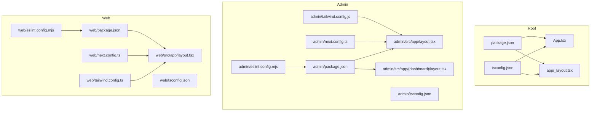
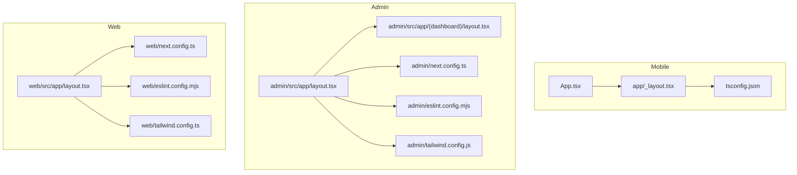
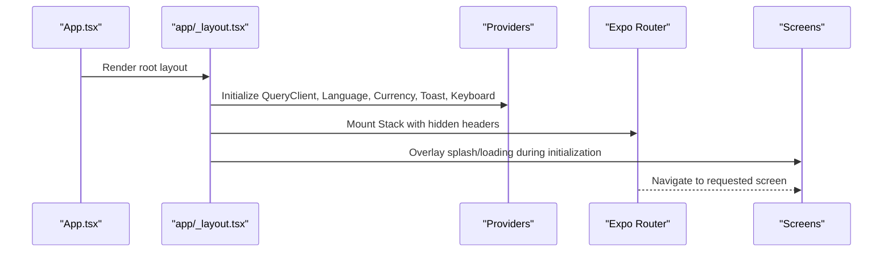
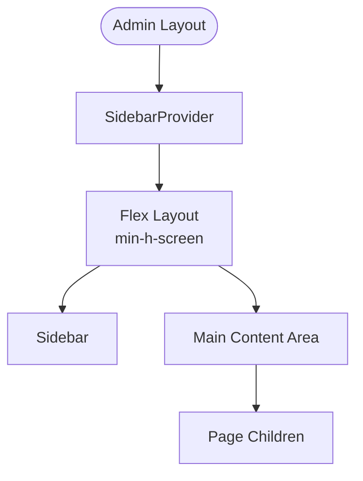
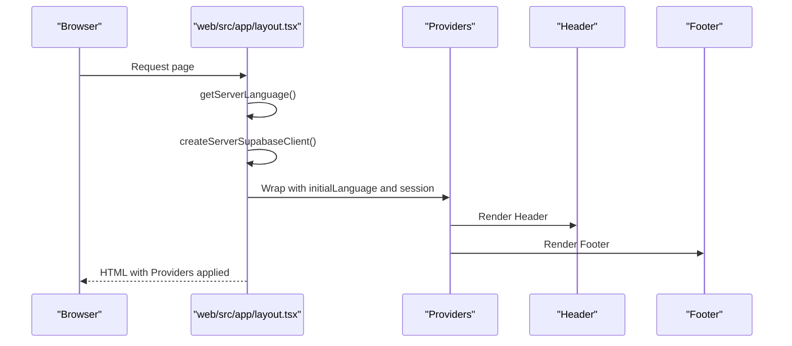
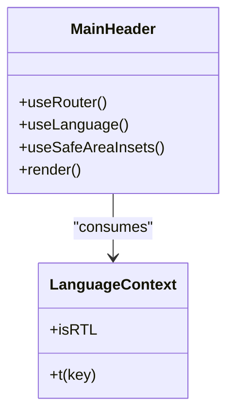
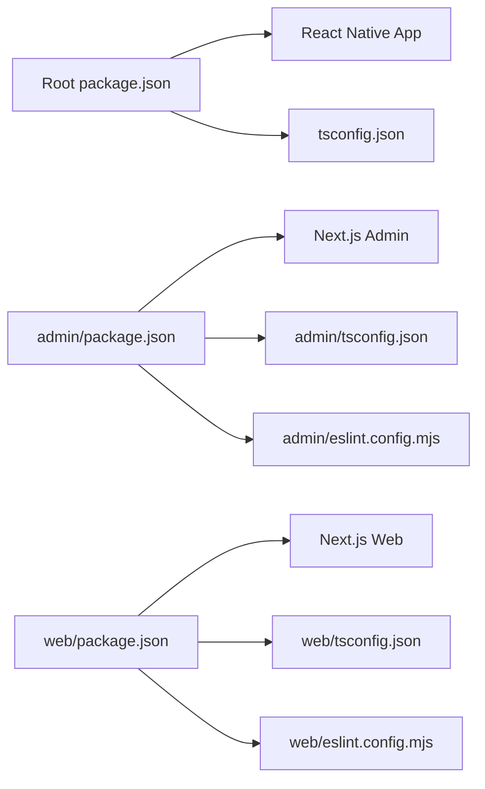

# Contributing Guidelines

<cite>
**Referenced Files in This Document**
- [package.json](file://package.json)
- [tsconfig.json](file://tsconfig.json)
- [App.tsx](file://App.tsx)
- [app/_layout.tsx](file://app/_layout.tsx)
- [admin/package.json](file://admin/package.json)
- [admin/tsconfig.json](file://admin/tsconfig.json)
- [admin/eslint.config.mjs](file://admin/eslint.config.mjs)
- [admin/next.config.ts](file://admin/next.config.ts)
- [admin/src/app/layout.tsx](file://admin/src/app/layout.tsx)
- [admin/src/app/(dashboard)/layout.tsx](file://admin/src/app/(dashboard)/layout.tsx)
- [web/package.json](file://web/package.json)
- [web/tsconfig.json](file://web/tsconfig.json)
- [web/eslint.config.mjs](file://web/eslint.config.mjs)
- [web/next.config.ts](file://web/next.config.ts)
- [web/src/app/layout.tsx](file://web/src/app/layout.tsx)
- [components/ui/MainHeader.tsx](file://components/ui/MainHeader.tsx)
- [admin/tailwind.config.js](file://admin/tailwind.config.js)
- [web/tailwind.config.ts](file://web/tailwind.config.ts)
</cite>

## Table of Contents
1. [Introduction](#introduction)
2. [Project Structure](#project-structure)
3. [Core Components](#core-components)
4. [Architecture Overview](#architecture-overview)
5. [Detailed Component Analysis](#detailed-component-analysis)
6. [Dependency Analysis](#dependency-analysis)
7. [Performance Considerations](#performance-considerations)
8. [Troubleshooting Guide](#troubleshooting-guide)
9. [Conclusion](#conclusion)
10. [Appendices](#appendices)

## Introduction
This document defines how to contribute effectively to the Al-Amal Center project. It covers development workflow, branching and commit conventions, pull request processes, code standards, testing and quality gates, documentation expectations, environment setup, local testing, preview deployments, contribution types, recognition, and community practices. The project consists of:
- A cross-platform mobile app built with Expo and React Native
- A Next.js-based web storefront
- An administrative dashboard built with Next.js
- Shared components, services, and utilities

## Project Structure
The repository is organized into multiple packages and shared directories:
- Root package: mobile app and shared configuration
- admin/: Next.js admin dashboard
- web/: Next.js web storefront
- components/, services/, hooks/, contexts/, shared/, types/, constants/, store/: shared frontend modules
- lib/, locales/, assets/: shared libraries and assets

**Diagram sources**
- [package.json:1-65](file://package.json#L1-L65)
- [tsconfig.json:1-13](file://tsconfig.json#L1-L13)
- [App.tsx:1-21](file://App.tsx#L1-L21)
- [app/_layout.tsx:1-108](file://app/_layout.tsx#L1-L108)
- [admin/package.json:1-40](file://admin/package.json#L1-L40)
- [admin/tsconfig.json:1-45](file://admin/tsconfig.json#L1-L45)
- [admin/src/app/layout.tsx:1-30](file://admin/src/app/layout.tsx#L1-L30)
- [admin/src/app/(dashboard)/layout.tsx](file://admin/src/app/(dashboard)/layout.tsx#L1-L20)
- [admin/next.config.ts:1-25](file://admin/next.config.ts#L1-L25)
- [admin/eslint.config.mjs:1-19](file://admin/eslint.config.mjs#L1-L19)
- [admin/tailwind.config.js:1-25](file://admin/tailwind.config.js#L1-L25)
- [web/package.json:1-39](file://web/package.json#L1-L39)
- [web/tsconfig.json:1-44](file://web/tsconfig.json#L1-L44)
- [web/src/app/layout.tsx:1-61](file://web/src/app/layout.tsx#L1-L61)
- [web/next.config.ts:1-12](file://web/next.config.ts#L1-L12)
- [web/eslint.config.mjs:1-17](file://web/eslint.config.mjs#L1-L17)
- [web/tailwind.config.ts:1-32](file://web/tailwind.config.ts#L1-L32)

**Section sources**
- [package.json:1-65](file://package.json#L1-L65)
- [tsconfig.json:1-13](file://tsconfig.json#L1-L13)
- [admin/package.json:1-40](file://admin/package.json#L1-L40)
- [admin/tsconfig.json:1-45](file://admin/tsconfig.json#L1-L45)
- [web/package.json:1-39](file://web/package.json#L1-L39)
- [web/tsconfig.json:1-44](file://web/tsconfig.json#L1-L44)

## Core Components
- Mobile app entry and routing: The root app initializes providers, navigation, and global resources.
- Admin dashboard: Next.js pages with a sidebar layout and RTL support.
- Web storefront: Next.js app with SSR, i18n direction handling, and provider composition.
- Shared UI: Reusable components like MainHeader demonstrate consistent styling and internationalization patterns.

Key implementation patterns:
- Provider composition for state and services
- Strict TypeScript configuration across packages
- Tailwind-based theming with consistent color and typography tokens
- ESLint configuration aligned with Next.js TypeScript defaults

**Section sources**
- [app/_layout.tsx:1-108](file://app/_layout.tsx#L1-L108)
- [admin/src/app/layout.tsx:1-30](file://admin/src/app/layout.tsx#L1-L30)
- [admin/src/app/(dashboard)/layout.tsx](file://admin/src/app/(dashboard)/layout.tsx#L1-L20)
- [web/src/app/layout.tsx:1-61](file://web/src/app/layout.tsx#L1-L61)
- [components/ui/MainHeader.tsx:1-49](file://components/ui/MainHeader.tsx#L1-L49)
- [admin/tailwind.config.js:1-25](file://admin/tailwind.config.js#L1-L25)
- [web/tailwind.config.ts:1-32](file://web/tailwind.config.ts#L1-L32)

## Architecture Overview
The project follows a multi-target architecture:
- Mobile app: Expo Router for navigation, React Query for caching, Supabase for auth/storage
- Admin: Next.js pages with SSR, Tailwind, and charting utilities
- Web: Next.js app with SSR, i18n direction handling, and provider composition
- Shared modules: services, hooks, contexts, and types reused across targets

**Diagram sources**
- [App.tsx:1-21](file://App.tsx#L1-L21)
- [app/_layout.tsx:1-108](file://app/_layout.tsx#L1-L108)
- [tsconfig.json:1-13](file://tsconfig.json#L1-L13)
- [admin/src/app/layout.tsx:1-30](file://admin/src/app/layout.tsx#L1-L30)
- [admin/src/app/(dashboard)/layout.tsx](file://admin/src/app/(dashboard)/layout.tsx#L1-L20)
- [admin/next.config.ts:1-25](file://admin/next.config.ts#L1-L25)
- [admin/eslint.config.mjs:1-19](file://admin/eslint.config.mjs#L1-L19)
- [admin/tailwind.config.js:1-25](file://admin/tailwind.config.js#L1-L25)
- [web/src/app/layout.tsx:1-61](file://web/src/app/layout.tsx#L1-L61)
- [web/next.config.ts:1-12](file://web/next.config.ts#L1-L12)
- [web/eslint.config.mjs:1-17](file://web/eslint.config.mjs#L1-L17)
- [web/tailwind.config.ts:1-32](file://web/tailwind.config.ts#L1-L32)

## Detailed Component Analysis

### Mobile App Layout and Navigation
The mobile app sets up providers, navigation stack, and splash/loading states. It demonstrates:
- Provider hierarchy: QueryClient, Language/Currency, Toast, Keyboard
- Font loading and splash screen orchestration
- Stack navigation with hidden headers and named screens

**Diagram sources**
- [App.tsx:1-21](file://App.tsx#L1-L21)
- [app/_layout.tsx:34-107](file://app/_layout.tsx#L34-L107)

**Section sources**
- [app/_layout.tsx:1-108](file://app/_layout.tsx#L1-L108)

### Admin Dashboard Layout
The admin dashboard uses a sidebar layout with a provider wrapper. It demonstrates:
- SidebarProvider for state management
- RTL HTML direction and font configuration
- Page-level layouts for dashboards and forms

**Diagram sources**
- [admin/src/app/(dashboard)/layout.tsx](file://admin/src/app/(dashboard)/layout.tsx#L1-L20)

**Section sources**
- [admin/src/app/layout.tsx:1-30](file://admin/src/app/layout.tsx#L1-L30)
- [admin/src/app/(dashboard)/layout.tsx](file://admin/src/app/(dashboard)/layout.tsx#L1-L20)

### Web Storefront Layout and SSR
The web storefront composes providers, handles server language/session, and renders header/footer shells. It demonstrates:
- Dynamic rendering control
- SSR-based session retrieval
- Direction-aware HTML lang and dir attributes

**Diagram sources**
- [web/src/app/layout.tsx:27-60](file://web/src/app/layout.tsx#L27-L60)

**Section sources**
- [web/src/app/layout.tsx:1-61](file://web/src/app/layout.tsx#L1-L61)

### Shared UI Component Pattern
Shared UI components illustrate consistent patterns:
- Internationalization via context
- RTL-aware styling and layout
- Pressable actions routed via navigation

**Diagram sources**
- [components/ui/MainHeader.tsx:1-49](file://components/ui/MainHeader.tsx#L1-L49)

**Section sources**
- [components/ui/MainHeader.tsx:1-49](file://components/ui/MainHeader.tsx#L1-L49)

## Dependency Analysis
- Root package defines scripts for starting the mobile app on multiple platforms and lists core dependencies for Expo, React Native, and related libraries.
- Admin and Web packages define Next.js-based environments with strict TypeScript, ESLint, and Tailwind configurations.
- Shared configuration is extended from Expo base TS config, ensuring consistent compiler options across targets.

**Diagram sources**
- [package.json:1-65](file://package.json#L1-L65)
- [tsconfig.json:1-13](file://tsconfig.json#L1-L13)
- [admin/package.json:1-40](file://admin/package.json#L1-L40)
- [admin/tsconfig.json:1-45](file://admin/tsconfig.json#L1-L45)
- [admin/eslint.config.mjs:1-19](file://admin/eslint.config.mjs#L1-L19)
- [web/package.json:1-39](file://web/package.json#L1-L39)
- [web/tsconfig.json:1-44](file://web/tsconfig.json#L1-L44)
- [web/eslint.config.mjs:1-17](file://web/eslint.config.mjs#L1-L17)

**Section sources**
- [package.json:1-65](file://package.json#L1-L65)
- [admin/package.json:1-40](file://admin/package.json#L1-L40)
- [web/package.json:1-39](file://web/package.json#L1-L39)
- [tsconfig.json:1-13](file://tsconfig.json#L1-L13)
- [admin/tsconfig.json:1-45](file://admin/tsconfig.json#L1-L45)
- [web/tsconfig.json:1-44](file://web/tsconfig.json#L1-L44)

## Performance Considerations
- Prefer lightweight components and avoid unnecessary re-renders; leverage provider composition to minimize prop drilling.
- Use React Query for efficient caching and background updates.
- Optimize image loading and remote patterns in Next.js configurations.
- Keep Tailwind purging scoped to relevant paths to reduce bundle size.
- Use strict TypeScript checks to catch performance-impacting issues early.

## Troubleshooting Guide
- If fonts or splash screen do not appear correctly, verify font loading and splash lifecycle in the root layout.
- For RTL layout issues in admin, confirm HTML direction and font variables are set properly.
- For SSR hydration mismatches in the web app, check server language and session retrieval logic.
- For ESLint errors, align with the Next.js TypeScript configuration used by each package.

**Section sources**
- [app/_layout.tsx:22-50](file://app/_layout.tsx#L22-L50)
- [admin/src/app/layout.tsx:23-27](file://admin/src/app/layout.tsx#L23-L27)
- [web/src/app/layout.tsx:32-36](file://web/src/app/layout.tsx#L32-L36)
- [admin/eslint.config.mjs:1-19](file://admin/eslint.config.mjs#L1-L19)
- [web/eslint.config.mjs:1-17](file://web/eslint.config.mjs#L1-L17)

## Conclusion
These guidelines standardize contributions across the mobile, admin, and web frontends while preserving shared patterns and quality. Contributors should align with the established workflows, code standards, and quality gates to ensure a cohesive and maintainable codebase.

## Appendices

### Development Workflow
- Branching strategy
  - Use feature branches prefixed with feature/, fix/, chore/, docs/ as appropriate.
  - Target develop for ongoing work; main is protected for releases.
- Commit message conventions
  - Use present-tense, imperative style: feat(admin): add new sidebar item
  - Scope to module or package: admin, web, mobile, shared
  - Reference issue numbers when applicable: feat(web): update layout #123
- Pull request process
  - Open PR against develop with a clear description and linked issue.
  - Ensure CI passes and at least one maintainer reviews and approves.
  - Squash and merge after approvals; keep history clean.

### Code Standards
- TypeScript
  - Enable strict mode across all tsconfig files.
  - Use explicit types for props and return values; avoid any where possible.
  - Keep shared types in shared/ and typed accordingly.
- Component architecture
  - Favor small, single-responsibility components.
  - Use hooks for stateful logic; keep components pure where feasible.
  - Apply Tailwind utilities consistently; define tokens in Tailwind configs.
- Naming conventions
  - PascalCase for components and contexts
  - camelCase for hooks and functions
  - kebab-case for directories and files (where applicable)
  - Prefix admin-specific pages with admin/ and web-specific pages with web/

### Testing and Quality Gates
- Linting
  - Run ESLint for each package; resolve all errors before submitting PRs.
- Formatting
  - Use Prettier-compatible settings enforced by your editor.
- Type checking
  - Ensure tsc passes in all packages.
- Local testing
  - Mobile: npm start and select platform (iOS/Android/Web)
  - Admin: cd admin && npm run dev
  - Web: cd web && npm run dev
- Preview deployments
  - Use Vercel or Netlify for preview builds from feature branches.

### Documentation Standards
- Inline documentation
  - Document exported functions, components, and complex logic with concise comments.
- API documentation
  - Document REST endpoints and service methods with request/response shapes.
- Architectural Decision Records (ADRs)
  - Record decisions affecting architecture with rationale and alternatives.

### Environment Setup
- Prerequisites
  - Node.js LTS, npm, Expo CLI
- Steps
  - Install dependencies: npm install
  - For mobile: expo start and scan QR code
  - For admin: cd admin && npm install && npm run dev
  - For web: cd web && npm install && npm run dev
- Secrets
  - Configure environment variables per platform as needed.

### Contribution Types
- Bug fixes
  - Link the issue, reproduce locally, and include tests if applicable.
- Feature additions
  - Add new components/services under appropriate directories; update shared types if needed.
- Documentation improvements
  - Improve inline docs, READMEs, and ADRs.

### Recognition and Acknowledgment
- Contributors are acknowledged in release notes and contributor lists.
- Public recognition via GitHub mentions and community channels.

### Community Values and Collaboration
- Be respectful and inclusive; follow the project’s code of conduct.
- Use GitHub Discussions for questions and proposals.
- Keep feedback constructive and focused on improving the project.