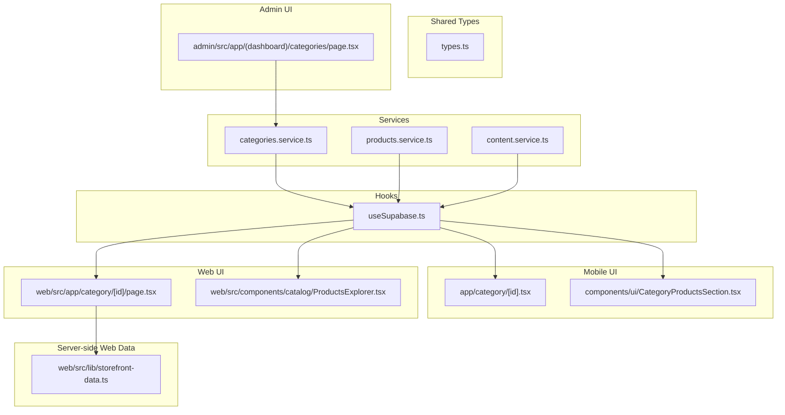
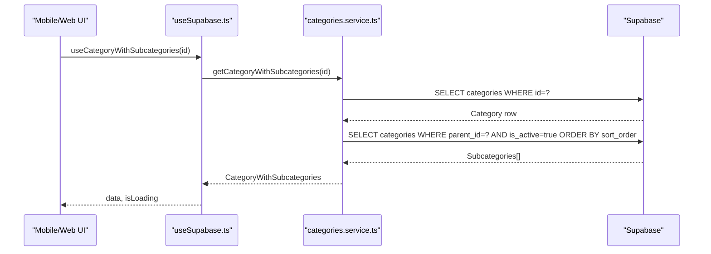
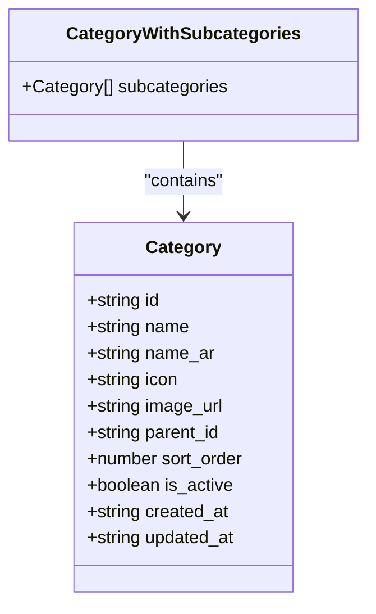
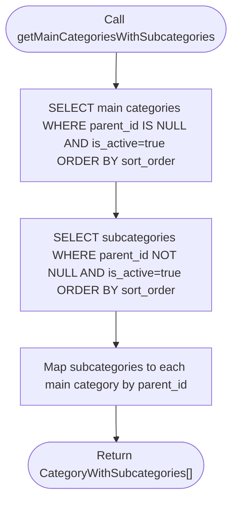
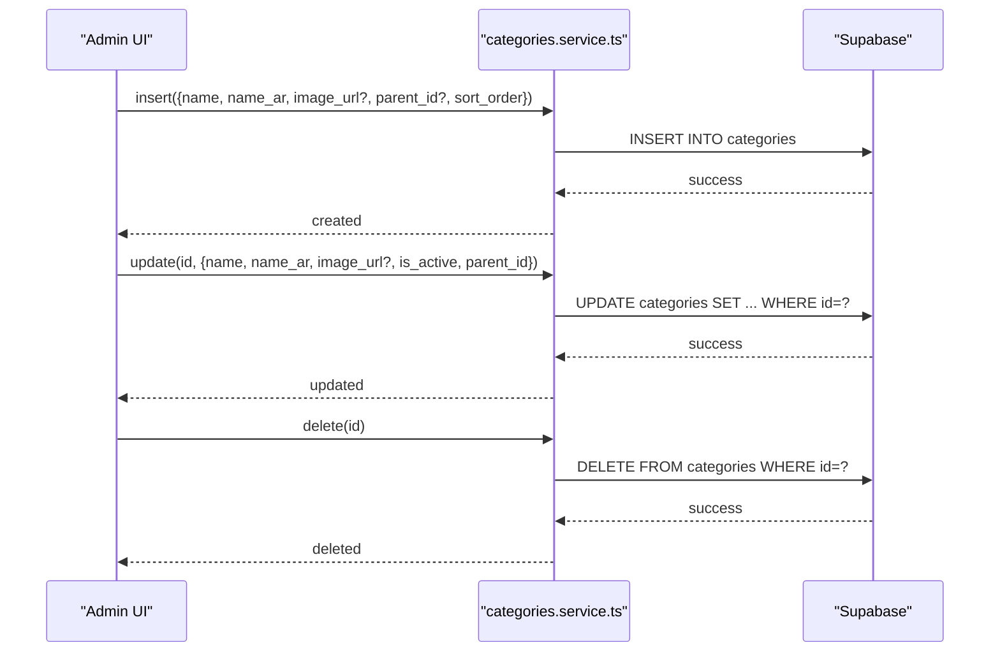
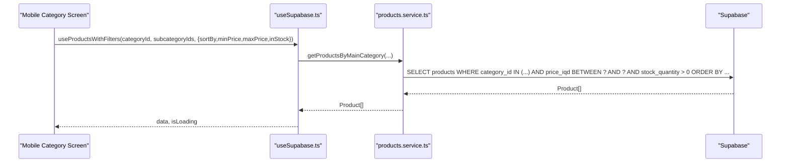
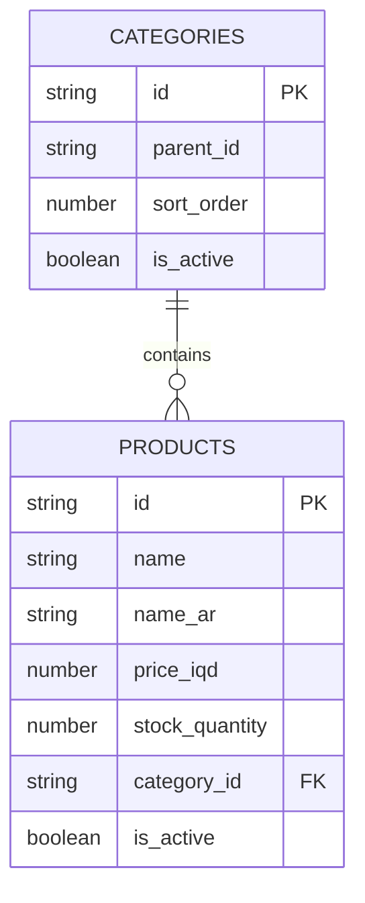
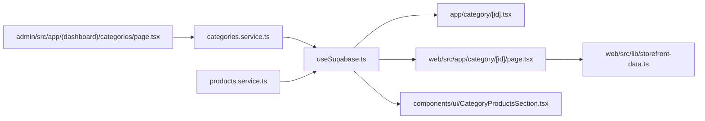

# Category Services

<cite>
**Referenced Files in This Document**
- [categories.service.ts](file://services/categories.service.ts)
- [types.ts](file://shared/types.ts)
- [useSupabase.ts](file://hooks/useSupabase.ts)
- [app-category-id.tsx](file://app/category/[id].tsx)
- [web-category-id-page.tsx](file://web/src/app/category/[id]/page.tsx)
- [CategoryProductsSection.tsx](file://components/ui/CategoryProductsSection.tsx)
- [ProductsExplorer.tsx](file://web/src/components/catalog/ProductsExplorer.tsx)
- [storefront-data.ts](file://web/src/lib/storefront-data.ts)
- [admin-categories-page.tsx](file://admin/src/app/(dashboard)/categories/page.tsx)
</cite>

## Table of Contents
1. [Introduction](#introduction)
2. [Project Structure](#project-structure)
3. [Core Components](#core-components)
4. [Architecture Overview](#architecture-overview)
5. [Detailed Component Analysis](#detailed-component-analysis)
6. [Dependency Analysis](#dependency-analysis)
7. [Performance Considerations](#performance-considerations)
8. [Troubleshooting Guide](#troubleshooting-guide)
9. [Conclusion](#conclusion)

## Introduction
This document describes the category management service layer powering hierarchical category organization, CRUD operations, filtering, navigation, and product listing integrations across mobile and web interfaces. It explains the category data model, parent-child relationships, sorting and display preferences, category-product inheritance, and operational workflows such as creation, reordering, and deletion. It also covers performance optimizations, caching strategies, and bulk operations.

## Project Structure
The category service layer spans three primary areas:
- Service layer: centralized category data access and transformations
- UI layer: mobile and web screens that consume category data and drive filters
- Admin layer: CRUD and reordering controls for categories

**Diagram sources**
- [categories.service.ts:1-137](file://services/categories.service.ts#L1-L137)
- [types.ts:33-48](file://shared/types.ts#L33-L48)
- [useSupabase.ts:23-31](file://hooks/useSupabase.ts#L23-L31)
- [app-category-id.tsx:1-434](file://app/category/[id].tsx#L1-L434)
- [web-category-id-page.tsx:1-98](file://web/src/app/category/[id]/page.tsx#L1-L98)
- [CategoryProductsSection.tsx:1-67](file://components/ui/CategoryProductsSection.tsx#L1-L67)
- [ProductsExplorer.tsx:1-427](file://web/src/components/catalog/ProductsExplorer.tsx#L1-L427)
- [storefront-data.ts:171-192](file://web/src/lib/storefront-data.ts#L171-L192)
- [admin-categories-page.tsx](file://admin/src/app/(dashboard)/categories/page.tsx#L140-L286)

**Section sources**
- [categories.service.ts:1-137](file://services/categories.service.ts#L1-L137)
- [types.ts:33-48](file://shared/types.ts#L33-L48)
- [useSupabase.ts:23-31](file://hooks/useSupabase.ts#L23-L31)

## Core Components
- Category data model: hierarchical categories with parent-child relationships, display metadata, and ordering.
- Category service: retrieval APIs for active/main/sub categories and category-with-subcategories.
- Hooks: React Query wrappers for category queries and product filters.
- UI integrations: category screens on mobile and web, category product sections, and admin CRUD/reorder.
- Server-side web data: category and product retrieval for SSR pages.

**Section sources**
- [types.ts:33-48](file://shared/types.ts#L33-L48)
- [categories.service.ts:12-136](file://services/categories.service.ts#L12-L136)
- [useSupabase.ts:41-88](file://hooks/useSupabase.ts#L41-L88)
- [app-category-id.tsx:15-434](file://app/category/[id].tsx#L15-L434)
- [web-category-id-page.tsx:19-97](file://web/src/app/category/[id]/page.tsx#L19-L97)
- [CategoryProductsSection.tsx:18-66](file://components/ui/CategoryProductsSection.tsx#L18-L66)
- [admin-categories-page.tsx](file://admin/src/app/(dashboard)/categories/page.tsx#L140-L286)
- [storefront-data.ts:171-192](file://web/src/lib/storefront-data.ts#L171-L192)

## Architecture Overview
The category service layer follows a layered architecture:
- Data access layer: Supabase-backed category service functions
- Domain layer: typed category and product models
- Presentation layer: mobile and web screens and admin UI
- State layer: React Query hooks for caching and synchronization

**Diagram sources**
- [useSupabase.ts:82-88](file://hooks/useSupabase.ts#L82-L88)
- [categories.service.ts:114-136](file://services/categories.service.ts#L114-L136)

**Section sources**
- [useSupabase.ts:82-88](file://hooks/useSupabase.ts#L82-L88)
- [categories.service.ts:114-136](file://services/categories.service.ts#L114-L136)

## Detailed Component Analysis

### Category Data Model
- Categories are stored with hierarchical relationships via parent_id and ordered by sort_order.
- Display fields include name (en/ar), icon, image_url, and is_active flag.
- CategoryWithSubcategories extends Category with a subcategories array for rendering nested UI.

**Diagram sources**
- [types.ts:33-48](file://shared/types.ts#L33-L48)
- [types.ts:343-345](file://shared/types.ts#L343-L345)

**Section sources**
- [types.ts:33-48](file://shared/types.ts#L33-L48)
- [types.ts:343-345](file://shared/types.ts#L343-L345)

### Category Retrieval APIs
- getCategories: retrieves active categories ordered by sort_order
- getCategoryById: single category lookup
- getAllCategories: admin-only retrieval including inactive
- getMainCategories: top-level categories (parent_id IS NULL)
- getSubcategories: children of a given category
- getMainCategoriesWithSubcategories: merges main categories with their subcategories
- getCategoryWithSubcategories: fetches a category and its active subcategories

**Diagram sources**
- [categories.service.ts:83-109](file://services/categories.service.ts#L83-L109)

**Section sources**
- [categories.service.ts:12-136](file://services/categories.service.ts#L12-L136)

### Category CRUD Operations (Admin)
- Create: insert category with name (en/ar), optional image_url, optional parent_id, and appended sort_order.
- Update: patch category fields including is_active, parent_id, and timestamps.
- Delete: soft-delete pattern not shown; deletion handled via admin delete action.
- Reorder: swap adjacent items locally and normalize all sort_order values in parallel to maintain 0-based contiguous indices.

**Diagram sources**
- [admin-categories-page.tsx](file://admin/src/app/(dashboard)/categories/page.tsx#L140-L165)
- [admin-categories-page.tsx](file://admin/src/app/(dashboard)/categories/page.tsx#L226-L250)
- [admin-categories-page.tsx](file://admin/src/app/(dashboard)/categories/page.tsx#L167-L174)

**Section sources**
- [admin-categories-page.tsx](file://admin/src/app/(dashboard)/categories/page.tsx#L140-L165)
- [admin-categories-page.tsx](file://admin/src/app/(dashboard)/categories/page.tsx#L226-L250)
- [admin-categories-page.tsx](file://admin/src/app/(dashboard)/categories/page.tsx#L167-L174)
- [admin-categories-page.tsx](file://admin/src/app/(dashboard)/categories/page.tsx#L252-L286)

### Category Filtering and Navigation
- Mobile category screen supports:
  - Sorting options: newest, oldest, price_low, price_high, name_az, name_za
  - Price range filter and “in stock only”
  - Subcategory navigation and “view all” behavior
- Web category page and Products Explorer:
  - SSR retrieval of category and products
  - Category carousel and sidebar filters
  - Price range, in-stock toggle, and sorting controls

**Diagram sources**
- [app-category-id.tsx:36-45](file://app/category/[id].tsx#L36-L45)
- [useSupabase.ts:104-119](file://hooks/useSupabase.ts#L104-L119)
- [products.service.ts:333-376](file://services/products.service.ts#L333-L376)

**Section sources**
- [app-category-id.tsx:21-85](file://app/category/[id].tsx#L21-L85)
- [web-category-id-page.tsx:23-26](file://web/src/app/category/[id]/page.tsx#L23-L26)
- [ProductsExplorer.tsx:127-130](file://web/src/components/catalog/ProductsExplorer.tsx#L127-L130)
- [storefront-data.ts:187-192](file://web/src/lib/storefront-data.ts#L187-L192)

### Category-Product Relationships and Inheritance
- Products belong to a category via category_id.
- CategoryProductSection displays products from a specific category.
- ProductsExplorer integrates category selection and applies filters server-side for SSR.

**Diagram sources**
- [types.ts:13-32](file://shared/types.ts#L13-L32)
- [types.ts:33-48](file://shared/types.ts#L33-L48)

**Section sources**
- [types.ts:13-32](file://shared/types.ts#L13-L32)
- [types.ts:33-48](file://shared/types.ts#L33-L48)
- [CategoryProductsSection.tsx:26-31](file://components/ui/CategoryProductsSection.tsx#L26-L31)
- [storefront-data.ts:187-192](file://web/src/lib/storefront-data.ts#L187-L192)

### Sorting Algorithms and Display Ordering
- Categories: ORDER BY sort_order ASC for consistent hierarchy rendering.
- Products: sorting by newest, oldest, price_low, price_high, name_az, name_za.
- Web SSR: ProductsExplorer reads URL query parameters and applies filters and pagination.

**Section sources**
- [categories.service.ts:16-17](file://services/categories.service.ts#L16-L17)
- [categories.service.ts:58-59](file://services/categories.service.ts#L58-L59)
- [categories.service.ts:73-74](file://services/categories.service.ts#L73-L74)
- [products.service.ts:351-372](file://services/products.service.ts#L351-L372)
- [ProductsExplorer.tsx:335-356](file://web/src/components/catalog/ProductsExplorer.tsx#L335-L356)

### Validation Rules, Slug Generation, and SEO
- Validation observed in admin:
  - Image uploads restricted to PNG format.
  - Parent category selection excludes self as parent.
- No explicit slug field present in the category schema; category slugs are not generated in the provided code.
- SEO considerations:
  - Category pages use SSR to provide structured content.
  - Category icons and images are used for visual SEO.

**Section sources**
- [admin-categories-page.tsx](file://admin/src/app/(dashboard)/categories/page.tsx#L110-L113)
- [admin-categories-page.tsx](file://admin/src/app/(dashboard)/categories/page.tsx#L196-L199)
- [admin-categories-page.tsx](file://admin/src/app/(dashboard)/categories/page.tsx#L634-L638)
- [web-category-id-page.tsx:36-42](file://web/src/app/category/[id]/page.tsx#L36-L42)

### Examples of Category Service Usage Patterns
- Mobile category screen:
  - Uses useCategoryWithSubcategories to load category and subcategories.
  - Uses useProductsWithFilters to apply sorting and price filters.
- Category product section:
  - Uses useProductsByCategory to show recent products per category.
- Web category page:
  - SSR loads category and products concurrently.

**Section sources**
- [app-category-id.tsx:30-45](file://app/category/[id].tsx#L30-L45)
- [CategoryProductsSection.tsx:26-31](file://components/ui/CategoryProductsSection.tsx#L26-L31)
- [web-category-id-page.tsx:23-26](file://web/src/app/category/[id]/page.tsx#L23-L26)

## Dependency Analysis
- Service-to-hooks coupling: useSupabase.ts re-exports category queries and exposes typed results.
- UI-to-service coupling: screens depend on hooks for data fetching and caching.
- Admin-to-service coupling: admin CRUD actions call Supabase directly and rely on category service for display.

**Diagram sources**
- [useSupabase.ts:23-31](file://hooks/useSupabase.ts#L23-L31)
- [app-category-id.tsx:30-31](file://app/category/[id].tsx#L30-L31)
- [web-category-id-page.tsx:8-11](file://web/src/app/category/[id]/page.tsx#L8-L11)
- [CategoryProductsSection.tsx:26-26](file://components/ui/CategoryProductsSection.tsx#L26-L26)
- [admin-categories-page.tsx](file://admin/src/app/(dashboard)/categories/page.tsx#L140-L165)

**Section sources**
- [useSupabase.ts:23-31](file://hooks/useSupabase.ts#L23-L31)
- [app-category-id.tsx:30-31](file://app/category/[id].tsx#L30-L31)
- [web-category-id-page.tsx:8-11](file://web/src/app/category/[id]/page.tsx#L8-L11)
- [CategoryProductsSection.tsx:26-26](file://components/ui/CategoryProductsSection.tsx#L26-L26)
- [admin-categories-page.tsx](file://admin/src/app/(dashboard)/categories/page.tsx#L140-L165)

## Performance Considerations
- Caching and normalization:
  - React Query keys enable automatic caching and invalidation for category queries.
  - Reordering normalizes sort_order across all items to avoid gaps and duplicates.
- Efficient queries:
  - Categories are fetched with is_active and sort_order filters to minimize payload.
  - Subcategories are filtered by parent_id and is_active to reduce rendering overhead.
- Pagination and SSR:
  - Web SSR uses range-based pagination to limit result sets.
  - ProductsExplorer supports pagination and URL-driven state updates.

**Section sources**
- [useSupabase.ts:41-88](file://hooks/useSupabase.ts#L41-L88)
- [admin-categories-page.tsx](file://admin/src/app/(dashboard)/categories/page.tsx#L267-L286)
- [storefront-data.ts:154-161](file://web/src/lib/storefront-data.ts#L154-L161)

## Troubleshooting Guide
- Category not appearing:
  - Verify is_active is true and sort_order is set.
  - Confirm parent_id is correct for subcategories.
- Reordering anomalies:
  - After moving items, ensure all sort_order values are normalized.
- Image upload errors:
  - Enforce PNG format and check storage permissions.
- Filters not applying:
  - On mobile, confirm useProductsWithFilters receives non-empty subcategoryIds when needed.
  - On web, ensure URL query parameters are present and parsed correctly.

**Section sources**
- [admin-categories-page.tsx](file://admin/src/app/(dashboard)/categories/page.tsx#L110-L113)
- [admin-categories-page.tsx](file://admin/src/app/(dashboard)/categories/page.tsx#L267-L286)
- [app-category-id.tsx:36-45](file://app/category/[id].tsx#L36-L45)
- [ProductsExplorer.tsx:80-107](file://web/src/components/catalog/ProductsExplorer.tsx#L80-L107)

## Conclusion
The category management service layer provides a robust, hierarchical category model with efficient retrieval, filtering, and navigation across mobile and web platforms. Admin controls enable safe creation, updates, and reordering, while hooks and SSR ensure responsive and SEO-friendly experiences. Performance is optimized through caching, normalized ordering, and paginated queries.