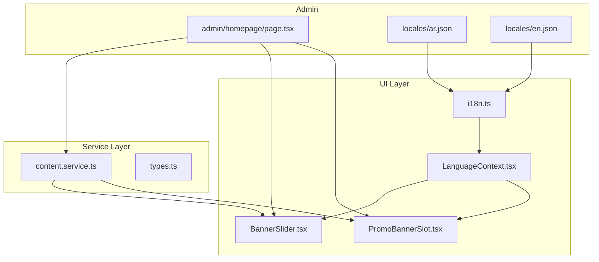
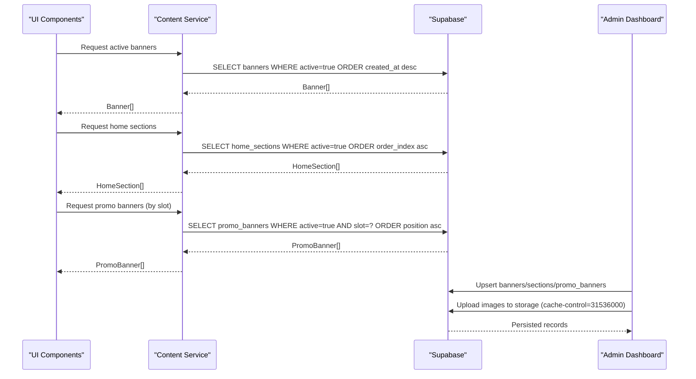
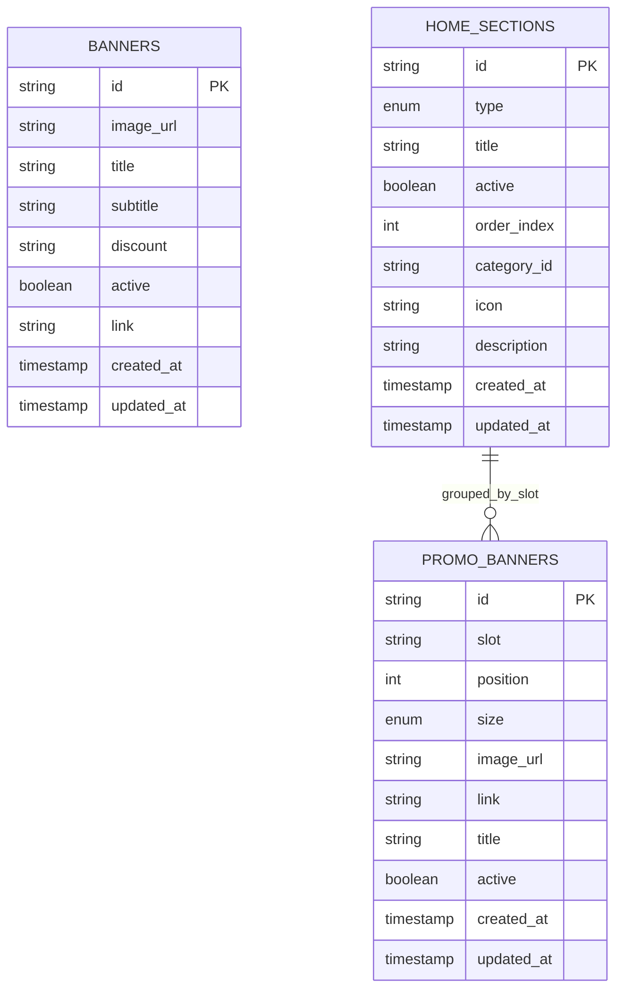
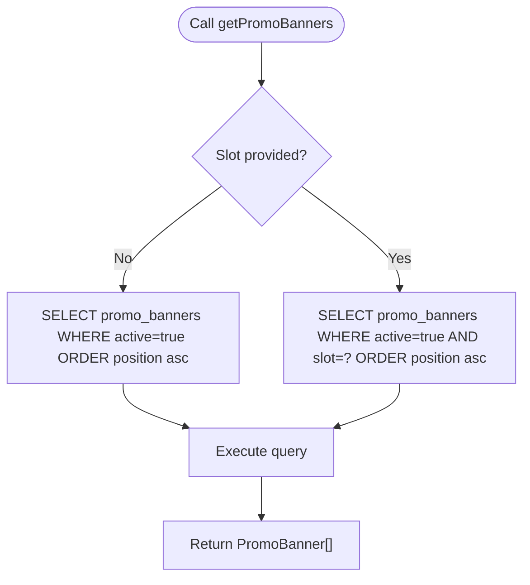
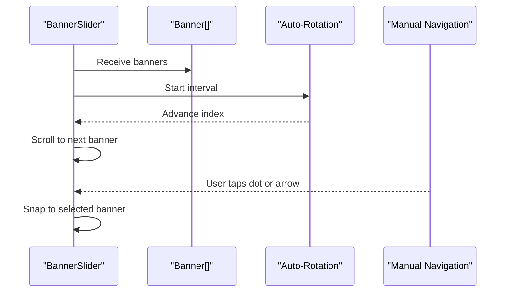
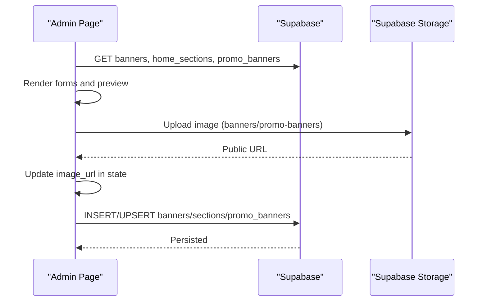
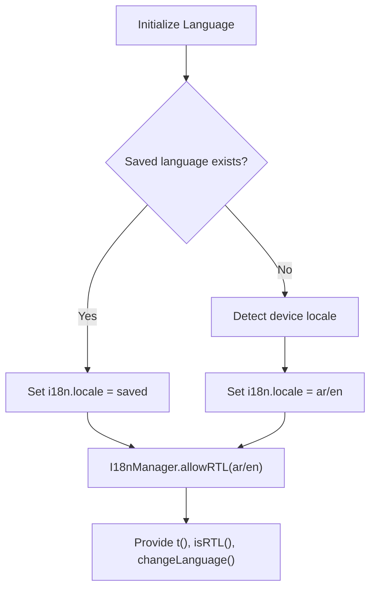
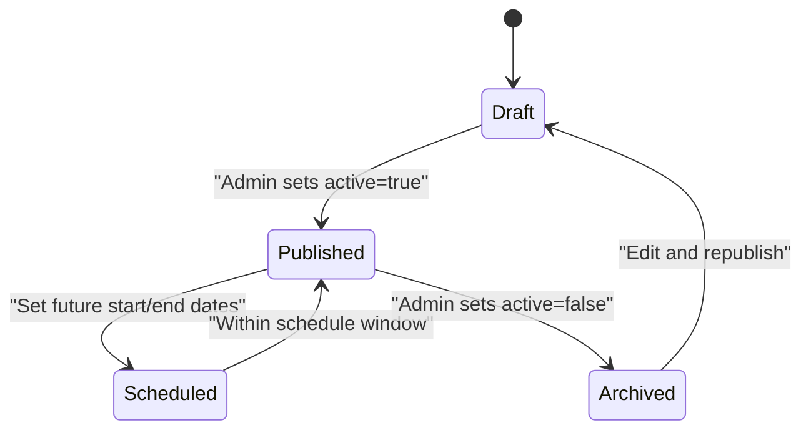
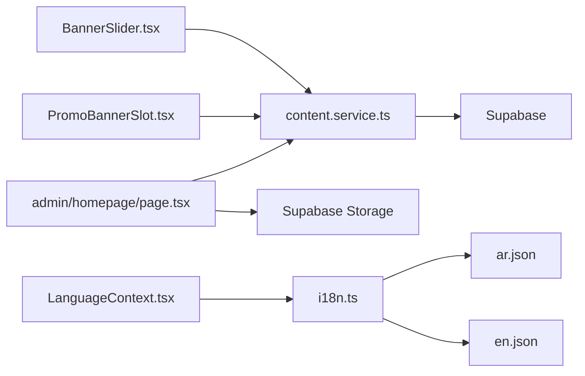

# Content Services

<cite>
**Referenced Files in This Document**
- [content.service.ts](file://services/content.service.ts)
- [types.ts](file://shared/types.ts)
- [BannerSlider.tsx](file://components/ui/BannerSlider.tsx)
- [PromoBannerSlot.tsx](file://components/ui/PromoBannerSlot.tsx)
- [homepage/page.tsx](file://admin/src/app/(dashboard)/homepage/page.tsx)
- [ar.json](file://locales/ar.json)
- [en.json](file://locales/en.json)
- [LanguageContext.tsx](file://contexts/LanguageContext.tsx)
- [i18n.ts](file://lib/i18n.ts)
- [ORDERS_REALTIME_SETUP.md](file://.docs/ORDERS_REALTIME_SETUP.md)
</cite>

## Table of Contents
1. [Introduction](#introduction)
2. [Project Structure](#project-structure)
3. [Core Components](#core-components)
4. [Architecture Overview](#architecture-overview)
5. [Detailed Component Analysis](#detailed-component-analysis)
6. [Dependency Analysis](#dependency-analysis)
7. [Performance Considerations](#performance-considerations)
8. [Troubleshooting Guide](#troubleshooting-guide)
9. [Conclusion](#conclusion)
10. [Appendices](#appendices)

## Introduction
This document describes the content management service layer for the homepage, focusing on the homepage content model, CRUD operations, scheduling, delivery optimization, localization, validation, SEO metadata, accessibility, real-time updates, and analytics/A/B testing foundations. It synthesizes the content service APIs, UI components, admin dashboard, and localization infrastructure to provide a complete picture of how homepage content is modeled, managed, rendered, and optimized.

## Project Structure
The content management system spans three primary areas:
- Service layer: content retrieval and grouping for banners, home sections, and promotional banners
- UI components: rendering of banners and promotional slots with responsive layouts and RTL support
- Admin dashboard: content authoring, ordering, and publishing workflows with image uploads and preview

**Diagram sources**
- [content.service.ts:1-147](file://services/content.service.ts#L1-L147)
- [types.ts:1-353](file://shared/types.ts#L1-L353)
- [BannerSlider.tsx:1-153](file://components/ui/BannerSlider.tsx#L1-L153)
- [PromoBannerSlot.tsx:1-201](file://components/ui/PromoBannerSlot.tsx#L1-L201)
- [LanguageContext.tsx:1-84](file://contexts/LanguageContext.tsx#L1-L84)
- [i18n.ts:1-81](file://lib/i18n.ts#L1-L81)
- [homepage/page.tsx:1-1122](file://admin/src/app/(dashboard)/homepage/page.tsx#L1-L1122)
- [ar.json:1-413](file://locales/ar.json#L1-L413)
- [en.json:1-413](file://locales/en.json#L1-L413)

**Section sources**
- [content.service.ts:1-147](file://services/content.service.ts#L1-L147)
- [types.ts:1-353](file://shared/types.ts#L1-L353)
- [BannerSlider.tsx:1-153](file://components/ui/BannerSlider.tsx#L1-L153)
- [PromoBannerSlot.tsx:1-201](file://components/ui/PromoBannerSlot.tsx#L1-L201)
- [homepage/page.tsx:1-1122](file://admin/src/app/(dashboard)/homepage/page.tsx#L1-L1122)
- [ar.json:1-413](file://locales/ar.json#L1-L413)
- [en.json:1-413](file://locales/en.json#L1-L413)
- [LanguageContext.tsx:1-84](file://contexts/LanguageContext.tsx#L1-L84)
- [i18n.ts:1-81](file://lib/i18n.ts#L1-L81)

## Core Components
- Content service APIs:
  - Active banners retrieval
  - Home sections retrieval with ordering
  - Promotional banners by slot or grouped by slot
- UI components:
  - Banner slider with auto-rotation and manual controls
  - Promotional banner slot supporting full/half/square layouts with RTL awareness
- Admin dashboard:
  - Unified management of banners, home sections, and promotional banners
  - Image upload to Supabase storage with caching headers
  - Preview of homepage layout with live navigation
- Localization:
  - Device-based language detection and persistence
  - RTL detection and layout adaptation
  - Full bilingual resources for UI and content keys

**Section sources**
- [content.service.ts:38-145](file://services/content.service.ts#L38-L145)
- [BannerSlider.tsx:23-152](file://components/ui/BannerSlider.tsx#L23-L152)
- [PromoBannerSlot.tsx:18-200](file://components/ui/PromoBannerSlot.tsx#L18-L200)
- [homepage/page.tsx:107-218](file://admin/src/app/(dashboard)/homepage/page.tsx#L107-L218)
- [i18n.ts:24-77](file://lib/i18n.ts#L24-L77)
- [LanguageContext.tsx:26-61](file://contexts/LanguageContext.tsx#L26-L61)

## Architecture Overview
The content service layer orchestrates data retrieval from Supabase and exposes typed APIs consumed by UI components. The admin dashboard coordinates CRUD operations and persists content to Supabase tables. Localization is centralized via i18n utilities and context, enabling seamless RTL and language switching.

**Diagram sources**
- [content.service.ts:41-145](file://services/content.service.ts#L41-L145)
- [homepage/page.tsx:157-218](file://admin/src/app/(dashboard)/homepage/page.tsx#L157-L218)

## Detailed Component Analysis

### Content Data Model
The content model centers on three Supabase tables:
- banners: homepage hero banners with image, optional title/subtitle/discount/link, active flag, and timestamps
- home_sections: ordered homepage sections (categories, special_offers, best_sellers, trending, new_arrivals, category_products, promo_banner, custom) with active flag, order_index, optional category association, and icon/description
- promo_banners: targeted promotional banners grouped by slot, positioned within a slot, sized as full/half/square, linked to images and optional titles, with active flag

**Diagram sources**
- [content.service.ts:5-36](file://services/content.service.ts#L5-L36)
- [homepage/page.tsx:13-53](file://admin/src/app/(dashboard)/homepage/page.tsx#L13-L53)

**Section sources**
- [content.service.ts:5-36](file://services/content.service.ts#L5-L36)
- [homepage/page.tsx:13-53](file://admin/src/app/(dashboard)/homepage/page.tsx#L13-L53)

### Content Retrieval APIs
- getActiveBanners: returns active banners ordered by creation time
- getHomeSections: returns active sections ordered by order_index
- getPromoBanners(slot?): returns active promo banners optionally filtered by slot and ordered by position
- getAllPromoBanners: returns active promo banners grouped by slot and ordered by slot and position

**Diagram sources**
- [content.service.ts:88-112](file://services/content.service.ts#L88-L112)

**Section sources**
- [content.service.ts:41-145](file://services/content.service.ts#L41-L145)

### UI Rendering Components
- BannerSlider: renders a horizontally scrollable carousel of banners with auto-rotation, pagination dots, and click-to-navigate behavior. Supports skeleton loading and error states.
- PromoBannerSlot: renders promotional banners respecting size constraints (full/half/square), supports two banners side-by-side, and adapts layout for RTL.

**Diagram sources**
- [BannerSlider.tsx:31-46](file://components/ui/BannerSlider.tsx#L31-L46)
- [BannerSlider.tsx:91-96](file://components/ui/BannerSlider.tsx#L91-L96)

**Section sources**
- [BannerSlider.tsx:23-152](file://components/ui/BannerSlider.tsx#L23-L152)
- [PromoBannerSlot.tsx:18-200](file://components/ui/PromoBannerSlot.tsx#L18-L200)

### Admin Content Management
The admin homepage page provides:
- Fetching banners, sections, and promo banners concurrently
- Editing fields for banners, sections, and promo banners
- Reordering sections by moving up/down
- Adding/removing banners and promo banners
- Uploading images to Supabase storage buckets with long-lived cache headers
- Previewing the homepage layout with live navigation across slides and slots

**Diagram sources**
- [homepage/page.tsx:126-155](file://admin/src/app/(dashboard)/homepage/page.tsx#L126-L155)
- [homepage/page.tsx:157-218](file://admin/src/app/(dashboard)/homepage/page.tsx#L157-L218)
- [homepage/page.tsx:317-336](file://admin/src/app/(dashboard)/homepage/page.tsx#L317-L336)

**Section sources**
- [homepage/page.tsx:107-218](file://admin/src/app/(dashboard)/homepage/page.tsx#L107-L218)
- [homepage/page.tsx:317-336](file://admin/src/app/(dashboard)/homepage/page.tsx#L317-L336)

### Localization and RTL
Localization is handled centrally:
- Language initialization from AsyncStorage or device locale
- RTL detection for layout direction
- Translation function for UI keys
- Context provider exposing language state and helpers

**Diagram sources**
- [i18n.ts:24-77](file://lib/i18n.ts#L24-L77)
- [LanguageContext.tsx:26-61](file://contexts/LanguageContext.tsx#L26-L61)

**Section sources**
- [i18n.ts:24-77](file://lib/i18n.ts#L24-L77)
- [LanguageContext.tsx:26-61](file://contexts/LanguageContext.tsx#L26-L61)
- [ar.json:1-413](file://locales/ar.json#L1-L413)
- [en.json:1-413](file://locales/en.json#L1-L413)

### Scheduling and Publishing Workflows
- Active flags control visibility in production UI
- Ordering fields (order_index, position) define presentation sequence
- Admin panel toggles active states and reorders content
- Promotional banners are grouped by slot and positioned within a slot

[No sources needed since this diagram shows conceptual workflow, not actual code structure]

### Rich Text, Images, and Multilingual Handling
- Rich text: Not present in the current content model; banners and promo banners store simple text fields and links
- Images: Stored in Supabase storage with cache-control headers; URLs returned by service APIs
- Multilingual: Admin dashboard stores localized keys for banners/sections; UI consumes translations via i18n

[No sources needed since this section provides general guidance]

### Validation Rules and SEO Metadata
- Validation: Admin forms manage required fields and state transitions; service queries enforce active/published constraints
- SEO metadata: Not modeled in the current schema; consider adding title, description, and keywords fields to banners/home_sections/promo_banners if needed

[No sources needed since this section provides general guidance]

### Accessibility Compliance
- Touch targets: BannerSlider and PromoBannerSlot use appropriate hit areas and focus-friendly interactions
- Contrast and readability: Components apply shadows and rounded corners; ensure sufficient contrast in themes
- Internationalization: RTL support and localized strings improve accessibility for Arabic speakers

[No sources needed since this section provides general guidance]

### Real-Time Content Updates
- Orders Realtime setup demonstrates subscription-based updates; similar patterns can be applied to content tables if needed
- For immediate updates, consider subscribing to Supabase Realtime channels for banners/home_sections/promo_banners

**Section sources**
- [.docs/ORDERS_REALTIME_SETUP.md:18-37](file://.docs/ORDERS_REALTIME_SETUP.md#L18-L37)

### Analytics and A/B Testing
- Analytics: No dedicated analytics tables or events in the current schema; integrate analytics hooks in UI components to track impressions/clicks
- A/B Testing: No variant fields in the schema; introduce experiment variants and assignment logic if marketing optimization is required

[No sources needed since this section provides general guidance]

## Dependency Analysis
The content service depends on Supabase for data and storage, while UI components depend on the service APIs. The admin dashboard depends on both the service APIs and Supabase storage for uploads. Localization is decoupled via i18n utilities and context.

**Diagram sources**
- [content.service.ts:2-2](file://services/content.service.ts#L2-L2)
- [BannerSlider.tsx:1-1](file://components/ui/BannerSlider.tsx#L1-L1)
- [PromoBannerSlot.tsx:1-1](file://components/ui/PromoBannerSlot.tsx#L1-L1)
- [homepage/page.tsx:9-9](file://admin/src/app/(dashboard)/homepage/page.tsx#L9-L9)
- [i18n.ts:6-7](file://lib/i18n.ts#L6-L7)

**Section sources**
- [content.service.ts:2-2](file://services/content.service.ts#L2-L2)
- [homepage/page.tsx:9-9](file://admin/src/app/(dashboard)/homepage/page.tsx#L9-L9)
- [i18n.ts:6-7](file://lib/i18n.ts#L6-L7)

## Performance Considerations
- CDN integration: Serve images from Supabase storage with cache-control headers; consider a CDN in front of storage for global distribution
- Caching strategies: Use long cache TTLs for static assets; invalidate on content changes
- Performance monitoring: Track render times for carousels and image loads; monitor API latency and error rates

[No sources needed since this section provides general guidance]

## Troubleshooting Guide
- Content not appearing:
  - Verify active flags and ordering indices
  - Confirm storage URLs are accessible and cache headers are set
- UI not updating:
  - Ensure proper state updates after saves
  - Check for pending operations and loading states
- Localization issues:
  - Confirm language persistence and RTL settings
  - Validate translation keys and fallback behavior

**Section sources**
- [homepage/page.tsx:157-218](file://admin/src/app/(dashboard)/homepage/page.tsx#L157-L218)
- [i18n.ts:56-77](file://lib/i18n.ts#L56-L77)

## Conclusion
The content management service layer provides a robust foundation for homepage content: structured data models, typed service APIs, responsive UI components, and a powerful admin dashboard. Localization and RTL support are integrated, and the architecture supports future enhancements for scheduling, analytics, and real-time updates.

## Appendices
- Example integration patterns:
  - Fetch banners and sections in a screen’s effect, then pass to BannerSlider and PromoBannerSlot
  - Use admin page to reorder sections and assign promo slots, then persist via upsert
- Real-time updates:
  - Extend existing Realtime setup pattern to content tables for instant UI updates

[No sources needed since this section provides general guidance]