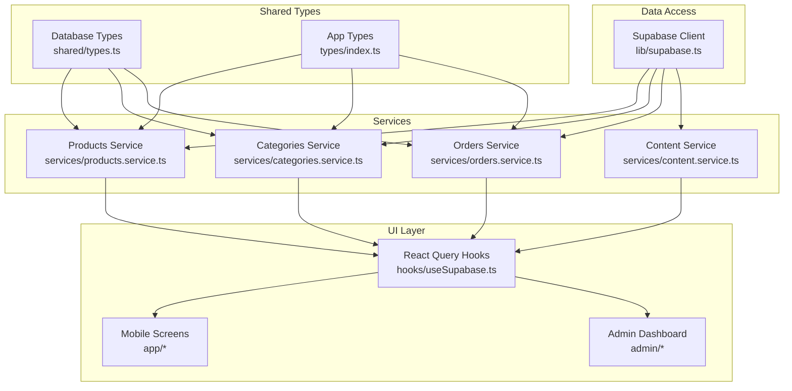
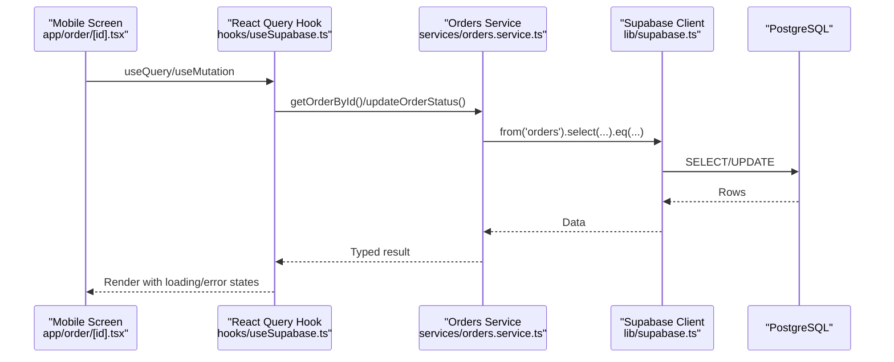
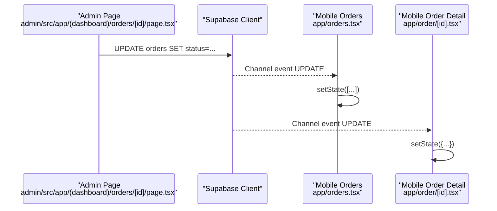
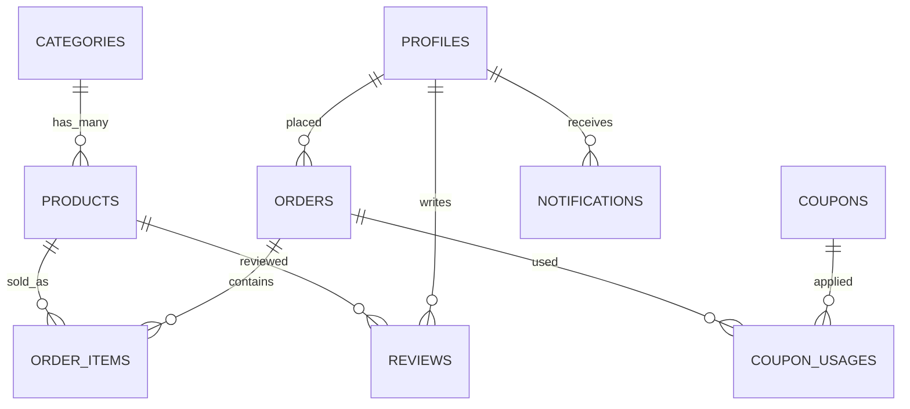
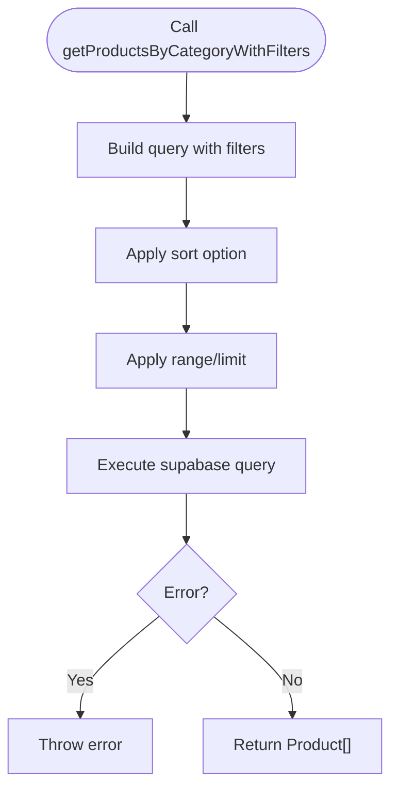
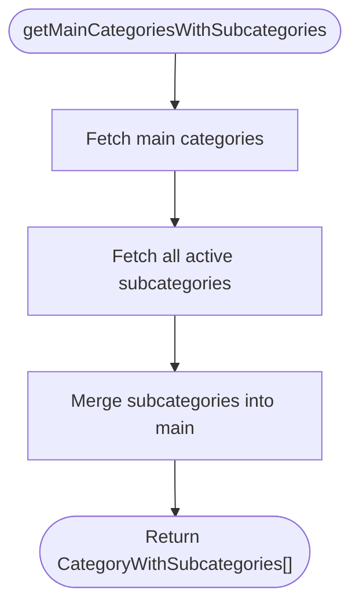
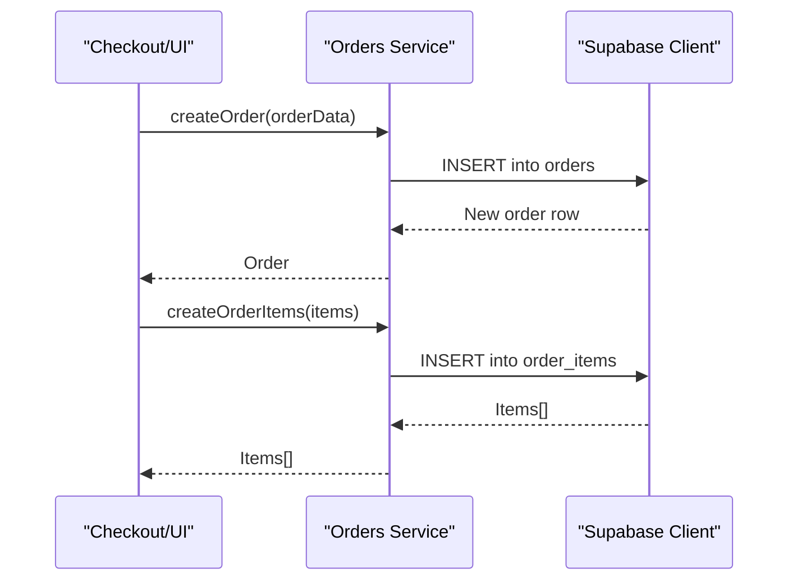
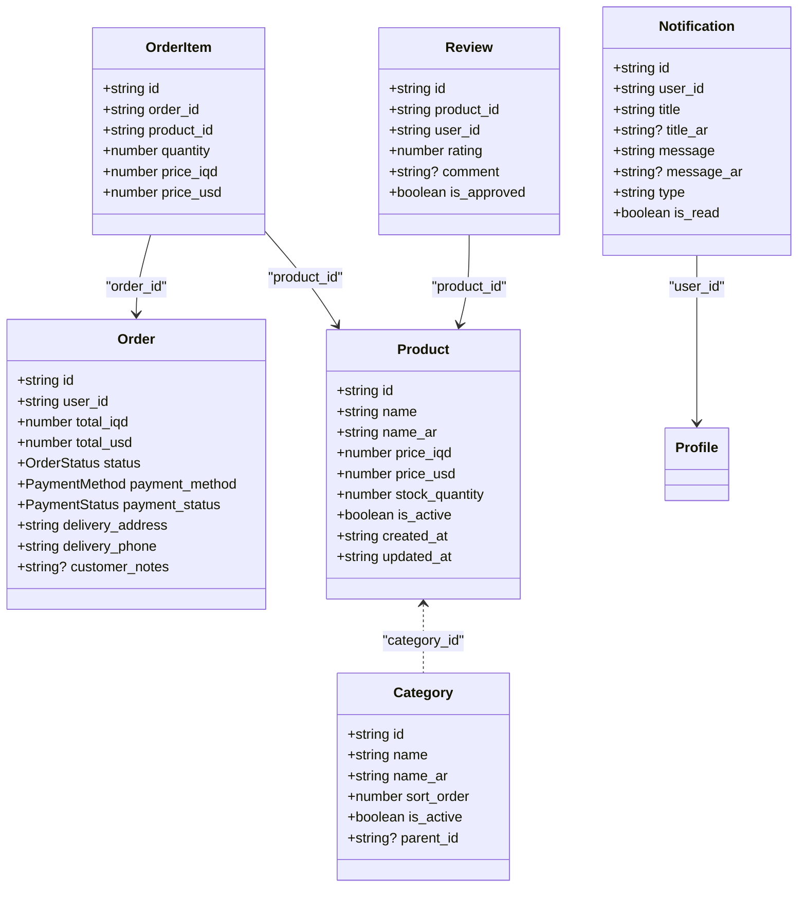
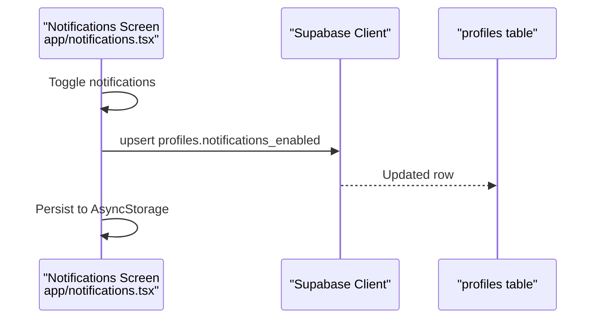
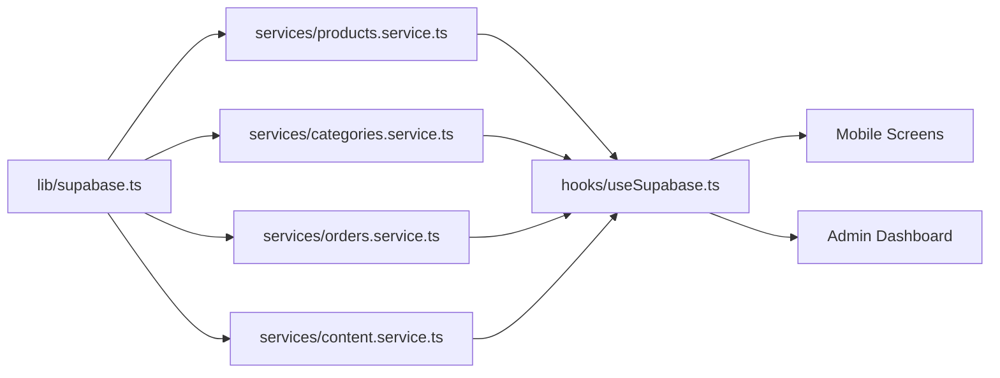

# Data Layer and Services

<cite>
**Referenced Files in This Document**
- [lib/supabase.ts](file://lib/supabase.ts)
- [hooks/useSupabase.ts](file://hooks/useSupabase.ts)
- [services/index.ts](file://services/index.ts)
- [shared/types.ts](file://shared/types.ts)
- [types/index.ts](file://types/index.ts)
- [services/products.service.ts](file://services/products.service.ts)
- [services/categories.service.ts](file://services/categories.service.ts)
- [services/orders.service.ts](file://services/orders.service.ts)
- [services/content.service.ts](file://services/content.service.ts)
- [.docs/ORDERS_REALTIME_SETUP.md](file://.docs/ORDERS_REALTIME_SETUP.md)
- [app/orders.tsx](file://app/orders.tsx)
- [app/order/[id].tsx](file://app/order/[id].tsx)
- [app/notifications.tsx](file://app/notifications.tsx)
- [admin/src/app/(dashboard)/orders/[id]/page.tsx](file://admin/src/app/(dashboard)/orders/[id]/page.tsx)
</cite>

## Table of Contents
1. [Introduction](#introduction)
2. [Project Structure](#project-structure)
3. [Core Components](#core-components)
4. [Architecture Overview](#architecture-overview)
5. [Detailed Component Analysis](#detailed-component-analysis)
6. [Dependency Analysis](#dependency-analysis)
7. [Performance Considerations](#performance-considerations)
8. [Troubleshooting Guide](#troubleshooting-guide)
9. [Conclusion](#conclusion)
10. [Appendices](#appendices)

## Introduction
This document explains the data layer and business services architecture for the application. It covers Supabase integration, database schema design, table relationships, and real-time synchronization. It documents the service layer pattern for products, categories, orders, and content, along with data models and TypeScript interfaces. It also details CRUD operations, validation, business rule enforcement, real-time features, caching and persistence strategies, error handling, transactions, and performance optimization. Guidance is included for extending services and maintaining data integrity.

## Project Structure
The data layer is organized around a Supabase client configured for both mobile and admin environments, a shared types module defining domain entities, and a service layer that encapsulates all database interactions. React Query hooks orchestrate data fetching and caching, while real-time subscriptions keep views synchronized.

**Diagram sources**
- [lib/supabase.ts:1-30](file://lib/supabase.ts#L1-L30)
- [hooks/useSupabase.ts:1-239](file://hooks/useSupabase.ts#L1-L239)
- [services/products.service.ts:1-449](file://services/products.service.ts#L1-L449)
- [services/categories.service.ts:1-137](file://services/categories.service.ts#L1-L137)
- [services/orders.service.ts:1-115](file://services/orders.service.ts#L1-L115)
- [services/content.service.ts:1-147](file://services/content.service.ts#L1-L147)
- [shared/types.ts:1-353](file://shared/types.ts#L1-L353)
- [types/index.ts:1-276](file://types/index.ts#L1-L276)

**Section sources**
- [lib/supabase.ts:1-30](file://lib/supabase.ts#L1-L30)
- [hooks/useSupabase.ts:1-239](file://hooks/useSupabase.ts#L1-L239)
- [services/index.ts:1-9](file://services/index.ts#L1-L9)

## Core Components
- Supabase client configured with AsyncStorage for session persistence and auto-refresh.
- React Query hooks that wrap service functions, enabling caching, invalidation, and refetching.
- Service modules implementing CRUD and business logic per domain: products, categories, orders, content.
- Shared TypeScript types for database-generated rows and insert/update shapes, plus derived app-level types.

Key responsibilities:
- Data access: Supabase client and service functions.
- Caching and caching policies: React Query query keys and stale times.
- Real-time: Postgres changes subscriptions for live updates.
- Validation and business rules: Enforced in services and UI flows.

**Section sources**
- [lib/supabase.ts:1-30](file://lib/supabase.ts#L1-L30)
- [hooks/useSupabase.ts:1-239](file://hooks/useSupabase.ts#L1-L239)
- [shared/types.ts:1-353](file://shared/types.ts#L1-L353)
- [types/index.ts:1-276](file://types/index.ts#L1-L276)

## Architecture Overview
The architecture follows a layered pattern:
- Presentation layer (mobile and admin) consumes React Query hooks.
- Business services encapsulate Supabase queries and mutations.
- Shared types unify domain models across platforms.
- Real-time channels subscribe to table changes for live updates.

**Diagram sources**
- [app/order/[id].tsx:1-200](file://app/order/[id].tsx#L1-L200)
- [hooks/useSupabase.ts:1-239](file://hooks/useSupabase.ts#L1-L239)
- [services/orders.service.ts:1-115](file://services/orders.service.ts#L1-L115)
- [lib/supabase.ts:1-30](file://lib/supabase.ts#L1-L30)

## Detailed Component Analysis

### Supabase Integration and Real-Time
- Client initialization sets up auth storage, auto-refresh, and environment variables.
- Real-time subscriptions are implemented in mobile screens for live order updates and notifications.
- Admin dashboard updates orders with optimistic UI and error rollback.

**Diagram sources**
- [admin/src/app/(dashboard)/orders/[id]/page.tsx:95-135](file://admin/src/app/(dashboard)/orders/[id]/page.tsx#L95-L135)
- [app/orders.tsx:64-85](file://app/orders.tsx#L64-L85)
- [app/order/[id].tsx:24-46](file://app/order/[id].tsx#L24-L46)

**Section sources**
- [lib/supabase.ts:19-30](file://lib/supabase.ts#L19-L30)
- [admin/src/app/(dashboard)/orders/[id]/page.tsx:95-135](file://admin/src/app/(dashboard)/orders/[id]/page.tsx#L95-L135)
- [app/orders.tsx:64-85](file://app/orders.tsx#L64-L85)
- [app/order/[id].tsx:24-46](file://app/order/[id].tsx#L24-L46)
- [.docs/ORDERS_REALTIME_SETUP.md:18-66](file://.docs/ORDERS_REALTIME_SETUP.md#L18-L66)

### Database Schema Design and Relationships
The shared types define the canonical schema. Key tables and relationships:
- products: belongs to categories via category_id; tracks pricing, stock, activity.
- categories: hierarchical via parent_id; supports main/subcategories.
- orders: linked to profiles via user_id; includes totals, status, payment, delivery metadata.
- order_items: many-to-one with orders and products; stores snapshot of product at purchase time.
- reviews: links users and products; supports approval.
- coupons and coupon_usages: discount management and usage tracking.
- profiles: user metadata and roles.
- addresses: user delivery addresses.
- notifications: user-targeted messages.

**Diagram sources**
- [shared/types.ts:10-211](file://shared/types.ts#L10-L211)

**Section sources**
- [shared/types.ts:10-211](file://shared/types.ts#L10-L211)

### Products Service
Responsibilities:
- Retrieve lists with pagination and filtering (by category, stock, price range, search).
- Compute derived collections: special offers, bestsellers, trending, new arrivals, similar products.
- Apply discount logic for offers and maintain fallbacks when data is unavailable.

**Diagram sources**
- [services/products.service.ts:314-379](file://services/products.service.ts#L314-L379)

**Section sources**
- [services/products.service.ts:18-448](file://services/products.service.ts#L18-L448)
- [shared/types.ts:217-220](file://shared/types.ts#L217-L220)

### Categories Service
Responsibilities:
- Fetch active categories, main categories, subcategories, and nested structures.
- Support Admin views with inactive categories.

**Diagram sources**
- [services/categories.service.ts:83-109](file://services/categories.service.ts#L83-L109)

**Section sources**
- [services/categories.service.ts:12-136](file://services/categories.service.ts#L12-L136)
- [shared/types.ts:221-223](file://shared/types.ts#L221-L223)

### Orders Service
Responsibilities:
- Create orders and order items.
- Retrieve orders by user or globally (Admin).
- Update order and payment statuses.

**Diagram sources**
- [services/orders.service.ts:12-34](file://services/orders.service.ts#L12-L34)

**Section sources**
- [services/orders.service.ts:12-115](file://services/orders.service.ts#L12-L115)
- [shared/types.ts:225-231](file://shared/types.ts#L225-L231)

### Content Service
Responsibilities:
- Manage banners, home sections, and promotional banners.
- Group banners by slot for efficient rendering.

**Section sources**
- [services/content.service.ts:41-147](file://services/content.service.ts#L41-L147)

### Data Models and TypeScript Interfaces
- Database-generated types in shared/types.ts mirror Supabase tables and enums.
- App-level types in types/index.ts define input/output shapes for forms and APIs.
- Extended types enrich domain entities with relations (e.g., OrderWithItems).

**Diagram sources**
- [shared/types.ts:10-211](file://shared/types.ts#L10-L211)

**Section sources**
- [shared/types.ts:10-353](file://shared/types.ts#L10-L353)
- [types/index.ts:1-276](file://types/index.ts#L1-L276)

### CRUD Operations, Validation, and Business Rules
- Products:
  - Filtering and sorting implemented in service functions.
  - Fallbacks when no trending/bestselling data exists.
  - Discount computation for offers with percentage/fixed logic.
- Categories:
  - Hierarchical retrieval and nesting for UI rendering.
- Orders:
  - Separate creation for orders and items.
  - Status and payment status updates with optimistic UI in Admin.
- Content:
  - Banner grouping and section ordering for home screen composition.

Validation and business rules:
- UI-level checks (e.g., cancellation eligibility) in order detail screens.
- Optimistic updates with rollback on Admin status updates.
- Fallbacks to random products when special offers are unavailable.

**Section sources**
- [services/products.service.ts:72-152](file://services/products.service.ts#L72-L152)
- [services/products.service.ts:158-177](file://services/products.service.ts#L158-L177)
- [services/products.service.ts:220-238](file://services/products.service.ts#L220-L238)
- [services/products.service.ts:244-259](file://services/products.service.ts#L244-L259)
- [services/categories.service.ts:83-136](file://services/categories.service.ts#L83-L136)
- [services/orders.service.ts:12-115](file://services/orders.service.ts#L12-L115)
- [admin/src/app/(dashboard)/orders/[id]/page.tsx:95-135](file://admin/src/app/(dashboard)/orders/[id]/page.tsx#L95-L135)
- [app/order/[id].tsx:84-111](file://app/order/[id].tsx#L84-L111)

### Real-Time Features
- Live order updates:
  - Mobile orders list subscribes to order changes and updates state accordingly.
  - Order detail screen subscribes to updates for a specific order.
- Notifications:
  - UI toggles notification preferences persisted locally and synced to profiles.
- Admin dashboard:
  - Optimistic status updates with immediate UI feedback and error rollback.

**Diagram sources**
- [app/notifications.tsx:58-83](file://app/notifications.tsx#L58-L83)

**Section sources**
- [app/orders.tsx:64-85](file://app/orders.tsx#L64-L85)
- [app/order/[id].tsx:24-46](file://app/order/[id].tsx#L24-L46)
- [app/notifications.tsx:49-83](file://app/notifications.tsx#L49-L83)
- [.docs/ORDERS_REALTIME_SETUP.md:18-66](file://.docs/ORDERS_REALTIME_SETUP.md#L18-L66)

## Dependency Analysis
- Services depend on the Supabase client and shared types.
- React Query hooks depend on services and expose typed results to UI.
- UI screens depend on hooks and local state for real-time updates.

**Diagram sources**
- [lib/supabase.ts:1-30](file://lib/supabase.ts#L1-L30)
- [hooks/useSupabase.ts:1-239](file://hooks/useSupabase.ts#L1-L239)
- [services/products.service.ts:1-449](file://services/products.service.ts#L1-L449)
- [services/categories.service.ts:1-137](file://services/categories.service.ts#L1-L137)
- [services/orders.service.ts:1-115](file://services/orders.service.ts#L1-L115)
- [services/content.service.ts:1-147](file://services/content.service.ts#L1-L147)

**Section sources**
- [services/index.ts:6-9](file://services/index.ts#L6-L9)
- [hooks/useSupabase.ts:11-36](file://hooks/useSupabase.ts#L11-L36)

## Performance Considerations
- Field selection optimization: product lists exclude heavy fields (descriptions) to reduce payload sizes.
- Pagination via range limits to avoid large result sets.
- Fallback strategies (random products) prevent empty states and improve UX.
- React Query caching reduces redundant network calls; query keys are scoped to resource and parameters.
- Real-time subscriptions minimize polling and enable instant UI updates.

Recommendations:
- Add indexes on frequently filtered columns (e.g., category_id, is_active, sales_count).
- Consider server-side aggregation for bestsellers/trending to offload client computation.
- Use background sync for non-critical updates to preserve battery life.

**Section sources**
- [services/products.service.ts:13](file://services/products.service.ts#L13)
- [services/products.service.ts:18-28](file://services/products.service.ts#L18-L28)
- [hooks/useSupabase.ts:41-238](file://hooks/useSupabase.ts#L41-L238)

## Troubleshooting Guide
Common issues and resolutions:
- Real-time not updating:
  - Verify Supabase Realtime is enabled on the orders table and publication includes orders.
  - Ensure RLS policy allows updates for authorized users (prefer admin-only policy).
  - Confirm environment variables for Supabase URL and anon key are set in both admin and mobile apps.
- Order status changes not reflected:
  - Check Admin UI for optimistic update success/error messages.
  - Inspect browser console for errors prefixed with “Error updating order status”.
- Network or auth problems:
  - Validate active session and user role in Admin dashboard.
  - Temporarily disable RLS for development testing (not recommended for production).

**Section sources**
- [.docs/ORDERS_REALTIME_SETUP.md:18-99](file://.docs/ORDERS_REALTIME_SETUP.md#L18-L99)
- [admin/src/app/(dashboard)/orders/[id]/page.tsx:95-135](file://admin/src/app/(dashboard)/orders/[id]/page.tsx#L95-L135)
- [app/orders.tsx:87-115](file://app/orders.tsx#L87-L115)

## Conclusion
The application employs a clean separation of concerns: a Supabase-backed service layer, shared types, React Query for caching, and real-time subscriptions for live updates. The architecture balances performance, scalability, and maintainability while enforcing business rules and providing robust error handling. Extending services involves adding new service functions, updating shared types, and wiring them into hooks and UI components.

## Appendices

### Extending Services and Maintaining Integrity
- Add new service functions under the appropriate domain module.
- Define or update shared types for new tables or extended relations.
- Integrate new hooks in hooks/useSupabase.ts and consume them in UI.
- Implement real-time subscriptions where live updates are required.
- Enforce validation and business rules in services and UI flows.
- Keep RLS policies aligned with new capabilities and roles.

[No sources needed since this section provides general guidance]