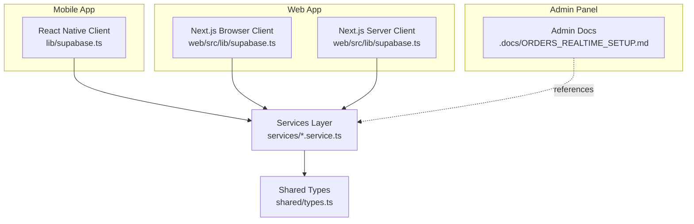
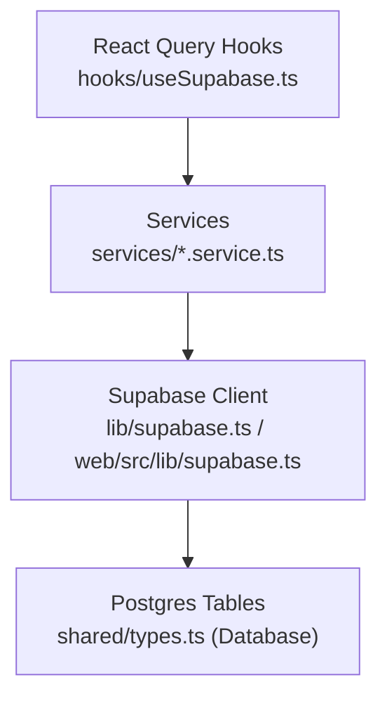
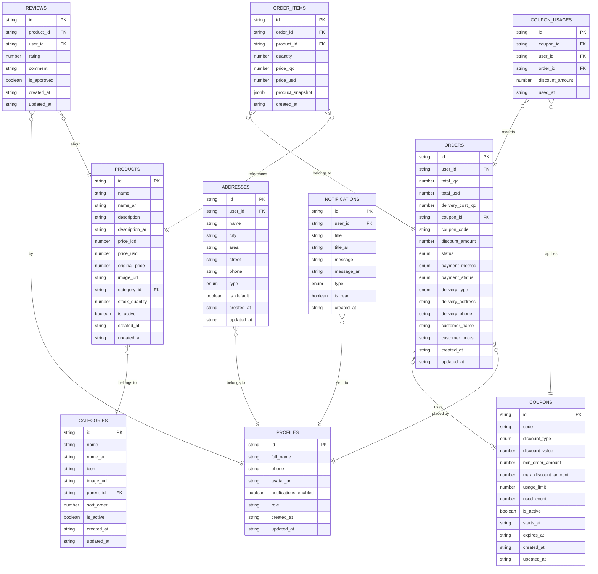
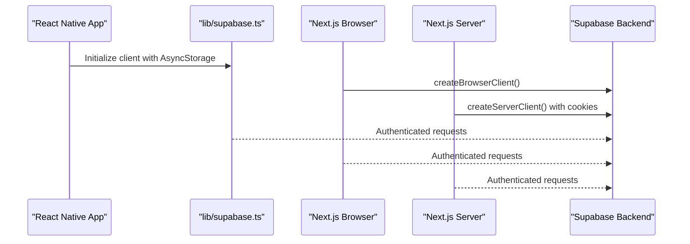
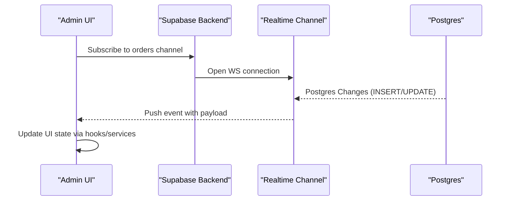
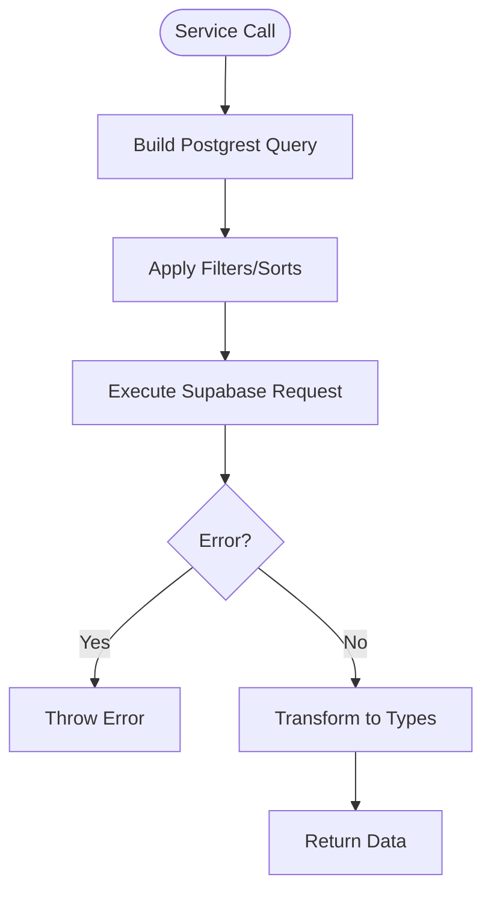
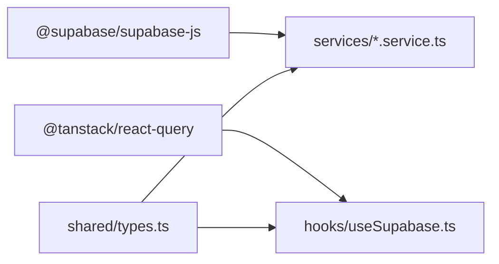

# Database Architecture

<cite>
**Referenced Files in This Document**
- [lib/supabase.ts](file://lib/supabase.ts)
- [web/src/lib/supabase.ts](file://web/src/lib/supabase.ts)
- [hooks/useSupabase.ts](file://hooks/useSupabase.ts)
- [shared/types.ts](file://shared/types.ts)
- [types/index.ts](file://types/index.ts)
- [admin/src/types/index.ts](file://admin/src/types/index.ts)
- [web/src/lib/types.ts](file://web/src/lib/types.ts)
- [services/products.service.ts](file://services/products.service.ts)
- [services/categories.service.ts](file://services/categories.service.ts)
- [services/orders.service.ts](file://services/orders.service.ts)
- [package.json](file://package.json)
- [.docs/ORDERS_REALTIME_SETUP.md](file://.docs/ORDERS_REALTIME_SETUP.md)
- [admin/README.md](file://admin/README.md)
</cite>

## Table of Contents
1. [Introduction](#introduction)
2. [Project Structure](#project-structure)
3. [Core Components](#core-components)
4. [Architecture Overview](#architecture-overview)
5. [Detailed Component Analysis](#detailed-component-analysis)
6. [Dependency Analysis](#dependency-analysis)
7. [Performance Considerations](#performance-considerations)
8. [Troubleshooting Guide](#troubleshooting-guide)
9. [Conclusion](#conclusion)
10. [Appendices](#appendices)

## Introduction
This document explains the database architecture and Supabase integration for the multi-platform application. It covers the database schema design inferred from shared TypeScript types, client configuration across platforms, data validation patterns, and operational guidance for real-time synchronization, performance optimization, migrations, backups, and schema extension while preserving referential integrity.

## Project Structure
The application is organized into:
- Mobile app (React Native) consuming a shared Supabase client
- Web app (Next.js) using SSR-aware Supabase clients
- Admin panel (Next.js) with real-time order updates and documentation
- Shared type definitions and services for data access

**Diagram sources**
- [lib/supabase.ts:1-30](file://lib/supabase.ts#L1-L30)
- [web/src/lib/supabase.ts:1-36](file://web/src/lib/supabase.ts#L1-L36)
- [shared/types.ts:10-211](file://shared/types.ts#L10-L211)
- [services/products.service.ts:1-449](file://services/products.service.ts#L1-L449)
- [.docs/ORDERS_REALTIME_SETUP.md](file://.docs/ORDERS_REALTIME_SETUP.md)

**Section sources**
- [lib/supabase.ts:1-30](file://lib/supabase.ts#L1-L30)
- [web/src/lib/supabase.ts:1-36](file://web/src/lib/supabase.ts#L1-L36)
- [shared/types.ts:10-211](file://shared/types.ts#L10-L211)
- [services/products.service.ts:1-449](file://services/products.service.ts#L1-L449)
- [admin/README.md:53](file://admin/README.md#L53)
- [admin/README.md:78](file://admin/README.md#L78)
- [.docs/ORDERS_REALTIME_SETUP.md](file://.docs/ORDERS_REALTIME_SETUP.md)

## Core Components
- Supabase clients:
  - Mobile: React Native client configured with AsyncStorage and persisted sessions
  - Web: Browser and server clients using Next.js cookies for SSR
- Shared types:
  - Strongly typed database schema inferred from Supabase tables
  - Business enums and derived types for UI and services
- Services:
  - Product, category, and order services encapsulate Supabase queries and joins
- Hooks:
  - React Query hooks for caching and fetching lists and details

**Section sources**
- [lib/supabase.ts:19-30](file://lib/supabase.ts#L19-L30)
- [web/src/lib/supabase.ts:5-35](file://web/src/lib/supabase.ts#L5-L35)
- [shared/types.ts:10-211](file://shared/types.ts#L10-L211)
- [hooks/useSupabase.ts:1-239](file://hooks/useSupabase.ts#L1-L239)
- [services/products.service.ts:13](file://services/products.service.ts#L13)
- [services/categories.service.ts:12](file://services/categories.service.ts#L12)
- [services/orders.service.ts:12](file://services/orders.service.ts#L12)

## Architecture Overview
The system uses a centralized Supabase backend with:
- A single source of truth via Postgres tables
- Strong typing enforced by generated Database interface and shared types
- Client-side caching via React Query
- Real-time capabilities via Supabase Channels (documented for orders)

**Diagram sources**
- [hooks/useSupabase.ts:1-239](file://hooks/useSupabase.ts#L1-L239)
- [services/products.service.ts:6](file://services/products.service.ts#L6)
- [services/categories.service.ts:6](file://services/categories.service.ts#L6)
- [services/orders.service.ts:6](file://services/orders.service.ts#L6)
- [lib/supabase.ts:19-30](file://lib/supabase.ts#L19-L30)
- [web/src/lib/supabase.ts:5-35](file://web/src/lib/supabase.ts#L5-L35)
- [shared/types.ts:10-211](file://shared/types.ts#L10-L211)

## Detailed Component Analysis

### Database Schema Design and Relationships
The shared types define the public schema with the following tables and relationships:
- profiles: user account metadata and roles
- categories: hierarchical taxonomy with parent_id for subcategories
- products: linked to categories, with multilingual fields and pricing
- orders: linked to profiles, with status and payment attributes
- order_items: line items snapshotting product details at purchase time
- reviews: user feedback on products
- coupons and coupon_usages: discount tracking
- addresses: user delivery locations
- notifications: user-centric messages

**Diagram sources**
- [shared/types.ts:10-211](file://shared/types.ts#L10-L211)

**Section sources**
- [shared/types.ts:10-211](file://shared/types.ts#L10-L211)

### TypeScript Type Definitions and Business Rules
- Database interface: central definition of tables, views, functions, and enums
- Derived types: Row, Insert, Update for each table
- Enums: OrderStatus, PaymentMethod, PaymentStatus, DeliveryType
- Extended types: joins and snapshots for UI composition
- Local UI types: separate from DB types for form and navigation

Validation patterns:
- Strict enums for status and payment fields
- Insert/Update generics to prevent mutating auto-managed fields
- Optional fields for nullable columns

**Section sources**
- [shared/types.ts:10-211](file://shared/types.ts#L10-L211)
- [types/index.ts:1-276](file://types/index.ts#L1-L276)
- [admin/src/types/index.ts:6-25](file://admin/src/types/index.ts#L6-L25)
- [web/src/lib/types.ts:1-2](file://web/src/lib/types.ts#L1-L2)

### Supabase Client Configuration and Authentication
- Mobile client:
  - Uses AsyncStorage for session persistence
  - Auto-refresh tokens and persistent sessions
- Web client:
  - Separate browser and server clients
  - Server client reads/writes Next.js cookies for SSR
  - Environment variables for Supabase URL and anon key
- Auth integration:
  - Supabase Auth SDK integrated via Supabase client
  - Token propagation to Realtime channels

**Diagram sources**
- [lib/supabase.ts:19-30](file://lib/supabase.ts#L19-L30)
- [web/src/lib/supabase.ts:11-35](file://web/src/lib/supabase.ts#L11-L35)

**Section sources**
- [lib/supabase.ts:19-30](file://lib/supabase.ts#L19-L30)
- [web/src/lib/supabase.ts:5-35](file://web/src/lib/supabase.ts#L5-L35)

### Real-Time Data Synchronization
- Orders real-time:
  - Admin documentation describes real-time order updates and pull-to-refresh
  - Channels subscribed for live status updates
- Client behavior:
  - Supabase client initializes Realtime with auth token propagation
  - Auth state changes propagate to Realtime channels

**Diagram sources**
- [admin/README.md:78](file://admin/README.md#L78)
- [.docs/ORDERS_REALTIME_SETUP.md](file://.docs/ORDERS_REALTIME_SETUP.md)

**Section sources**
- [admin/README.md:53](file://admin/README.md#L53)
- [admin/README.md:78](file://admin/README.md#L78)
- [.docs/ORDERS_REALTIME_SETUP.md](file://.docs/ORDERS_REALTIME_SETUP.md)

### Data Validation Patterns and Stored Procedures
- Validation:
  - Enum-based fields enforce business constraints
  - Insert/Update generics prevent accidental writes to managed fields
- Stored procedures/functions:
  - Not defined in the shared types; custom functions would be declared in the Database.Functions section if present

**Section sources**
- [shared/types.ts:204-209](file://shared/types.ts#L204-L209)
- [shared/types.ts:253-256](file://shared/types.ts#L253-L256)

### Services Layer and Query Patterns
- Products service:
  - Selects specific columns for listings, expands to full records on detail
  - Supports filtering, sorting, and fallbacks when data is unavailable
- Categories service:
  - Hierarchical retrieval with parent-child relationships
- Orders service:
  - CRUD operations with joins for order items and snapshots

**Diagram sources**
- [services/products.service.ts:18-42](file://services/products.service.ts#L18-L42)
- [services/categories.service.ts:12-21](file://services/categories.service.ts#L12-L21)
- [services/orders.service.ts:12-21](file://services/orders.service.ts#L12-L21)

**Section sources**
- [services/products.service.ts:13-449](file://services/products.service.ts#L13-L449)
- [services/categories.service.ts:12-137](file://services/categories.service.ts#L12-L137)
- [services/orders.service.ts:12-115](file://services/orders.service.ts#L12-L115)

## Dependency Analysis
- Runtime dependencies include Supabase client and React Query
- Shared types are re-exported across admin and web packages
- Services depend on the shared Supabase client

**Diagram sources**
- [package.json:18](file://package.json#L18)
- [package.json:19](file://package.json#L19)
- [shared/types.ts:6-25](file://shared/types.ts#L6-L25)
- [hooks/useSupabase.ts:7](file://hooks/useSupabase.ts#L7)

**Section sources**
- [package.json:12-56](file://package.json#L12-L56)
- [shared/types.ts:6-25](file://shared/types.ts#L6-L25)
- [hooks/useSupabase.ts:7](file://hooks/useSupabase.ts#L7)

## Performance Considerations
- Column selection:
  - Use targeted selects for lists (e.g., product listing fields) to reduce payload sizes
- Pagination and range:
  - Apply range limits and offsets for large datasets
- Sorting and filtering:
  - Push predicates to the database to minimize client-side work
- Caching:
  - React Query manages caching; ensure sensible query keys and stale times
- Indexing:
  - Create indexes on frequently filtered/sorted columns (e.g., category_id, is_active, created_at)
- Real-time:
  - Subscribe to specific channels and tables to minimize bandwidth
- Connection management:
  - Persist sessions on mobile; reuse server client in SSR to avoid redundant auth flows

[No sources needed since this section provides general guidance]

## Troubleshooting Guide
- Environment variables:
  - Verify NEXT_PUBLIC_SUPABASE_URL and NEXT_PUBLIC_SUPABASE_ANON_KEY are set in web builds
- Authentication:
  - Ensure AsyncStorage is available on mobile; check session persistence and auto-refresh settings
- Real-time:
  - Confirm auth state changes propagate to Realtime; inspect channel subscriptions and event logs
- Service errors:
  - Inspect thrown errors from Supabase requests and surface user-friendly messages

**Section sources**
- [web/src/lib/supabase.ts:5-9](file://web/src/lib/supabase.ts#L5-L9)
- [lib/supabase.ts:19-30](file://lib/supabase.ts#L19-L30)
- [admin/README.md:78](file://admin/README.md#L78)

## Conclusion
The application leverages a strongly typed Supabase backend with platform-specific clients, a shared type system, and a services layer to deliver a consistent data model across mobile, web, and admin experiences. Real-time updates are documented for orders, and the architecture supports scalable performance via targeted queries, caching, and proper indexing. Extending the schema should adhere to the shared types contract and maintain referential integrity.

[No sources needed since this section summarizes without analyzing specific files]

## Appendices

### Migration Strategies
- Use Supabase SQL migrations to evolve tables and indexes
- Keep shared types synchronized with schema changes
- Validate enums and constraints before deploying

[No sources needed since this section provides general guidance]

### Backup and Disaster Recovery
- Enable automated backups in Supabase
- Maintain local SQL dumps for critical periods
- Test restore procedures regularly

[No sources needed since this section provides general guidance]

### Extending the Schema and Maintaining Integrity
- Define new tables and relationships in Supabase SQL
- Add entries to the shared Database interface
- Update services and hooks to consume new fields
- Add indexes on new foreign keys and frequently queried columns
- Preserve referential integrity via foreign keys and cascading rules

**Section sources**
- [shared/types.ts:10-211](file://shared/types.ts#L10-L211)