# Order Services

<cite>
**Referenced Files in This Document**
- [orders.service.ts](file://services/orders.service.ts)
- [orders.tsx](file://app/orders.tsx)
- [order/[id].tsx](file://app/order/[id].tsx)
- [checkout.tsx](file://app/checkout.tsx)
- [types.ts](file://shared/types.ts)
- [index.ts](file://types/index.ts)
- [cartStore.ts](file://store/cartStore.ts)
- [ORDERS_REALTIME_SETUP.md](file://.docs/ORDERS_REALTIME_SETUP.md)
- [orders/page.tsx](file://admin/src/app/(dashboard)/orders/page.tsx)
- [orders/[id]/page.tsx](file://admin/src/app/(dashboard)/orders/[id]/page.tsx)
- [dashboard/page.tsx](file://admin/src/app/(dashboard)/page.tsx)
</cite>

## Table of Contents
1. [Introduction](#introduction)
2. [Project Structure](#project-structure)
3. [Core Components](#core-components)
4. [Architecture Overview](#architecture-overview)
5. [Detailed Component Analysis](#detailed-component-analysis)
6. [Dependency Analysis](#dependency-analysis)
7. [Performance Considerations](#performance-considerations)
8. [Troubleshooting Guide](#troubleshooting-guide)
9. [Conclusion](#conclusion)
10. [Appendices](#appendices)

## Introduction
This document provides comprehensive documentation for the order management service layer. It explains the complete order lifecycle from cart to fulfillment, including cart-to-order conversion, payment processing, and delivery coordination. It documents the order data model, state machine, real-time tracking, analytics and reporting, modification and cancellation workflows, error handling, and integration patterns with the admin dashboard. The goal is to make the system understandable for both technical and non-technical stakeholders.

## Project Structure
The order management spans three primary areas:
- Frontend mobile app screens for cart, checkout, order listing, and order details
- Backend service layer for database operations
- Admin dashboard for order management, analytics, and reporting

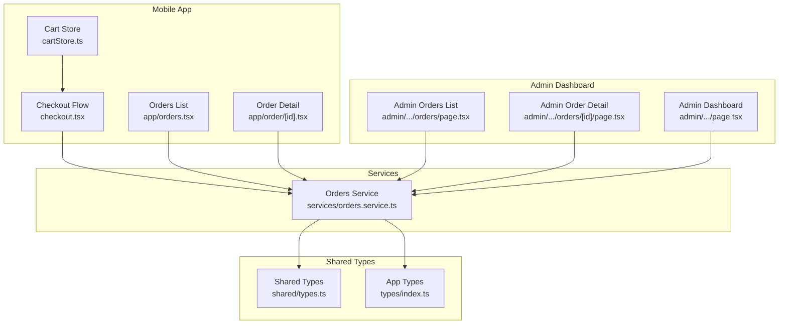

**Diagram sources**
- [cartStore.ts:1-174](file://store/cartStore.ts#L1-L174)
- [checkout.tsx:1-491](file://app/checkout.tsx#L1-L491)
- [orders.tsx:1-516](file://app/orders.tsx#L1-L516)
- [order/[id].tsx](file://app/order/[id].tsx#L1-L269)
- [orders.service.ts:1-115](file://services/orders.service.ts#L1-L115)
- [types.ts:1-353](file://shared/types.ts#L1-L353)
- [index.ts:1-276](file://types/index.ts#L1-L276)
- [orders/page.tsx](file://admin/src/app/(dashboard)/orders/page.tsx#L1-L173)
- [orders/[id]/page.tsx](file://admin/src/app/(dashboard)/orders/[id]/page.tsx#L1-L655)
- [dashboard/page.tsx](file://admin/src/app/(dashboard)/page.tsx#L69-L288)

**Section sources**
- [orders.service.ts:1-115](file://services/orders.service.ts#L1-L115)
- [orders.tsx:1-516](file://app/orders.tsx#L1-L516)
- [order/[id].tsx](file://app/order/[id].tsx#L1-L269)
- [checkout.tsx:1-491](file://app/checkout.tsx#L1-L491)
- [types.ts:1-353](file://shared/types.ts#L1-L353)
- [index.ts:1-276](file://types/index.ts#L1-L276)
- [cartStore.ts:1-174](file://store/cartStore.ts#L1-L174)
- [orders/page.tsx](file://admin/src/app/(dashboard)/orders/page.tsx#L1-L173)
- [orders/[id]/page.tsx](file://admin/src/app/(dashboard)/orders/[id]/page.tsx#L1-L655)
- [dashboard/page.tsx](file://admin/src/app/(dashboard)/page.tsx#L69-L288)

## Core Components
- Orders Service: Encapsulates Supabase operations for order CRUD, order-item creation, retrieval by ID, user orders, all orders, and status updates.
- Order Data Model: Strongly typed via shared types and app types, covering order metadata, items, payments, and delivery.
- Checkout Flow: Converts cart items into an order, applies coupons, calculates totals, persists order and items, and invokes stock reduction RPC.
- Real-time Tracking: Subscribes to Supabase realtime channels for immediate UI updates on order changes.
- Admin Dashboard: Lists orders, filters by status, updates order status, prints invoices, and aggregates analytics.

**Section sources**
- [orders.service.ts:1-115](file://services/orders.service.ts#L1-L115)
- [types.ts:49-86](file://shared/types.ts#L49-L86)
- [index.ts:76-108](file://types/index.ts#L76-L108)
- [checkout.tsx:152-254](file://app/checkout.tsx#L152-L254)
- [orders.tsx:43-85](file://app/orders.tsx#L43-L85)
- [orders/page.tsx](file://admin/src/app/(dashboard)/orders/page.tsx#L1-L173)
- [orders/[id]/page.tsx](file://admin/src/app/(dashboard)/orders/[id]/page.tsx#L95-L135)

## Architecture Overview
The order lifecycle integrates frontend flows with backend services and Supabase:

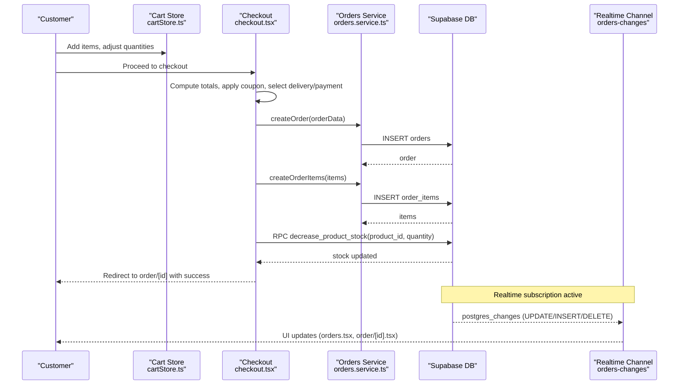

**Diagram sources**
- [cartStore.ts:51-174](file://store/cartStore.ts#L51-L174)
- [checkout.tsx:152-254](file://app/checkout.tsx#L152-L254)
- [orders.service.ts:12-34](file://services/orders.service.ts#L12-L34)
- [orders.tsx:43-85](file://app/orders.tsx#L43-L85)
- [order/[id].tsx](file://app/order/[id].tsx#L24-L46)

## Detailed Component Analysis

### Orders Service Layer
The service layer abstracts Supabase interactions for orders and order items:
- createOrder: Inserts a new order record and returns the created order.
- createOrderItems: Bulk inserts order items linked to the order.
- getOrderById: Retrieves an order with nested order items.
- getUserOrders: Fetches orders for a specific user, ordered by creation time.
- getAllOrders: Fetches all orders for admin use.
- updateOrderStatus: Updates the order’s lifecycle status.
- updatePaymentStatus: Updates the payment-related status.

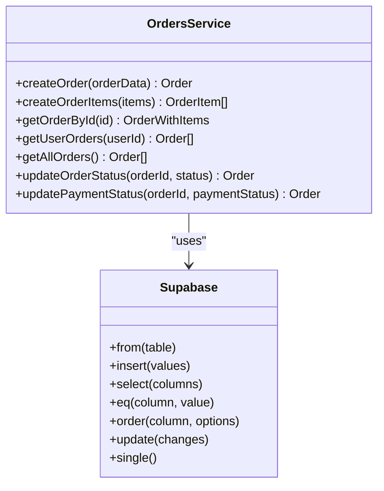

**Diagram sources**
- [orders.service.ts:12-114](file://services/orders.service.ts#L12-L114)

**Section sources**
- [orders.service.ts:12-114](file://services/orders.service.ts#L12-L114)

### Order Data Model and Types
The order model and related enums/types define the domain:
- Order: Core order fields including totals, status, payment method/status, delivery info, and timestamps.
- OrderItem: Line items with product snapshot and pricing.
- Enums: OrderStatus, PaymentMethod, PaymentStatus, DeliveryType.
- Extended types: OrderWithItems, OrderItemWithSnapshot.

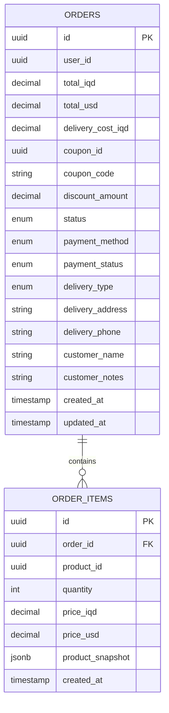

**Diagram sources**
- [types.ts:49-86](file://shared/types.ts#L49-L86)
- [types.ts:225-284](file://shared/types.ts#L225-L284)

**Section sources**
- [types.ts:49-86](file://shared/types.ts#L49-L86)
- [types.ts:225-284](file://shared/types.ts#L225-L284)
- [index.ts:76-108](file://types/index.ts#L76-L108)

### Cart to Order Conversion
The checkout flow converts cart items into an order:
- Validates address and delivery preferences.
- Computes totals (subtotal, delivery cost, discount).
- Creates the order with appropriate status and payment status.
- Persists order items with product snapshots.
- Records coupon usage if applicable.
- Decrements product stock via RPC.
- Clears the cart and navigates to the new order screen.

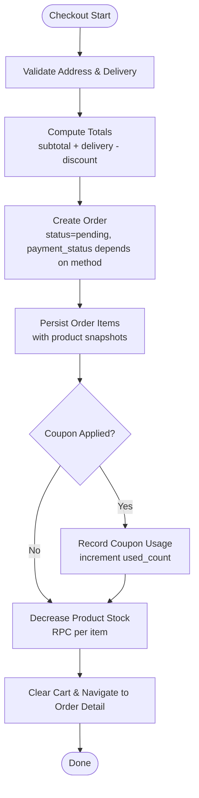

**Diagram sources**
- [checkout.tsx:152-254](file://app/checkout.tsx#L152-L254)

**Section sources**
- [checkout.tsx:152-254](file://app/checkout.tsx#L152-L254)
- [cartStore.ts:51-174](file://store/cartStore.ts#L51-L174)

### Real-time Order Tracking and Live Updates
Real-time updates keep the UI synchronized:
- Orders list subscribes to a channel filtering by user ID.
- Individual order detail subscribes to updates for that order ID.
- On UPDATE/INSERT/DELETE events, the UI optimistically updates state.

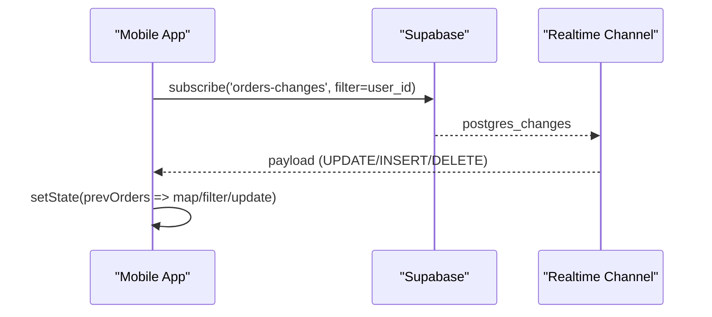

**Diagram sources**
- [orders.tsx:43-85](file://app/orders.tsx#L43-L85)
- [order/[id].tsx](file://app/order/[id].tsx#L24-L46)
- [ORDERS_REALTIME_SETUP.md:1-37](file://.docs/ORDERS_REALTIME_SETUP.md#L1-L37)

**Section sources**
- [orders.tsx:43-85](file://app/orders.tsx#L43-L85)
- [order/[id].tsx](file://app/order/[id].tsx#L24-L46)
- [ORDERS_REALTIME_SETUP.md:1-37](file://.docs/ORDERS_REALTIME_SETUP.md#L1-L37)

### Order State Machine
The order progresses through a defined lifecycle:
- Pending: Initial state after placement.
- Confirmed: Order accepted and being processed.
- Preparing: Items are being prepared.
- Ready: Order ready for pickup/delivery.
- Delivered: Order completed.
- Cancelled: Order terminated by user or admin.

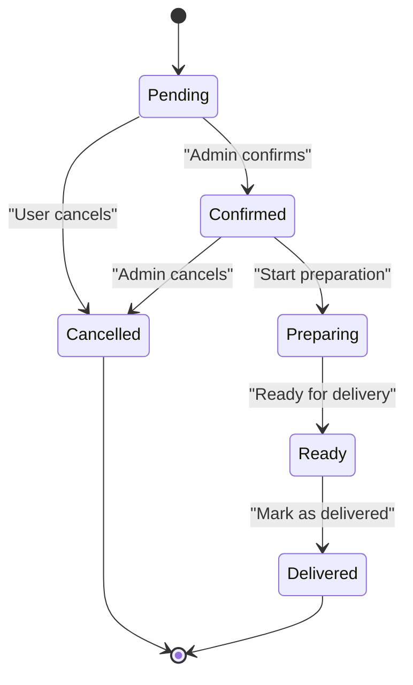

**Diagram sources**
- [types.ts:253-256](file://shared/types.ts#L253-L256)
- [orders.tsx:11-11](file://app/orders.tsx#L11-L11)
- [order/[id].tsx](file://app/order/[id].tsx#L82-L111)

**Section sources**
- [types.ts:253-256](file://shared/types.ts#L253-L256)
- [orders.tsx:11-11](file://app/orders.tsx#L11-L11)
- [order/[id].tsx](file://app/order/[id].tsx#L82-L111)

### Admin Dashboard: Management, Analytics, and Reporting
Admin capabilities include:
- Listing orders with filtering by status.
- Updating order status with optimistic UI and error handling.
- Printing invoices with formatted HTML.
- Aggregating analytics: total orders, revenue, pending orders, average order value, weekly sales, order status distribution, top products, and alerts.

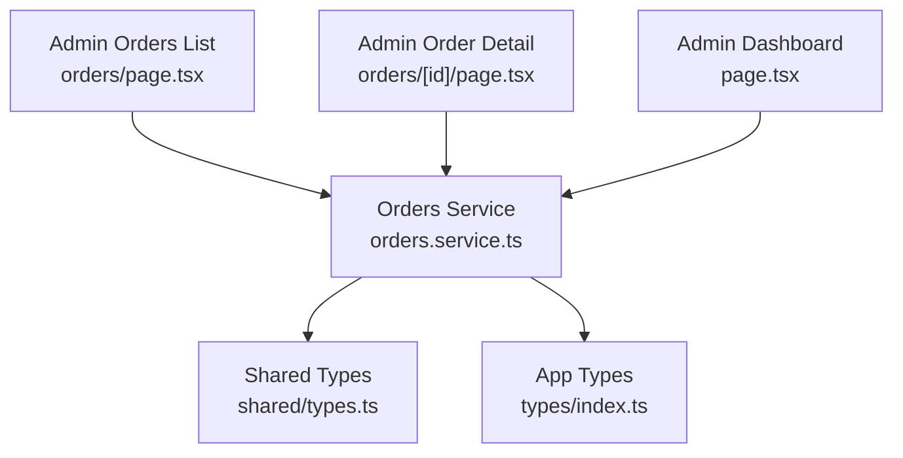

**Diagram sources**
- [orders/page.tsx](file://admin/src/app/(dashboard)/orders/page.tsx#L1-L173)
- [orders/[id]/page.tsx](file://admin/src/app/(dashboard)/orders/[id]/page.tsx#L1-L655)
- [dashboard/page.tsx](file://admin/src/app/(dashboard)/page.tsx#L69-L288)
- [orders.service.ts:1-115](file://services/orders.service.ts#L1-L115)
- [types.ts:1-353](file://shared/types.ts#L1-L353)
- [index.ts:1-276](file://types/index.ts#L1-L276)

**Section sources**
- [orders/page.tsx](file://admin/src/app/(dashboard)/orders/page.tsx#L1-L173)
- [orders/[id]/page.tsx](file://admin/src/app/(dashboard)/orders/[id]/page.tsx#L95-L135)
- [dashboard/page.tsx](file://admin/src/app/(dashboard)/page.tsx#L69-L288)

### Order Modification, Cancellation, and Refunds
- User cancellation: Allowed only when status is pending or confirmed; triggers an update to cancelled.
- Admin updates: Optimistic UI update followed by server-side update with revert on error.
- Refund processing: Not implemented in the current code; would require extending payment status and adding refund records.

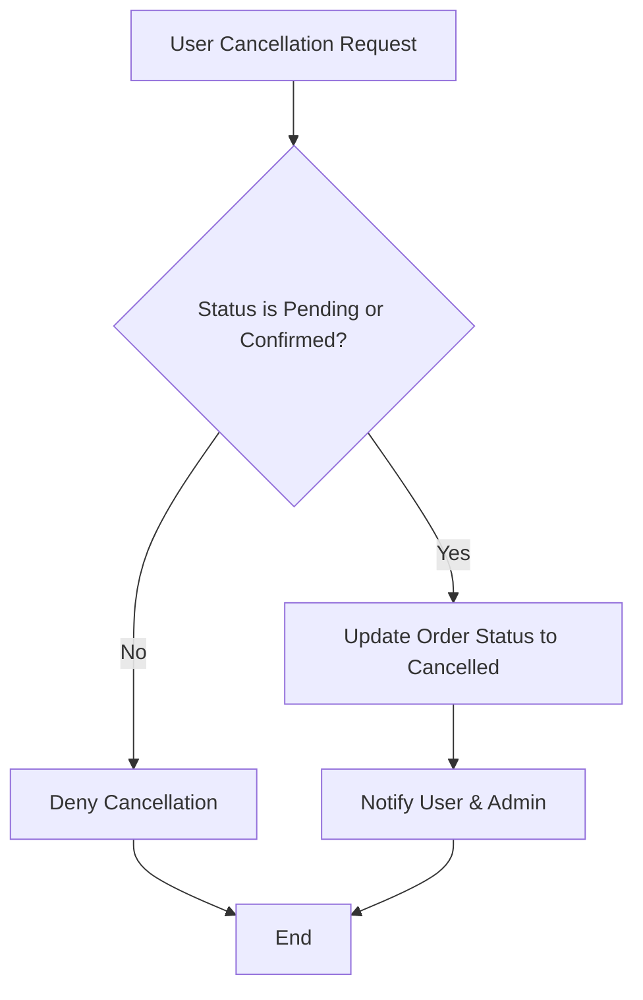

**Diagram sources**
- [order/[id].tsx](file://app/order/[id].tsx#L82-L111)
- [orders/[id]/page.tsx](file://admin/src/app/(dashboard)/orders/[id]/page.tsx#L95-L135)

**Section sources**
- [order/[id].tsx](file://app/order/[id].tsx#L82-L111)
- [orders/[id]/page.tsx](file://admin/src/app/(dashboard)/orders/[id]/page.tsx#L95-L135)

### Payment Processing and Delivery Coordination
- Payment methods: Cash on Delivery (COD) and others marked as upcoming.
- Payment statuses: Pending, Paid, Failed, Awaiting Payment.
- Delivery types: Scheduled, Express, Electronics.
- Stock management: Decremented via RPC during order placement.

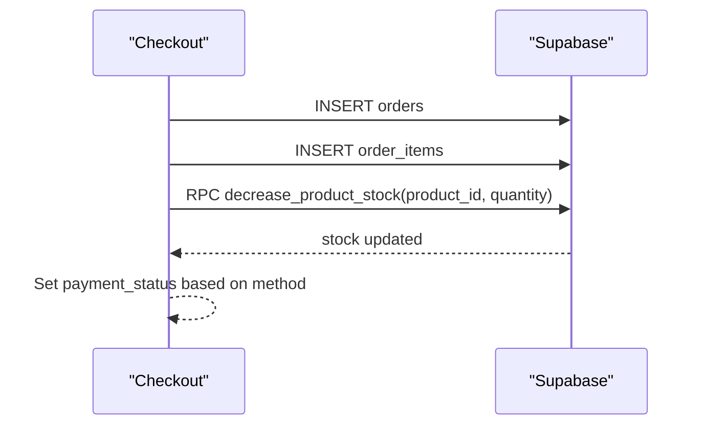

**Diagram sources**
- [checkout.tsx:174-242](file://app/checkout.tsx#L174-L242)
- [types.ts:254-256](file://shared/types.ts#L254-L256)

**Section sources**
- [checkout.tsx:174-242](file://app/checkout.tsx#L174-L242)
- [types.ts:254-256](file://shared/types.ts#L254-L256)

## Dependency Analysis
Key dependencies and relationships:
- Frontend screens depend on the Orders Service for data operations.
- Shared types unify contract between frontend and backend.
- Admin dashboard mirrors order operations and adds analytics.
- Realtime subscriptions depend on Supabase publication and replica identity configuration.

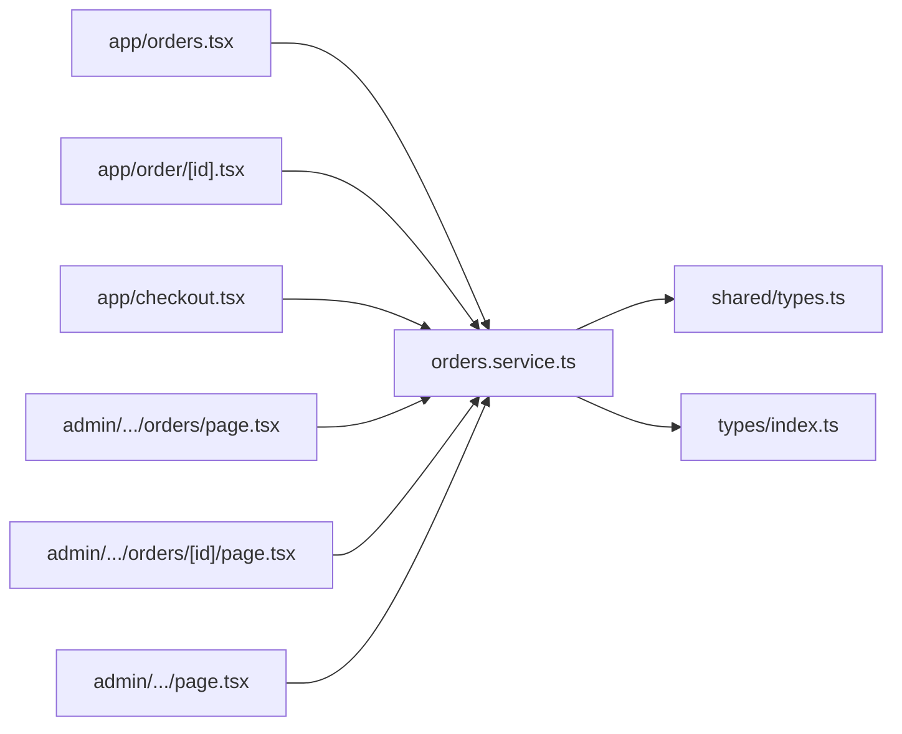

**Diagram sources**
- [orders.service.ts:1-115](file://services/orders.service.ts#L1-L115)
- [types.ts:1-353](file://shared/types.ts#L1-L353)
- [index.ts:1-276](file://types/index.ts#L1-L276)
- [orders.tsx:1-516](file://app/orders.tsx#L1-L516)
- [order/[id].tsx](file://app/order/[id].tsx#L1-L269)
- [checkout.tsx:1-491](file://app/checkout.tsx#L1-L491)
- [orders/page.tsx](file://admin/src/app/(dashboard)/orders/page.tsx#L1-L173)
- [orders/[id]/page.tsx](file://admin/src/app/(dashboard)/orders/[id]/page.tsx#L1-L655)
- [dashboard/page.tsx](file://admin/src/app/(dashboard)/page.tsx#L69-L288)

**Section sources**
- [orders.service.ts:1-115](file://services/orders.service.ts#L1-L115)
- [types.ts:1-353](file://shared/types.ts#L1-L353)
- [index.ts:1-276](file://types/index.ts#L1-L276)
- [orders.tsx:1-516](file://app/orders.tsx#L1-L516)
- [order/[id].tsx](file://app/order/[id].tsx#L1-L269)
- [checkout.tsx:1-491](file://app/checkout.tsx#L1-L491)
- [orders/page.tsx](file://admin/src/app/(dashboard)/orders/page.tsx#L1-L173)
- [orders/[id]/page.tsx](file://admin/src/app/(dashboard)/orders/[id]/page.tsx#L1-L655)
- [dashboard/page.tsx](file://admin/src/app/(dashboard)/page.tsx#L69-L288)

## Performance Considerations
- Realtime subscriptions: Efficiently update UI on changes; ensure proper cleanup to avoid leaks.
- Batch operations: Use bulk insert for order items to minimize round-trips.
- Stock updates: Use atomic RPC or conditional updates to prevent race conditions.
- Pagination and filtering: Use Supabase filters and ordering to reduce payload sizes.
- Currency formatting: Cache formatters to avoid repeated Intl instantiation.
- Memoization: Use useMemo for derived lists (active/history) to avoid unnecessary renders.

[No sources needed since this section provides general guidance]

## Troubleshooting Guide
Common issues and resolutions:
- Realtime not updating: Verify Supabase Realtime is enabled on the orders table and publication includes orders; ensure replica identity is FULL.
- Order creation fails: Check for network errors, coupon usage conflicts, and stock availability; rollback partial writes on failure.
- Payment status mismatches: Align payment status transitions with payment method selection.
- Delivery issues: Validate delivery type costs and addresses; ensure stock decrements occur before order confirmation.

**Section sources**
- [ORDERS_REALTIME_SETUP.md:1-37](file://.docs/ORDERS_REALTIME_SETUP.md#L1-L37)
- [checkout.tsx:208-238](file://app/checkout.tsx#L208-L238)
- [order/[id].tsx](file://app/order/[id].tsx#L84-L111)

## Conclusion
The order management service layer integrates cart-to-order conversion, robust data modeling, real-time updates, and admin analytics. By adhering to the defined state machine, leveraging the Orders Service for all data operations, and implementing best practices for performance and error handling, the system supports a reliable and scalable order lifecycle from creation through fulfillment.

[No sources needed since this section summarizes without analyzing specific files]

## Appendices

### API Definitions and Contracts
- createOrder: Inserts an order with computed totals and initial status; returns the created order.
- createOrderItems: Inserts multiple order items; returns persisted items.
- getOrderById: Returns an order with nested items.
- getUserOrders: Returns a user’s orders ordered by newest first.
- getAllOrders: Returns all orders for admin use.
- updateOrderStatus: Updates order lifecycle status.
- updatePaymentStatus: Updates payment-related status.

**Section sources**
- [orders.service.ts:12-114](file://services/orders.service.ts#L12-L114)

### Integration Patterns
- Mobile to Admin synchronization: Admin updates propagate via Supabase Realtime; mobile clients subscribe to user-specific channels.
- Checkout to stock: Atomic stock decrement via RPC ensures inventory integrity.
- Analytics aggregation: Admin dashboard computes metrics from order and order_item data.

**Section sources**
- [orders.tsx:43-85](file://app/orders.tsx#L43-L85)
- [checkout.tsx:240-242](file://app/checkout.tsx#L240-L242)
- [dashboard/page.tsx](file://admin/src/app/(dashboard)/page.tsx#L143-L170)