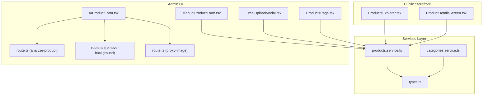
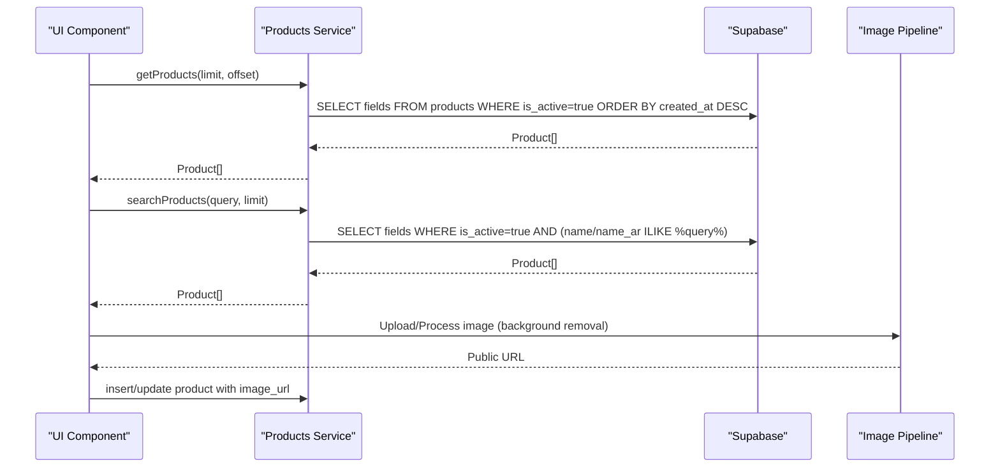
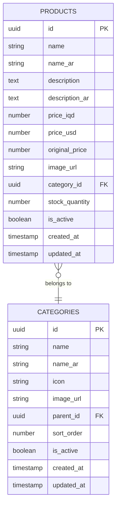
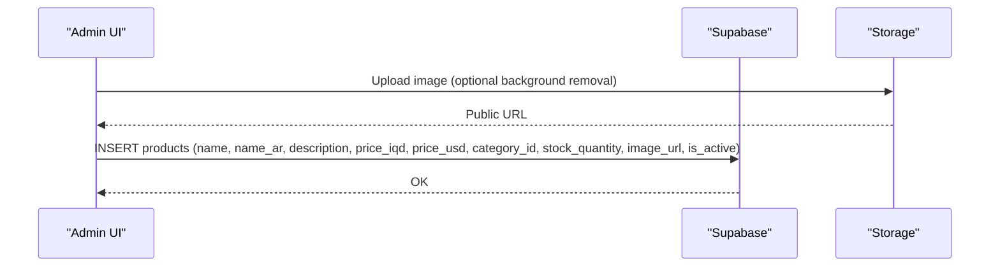
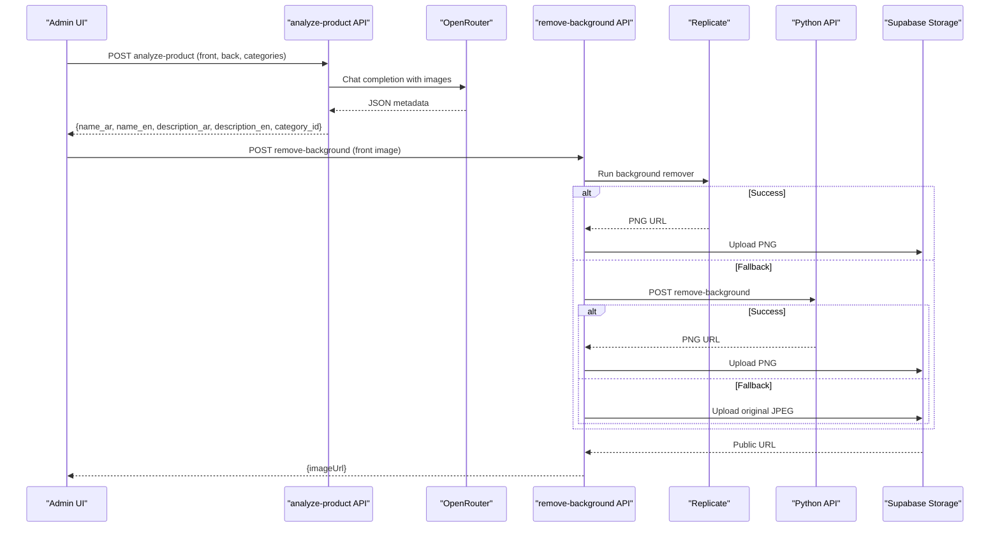
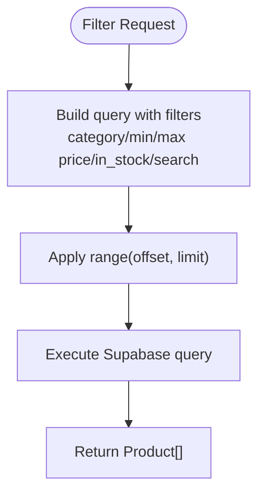
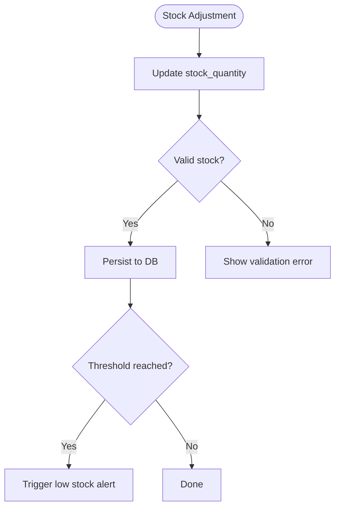
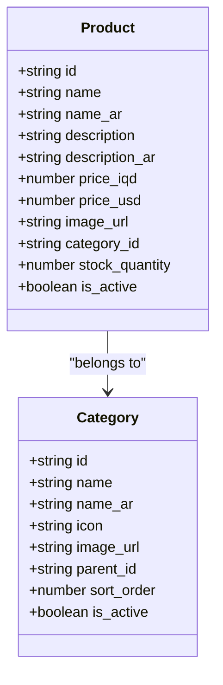
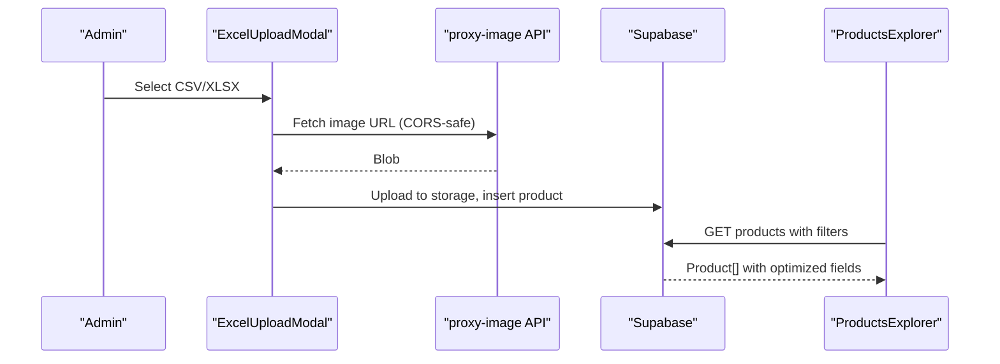
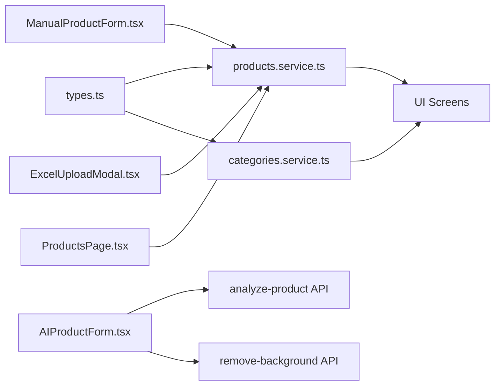

# Product Services

<cite>
**Referenced Files in This Document**
- [products.service.ts](file://services/products.service.ts)
- [categories.service.ts](file://services/categories.service.ts)
- [types.ts](file://shared/types.ts)
- [AIProductForm.tsx](file://admin/src/components/products/AIProductForm.tsx)
- [ManualProductForm.tsx](file://admin/src/components/products/ManualProductForm.tsx)
- [ExcelUploadModal.tsx](file://admin/src/components/products/ExcelUploadModal.tsx)
- [route.ts (analyze-product)](file://admin/src/app/api/ai/analyze-product/route.ts)
- [route.ts (remove-background)](file://admin/src/app/api/ai/remove-background/route.ts)
- [route.ts (proxy-image)](file://admin/src/app/api/proxy-image/route.ts)
- [ProductsPage.tsx](file://admin/src/app/(dashboard)/products/page.tsx)
- [ProductsExplorer.tsx](file://web/src/components/catalog/ProductsExplorer.tsx)
- [ProductDetailsScreen.tsx](file://app/product/[id].tsx)
- [categories.page.tsx](file://admin/src/app/(dashboard)/categories/page.tsx)
- [offers page](file://admin/src/app/(dashboard)/offers/page.tsx)
</cite>

## Table of Contents
1. [Introduction](#introduction)
2. [Project Structure](#project-structure)
3. [Core Components](#core-components)
4. [Architecture Overview](#architecture-overview)
5. [Detailed Component Analysis](#detailed-component-analysis)
6. [Dependency Analysis](#dependency-analysis)
7. [Performance Considerations](#performance-considerations)
8. [Troubleshooting Guide](#troubleshooting-guide)
9. [Conclusion](#conclusion)
10. [Appendices](#appendices)

## Introduction
This document describes the product management service layer for the Amal Center platform. It covers product CRUD operations, the product data model, image processing and storage, search and filtering, inventory management, categorization, promotional pricing, error handling, and performance optimizations. It also includes usage patterns and integration points with UI components across mobile, web, and admin dashboards.

## Project Structure
The product domain spans three primary areas:
- Backend services and database queries: services layer
- Admin UI for product creation and management: admin components and pages
- Public storefront and mobile app for browsing and purchasing: web and app screens



**Diagram sources**
- [products.service.ts:1-449](file://services/products.service.ts#L1-L449)
- [categories.service.ts:1-137](file://services/categories.service.ts#L1-L137)
- [types.ts:1-353](file://shared/types.ts#L1-L353)
- [AIProductForm.tsx:1-670](file://admin/src/components/products/AIProductForm.tsx#L1-L670)
- [ManualProductForm.tsx:1-255](file://admin/src/components/products/ManualProductForm.tsx#L1-L255)
- [ExcelUploadModal.tsx:1-398](file://admin/src/components/products/ExcelUploadModal.tsx#L1-L398)
- [ProductsPage.tsx](file://admin/src/app/(dashboard)/products/page.tsx#L1-L435)
- [route.ts (analyze-product):1-221](file://admin/src/app/api/ai/analyze-product/route.ts#L1-L221)
- [route.ts (remove-background):1-152](file://admin/src/app/api/ai/remove-background/route.ts#L1-L152)
- [route.ts (proxy-image):1-42](file://admin/src/app/api/proxy-image/route.ts#L1-L42)
- [ProductsExplorer.tsx:335-369](file://web/src/components/catalog/ProductsExplorer.tsx#L335-L369)
- [ProductDetailsScreen.tsx:1-325](file://app/product/[id].tsx#L1-L325)

**Section sources**
- [products.service.ts:1-449](file://services/products.service.ts#L1-L449)
- [categories.service.ts:1-137](file://services/categories.service.ts#L1-L137)
- [types.ts:1-353](file://shared/types.ts#L1-L353)

## Core Components
- Product service: exposes product listing, retrieval, search, filtering, trending/best-seller/new arrivals, and offers.
- Category service: retrieves hierarchical categories and subcategories.
- Types: defines the canonical product and category shapes, filters, and enums.
- Admin forms and pages: create products via AI-assisted extraction, manual entry, and bulk upload.
- Storefront and mobile screens: browse, filter, and purchase products.

**Section sources**
- [products.service.ts:1-449](file://services/products.service.ts#L1-L449)
- [categories.service.ts:1-137](file://services/categories.service.ts#L1-L137)
- [types.ts:1-353](file://shared/types.ts#L1-L353)

## Architecture Overview
The product service layer orchestrates Supabase queries and integrates with admin APIs for AI-powered product ingestion and image processing. The UI components call these services to render product catalogs, details, and manage inventory.



**Diagram sources**
- [products.service.ts:18-28](file://services/products.service.ts#L18-L28)
- [products.service.ts:264-274](file://services/products.service.ts#L264-L274)
- [route.ts (remove-background):12-151](file://admin/src/app/api/ai/remove-background/route.ts#L12-L151)

## Detailed Component Analysis

### Product Data Model
The product entity is defined with multilingual names, pricing in IQD and USD, optional original price for promotions, category association, stock quantity, activity flag, and timestamps. The service layer selects a subset of fields for listings to reduce payload size.



**Diagram sources**
- [types.ts:14-32](file://shared/types.ts#L14-L32)
- [types.ts:33-48](file://shared/types.ts#L33-L48)

**Section sources**
- [types.ts:14-32](file://shared/types.ts#L14-L32)
- [types.ts:33-48](file://shared/types.ts#L33-L48)
- [products.service.ts:13-28](file://services/products.service.ts#L13-L28)

### Product CRUD Workflows
- Create: Admin forms submit product data; images are optionally processed and stored via Supabase Storage. The service inserts records with computed USD price and defaults.
- Retrieve: Single product by ID loads full details; listings use optimized field selection.
- Update: Admin pages update product fields; inventory and pricing can be adjusted.
- Delete: Admin dashboard deletes products after confirmation.



**Diagram sources**
- [AIProductForm.tsx:256-278](file://admin/src/components/products/AIProductForm.tsx#L256-L278)
- [ManualProductForm.tsx:94-115](file://admin/src/components/products/ManualProductForm.tsx#L94-L115)
- [route.ts (remove-background):122-141](file://admin/src/app/api/ai/remove-background/route.ts#L122-L141)

**Section sources**
- [AIProductForm.tsx:256-278](file://admin/src/components/products/AIProductForm.tsx#L256-L278)
- [ManualProductForm.tsx:94-115](file://admin/src/components/products/ManualProductForm.tsx#L94-L115)
- [ProductsPage.tsx](file://admin/src/app/(dashboard)/products/page.tsx#L94-L108)

### Image Processing Pipeline
The pipeline supports AI-assisted product analysis and background removal:
- AI analysis: Sends front/back images to OpenRouter; parses structured JSON for product metadata and category mapping.
- Background removal: Uses Replicate API; falls back to local Python API or uploads original image.
- Proxy image: Fetches external images with CORS handling.
- Storage: Uploads processed images to Supabase Storage with cache control and returns public URLs.



**Diagram sources**
- [route.ts (analyze-product):71-220](file://admin/src/app/api/ai/analyze-product/route.ts#L71-L220)
- [route.ts (remove-background):12-151](file://admin/src/app/api/ai/remove-background/route.ts#L12-L151)
- [route.ts (proxy-image):4-41](file://admin/src/app/api/proxy-image/route.ts#L4-L41)

**Section sources**
- [route.ts (analyze-product):71-220](file://admin/src/app/api/ai/analyze-product/route.ts#L71-L220)
- [route.ts (remove-background):12-151](file://admin/src/app/api/ai/remove-background/route.ts#L12-L151)
- [route.ts (proxy-image):4-41](file://admin/src/app/api/proxy-image/route.ts#L4-L41)

### Search and Filtering
- Full-text search across multilingual names.
- Category-based filtering and pagination.
- Price range filtering and stock availability toggle.
- Sorting options: newest, oldest, price low/high, name A–Z/Z–A.



**Diagram sources**
- [products.service.ts:279-309](file://services/products.service.ts#L279-L309)
- [products.service.ts:314-379](file://services/products.service.ts#L314-L379)
- [products.service.ts:384-448](file://services/products.service.ts#L384-L448)

**Section sources**
- [products.service.ts:264-274](file://services/products.service.ts#L264-L274)
- [products.service.ts:279-309](file://services/products.service.ts#L279-L309)
- [products.service.ts:314-379](file://services/products.service.ts#L314-L379)
- [products.service.ts:384-448](file://services/products.service.ts#L384-L448)

### Inventory Management
- Real-time stock tracking per product.
- Low stock threshold (<10) and out-of-stock indicators in admin UI.
- Stock adjustments via admin forms and bulk upload.



**Diagram sources**
- [ManualProductForm.tsx:164-173](file://admin/src/components/products/ManualProductForm.tsx#L164-L173)
- [ExcelUploadModal.tsx:226-248](file://admin/src/components/products/ExcelUploadModal.tsx#L226-L248)
- [ProductsPage.tsx](file://admin/src/app/(dashboard)/products/page.tsx#L230-L244)

**Section sources**
- [ManualProductForm.tsx:164-173](file://admin/src/components/products/ManualProductForm.tsx#L164-L173)
- [ExcelUploadModal.tsx:226-248](file://admin/src/components/products/ExcelUploadModal.tsx#L226-L248)
- [ProductsPage.tsx](file://admin/src/app/(dashboard)/products/page.tsx#L230-L244)

### Promotional Pricing and Offers
- Offers table defines active campaigns with discount types and values.
- Special offers endpoint computes discounted prices and attaches offer metadata.
- UI displays original vs discounted price and discount percentage.

```mermaid
sequenceDiagram
participant UI as "UI"
participant SVC as "Products Service"
participant OFF as "Offers DB"
participant OP as "Offer Products DB"
UI->>SVC : getSpecialOffers(limit)
SVC->>OFF : SELECT active offer within dates
alt Active offer exists
SVC->>OP : JOIN offer_products to get products
OP-->>SVC : Offered products
SVC->>SVC : Apply discount (percentage/fixed)
else No active offer
SVC-->>UI : Fallback random products with fake discount
end
SVC-->>UI : {products, offerEndDate, offerName}
```

**Diagram sources**
- [products.service.ts:72-152](file://services/products.service.ts#L72-L152)
- [ProductDetailsScreen.tsx:70-72](file://app/product/[id].tsx#L70-L72)

**Section sources**
- [products.service.ts:62-152](file://services/products.service.ts#L62-L152)
- [ProductDetailsScreen.tsx:70-72](file://app/product/[id].tsx#L70-L72)

### Product Categorization and Hierarchical Organization
- Categories support parent-child hierarchy with sort order and icons.
- Admin pages list categories and allow filtering by status.
- Product queries can filter by main category and subcategories.



**Diagram sources**
- [types.ts:33-48](file://shared/types.ts#L33-L48)
- [types.ts:14-32](file://shared/types.ts#L14-L32)
- [categories.service.ts:12-21](file://services/categories.service.ts#L12-L21)
- [categories.page.tsx](file://admin/src/app/(dashboard)/categories/page.tsx#L1-L200)

**Section sources**
- [categories.service.ts:12-21](file://services/categories.service.ts#L12-L21)
- [categories.service.ts:83-136](file://services/categories.service.ts#L83-L136)
- [types.ts:33-48](file://shared/types.ts#L33-L48)

### Usage Patterns and UI Integration
- Admin bulk upload: ExcelUploadModal parses CSV/XLSX, resolves categories, downloads images via proxy, and inserts products.
- AI-assisted creation: AIProductForm orchestrates image capture, AI analysis, background removal, and final save.
- Manual creation: ManualProductForm handles direct uploads and inserts.
- Storefront browsing: ProductsExplorer and ProductDetailsScreen consume product services for listings and details.



**Diagram sources**
- [ExcelUploadModal.tsx:135-175](file://admin/src/components/products/ExcelUploadModal.tsx#L135-L175)
- [route.ts (proxy-image):4-41](file://admin/src/app/api/proxy-image/route.ts#L4-L41)
- [ProductsExplorer.tsx:335-369](file://web/src/components/catalog/ProductsExplorer.tsx#L335-L369)

**Section sources**
- [ExcelUploadModal.tsx:135-175](file://admin/src/components/products/ExcelUploadModal.tsx#L135-L175)
- [route.ts (proxy-image):4-41](file://admin/src/app/api/proxy-image/route.ts#L4-L41)
- [ProductsExplorer.tsx:335-369](file://web/src/components/catalog/ProductsExplorer.tsx#L335-L369)

## Dependency Analysis
- Products service depends on Supabase client and shared types.
- Admin components depend on Supabase client and Next.js routes for AI/image processing.
- UI components depend on services for data fetching and on types for typing.



**Diagram sources**
- [types.ts:1-353](file://shared/types.ts#L1-L353)
- [products.service.ts:1-449](file://services/products.service.ts#L1-L449)
- [categories.service.ts:1-137](file://services/categories.service.ts#L1-L137)
- [AIProductForm.tsx:1-670](file://admin/src/components/products/AIProductForm.tsx#L1-L670)
- [route.ts (analyze-product):1-221](file://admin/src/app/api/ai/analyze-product/route.ts#L1-L221)
- [route.ts (remove-background):1-152](file://admin/src/app/api/ai/remove-background/route.ts#L1-L152)
- [ManualProductForm.tsx:1-255](file://admin/src/components/products/ManualProductForm.tsx#L1-L255)
- [ExcelUploadModal.tsx:1-398](file://admin/src/components/products/ExcelUploadModal.tsx#L1-L398)
- [ProductsPage.tsx](file://admin/src/app/(dashboard)/products/page.tsx#L1-L435)

**Section sources**
- [products.service.ts:1-449](file://services/products.service.ts#L1-L449)
- [categories.service.ts:1-137](file://services/categories.service.ts#L1-L137)
- [types.ts:1-353](file://shared/types.ts#L1-L353)

## Performance Considerations
- Field selection: Use optimized field lists for listings to minimize payload.
- Pagination: Range queries with limit/offset for scalable browsing.
- Sorting: Prefer indexed columns (e.g., created_at, price_iqd) to avoid expensive sorts.
- Caching: Set cache-control on images; consider CDN caching for public URLs.
- Bulk operations: Batch inserts during Excel upload; deduplicate by name checks.
- Image optimization: Compress and convert to appropriate formats; use PNG for transparent backgrounds.

[No sources needed since this section provides general guidance]

## Troubleshooting Guide
- AI analysis failures: Verify environment variables and model availability; fallback to alternative models or error messaging.
- Background removal errors: Fallback to original image upload; check Replicate credentials and network connectivity.
- CORS issues: Use proxy-image API to fetch external images safely.
- Validation errors: Ensure required fields (name, description, price, stock, category, image) are present before insert/update.
- Business constraints: Enforce non-negative stock and valid price ranges; handle duplicates during bulk imports.

**Section sources**
- [route.ts (analyze-product):75-80](file://admin/src/app/api/ai/analyze-product/route.ts#L75-L80)
- [route.ts (remove-background)](file://admin/src/app/api/ai/remove-background/route.tsL86-L116)
- [route.ts (proxy-image):15-22](file://admin/src/app/api/proxy-image/route.ts#L15-L22)
- [ExcelUploadModal.tsx:208-218](file://admin/src/components/products/ExcelUploadModal.tsx#L208-L218)

## Conclusion
The product management service layer provides a robust foundation for product CRUD, intelligent ingestion via AI, efficient image processing, flexible search and filtering, and integrated inventory and promotional pricing. Its modular design enables seamless integration across admin, web, and mobile interfaces while maintaining strong typing and performance.

## Appendices

### API Definitions
- getProducts(limit, offset): Returns paginated active products with optimized fields.
- getProductById(id): Returns full product details.
- searchProducts(query, limit): Returns active products matching multilingual names.
- getFilteredProducts(filters, limit, offset): Applies category, price range, stock, and search filters.
- getProductsByCategory(categoryId, limit, offset): Returns active products by category.
- getProductsByCategoryWithFilters(categoryId, options): Supports subcategory, sorting, and filters.
- getProductsByMainCategory(categoryId, subcategoryIds, options): Aggregates main and subcategory products.
- getSpecialOffers(limit): Returns active offer products or fallback random products with computed discounts.
- getBestSellers(limit), getNewArrivals(limit), getRandomProducts(limit), getTrendingProducts(limit), getSimilarProducts(categoryId, excludeProductId, limit): Curated product sets.

**Section sources**
- [products.service.ts:18-28](file://services/products.service.ts#L18-L28)
- [products.service.ts:33-42](file://services/products.service.ts#L33-L42)
- [products.service.ts:264-274](file://services/products.service.ts#L264-L274)
- [products.service.ts:279-309](file://services/products.service.ts#L279-L309)
- [products.service.ts:47-57](file://services/products.service.ts#L47-L57)
- [products.service.ts:314-379](file://services/products.service.ts#L314-L379)
- [products.service.ts:384-448](file://services/products.service.ts#L384-L448)
- [products.service.ts:72-152](file://services/products.service.ts#L72-L152)
- [products.service.ts:158-177](file://services/products.service.ts#L158-L177)
- [products.service.ts:182-192](file://services/products.service.ts#L182-L192)
- [products.service.ts:198-213](file://services/products.service.ts#L198-L213)
- [products.service.ts:220-238](file://services/products.service.ts#L220-L238)
- [products.service.ts:244-259](file://services/products.service.ts#L244-L259)