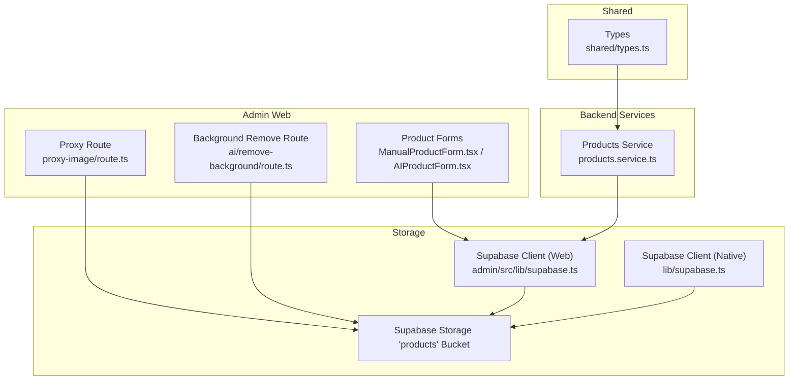
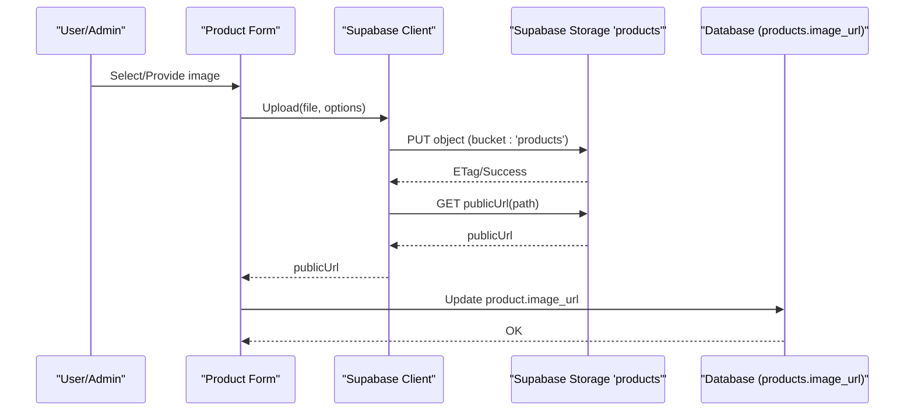
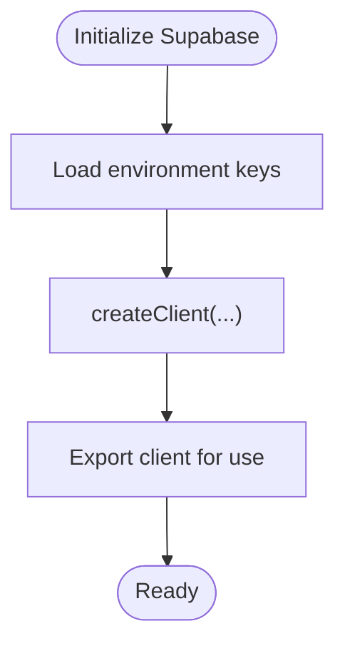
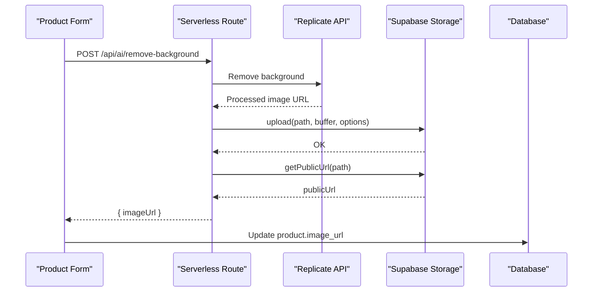
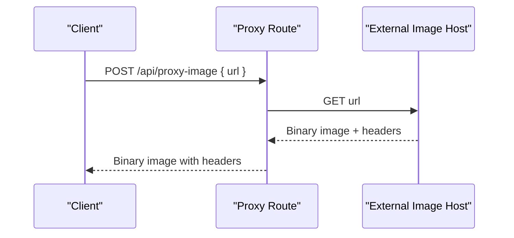
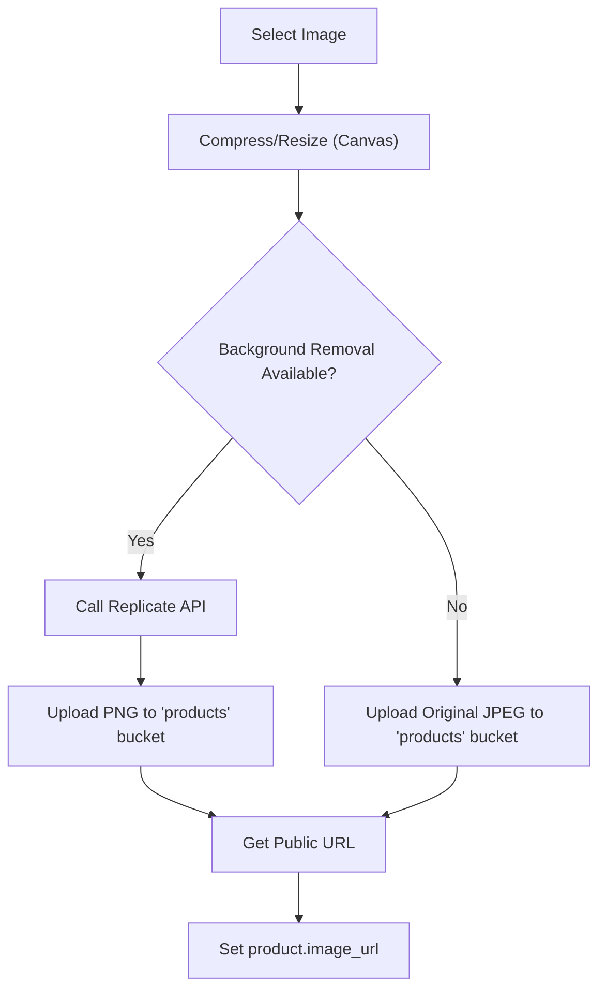
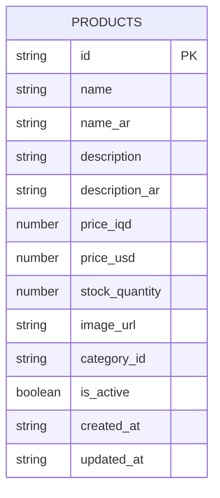
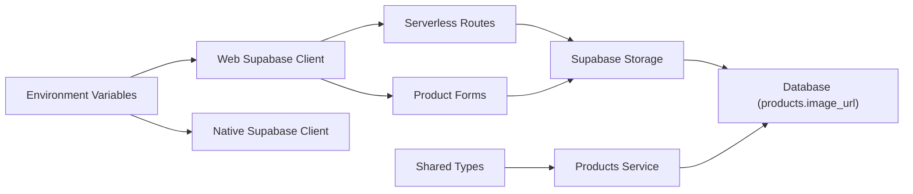

# File Management and Storage

<cite>
**Referenced Files in This Document**
- [supabase.ts](file://lib/supabase.ts)
- [supabase.ts](file://admin/src/lib/supabase.ts)
- [types.ts](file://shared/types.ts)
- [route.ts](file://admin/src/app/api/proxy-image/route.ts)
- [route.ts](file://admin/src/app/api/ai/remove-background/route.ts)
- [AIProductForm.tsx](file://admin/src/components/products/AIProductForm.tsx)
- [ManualProductForm.tsx](file://admin/src/components/products/ManualProductForm.tsx)
- [page.tsx](file://admin/src/app/(dashboard)/products/[id]/page.tsx)
- [products.service.ts](file://services/products.service.ts)
- [AI_PRODUCT_FEATURE.md](file://admin/AI_PRODUCT_FEATURE.md)
- [README.md](file://admin/README.md)
</cite>

## Table of Contents
1. [Introduction](#introduction)
2. [Project Structure](#project-structure)
3. [Core Components](#core-components)
4. [Architecture Overview](#architecture-overview)
5. [Detailed Component Analysis](#detailed-component-analysis)
6. [Dependency Analysis](#dependency-analysis)
7. [Performance Considerations](#performance-considerations)
8. [Troubleshooting Guide](#troubleshooting-guide)
9. [Conclusion](#conclusion)
10. [Appendices](#appendices)

## Introduction
This document explains the file management and storage system built on Supabase Storage for media handling across the platform. It covers the upload pipeline for product images, user uploads, and promotional content; file organization strategies; CDN integration via Supabase; image processing capabilities such as optimization and background removal; a proxy system for secure image access; naming conventions and storage policies; cleanup procedures for orphaned files; and the integration between stored files and database records to ensure data consistency. It also provides troubleshooting guidance and extension guidelines.

## Project Structure
The file management system spans client-side components, serverless routes, and backend services:
- Supabase client initialization for web and native environments
- Product forms that upload images to Supabase Storage
- Serverless routes for proxying external images and removing backgrounds
- Services that query product records and manage lists
- Shared types that define the product model and image_url field

**Diagram sources**
- [supabase.ts:19-23](file://admin/src/lib/supabase.ts#L19-L23)
- [supabase.ts:19-29](file://lib/supabase.ts#L19-L29)
- [types.ts:13-32](file://shared/types.ts#L13-L32)
- [route.ts:1-41](file://admin/src/app/api/proxy-image/route.ts#L1-L41)
- [route.ts:118-141](file://admin/src/app/api/ai/remove-background/route.ts#L118-L141)
- [products.service.ts:18-28](file://services/products.service.ts#L18-L28)

**Section sources**
- [supabase.ts:19-23](file://admin/src/lib/supabase.ts#L19-L23)
- [supabase.ts:19-29](file://lib/supabase.ts#L19-L29)
- [types.ts:13-32](file://shared/types.ts#L13-L32)
- [route.ts:1-41](file://admin/src/app/api/proxy-image/route.ts#L1-L41)
- [route.ts:118-141](file://admin/src/app/api/ai/remove-background/route.ts#L118-L141)
- [products.service.ts:18-28](file://services/products.service.ts#L18-L28)

## Core Components
- Supabase clients:
  - Web client configured with NEXT_PUBLIC environment variables
  - Native client configured with EXPO_PUBLIC environment variables
- Product image upload:
  - Manual form uploads to the 'products' bucket with cache-control headers
  - AI form uploads processed images and falls back to original if background removal fails
- Proxy route:
  - Fetches external images and returns them with appropriate headers for controlled access
- Background removal route:
  - Uses Replicate to remove backgrounds and uploads resulting PNGs to the 'products' bucket
- Products service:
  - Queries product records and uses image_url fields populated by uploads
- Shared types:
  - Define the product model with image_url and related fields

**Section sources**
- [supabase.ts:19-23](file://admin/src/lib/supabase.ts#L19-L23)
- [supabase.ts:19-29](file://lib/supabase.ts#L19-L29)
- [ManualProductForm.tsx:52-82](file://admin/src/components/products/ManualProductForm.tsx#L52-L82)
- [AIProductForm.tsx:152-199](file://admin/src/components/products/AIProductForm.tsx#L152-L199)
- [route.ts:1-41](file://admin/src/app/api/proxy-image/route.ts#L1-L41)
- [route.ts:118-141](file://admin/src/app/api/ai/remove-background/route.ts#L118-L141)
- [products.service.ts:18-28](file://services/products.service.ts#L18-L28)
- [types.ts:13-32](file://shared/types.ts#L13-L32)

## Architecture Overview
The system integrates client-side uploads, serverless processing, and Supabase Storage. Public URLs are generated and stored in the database for efficient delivery.

**Diagram sources**
- [ManualProductForm.tsx:59-72](file://admin/src/components/products/ManualProductForm.tsx#L59-L72)
- [route.ts:126-138](file://admin/src/app/api/ai/remove-background/route.ts#L126-L138)
- [products.service.ts:18-28](file://services/products.service.ts#L18-L28)

## Detailed Component Analysis

### Supabase Clients
- Web client:
  - Initializes Supabase with NEXT_PUBLIC_SUPABASE_URL and NEXT_PUBLIC_SUPABASE_ANON_KEY
  - Used by admin routes and components
- Native client:
  - Initializes Supabase with EXPO_PUBLIC_SUPABASE_URL and EXPO_PUBLIC_SUPABASE_ANON_KEY
  - Used by the mobile app

**Diagram sources**
- [supabase.ts:19-23](file://admin/src/lib/supabase.ts#L19-L23)
- [supabase.ts:19-29](file://lib/supabase.ts#L19-L29)

**Section sources**
- [supabase.ts:19-23](file://admin/src/lib/supabase.ts#L19-L23)
- [supabase.ts:19-29](file://lib/supabase.ts#L19-L29)

### Product Image Upload Pipeline
- Manual upload:
  - Validates file size and extension
  - Generates a unique filename with timestamp and random suffix
  - Uploads to the 'products' bucket with cache-control header
  - Retrieves public URL and updates product record
- AI upload:
  - Attempts background removal via Replicate
  - On success, uploads processed PNG; on failure, uploads original JPEG
  - Sets image_url on the product

**Diagram sources**
- [route.ts:56-89](file://admin/src/app/api/ai/remove-background/route.ts#L56-L89)
- [route.ts:118-141](file://admin/src/app/api/ai/remove-background/route.ts#L118-L141)
- [AIProductForm.tsx:152-199](file://admin/src/components/products/AIProductForm.tsx#L152-L199)

**Section sources**
- [ManualProductForm.tsx:52-82](file://admin/src/components/products/ManualProductForm.tsx#L52-L82)
- [AIProductForm.tsx:152-199](file://admin/src/components/products/AIProductForm.tsx#L152-L199)
- [route.ts:118-141](file://admin/src/app/api/ai/remove-background/route.ts#L118-L141)

### Proxy System for Secure Image Access
- The proxy route fetches external images and returns them with appropriate headers
- It validates presence of URL parameter and checks response status
- Returns binary content with content-type detection and CORS header

**Diagram sources**
- [route.ts:4-41](file://admin/src/app/api/proxy-image/route.ts#L4-L41)

**Section sources**
- [route.ts:1-41](file://admin/src/app/api/proxy-image/route.ts#L1-L41)

### Image Processing Capabilities
- Compression and resizing:
  - Canvas-based compression to a max width with JPEG encoding
  - Base64 conversion for upload
- Background removal:
  - Uses Replicate to produce a transparent-background PNG
  - Falls back to original image if processing fails
- Optimization:
  - Cache-control set to one year for static assets
  - Public URLs served via Supabase Storage CDN

**Diagram sources**
- [AIProductForm.tsx:201-230](file://admin/src/components/products/AIProductForm.tsx#L201-L230)
- [route.ts:56-89](file://admin/src/app/api/ai/remove-background/route.ts#L56-L89)
- [route.ts:118-141](file://admin/src/app/api/ai/remove-background/route.ts#L118-L141)

**Section sources**
- [AIProductForm.tsx:201-230](file://admin/src/components/products/AIProductForm.tsx#L201-L230)
- [route.ts:56-89](file://admin/src/app/api/ai/remove-background/route.ts#L56-L89)
- [route.ts:118-141](file://admin/src/app/api/ai/remove-background/route.ts#L118-L141)

### File Organization Strategies and Naming Conventions
- Bucket: 'products'
- Paths:
  - Manual uploads: 'products/{unique-filename}.{ext}'
  - AI uploads: 'products/{timestamp}-{random}.(png|jpg)'
- Naming:
  - Unique filenames combining timestamp and random suffix to prevent collisions
- Cache-control:
  - Set to one year for long-term caching of static images

**Section sources**
- [ManualProductForm.tsx:60-62](file://admin/src/components/products/ManualProductForm.tsx#L60-L62)
- [page.tsx](file://admin/src/app/(dashboard)/products/[id]/page.tsx#L98-L99)
- [route.ts:123-131](file://admin/src/app/api/ai/remove-background/route.ts#L123-L131)

### CDN Integration for Optimal Delivery
- Public URLs are retrieved from Supabase Storage and stored in the database
- Long cache-control headers enable efficient browser and edge caching
- CDN benefits from Supabase Storage’s global distribution

**Section sources**
- [ManualProductForm.tsx:70-72](file://admin/src/components/products/ManualProductForm.tsx#L70-L72)
- [route.ts:136-138](file://admin/src/app/api/ai/remove-background/route.ts#L136-L138)

### Integration Between Files and Database Records
- Product model includes image_url field
- Upload flows populate image_url in the products table
- Services query product lists and details using image_url for display

**Diagram sources**
- [types.ts:13-32](file://shared/types.ts#L13-L32)

**Section sources**
- [types.ts:13-32](file://shared/types.ts#L13-L32)
- [products.service.ts:18-28](file://services/products.service.ts#L18-L28)

### Cleanup Procedures for Orphaned Files
- Recommended practices:
  - Maintain referential integrity by updating/deleting product records before removing files
  - Implement periodic audits to compare stored files against product records
  - Use Supabase Storage admin tools to inspect bucket contents and remove unused objects
  - Enforce RLS policies to restrict access and prevent unauthorized deletions
- Operational note:
  - The AI feature documentation mentions RLS policies protect images and that temporary files are not stored

**Section sources**
- [AI_PRODUCT_FEATURE.md:137-145](file://admin/AI_PRODUCT_FEATURE.md#L137-L145)

## Dependency Analysis
- Clients depend on environment variables for Supabase URL and anon key
- Routes depend on Supabase client and external APIs (Replicate)
- Forms depend on Supabase client and UI state
- Services depend on Supabase client and shared types

**Diagram sources**
- [supabase.ts:19-23](file://admin/src/lib/supabase.ts#L19-L23)
- [supabase.ts:19-29](file://lib/supabase.ts#L19-L29)
- [ManualProductForm.tsx:59-72](file://admin/src/components/products/ManualProductForm.tsx#L59-L72)
- [route.ts:126-138](file://admin/src/app/api/ai/remove-background/route.ts#L126-L138)
- [products.service.ts:18-28](file://services/products.service.ts#L18-L28)
- [types.ts:13-32](file://shared/types.ts#L13-L32)

**Section sources**
- [supabase.ts:19-23](file://admin/src/lib/supabase.ts#L19-L23)
- [supabase.ts:19-29](file://lib/supabase.ts#L19-L29)
- [ManualProductForm.tsx:59-72](file://admin/src/components/products/ManualProductForm.tsx#L59-L72)
- [route.ts:126-138](file://admin/src/app/api/ai/remove-background/route.ts#L126-L138)
- [products.service.ts:18-28](file://services/products.service.ts#L18-L28)
- [types.ts:13-32](file://shared/types.ts#L13-L32)

## Performance Considerations
- Image optimization:
  - Compress images before upload to reduce bandwidth and storage costs
  - Use appropriate formats (PNG for transparency, JPEG otherwise)
- CDN caching:
  - Long cache-control improves load times and reduces origin requests
- Request patterns:
  - Batch operations where possible
  - Avoid unnecessary re-uploads by checking existing image_url

[No sources needed since this section provides general guidance]

## Troubleshooting Guide
- Upload fails:
  - Verify environment variables for Supabase URL and anon key
  - Check file size limits and supported types
  - Inspect server logs for Supabase errors
- Background removal errors:
  - Confirm Replicate API token is configured
  - Validate external image URLs and network connectivity
- Proxy route errors:
  - Ensure the proxy receives a valid URL parameter
  - Check response status and content-type detection
- Storage quotas and cleanup:
  - Monitor bucket usage and remove orphaned files
  - Maintain referential integrity between records and files

**Section sources**
- [README.md:218-225](file://admin/README.md#L218-L225)
- [route.ts:8-22](file://admin/src/app/api/proxy-image/route.ts#L8-L22)
- [route.ts:86-89](file://admin/src/app/api/ai/remove-background/route.ts#L86-L89)
- [AI_PRODUCT_FEATURE.md:147-163](file://admin/AI_PRODUCT_FEATURE.md#L147-L163)

## Conclusion
The file management system leverages Supabase Storage for secure, scalable media handling. It supports multiple upload paths, integrates with CDN for fast delivery, and maintains data consistency by storing public URLs in the database. With clear naming conventions, cache-control strategies, and robust error handling, the system provides a reliable foundation for product images, user uploads, and promotional content.

[No sources needed since this section summarizes without analyzing specific files]

## Appendices

### Environment Variables
- NEXT_PUBLIC_SUPABASE_URL and NEXT_PUBLIC_SUPABASE_ANON_KEY for the admin app
- EXPO_PUBLIC_SUPABASE_URL and EXPO_PUBLIC_SUPABASE_ANON_KEY for the mobile app
- OPENROUTER_API_KEY and REPLICATE_API_TOKEN for AI features

**Section sources**
- [README.md:202-225](file://admin/README.md#L202-L225)