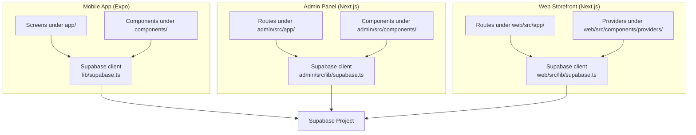

# Getting Started

<cite>
**Referenced Files in This Document**
- [package.json](file://package.json)
- [app.config.ts](file://app.config.ts)
- [lib/supabase.ts](file://lib/supabase.ts)
- [admin/package.json](file://admin/package.json)
- [admin/src/lib/supabase.ts](file://admin/src/lib/supabase.ts)
- [admin/README.md](file://admin/README.md)
- [web/package.json](file://web/package.json)
- [web/README.md](file://web/README.md)
- [metro.config.js](file://metro.config.js)
- [tsconfig.json](file://tsconfig.json)
- [admin/tsconfig.json](file://admin/tsconfig.json)
- [web/tsconfig.json](file://web/tsconfig.json)
- [eas.json](file://eas.json)
- [App.tsx](file://App.tsx)
</cite>

## Table of Contents
1. [Introduction](#introduction)
2. [Prerequisites](#prerequisites)
3. [Environment Setup](#environment-setup)
4. [Project Structure Walkthrough](#project-structure-walkthrough)
5. [Running Locally](#running-locally)
6. [Build Processes](#build-processes)
7. [Environment Variables](#environment-variables)
8. [Development Workflows](#development-workflows)
9. [Architecture Overview](#architecture-overview)
10. [Troubleshooting Guide](#troubleshooting-guide)
11. [Contribution Guidelines](#contribution-guidelines)
12. [Verification Checklist](#verification-checklist)
13. [Conclusion](#conclusion)

## Introduction
This guide helps you set up the Al-Amal Center development environment and run all three applications: the mobile storefront (Expo), the web storefront (Next.js), and the admin panel (Next.js). It covers prerequisites, environment configuration, local execution, builds, workflows, troubleshooting, and verification steps.

## Prerequisites
- Node.js and npm: Install a stable LTS version compatible with the project’s engines.
- Expo CLI or the Expo application on your device/emulator for mobile development.
- Git for version control.
- Basic understanding of:
  - React and React Native fundamentals
  - TypeScript basics
  - Supabase concepts (authentication, database, storage, Realtime)

## Environment Setup
Follow these steps to prepare your machine and install dependencies.

- Install dependencies for the root project:
  - From the repository root, run: [package.json:6-11](file://package.json#L6-L11)
- Install dependencies for the admin panel:
  - Change to the admin directory and run: [admin/package.json:5-10](file://admin/package.json#L5-L10)
- Install dependencies for the web storefront:
  - Change to the web directory and run: [web/package.json:5-10](file://web/package.json#L5-L10)

Notes:
- The root project uses Expo and React Native. See [package.json:12-56](file://package.json#L12-L56) for core dependencies.
- The admin panel uses Next.js and Supabase SSR client. See [admin/package.json:11-26](file://admin/package.json#L11-L26).
- The web storefront mirrors the admin’s Supabase integration. See [web/package.json:11-25](file://web/package.json#L11-L25).

**Section sources**
- [package.json:6-11](file://package.json#L6-L11)
- [admin/package.json:5-10](file://admin/package.json#L5-L10)
- [web/package.json:5-10](file://web/package.json#L5-L10)

## Project Structure Walkthrough
The repository contains three primary applications sharing a common Supabase backend:

- Root mobile application (Expo + React Native):
  - Screens and layouts under [app/](file://app/)
  - Shared components under [components/](file://components/)
  - Hooks and services under [hooks/](file://hooks/) and [services/](file://services/)
  - Supabase client under [lib/supabase.ts](file://lib/supabase.ts)
  - Types under [shared/types.ts](file://shared/types.ts) and [types/](file://types/)
- Admin panel (Next.js):
  - Routes and pages under [admin/src/app/](file://admin/src/app/)
  - Components under [admin/src/components/](file://admin/src/components/)
  - Supabase client under [admin/src/lib/supabase.ts](file://admin/src/lib/supabase.ts)
- Web storefront (Next.js):
  - Routes and pages under [web/src/app/](file://web/src/app/)
  - Providers and utilities under [web/src/components/providers/](file://web/src/components/providers/)
  - Supabase client under [web/src/lib/supabase.ts](file://web/src/lib/supabase.ts)

Configuration highlights:
- Metro bundler configuration for native styling: [metro.config.js:1-8](file://metro.config.js#L1-L8)
- Root TypeScript configuration: [tsconfig.json:1-13](file://tsconfig.json#L1-L13)
- Admin TypeScript configuration: [admin/tsconfig.json:1-45](file://admin/tsconfig.json#L1-L45)
- Web TypeScript configuration: [web/tsconfig.json:1-44](file://web/tsconfig.json#L1-L44)

**Section sources**
- [lib/supabase.ts:1-30](file://lib/supabase.ts#L1-L30)
- [admin/src/lib/supabase.ts:1-24](file://admin/src/lib/supabase.ts#L1-L24)
- [metro.config.js:1-8](file://metro.config.js#L1-L8)
- [tsconfig.json:1-13](file://tsconfig.json#L1-L13)
- [admin/tsconfig.json:1-45](file://admin/tsconfig.json#L1-L45)
- [web/tsconfig.json:1-44](file://web/tsconfig.json#L1-L44)

## Running Locally
Start each application according to the following commands:

- Mobile app (Expo):
  - From the repository root:
    - Start development server: [package.json:7-10](file://package.json#L7-L10)
    - Run on Android: [package.json:8](file://package.json#L8)
    - Run on iOS: [package.json:9](file://package.json#L9)
    - Run on Web: [package.json:10](file://package.json#L10)
  - Platform-specific permissions and metadata are configured in [app.config.ts:19-38](file://app.config.ts#L19-L38).

- Admin panel (Next.js):
  - From the repository root:
    - Development: [admin/package.json:6](file://admin/package.json#L6)
    - Production build and start: [admin/package.json:7-8](file://admin/package.json#L7-L8)

- Web storefront (Next.js):
  - From the repository root:
    - Development: [web/package.json:6](file://web/package.json#L6)
    - Production build and start: [web/package.json:7-8](file://web/package.json#L7-L8)

Entry point for the root app:
- [App.tsx:1-21](file://App.tsx#L1-L21)

**Section sources**
- [package.json:7-10](file://package.json#L7-L10)
- [admin/package.json:6-8](file://admin/package.json#L6-L8)
- [web/package.json:6-8](file://web/package.json#L6-L8)
- [app.config.ts:19-38](file://app.config.ts#L19-L38)
- [App.tsx:1-21](file://App.tsx#L1-L21)

## Build Processes
- Root project (Expo):
  - EAS build configuration is defined in [eas.json:1-32](file://eas.json#L1-L32).
  - App metadata and environment exposure are defined in [app.config.ts:58-72](file://app.config.ts#L58-L72).

- Admin panel (Next.js):
  - Uses Next.js build pipeline. Scripts defined in [admin/package.json:5-10](file://admin/package.json#L5-L10).

- Web storefront (Next.js):
  - Uses Next.js build pipeline. Scripts defined in [web/package.json:5-10](file://web/package.json#L5-L10).

**Section sources**
- [eas.json:1-32](file://eas.json#L1-L32)
- [app.config.ts:58-72](file://app.config.ts#L58-L72)
- [admin/package.json:5-10](file://admin/package.json#L5-L10)
- [web/package.json:5-10](file://web/package.json#L5-L10)

## Environment Variables
Configure environment variables per application. The admin README documents the variables and their usage.

- Mobile app (root):
  - Variables exposed via [app.config.ts:58-67](file://app.config.ts#L58-L67) and consumed in [lib/supabase.ts:19-20](file://lib/supabase.ts#L19-L20).
  - Example variables include app name, version, Supabase URL and anon key, default currency, feature flags, and debug mode.

- Admin panel:
  - Variables documented in [admin/README.md:218-226](file://admin/README.md#L218-L226).
  - Supabase URL and anon key are used in [admin/src/lib/supabase.ts:20-21](file://admin/src/lib/supabase.ts#L20-L21).
  - AI service keys (OpenRouter and Replicate) are used in admin API routes.

- Web storefront:
  - Follow the setup steps in [web/README.md:7-8](file://web/README.md#L7-L8) to configure Supabase variables.

Notes:
- The mobile app reads environment variables from the Expo configuration and exposes them to the runtime.
- The admin panel reads variables from its own environment configuration.
- The web storefront mirrors the admin’s Supabase configuration.

**Section sources**
- [app.config.ts:58-67](file://app.config.ts#L58-L67)
- [lib/supabase.ts:19-20](file://lib/supabase.ts#L19-L20)
- [admin/README.md:218-226](file://admin/README.md#L218-L226)
- [admin/src/lib/supabase.ts:20-21](file://admin/src/lib/supabase.ts#L20-L21)
- [web/README.md:7-8](file://web/README.md#L7-L8)

## Development Workflows
Recommended daily workflows:

- Mobile development:
  - Start Expo server and open the app in Expo Go or a simulator: [package.json:7](file://package.json#L7)
  - Iterate on screens under [app/](file://app/) and components under [components/](file://components/).
  - Use the Supabase client from [lib/supabase.ts](file://lib/supabase.ts) for auth and data.

- Admin panel development:
  - Run the Next.js dev server: [admin/package.json:6](file://admin/package.json#L6)
  - Modify routes under [admin/src/app/](file://admin/src/app/) and components under [admin/src/components/](file://admin/src/components/).
  - Integrate with AI APIs via admin API routes.

- Web storefront development:
  - Run the Next.js dev server: [web/package.json:6](file://web/package.json#L6)
  - Iterate on pages under [web/src/app/](file://web/src/app/) and providers under [web/src/components/providers/](file://web/src/components/providers/).

**Section sources**
- [package.json:7](file://package.json#L7)
- [admin/package.json:6](file://admin/package.json#L6)
- [web/package.json:6](file://web/package.json#L6)

## Architecture Overview
High-level architecture showing the three applications and their shared Supabase backend.

**Diagram sources**
- [lib/supabase.ts:1-30](file://lib/supabase.ts#L1-L30)
- [admin/src/lib/supabase.ts:1-24](file://admin/src/lib/supabase.ts#L1-L24)
- [web/src/lib/supabase.ts](file://web/src/lib/supabase.ts)

## Troubleshooting Guide
Common setup and runtime issues:

- Missing environment variables:
  - Mobile app requires Supabase URL and anon key. Verify [app.config.ts:58-67](file://app.config.ts#L58-L67) and [lib/supabase.ts:19-20](file://lib/supabase.ts#L19-L20).
  - Admin panel requires Supabase URL/anon key and AI keys. See [admin/README.md:218-226](file://admin/README.md#L218-L226) and [admin/src/lib/supabase.ts:20-21](file://admin/src/lib/supabase.ts#L20-L21).
  - Web storefront requires Supabase URL/anon key. See [web/README.md:7-8](file://web/README.md#L7-L8).

- Metro bundling issues:
  - Ensure Metro is configured with NativeWind as in [metro.config.js:1-8](file://metro.config.js#L1-L8).

- TypeScript errors:
  - Confirm compiler options match the project’s tsconfigs:
    - Root: [tsconfig.json:1-13](file://tsconfig.json#L1-L13)
    - Admin: [admin/tsconfig.json:1-45](file://admin/tsconfig.json#L1-L45)
    - Web: [web/tsconfig.json:1-44](file://web/tsconfig.json#L1-L44)

- EAS build failures:
  - Review build configuration in [eas.json:1-32](file://eas.json#L1-L32) and ensure environment variables are present during build.

- Expo Go not connecting:
  - Start the development server and scan the QR code from [package.json:7](file://package.json#L7).

**Section sources**
- [app.config.ts:58-67](file://app.config.ts#L58-L67)
- [lib/supabase.ts:19-20](file://lib/supabase.ts#L19-L20)
- [admin/README.md:218-226](file://admin/README.md#L218-L226)
- [admin/src/lib/supabase.ts:20-21](file://admin/src/lib/supabase.ts#L20-L21)
- [web/README.md:7-8](file://web/README.md#L7-L8)
- [metro.config.js:1-8](file://metro.config.js#L1-L8)
- [tsconfig.json:1-13](file://tsconfig.json#L1-L13)
- [admin/tsconfig.json:1-45](file://admin/tsconfig.json#L1-L45)
- [web/tsconfig.json:1-44](file://web/tsconfig.json#L1-L44)
- [eas.json:1-32](file://eas.json#L1-L32)
- [package.json:7](file://package.json#L7)

## Contribution Guidelines
First-time contributor tips:

- Branching and commits:
  - Create feature branches from the default branch.
  - Keep commits focused and include clear messages.

- Code style:
  - Follow ESLint and TypeScript configurations for each app.
  - Admin and web apps use Next.js ESLint configs; see [admin/package.json:33](file://admin/package.json#L33) and [web/package.json:32](file://web/package.json#L32).

- Pull requests:
  - Include screenshots or short videos for UI changes.
  - Link related issues and update docs if needed.

- Testing:
  - Test on both mobile and web where applicable.
  - Verify Supabase connectivity and environment variables are configured locally.

## Verification Checklist
After setup, verify your installation:

- Mobile app:
  - Start the development server and confirm the app opens in Expo Go: [package.json:7](file://package.json#L7)
  - Confirm Supabase client initialization: [lib/supabase.ts:19-20](file://lib/supabase.ts#L19-L20)

- Admin panel:
  - Run the dev server and navigate to the dashboard: [admin/package.json:6](file://admin/package.json#L6)
  - Confirm Supabase client initialization: [admin/src/lib/supabase.ts:20-21](file://admin/src/lib/supabase.ts#L20-L21)

- Web storefront:
  - Run the dev server and browse pages: [web/package.json:6](file://web/package.json#L6)
  - Confirm Supabase client initialization and environment variables: [web/README.md:7-8](file://web/README.md#L7-L8)

- Build verification:
  - Build and preview artifacts using EAS configuration: [eas.json:1-32](file://eas.json#L1-L32)

**Section sources**
- [package.json:7](file://package.json#L7)
- [lib/supabase.ts:19-20](file://lib/supabase.ts#L19-L20)
- [admin/package.json:6](file://admin/package.json#L6)
- [admin/src/lib/supabase.ts:20-21](file://admin/src/lib/supabase.ts#L20-L21)
- [web/package.json:6](file://web/package.json#L6)
- [web/README.md:7-8](file://web/README.md#L7-L8)
- [eas.json:1-32](file://eas.json#L1-L32)

## Conclusion
You now have the essentials to run the mobile storefront, admin panel, and web storefront locally, configure environment variables, and follow recommended workflows. Use the verification checklist to ensure everything is set up correctly, and consult the troubleshooting section if you encounter issues.