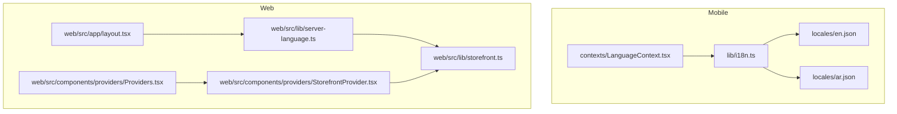
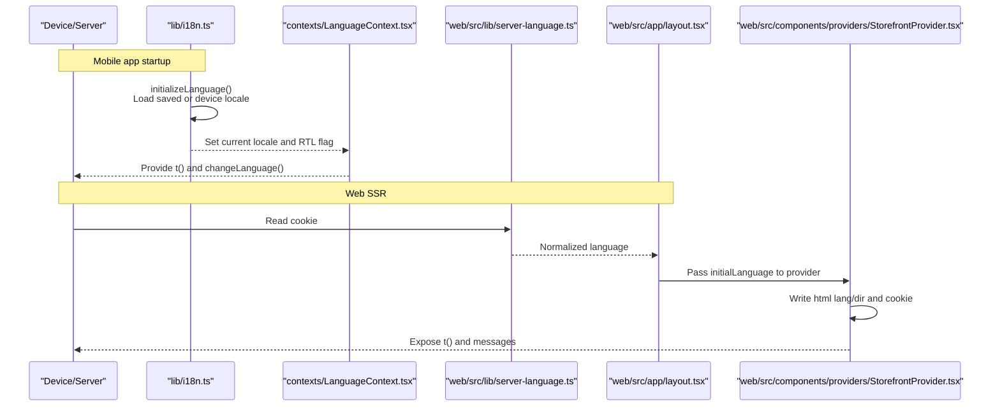
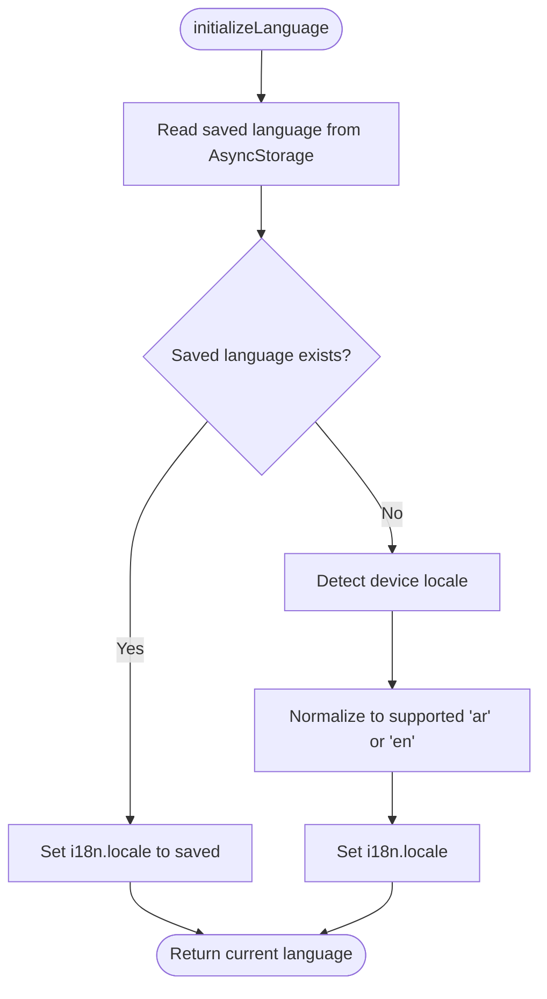
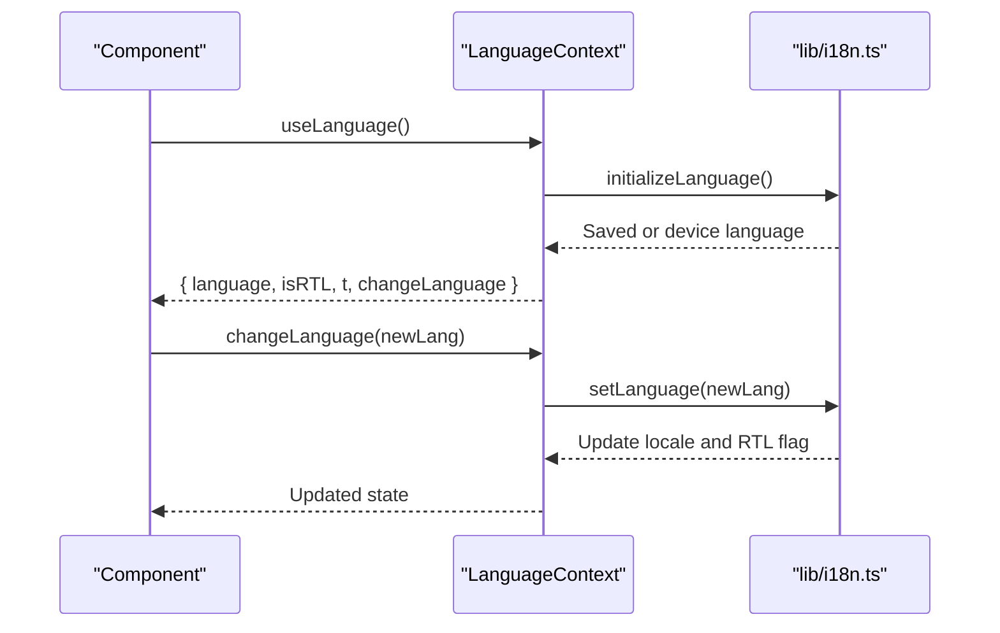
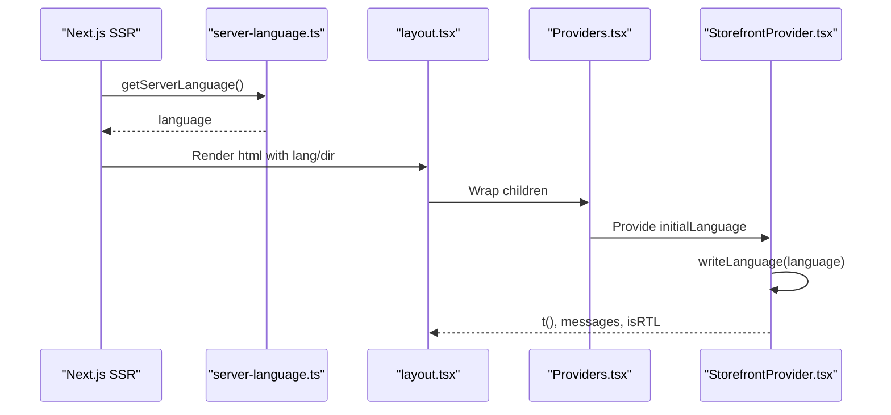
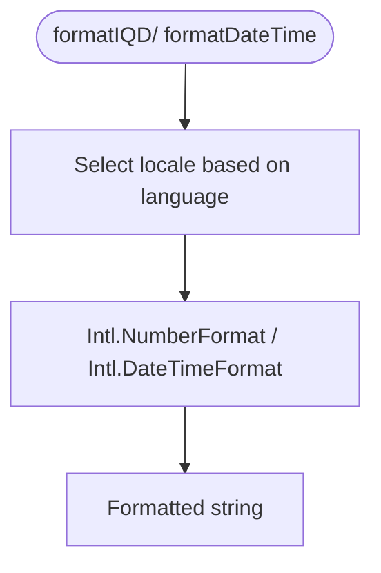
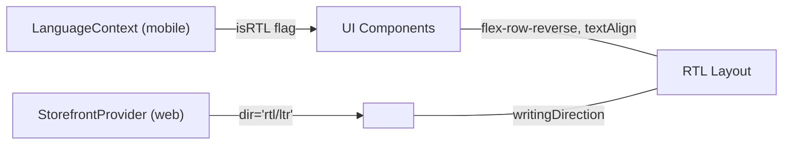
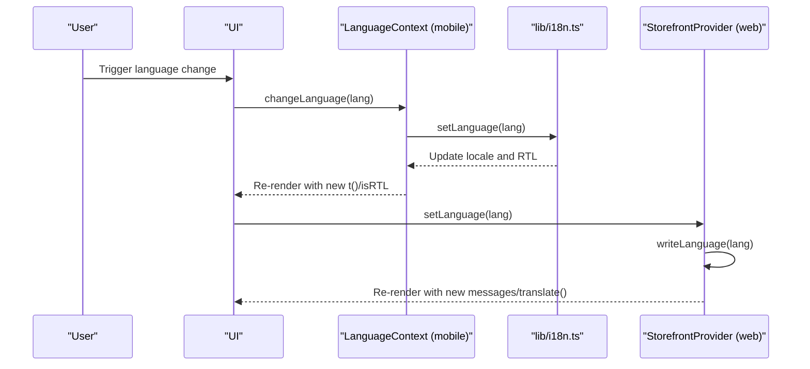
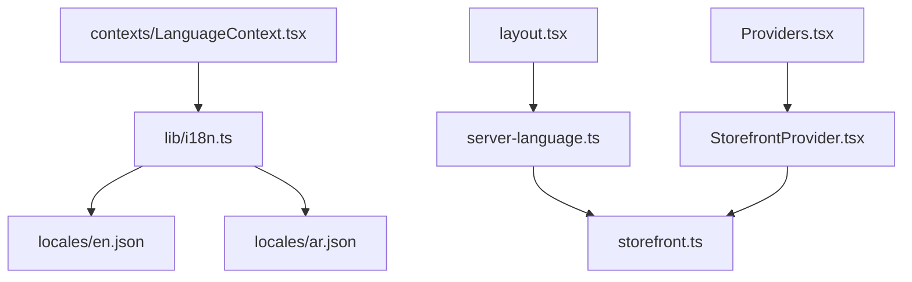

# Internationalization and Localization

<cite>
**Referenced Files in This Document**
- [lib/i18n.ts](file://lib/i18n.ts)
- [contexts/LanguageContext.tsx](file://contexts/LanguageContext.tsx)
- [locales/en.json](file://locales/en.json)
- [locales/ar.json](file://locales/ar.json)
- [web/src/lib/server-language.ts](file://web/src/lib/server-language.ts)
- [web/src/lib/storefront.ts](file://web/src/lib/storefront.ts)
- [web/src/app/layout.tsx](file://web/src/app/layout.tsx)
- [web/src/components/providers/Providers.tsx](file://web/src/components/providers/Providers.tsx)
- [web/src/components/providers/StorefrontProvider.tsx](file://web/src/components/providers/StorefrontProvider.tsx)
- [components/ui/MainHeader.tsx](file://components/ui/MainHeader.tsx)
- [components/ui/ProductCard.tsx](file://components/ui/ProductCard.tsx)
- [components/auth/AuthUI.tsx](file://components/auth/AuthUI.tsx)
- [components/ui/CountdownTimer.tsx](file://components/ui/CountdownTimer.tsx)
- [admin/src/lib/utils.ts](file://admin/src/lib/utils.ts)
</cite>

## Table of Contents
1. [Introduction](#introduction)
2. [Project Structure](#project-structure)
3. [Core Components](#core-components)
4. [Architecture Overview](#architecture-overview)
5. [Detailed Component Analysis](#detailed-component-analysis)
6. [Dependency Analysis](#dependency-analysis)
7. [Performance Considerations](#performance-considerations)
8. [Troubleshooting Guide](#troubleshooting-guide)
9. [Conclusion](#conclusion)
10. [Appendices](#appendices)

## Introduction
This document explains the internationalization and localization system for the project, focusing on bidirectional language support for Arabic (Right-to-Left) and English (Left-to-Right). It covers dynamic language switching, automatic locale detection, translation key management, date/time formatting, and RTL layout adaptation. It also outlines the content localization strategy for product descriptions, UI text, and marketing materials, along with technical implementation details for i18n-js integration, context providers, and automatic language detection. Finally, it provides guidelines for adding new languages, managing translation keys, and maintaining consistency across platforms, plus troubleshooting guidance and best practices.

## Project Structure
The i18n system spans three main areas:
- Mobile/native implementation using i18n-js and React Native’s I18nManager for RTL.
- Web implementation using Next.js with server-side language detection via cookies and client-side providers.
- Shared translation resources in JSON files and TypeScript utilities for formatting and content selection.

**Diagram sources**
- [lib/i18n.ts:1-81](file://lib/i18n.ts#L1-L81)
- [contexts/LanguageContext.tsx:1-84](file://contexts/LanguageContext.tsx#L1-L84)
- [locales/en.json:1-413](file://locales/en.json#L1-L413)
- [locales/ar.json:1-413](file://locales/ar.json#L1-L413)
- [web/src/lib/server-language.ts:1-9](file://web/src/lib/server-language.ts#L1-L9)
- [web/src/lib/storefront.ts:1-613](file://web/src/lib/storefront.ts#L1-L613)
- [web/src/app/layout.tsx:1-61](file://web/src/app/layout.tsx#L1-L61)
- [web/src/components/providers/Providers.tsx:1-32](file://web/src/components/providers/Providers.tsx#L1-L32)
- [web/src/components/providers/StorefrontProvider.tsx:1-88](file://web/src/components/providers/StorefrontProvider.tsx#L1-L88)

**Section sources**
- [lib/i18n.ts:1-81](file://lib/i18n.ts#L1-L81)
- [contexts/LanguageContext.tsx:1-84](file://contexts/LanguageContext.tsx#L1-L84)
- [locales/en.json:1-413](file://locales/en.json#L1-L413)
- [locales/ar.json:1-413](file://locales/ar.json#L1-L413)
- [web/src/lib/server-language.ts:1-9](file://web/src/lib/server-language.ts#L1-L9)
- [web/src/lib/storefront.ts:1-613](file://web/src/lib/storefront.ts#L1-L613)
- [web/src/app/layout.tsx:1-61](file://web/src/app/layout.tsx#L1-L61)
- [web/src/components/providers/Providers.tsx:1-32](file://web/src/components/providers/Providers.tsx#L1-L32)
- [web/src/components/providers/StorefrontProvider.tsx:1-88](file://web/src/components/providers/StorefrontProvider.tsx#L1-L88)

## Core Components
- Mobile i18n engine and language lifecycle:
  - i18n initialization, default locale, fallback, and persistence using AsyncStorage.
  - Dynamic language switching with RTL toggling via I18nManager.
  - Translation function wrapper and helpers for current language and RTL detection.
- Mobile language context:
  - Provider loads persisted or device language, exposes t(), changeLanguage(), and RTL flag.
- Web server-side language detection:
  - Reads language from cookie and normalizes to supported values.
- Web client-side storefront provider:
  - Manages language state, writes HTML lang/dir attributes, and exposes translation utilities.
- Shared translation resources:
  - English and Arabic JSON files organized by feature domains (common, home, product, cart, etc.).
- Formatting utilities:
  - Currency formatting (IQD) and date/time formatting using Intl with locale-aware options.
- Content selection helpers:
  - Product, category, and address name selection based on language preference.

**Section sources**
- [lib/i18n.ts:1-81](file://lib/i18n.ts#L1-L81)
- [contexts/LanguageContext.tsx:1-84](file://contexts/LanguageContext.tsx#L1-L84)
- [web/src/lib/server-language.ts:1-9](file://web/src/lib/server-language.ts#L1-L9)
- [web/src/lib/storefront.ts:442-613](file://web/src/lib/storefront.ts#L442-L613)
- [locales/en.json:1-413](file://locales/en.json#L1-L413)
- [locales/ar.json:1-413](file://locales/ar.json#L1-L413)

## Architecture Overview
The system separates concerns between mobile and web while sharing translation resources and formatting logic.

**Diagram sources**
- [lib/i18n.ts:24-43](file://lib/i18n.ts#L24-L43)
- [contexts/LanguageContext.tsx:26-51](file://contexts/LanguageContext.tsx#L26-L51)
- [web/src/lib/server-language.ts:5-8](file://web/src/lib/server-language.ts#L5-L8)
- [web/src/app/layout.tsx:32-42](file://web/src/app/layout.tsx#L32-L42)
- [web/src/components/providers/StorefrontProvider.tsx:47-71](file://web/src/components/providers/StorefrontProvider.tsx#L47-L71)

## Detailed Component Analysis

### Mobile i18n Engine (lib/i18n.ts)
- Initializes i18n-js with English and Arabic dictionaries.
- Sets default locale and enables fallback.
- Persists language preference in AsyncStorage and reads it on startup.
- Detects device locale and falls back to supported locales.
- Exposes helpers to check RTL, set language, and translate keys.
- Uses I18nManager.allowRTL to adapt layout direction without restarting the app.

**Diagram sources**
- [lib/i18n.ts:24-43](file://lib/i18n.ts#L24-L43)

**Section sources**
- [lib/i18n.ts:1-81](file://lib/i18n.ts#L1-L81)

### Mobile Language Context (contexts/LanguageContext.tsx)
- Loads language during mount using initializeLanguage().
- Provides t() wrapper and changeLanguage() that delegates to i18n.setLanguage().
- Tracks isRTL based on current language.
- Supplies default values if used outside provider.

**Diagram sources**
- [contexts/LanguageContext.tsx:26-51](file://contexts/LanguageContext.tsx#L26-L51)
- [lib/i18n.ts:56-72](file://lib/i18n.ts#L56-L72)

**Section sources**
- [contexts/LanguageContext.tsx:1-84](file://contexts/LanguageContext.tsx#L1-L84)
- [lib/i18n.ts:46-72](file://lib/i18n.ts#L46-L72)

### Web Server-Language Detection (web/src/lib/server-language.ts)
- Reads the language cookie and normalizes it to a supported value.

**Section sources**
- [web/src/lib/server-language.ts:1-9](file://web/src/lib/server-language.ts#L1-L9)

### Web Layout and Providers (web/src/app/layout.tsx, web/src/components/providers/Providers.tsx, web/src/components/providers/StorefrontProvider.tsx)
- Root layout fetches initial language from server and passes it to providers.
- StorefrontProvider sets html lang and dir attributes, writes cookie/localStorage, and exposes translation messages and helpers.
- Providers composes theme and session providers around the storefront provider.

**Diagram sources**
- [web/src/lib/server-language.ts:5-8](file://web/src/lib/server-language.ts#L5-L8)
- [web/src/app/layout.tsx:32-42](file://web/src/app/layout.tsx#L32-L42)
- [web/src/components/providers/Providers.tsx:17-29](file://web/src/components/providers/Providers.tsx#L17-L29)
- [web/src/components/providers/StorefrontProvider.tsx:36-41](file://web/src/components/providers/StorefrontProvider.tsx#L36-L41)

**Section sources**
- [web/src/app/layout.tsx:1-61](file://web/src/app/layout.tsx#L1-L61)
- [web/src/components/providers/Providers.tsx:1-32](file://web/src/components/providers/Providers.tsx#L1-L32)
- [web/src/components/providers/StorefrontProvider.tsx:1-88](file://web/src/components/providers/StorefrontProvider.tsx#L1-L88)

### Translation Resources (locales/en.json, locales/ar.json)
- Organized by domain (common, home, product, cart, auth, checkout, orders, addresses, notifications, category, privacy, terms, wishlist).
- Keys are dot-separated paths (e.g., common.searchPlaceholder).
- Both languages include the same hierarchy for consistency.

**Section sources**
- [locales/en.json:1-413](file://locales/en.json#L1-L413)
- [locales/ar.json:1-413](file://locales/ar.json#L1-L413)

### Formatting Utilities (web/src/lib/storefront.ts)
- formatIQD(amount, language): Formats IQD currency using Intl.NumberFormat with ar-IQ or en-US locale.
- formatDateTime(value, language, options?): Formats dates/times using Intl.DateTimeFormat with medium/dateStyle and short/timeStyle.
- getProductName/product description/category name selectors: Choose localized strings based on language.
- getAddressTypeLabel/getPaymentMethodLabel/getOrderStatusLabel: Provide localized labels for enums.

**Diagram sources**
- [web/src/lib/storefront.ts:527-547](file://web/src/lib/storefront.ts#L527-L547)

**Section sources**
- [web/src/lib/storefront.ts:527-612](file://web/src/lib/storefront.ts#L527-L612)

### Content Localization Strategy
- Product names and descriptions:
  - Use language-aware getters to select localized fields (e.g., name_ar, description_ar).
- UI text:
  - Use translation keys from locales JSON files via t() in mobile and translate() in web.
- Marketing materials and banners:
  - Use storefront messages for navigation, hero copy, and promotional text, switching based on language.

**Section sources**
- [web/src/lib/storefront.ts:549-572](file://web/src/lib/storefront.ts#L549-L572)
- [components/ui/MainHeader.tsx:36-41](file://components/ui/MainHeader.tsx#L36-L41)
- [components/ui/ProductCard.tsx:69-78](file://components/ui/ProductCard.tsx#L69-L78)

### RTL Layout Adaptation
- Mobile:
  - I18nManager.allowRTL controls direction without app restart.
  - Components adapt via isRTL flag (e.g., flex-row-reverse, textAlign, writingDirection).
- Web:
  - html lang and dir attributes are set server-side and updated client-side.
  - Tailwind utilities and inline styles reflect directionality.

**Diagram sources**
- [contexts/LanguageContext.tsx:27-47](file://contexts/LanguageContext.tsx#L27-L47)
- [lib/i18n.ts:50-53](file://lib/i18n.ts#L50-L53)
- [web/src/components/providers/StorefrontProvider.tsx:36-41](file://web/src/components/providers/StorefrontProvider.tsx#L36-L41)
- [web/src/app/layout.tsx:39-42](file://web/src/app/layout.tsx#L39-L42)

**Section sources**
- [lib/i18n.ts:50-72](file://lib/i18n.ts#L50-L72)
- [contexts/LanguageContext.tsx:27-47](file://contexts/LanguageContext.tsx#L27-L47)
- [web/src/components/providers/StorefrontProvider.tsx:36-41](file://web/src/components/providers/StorefrontProvider.tsx#L36-L41)
- [web/src/app/layout.tsx:39-42](file://web/src/app/layout.tsx#L39-L42)

### Dynamic Language Switching Mechanism
- Mobile:
  - changeLanguage() persists new language and toggles RTL via I18nManager.
  - Components re-render with updated t() and isRTL.
- Web:
  - StorefrontProvider.setLanguage() updates html lang/dir and cookie/localStorage.
  - Messages and translate() reflect the new language.

**Diagram sources**
- [contexts/LanguageContext.tsx:41-51](file://contexts/LanguageContext.tsx#L41-L51)
- [lib/i18n.ts:56-72](file://lib/i18n.ts#L56-L72)
- [web/src/components/providers/StorefrontProvider.tsx:54-71](file://web/src/components/providers/StorefrontProvider.tsx#L54-L71)

**Section sources**
- [contexts/LanguageContext.tsx:41-51](file://contexts/LanguageContext.tsx#L41-L51)
- [lib/i18n.ts:56-72](file://lib/i18n.ts#L56-L72)
- [web/src/components/providers/StorefrontProvider.tsx:54-71](file://web/src/components/providers/StorefrontProvider.tsx#L54-L71)

### Locale Detection Based on User Preferences
- Mobile:
  - initializeLanguage() checks AsyncStorage first; if absent, detects device locale and normalizes to supported values.
- Web:
  - getServerLanguage() reads cookie and normalizes to supported language.

**Section sources**
- [lib/i18n.ts:24-43](file://lib/i18n.ts#L24-L43)
- [web/src/lib/server-language.ts:5-8](file://web/src/lib/server-language.ts#L5-L8)

### Translation Key Management
- Keys are organized hierarchically under domains (common, home, product, cart, auth, etc.).
- Mobile uses dot-separated keys passed to t().
- Web uses dot-separated keys passed to translate().

**Section sources**
- [locales/en.json:1-413](file://locales/en.json#L1-L413)
- [locales/ar.json:1-413](file://locales/ar.json#L1-L413)
- [web/src/lib/storefront.ts:512-525](file://web/src/lib/storefront.ts#L512-L525)

### Pluralization Rules
- The codebase does not implement explicit pluralization rules for Arabic or English.
- For scenarios requiring pluralization, consider integrating a pluralization library or adding placeholders and selecting variants in components.

[No sources needed since this section provides general guidance]

### Date/Time Formatting
- Uses Intl.DateTimeFormat with ar-IQ or en-US locales.
- Options include dateStyle and timeStyle for concise, locale-appropriate output.

**Section sources**
- [web/src/lib/storefront.ts:537-547](file://web/src/lib/storefront.ts#L537-L547)

### UI Examples Demonstrating i18n Integration
- MainHeader: Uses t('common.searchPlaceholder') and adapts layout direction via isRTL.
- ProductCard: Displays product name based on language and shows localized toast messages.
- AuthUI: Adapts icons, text alignment, and writing direction according to isRTL; supports forceLTR for specific inputs.

**Section sources**
- [components/ui/MainHeader.tsx:36-41](file://components/ui/MainHeader.tsx#L36-L41)
- [components/ui/ProductCard.tsx:23-27](file://components/ui/ProductCard.tsx#L23-L27)
- [components/auth/AuthUI.tsx:126-205](file://components/auth/AuthUI.tsx#L126-L205)

## Dependency Analysis
- Mobile:
  - lib/i18n.ts depends on i18n-js, expo-localization, AsyncStorage, and react-native I18nManager.
  - contexts/LanguageContext.tsx depends on lib/i18n.ts and exposes t() and changeLanguage().
- Web:
  - web/src/lib/server-language.ts depends on Next.js cookies and storefront utilities.
  - web/src/lib/storefront.ts provides translation messages, formatting, and helpers.
  - web/src/components/providers/StorefrontProvider.tsx writes HTML attributes and manages cookie/localStorage.

**Diagram sources**
- [lib/i18n.ts:1-13](file://lib/i18n.ts#L1-L13)
- [contexts/LanguageContext.tsx:1-8](file://contexts/LanguageContext.tsx#L1-L8)
- [web/src/lib/server-language.ts:1-9](file://web/src/lib/server-language.ts#L1-L9)
- [web/src/lib/storefront.ts:1-613](file://web/src/lib/storefront.ts#L1-L613)
- [web/src/components/providers/Providers.tsx:1-32](file://web/src/components/providers/Providers.tsx#L1-L32)
- [web/src/components/providers/StorefrontProvider.tsx:1-88](file://web/src/components/providers/StorefrontProvider.tsx#L1-L88)

**Section sources**
- [lib/i18n.ts:1-13](file://lib/i18n.ts#L1-L13)
- [contexts/LanguageContext.tsx:1-8](file://contexts/LanguageContext.tsx#L1-L8)
- [web/src/lib/server-language.ts:1-9](file://web/src/lib/server-language.ts#L1-L9)
- [web/src/lib/storefront.ts:1-613](file://web/src/lib/storefront.ts#L1-L613)
- [web/src/components/providers/Providers.tsx:1-32](file://web/src/components/providers/Providers.tsx#L1-L32)
- [web/src/components/providers/StorefrontProvider.tsx:1-88](file://web/src/components/providers/StorefrontProvider.tsx#L1-L88)

## Performance Considerations
- Keep translation files minimal and grouped by domain to reduce bundle size and improve maintainability.
- Avoid deep nesting in translation keys; prefer shallow, descriptive keys for readability.
- Cache formatted currency and dates when reused frequently to minimize repeated Intl operations.
- On mobile, persist language changes efficiently and avoid unnecessary re-renders by updating state only when the language changes.

[No sources needed since this section provides general guidance]

## Troubleshooting Guide
- Language does not persist on mobile:
  - Verify AsyncStorage key and ensure setLanguage() is called after user selection.
- RTL not applying on mobile:
  - Confirm I18nManager.allowRTL is set and the Stack component key changes to trigger remount.
- Web layout not adapting:
  - Ensure html lang and dir attributes are written and cookie/localStorage are updated.
- Missing translations:
  - Check that keys exist in both locales and are correctly referenced.
- Incorrect currency/date formatting:
  - Verify locale strings and Intl options; ensure storefront.ts helpers are used consistently.

**Section sources**
- [lib/i18n.ts:56-72](file://lib/i18n.ts#L56-L72)
- [web/src/components/providers/StorefrontProvider.tsx:36-41](file://web/src/components/providers/StorefrontProvider.tsx#L36-L41)
- [web/src/lib/storefront.ts:527-547](file://web/src/lib/storefront.ts#L527-L547)

## Conclusion
The project implements a robust, cross-platform internationalization system with clear separation between mobile and web layers. It supports Arabic (RTL) and English (LTR), provides dynamic language switching, automatic locale detection, and consistent formatting. The shared translation resources and formatting utilities ensure maintainability and scalability. Following the guidelines below will help extend support to additional languages and keep content localized effectively.

## Appendices

### Guidelines for Adding a New Language
- Add a new locale JSON file alongside existing ones (e.g., locales/fr.json).
- Mirror the structure of existing locales (domains like common, home, product, etc.).
- Update normalization logic to recognize the new language.
- For web, update storefront messages and helpers to include the new language.
- For mobile, ensure the language is supported in initialization and setLanguage logic.

**Section sources**
- [locales/en.json:1-413](file://locales/en.json#L1-L413)
- [locales/ar.json:1-413](file://locales/ar.json#L1-L413)
- [web/src/lib/storefront.ts:442-444](file://web/src/lib/storefront.ts#L442-L444)

### Managing Translation Keys
- Use domain-based grouping to organize keys.
- Prefer short, descriptive keys and avoid duplication.
- Keep keys stable; rename carefully and update all usages.
- Centralize shared keys in the common domain.

**Section sources**
- [locales/en.json:1-413](file://locales/en.json#L1-L413)
- [locales/ar.json:1-413](file://locales/ar.json#L1-L413)

### Maintaining Consistency Across Platforms
- Use storefront.ts helpers for web and t() for mobile to centralize formatting and selection logic.
- Keep locales synchronized; add missing keys to both files.
- Test RTL layouts on both platforms and adjust component alignment as needed.

**Section sources**
- [web/src/lib/storefront.ts:527-612](file://web/src/lib/storefront.ts#L527-L612)
- [lib/i18n.ts:74-77](file://lib/i18n.ts#L74-L77)

### Best Practices for Localized Content Management
- Use placeholders for dynamic values (e.g., counts) and format them appropriately per locale.
- Avoid hard-coded strings in favor of translation keys.
- Test with real content in target languages to ensure readability and cultural appropriateness.
- Consider platform-specific UI patterns (e.g., RTL layouts) and adapt accordingly.

[No sources needed since this section provides general guidance]