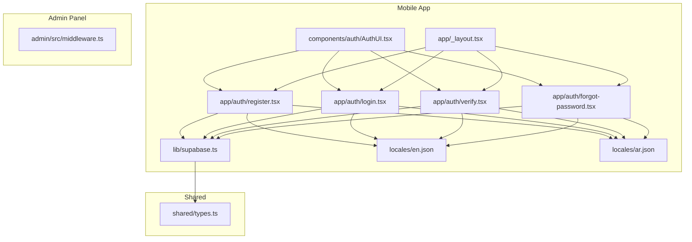
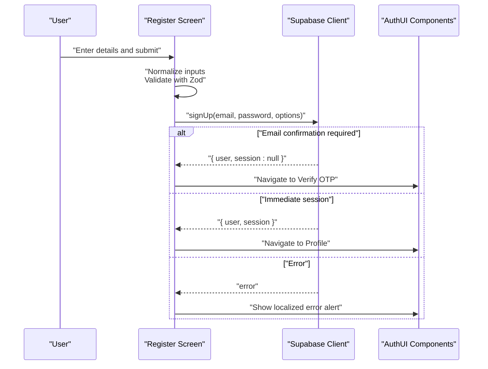
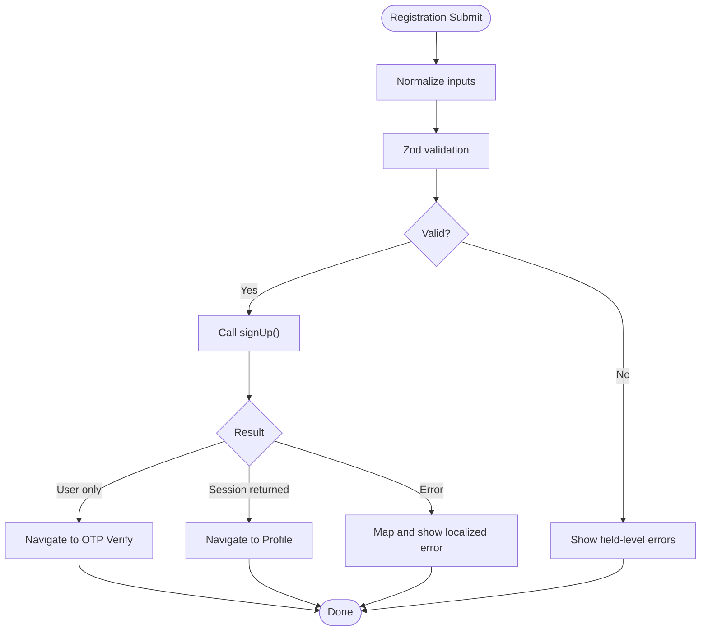
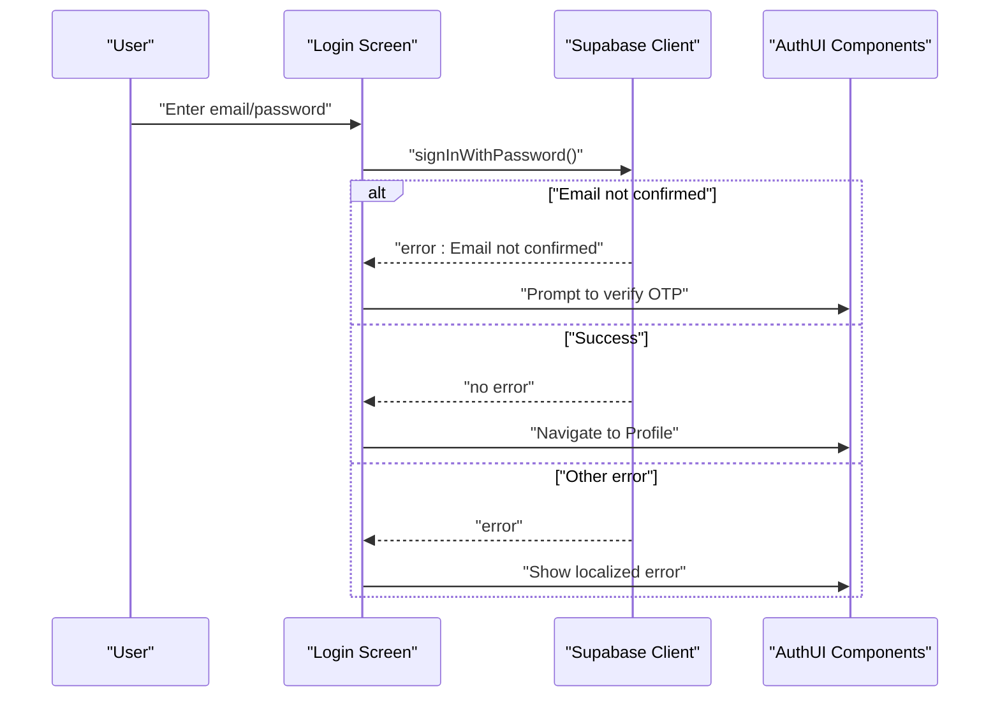
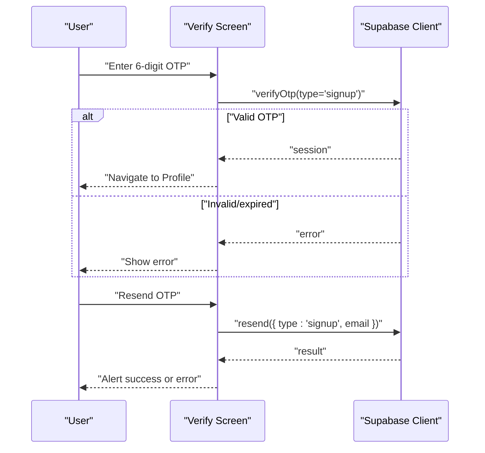
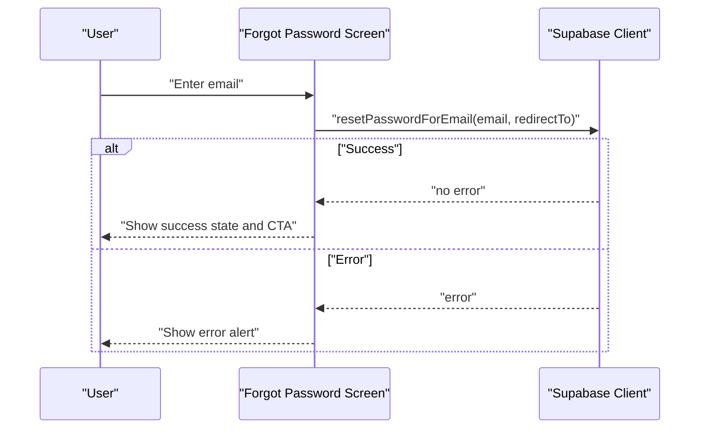
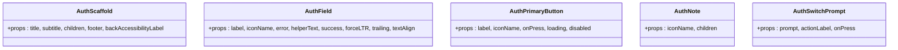
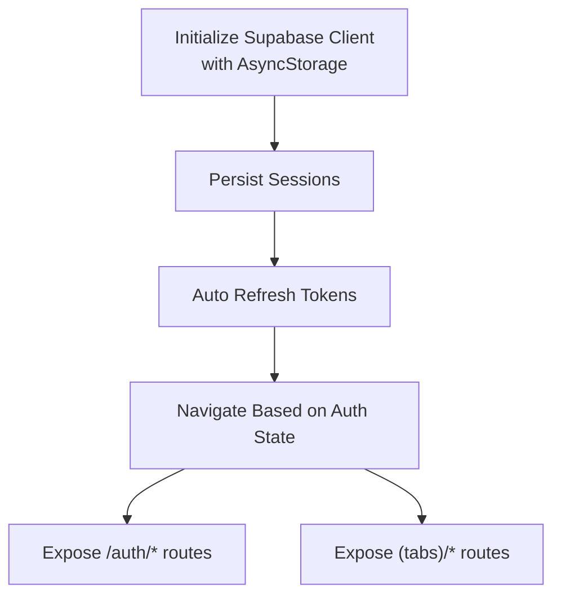
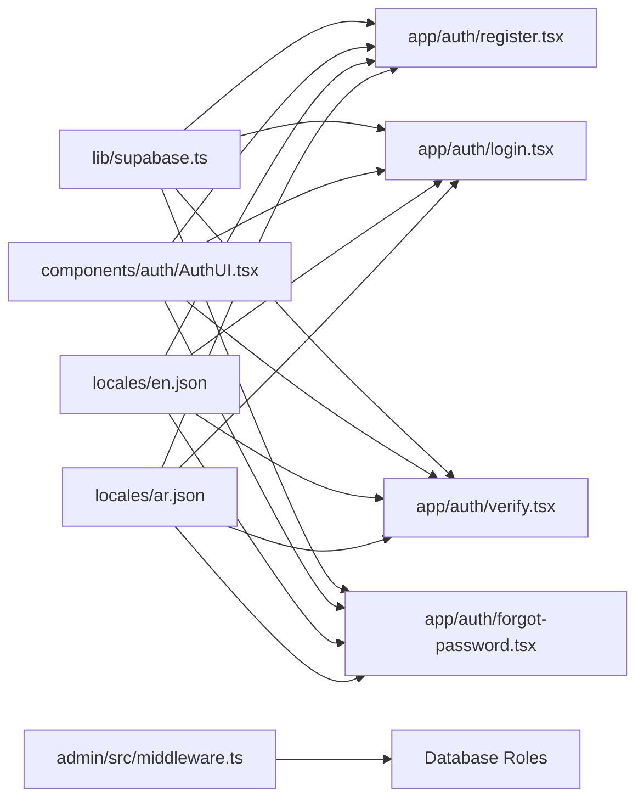

# Authentication System

<cite>
**Referenced Files in This Document**
- [lib/supabase.ts](file://lib/supabase.ts)
- [hooks/useSupabase.ts](file://hooks/useSupabase.ts)
- [app/auth/register.tsx](file://app/auth/register.tsx)
- [app/auth/login.tsx](file://app/auth/login.tsx)
- [app/auth/forgot-password.tsx](file://app/auth/forgot-password.tsx)
- [app/auth/verify.tsx](file://app/auth/verify.tsx)
- [components/auth/AuthUI.tsx](file://components/auth/AuthUI.tsx)
- [app/_layout.tsx](file://app/_layout.tsx)
- [shared/types.ts](file://shared/types.ts)
- [locales/en.json](file://locales/en.json)
- [locales/ar.json](file://locales/ar.json)
- [admin/src/middleware.ts](file://admin/src/middleware.ts)
</cite>

## Table of Contents
1. [Introduction](#introduction)
2. [Project Structure](#project-structure)
3. [Core Components](#core-components)
4. [Architecture Overview](#architecture-overview)
5. [Detailed Component Analysis](#detailed-component-analysis)
6. [Dependency Analysis](#dependency-analysis)
7. [Performance Considerations](#performance-considerations)
8. [Troubleshooting Guide](#troubleshooting-guide)
9. [Conclusion](#conclusion)
10. [Appendices](#appendices)

## Introduction
This document describes the mobile authentication system powered by Supabase Auth. It covers the complete authentication lifecycle: user registration, login, email verification, and password reset. It also documents form validation, error handling, user feedback mechanisms, session/token management, automatic re-authentication, security considerations, and practical guidance for implementing authentication state management, protected routes, and user session persistence in the mobile app.

## Project Structure
The authentication system spans several modules:
- Supabase client initialization with AsyncStorage-backed session persistence
- Mobile screens for registration, login, OTP verification, and password reset
- Shared UI components for forms and feedback
- Internationalization resources for localized messages
- Middleware for role-based access control (admin panel)

**Diagram sources**
- [lib/supabase.ts:1-30](file://lib/supabase.ts#L1-L30)
- [app/auth/register.tsx:1-324](file://app/auth/register.tsx#L1-L324)
- [app/auth/login.tsx:1-171](file://app/auth/login.tsx#L1-L171)
- [app/auth/verify.tsx:1-145](file://app/auth/verify.tsx#L1-L145)
- [app/auth/forgot-password.tsx:1-134](file://app/auth/forgot-password.tsx#L1-L134)
- [components/auth/AuthUI.tsx:1-486](file://components/auth/AuthUI.tsx#L1-L486)
- [app/_layout.tsx:1-108](file://app/_layout.tsx#L1-L108)
- [locales/en.json:1-413](file://locales/en.json#L1-L413)
- [locales/ar.json:1-413](file://locales/ar.json#L1-L413)
- [shared/types.ts:1-353](file://shared/types.ts#L1-L353)
- [admin/src/middleware.ts:1-122](file://admin/src/middleware.ts#L1-L122)

**Section sources**
- [lib/supabase.ts:1-30](file://lib/supabase.ts#L1-L30)
- [app/_layout.tsx:52-82](file://app/_layout.tsx#L52-L82)

## Core Components
- Supabase client configured with AsyncStorage for session persistence, auto-refresh tokens, and persisted sessions.
- Registration screen with Zod-based validation, normalization, and robust error messaging.
- Login screen with credential validation and handling of unconfirmed emails.
- Email verification screen with OTP resend and verification flows.
- Password reset screen with magic-link generation and success feedback.
- Shared UI components for forms, buttons, notes, and prompts.
- Internationalization resources for Arabic and English.
- Middleware for role-based access control in the admin panel.

**Section sources**
- [lib/supabase.ts:18-29](file://lib/supabase.ts#L18-L29)
- [app/auth/register.tsx:17-62](file://app/auth/register.tsx#L17-L62)
- [app/auth/login.tsx:16-31](file://app/auth/login.tsx#L16-L31)
- [app/auth/verify.tsx:12-71](file://app/auth/verify.tsx#L12-L71)
- [app/auth/forgot-password.tsx:9-37](file://app/auth/forgot-password.tsx#L9-L37)
- [components/auth/AuthUI.tsx:26-277](file://components/auth/AuthUI.tsx#L26-L277)
- [locales/en.json:216-281](file://locales/en.json#L216-L281)
- [locales/ar.json:216-281](file://locales/ar.json#L216-L281)
- [admin/src/middleware.ts:4-107](file://admin/src/middleware.ts#L4-L107)

## Architecture Overview
The mobile app initializes a Supabase client with AsyncStorage to persist sessions across app restarts. Authentication flows are handled in dedicated screens that call Supabase Auth APIs. Internationalization is centralized in locale JSON files. The admin middleware demonstrates role-based access control and session enforcement.

**Diagram sources**
- [app/auth/register.tsx:92-149](file://app/auth/register.tsx#L92-L149)
- [components/auth/AuthUI.tsx:126-205](file://components/auth/AuthUI.tsx#L126-L205)
- [lib/supabase.ts:19-29](file://lib/supabase.ts#L19-L29)

**Section sources**
- [lib/supabase.ts:18-29](file://lib/supabase.ts#L18-L29)
- [app/auth/register.tsx:92-149](file://app/auth/register.tsx#L92-L149)
- [components/auth/AuthUI.tsx:126-205](file://components/auth/AuthUI.tsx#L126-L205)

## Detailed Component Analysis

### Registration Flow
- Validation: Full name, phone (Iraqi format), email, password (min length), and password confirmation.
- Submission: Normalizes email/phone/name, calls Supabase sign-up with user metadata.
- Behavior:
  - If email confirmation is pending, navigates to OTP verification screen.
  - If session returned immediately, navigates to profile.
  - Handles network and server errors with localized messages.
- Feedback: Uses AuthField and AuthPrimaryButton with success/error indicators.

**Diagram sources**
- [app/auth/register.tsx:17-62](file://app/auth/register.tsx#L17-L62)
- [app/auth/register.tsx:92-149](file://app/auth/register.tsx#L92-L149)
- [components/auth/AuthUI.tsx:126-205](file://components/auth/AuthUI.tsx#L126-L205)

**Section sources**
- [app/auth/register.tsx:17-62](file://app/auth/register.tsx#L17-L62)
- [app/auth/register.tsx:92-149](file://app/auth/register.tsx#L92-L149)
- [locales/en.json:220-279](file://locales/en.json#L220-L279)
- [locales/ar.json:220-279](file://locales/ar.json#L220-L279)

### Login Flow
- Validation: Email and password minimum length.
- Submission: Calls Supabase sign-in with normalized email.
- Behavior:
  - If email not confirmed, prompts to verify OTP.
  - On success, navigates to profile.
  - On error, shows localized message.
- Feedback: AuthField with secure entry and toggle.

**Diagram sources**
- [app/auth/login.tsx:50-85](file://app/auth/login.tsx#L50-L85)
- [components/auth/AuthUI.tsx:126-205](file://components/auth/AuthUI.tsx#L126-L205)

**Section sources**
- [app/auth/login.tsx:16-31](file://app/auth/login.tsx#L16-L31)
- [app/auth/login.tsx:50-85](file://app/auth/login.tsx#L50-L85)
- [locales/en.json:216-281](file://locales/en.json#L216-L281)
- [locales/ar.json:216-281](file://locales/ar.json#L216-L281)

### Email Verification (OTP)
- Accepts a 6-digit OTP and verifies via Supabase.
- Resend OTP supports resending the signup OTP.
- Navigates to profile on successful verification.

**Diagram sources**
- [app/auth/verify.tsx:43-71](file://app/auth/verify.tsx#L43-L71)
- [app/auth/verify.tsx:21-41](file://app/auth/verify.tsx#L21-L41)

**Section sources**
- [app/auth/verify.tsx:12-71](file://app/auth/verify.tsx#L12-L71)
- [locales/en.json:216-281](file://locales/en.json#L216-L281)
- [locales/ar.json:216-281](file://locales/ar.json#L216-L281)

### Password Reset
- Requests a password reset link to the provided email.
- Uses a deep link redirect configured for the app.
- Provides success state and navigation to login.

**Diagram sources**
- [app/auth/forgot-password.tsx:17-37](file://app/auth/forgot-password.tsx#L17-L37)

**Section sources**
- [app/auth/forgot-password.tsx:9-37](file://app/auth/forgot-password.tsx#L9-L37)
- [locales/en.json:147-158](file://locales/en.json#L147-L158)
- [locales/ar.json:147-158](file://locales/ar.json#L147-L158)

### Shared UI Components
- AuthScaffold: Layout scaffold with gradient background, safe area, and scroll container.
- AuthField: Input with icons, focus states, success/error indicators, and helper text.
- AuthPrimaryButton: Gradient button with loading state and disabled handling.
- AuthNote: Informative note with icon and text content.
- AuthSwitchPrompt: Prompt to switch between related screens.

**Diagram sources**
- [components/auth/AuthUI.tsx:26-277](file://components/auth/AuthUI.tsx#L26-L277)

**Section sources**
- [components/auth/AuthUI.tsx:26-277](file://components/auth/AuthUI.tsx#L26-L277)

### Protected Routes and Session Management
- Supabase client is initialized with AsyncStorage to persist sessions and auto-refresh tokens.
- The app stack exposes authentication routes and navigates users accordingly.
- Middleware in the admin panel demonstrates enforcing session presence and role-based restrictions.

**Diagram sources**
- [lib/supabase.ts:18-29](file://lib/supabase.ts#L18-L29)
- [app/_layout.tsx:52-82](file://app/_layout.tsx#L52-L82)
- [admin/src/middleware.ts:4-107](file://admin/src/middleware.ts#L4-L107)

**Section sources**
- [lib/supabase.ts:18-29](file://lib/supabase.ts#L18-L29)
- [app/_layout.tsx:52-82](file://app/_layout.tsx#L52-L82)
- [admin/src/middleware.ts:4-107](file://admin/src/middleware.ts#L4-L107)

## Dependency Analysis
- Supabase client depends on AsyncStorage for session persistence and environment variables for configuration.
- Authentication screens depend on the Supabase client and shared UI components.
- Locale resources provide internationalized messages for all flows.
- The admin middleware depends on Supabase SSR client and database roles.

**Diagram sources**
- [lib/supabase.ts:1-30](file://lib/supabase.ts#L1-L30)
- [app/auth/register.tsx:1-324](file://app/auth/register.tsx#L1-L324)
- [app/auth/login.tsx:1-171](file://app/auth/login.tsx#L1-L171)
- [app/auth/verify.tsx:1-145](file://app/auth/verify.tsx#L1-L145)
- [app/auth/forgot-password.tsx:1-134](file://app/auth/forgot-password.tsx#L1-L134)
- [components/auth/AuthUI.tsx:1-486](file://components/auth/AuthUI.tsx#L1-L486)
- [locales/en.json:1-413](file://locales/en.json#L1-L413)
- [locales/ar.json:1-413](file://locales/ar.json#L1-L413)
- [admin/src/middleware.ts:1-122](file://admin/src/middleware.ts#L1-L122)

**Section sources**
- [lib/supabase.ts:1-30](file://lib/supabase.ts#L1-L30)
- [app/auth/register.tsx:1-324](file://app/auth/register.tsx#L1-L324)
- [app/auth/login.tsx:1-171](file://app/auth/login.tsx#L1-L171)
- [app/auth/verify.tsx:1-145](file://app/auth/verify.tsx#L1-L145)
- [app/auth/forgot-password.tsx:1-134](file://app/auth/forgot-password.tsx#L1-L134)
- [components/auth/AuthUI.tsx:1-486](file://components/auth/AuthUI.tsx#L1-L486)
- [locales/en.json:1-413](file://locales/en.json#L1-L413)
- [locales/ar.json:1-413](file://locales/ar.json#L1-L413)
- [admin/src/middleware.ts:1-122](file://admin/src/middleware.ts#L1-L122)

## Performance Considerations
- Token auto-refresh reduces manual refresh overhead and improves UX.
- Persisted sessions minimize re-authentication friction across app restarts.
- Form validation occurs client-side to reduce server round-trips.
- Avoid unnecessary re-renders by normalizing inputs once and using controlled components.

[No sources needed since this section provides general guidance]

## Troubleshooting Guide
Common issues and resolutions:
- Registration errors:
  - Already registered: Prompt to log in.
  - Invalid API key/network: Suggest retry or check connectivity.
  - Rate limit exceeded: Advise waiting before retry.
- Login errors:
  - Invalid credentials: Prompt to correct email/password.
  - Email not confirmed: Offer to verify OTP.
- Verification errors:
  - Invalid/expired OTP: Allow resending OTP.
- Password reset:
  - Network errors: Retry after checking connectivity.
  - Deep link not opening: Confirm app scheme and device configuration.

**Section sources**
- [app/auth/register.tsx:35-62](file://app/auth/register.tsx#L35-L62)
- [app/auth/login.tsx:23-31](file://app/auth/login.tsx#L23-L31)
- [app/auth/verify.tsx:64-66](file://app/auth/verify.tsx#L64-L66)
- [app/auth/forgot-password.tsx:26-29](file://app/auth/forgot-password.tsx#L26-L29)

## Conclusion
The mobile authentication system leverages Supabase Auth with AsyncStorage-backed sessions, robust client-side validation, and localized user feedback. The flows for registration, login, OTP verification, and password reset are modular, maintainable, and user-friendly. The admin middleware demonstrates role-based access control and session enforcement. Together, these components provide a secure and scalable foundation for mobile authentication.

[No sources needed since this section summarizes without analyzing specific files]

## Appendices

### Implementation Examples

- Authentication state management (client):
  - Initialize Supabase with AsyncStorage and auto-refresh:
    - [lib/supabase.ts:18-29](file://lib/supabase.ts#L18-L29)

- Protected routes (mobile app stack):
  - Expose authentication and tab routes:
    - [app/_layout.tsx:52-82](file://app/_layout.tsx#L52-L82)

- User session persistence:
  - Configure storage and session persistence:
    - [lib/supabase.ts:23-29](file://lib/supabase.ts#L23-L29)

- Role-based access control (admin):
  - Enforce session and restrict paths:
    - [admin/src/middleware.ts:4-107](file://admin/src/middleware.ts#L4-L107)

- Security considerations:
  - Minimum password length enforced in forms.
  - OTP verification ensures email ownership.
  - Password reset uses secure links with redirect.
  - [app/auth/register.tsx:24-26](file://app/auth/register.tsx#L24-L26)
  - [app/auth/verify.tsx:56-60](file://app/auth/verify.tsx#L56-L60)
  - [app/auth/forgot-password.tsx:22-24](file://app/auth/forgot-password.tsx#L22-L24)

- Best practices:
  - Normalize inputs (trim/lowercase/email, phone cleanup).
  - Provide immediate visual feedback (success/error states).
  - Localize all user-facing messages.
  - Use secure text entry and appropriate input types.

**Section sources**
- [lib/supabase.ts:18-29](file://lib/supabase.ts#L18-L29)
- [app/_layout.tsx:52-82](file://app/_layout.tsx#L52-L82)
- [admin/src/middleware.ts:4-107](file://admin/src/middleware.ts#L4-L107)
- [app/auth/register.tsx:24-26](file://app/auth/register.tsx#L24-L26)
- [app/auth/verify.tsx:56-60](file://app/auth/verify.tsx#L56-L60)
- [app/auth/forgot-password.tsx:22-24](file://app/auth/forgot-password.tsx#L22-L24)