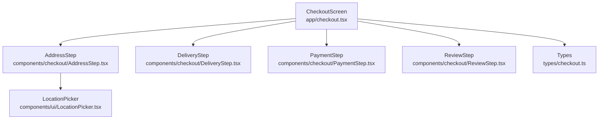
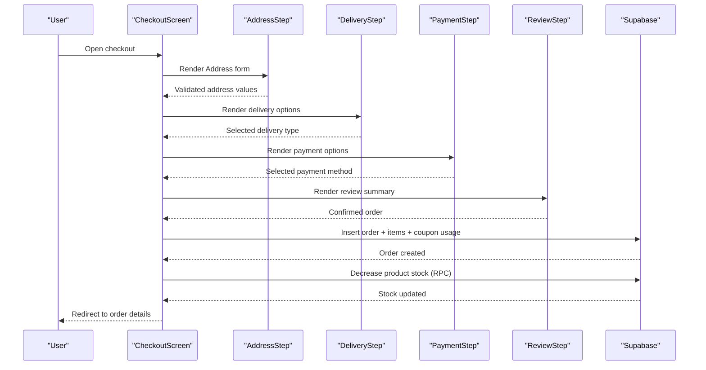
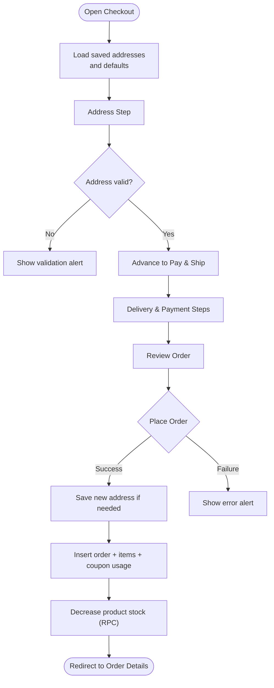
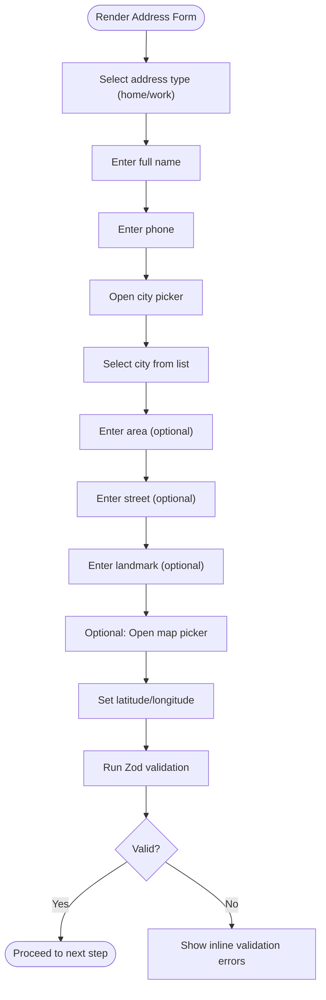
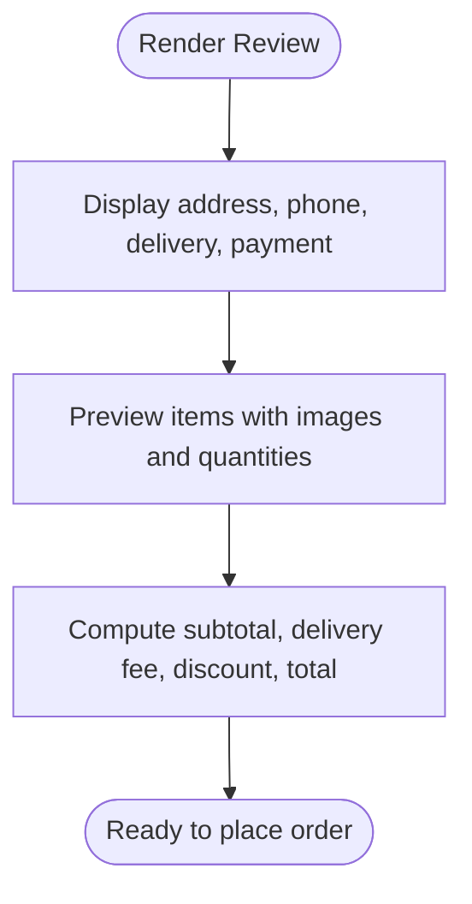
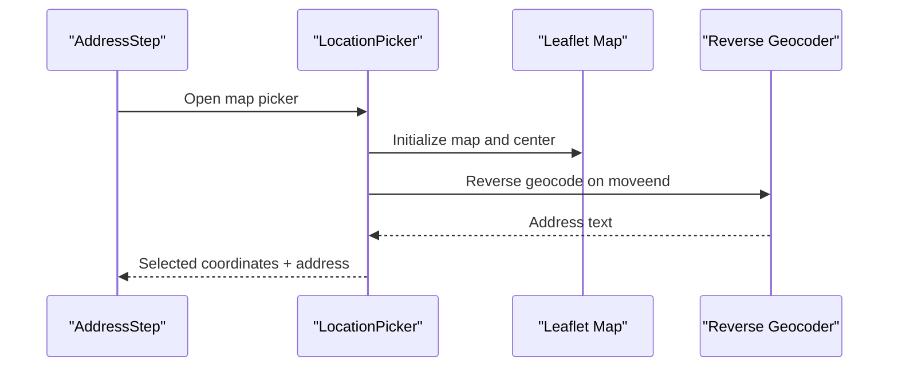
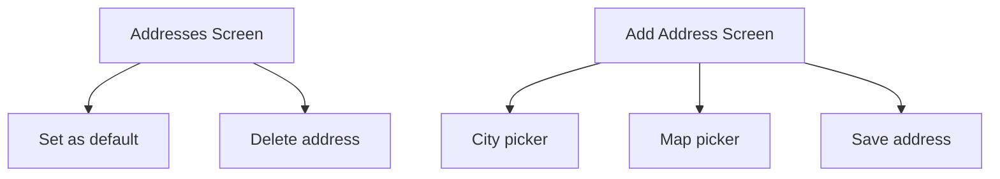
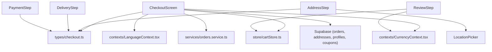
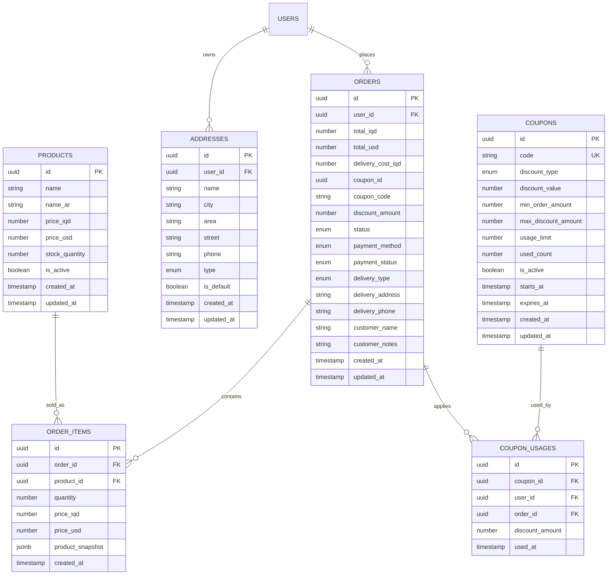

# Checkout Process

<cite>
**Referenced Files in This Document**
- [app/checkout.tsx](file://app/checkout.tsx)
- [components/checkout/AddressStep.tsx](file://components/checkout/AddressStep.tsx)
- [components/checkout/DeliveryStep.tsx](file://components/checkout/DeliveryStep.tsx)
- [components/checkout/PaymentStep.tsx](file://components/checkout/PaymentStep.tsx)
- [components/checkout/ReviewStep.tsx](file://components/checkout/ReviewStep.tsx)
- [components/ui/LocationPicker.tsx](file://components/ui/LocationPicker.tsx)
- [types/checkout.ts](file://types/checkout.ts)
- [store/cartStore.ts](file://store/cartStore.ts)
- [services/orders.service.ts](file://services/orders.service.ts)
- [contexts/LanguageContext.tsx](file://contexts/LanguageContext.tsx)
- [contexts/CurrencyContext.tsx](file://contexts/CurrencyContext.tsx)
- [shared/types.ts](file://shared/types.ts)
- [app/addresses.tsx](file://app/addresses.tsx)
- [app/address/add.tsx](file://app/address/add.tsx)
</cite>

## Table of Contents
1. [Introduction](#introduction)
2. [Project Structure](#project-structure)
3. [Core Components](#core-components)
4. [Architecture Overview](#architecture-overview)
5. [Detailed Component Analysis](#detailed-component-analysis)
6. [Dependency Analysis](#dependency-analysis)
7. [Performance Considerations](#performance-considerations)
8. [Troubleshooting Guide](#troubleshooting-guide)
9. [Conclusion](#conclusion)
10. [Appendices](#appendices)

## Introduction
This document explains the mobile checkout process implementation. It covers the multi-step checkout flow (address selection, delivery options, payment method, and order review), validation logic, user progression, payment integration, order creation, and confirmation handling. It also documents address management, shipping cost calculation, coupon usage, and tax-free pricing model. Security, data protection, and mobile UX optimization are addressed throughout.

## Project Structure
The checkout feature is implemented as a single-screen wizard with four steps:
- AddressStep: Collects recipient name, phone, city, area, street, landmark, and optional map-pinned coordinates.
- DeliveryStep: Allows selecting delivery type (standard, express, fragile) with associated costs.
- PaymentStep: Selects payment method (Cash on Delivery currently available).
- ReviewStep: Summarizes the order, items preview, and cost breakdown.

The main checkout screen orchestrates navigation, validation, and submission to the backend via Supabase.



**Diagram sources**
- [app/checkout.tsx:25-284](file://app/checkout.tsx#L25-L284)
- [components/checkout/AddressStep.tsx:16-233](file://components/checkout/AddressStep.tsx#L16-L233)
- [components/checkout/DeliveryStep.tsx:12-77](file://components/checkout/DeliveryStep.tsx#L12-L77)
- [components/checkout/PaymentStep.tsx:12-69](file://components/checkout/PaymentStep.tsx#L12-L69)
- [components/checkout/ReviewStep.tsx:35-171](file://components/checkout/ReviewStep.tsx#L35-L171)
- [components/ui/LocationPicker.tsx:16-373](file://components/ui/LocationPicker.tsx#L16-L373)
- [types/checkout.ts:1-50](file://types/checkout.ts#L1-L50)

**Section sources**
- [app/checkout.tsx:25-284](file://app/checkout.tsx#L25-L284)
- [components/checkout/AddressStep.tsx:16-233](file://components/checkout/AddressStep.tsx#L16-L233)
- [components/checkout/DeliveryStep.tsx:12-77](file://components/checkout/DeliveryStep.tsx#L12-L77)
- [components/checkout/PaymentStep.tsx:12-69](file://components/checkout/PaymentStep.tsx#L12-L69)
- [components/checkout/ReviewStep.tsx:35-171](file://components/checkout/ReviewStep.tsx#L35-L171)
- [components/ui/LocationPicker.tsx:16-373](file://components/ui/LocationPicker.tsx#L16-L373)
- [types/checkout.ts:1-50](file://types/checkout.ts#L1-L50)

## Core Components
- CheckoutScreen: Manages step navigation, validation, coupon handling, delivery cost calculation, and order submission. It integrates with Supabase for user session, address retrieval, and order persistence.
- AddressStep: Implements address form with controlled inputs, validation, city picker, and optional map pinning.
- DeliveryStep: Presents selectable delivery options with icons, labels, and prices.
- PaymentStep: Presents selectable payment methods; currently COD is available.
- ReviewStep: Displays order summary, items preview, and cost breakdown including subtotal, delivery fee, discount, and total.
- LocationPicker: Embedded map-based location selector with reverse geocoding and permission handling.
- Types: Zod schema for address validation, Iraqi cities list, and type definitions for checkout state.
- CartStore: Provides cart items, totals, and stock checks used in review and submission.
- Orders service: Utility functions for creating orders and order items, fetching orders, and updating statuses.
- Contexts: Language and currency providers used for localization and price formatting.
- Address screens: Separate screens for managing saved addresses and adding new ones.

**Section sources**
- [app/checkout.tsx:25-284](file://app/checkout.tsx#L25-L284)
- [components/checkout/AddressStep.tsx:16-233](file://components/checkout/AddressStep.tsx#L16-L233)
- [components/checkout/DeliveryStep.tsx:12-77](file://components/checkout/DeliveryStep.tsx#L12-L77)
- [components/checkout/PaymentStep.tsx:12-69](file://components/checkout/PaymentStep.tsx#L12-L69)
- [components/checkout/ReviewStep.tsx:35-171](file://components/checkout/ReviewStep.tsx#L35-L171)
- [components/ui/LocationPicker.tsx:16-373](file://components/ui/LocationPicker.tsx#L16-L373)
- [types/checkout.ts:1-50](file://types/checkout.ts#L1-L50)
- [store/cartStore.ts:51-174](file://store/cartStore.ts#L51-L174)
- [services/orders.service.ts:12-115](file://services/orders.service.ts#L12-L115)
- [contexts/LanguageContext.tsx:26-77](file://contexts/LanguageContext.tsx#L26-L77)
- [contexts/CurrencyContext.tsx:23-95](file://contexts/CurrencyContext.tsx#L23-L95)
- [app/addresses.tsx:10-355](file://app/addresses.tsx#L10-L355)
- [app/address/add.tsx:11-241](file://app/address/add.tsx#L11-L241)

## Architecture Overview
The checkout flow is a client-driven wizard that validates user input progressively and persists the order on the backend. The main screen coordinates:
- Step navigation and progress visualization
- Validation using Zod schema for address fields
- Delivery cost calculation per selected type
- Coupon application and discount handling
- Order creation and related items insertion
- Stock reduction via RPC
- Optional address saving if not previously stored



**Diagram sources**
- [app/checkout.tsx:141-254](file://app/checkout.tsx#L141-L254)
- [components/checkout/AddressStep.tsx:16-233](file://components/checkout/AddressStep.tsx#L16-L233)
- [components/checkout/DeliveryStep.tsx:12-77](file://components/checkout/DeliveryStep.tsx#L12-L77)
- [components/checkout/PaymentStep.tsx:12-69](file://components/checkout/PaymentStep.tsx#L12-L69)
- [components/checkout/ReviewStep.tsx:35-171](file://components/checkout/ReviewStep.tsx#L35-L171)
- [services/orders.service.ts:12-34](file://services/orders.service.ts#L12-L34)

## Detailed Component Analysis

### CheckoutScreen
Responsibilities:
- Maintains current step, delivery type, payment method, coupon info, and submission state.
- Loads saved addresses and default address for logged-in users.
- Validates address step before advancing.
- Calculates delivery cost based on selected type.
- Submits order with totals, delivery address, payment method, and coupon usage.
- Persists new address if not present.
- Reduces product stock via RPC.
- Navigates to order details after successful submission.

Key validations and flows:
- Address step validation triggers Zod resolver for required fields.
- Submission guards against empty cart and missing session.
- Final totals computed as subtotal + delivery cost − discount.
- Coupon usage recorded and coupon used count incremented.



**Diagram sources**
- [app/checkout.tsx:95-131](file://app/checkout.tsx#L95-L131)
- [app/checkout.tsx:141-150](file://app/checkout.tsx#L141-L150)
- [app/checkout.tsx:152-254](file://app/checkout.tsx#L152-L254)

**Section sources**
- [app/checkout.tsx:25-284](file://app/checkout.tsx#L25-L284)
- [app/checkout.tsx:95-131](file://app/checkout.tsx#L95-L131)
- [app/checkout.tsx:133-139](file://app/checkout.tsx#L133-L139)
- [app/checkout.tsx:141-150](file://app/checkout.tsx#L141-L150)
- [app/checkout.tsx:152-254](file://app/checkout.tsx#L152-L254)

### AddressStep
Responsibilities:
- Renders address form with controlled inputs for name, phone, city, area, street, landmark, notes, and coordinates.
- Integrates city picker modal with Iraqi cities list.
- Integrates LocationPicker for optional map pinning.
- Displays inline validation messages with red borders and warning icons.

Validation pattern:
- Zod schema enforces minimum lengths and required fields.
- City selection validated via picker state.
- On focus, the form scrolls to keep the input visible.



**Diagram sources**
- [components/checkout/AddressStep.tsx:16-233](file://components/checkout/AddressStep.tsx#L16-L233)
- [types/checkout.ts:3-14](file://types/checkout.ts#L3-L14)
- [types/checkout.ts:17-36](file://types/checkout.ts#L17-L36)

**Section sources**
- [components/checkout/AddressStep.tsx:16-233](file://components/checkout/AddressStep.tsx#L16-L233)
- [types/checkout.ts:3-14](file://types/checkout.ts#L3-L14)
- [types/checkout.ts:17-36](file://types/checkout.ts#L17-L36)

### DeliveryStep
Responsibilities:
- Presents three delivery options with icons, labels, and prices.
- Highlights selected option and updates parent state.

```mermaid
classDiagram
class DeliveryStep {
+selectedType : DeliveryType
+onSelect(type)
}
class DeliveryType {
<<enum>>
"scheduled"
"express"
"electronics"
}
DeliveryStep --> DeliveryType : "selects"
```

**Diagram sources**
- [components/checkout/DeliveryStep.tsx:12-77](file://components/checkout/DeliveryStep.tsx#L12-L77)
- [types/checkout.ts:40-42](file://types/checkout.ts#L40-L42)

**Section sources**
- [components/checkout/DeliveryStep.tsx:12-77](file://components/checkout/DeliveryStep.tsx#L12-L77)
- [types/checkout.ts:40-42](file://types/checkout.ts#L40-L42)

### PaymentStep
Responsibilities:
- Presents selectable payment methods.
- Currently COD is available; others are placeholders.

```mermaid
classDiagram
class PaymentStep {
+selectedMethod : PaymentMethod
+onSelect(method)
}
class PaymentMethod {
<<enum>>
"cod"
"card"
"wallet"
}
PaymentStep --> PaymentMethod : "selects"
```

**Diagram sources**
- [components/checkout/PaymentStep.tsx:12-69](file://components/checkout/PaymentStep.tsx#L12-L69)
- [types/checkout.ts:42-42](file://types/checkout.ts#L42-L42)

**Section sources**
- [components/checkout/PaymentStep.tsx:12-69](file://components/checkout/PaymentStep.tsx#L12-L69)
- [types/checkout.ts:42-42](file://types/checkout.ts#L42-L42)

### ReviewStep
Responsibilities:
- Displays delivery and payment summaries with localized labels.
- Shows compact items preview with quantities and images.
- Computes and displays cost breakdown: subtotal, delivery fee, discount (if any), and total.



**Diagram sources**
- [components/checkout/ReviewStep.tsx:35-171](file://components/checkout/ReviewStep.tsx#L35-L171)
- [store/cartStore.ts:51-174](file://store/cartStore.ts#L51-L174)

**Section sources**
- [components/checkout/ReviewStep.tsx:35-171](file://components/checkout/ReviewStep.tsx#L35-L171)
- [store/cartStore.ts:51-174](file://store/cartStore.ts#L51-L174)

### LocationPicker
Responsibilities:
- Embeds a WebView with OpenStreetMap to select a location.
- Requests device location permissions and reverse geocodes to display address text.
- Sends selected coordinates back to parent component.



**Diagram sources**
- [components/ui/LocationPicker.tsx:16-373](file://components/ui/LocationPicker.tsx#L16-L373)

**Section sources**
- [components/ui/LocationPicker.tsx:16-373](file://components/ui/LocationPicker.tsx#L16-L373)

### Address Management Screens
- Addresses screen lists saved addresses, allows setting default, and deleting entries.
- Add address screen supports city picker, map pinning, and saving new addresses.



**Diagram sources**
- [app/addresses.tsx:10-355](file://app/addresses.tsx#L10-L355)
- [app/address/add.tsx:11-241](file://app/address/add.tsx#L11-L241)

**Section sources**
- [app/addresses.tsx:10-355](file://app/addresses.tsx#L10-L355)
- [app/address/add.tsx:11-241](file://app/address/add.tsx#L11-L241)

## Dependency Analysis
Checkout components depend on:
- Types for validation and enums
- CartStore for totals and items
- Contexts for language and currency formatting
- Supabase for session, addresses, orders, and RPC stock reduction
- Services for order creation helpers



**Diagram sources**
- [app/checkout.tsx:12-17](file://app/checkout.tsx#L12-L17)
- [types/checkout.ts:1-50](file://types/checkout.ts#L1-50)
- [store/cartStore.ts:51-174](file://store/cartStore.ts#L51-L174)
- [contexts/LanguageContext.tsx:26-77](file://contexts/LanguageContext.tsx#L26-L77)
- [contexts/CurrencyContext.tsx:23-95](file://contexts/CurrencyContext.tsx#L23-L95)
- [services/orders.service.ts:12-115](file://services/orders.service.ts#L12-L115)
- [components/checkout/AddressStep.tsx:16-233](file://components/checkout/AddressStep.tsx#L16-L233)
- [components/checkout/DeliveryStep.tsx:12-77](file://components/checkout/DeliveryStep.tsx#L12-L77)
- [components/checkout/PaymentStep.tsx:12-69](file://components/checkout/PaymentStep.tsx#L12-L69)
- [components/checkout/ReviewStep.tsx:35-171](file://components/checkout/ReviewStep.tsx#L35-L171)
- [components/ui/LocationPicker.tsx:16-373](file://components/ui/LocationPicker.tsx#L16-L373)

**Section sources**
- [app/checkout.tsx:12-17](file://app/checkout.tsx#L12-L17)
- [types/checkout.ts:1-50](file://types/checkout.ts#L1-50)
- [store/cartStore.ts:51-174](file://store/cartStore.ts#L51-L174)
- [contexts/LanguageContext.tsx:26-77](file://contexts/LanguageContext.tsx#L26-L77)
- [contexts/CurrencyContext.tsx:23-95](file://contexts/CurrencyContext.tsx#L23-L95)
- [services/orders.service.ts:12-115](file://services/orders.service.ts#L12-L115)

## Performance Considerations
- Use of Zod resolver ensures client-side validation without unnecessary re-renders.
- Animated progress bar uses spring physics for smooth transitions.
- Keyboard-aware scroll view prevents input overlap and reduces layout thrashing.
- Currency formatting uses built-in formatters for efficient rendering.
- Stock checks occur before insertion to fail fast and reduce database errors.
- Map picker debounces reverse geocoding to minimize API calls.

## Troubleshooting Guide
Common issues and resolutions:
- Empty cart on checkout: The screen alerts and navigates back to home.
- Missing session during submission: Alerts user to log in and cancels submission.
- Validation failures: Inline error messages appear under invalid fields; ensure required fields are filled.
- Location picker permission denied: Prompts user to enable location access in settings.
- Order creation errors: Rollback deletes order items and order on failure; user sees generic error alert.
- Coupon usage errors: Rollback order items and order on failure; coupon usage not recorded.

**Section sources**
- [app/checkout.tsx:90-93](file://app/checkout.tsx#L90-L93)
- [app/checkout.tsx:159-163](file://app/checkout.tsx#L159-L163)
- [components/checkout/AddressStep.tsx:67-75](file://components/checkout/AddressStep.tsx#L67-L75)
- [components/ui/LocationPicker.tsx:96-103](file://components/ui/LocationPicker.tsx#L96-L103)
- [app/checkout.tsx:248-251](file://app/checkout.tsx#L248-L251)
- [app/checkout.tsx:222-227](file://app/checkout.tsx#L222-L227)

## Conclusion
The checkout implementation provides a robust, localized, and mobile-optimized flow. It leverages controlled forms, validation, and a clear step progression to guide users through address selection, delivery options, payment method choice, and order review. Backend integration ensures secure order creation, coupon usage, and inventory management. Address management screens complement the checkout by enabling users to maintain and reuse saved addresses.

## Appendices

### Data Models and Types


**Diagram sources**
- [shared/types.ts:49-86](file://shared/types.ts#L49-L86)
- [shared/types.ts:101-131](file://shared/types.ts#L101-L131)
- [shared/types.ts:168-184](file://shared/types.ts#L168-L184)
- [shared/types.ts:217-230](file://shared/types.ts#L217-L230)

### Validation Patterns and Examples
- Address validation uses Zod schema with minimum length and required fields.
- City selection enforced via picker state.
- Phone input constrained to numeric keypad.
- Inline error display with red borders and warning icons.

**Section sources**
- [types/checkout.ts:3-14](file://types/checkout.ts#L3-L14)
- [components/checkout/AddressStep.tsx:46-76](file://components/checkout/AddressStep.tsx#L46-L76)

### Security and Data Protection
- Session-based order creation requires authenticated user.
- Order and items inserted atomically; rollback on failure.
- Coupon usage tracked with user and order linkage.
- Location picker respects user permissions and handles errors gracefully.

**Section sources**
- [app/checkout.tsx:156-158](file://app/checkout.tsx#L156-L158)
- [app/checkout.tsx:195-212](file://app/checkout.tsx#L195-L212)
- [components/ui/LocationPicker.tsx:94-103](file://components/ui/LocationPicker.tsx#L94-L103)