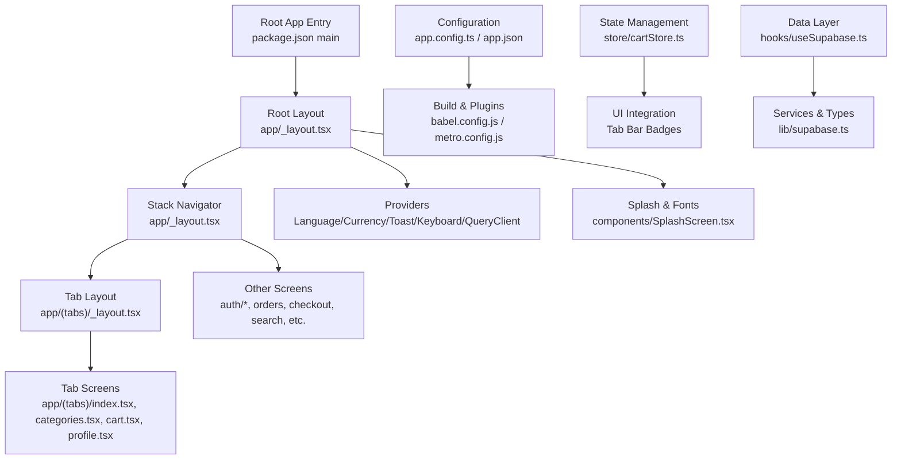
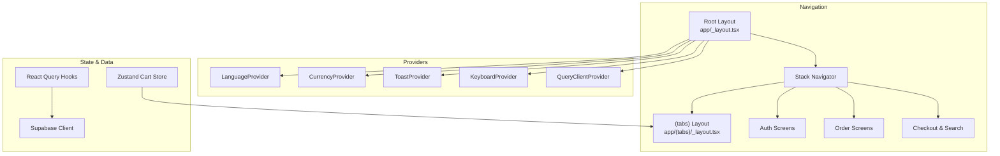
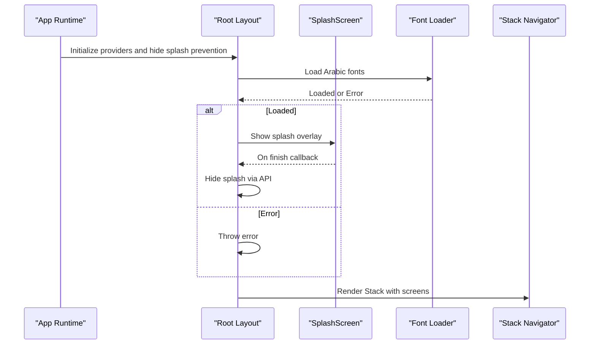
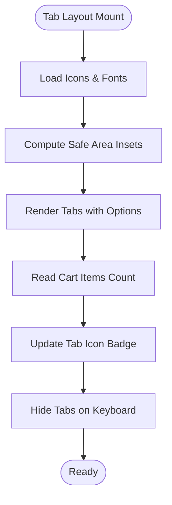
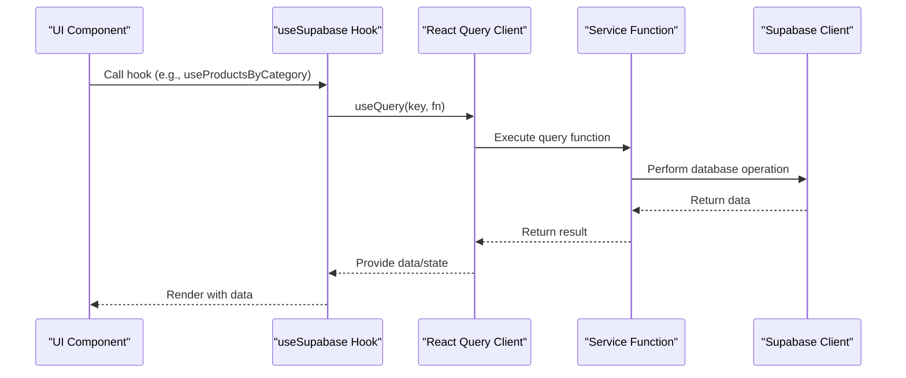
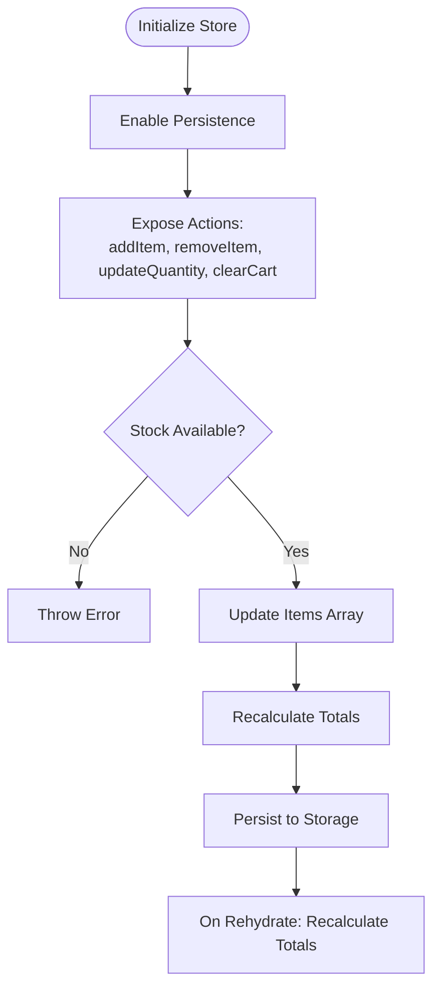
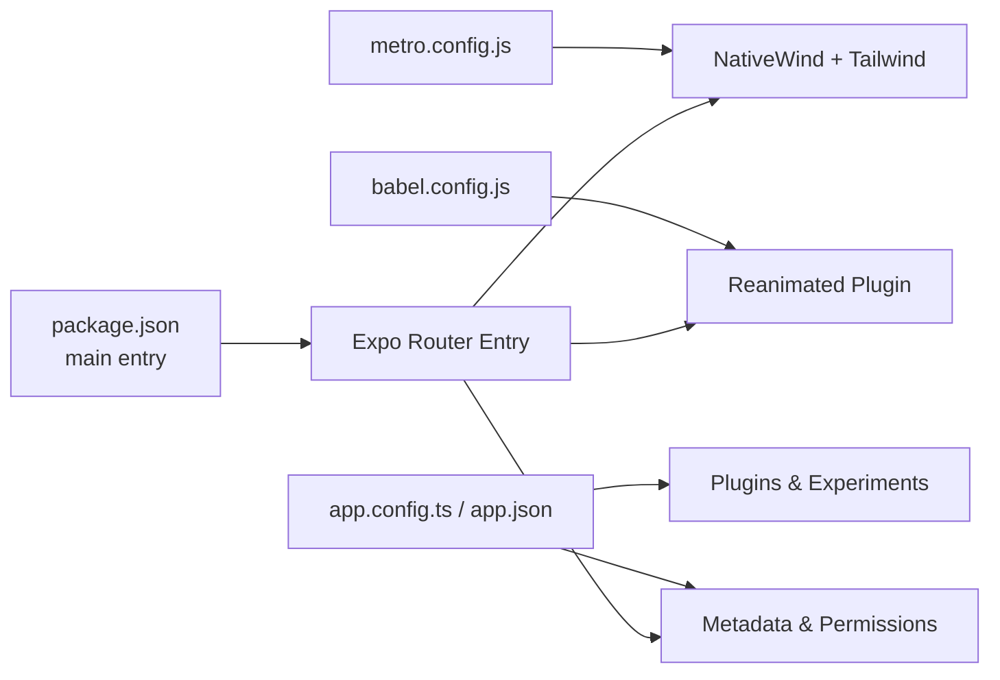
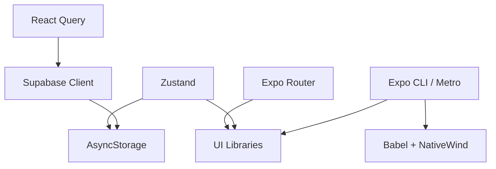

# Mobile App Overview

<cite>
**Referenced Files in This Document**
- [App.tsx](file://App.tsx)
- [app.config.ts](file://app.config.ts)
- [app.json](file://app.json)
- [package.json](file://package.json)
- [eas.json](file://eas.json)
- [metro.config.js](file://metro.config.js)
- [babel.config.js](file://babel.config.js)
- [app/_layout.tsx](file://app/_layout.tsx)
- [app/(tabs)/_layout.tsx](file://app/(tabs)/_layout.tsx)
- [components/SplashScreen.tsx](file://components/SplashScreen.tsx)
- [hooks/useSupabase.ts](file://hooks/useSupabase.ts)
- [lib/supabase.ts](file://lib/supabase.ts)
- [store/cartStore.ts](file://store/cartStore.ts)
- [contexts/index.ts](file://contexts/index.ts)
</cite>

## Table of Contents
1. [Introduction](#introduction)
2. [Project Structure](#project-structure)
3. [Core Components](#core-components)
4. [Architecture Overview](#architecture-overview)
5. [Detailed Component Analysis](#detailed-component-analysis)
6. [Dependency Analysis](#dependency-analysis)
7. [Performance Considerations](#performance-considerations)
8. [Troubleshooting Guide](#troubleshooting-guide)
9. [Conclusion](#conclusion)
10. [Appendices](#appendices)

## Introduction
This document provides a comprehensive overview of the React Native mobile application built with Expo Router for navigation. It explains the app’s architecture, entry point configuration, platform-specific features, routing system, layout configurations, navigation patterns, application lifecycle, initialization processes, integration with native modules, mobile-specific UI patterns, responsive design principles, and setup/build/deployment considerations for iOS and Android.

## Project Structure
The project follows a hybrid structure with a dedicated app directory for Expo Router file-based routing, shared components and services, and platform configuration files. Key areas:
- app/: File-based routing with nested layouts and screens
- components/: Shared UI and business components
- hooks/: Custom hooks integrating data fetching and state
- lib/: SDK integrations (e.g., Supabase)
- store/: Local state management with persistence
- contexts/: Global providers for language, currency, and UI state
- Configuration: app.config.ts, app.json, eas.json, package.json, babel.config.js, metro.config.js

**Diagram sources**
- [package.json:4](file://package.json#L4)
- [app/_layout.tsx:34-107](file://app/_layout.tsx#L34-L107)
- [app/(tabs)/_layout.tsx:16-189](file://app/(tabs)/_layout.tsx#L16-L189)
- [components/SplashScreen.tsx:14-138](file://components/SplashScreen.tsx#L14-L138)
- [store/cartStore.ts:51-164](file://store/cartStore.ts#L51-L164)
- [hooks/useSupabase.ts:1-239](file://hooks/useSupabase.ts#L1-L239)
- [lib/supabase.ts:1-30](file://lib/supabase.ts#L1-L30)
- [app.config.ts:1-75](file://app.config.ts#L1-L75)
- [app.json:1-63](file://app.json#L1-L63)
- [babel.config.js:1-15](file://babel.config.js#L1-L15)
- [metro.config.js:1-8](file://metro.config.js#L1-L8)

**Section sources**
- [package.json:1-65](file://package.json#L1-L65)
- [app/_layout.tsx:1-108](file://app/_layout.tsx#L1-L108)
- [app/(tabs)/_layout.tsx:1-190](file://app/(tabs)/_layout.tsx#L1-L190)
- [app.config.ts:1-75](file://app.config.ts#L1-L75)
- [app.json:1-63](file://app.json#L1-L63)
- [babel.config.js:1-15](file://babel.config.js#L1-L15)
- [metro.config.js:1-8](file://metro.config.js#L1-L8)

## Core Components
- Root entry and main script: The app starts from the Expo entry configured in package.json and renders a minimal placeholder App component.
- Root layout: Initializes providers, splash screen, font loading, safe area, keyboard handling, and stack navigation.
- Tab layout: Defines a bottom tab bar with localized labels, icons, badges, and safe-area-aware styling.
- Splash screen: Animated splash with logo and branding, coordinating with the splash screen API.
- State management: Zustand store for cart with persistence and totals calculation.
- Data layer: React Query hooks wrapping service functions backed by Supabase client.
- Configuration: Centralized app configuration for metadata, permissions, plugins, and runtime extras.

**Section sources**
- [App.tsx:1-21](file://App.tsx#L1-L21)
- [package.json:4](file://package.json#L4)
- [app/_layout.tsx:34-107](file://app/_layout.tsx#L34-L107)
- [app/(tabs)/_layout.tsx:16-189](file://app/(tabs)/_layout.tsx#L16-L189)
- [components/SplashScreen.tsx:14-138](file://components/SplashScreen.tsx#L14-L138)
- [store/cartStore.ts:51-164](file://store/cartStore.ts#L51-L164)
- [hooks/useSupabase.ts:1-239](file://hooks/useSupabase.ts#L1-L239)
- [lib/supabase.ts:1-30](file://lib/supabase.ts#L1-L30)
- [app.config.ts:1-75](file://app.config.ts#L1-L75)
- [app.json:1-63](file://app.json#L1-L63)

## Architecture Overview
The app uses Expo Router’s file-based routing to organize screens and layouts. The root layout sets up providers and the Stack navigator, while the tab layout defines the bottom tab bar. Navigation patterns include:
- Stack-based navigation for modal-like flows (e.g., auth, checkout, orders).
- Tab-based navigation for primary app sections.
- Programmatic navigation to dynamic routes (e.g., product/category IDs).

**Diagram sources**
- [app/_layout.tsx:54-106](file://app/_layout.tsx#L54-L106)
- [app/(tabs)/_layout.tsx:24-54](file://app/(tabs)/_layout.tsx#L24-L54)
- [hooks/useSupabase.ts:1-239](file://hooks/useSupabase.ts#L1-L239)
- [lib/supabase.ts:18-30](file://lib/supabase.ts#L18-L30)
- [store/cartStore.ts:51-164](file://store/cartStore.ts#L51-L164)

## Detailed Component Analysis

### Root Layout and Application Lifecycle
The root layout initializes providers, prevents splash auto-hide until fonts are loaded, and renders a Stack navigator. It coordinates:
- Font loading via expo-font and react-native-reanimated for splash animations.
- SafeAreaProvider, KeyboardProvider, ToastProvider, LanguageProvider, CurrencyProvider, and QueryClientProvider.
- Conditional overlays for splash and font loading.

**Diagram sources**
- [app/_layout.tsx:22-50](file://app/_layout.tsx#L22-L50)
- [components/SplashScreen.tsx:18-26](file://components/SplashScreen.tsx#L18-L26)

**Section sources**
- [app/_layout.tsx:1-108](file://app/_layout.tsx#L1-L108)
- [components/SplashScreen.tsx:1-152](file://components/SplashScreen.tsx#L1-L152)

### Tab Layout and Navigation Patterns
The tab layout configures:
- Tab bar styling, icons, and badges.
- Dynamic cart badge count derived from the Zustand store.
- Safe-area-aware padding and keyboard hiding behavior.
- Localized labels via the LanguageProvider.

**Diagram sources**
- [app/(tabs)/_layout.tsx:16-54](file://app/(tabs)/_layout.tsx#L16-L54)
- [store/cartStore.ts:18-29](file://store/cartStore.ts#L18-L29)

**Section sources**
- [app/(tabs)/_layout.tsx:1-190](file://app/(tabs)/_layout.tsx#L1-L190)
- [contexts/index.ts:1-3](file://contexts/index.ts#L1-L3)

### Data Fetching with React Query and Supabase
The data layer uses React Query hooks to fetch categories, products, banners, and home sections. The Supabase client is initialized with AsyncStorage for session persistence.

**Diagram sources**
- [hooks/useSupabase.ts:104-145](file://hooks/useSupabase.ts#L104-L145)
- [lib/supabase.ts:18-30](file://lib/supabase.ts#L18-L30)

**Section sources**
- [hooks/useSupabase.ts:1-239](file://hooks/useSupabase.ts#L1-L239)
- [lib/supabase.ts:1-30](file://lib/supabase.ts#L1-L30)

### State Management with Zustand and Persistence
The cart store persists items to AsyncStorage and recalculates totals on hydration. It exposes actions to add/remove/update items and retrieve quantities.

**Diagram sources**
- [store/cartStore.ts:51-164](file://store/cartStore.ts#L51-L164)

**Section sources**
- [store/cartStore.ts:1-174](file://store/cartStore.ts#L1-L174)

### Configuration and Build Setup
- app.config.ts and app.json define app metadata, permissions, plugins, splash, and platform-specific settings.
- package.json sets the main entry to the Expo router entry and lists dependencies.
- babel.config.js configures JSX import source for NativeWind and enables react-native-reanimated plugin.
- metro.config.js integrates with NativeWind and Tailwind.

**Diagram sources**
- [package.json:4](file://package.json#L4)
- [app.config.ts:1-75](file://app.config.ts#L1-L75)
- [app.json:1-63](file://app.json#L1-L63)
- [babel.config.js:1-15](file://babel.config.js#L1-L15)
- [metro.config.js:1-8](file://metro.config.js#L1-L8)

**Section sources**
- [package.json:1-65](file://package.json#L1-L65)
- [app.config.ts:1-75](file://app.config.ts#L1-L75)
- [app.json:1-63](file://app.json#L1-L63)
- [babel.config.js:1-15](file://babel.config.js#L1-L15)
- [metro.config.js:1-8](file://metro.config.js#L1-L8)

## Dependency Analysis
- Navigation: Expo Router orchestrates file-based routing and nested layouts.
- UI and Styling: react-native-reanimated, react-native-safe-area-context, react-native-keyboard-controller, NativeWind/Tailwind.
- State: Zustand for local state, React Query for caching, AsyncStorage for persistence.
- Backend: Supabase client for authentication and data operations.
- Build and Dev: Expo CLI, Metro bundler, Babel with JSX import source for NativeWind.

**Diagram sources**
- [package.json:12-55](file://package.json#L12-L55)
- [store/cartStore.ts:1-174](file://store/cartStore.ts#L1-L174)
- [hooks/useSupabase.ts:1-239](file://hooks/useSupabase.ts#L1-L239)
- [lib/supabase.ts:1-30](file://lib/supabase.ts#L1-L30)
- [babel.config.js:1-15](file://babel.config.js#L1-L15)
- [metro.config.js:1-8](file://metro.config.js#L1-L8)

**Section sources**
- [package.json:12-55](file://package.json#L12-L55)

## Performance Considerations
- Lazy loading and overlays: Font loading and splash overlays prevent rendering until assets are ready.
- Animated splash: Uses react-native-reanimated for smooth transitions.
- Keyboard handling: KeyboardProvider hides tabs when the keyboard appears to maximize screen real estate.
- Safe area and edge-to-edge: Proper insets and Android edge-to-edge settings improve layout stability.
- Bundler and styling: Metro with NativeWind ensures efficient CSS processing and component styling.
- Data caching: React Query caches network requests to reduce redundant calls.

[No sources needed since this section provides general guidance]

## Troubleshooting Guide
- Splash not hiding: Ensure fonts are loaded and splash hide is called after loading completes.
- Tab badge not updating: Verify cart store subscription and badge rendering logic.
- Navigation issues: Confirm screen registration in the Stack navigator and correct file paths for routes.
- Build errors: Validate babel.config.js JSX import source and metro.config.js NativeWind integration.
- Permissions: Check app.config.ts and app.json for platform-specific permissions and descriptions.

**Section sources**
- [app/_layout.tsx:22-50](file://app/_layout.tsx#L22-L50)
- [app/(tabs)/_layout.tsx:128-151](file://app/(tabs)/_layout.tsx#L128-L151)
- [babel.config.js:1-15](file://babel.config.js#L1-L15)
- [metro.config.js:1-8](file://metro.config.js#L1-L8)
- [app.config.ts:19-38](file://app.config.ts#L19-L38)
- [app.json:23-28](file://app.json#L23-L28)

## Conclusion
The application leverages Expo Router for a clean, file-based navigation structure, complemented by robust providers for localization, currency, UI state, and data caching. The root layout coordinates initialization, splash, and fonts, while the tab layout delivers a mobile-first UX with badges and safe-area awareness. State and data layers integrate seamlessly with AsyncStorage and Supabase, and the build pipeline is configured for efficient development and production builds on iOS and Android.

[No sources needed since this section summarizes without analyzing specific files]

## Appendices

### Setup Instructions
- Install dependencies: Use the package manager commands defined in the project scripts.
- Start the app: Run the start script to launch the Expo dev server.
- Platform-specific runs: Use scripts for Android and iOS to open the respective simulators/emulators.

**Section sources**
- [package.json:6-11](file://package.json#L6-L11)

### Build Configuration and Deployment
- Build types: Development clients, preview APKs, and production app-bundles.
- Versioning: Android version code sourced from environment variables.
- Distribution: Internal distribution for development and production targets.

**Section sources**
- [eas.json:1-32](file://eas.json#L1-L32)