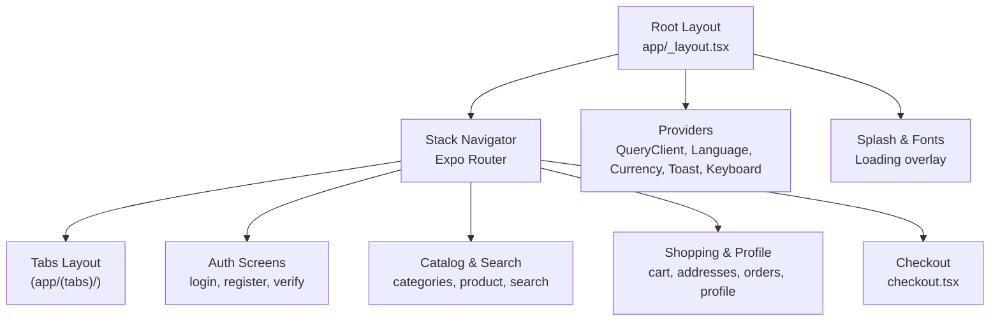
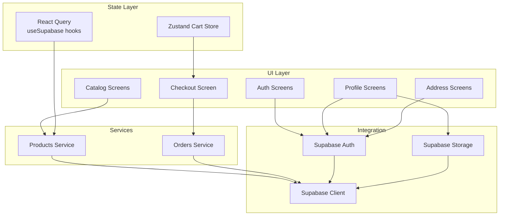
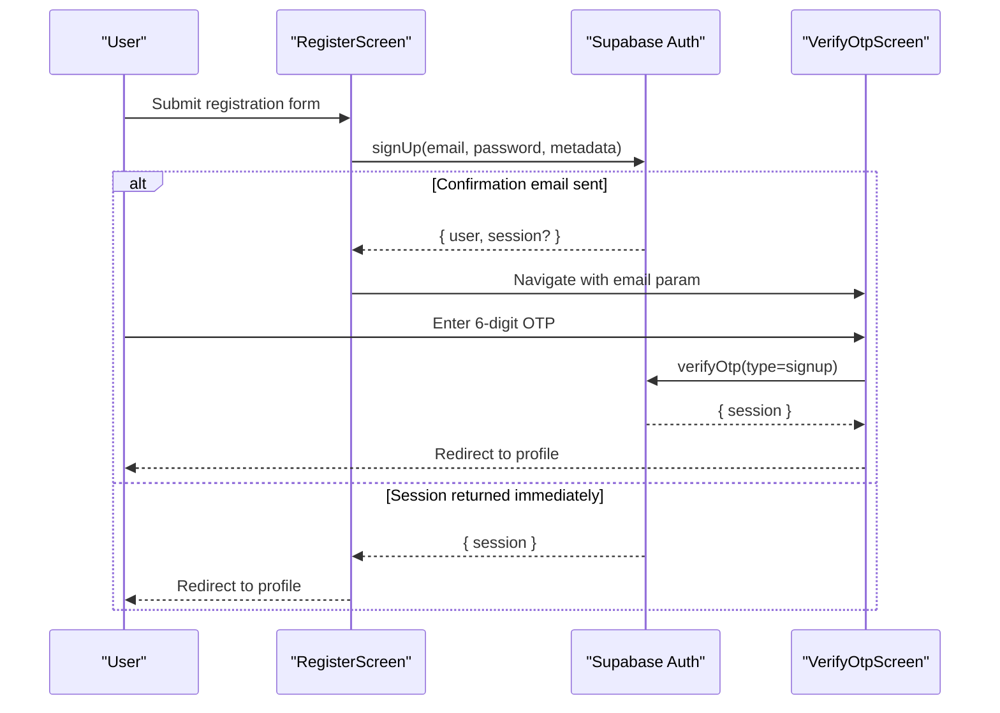
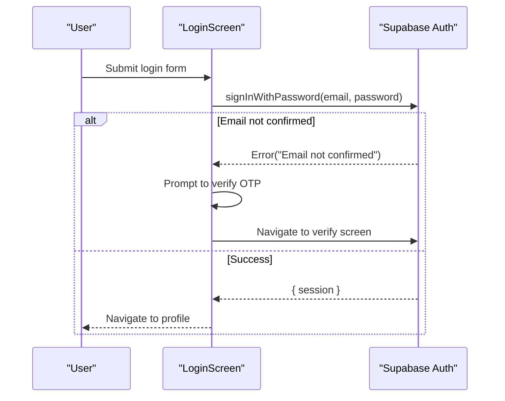
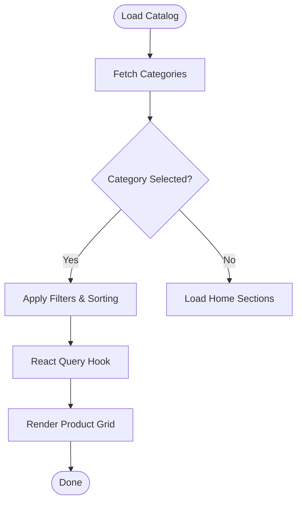
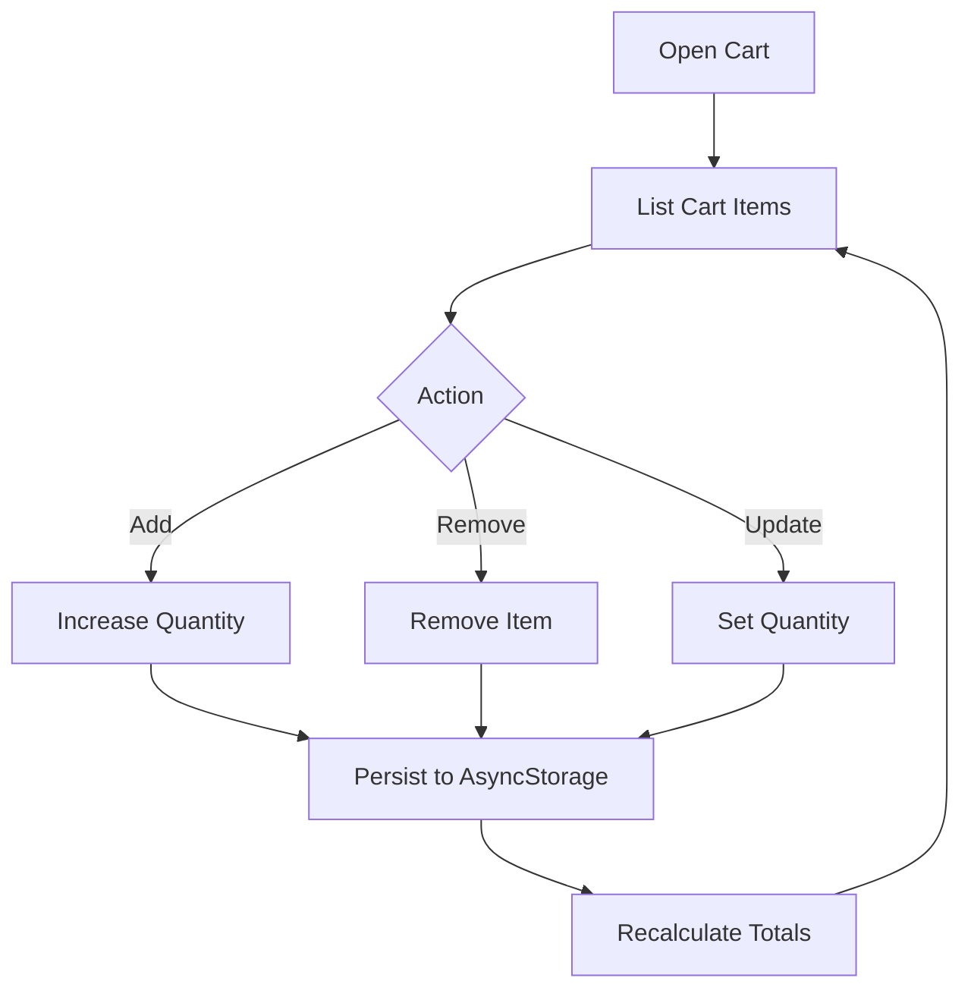
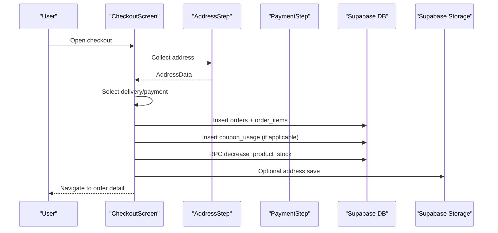
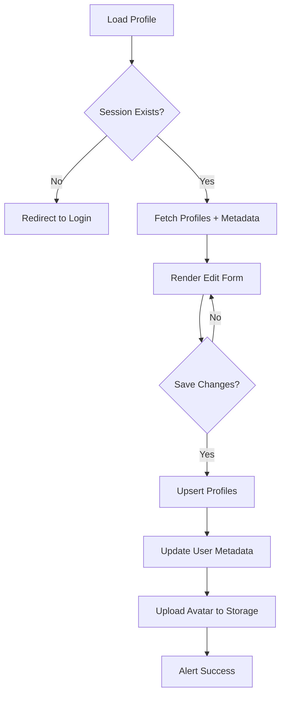
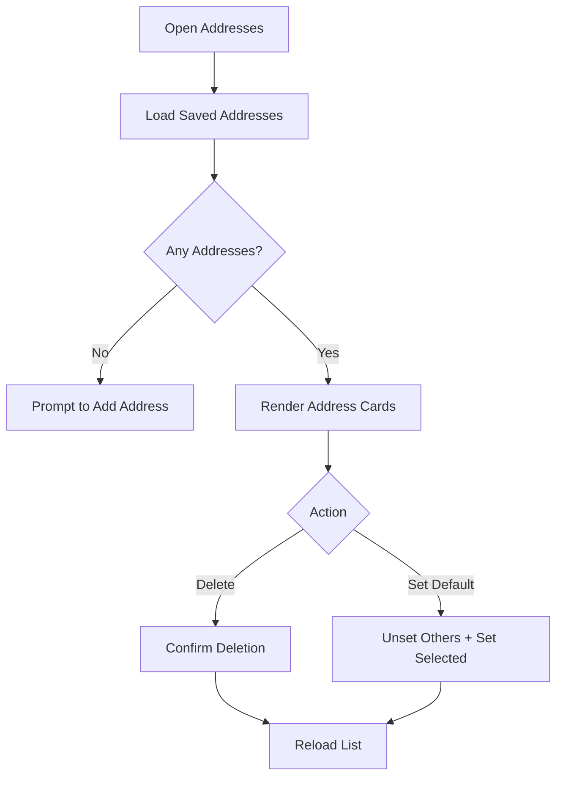
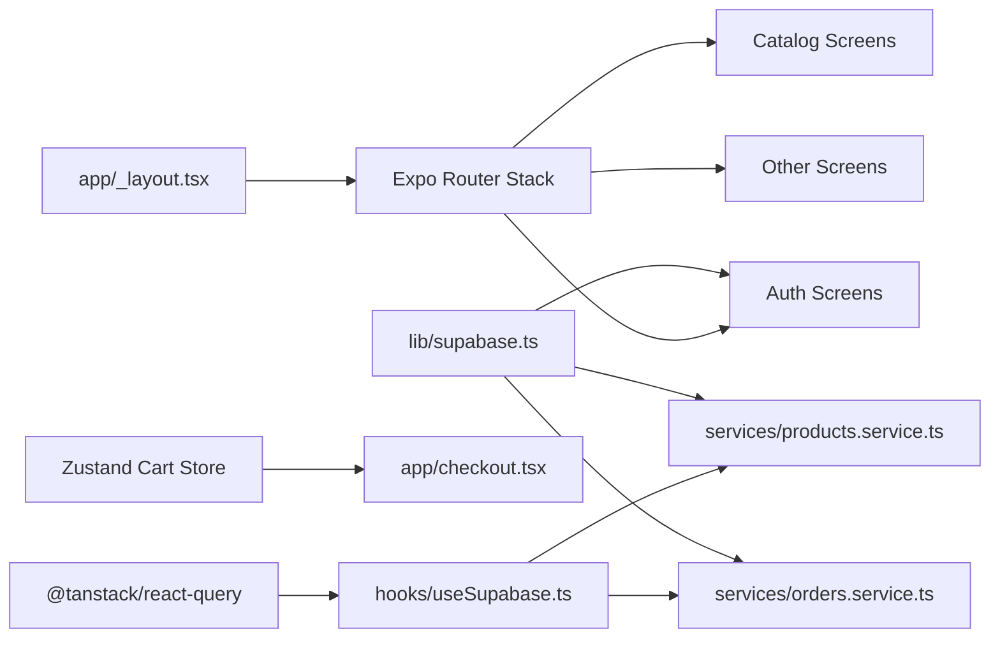

# Mobile Application (React Native)

<cite>
**Referenced Files in This Document**
- [App.tsx](file://App.tsx)
- [app/_layout.tsx](file://app/_layout.tsx)
- [lib/supabase.ts](file://lib/supabase.ts)
- [hooks/useSupabase.ts](file://hooks/useSupabase.ts)
- [store/cartStore.ts](file://store/cartStore.ts)
- [app/auth/login.tsx](file://app/auth/login.tsx)
- [app/auth/register.tsx](file://app/auth/register.tsx)
- [app/auth/verify.tsx](file://app/auth/verify.tsx)
- [services/products.service.ts](file://services/products.service.ts)
- [services/orders.service.ts](file://services/orders.service.ts)
- [app/checkout.tsx](file://app/checkout.tsx)
- [components/checkout/AddressStep.tsx](file://components/checkout/AddressStep.tsx)
- [components/checkout/PaymentStep.tsx](file://components/checkout/PaymentStep.tsx)
- [app/profile/edit.tsx](file://app/profile/edit.tsx)
- [app/addresses.tsx](file://app/addresses.tsx)
</cite>

## Table of Contents
1. [Introduction](#introduction)
2. [Project Structure](#project-structure)
3. [Core Components](#core-components)
4. [Architecture Overview](#architecture-overview)
5. [Detailed Component Analysis](#detailed-component-analysis)
6. [Dependency Analysis](#dependency-analysis)
7. [Performance Considerations](#performance-considerations)
8. [Troubleshooting Guide](#troubleshooting-guide)
9. [Conclusion](#conclusion)
10. [Appendices](#appendices)

## Introduction
This document explains the React Native mobile application built with Expo Router for navigation and a tab-based interface. It covers the authentication system (registration, login, email verification, session management), product catalog (browsing, searching, filtering, product details), shopping experience (cart, wishlist, addresses, order history), checkout (multi-step flow, payment integration, order confirmation), user profile management, mobile-specific UI patterns, state management, and Supabase integration. It also provides troubleshooting guidance for common mobile development issues.

## Project Structure
The application uses a file-based routing approach with Expo Router. The root layout configures providers, navigation stack, fonts, splash screen, and global UI helpers. Navigation is organized under app/ with nested tabs and standalone screens for authentication, checkout, and profile management.

**Diagram sources**
- [app/_layout.tsx:34-107](file://app/_layout.tsx#L34-L107)

**Section sources**
- [app/_layout.tsx:1-108](file://app/_layout.tsx#L1-L108)

## Core Components
- Navigation and Routing: Expo Router Stack and Tabs define routes and transitions.
- Authentication: Supabase Auth handles sign-up, sign-in, OTP verification, and session persistence.
- Catalog: Services and hooks fetch and filter products, categories, and banners.
- Shopping: Zustand-based cart store persists locally and computes totals.
- Checkout: Multi-step form integrates address selection, delivery method, payment method, and order submission.
- Profile: Edit profile screen updates user metadata and avatar via Supabase Storage.
- Addresses: CRUD for saved addresses with default selection.

**Section sources**
- [lib/supabase.ts:1-30](file://lib/supabase.ts#L1-L30)
- [hooks/useSupabase.ts:1-239](file://hooks/useSupabase.ts#L1-L239)
- [store/cartStore.ts:1-174](file://store/cartStore.ts#L1-L174)
- [services/products.service.ts:1-449](file://services/products.service.ts#L1-L449)
- [services/orders.service.ts:1-115](file://services/orders.service.ts#L1-L115)

## Architecture Overview
The app follows a layered architecture:
- UI Layer: Screens and components (authentication, catalog, checkout, profile).
- State Management: React Query for server state, Zustand for local cart state.
- Services: Typed service functions encapsulate Supabase queries and mutations.
- Supabase Integration: Auth, database, and storage clients configured with AsyncStorage.

**Diagram sources**
- [lib/supabase.ts:19-30](file://lib/supabase.ts#L19-L30)
- [hooks/useSupabase.ts:10-36](file://hooks/useSupabase.ts#L10-L36)
- [store/cartStore.ts:51-164](file://store/cartStore.ts#L51-L164)
- [services/products.service.ts:6-8](file://services/products.service.ts#L6-L8)
- [services/orders.service.ts:6-8](file://services/orders.service.ts#L6-L8)

## Detailed Component Analysis

### Authentication System
The authentication flow supports registration, login, email verification, and session management:
- Registration validates inputs, normalizes data, and triggers Supabase sign-up. Handles confirmation email flow and redirects accordingly.
- Login validates credentials, handles “Email not confirmed,” and navigates to verification or profile.
- Verification OTP screen resends code and verifies the token, enabling session.

**Diagram sources**
- [app/auth/register.tsx:92-149](file://app/auth/register.tsx#L92-L149)
- [app/auth/verify.tsx:43-71](file://app/auth/verify.tsx#L43-L71)

**Diagram sources**
- [app/auth/login.tsx:50-85](file://app/auth/login.tsx#L50-L85)

**Section sources**
- [app/auth/register.tsx:64-324](file://app/auth/register.tsx#L64-L324)
- [app/auth/login.tsx:33-171](file://app/auth/login.tsx#L33-L171)
- [app/auth/verify.tsx:12-145](file://app/auth/verify.tsx#L12-L145)
- [lib/supabase.ts:19-30](file://lib/supabase.ts#L19-L30)

### Product Catalog
The catalog leverages typed services and React Query hooks:
- Fetch lists: best sellers, trending, new arrivals, special offers, random products.
- Filter and sort: by category, subcategory, price range, stock availability, and sort options.
- Search: full-text search across localized names.
- Details: fetch single product with full description fields.

**Diagram sources**
- [hooks/useSupabase.ts:41-238](file://hooks/useSupabase.ts#L41-L238)
- [services/products.service.ts:18-449](file://services/products.service.ts#L18-L449)

**Section sources**
- [hooks/useSupabase.ts:1-239](file://hooks/useSupabase.ts#L1-L239)
- [services/products.service.ts:1-449](file://services/products.service.ts#L1-L449)

### Shopping Experience
Cart management uses a Zustand store with AsyncStorage persistence:
- Add/remove/update quantities with stock validation.
- Totals computed and hydrated from persisted storage.
- Currency formatting helpers included.

**Diagram sources**
- [store/cartStore.ts:51-164](file://store/cartStore.ts#L51-L164)

**Section sources**
- [store/cartStore.ts:1-174](file://store/cartStore.ts#L1-L174)

### Checkout Process
The checkout is a multi-step flow with a modern stepper:
- Step 1: Address selection with city picker, optional map pinning, and saved addresses.
- Step 2: Delivery method and payment method selection.
- Step 3: Review order summary and place order.
- On submit: creates order, order items, coupon usage, decreases product stock, clears cart, and navigates to order detail.

**Diagram sources**
- [app/checkout.tsx:25-491](file://app/checkout.tsx#L25-L491)
- [components/checkout/AddressStep.tsx:16-233](file://components/checkout/AddressStep.tsx#L16-L233)
- [components/checkout/PaymentStep.tsx:12-69](file://components/checkout/PaymentStep.tsx#L12-L69)
- [services/orders.service.ts:12-21](file://services/orders.service.ts#L12-L21)

**Section sources**
- [app/checkout.tsx:25-491](file://app/checkout.tsx#L25-L491)
- [components/checkout/AddressStep.tsx:16-233](file://components/checkout/AddressStep.tsx#L16-L233)
- [components/checkout/PaymentStep.tsx:12-69](file://components/checkout/PaymentStep.tsx#L12-L69)
- [services/orders.service.ts:1-115](file://services/orders.service.ts#L1-L115)

### User Profile Management
The edit profile screen:
- Loads user session and profile data (fallback to user metadata).
- Allows updating name, phone, and avatar via Supabase Storage.
- Persists changes to profiles table and user metadata.

**Diagram sources**
- [app/profile/edit.tsx:25-634](file://app/profile/edit.tsx#L25-L634)

**Section sources**
- [app/profile/edit.tsx:25-634](file://app/profile/edit.tsx#L25-L634)

### Address Handling
The addresses screen:
- Lists saved addresses with default indicator.
- Supports setting default address and deleting addresses.
- Integrates with the checkout to prefill address and save new ones.

**Diagram sources**
- [app/addresses.tsx:10-355](file://app/addresses.tsx#L10-L355)

**Section sources**
- [app/addresses.tsx:10-355](file://app/addresses.tsx#L10-L355)

## Dependency Analysis
- Navigation: app/_layout.tsx defines the Stack and registers all screens.
- State: React Query client wraps the app; hooks in hooks/useSupabase.ts centralize data fetching.
- Persistence: Zustand cart store persists to AsyncStorage; Supabase auth persists sessions via AsyncStorage.
- Services: services/products.service.ts and services/orders.service.ts encapsulate Supabase operations.
- UI: Shared components under components/checkout and components/ui support checkout and catalog.

**Diagram sources**
- [app/_layout.tsx:62-82](file://app/_layout.tsx#L62-L82)
- [hooks/useSupabase.ts:7-36](file://hooks/useSupabase.ts#L7-L36)
- [store/cartStore.ts:1-4](file://store/cartStore.ts#L1-L4)
- [lib/supabase.ts:19-30](file://lib/supabase.ts#L19-L30)

**Section sources**
- [app/_layout.tsx:1-108](file://app/_layout.tsx#L1-L108)
- [hooks/useSupabase.ts:1-239](file://hooks/useSupabase.ts#L1-L239)
- [store/cartStore.ts:1-174](file://store/cartStore.ts#L1-L174)
- [lib/supabase.ts:1-30](file://lib/supabase.ts#L1-L30)

## Performance Considerations
- Lazy loading and splash: Font loading and splash screen prevent rendering until ready.
- Query caching: React Query caches network requests to avoid redundant calls.
- Local persistence: Cart stored in AsyncStorage reduces server round-trips.
- Minimal re-renders: Zustand slice selectors and shallow equality reduce updates.
- Keyboard handling: Keyboard-aware scroll views improve usability on small screens.
- Image uploads: Avatar uploads convert to ArrayBuffer and reuse session context.

[No sources needed since this section provides general guidance]

## Troubleshooting Guide
Common issues and resolutions:
- Authentication
  - Invalid credentials or unconfirmed email: handled with localized alerts and navigation to verification.
  - Network errors during registration: surfaced via error messages and retry prompts.
- Checkout
  - Empty cart: warns and navigates back to home.
  - Stock validation: throws when requested quantity exceeds available stock.
  - Payment method not yet supported: UI disables unavailable options.
- Profile
  - Session expired: redirects to login on save.
  - Avatar upload failures: logs and shows error alert.
- Addresses
  - Permission denied for gallery: requests permission and informs user.
  - Deleting default address: ensures another default exists after deletion.

**Section sources**
- [app/auth/login.tsx:23-85](file://app/auth/login.tsx#L23-L85)
- [app/auth/register.tsx:114-149](file://app/auth/register.tsx#L114-L149)
- [app/checkout.tsx:90-93](file://app/checkout.tsx#L90-L93)
- [store/cartStore.ts:64-82](file://store/cartStore.ts#L64-L82)
- [app/profile/edit.tsx:162-222](file://app/profile/edit.tsx#L162-L222)
- [app/addresses.tsx:47-72](file://app/addresses.tsx#L47-L72)

## Conclusion
The application implements a robust, modular React Native architecture with Expo Router for navigation, Supabase for backend services, React Query for data fetching, and Zustand for local state. The authentication, catalog, shopping, checkout, and profile features are designed with mobile-first UX patterns, accessibility, and performance in mind.

[No sources needed since this section summarizes without analyzing specific files]

## Appendices

### Navigation Patterns
- Stack screens registered centrally for consistent animations and behavior.
- Tab layout organizes primary app sections.
- Deep linking via params (e.g., email in verification) enables seamless flows.

**Section sources**
- [app/_layout.tsx:62-82](file://app/_layout.tsx#L62-L82)

### State Management Strategies
- React Query: centralized data fetching, caching, and invalidation.
- Zustand: lightweight local state for cart with persistence.
- Context providers: language, currency, toast, keyboard, safe area.

**Section sources**
- [hooks/useSupabase.ts:41-238](file://hooks/useSupabase.ts#L41-L238)
- [store/cartStore.ts:51-164](file://store/cartStore.ts#L51-L164)
- [app/_layout.tsx:55-105](file://app/_layout.tsx#L55-L105)

### Supabase Integration Highlights
- Auth: client configured with AsyncStorage for session persistence.
- Database: typed service functions for products and orders.
- Storage: avatar uploads and public URL retrieval.

**Section sources**
- [lib/supabase.ts:19-30](file://lib/supabase.ts#L19-L30)
- [services/products.service.ts:6-8](file://services/products.service.ts#L6-L8)
- [services/orders.service.ts:6-8](file://services/orders.service.ts#L6-L8)
- [app/profile/edit.tsx:178-207](file://app/profile/edit.tsx#L178-L207)