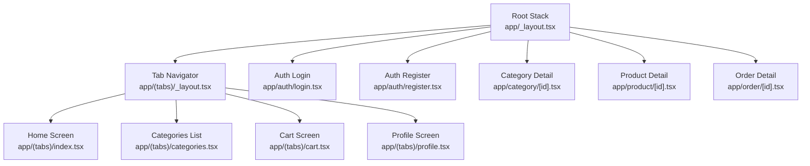
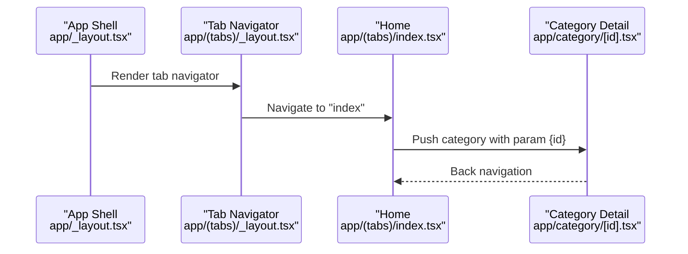
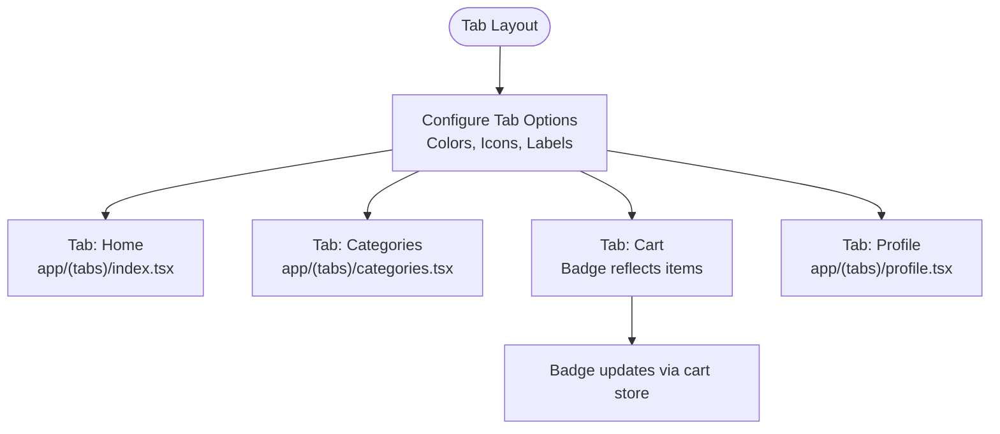
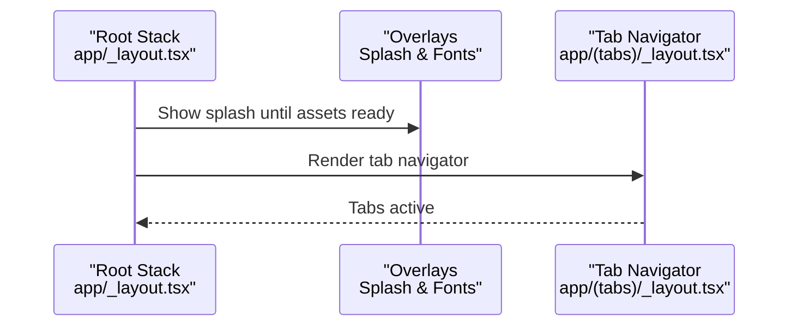
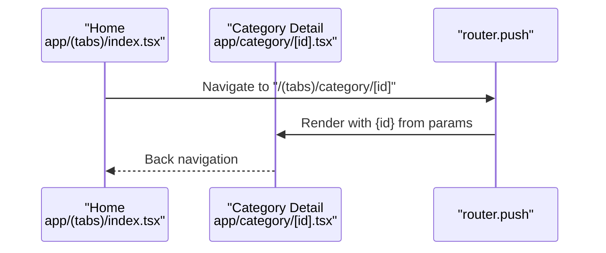
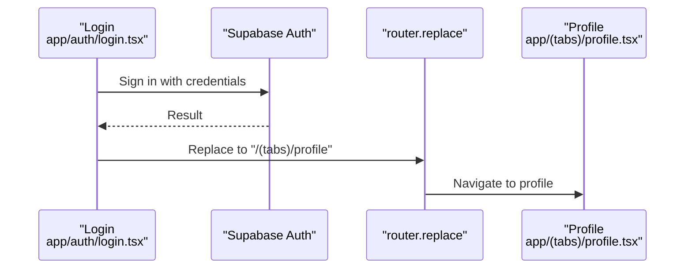
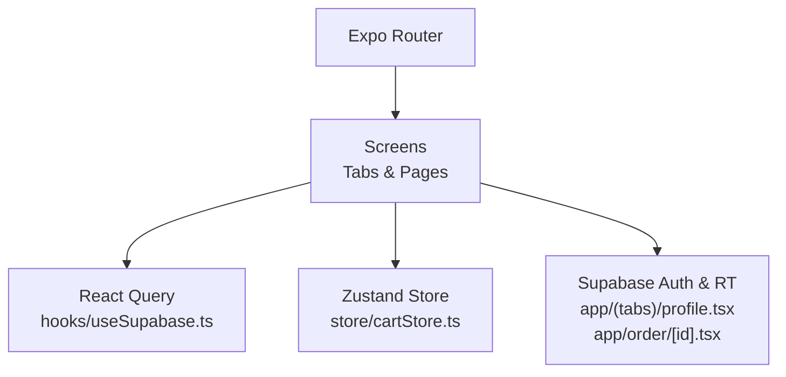

# Navigation System

<cite>
**Referenced Files in This Document**
- [app/_layout.tsx](file://app/_layout.tsx)
- [app/(tabs)/_layout.tsx](file://app/(tabs)/_layout.tsx)
- [app/(tabs)/index.tsx](file://app/(tabs)/index.tsx)
- [app/(tabs)/categories.tsx](file://app/(tabs)/categories.tsx)
- [app/(tabs)/cart.tsx](file://app/(tabs)/cart.tsx)
- [app/(tabs)/profile.tsx](file://app/(tabs)/profile.tsx)
- [app/category/[id].tsx](file://app/category/[id].tsx)
- [app/product/[id].tsx](file://app/product/[id].tsx)
- [app/order/[id].tsx](file://app/order/[id].tsx)
- [app/auth/login.tsx](file://app/auth/login.tsx)
- [app/auth/register.tsx](file://app/auth/register.tsx)
- [store/cartStore.ts](file://store/cartStore.ts)
- [hooks/useSupabase.ts](file://hooks/useSupabase.ts)
</cite>

## Table of Contents
1. [Introduction](#introduction)
2. [Project Structure](#project-structure)
3. [Core Components](#core-components)
4. [Architecture Overview](#architecture-overview)
5. [Detailed Component Analysis](#detailed-component-analysis)
6. [Dependency Analysis](#dependency-analysis)
7. [Performance Considerations](#performance-considerations)
8. [Troubleshooting Guide](#troubleshooting-guide)
9. [Conclusion](#conclusion)

## Introduction
This document explains the mobile navigation system built with Expo Router. It covers the tab-based navigation architecture, stack navigation patterns, route configuration, and the main tabs (home, categories, cart, profile). It also documents programmatic navigation, route parameters handling, deep linking considerations, and navigation state management. Practical examples demonstrate navigation between screens, handling navigation events, and implementing custom behaviors. Finally, it provides performance optimization tips and best practices tailored for mobile applications.

## Project Structure
The navigation system is organized around:
- Root stack that defines global routes and overlays (splash, loading).
- A tab navigator that hosts the primary app sections.
- Route-specific screens under app/ and app/(tabs)/ that implement navigation patterns and route parameters.

**Diagram sources**
- [app/_layout.tsx:62-82](file://app/_layout.tsx#L62-L82)
- [app/(tabs)/_layout.tsx](file://app/(tabs)/_layout.tsx#L25-L187)

**Section sources**
- [app/_layout.tsx:52-82](file://app/_layout.tsx#L52-L82)
- [app/(tabs)/_layout.tsx](file://app/(tabs)/_layout.tsx#L16-L54)

## Core Components
- Root Stack: Declares global routes and overlays (splash, fonts loading). Ensures navigation context is always available.
- Tab Navigator: Defines four tabs (home, categories, cart, profile) with custom icons, badges, and safe area-aware styling.
- Route Screens:
  - Home: Dynamic sections, promotional slots, and category navigation.
  - Categories: Lists main categories and navigates to category details.
  - Cart: Shopping cart with coupon handling, totals, and checkout navigation.
  - Profile: Authentication-aware profile with settings and actions.
  - Category Detail: Filterable product listings with sorting and bottom sheets.
  - Product Detail: Product view with add-to-cart and quick-tab bar.
  - Order Detail: Order view with real-time updates and cancellation flow.
  - Auth Screens: Login and registration flows with programmatic navigation.

**Section sources**
- [app/_layout.tsx:62-82](file://app/_layout.tsx#L62-L82)
- [app/(tabs)/_layout.tsx](file://app/(tabs)/_layout.tsx#L25-L187)
- [app/(tabs)/index.tsx](file://app/(tabs)/index.tsx#L114-L366)
- [app/(tabs)/categories.tsx](file://app/(tabs)/categories.tsx#L28-L77)
- [app/(tabs)/cart.tsx](file://app/(tabs)/cart.tsx#L142-L301)
- [app/(tabs)/profile.tsx](file://app/(tabs)/profile.tsx#L18-L44)
- [app/category/[id].tsx](file://app/category/[id].tsx#L15-L433)
- [app/product/[id].tsx](file://app/product/[id].tsx#L18-L324)
- [app/order/[id].tsx](file://app/order/[id].tsx#L10-L46)
- [app/auth/login.tsx:33-85](file://app/auth/login.tsx#L33-L85)
- [app/auth/register.tsx:64-149](file://app/auth/register.tsx#L64-L149)

## Architecture Overview
The navigation architecture combines a root Stack with a nested Tab Navigator. The Stack manages global routes and overlays, while the Tabs host the main app sections. Programmatic navigation uses Expo Router’s router APIs, and route parameters are handled via dynamic routes and local parameters.

**Diagram sources**
- [app/_layout.tsx:62-82](file://app/_layout.tsx#L62-L82)
- [app/(tabs)/_layout.tsx](file://app/(tabs)/_layout.tsx#L25-L187)
- [app/(tabs)/index.tsx](file://app/(tabs)/index.tsx#L124-L125)
- [app/category/[id].tsx](file://app/category/[id].tsx#L96-L98)

## Detailed Component Analysis

### Tab-Based Navigation
The tab navigator defines four tabs with custom styling, icons, and a badge on the cart tab reflecting the number of items. The header is provided by a shared component and hidden for tab screens.

**Diagram sources**
- [app/(tabs)/_layout.tsx](file://app/(tabs)/_layout.tsx#L25-L187)
- [store/cartStore.ts:19-29](file://store/cartStore.ts#L19-L29)

**Section sources**
- [app/(tabs)/_layout.tsx](file://app/(tabs)/_layout.tsx#L16-L187)
- [store/cartStore.ts:51-164](file://store/cartStore.ts#L51-L164)

### Stack Navigation Patterns
The root Stack declares routes for all screens, including nested tabs, auth, checkout, search, and product/category details. Overlays (splash and fonts loading) are rendered on top of the Stack.

**Diagram sources**
- [app/_layout.tsx:54-99](file://app/_layout.tsx#L54-L99)
- [app/_layout.tsx:62-82](file://app/_layout.tsx#L62-L82)

**Section sources**
- [app/_layout.tsx:52-107](file://app/_layout.tsx#L52-L107)

### Route Configuration and Parameters
- Dynamic routes:
  - Category detail: app/category/[id].tsx receives id via local parameters.
  - Product detail: app/product/[id].tsx receives id via local parameters.
  - Order detail: app/order/[id].tsx receives id and optional isNewOrder flag.
- Programmatic navigation:
  - Home navigates to category detail using router.push with a path including the id.
  - Categories lists navigate to category detail similarly.
  - Cart passes coupon data via router.push params to checkout.
  - Auth screens redirect to tabs/profile upon successful sign-in/sign-up.

**Diagram sources**
- [app/(tabs)/index.tsx](file://app/(tabs)/index.tsx#L124-L125)
- [app/category/[id].tsx](file://app/category/[id].tsx#L16-L18)

**Section sources**
- [app/category/[id].tsx](file://app/category/[id].tsx#L15-L49)
- [app/product/[id].tsx](file://app/product/[id].tsx#L18-L22)
- [app/order/[id].tsx](file://app/order/[id].tsx#L10-L17)
- [app/(tabs)/index.tsx](file://app/(tabs)/index.tsx#L124-L125)
- [app/(tabs)/categories.tsx](file://app/(tabs)/categories.tsx#L31-L31)
- [app/(tabs)/cart.tsx](file://app/(tabs)/cart.tsx#L389-L396)

### Navigation Guards and Authentication Protection
- Auth flows:
  - Login validates credentials and navigates to profile on success.
  - Registration handles validation, normalization, and redirects to verification or profile.
- Profile screen subscribes to Supabase auth state changes and clears cart on logout.

**Diagram sources**
- [app/auth/login.tsx:50-84](file://app/auth/login.tsx#L50-L84)
- [app/(tabs)/profile.tsx](file://app/(tabs)/profile.tsx#L27-L44)

**Section sources**
- [app/auth/login.tsx:33-85](file://app/auth/login.tsx#L33-L85)
- [app/auth/register.tsx:92-149](file://app/auth/register.tsx#L92-L149)
- [app/(tabs)/profile.tsx](file://app/(tabs)/profile.tsx#L81-L99)

### Programmatic Navigation Examples
- Navigating from Home to Category:
  - Use router.push with a path including the category id.
- Navigating from Cart to Checkout:
  - Pass coupon data via router.push params to checkout.
- Returning to Tabs from Product Detail:
  - Use router.replace to switch tabs without adding to history.

**Section sources**
- [app/(tabs)/index.tsx](file://app/(tabs)/index.tsx#L124-L125)
- [app/(tabs)/cart.tsx](file://app/(tabs)/cart.tsx#L389-L396)
- [app/product/[id].tsx](file://app/product/[id].tsx#L227-L228)

### Deep Linking and Route Parameters Handling
- Dynamic segments:
  - [id] in category and product routes are extracted via local parameters.
- Parameter usage:
  - Category detail uses id to fetch subcategories and products.
  - Product detail uses id to fetch product and similar products.
  - Order detail uses id and isNewOrder to hydrate UI and enable cancellation.

**Section sources**
- [app/category/[id].tsx](file://app/category/[id].tsx#L15-L49)
- [app/product/[id].tsx](file://app/product/[id].tsx#L18-L33)
- [app/order/[id].tsx](file://app/order/[id].tsx#L10-L17)

### Navigation State Management
- Cart state:
  - Zustand store persists cart to AsyncStorage and recalculates totals on hydration.
  - Cart badge updates reflect item count in the tab bar.
- Real-time updates:
  - Order detail subscribes to Supabase channel for live status updates.

**Section sources**
- [store/cartStore.ts:51-164](file://store/cartStore.ts#L51-L164)
- [app/order/[id].tsx](file://app/order/[id].tsx#L24-L46)

### Custom Navigation Behaviors
- Bottom tab bar in Product Detail:
  - Provides quick navigation to Home, Categories, Cart, and Profile.
- Sorting and filtering:
  - Category Detail uses bottom sheets to manage sort options and filters.
- Coupon handling:
  - Cart applies and removes coupons, updating totals dynamically.

**Section sources**
- [app/product/[id].tsx](file://app/product/[id].tsx#L216-L321)
- [app/category/[id].tsx](file://app/category/[id].tsx#L302-L430)
- [app/(tabs)/cart.tsx](file://app/(tabs)/cart.tsx#L48-L114)

## Dependency Analysis
The navigation system relies on:
- Expo Router for routing and navigation APIs.
- React Query for data fetching and caching.
- Zustand for client-side state management (cart).
- Supabase for authentication and real-time updates.

**Diagram sources**
- [hooks/useSupabase.ts:7-36](file://hooks/useSupabase.ts#L7-L36)
- [store/cartStore.ts:1-4](file://store/cartStore.ts#L1-L4)
- [app/(tabs)/profile.tsx](file://app/(tabs)/profile.tsx#L27-L44)
- [app/order/[id].tsx](file://app/order/[id].tsx#L24-L46)

**Section sources**
- [hooks/useSupabase.ts:1-239](file://hooks/useSupabase.ts#L1-L239)
- [store/cartStore.ts:1-174](file://store/cartStore.ts#L1-L174)

## Performance Considerations
- Prefer preloading and caching:
  - Use React Query’s query keys and enabled flags to avoid unnecessary requests.
- Optimize rendering:
  - Use FlatList/ScrollView with appropriate content container styles.
  - Memoize callbacks and selectors to prevent re-renders.
- Navigation efficiency:
  - Avoid redundant router.push calls; reuse params when possible.
  - Use replace for tab switching to reduce history depth.
- State persistence:
  - Persist cart to minimize re-computation on app restart.
- Overlays:
  - Keep splash and loading overlays minimal to reduce perceived latency.

## Troubleshooting Guide
- Navigation does not update tab badge:
  - Verify cart store updates and that the tab layout reads the item count.
- Auth state not reflected:
  - Ensure onAuthStateChange subscriptions are active and cleaned up properly.
- Dynamic route params missing:
  - Confirm useLocalSearchParams is used and the route segment matches the file path.
- Real-time order updates not appearing:
  - Check channel subscription and cleanup on unmount.

**Section sources**
- [store/cartStore.ts:51-164](file://store/cartStore.ts#L51-L164)
- [app/(tabs)/profile.tsx](file://app/(tabs)/profile.tsx#L27-L44)
- [app/category/[id].tsx](file://app/category/[id].tsx#L15-L18)
- [app/order/[id].tsx](file://app/order/[id].tsx#L24-L46)

## Conclusion
The navigation system leverages Expo Router’s Stack and Tabs to deliver a structured, scalable mobile experience. It integrates programmatic navigation, route parameters, authentication flows, and real-time updates. By following the patterns documented here—using dynamic routes, managing state with Zustand, and optimizing with React Query—you can extend and maintain the navigation system effectively while ensuring smooth performance and a robust user experience.