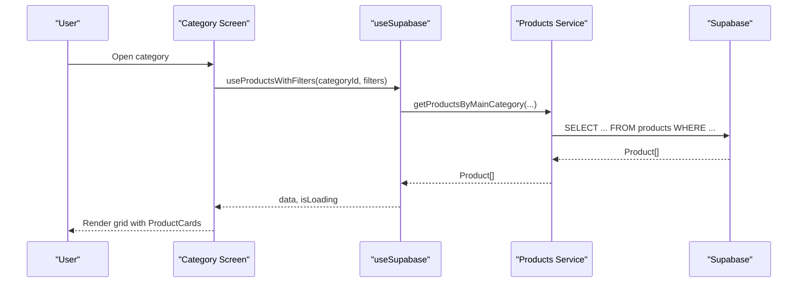
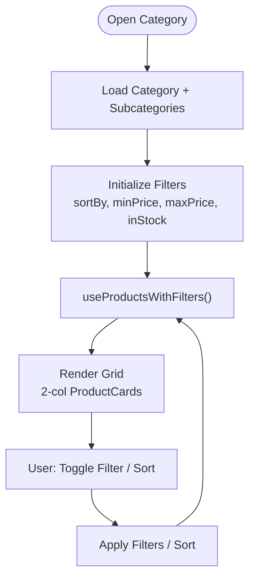
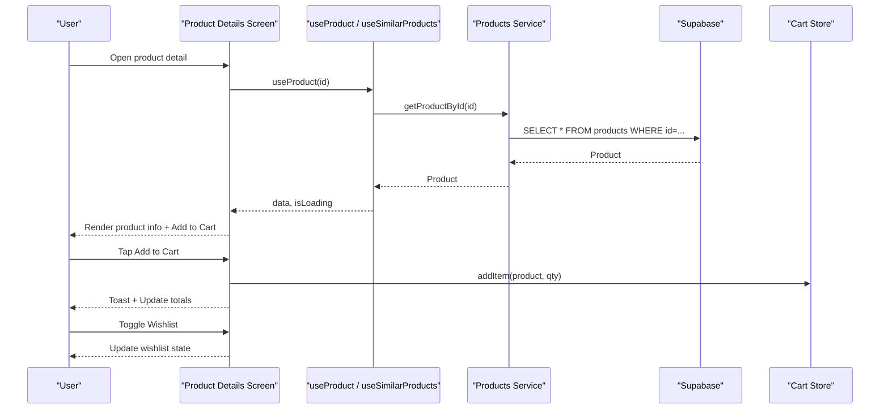
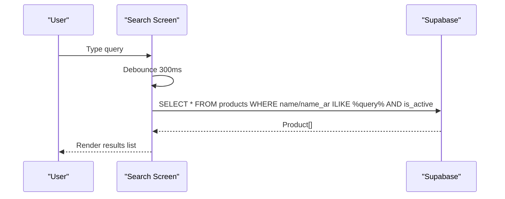
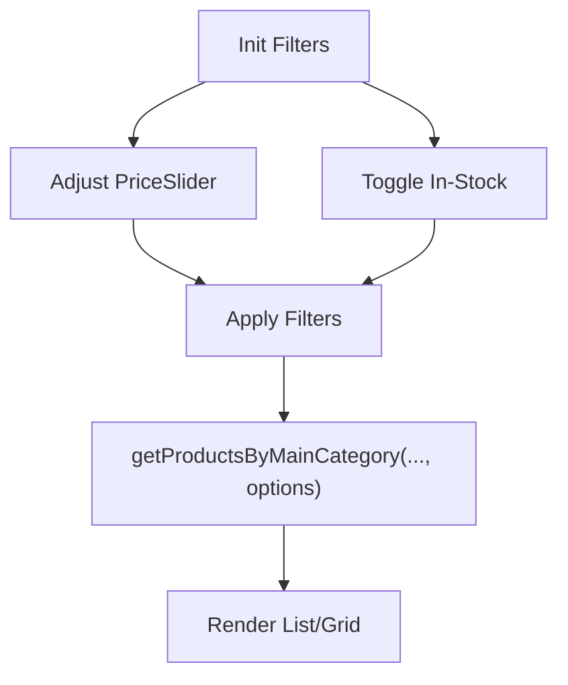
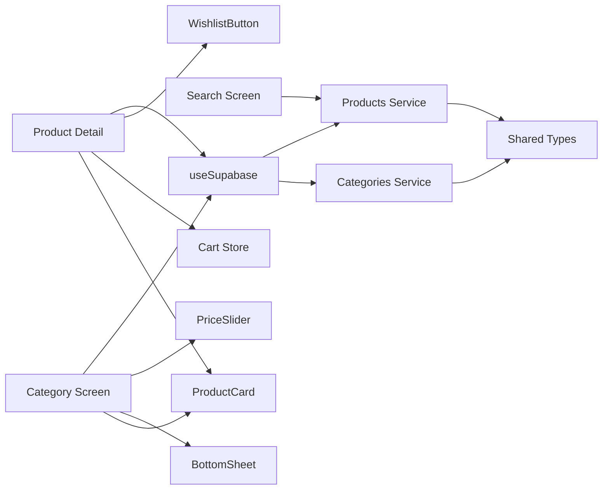

# Product Catalog

<cite>
**Referenced Files in This Document**
- [app/product/[id].tsx](file://app/product/[id].tsx)
- [app/category/[id].tsx](file://app/category/[id].tsx)
- [app/search.tsx](file://app/search.tsx)
- [services/products.service.ts](file://services/products.service.ts)
- [services/categories.service.ts](file://services/categories.service.ts)
- [hooks/useSupabase.ts](file://hooks/useSupabase.ts)
- [components/ui/ProductCard.tsx](file://components/ui/ProductCard.tsx)
- [components/ui/WishlistButton.tsx](file://components/ui/WishlistButton.tsx)
- [components/ui/PriceSlider.tsx](file://components/ui/PriceSlider.tsx)
- [components/ui/BottomSheet.tsx](file://components/ui/BottomSheet.tsx)
- [components/ui/Skeleton.tsx](file://components/ui/Skeleton.tsx)
- [store/cartStore.ts](file://store/cartStore.ts)
- [shared/types.ts](file://shared/types.ts)
</cite>

## Table of Contents
1. [Introduction](#introduction)
2. [Project Structure](#project-structure)
3. [Core Components](#core-components)
4. [Architecture Overview](#architecture-overview)
5. [Detailed Component Analysis](#detailed-component-analysis)
6. [Dependency Analysis](#dependency-analysis)
7. [Performance Considerations](#performance-considerations)
8. [Troubleshooting Guide](#troubleshooting-guide)
9. [Conclusion](#conclusion)

## Introduction
This document explains the mobile product catalog functionality, covering product listing, category navigation, search, and product detail views. It documents data fetching via Supabase, caching strategies using React Query, real-time updates, filtering and sorting, infinite scrolling considerations, performance optimizations, product images handling, loading states, error scenarios, product recommendations, wishlisting integration, and inventory status display.

## Project Structure
The product catalog spans UI screens, service layers, hooks, and stores:
- Screens: product listing by category, product detail, and search
- Services: typed database queries for products and categories
- Hooks: React Query wrappers around services
- UI components: cards, skeletons, price slider, bottom sheet, wishlist button
- Store: client-side cart persistence and totals calculation

```mermaid
graph TB
subgraph "Screens"
Cat["Category Screen<br/>(app/category/[id].tsx)"]
Prod["Product Detail Screen<br/>(app/product/[id].tsx)"]
Search["Search Screen<br/>(app/search.tsx)"]
end
subgraph "Services"
SProd["Products Service<br/>(services/products.service.ts)"]
SCat["Categories Service<br/>(services/categories.service.ts)"]
end
subgraph "Hooks"
Hook["useSupabase Hooks<br/>(hooks/useSupabase.ts)"]
end
subgraph "UI"
Card["ProductCard<br/>(components/ui/ProductCard.tsx)"]
Wish["WishlistButton<br/>(components/ui/WishlistButton.tsx)"]
Price["PriceSlider<br/>(components/ui/PriceSlider.tsx)"]
Sheet["BottomSheet<br/>(components/ui/BottomSheet.tsx)"]
Skel["Skeleton<br/>(components/ui/Skeleton.tsx)"]
end
subgraph "Store"
Cart["Cart Store<br/>(store/cartStore.ts)"]
end
subgraph "Types"
Types["Shared Types<br/>(shared/types.ts)"]
end
Cat --> Hook
Prod --> Hook
Search --> SProd
Hook --> SProd
Hook --> SCat
Cat --> Card
Prod --> Card
Cat --> Price
Cat --> Sheet
Cat --> Skel
Prod --> Wish
Prod --> Cart
SProd --> Types
SCat --> Types
```

**Diagram sources**
- [app/category/[id].tsx](file://app/category/[id].tsx#L1-L434)
- [app/product/[id].tsx](file://app/product/[id].tsx#L1-L325)
- [app/search.tsx:1-192](file://app/search.tsx#L1-L192)
- [services/products.service.ts:1-449](file://services/products.service.ts#L1-L449)
- [services/categories.service.ts:1-137](file://services/categories.service.ts#L1-L137)
- [hooks/useSupabase.ts:1-239](file://hooks/useSupabase.ts#L1-L239)
- [components/ui/ProductCard.tsx:1-89](file://components/ui/ProductCard.tsx#L1-L89)
- [components/ui/WishlistButton.tsx:1-155](file://components/ui/WishlistButton.tsx#L1-L155)
- [components/ui/PriceSlider.tsx:1-274](file://components/ui/PriceSlider.tsx#L1-L274)
- [components/ui/BottomSheet.tsx:1-178](file://components/ui/BottomSheet.tsx#L1-L178)
- [components/ui/Skeleton.tsx:1-81](file://components/ui/Skeleton.tsx#L1-L81)
- [store/cartStore.ts:1-174](file://store/cartStore.ts#L1-L174)
- [shared/types.ts:1-353](file://shared/types.ts#L1-L353)

**Section sources**
- [app/category/[id].tsx](file://app/category/[id].tsx#L1-L434)
- [app/product/[id].tsx](file://app/product/[id].tsx#L1-L325)
- [app/search.tsx:1-192](file://app/search.tsx#L1-L192)
- [services/products.service.ts:1-449](file://services/products.service.ts#L1-L449)
- [services/categories.service.ts:1-137](file://services/categories.service.ts#L1-L137)
- [hooks/useSupabase.ts:1-239](file://hooks/useSupabase.ts#L1-L239)
- [components/ui/ProductCard.tsx:1-89](file://components/ui/ProductCard.tsx#L1-L89)
- [components/ui/WishlistButton.tsx:1-155](file://components/ui/WishlistButton.tsx#L1-L155)
- [components/ui/PriceSlider.tsx:1-274](file://components/ui/PriceSlider.tsx#L1-L274)
- [components/ui/BottomSheet.tsx:1-178](file://components/ui/BottomSheet.tsx#L1-L178)
- [components/ui/Skeleton.tsx:1-81](file://components/ui/Skeleton.tsx#L1-L81)
- [store/cartStore.ts:1-174](file://store/cartStore.ts#L1-L174)
- [shared/types.ts:1-353](file://shared/types.ts#L1-L353)

## Core Components
- Product listing by category with filter and sort controls
- Product detail with images, pricing, stock status, quantity selector, recommendations, and add-to-cart
- Global search with debounced query and result rendering
- Filtering by price range and stock availability
- Sorting by newest, oldest, price low/high, and name
- Wishlist toggle per product
- Skeleton loaders during initial loads
- Cart store with local persistence and totals computation

**Section sources**
- [app/category/[id].tsx](file://app/category/[id].tsx#L1-L434)
- [app/product/[id].tsx](file://app/product/[id].tsx#L1-L325)
- [app/search.tsx:1-192](file://app/search.tsx#L1-L192)
- [hooks/useSupabase.ts:104-119](file://hooks/useSupabase.ts#L104-L119)
- [components/ui/ProductCard.tsx:1-89](file://components/ui/ProductCard.tsx#L1-L89)
- [components/ui/WishlistButton.tsx:1-155](file://components/ui/WishlistButton.tsx#L1-L155)
- [components/ui/PriceSlider.tsx:1-274](file://components/ui/PriceSlider.tsx#L1-L274)
- [components/ui/Skeleton.tsx:1-81](file://components/ui/Skeleton.tsx#L1-L81)
- [store/cartStore.ts:1-174](file://store/cartStore.ts#L1-L174)

## Architecture Overview
The catalog follows a layered architecture:
- UI screens orchestrate navigation and present data
- Hooks encapsulate data fetching and caching with React Query
- Services define typed Supabase queries
- Shared types unify data contracts
- UI components are reusable and localized



**Diagram sources**
- [app/category/[id].tsx](file://app/category/[id].tsx#L36-L45)
- [hooks/useSupabase.ts:104-119](file://hooks/useSupabase.ts#L104-L119)
- [services/products.service.ts:384-448](file://services/products.service.ts#L384-L448)

## Detailed Component Analysis

### Product Listing by Category
- Fetches products for a category and optional subcategories with filters and sorting
- Renders a two-column grid of ProductCards
- Provides filter modal (price range, stock) and sort modal (6 options)
- Uses BottomSheet for filter/sort UI and PriceSlider for price range input



**Diagram sources**
- [app/category/[id].tsx](file://app/category/[id].tsx#L15-L45)
- [hooks/useSupabase.ts:104-119](file://hooks/useSupabase.ts#L104-L119)
- [components/ui/BottomSheet.tsx:1-178](file://components/ui/BottomSheet.tsx#L1-L178)
- [components/ui/PriceSlider.tsx:1-274](file://components/ui/PriceSlider.tsx#L1-L274)

**Section sources**
- [app/category/[id].tsx](file://app/category/[id].tsx#L1-L434)
- [hooks/useSupabase.ts:104-119](file://hooks/useSupabase.ts#L104-L119)
- [components/ui/BottomSheet.tsx:1-178](file://components/ui/BottomSheet.tsx#L1-L178)
- [components/ui/PriceSlider.tsx:1-274](file://components/ui/PriceSlider.tsx#L1-L274)

### Product Detail View
- Loads a single product and similar products by category
- Displays image, name, price, discount badge, stock status, quantity selector, description
- Adds to cart via cart store and shows toast feedback
- Integrates wishlist toggle with authentication guard



**Diagram sources**
- [app/product/[id].tsx](file://app/product/[id].tsx#L18-L68)
- [hooks/useSupabase.ts:179-187](file://hooks/useSupabase.ts#L179-L187)
- [services/products.service.ts:33-42](file://services/products.service.ts#L33-L42)
- [store/cartStore.ts:51-100](file://store/cartStore.ts#L51-L100)
- [components/ui/WishlistButton.tsx:78-128](file://components/ui/WishlistButton.tsx#L78-L128)

**Section sources**
- [app/product/[id].tsx](file://app/product/[id].tsx#L1-L325)
- [hooks/useSupabase.ts:179-187](file://hooks/useSupabase.ts#L179-L187)
- [store/cartStore.ts:1-174](file://store/cartStore.ts#L1-L174)
- [components/ui/WishlistButton.tsx:1-155](file://components/ui/WishlistButton.tsx#L1-L155)

### Search Implementation
- Debounced search input triggers a Supabase query across product names (localization-aware)
- Renders results in a scrollable list with product thumbnails, names, and prices
- Shows empty states and loading indicators



**Diagram sources**
- [app/search.tsx:22-51](file://app/search.tsx#L22-L51)
- [services/products.service.ts:264-274](file://services/products.service.ts#L264-L274)

**Section sources**
- [app/search.tsx:1-192](file://app/search.tsx#L1-L192)
- [services/products.service.ts:264-274](file://services/products.service.ts#L264-L274)

### Filtering and Sorting
- Filters: price range via PriceSlider, in-stock toggle
- Sorting: newest, oldest, price low/high, name A–Z/Z–A
- Applied via useProductsWithFilters and getProductsByMainCategory



**Diagram sources**
- [app/category/[id].tsx](file://app/category/[id].tsx#L21-L80)
- [components/ui/PriceSlider.tsx:31-89](file://components/ui/PriceSlider.tsx#L31-L89)
- [services/products.service.ts:384-448](file://services/products.service.ts#L384-L448)

**Section sources**
- [app/category/[id].tsx](file://app/category/[id].tsx#L55-L80)
- [components/ui/PriceSlider.tsx:1-274](file://components/ui/PriceSlider.tsx#L1-L274)
- [services/products.service.ts:384-448](file://services/products.service.ts#L384-L448)

### Infinite Scrolling
- Current screens use FlatList/FlatGrid for rendering lists but do not implement pagination or infinite scroll in the analyzed files. To add infinite scrolling, integrate pagination with range queries and append fetched pages to the list state.

[No sources needed since this section provides general guidance]

### Caching and Real-time Updates
- React Query caching: queries are keyed by parameters and reused across navigations
- No explicit real-time subscriptions are present in the analyzed files; consider adding Supabase realtime listeners for live updates if required

**Section sources**
- [hooks/useSupabase.ts:1-239](file://hooks/useSupabase.ts#L1-L239)

### Product Images, Loading States, and Errors
- Images: expo-image with contentFit and transitions
- Loading: ActivityIndicator and Skeleton placeholders
- Errors: dedicated error UI in product detail screen

**Section sources**
- [app/product/[id].tsx](file://app/product/[id].tsx#L45-L63)
- [components/ui/Skeleton.tsx:1-81](file://components/ui/Skeleton.tsx#L1-L81)

### Recommendations and Similar Products
- Similar products: useSimilarProducts hook queries products in the same category excluding the current product
- Recommendations: special offers and best sellers are available via dedicated services and hooks

**Section sources**
- [hooks/useSupabase.ts:169-176](file://hooks/useSupabase.ts#L169-L176)
- [services/products.service.ts:244-259](file://services/products.service.ts#L244-L259)
- [hooks/useSupabase.ts:124-134](file://hooks/useSupabase.ts#L124-L134)
- [hooks/useSupabase.ts:149-155](file://hooks/useSupabase.ts#L149-L155)

### Wishlisting Integration
- WishlistButton checks saved state and inserts/deletes wishlist entries
- Requires authenticated session; prompts login if missing

**Section sources**
- [components/ui/WishlistButton.tsx:1-155](file://components/ui/WishlistButton.tsx#L1-L155)
- [hooks/useSupabase.ts:169-176](file://hooks/useSupabase.ts#L169-L176)

### Inventory Status Display
- Stock status shown with icons and labels based on stock_quantity
- Add-to-cart disabled when out of stock

**Section sources**
- [app/product/[id].tsx](file://app/product/[id].tsx#L128-L138)
- [app/product/[id].tsx](file://app/product/[id].tsx#L204-L212)

### Product Cards
- ProductCard renders image, name, price, optional discount badge, and quick add-to-cart
- Supports RTL and localization

**Section sources**
- [components/ui/ProductCard.tsx:1-89](file://components/ui/ProductCard.tsx#L1-L89)

### Category Selection
- Category screen displays subcategories and navigates to subcategory pages
- Uses useCategoryWithSubcategories and renders subcategory rows with icons

**Section sources**
- [app/category/[id].tsx](file://app/category/[id].tsx#L29-L53)
- [hooks/useSupabase.ts:82-88](file://hooks/useSupabase.ts#L82-L88)

## Dependency Analysis


**Diagram sources**
- [app/category/[id].tsx](file://app/category/[id].tsx#L1-L434)
- [app/product/[id].tsx](file://app/product/[id].tsx#L1-L325)
- [app/search.tsx:1-192](file://app/search.tsx#L1-L192)
- [hooks/useSupabase.ts:1-239](file://hooks/useSupabase.ts#L1-L239)
- [services/products.service.ts:1-449](file://services/products.service.ts#L1-L449)
- [services/categories.service.ts:1-137](file://services/categories.service.ts#L1-L137)
- [components/ui/ProductCard.tsx:1-89](file://components/ui/ProductCard.tsx#L1-L89)
- [components/ui/WishlistButton.tsx:1-155](file://components/ui/WishlistButton.tsx#L1-L155)
- [components/ui/PriceSlider.tsx:1-274](file://components/ui/PriceSlider.tsx#L1-L274)
- [components/ui/BottomSheet.tsx:1-178](file://components/ui/BottomSheet.tsx#L1-L178)
- [store/cartStore.ts:1-174](file://store/cartStore.ts#L1-L174)
- [shared/types.ts:1-353](file://shared/types.ts#L1-L353)

**Section sources**
- [hooks/useSupabase.ts:1-239](file://hooks/useSupabase.ts#L1-L239)
- [services/products.service.ts:1-449](file://services/products.service.ts#L1-L449)
- [services/categories.service.ts:1-137](file://services/categories.service.ts#L1-L137)
- [shared/types.ts:1-353](file://shared/types.ts#L1-L353)

## Performance Considerations
- Prefer range queries with limit to avoid large payloads
- Use PRODUCT_LIST_FIELDS to minimize selected columns on listings
- Memoize computed values (e.g., discount percentage) and avoid unnecessary re-renders
- Use FlatList/FlatGrid with appropriate item layout and keyExtractor
- Debounce search input to reduce network requests
- Use skeleton loaders to improve perceived performance
- Persist cart locally to avoid recomputation on reload

[No sources needed since this section provides general guidance]

## Troubleshooting Guide
- Product not found: product detail screen shows an error UI with back action
- Network errors: services throw errors captured by React Query; surface user-friendly messages
- Wishlist requires login: prompt user to sign in when attempting to toggle wishlist
- Out of stock: add-to-cart disabled and UI reflects out-of-stock messaging
- Empty search results: show friendly empty state with guidance

**Section sources**
- [app/product/[id].tsx](file://app/product/[id].tsx#L53-L63)
- [components/ui/WishlistButton.tsx:84-93](file://components/ui/WishlistButton.tsx#L84-L93)
- [app/search.tsx:125-150](file://app/search.tsx#L125-L150)

## Conclusion
The product catalog leverages a clean separation of concerns: typed services, caching hooks, reusable UI components, and a persistent cart store. Filtering, sorting, and recommendations are first-class features, while loading and error states are handled gracefully. Extending with infinite scrolling and real-time updates would further enhance the user experience.