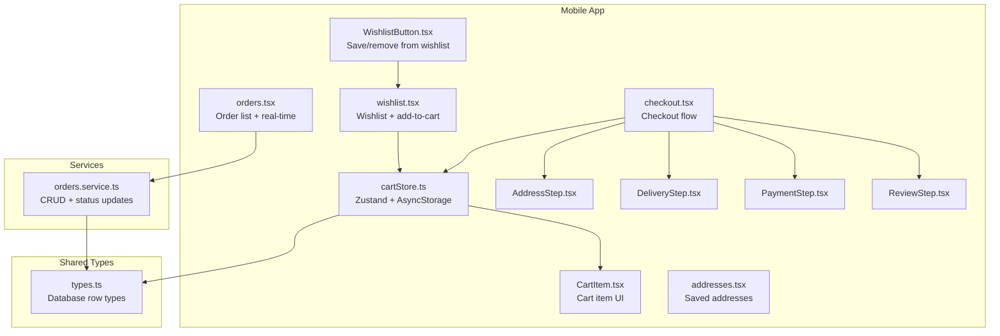
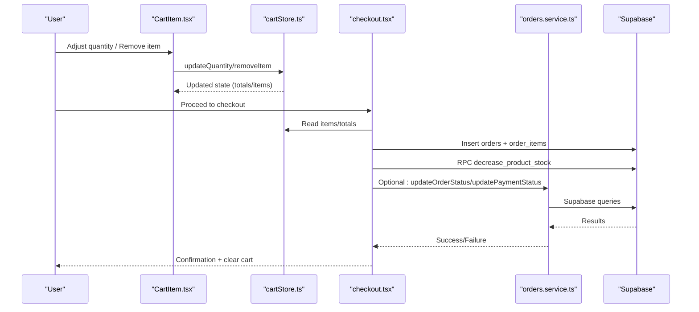
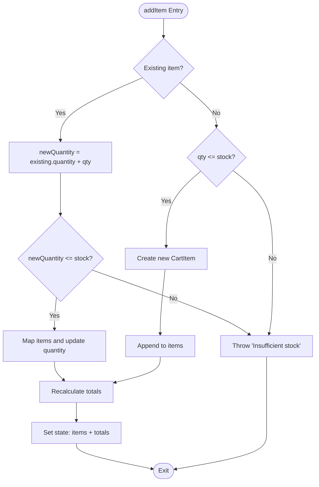
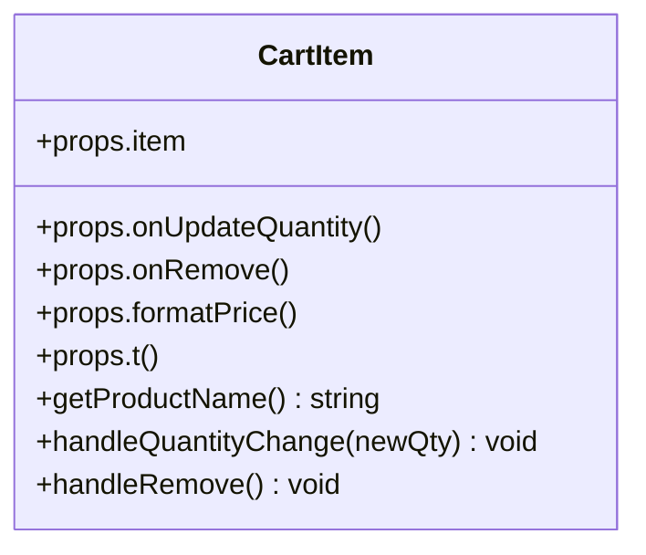
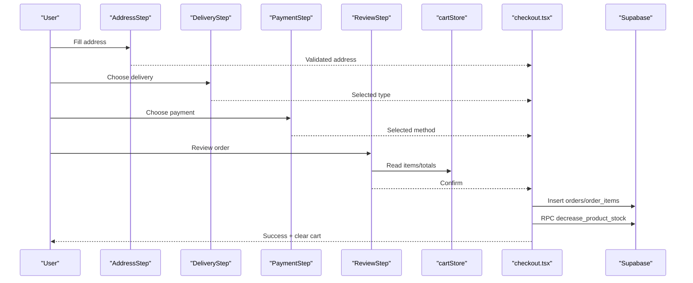
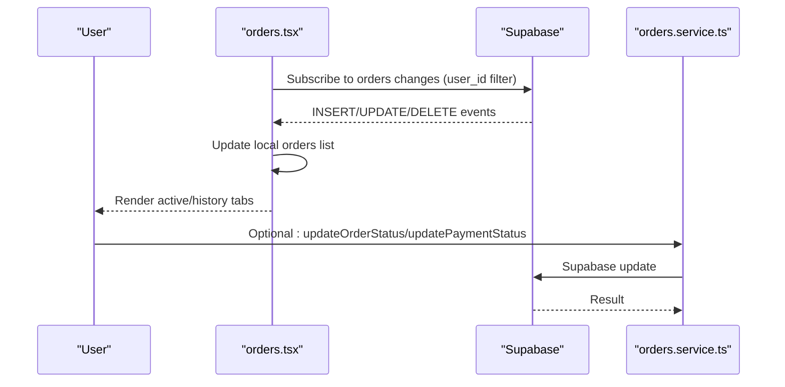
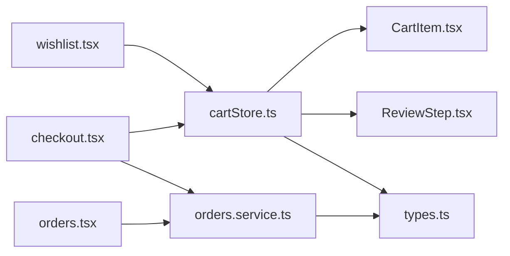

# Shopping Experience

<cite>
**Referenced Files in This Document**
- [cartStore.ts](file://store/cartStore.ts)
- [CartItem.tsx](file://components/cart/CartItem.tsx)
- [checkout.tsx](file://app/checkout.tsx)
- [AddressStep.tsx](file://components/checkout/AddressStep.tsx)
- [DeliveryStep.tsx](file://components/checkout/DeliveryStep.tsx)
- [PaymentStep.tsx](file://components/checkout/PaymentStep.tsx)
- [ReviewStep.tsx](file://components/checkout/ReviewStep.tsx)
- [checkout.ts](file://types/checkout.ts)
- [orders.service.ts](file://services/orders.service.ts)
- [orders.tsx](file://app/orders.tsx)
- [addresses.tsx](file://app/addresses.tsx)
- [wishlist.tsx](file://app/wishlist.tsx)
- [WishlistButton.tsx](file://components/ui/WishlistButton.tsx)
- [types.ts](file://shared/types.ts)
</cite>

## Table of Contents
1. [Introduction](#introduction)
2. [Project Structure](#project-structure)
3. [Core Components](#core-components)
4. [Architecture Overview](#architecture-overview)
5. [Detailed Component Analysis](#detailed-component-analysis)
6. [Dependency Analysis](#dependency-analysis)
7. [Performance Considerations](#performance-considerations)
8. [Troubleshooting Guide](#troubleshooting-guide)
9. [Conclusion](#conclusion)

## Introduction
This document explains the mobile shopping experience across cart, wishlist, addresses, checkout, and order history. It covers item lifecycle, quantity management, cart persistence, validation, pricing, inventory checks, and state management via Zustand stores with local storage and AsyncStorage. It also outlines offline cart behavior and real-time order updates.

## Project Structure
The shopping experience spans:
- State management: Zustand stores for cart (mobile) and storefront (web)
- UI components: Cart item rendering, checkout steps, order list, addresses, and wishlist
- Services: Backend interactions for orders and cart operations
- Types: Shared database and form types

**Diagram sources**
- [cartStore.ts:1-174](file://store/cartStore.ts#L1-L174)
- [CartItem.tsx:1-169](file://components/cart/CartItem.tsx#L1-L169)
- [checkout.tsx:1-491](file://app/checkout.tsx#L1-L491)
- [AddressStep.tsx:1-233](file://components/checkout/AddressStep.tsx#L1-L233)
- [DeliveryStep.tsx:1-77](file://components/checkout/DeliveryStep.tsx#L1-L77)
- [PaymentStep.tsx:1-69](file://components/checkout/PaymentStep.tsx#L1-L69)
- [ReviewStep.tsx:1-171](file://components/checkout/ReviewStep.tsx#L1-L171)
- [orders.service.ts:1-115](file://services/orders.service.ts#L1-L115)
- [orders.tsx:1-516](file://app/orders.tsx#L1-L516)
- [addresses.tsx:1-355](file://app/addresses.tsx#L1-L355)
- [wishlist.tsx:1-371](file://app/wishlist.tsx#L1-L371)
- [WishlistButton.tsx:1-103](file://components/ui/WishlistButton.tsx#L1-L103)
- [types.ts:149-244](file://shared/types.ts#L149-L244)

**Section sources**
- [cartStore.ts:1-174](file://store/cartStore.ts#L1-L174)
- [checkout.tsx:1-491](file://app/checkout.tsx#L1-L491)
- [orders.tsx:1-516](file://app/orders.tsx#L1-L516)
- [addresses.tsx:1-355](file://app/addresses.tsx#L1-L355)
- [wishlist.tsx:1-371](file://app/wishlist.tsx#L1-L371)
- [WishlistButton.tsx:1-103](file://components/ui/WishlistButton.tsx#L1-L103)
- [orders.service.ts:1-115](file://services/orders.service.ts#L1-L115)
- [types.ts:149-244](file://shared/types.ts#L149-L244)

## Core Components
- Cart store (mobile): Manages items, totals, persistence, and inventory validation.
- Cart item component: Renders product details, quantity controls, and removal.
- Checkout flow: Multi-step form collecting address, delivery method, payment method, and review.
- Orders list: Displays active and historical orders with real-time updates.
- Addresses: Lists, sets default, and deletes saved addresses.
- Wishlist: Lists saved items, removes entries, and adds to cart.
- Order service: Encapsulates backend calls for orders.

**Section sources**
- [cartStore.ts:19-29](file://store/cartStore.ts#L19-L29)
- [CartItem.tsx:6-23](file://components/cart/CartItem.tsx#L6-L23)
- [checkout.tsx:25-284](file://app/checkout.tsx#L25-L284)
- [orders.tsx:28-141](file://app/orders.tsx#L28-L141)
- [addresses.tsx:10-104](file://app/addresses.tsx#L10-L104)
- [wishlist.tsx:13-90](file://app/wishlist.tsx#L13-L90)
- [orders.service.ts:9-115](file://services/orders.service.ts#L9-L115)

## Architecture Overview
The shopping experience integrates UI components with state stores and backend services. Zustand persists cart data locally, while checkout submits orders to Supabase and triggers inventory adjustments. Real-time subscriptions keep order lists up to date.

**Diagram sources**
- [cartStore.ts:51-164](file://store/cartStore.ts#L51-L164)
- [CartItem.tsx:30-36](file://components/cart/CartItem.tsx#L30-L36)
- [checkout.tsx:152-254](file://app/checkout.tsx#L152-L254)
- [orders.service.ts:12-96](file://services/orders.service.ts#L12-L96)

## Detailed Component Analysis

### Cart Store (Mobile)
- Responsibilities:
  - Manage items, compute totals, and persist to AsyncStorage.
  - Enforce inventory limits during add/update.
  - Rehydrate and recalculate totals on app start.
- Key actions:
  - addItem(product, quantity?)
  - updateQuantity(productId, quantity)
  - removeItem(productId)
  - clearCart()
  - getItemQuantity(productId)
- Pricing:
  - Separate IQD and USD totals computed from unit prices and quantities.
- Persistence:
  - Uses Zustand persist with AsyncStorage and recalculates totals on hydration.

**Diagram sources**
- [cartStore.ts:59-99](file://store/cartStore.ts#L59-L99)
- [cartStore.ts:167-173](file://store/cartStore.ts#L167-L173)

**Section sources**
- [cartStore.ts:19-29](file://store/cartStore.ts#L19-L29)
- [cartStore.ts:51-164](file://store/cartStore.ts#L51-L164)
- [cartStore.ts:167-173](file://store/cartStore.ts#L167-L173)

### Cart Item Component
- Displays product image, name, price per unit and total, and quantity controls.
- Integrates with parent screens via callbacks for update/remove.
- Accessibility labels and RTL-aware layout.

**Diagram sources**
- [CartItem.tsx:6-23](file://components/cart/CartItem.tsx#L6-L23)

**Section sources**
- [CartItem.tsx:25-169](file://components/cart/CartItem.tsx#L25-L169)

### Checkout Flow
- Steps:
  - AddressStep: Collects full name, phone, city, area, street, landmark, and address type.
  - DeliveryStep: Selects delivery type and cost.
  - PaymentStep: Selects payment method.
  - ReviewStep: Summarizes items, delivery/payment, and costs.
- Validation:
  - Zod schema validates address fields.
  - Empty cart guard prevents submission.
- Submission:
  - Creates order and order items.
  - Inserts address if not pre-saved.
  - Decrements product stock via RPC.
  - Clears cart and navigates to order detail.

**Diagram sources**
- [AddressStep.tsx:16-76](file://components/checkout/AddressStep.tsx#L16-L76)
- [DeliveryStep.tsx:12-76](file://components/checkout/DeliveryStep.tsx#L12-L76)
- [PaymentStep.tsx:12-68](file://components/checkout/PaymentStep.tsx#L12-L68)
- [ReviewStep.tsx:35-169](file://components/checkout/ReviewStep.tsx#L35-L169)
- [checkout.tsx:152-254](file://app/checkout.tsx#L152-L254)
- [cartStore.ts:51-164](file://store/cartStore.ts#L51-L164)

**Section sources**
- [checkout.tsx:25-284](file://app/checkout.tsx#L25-L284)
- [AddressStep.tsx:16-76](file://components/checkout/AddressStep.tsx#L16-L76)
- [DeliveryStep.tsx:12-76](file://components/checkout/DeliveryStep.tsx#L12-L76)
- [PaymentStep.tsx:12-68](file://components/checkout/PaymentStep.tsx#L12-L68)
- [ReviewStep.tsx:35-169](file://components/checkout/ReviewStep.tsx#L35-L169)
- [checkout.ts:3-14](file://types/checkout.ts#L3-L14)

### Orders List and Real-Time Updates
- Loads orders for the logged-in user and separates active vs history.
- Subscribes to real-time changes for live updates without reload.
- Displays status with progress indicators and localized status texts.

**Diagram sources**
- [orders.tsx:38-85](file://app/orders.tsx#L38-L85)
- [orders.tsx:116-141](file://app/orders.tsx#L116-L141)
- [orders.service.ts:56-96](file://services/orders.service.ts#L56-L96)

**Section sources**
- [orders.tsx:28-141](file://app/orders.tsx#L28-L141)
- [orders.service.ts:56-96](file://services/orders.service.ts#L56-L96)

### Saved Addresses Management
- Lists addresses ordered by default flag.
- Allows setting default and deleting addresses.
- Integrates with checkout to prefill address and save new ones.

**Section sources**
- [addresses.tsx:10-104](file://app/addresses.tsx#L10-L104)
- [checkout.tsx:95-119](file://app/checkout.tsx#L95-L119)

### Wishlist System
- Fetches user’s wishlist with product details.
- Removes items and adds to cart with stock validation.
- Provides “out of stock” UX and low-stock warnings.

**Section sources**
- [wishlist.tsx:28-90](file://app/wishlist.tsx#L28-L90)
- [WishlistButton.tsx:33-76](file://components/ui/WishlistButton.tsx#L33-L76)

## Dependency Analysis
- State and UI:
  - CartItem depends on cartStore callbacks.
  - ReviewStep reads cartStore for totals and items.
  - Wishlist screen consumes cartStore to add items.
- Backend:
  - checkout.tsx writes orders and order_items, decrements stock via RPC.
  - orders.tsx subscribes to order changes.
  - orders.service.ts centralizes CRUD operations.
- Types:
  - shared/types.ts defines database row types used across components.

**Diagram sources**
- [cartStore.ts:51-164](file://store/cartStore.ts#L51-L164)
- [CartItem.tsx:25-169](file://components/cart/CartItem.tsx#L25-L169)
- [ReviewStep.tsx:35-169](file://components/checkout/ReviewStep.tsx#L35-L169)
- [wishlist.tsx:13-90](file://app/wishlist.tsx#L13-L90)
- [checkout.tsx:152-254](file://app/checkout.tsx#L152-L254)
- [orders.service.ts:12-96](file://services/orders.service.ts#L12-L96)
- [orders.tsx:38-85](file://app/orders.tsx#L38-L85)
- [types.ts:149-244](file://shared/types.ts#L149-L244)

**Section sources**
- [cartStore.ts:51-164](file://store/cartStore.ts#L51-L164)
- [checkout.tsx:152-254](file://app/checkout.tsx#L152-L254)
- [orders.service.ts:12-96](file://services/orders.service.ts#L12-L96)
- [orders.tsx:38-85](file://app/orders.tsx#L38-L85)
- [types.ts:149-244](file://shared/types.ts#L149-L244)

## Performance Considerations
- Large cart optimization:
  - Memoize cart item rendering to avoid unnecessary re-renders.
  - Use FlatList for wishlist and orders to virtualize lists.
  - Avoid deep object mutations; prefer immutable updates in Zustand.
- Offline cart:
  - AsyncStorage persistence ensures cart survives app restarts.
  - Totals are recalculated on hydration to reflect stored items.
- Network efficiency:
  - Real-time subscriptions reduce polling and keep order lists fresh.
  - Batch backend calls during checkout (order + items + stock) to minimize round trips.

[No sources needed since this section provides general guidance]

## Troubleshooting Guide
- Inventory errors:
  - Adding or updating quantity throws when requested quantity exceeds stock.
  - Ensure UI disables increment beyond available stock.
- Empty cart submission:
  - Checkout guards against empty carts and redirects to home.
- Real-time updates:
  - If order status does not update, verify subscription setup and user session.
- Wishlist table missing:
  - Fetch handles missing table gracefully by returning empty list.

**Section sources**
- [cartStore.ts:64-82](file://store/cartStore.ts#L64-L82)
- [cartStore.ts:115-118](file://store/cartStore.ts#L115-L118)
- [checkout.tsx:90-93](file://app/checkout.tsx#L90-L93)
- [orders.tsx:38-85](file://app/orders.tsx#L38-L85)
- [wishlist.tsx:59-66](file://app/wishlist.tsx#L59-L66)

## Conclusion
The shopping experience combines a robust cart store with modular checkout steps, real-time order updates, and persistent address and wishlist management. Zustand simplifies state handling with reliable persistence, while backend services enforce inventory and order integrity. UI components remain responsive and accessible, with clear validation and feedback mechanisms.