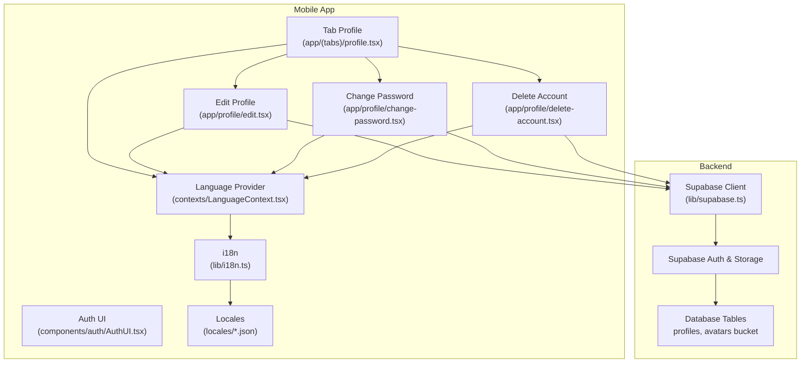
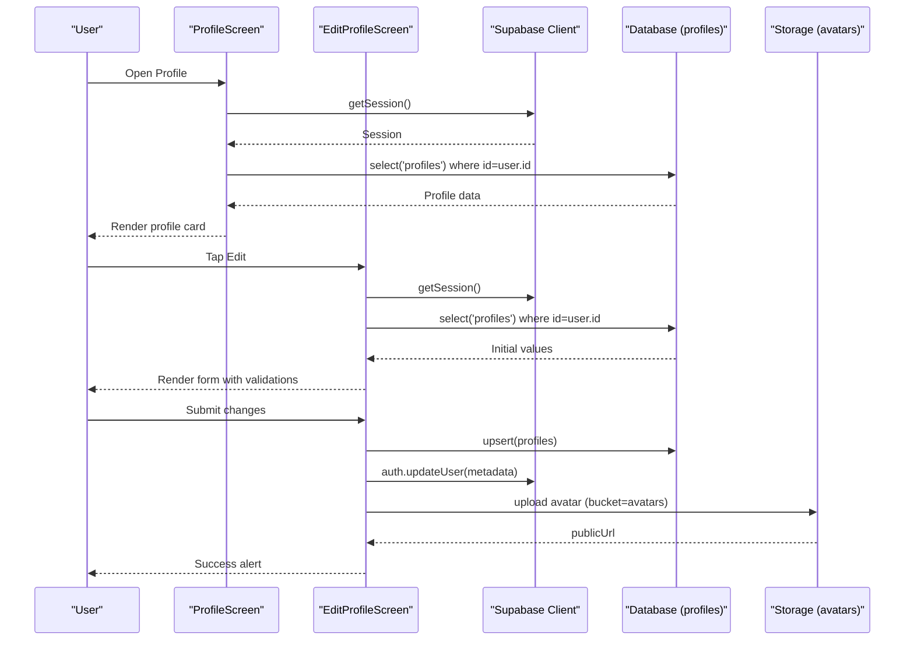
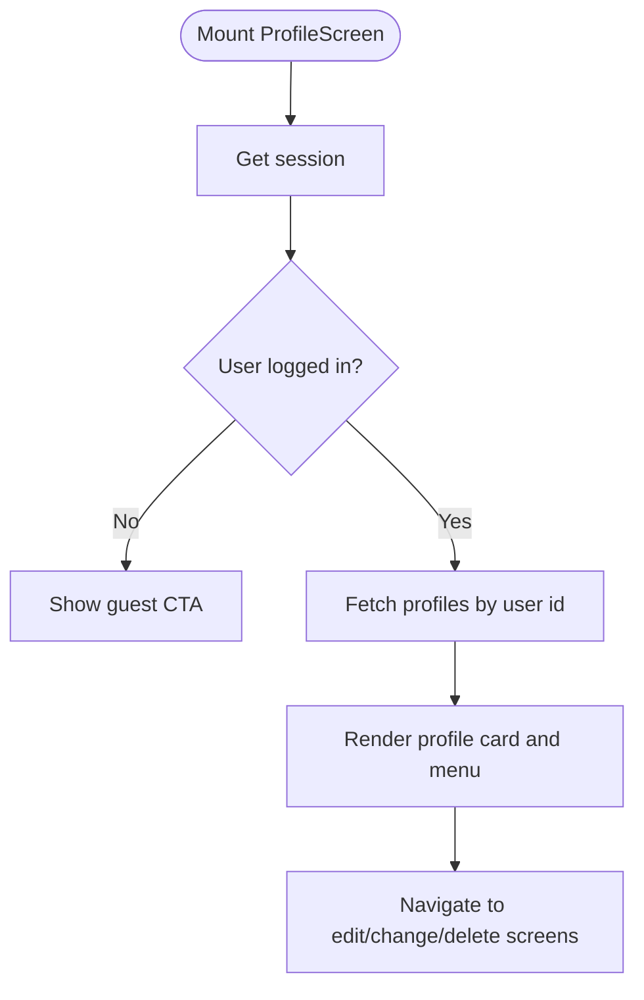
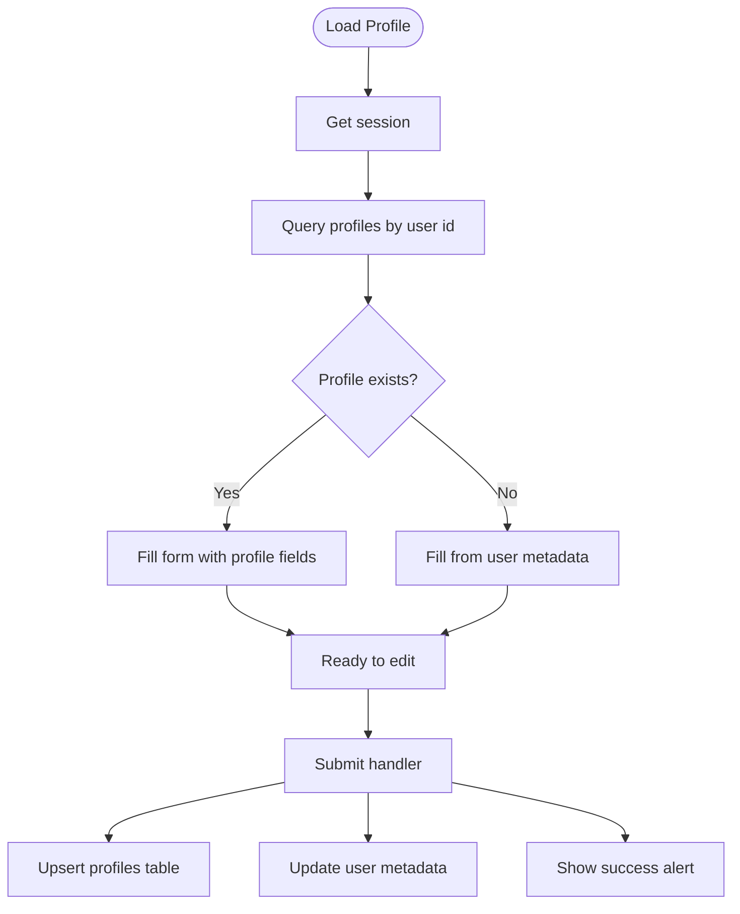
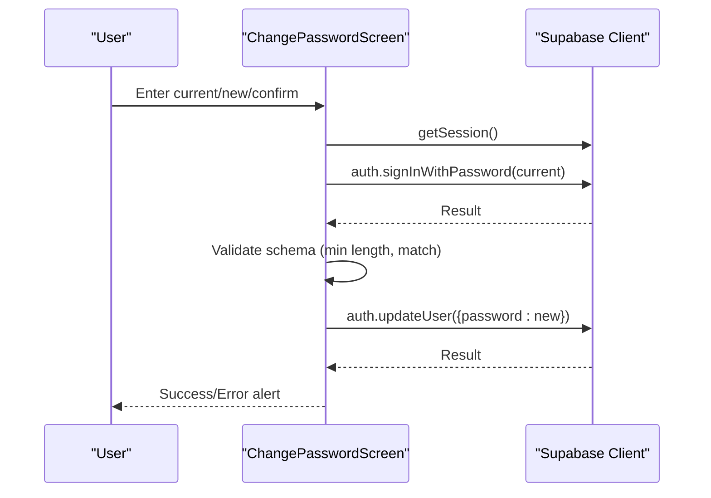
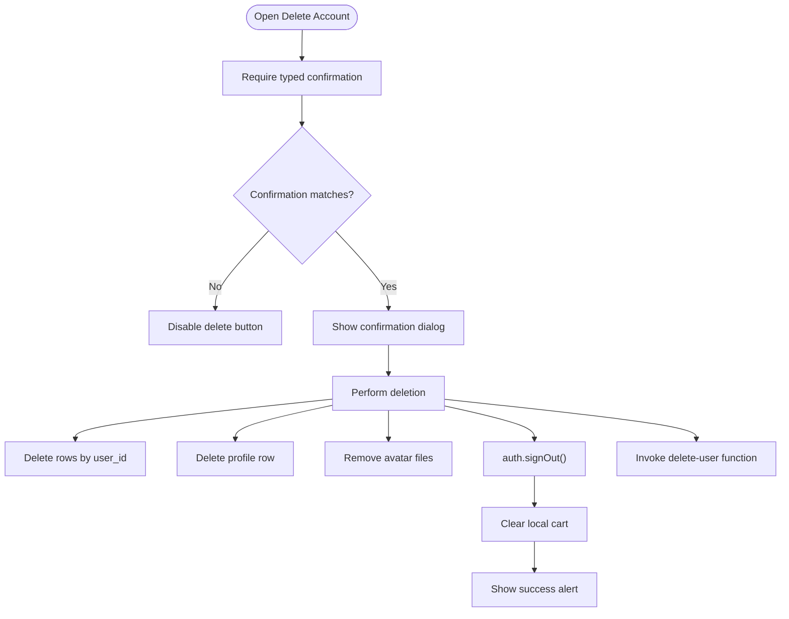
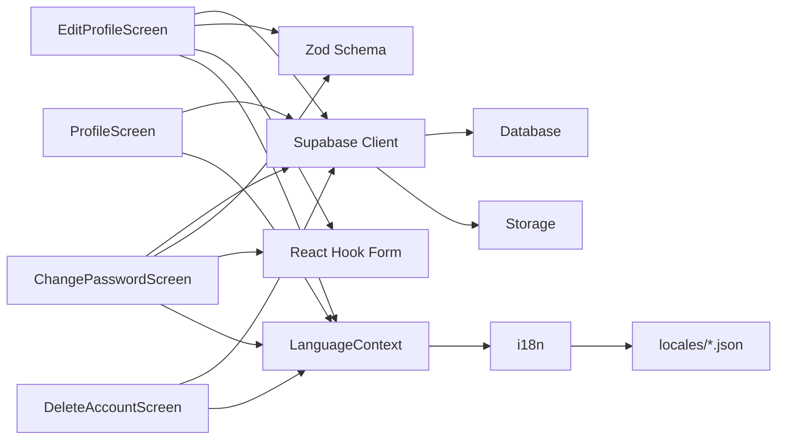

# User Profile

<cite>
**Referenced Files in This Document**
- [app/(tabs)/profile.tsx](file://app/(tabs)/profile.tsx)
- [app/profile/edit.tsx](file://app/profile/edit.tsx)
- [app/profile/change-password.tsx](file://app/profile/change-password.tsx)
- [app/profile/delete-account.tsx](file://app/profile/delete-account.tsx)
- [lib/supabase.ts](file://lib/supabase.ts)
- [hooks/useSupabase.ts](file://hooks/useSupabase.ts)
- [contexts/LanguageContext.tsx](file://contexts/LanguageContext.tsx)
- [lib/i18n.ts](file://lib/i18n.ts)
- [locales/en.json](file://locales/en.json)
- [locales/ar.json](file://locales/ar.json)
- [components/auth/AuthUI.tsx](file://components/auth/AuthUI.tsx)
- [app/_layout.tsx](file://app/_layout.tsx)
</cite>

## Table of Contents
1. [Introduction](#introduction)
2. [Project Structure](#project-structure)
3. [Core Components](#core-components)
4. [Architecture Overview](#architecture-overview)
5. [Detailed Component Analysis](#detailed-component-analysis)
6. [Dependency Analysis](#dependency-analysis)
7. [Performance Considerations](#performance-considerations)
8. [Troubleshooting Guide](#troubleshooting-guide)
9. [Conclusion](#conclusion)
10. [Appendices](#appendices)

## Introduction
This document describes the mobile user profile management system for the application. It covers editing personal information, avatar management, password changes, account deletion, and related data privacy controls. It also explains validation rules, error handling, internationalization, and how profile data is synchronized with the backend via Supabase.

## Project Structure
The profile system spans several screens and supporting modules:
- Tabbed profile overview and actions
- Profile editing form with validation
- Password change flow
- Account deletion with confirmation and cleanup
- Authentication and session management
- Internationalization and localization
- Supabase client configuration and hooks

**Diagram sources**
- [app/(tabs)/profile.tsx](file://app/(tabs)/profile.tsx#L18-L424)
- [app/profile/edit.tsx:25-634](file://app/profile/edit.tsx#L25-L634)
- [app/profile/change-password.tsx:39-372](file://app/profile/change-password.tsx#L39-L372)
- [app/profile/delete-account.tsx:10-193](file://app/profile/delete-account.tsx#L10-L193)
- [lib/supabase.ts:1-30](file://lib/supabase.ts#L1-L30)
- [contexts/LanguageContext.tsx:26-77](file://contexts/LanguageContext.tsx#L26-L77)
- [lib/i18n.ts:24-72](file://lib/i18n.ts#L24-L72)
- [locales/en.json:159-215](file://locales/en.json#L159-L215)
- [locales/ar.json:159-215](file://locales/ar.json#L159-L215)

**Section sources**
- [app/(tabs)/profile.tsx](file://app/(tabs)/profile.tsx#L18-L424)
- [app/profile/edit.tsx:25-634](file://app/profile/edit.tsx#L25-L634)
- [app/profile/change-password.tsx:39-372](file://app/profile/change-password.tsx#L39-L372)
- [app/profile/delete-account.tsx:10-193](file://app/profile/delete-account.tsx#L10-L193)
- [lib/supabase.ts:1-30](file://lib/supabase.ts#L1-L30)
- [contexts/LanguageContext.tsx:26-77](file://contexts/LanguageContext.tsx#L26-L77)
- [lib/i18n.ts:24-72](file://lib/i18n.ts#L24-L72)
- [locales/en.json:159-215](file://locales/en.json#L159-L215)
- [locales/ar.json:159-215](file://locales/ar.json#L159-L215)

## Core Components
- Tabbed Profile Screen: Displays user identity, quick actions, and settings. Handles auth state changes and navigates to edit, password change, and delete screens.
- Edit Profile Screen: Loads current profile data, validates inputs, supports avatar upload, and persists changes to both Supabase and user metadata.
- Change Password Screen: Validates current password by re-authenticating, then updates the user’s password.
- Delete Account Screen: Confirms intent, deletes related data, removes avatar, signs out, and triggers backend cleanup.
- Supabase Client: Centralized client with AsyncStorage-backed auth persistence and auto-refresh.
- Language and i18n: Provides Arabic/English translations and RTL layout switching.

**Section sources**
- [app/(tabs)/profile.tsx](file://app/(tabs)/profile.tsx#L18-L424)
- [app/profile/edit.tsx:25-634](file://app/profile/edit.tsx#L25-L634)
- [app/profile/change-password.tsx:39-372](file://app/profile/change-password.tsx#L39-L372)
- [app/profile/delete-account.tsx:10-193](file://app/profile/delete-account.tsx#L10-L193)
- [lib/supabase.ts:1-30](file://lib/supabase.ts#L1-L30)
- [contexts/LanguageContext.tsx:26-77](file://contexts/LanguageContext.tsx#L26-L77)
- [lib/i18n.ts:24-72](file://lib/i18n.ts#L24-L72)

## Architecture Overview
The profile system integrates UI screens with Supabase for authentication, database, and storage. It uses Zod for client-side validation, react-hook-form for form state, and i18n for localization.

**Diagram sources**
- [app/(tabs)/profile.tsx](file://app/(tabs)/profile.tsx#L27-L79)
- [app/profile/edit.tsx:61-104](file://app/profile/edit.tsx#L61-L104)
- [lib/supabase.ts:18-30](file://lib/supabase.ts#L18-L30)

## Detailed Component Analysis

### Tabbed Profile Screen
- Observes auth state changes and loads profile data from the database.
- Presents quick actions: orders, addresses, wishlist, language/currency settings, help, privacy, terms, logout, and delete account.
- Uses language context for RTL and translations.

**Diagram sources**
- [app/(tabs)/profile.tsx](file://app/(tabs)/profile.tsx#L27-L79)

**Section sources**
- [app/(tabs)/profile.tsx](file://app/(tabs)/profile.tsx#L18-L424)

### Edit Profile Screen
- Loads initial data from the profiles table or user metadata fallback.
- Validates full name length and optional phone number format.
- Supports avatar upload from device library with cropping and aspect ratio.
- Persists changes to profiles table and updates user metadata for consistency.
- Uses Zod resolver and react-hook-form for controlled inputs and real-time validation.

**Diagram sources**
- [app/profile/edit.tsx:61-104](file://app/profile/edit.tsx#L61-L104)
- [app/profile/edit.tsx:224-281](file://app/profile/edit.tsx#L224-L281)

**Section sources**
- [app/profile/edit.tsx:25-634](file://app/profile/edit.tsx#L25-L634)

### Change Password Screen
- Requires current password by signing in again with provided credentials.
- Enforces minimum length and matching new passwords.
- Updates the user’s password via Supabase auth.
- Provides localized success/error feedback.

**Diagram sources**
- [app/profile/change-password.tsx:97-149](file://app/profile/change-password.tsx#L97-L149)

**Section sources**
- [app/profile/change-password.tsx:39-372](file://app/profile/change-password.tsx#L39-L372)

### Delete Account Screen
- Requires typed confirmation to proceed.
- Deletes user data from related tables (addresses, notifications, wishlist, coupon_usages), profile record, and avatar from storage.
- Signs out the user and clears local cart state.
- Invokes a backend function to finalize deletion if available.

**Diagram sources**
- [app/profile/delete-account.tsx:21-100](file://app/profile/delete-account.tsx#L21-L100)

**Section sources**
- [app/profile/delete-account.tsx:10-193](file://app/profile/delete-account.tsx#L10-L193)

### Validation Rules and Forms
- Profile editing form:
  - Full name: required, minimum length enforced.
  - Phone: optional, validated against a fixed pattern; whitespace trimmed.
- Password change form:
  - Current password: required.
  - New password: minimum length.
  - Confirm password: must match new password.
- Registration and login forms (for context):
  - Registration enforces full name, phone, email, and password rules.
  - Login enforces email format and password length.

**Section sources**
- [app/profile/edit.tsx:38-47](file://app/profile/edit.tsx#L38-L47)
- [app/profile/change-password.tsx:22-35](file://app/profile/change-password.tsx#L22-L35)
- [app/auth/register.tsx:17-31](file://app/auth/register.tsx#L17-L31)
- [app/auth/login.tsx:16-19](file://app/auth/login.tsx#L16-L19)

### Error Handling and Feedback
- Session checks on sensitive operations; redirects to login if missing.
- Localized alerts for common failures (load/save/avatar upload/password change).
- Graceful fallbacks when profile data is not found (use user metadata).
- Network and backend errors surfaced via alerts.

**Section sources**
- [app/profile/edit.tsx:63-67](file://app/profile/edit.tsx#L63-L67)
- [app/profile/edit.tsx:98-100](file://app/profile/edit.tsx#L98-L100)
- [app/profile/edit.tsx:228-233](file://app/profile/edit.tsx#L228-L233)
- [app/profile/change-password.tsx:105-125](file://app/profile/change-password.tsx#L105-L125)
- [app/profile/delete-account.tsx:43-47](file://app/profile/delete-account.tsx#L43-L47)

### Internationalization and Localization
- Language provider initializes from storage or device locale, supports Arabic/English.
- i18n module manages translations and RTL direction.
- All screens consume translation keys from locale JSON files.

**Section sources**
- [contexts/LanguageContext.tsx:26-77](file://contexts/LanguageContext.tsx#L26-L77)
- [lib/i18n.ts:24-72](file://lib/i18n.ts#L24-L72)
- [locales/en.json:159-215](file://locales/en.json#L159-L215)
- [locales/ar.json:159-215](file://locales/ar.json#L159-L215)

### Data Protection and Privacy Controls
- Profile data is stored in the database and avatars in Supabase Storage.
- Users can delete their accounts, which triggers cleanup of related tables and avatar removal attempts.
- Privacy and Terms links are exposed in the profile menu.
- The app uses HTTPS and encrypted storage via Supabase and AsyncStorage.

**Section sources**
- [app/(tabs)/profile.tsx](file://app/(tabs)/profile.tsx#L383-L416)
- [app/profile/delete-account.tsx:51-65](file://app/profile/delete-account.tsx#L51-L65)

## Dependency Analysis
- UI screens depend on Supabase client for auth/session, database queries, and storage.
- Validation relies on Zod and react-hook-form.
- Localization depends on i18n and language context.
- Navigation uses expo-router.

**Diagram sources**
- [app/profile/edit.tsx:25-634](file://app/profile/edit.tsx#L25-L634)
- [app/profile/change-password.tsx:39-372](file://app/profile/change-password.tsx#L39-L372)
- [app/profile/delete-account.tsx:10-193](file://app/profile/delete-account.tsx#L10-L193)
- [app/(tabs)/profile.tsx](file://app/(tabs)/profile.tsx#L18-L424)
- [lib/supabase.ts:1-30](file://lib/supabase.ts#L1-L30)
- [contexts/LanguageContext.tsx:26-77](file://contexts/LanguageContext.tsx#L26-L77)
- [lib/i18n.ts:24-72](file://lib/i18n.ts#L24-L72)
- [locales/en.json:159-215](file://locales/en.json#L159-L215)
- [locales/ar.json:159-215](file://locales/ar.json#L159-L215)

**Section sources**
- [lib/supabase.ts:1-30](file://lib/supabase.ts#L1-L30)
- [hooks/useSupabase.ts:1-239](file://hooks/useSupabase.ts#L1-L239)
- [contexts/LanguageContext.tsx:26-77](file://contexts/LanguageContext.tsx#L26-L77)
- [lib/i18n.ts:24-72](file://lib/i18n.ts#L24-L72)

## Performance Considerations
- Minimize network calls by caching session and profile data locally during the session lifecycle.
- Debounce or batch avatar uploads and avoid unnecessary re-uploads.
- Use controlled inputs and lazy validation to reduce re-renders.
- Keep validation schemas concise and reuse common patterns.

## Troubleshooting Guide
- Session expired: Redirect to login and notify the user.
- Load/save errors: Show localized error messages and suggest retry.
- Avatar upload failures: Verify permissions and storage availability.
- Password change failures: Ensure current password is correct and new passwords match.

**Section sources**
- [app/profile/edit.tsx:63-67](file://app/profile/edit.tsx#L63-L67)
- [app/profile/edit.tsx:98-100](file://app/profile/edit.tsx#L98-L100)
- [app/profile/change-password.tsx:105-125](file://app/profile/change-password.tsx#L105-L125)
- [app/profile/delete-account.tsx:43-47](file://app/profile/delete-account.tsx#L43-L47)

## Conclusion
The profile management system provides a robust, localized, and secure way for users to manage personal information, avatar, and account security. It leverages Supabase for authentication, persistence, and storage, with clear validation, error handling, and internationalization support.

## Appendices

### Example Validation Patterns
- Full name: minimum length enforced.
- Phone: optional, validated against a fixed pattern; whitespace trimmed.
- Password: minimum length, must match confirmation; current password verified before update.

**Section sources**
- [app/profile/edit.tsx:38-47](file://app/profile/edit.tsx#L38-L47)
- [app/profile/change-password.tsx:22-35](file://app/profile/change-password.tsx#L22-L35)

### Success/Error Feedback Examples
- Success: “Profile updated successfully”, “Password changed successfully”, “Your account has been deleted successfully”.
- Error: “Failed to load data”, “Failed to save changes”, “Failed to upload image”, “Failed to change password”.

**Section sources**
- [locales/en.json:193-214](file://locales/en.json#L193-L214)
- [locales/ar.json:193-214](file://locales/ar.json#L193-L214)